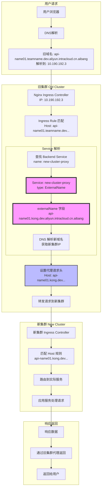

# ExternalName Service 工作流程详解

## 配置对应关系

你的理解是**完全正确**的：

```yaml
# new-ingress.yaml 中的 backend service
backend:
  service:
    name: new-cluster-proxy  # ← 这个名字
    port:
      number: 80

# external-service.yaml 中的 Service name
metadata:
  name: new-cluster-proxy    # ← 对应这个名字
spec:
  type: ExternalName
  externalName: api-name01.kong.dev.aliyun.intracloud.cn.aibang
```

## 完整的请求流程图



## 详细步骤说明

### 1. 用户请求阶段
```
用户访问: http://api-name01.teamname.dev.aliyun.intracloud.cn.aibang/api/users
↓
DNS解析: api-name01.teamname.dev.aliyun.intracloud.cn.aibang → 10.190.192.3 (旧集群IP)
```

### 2. 旧集群处理阶段
```
请求到达: 旧集群 Nginx Ingress Controller (10.190.192.3)
↓
Ingress匹配: 
  - Host: api-name01.teamname.dev.aliyun.intracloud.cn.aibang ✓
  - Path: /api/users ✓
↓
Backend查找: 
  - service.name: "new-cluster-proxy"
  - service.port: 80
```

### 3. ExternalName Service 解析
```
Service查找: new-cluster-proxy
↓
Service类型: ExternalName
↓
ExternalName字段: "api-name01.kong.dev.aliyun.intracloud.cn.aibang"
↓
DNS解析: api-name01.kong.dev.aliyun.intracloud.cn.aibang → 新集群IP
```

### 4. 代理转发阶段
```
设置请求头:
  - Host: api-name01.kong.dev.aliyun.intracloud.cn.aibang  (关键!)
  - X-Original-Host: api-name01.teamname.dev.aliyun.intracloud.cn.aibang
  - X-Forwarded-For: 用户IP
↓
转发请求: http://新集群IP/api/users
```

### 5. 新集群处理
```
新集群接收请求:
  - Host头: api-name01.kong.dev.aliyun.intracloud.cn.aibang
↓
新集群Ingress匹配:
  - Host: api-name01.kong.dev.aliyun.intracloud.cn.aibang ✓
↓
路由到新集群的实际服务
```

## 关键配置解释

### ExternalName Service 的作用
```yaml
apiVersion: v1
kind: Service
metadata:
  name: new-cluster-proxy          # Ingress backend 引用的名字
spec:
  type: ExternalName               # 关键: 不创建实际的Endpoint
  externalName: api-name01.kong.dev.aliyun.intracloud.cn.aibang  # DNS名字
```

**ExternalName Service 本质上是一个 DNS 别名**：
- 它不会创建实际的Pod或Endpoint
- 当有请求时，Kubernetes会进行DNS解析
- 将 `new-cluster-proxy` 解析为 `api-name01.kong.dev.aliyun.intracloud.cn.aibang`

### Ingress 注解的作用
```yaml
annotations:
  # 告诉nginx真正的upstream主机名
  nginx.ingress.kubernetes.io/upstream-vhost: "api-name01.kong.dev.aliyun.intracloud.cn.aibang"
  
  # 设置正确的Host头，让新集群能正确路由
  nginx.ingress.kubernetes.io/proxy-set-headers: |
    Host api-name01.kong.dev.aliyun.intracloud.cn.aibang
```

## 对比：旧配置 vs 新配置

### 旧配置 (直接路由)
```
用户请求 → 旧集群Ingress → bbdm-api Service → bbdm-api Pod
```

### 新配置 (代理路由)
```
用户请求 → 旧集群Ingress → new-cluster-proxy Service (ExternalName) 
         ↓
         DNS解析 → 新集群域名 → 新集群Ingress → 新集群服务
```

## 验证命令

```bash
# 1. 查看ExternalName Service
kubectl get service new-cluster-proxy -n aibang-1111111111-bbdm -o yaml

# 2. 查看Service的Endpoints (ExternalName类型没有Endpoints)
kubectl get endpoints new-cluster-proxy -n aibang-1111111111-bbdm

# 3. 测试DNS解析
nslookup api-name01.kong.dev.aliyun.intracloud.cn.aibang

# 4. 测试完整流程
curl -v -H "Host: api-name01.teamname.dev.aliyun.intracloud.cn.aibang" \
     http://10.190.192.3/api/test
```

这样你就能看到整个代理转发的过程了！ExternalName Service 就像一个"DNS重定向器"，让Kubernetes内部的服务名指向外部的域名。