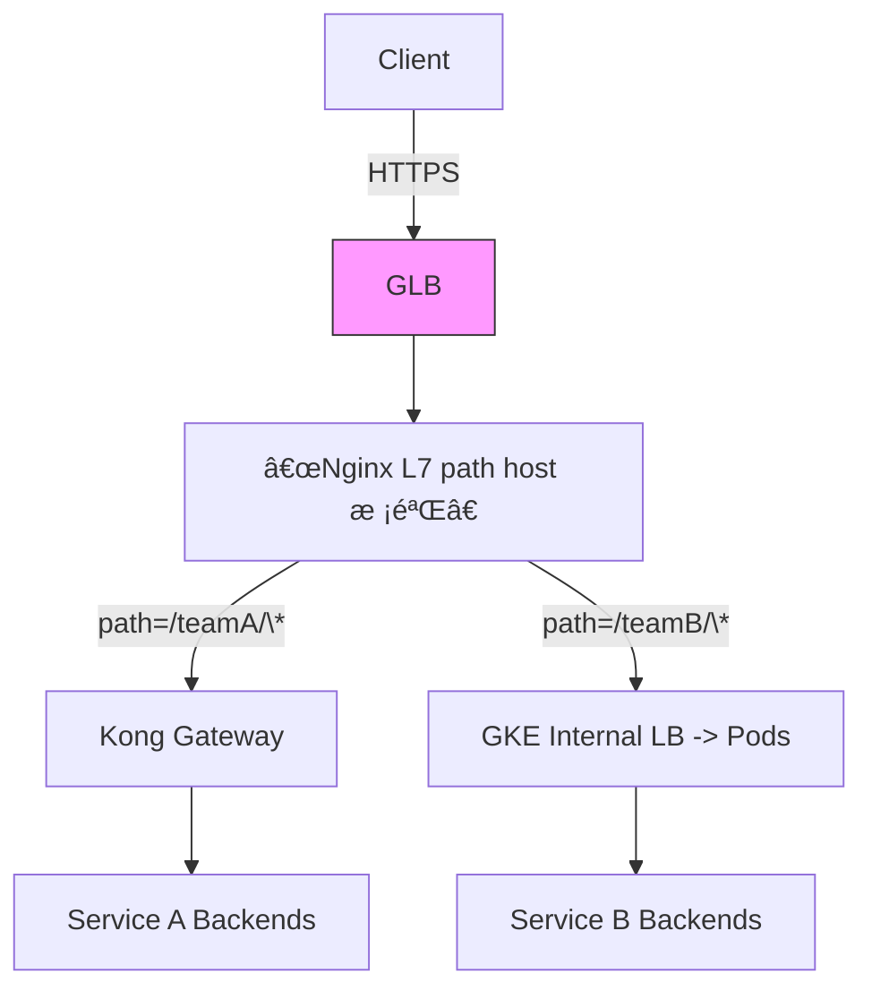

问题分æ

你当å‰æ¶æ„是：统一域å -> Google Cloud Load Balancer (GLB) -> Nginx L7（按 location 区分用户/路径）->（根æ®è·¯å¾„）走 Kong Gateway 或 ç›´æ¥åˆ° GKE Runtime çš„ LB IP。

核心决策点在äºï¼šä½¿ç”¨ å•ä¸€åŸŸå + è·¯å¾„è·¯ç”±ï¼ˆå• GLB）还是 两个域å + 两个 GLB æ¥å®ç°æµé‡åˆ†æµã€éš”离ä¸å®‰å…¨ã€‚两ç§æ–¹æ¡ˆå„有优劣，安全性ã€å¯ç”¨æ€§ã€è¿ç»´å¤æ‚度ä¸æˆæœ¬éœ€è¦æƒè¡¡ã€‚

下é¢ç»™å‡ºå®è·µå»ºè®®ã€é…置示例ã€æµç¨‹å›¾ã€ä¼˜ç¼ºç‚¹æ¯”较ä¸å®ç°æ£€æŸ¥æ¸…å•ï¼Œä¾¿äºç›´æ¥å¤åˆ¶åˆ°æ–‡æ¡£æˆ–执行。

解决方案总览（æ¨è）

1. åŸåˆ™æ€§ç»“论（简短）

- 若对租户/团队隔离ã€å®‰å…¨åˆè§„（审计/è¯ä¹¦éš”离/ACL）è¦æ±‚高，选 两个域å + 两个 GLB（更强的边界ä¸å®¡è®¡èƒ½åŠ›ï¼‰ã€‚
- 若管ç†æˆæœ¬ã€è¯ä¹¦æ•°é‡ä¸ DNS å¤æ‚度优先，且能通过严格 path/host 校验ã€mTLS/Cloud Armor åšåˆ°é€»è¾‘隔离，å•åŸŸå + å• GLB + Nginx L7 路径路由 是å¯æ¥å—且常è§çš„方案（æ¨èåšæ³•ï¼šå•åŸŸå但在边缘åšæ›´ä¸¥æ ¼çš„验è¯ä¸åˆ†æ®µéš”离）。

3.

4. 最佳折中（ä¼ä¸šçº§æ¨è）

- 使用 å•ä¸€ GLB（å•åŸŸå） 作为统一入å£ï¼Œä½†åœ¨ GLB / Cloud Armor / Certificate Manager / Edge TLS 层å®æ–½å¼ºéªŒè¯ï¼ˆmTLS/Client Cert / JWT validation），并在 Nginx å±‚åš Host å’Œ Path 严格校验ã€å¹¶é€šè¿‡ header 标注æµå‘（如 X-Gateway-Mode）。
- 对äºé«˜é£é™©æˆ–高æƒé™å®¢æˆ·ï¼Œæä¾› 独立å­åŸŸ/独立 GLB（按需开å¯ï¼‰ï¼Œå®ç°æŒ‰å®¢æˆ·/团队的强隔离（按 SLAã€åˆè§„或计费策略决定）。

6.

具体å®ç°å»ºè®®ä¸å®‰å…¨è€ƒé‡

1. GLB & TLS 层（边缘层）

- 在 GLB 层å¯ç”¨ HTTPS，使用 Cloud Certificate Manager 管ç†è¯ä¹¦ï¼›å¯¹é«˜å®‰å…¨å®¢æˆ·å¯ç”¨ mTLS（客户端è¯ä¹¦ï¼‰ã€‚
- 使用 Cloud Armor åšè¾¹ç¼˜ WAFã€IP 黑白åå•ã€é€Ÿç‡é™åˆ¶ï¼ˆper IP / per path）。
- 若使用å•åŸŸå，建议基äºè·¯å¾„ + JWT or client cert æ¥åŒºåˆ†æ˜¯å¦å…许走 Kong 路径或直达 GKE。
- ä¿ç•™å¹¶è½¬å‘åŸå§‹ Hostã€X-Forwarded-For ä¸ X-Forwarded-Proto。

2. Nginx L7（边缘åå‘代ç†ï¼‰

- 严格校验 Host/Path：åªå…许预定义 host/path 组åˆï¼Œé¿å… path overlap 导致误路由。
- 设置å端路由时显å¼ä½¿ç”¨ upstream（Kong 或 GKE LB），ä¸è¦ä¾èµ–模糊 rewrite。
- 注入安全/追踪 header，例如：

- proxy_set_header X-Forwarded-For $proxy_add_x_forwarded_for;
- proxy_set_header Host $host;
- proxy_set_header X-Gateway-Mode "kong"; 或 "nogateway"（详细说æ˜è§ä¸‹ï¼‰
- proxy_set_header X-Request-ID $request_id;（trace）

-
- 对关键路径å¯ç”¨é¢å¤–速ç‡é™åˆ¶ï¼ˆlimit_req）ã€è¿æ¥/timeout é™åˆ¶ï¼Œé˜²æ­¢æ…¢é€Ÿè¿æ¥è€—尽资æºã€‚
- 对上传/大 body 的路径å•ç‹¬é™åˆ¶ client_max_body_size。

3. Kong Gateway（如æœèµ° Kong）

- 在 Kong 上åšæµé‡æ²»ç†ï¼ˆRate Limitingã€ACLã€Auth æ’件ã€æ—¥å¿—ã€Prometheus/Tracing）。
- Kong å‰ç«¯å»ºè®®åªæ¥å—æ¥è‡ª Nginx 或 GLB çš„æµé‡ï¼ˆé€šè¿‡ IP 白åå•æˆ– mTLS ä¿è¯ï¼‰ï¼Œé¿å…ç›´æ¥å¯¹å¤–暴露。
- Kong çš„è·¯ç”±è§„åˆ™åº”åŸºäº Host + Path 或 X-Consumer-Id，é¿å…过度ä¾èµ–路径模糊匹é…。

4. ç›´æ¥åˆ° GKE Runtime（No Gateway）

- 对直æ¥è®¿é—®çš„ GKE Backend 使用 Internal HTTP(S) LB / NEG，并在 Nginx 中 proxy_pass 到内部 IP 或 NEG çš„å端æœåŠ¡ã€‚
- GKE Ingress/Service 应å¯ç”¨ readinessProbeã€livenessProbe ä¸åˆç†çš„超时ä¸è¿æ¥é™åˆ¶ï¼Œé¿å…å端ä¸å¯ç”¨å¯¼è‡´è¿é”失败。
- 使用ç§æœ‰è¿æ¥ï¼ˆInternal Load Balancer 或 VPC/NAT）æ¥å‡å°‘公网暴露。

5. Header 设计ä¸æµå‘标识（关äº

X-Gateway-Mode

）

- 使用 X-Gateway-Mode 仅作为内部路由/策略标记（例如 "kong" 或 "nogateway"）。但必须注æ„：

- ä¸è¦ä¾èµ–ä¸å¯ä¿¡ header åšå®‰å…¨å†³ç­–（æ¥è‡ªå¤–部的 header å¯ä¼ªé€ ï¼‰ã€‚必须由 边缘 Nginx 在å¯ä¿¡è¾¹ç•Œæ³¨å…¥ï¼Œå¹¶ä¸”å端åªä¿¡ä»»æ¥è‡ªç‰¹å®šæºï¼ˆGLB/Nginx）的 headerï¼ˆé€šè¿‡æº IP 白åå•ã€mTLS 或ç§æœ‰ç½‘络ä¿è¯ï¼‰ã€‚
- 示例（在 Nginx 边缘注入）：

-

proxy_set_header X-Gateway-Mode "kong";

-

-
- å端根æ®è¯¥ header åšç›‘æ§/路由/日志标注，但关键的 æƒé™éªŒè¯ä»åœ¨ Kong / å端åšã€‚
-

å•åŸŸåï¼ˆå• GLB） vs åŒåŸŸåï¼ˆåŒ GLB）对比表

|               |                              |                                       |
| ------------- | ---------------------------- | ------------------------------------- |
| 维度          | å•åŸŸå + å• GLB              | åŒåŸŸå + åŒ GLB                       |
| 管ç†å¤æ‚度    | ä½ï¼ˆå•è¯ä¹¦/å• LB），DNS ç®€å• | 高（多个è¯ä¹¦ã€å¤šä¸ª LB）               |
| æˆæœ¬          | è¾ƒä½                         | 较高（æ¯ä¸ª GLB æˆæœ¬ï¼‰                 |
| 隔离/安全     | 逻辑隔离（å¯è¡Œä½†éœ€é¢å¤–æ§åˆ¶ï¼‰ | 较强的边界隔离（物ç†/网络隔离）       |
| 部署/å˜æ›´é£é™© | 较集中，å˜æ›´å½±å“æ•´ä¸ªå¹³å°     | å¯åœ¨å•ä¸ª GLB 上é€æ­¥å˜æ›´ï¼Œä¸å½±å“å¦ä¸€ä¾§ |
| åˆè§„/审计     | 较难å•ç‹¬æ»¡è¶³é«˜åˆè§„客户       | 易äºæ»¡è¶³é«˜åˆè§„或独立计费客户          |
| å¯æ‰©å±•æ€§      | 中等                         | æ›´çµæ´»ï¼ˆå¯ç‹¬ç«‹æ‰©å®¹ï¼‰                  |

æ¨èé…置示例（关键片段）

Nginx 路由示例（按 path 分å‘到 Kong 或 GKE）
```server {

listen 443 ssl;

server_name api.example.com;

# TLS certs managed at GLB，若 Nginx ä¹Ÿåš TLS，放置è¯ä¹¦

# ssl_certificate /etc/ssl/certs/...

# ssl_certificate_key /etc/ssl/private/...

# 通用 header

set $upstream "";

location /teamA/ {

# èµ° Kong

proxy_set_header Host $host;

proxy_set_header X-Forwarded-For $proxy_add_x_forwarded_for;

proxy_set_header X-Forwarded-Proto $scheme;

proxy_set_header X-Gateway-Mode "kong";

proxy_set_header X-Request-ID $request_id;

proxy_pass https://kong-upstream;   # kong upstream å称 / ip

proxy_connect_timeout 5s;

proxy_read_timeout 30s;

}

location /teamB/ {

# ç›´æ¥åˆ° GKE å端（Internal LB / NEG）

proxy_set_header Host $host;

proxy_set_header X-Forwarded-For $proxy_add_x_forwarded_for;

proxy_set_header X-Forwarded-Proto $scheme;

proxy_set_header X-Gateway-Mode "nogateway";

proxy_set_header X-Request-ID $request_id;

proxy_pass http://gke-internal-lb;  # GKE internal LB IP/域å

proxy_connect_timeout 5s;

proxy_read_timeout 60s;

}

# 默认拒ç»æˆ–è¿”å› 404，é¿å…未被宣告的路径被绕过

location / {

return 404;

}

}

```

Cloud Armor 示例策略（概念）

- 针对 /admin 或æ•æ„Ÿè·¯å¾„å¯ç”¨ Geo/Threat/Rate limit 策略。
- 对 Kong ç®¡ç† API åªå…è®¸å†…ç½‘æˆ–ç‰¹å®šç®¡ç† IP 范围访问。

æµç¨‹å›¾ï¼ˆMermaid）


æ“作检查清å•ï¼ˆéƒ¨ç½²å‰ï¼‰

1. GLB 层

- TLS/è¯ä¹¦ç­–略确定（å•åŸŸ/多域）；Certificate Manager é…置完毕。
- è‹¥éœ€è¦ mTLS：上传并测试 client cert flow。
- Cloud Armor ç­–ç•¥é…置（速ç‡é™åˆ¶ã€IP 白åå•ã€WAF 规则）。

3.

4. Nginx

- æ˜ç¡® location 到 upstream 的映射清å•ï¼ˆé¿å…é‡å ï¼‰ã€‚
- ç¡®ä¿ Nginx åªæ¥æ”¶æ¥è‡ª GLB çš„æµé‡ï¼ˆæ£€æŸ¥æº IP / header）。
- 注入å¯ä¿¡ header（如 X-Gateway-Mode, X-Request-ID），并在å端仅信任æ¥è‡ª Nginx çš„ header。

6.

7. Kong

- Kong 仅对 Nginx/GLB å¯è¾¾ï¼ˆç½‘络/防ç«å¢™è§„则）。
- 在 Kong 上å¯ç”¨ rate-limitingã€authã€loggingã€tracing。

9.

10. GKE å端

- Ingress/Service 使用 Internal LB 或 NEG（视安全需求）。
- Probe/timeout/HPA 设置åˆé€‚，é¿å…å‡çº§æ—¶ 502。

12.

13. 测试

- 路由正确性测试（覆盖所有 path）。
- 安全测试：å°è¯•ä¼ªé€  X-Gateway-Mode header，确认被拒ç»ã€‚
- 性能ä¸å®¹é‡æµ‹è¯•ï¼ˆæŒ‰é¢„期并å‘ã€å‹æµ‹ä¸åŒè·¯å¾„）。
- 故障演练：关闭 Kong 节点 / 下线 Pod，验è¯é™çº§ & é‡è¯•è¡Œä¸ºã€‚

15.

注æ„事项 & 最佳å®è·µ

- ä¸è¦ä¿¡ä»»æ¥è‡ªå…¬ç½‘çš„ header：所有内部标记 header 必须由å¯ä¿¡è¾¹ç•Œï¼ˆNginx）注入，并在åç«¯é€šè¿‡æº IP / mTLS 验è¯å…¶å¯ä¿¡åº¦ã€‚
- é¿å… path é‡å ï¼šåœ¨è®¾è®¡ location 时使用æ˜ç¡®å‰ç¼€å¹¶è®°å½•ä¼˜å…ˆçº§ã€‚
- 日志ä¸è¿½è¸ªï¼šåœ¨è¾¹ç¼˜ï¼ˆNginx）ã€Kong ä¸å端统一注入 X-Request-ID 并将日志导出到集中日志系统（例如 Stackdriver / BigQuery）用äºæ’查。
- 最å°æš´éœ²åŸåˆ™ï¼šKong ç®¡ç† APIã€K8S API ä¸åº”ç›´æ¥æš´éœ²å…¬ç½‘。
- é™æµä¸ç†”断：在 Kong（或边缘）å®ç°é€Ÿç‡é™åˆ¶ä¸ç†”断策略，防止å•ä¸ªå®¢æˆ·æˆ–路径耗尽资æºã€‚
- è¯ä¹¦ç®¡ç†ï¼šä½¿ç”¨è‡ªåŠ¨åŒ–（Certificate Manager 或 ACME）统一管ç†è¯ä¹¦ï¼Œé¿å…过期导致生产中断。
- 监æ§å‘Šè­¦ï¼šåœ¨ GLB/Nginx/Kong/GKE å„层建立 SLO/alert（5xxã€latencyã€error-rate）并åšè‡ªåŠ¨åŒ–告警。

结论（一å¥è¯ï¼‰

- 若需è¦å¼ºéš”离ä¸åˆè§„：åŒåŸŸå + åŒ GLB。
- 若追求管ç†ç®€æ´ä¸”å¯ä»¥é€šè¿‡è¾¹ç¼˜å¼ºåŒ–安全：å•åŸŸå + å• GLB + 严格边缘验è¯ä¸é€»è¾‘隔离（在大多数场景这是性价比最高的选择）。
- ä¸è®ºå“ªç§ï¼Œå…³é”®åœ¨äºè¾¹ç¼˜çš„强验è¯ï¼ˆmTLS/Cloud Armor/JWT）+ Nginx 的严格校验 + å端åªä¿¡ä»»å¯ä¿¡æ¥æºã€‚

如æœä½ æ„¿æ„，我å¯ä»¥åŸºäºä½ å½“å‰çš„具体 location 列表和已有的 upstream（Kong IP / GKE LB 域å）直æ¥ç”Ÿæˆï¼š

- 一份完整的 Nginx server é…ç½®ï¼ˆå« limit_reqã€timeoutsã€upstream`），以åŠ
- 对应的 Cloud Armor / GLB é…ç½®è¦ç‚¹æ¸…å•å’Œæµ‹è¯•ç”¨ä¾‹ã€‚

å‘Šè¯‰æˆ‘ä½ æƒ³å…ˆè¦ â€œå®Œæ•´ Nginx é…置†还是 “按用户隔离的域å策略文档（åŒåŸŸå示例）â€ï¼Œæˆ‘就直æ¥ç»™å‡ºå¯å¤åˆ¶çš„ Markdown/YAML é…置。

当然å¯ä»¥ ğŸ‘

以下是根æ®ä½ æè¿°çš„æ¶æ„æµç¨‹ç»˜åˆ¶çš„完整 Mermaid æµç¨‹å›¾ï¼Œå±•ç¤ºä»å¤–部用户请求到最终å端 GKE Runtime 的两ç§åˆ†æµè·¯å¾„（ç»è¿‡ Kong Gateway ä¸ No Gateway ç›´è¾¾ GKE）：

```mermaid
flowchart TD

    %% ==== å¤–éƒ¨å…¥å£ ====

    A["Client (User / API Consumer)"] -->|"HTTPS Request"| B["Google Cloud Load Balancer (GLB)"]


    %% ==== GLB 到 Nginx L7 ====

    B -->|"Forward to Nginx L7"| C["Nginx L7 (Reverse Proxy + Path Routing)"]


    %% ==== Nginx 路由分支 ====

    C -->|"Path = /teamA/*  → X-Gateway-Mode='kong'"| D["Kong Gateway"]

    C -->|"Path = /teamB/*  → X-Gateway-Mode='nogateway'"| E["GKE Internal Load Balancer"]


    %% ==== 下游分支 ====

    D --> F["Kong Upstream Service(s)"]

    E --> G["GKE Runtime Service(s) (Pods)"]


    %% ==== 辅助组件 ====

    B -.->|"TLS Termination / Cloud Armor / mTLS Validation"| BNote["GLB Security Layer"]

    C -.->|"Strict Host/Path Check + Header Injection"| CNote["Nginx Security Layer"]

    D -.->|"Auth / Rate Limit / Logging / Plugin"| DNote["Kong Policy Layer"]


    %% ==== æ ·å¼è®¾ç½® ====

    style A fill:#b3e5fc,stroke:#0277bd,stroke-width:1px

    style B fill:#f9f,stroke:#8e24aa,stroke-width:1px

    style C fill:#ffe0b2,stroke:#ef6c00,stroke-width:1px

    style D fill:#c8e6c9,stroke:#2e7d32,stroke-width:1px

    style E fill:#c5cae9,stroke:#283593,stroke-width:1px

    style F fill:#a5d6a7,stroke:#1b5e20,stroke-width:1px

    style G fill:#9fa8da,stroke:#1a237e,stroke-width:1px

    style BNote fill:#fce4ec,stroke:#ad1457,stroke-width:1px,stroke-dasharray: 3

    style CNote fill:#fff3e0,stroke:#ef6c00,stroke-width:1px,stroke-dasharray: 3

    style DNote fill:#e8f5e9,stroke:#2e7d32,stroke-width:1px,stroke-dasharray: 3
```

🔠图解说æ˜

|        |                  |                                                                           |
| ------ | ---------------- | ------------------------------------------------------------------------- |
| 层级   | 组件             | è¯´æ˜                                                                      |
| å…¥å£å±‚ | GLB              | 统一 HTTPS å…¥å£ï¼Œè´Ÿè´£ TLS 终止ã€Cloud Armorã€mTLS 验è¯ã€WAF 防护。        |
| 边缘层 | Nginx L7         | 按 location / path 区分用户类å‹ï¼Œå¹¶æ³¨å…¥å¯ä¿¡ Header（如 X-Gateway-Mode）。 |
| æ²»ç†å±‚ | Kong Gateway     | 对部分用户æµé‡æ‰§è¡Œè®¤è¯ã€é™æµã€æ—¥å¿—ä¸ç­–ç•¥æ§åˆ¶ã€‚                            |
| ç›´è¿å±‚ | GKE Internal LB  | 对无需 Kong çš„æœåŠ¡ç›´æ¥åå‘代ç†è‡³ GKE Runtime。                            |
| å端层 | GKE Runtime Pods | è¿è¡Œå„用户的å®é™…业务æœåŠ¡ï¼ˆService / Deployment）。                        |

是å¦å¸Œæœ›æˆ‘继续补充：

- å®‰å…¨è·¯å¾„æ‰©å±•å›¾ï¼ˆåŒ…å« mTLSã€Cloud Armorã€Header Validation 逻辑）  
     还是
- åŒåŸŸåï¼ˆåŒ GLB）æ¶æ„对比版（两个 GLB 两个入å£å¹¶è¡Œï¼‰ï¼Ÿ

我å¯ä»¥ç›´æ¥ç”»å‡ºå¯¹åº”的第二张 Mermaid 图帮助你比较两ç§æ–¹æ¡ˆã€‚

é常好 ğŸ‘

下é¢æˆ‘为你绘制 第二张 Mermaid æ¶æ„对比图 —— 展示 åŒåŸŸåã€åŒ GLB 分æµæ¶æ„，这是一ç§æ›´å®‰å…¨ã€éš”离性更强的ä¼ä¸šçº§åšæ³•ã€‚

🧩 åŒåŸŸå + åŒ GLB æ¶æ„æµç¨‹å›¾

（一个走 Kong Gateway，å¦ä¸€ä¸ªç›´è¾¾ GKE Runtime）

```mermaid
flowchart TD
    %% ==== 外部用户 ====

    A1["Client (Team A User)"] -->|"Access: api-teamA.example.com"| B1["GLB-A (Team A Entry)"]

    A2["Client (Team B User)"] -->|"Access: api-teamB.example.com"| B2["GLB-B (Team B Entry)"]


    %% ==== GLB 层 ====

    B1 -->|"HTTPS / mTLS / Cloud Armor"| C1["Nginx L7 (Team A Edge)"]

    B2 -->|"HTTPS / Cloud Armor"| C2["Nginx L7 (Team B Edge)"]


    %% ==== Nginx 层路由 ====

    C1 -->|"Forward to Kong Gateway"| D1["Kong Gateway (Auth / RateLimit / Plugins)"]

    C2 -->|"Forward to Internal GKE LB"| D2["GKE Internal Load Balancer"]


    %% ==== å端层 ====

    D1 --> E1["Team A - GKE Runtime (Pods / Services)"]

    D2 --> E2["Team B - GKE Runtime (Pods / Services)"]


    %% ==== 安全æ§åˆ¶è¯´æ˜ ====

    B1 -.->|"Dedicated TLS Cert / TrustConfig (mTLS)"| B1Note["Security Boundary A"]

    B2 -.->|"Dedicated TLS Cert / Policy"| B2Note["Security Boundary B"]

    D1 -.->|"Auth / ACL / Logging / Tracing"| D1Note["Kong Governance Layer"]

    D2 -.->|"Internal Access / Namespace Isolation"| D2Note["Runtime Protection"]


    %% ==== æ ·å¼ ====

    style A1 fill:#b3e5fc,stroke:#0277bd,stroke-width:1px

    style A2 fill:#b3e5fc,stroke:#0277bd,stroke-width:1px

    style B1 fill:#f9f,stroke:#8e24aa,stroke-width:1px

    style B2 fill:#f9f,stroke:#8e24aa,stroke-width:1px

    style C1 fill:#ffe0b2,stroke:#ef6c00,stroke-width:1px

    style C2 fill:#ffe0b2,stroke:#ef6c00,stroke-width:1px

    style D1 fill:#c8e6c9,stroke:#2e7d32,stroke-width:1px

    style D2 fill:#c5cae9,stroke:#283593,stroke-width:1px

    style E1 fill:#a5d6a7,stroke:#1b5e20,stroke-width:1px

    style E2 fill:#9fa8da,stroke:#1a237e,stroke-width:1px

    style B1Note fill:#fce4ec,stroke:#ad1457,stroke-width:1px,stroke-dasharray: 3

    style B2Note fill:#fce4ec,stroke:#ad1457,stroke-width:1px,stroke-dasharray: 3

    style D1Note fill:#e8f5e9,stroke:#2e7d32,stroke-width:1px,stroke-dasharray: 3

    style D2Note fill:#e8f5e9,stroke:#2e7d32,stroke-width:1px,stroke-dasharray: 3
```

📘 æ¶æ„对比说æ˜

|                |                                  |                                    |
| -------------- | -------------------------------- | ---------------------------------- |
| 项目           | å•åŸŸå + å• GLB                  | åŒåŸŸå + åŒ GLB                    |
| å…¥å£åŸŸå       | 一个公共域å（统一访问入å£ï¼‰     | å„用户/å›¢é˜Ÿç‹¬ç«‹åŸŸå                |
| GLB 层安全策略 | 统一 Armor / mTLS é…置，逻辑隔离 | 独立 Armor / TrustConfig，物ç†éš”离 |
| è¯ä¹¦ç®¡ç†       | å•ä¸€è¯ä¹¦ï¼ˆç»Ÿä¸€å…¥å£ï¼‰             | æ¯ä¸ª GLB å„自è¯ä¹¦ï¼Œå¯ç‹¬ç«‹æ›´æ–°      |
| 租户隔离       | 逻辑隔离（ä¾èµ– Header / Path）   | 网络级隔离（完全ä¸åŒå…¥å£ï¼‰         |
| åˆè§„ä¸å®¡è®¡     | å…±äº«æ—¥å¿—æµ                       | 独立审计链路，更易满足åˆè§„è¦æ±‚     |
| 部署å¤æ‚度     | ç®€å•                             | 较高（更多 LBã€è¯ä¹¦ã€DNS）         |
| æ¨è场景       | 多租户共享平å°ã€ä½é£é™©ä¸šåŠ¡       | 高安全ã€é«˜ SLAã€ç‹¬ç«‹è®¡è´¹/客户ç¯å¢ƒ  |

✅ 设计建议总结

|          |                                                                             |
| -------- | --------------------------------------------------------------------------- |
| 层级     | 最佳å®è·µ                                                                    |
| GLB 层   | 按域å划分租户；æ¯ä¸ª GLB å¯ç”¨ mTLS / Cloud Armor；独立 SSL è¯ä¹¦ã€‚           |
| Nginx 层 | æ¯ä¸ªç§Ÿæˆ·ç‹¬ç«‹é…置文件或命å空间；ä¿æŒç®€å•å代逻辑。                          |
| Kong 层  | ä»…åœ¨éœ€è¦ API æ²»ç†çš„租户å¯ç”¨ï¼›é€šè¿‡ Kong Admin API 或 DBless 模å¼ç‹¬ç«‹é…置。   |
| GKE 层   | å„租户独立 Namespaceï¼›RBAC + NetworkPolicy æ§åˆ¶è®¿é—®ï¼›HPA + PDB æ高å¯ç”¨æ€§ã€‚ |

是å¦å¸Œæœ›æˆ‘æ¥ä¸‹æ¥è¡¥å……一张 “安全æ§åˆ¶ç‚¹è§†å›¾â€ çš„ Mermaid 图？

它会标出整æ¡é“¾è·¯ä¸Šå¯é…置的 mTLSã€Cloud Armorã€Header Validationã€Authã€Rate Limitã€NetworkPolicy ç­‰æ§åˆ¶ç‚¹ï¼Œæ–¹ä¾¿å®‰å…¨å®¡è®¡å’Œæ¶æ„展示。
