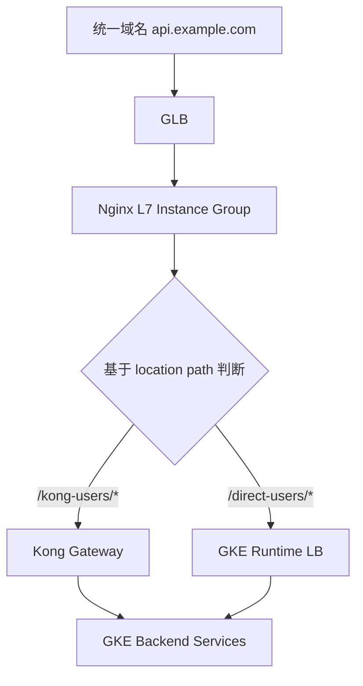
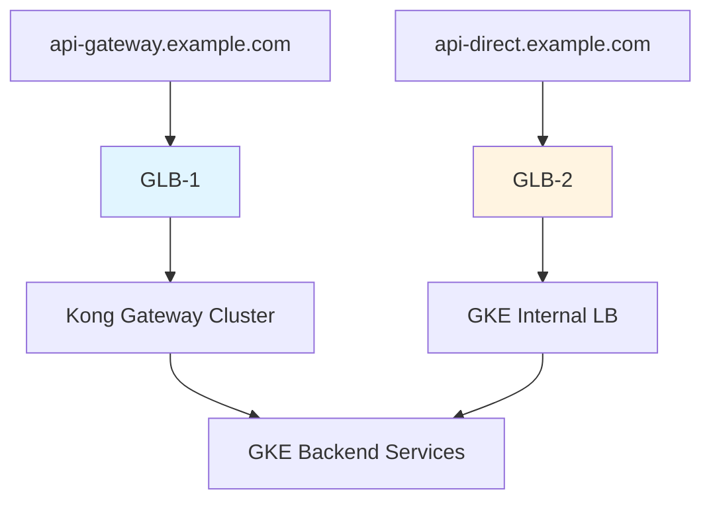
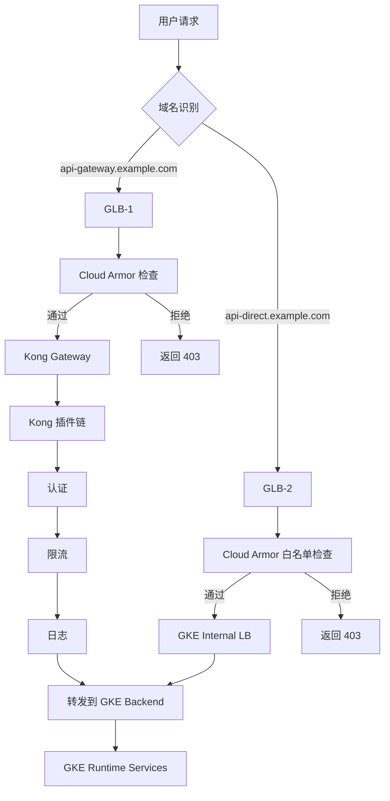
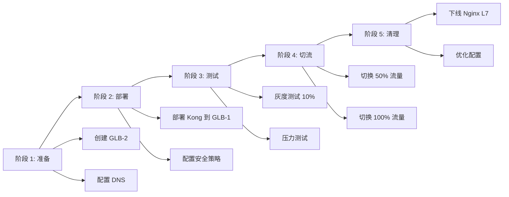

问题分析

你当前架构是：统一域名 -> Google Cloud Load Balancer (GLB) -> Nginx L7（按 location 区分用户/路径）->（根据路径）走 Kong Gateway 或 直接到 GKE Runtime 的 LB IP。

核心决策点在于：使用 单一域名 + 路径路由（单 GLB）还是 两个域名 + 两个 GLB 来实现流量分流、隔离与安全。两种方案各有优劣，安全性、可用性、运维复杂度与成本需要权衡。

下面给出实践建议、配置示例、流程图、优缺点比较与实现检查清单，便于直接复制到文档或执行。

解决方案总览（推荐）

1. 原则性结论（简短）

- 若对租户/团队隔离、安全合规（审计/证书隔离/ACL）要求高，选 两个域名 + 两个 GLB（更强的边界与审计能力）。
- 若管理成本、证书数量与 DNS 复杂度优先，且能通过严格 path/host 校验、mTLS/Cloud Armor 做到逻辑隔离，单域名 + 单 GLB + Nginx L7 路径路由 是可接受且常见的方案（推荐做法：单域名但在边缘做更严格的验证与分段隔离）。

3.

4. 最佳折中（企业级推荐）

- 使用 单一 GLB（单域名） 作为统一入口，但在 GLB / Cloud Armor / Certificate Manager / Edge TLS 层实施强验证（mTLS/Client Cert / JWT validation），并在 Nginx 层做 Host 和 Path 严格校验、并通过 header 标注流向（如 X-Gateway-Mode）。
- 对于高风险或高权限客户，提供 独立子域/独立 GLB（按需开启），实现按客户/团队的强隔离（按 SLA、合规或计费策略决定）。

6.

具体实现建议与安全考量

1. GLB & TLS 层（边缘层）

- 在 GLB 层启用 HTTPS，使用 Cloud Certificate Manager 管理证书；对高安全客户启用 mTLS（客户端证书）。
- 使用 Cloud Armor 做边缘 WAF、IP 黑白名单、速率限制（per IP / per path）。
- 若使用单域名，建议基于路径 + JWT or client cert 来区分是否允许走 Kong 路径或直达 GKE。
- 保留并转发原始 Host、X-Forwarded-For 与 X-Forwarded-Proto。

2. Nginx L7（边缘反向代理）

- 严格校验 Host/Path：只允许预定义 host/path 组合，避免 path overlap 导致误路由。
- 设置后端路由时显式使用 upstream（Kong 或 GKE LB），不要依赖模糊 rewrite。
- 注入安全/追踪 header，例如：

- proxy_set_header X-Forwarded-For $proxy_add_x_forwarded_for;
- proxy_set_header Host $host;
- proxy_set_header X-Gateway-Mode "kong"; 或 "nogateway"（详细说明见下）
- proxy_set_header X-Request-ID $request_id;（trace）

-
- 对关键路径启用额外速率限制（limit_req）、连接/timeout 限制，防止慢速连接耗尽资源。
- 对上传/大 body 的路径单独限制 client_max_body_size。

3. Kong Gateway（如果走 Kong）

- 在 Kong 上做流量治理（Rate Limiting、ACL、Auth 插件、日志、Prometheus/Tracing）。
- Kong 前端建议只接受来自 Nginx 或 GLB 的流量（通过 IP 白名单或 mTLS 保证），避免直接对外暴露。
- Kong 的路由规则应基于 Host + Path 或 X-Consumer-Id，避免过度依赖路径模糊匹配。

4. 直接到 GKE Runtime（No Gateway）

- 对直接访问的 GKE Backend 使用 Internal HTTP(S) LB / NEG，并在 Nginx 中 proxy_pass 到内部 IP 或 NEG 的后端服务。
- GKE Ingress/Service 应启用 readinessProbe、livenessProbe 与合理的超时与连接限制，避免后端不可用导致连锁失败。
- 使用私有连接（Internal Load Balancer 或 VPC/NAT）来减少公网暴露。

5. Header 设计与流向标识（关于

X-Gateway-Mode

）

- 使用 X-Gateway-Mode 仅作为内部路由/策略标记（例如 "kong" 或 "nogateway"）。但必须注意：

- 不要依赖不可信 header 做安全决策（来自外部的 header 可伪造）。必须由 边缘 Nginx 在可信边界注入，并且后端只信任来自特定源（GLB/Nginx）的 header（通过源 IP 白名单、mTLS 或私有网络保证）。
- 示例（在 Nginx 边缘注入）：

-

proxy_set_header X-Gateway-Mode "kong";

-

-
- 后端根据该 header 做监控/路由/日志标注，但关键的 权限验证仍在 Kong / 后端做。
-

单域名（单 GLB） vs 双域名（双 GLB）对比表

|               |                              |                                       |
| ------------- | ---------------------------- | ------------------------------------- |
| 维度          | 单域名 + 单 GLB              | 双域名 + 双 GLB                       |
| 管理复杂度    | 低（单证书/单 LB），DNS 简单 | 高（多个证书、多个 LB）               |
| 成本          | 较低                         | 较高（每个 GLB 成本）                 |
| 隔离/安全     | 逻辑隔离（可行但需额外控制） | 较强的边界隔离（物理/网络隔离）       |
| 部署/变更风险 | 较集中，变更影响整个平台     | 可在单个 GLB 上逐步变更，不影响另一侧 |
| 合规/审计     | 较难单独满足高合规客户       | 易于满足高合规或独立计费客户          |
| 可扩展性      | 中等                         | 更灵活（可独立扩容）                  |

推荐配置示例（关键片段）

Nginx 路由示例（按 path 分发到 Kong 或 GKE）
```server {

listen 443 ssl;

server_name api.example.com;

# TLS certs managed at GLB，若 Nginx 也做 TLS，放置证书

# ssl_certificate /etc/ssl/certs/...

# ssl_certificate_key /etc/ssl/private/...

# 通用 header

set $upstream "";

location /teamA/ {

# 走 Kong

proxy_set_header Host $host;

proxy_set_header X-Forwarded-For $proxy_add_x_forwarded_for;

proxy_set_header X-Forwarded-Proto $scheme;

proxy_set_header X-Gateway-Mode "kong";

proxy_set_header X-Request-ID $request_id;

proxy_pass https://kong-upstream;   # kong upstream 名称 / ip

proxy_connect_timeout 5s;

proxy_read_timeout 30s;

}

location /teamB/ {

# 直接到 GKE 后端（Internal LB / NEG）

proxy_set_header Host $host;

proxy_set_header X-Forwarded-For $proxy_add_x_forwarded_for;

proxy_set_header X-Forwarded-Proto $scheme;

proxy_set_header X-Gateway-Mode "nogateway";

proxy_set_header X-Request-ID $request_id;

proxy_pass http://gke-internal-lb;  # GKE internal LB IP/域名

proxy_connect_timeout 5s;

proxy_read_timeout 60s;

}

# 默认拒绝或返回 404，避免未被宣告的路径被绕过

location / {

return 404;

}

}

```

Cloud Armor 示例策略（概念）

- 针对 /admin 或敏感路径启用 Geo/Threat/Rate limit 策略。
- 对 Kong 管理 API 只允许内网或特定管理 IP 范围访问。

流程图（Mermaid）


操作检查清单（部署前）

1. GLB 层

- TLS/证书策略确定（单域/多域）；Certificate Manager 配置完毕。
- 若需要 mTLS：上传并测试 client cert flow。
- Cloud Armor 策略配置（速率限制、IP 白名单、WAF 规则）。

3.

4. Nginx

- 明确 location 到 upstream 的映射清单（避免重叠）。
- 确保 Nginx 只接收来自 GLB 的流量（检查源 IP / header）。
- 注入可信 header（如 X-Gateway-Mode, X-Request-ID），并在后端仅信任来自 Nginx 的 header。

6.

7. Kong

- Kong 仅对 Nginx/GLB 可达（网络/防火墙规则）。
- 在 Kong 上启用 rate-limiting、auth、logging、tracing。

9.

10. GKE 后端

- Ingress/Service 使用 Internal LB 或 NEG（视安全需求）。
- Probe/timeout/HPA 设置合适，避免升级时 502。

12.

13. 测试

- 路由正确性测试（覆盖所有 path）。
- 安全测试：尝试伪造 X-Gateway-Mode header，确认被拒绝。
- 性能与容量测试（按预期并发、压测不同路径）。
- 故障演练：关闭 Kong 节点 / 下线 Pod，验证降级 & 重试行为。

15.

注意事项 & 最佳实践

- 不要信任来自公网的 header：所有内部标记 header 必须由可信边界（Nginx）注入，并在后端通过源 IP / mTLS 验证其可信度。
- 避免 path 重叠：在设计 location 时使用明确前缀并记录优先级。
- 日志与追踪：在边缘（Nginx）、Kong 与后端统一注入 X-Request-ID 并将日志导出到集中日志系统（例如 Stackdriver / BigQuery）用于排查。
- 最小暴露原则：Kong 管理 API、K8S API 不应直接暴露公网。
- 限流与熔断：在 Kong（或边缘）实现速率限制与熔断策略，防止单个客户或路径耗尽资源。
- 证书管理：使用自动化（Certificate Manager 或 ACME）统一管理证书，避免过期导致生产中断。
- 监控告警：在 GLB/Nginx/Kong/GKE 各层建立 SLO/alert（5xx、latency、error-rate）并做自动化告警。

结论（一句话）

- 若需要强隔离与合规：双域名 + 双 GLB。
- 若追求管理简洁且可以通过边缘强化安全：单域名 + 单 GLB + 严格边缘验证与逻辑隔离（在大多数场景这是性价比最高的选择）。
- 不论哪种，关键在于边缘的强验证（mTLS/Cloud Armor/JWT）+ Nginx 的严格校验 + 后端只信任可信来源。

如果你愿意，我可以基于你当前的具体 location 列表和已有的 upstream（Kong IP / GKE LB 域名）直接生成：

- 一份完整的 Nginx server 配置（含 limit_req、timeouts、upstream`），以及
- 对应的 Cloud Armor / GLB 配置要点清单和测试用例。

告诉我你想先要 “完整 Nginx 配置” 还是 “按用户隔离的域名策略文档（双域名示例）”，我就直接给出可复制的 Markdown/YAML 配置。

当然可以 👍

以下是根据你描述的架构流程绘制的完整 Mermaid 流程图，展示从外部用户请求到最终后端 GKE Runtime 的两种分流路径（经过 Kong Gateway 与 No Gateway 直达 GKE）：


🔍 图解说明

|        |                  |                                                                           |
| ------ | ---------------- | ------------------------------------------------------------------------- |
| 层级   | 组件             | 说明                                                                      |
| 入口层 | GLB              | 统一 HTTPS 入口，负责 TLS 终止、Cloud Armor、mTLS 验证、WAF 防护。        |
| 边缘层 | Nginx L7         | 按 location / path 区分用户类型，并注入可信 Header（如 X-Gateway-Mode）。 |
| 治理层 | Kong Gateway     | 对部分用户流量执行认证、限流、日志与策略控制。                            |
| 直连层 | GKE Internal LB  | 对无需 Kong 的服务直接反向代理至 GKE Runtime。                            |
| 后端层 | GKE Runtime Pods | 运行各用户的实际业务服务（Service / Deployment）。                        |

是否希望我继续补充：

- 安全路径扩展图（包含 mTLS、Cloud Armor、Header Validation 逻辑）  
     还是
- 双域名（双 GLB）架构对比版（两个 GLB 两个入口并行）？

我可以直接画出对应的第二张 Mermaid 图帮助你比较两种方案。

非常好 👍

下面我为你绘制 第二张 Mermaid 架构对比图 —— 展示 双域名、双 GLB 分流架构，这是一种更安全、隔离性更强的企业级做法。

🧩 双域名 + 双 GLB 架构流程图

（一个走 Kong Gateway，另一个直达 GKE Runtime）


📘 架构对比说明

|                |                                  |                                    |
| -------------- | -------------------------------- | ---------------------------------- |
| 项目           | 单域名 + 单 GLB                  | 双域名 + 双 GLB                    |
| 入口域名       | 一个公共域名（统一访问入口）     | 各用户/团队独立域名                |
| GLB 层安全策略 | 统一 Armor / mTLS 配置，逻辑隔离 | 独立 Armor / TrustConfig，物理隔离 |
| 证书管理       | 单一证书（统一入口）             | 每个 GLB 各自证书，可独立更新      |
| 租户隔离       | 逻辑隔离（依赖 Header / Path）   | 网络级隔离（完全不同入口）         |
| 合规与审计     | 共享日志流                       | 独立审计链路，更易满足合规要求     |
| 部署复杂度     | 简单                             | 较高（更多 LB、证书、DNS）         |
| 推荐场景       | 多租户共享平台、低风险业务       | 高安全、高 SLA、独立计费/客户环境  |

✅ 设计建议总结

|          |                                                                             |
| -------- | --------------------------------------------------------------------------- |
| 层级     | 最佳实践                                                                    |
| GLB 层   | 按域名划分租户；每个 GLB 启用 mTLS / Cloud Armor；独立 SSL 证书。           |
| Nginx 层 | 每个租户独立配置文件或命名空间；保持简单反代逻辑。                          |
| Kong 层  | 仅在需要 API 治理的租户启用；通过 Kong Admin API 或 DBless 模式独立配置。   |
| GKE 层   | 各租户独立 Namespace；RBAC + NetworkPolicy 控制访问；HPA + PDB 提高可用性。 |

是否希望我接下来补充一张 “安全控制点视图” 的 Mermaid 图？

它会标出整条链路上可配置的 mTLS、Cloud Armor、Header Validation、Auth、Rate Limit、NetworkPolicy 等控制点，方便安全审计和架构展示。


# Claude

# GCP 工程 API 接入架构最佳实践分析

## 问题分析

您的场景涉及多租户 API 接入，核心挑战在于：

1. 统一入口 vs 分离入口的选择
1. 基于 path 的路由复杂度
1. Kong Gateway 与直连 GKE 的混合架构
1. 安全隔离和流量管理

## 架构方案对比

### 方案 A：单一 GLB + Nginx L7 路由



**优势：**

- 单一入口，便于统一监控和日志
- SSL 证书管理集中
- 成本较低（单个 GLB）

**劣势：**

- Nginx L7 成为单点瓶颈
- 路由逻辑复杂，维护成本高
- 安全边界不清晰
- Kong 和非 Kong 流量混合，故障影响面大

### 方案 B：双 GLB + 域名分离（推荐）



**优势：**

- **安全隔离**：Kong 流量与直连流量完全分离
- **故障隔离**：一个路径故障不影响另一个
- **性能优化**：各自独立扩展，无需 Nginx L7 中转
- **职责清晰**：Kong 专注 API 网关功能，直连路径保持简洁

**劣势：**

- 双 GLB 成本增加（约 $18/月 * 2）
- 需要管理两个域名和证书

## 推荐方案：双 GLB 架构详细设计

### 1. 架构拓扑

```yaml
# 架构组件清单
├── GLB-1 (api-gateway.example.com)
│   ├── Backend Service: Kong Deployment
│   ├── Health Check: /status
│   └── CDN: 启用（API 缓存）
│
└── GLB-2 (api-direct.example.com)
    ├── Backend Service: GKE Internal LB
    ├── Health Check: /healthz
    └── CDN: 按需启用
```

### 2. Kong Gateway 路径配置

```bash
# Kong 部署在 GKE 中
kubectl apply -f - <<EOF
apiVersion: v1
kind: Service
metadata:
  name: kong-proxy
  namespace: kong
spec:
  type: LoadBalancer
  loadBalancerIP: "内部 IP"  # 使用内部 LB
  ports:
  - name: proxy
    port: 80
    targetPort: 8000
  - name: proxy-ssl
    port: 443
    targetPort: 8443
  selector:
    app: kong
EOF
```

### 3. 安全加固配置

#### GLB-1 (Kong Gateway) 安全策略

```yaml
# Cloud Armor 安全策略
gcloud compute security-policies create kong-gateway-policy \
    --description "Kong Gateway Security Policy"

# 规则 1: 限制速率
gcloud compute security-policies rules create 1000 \
    --security-policy kong-gateway-policy \
    --expression "origin.region_code == 'CN'" \
    --action "rate-based-ban" \
    --rate-limit-threshold-count 100 \
    --rate-limit-threshold-interval-sec 60 \
    --ban-duration-sec 600

# 规则 2: 仅允许已知 User-Agent
gcloud compute security-policies rules create 2000 \
    --security-policy kong-gateway-policy \
    --expression "!has(request.headers['user-agent'])" \
    --action "deny-403"

# 规则 3: 阻止常见攻击
gcloud compute security-policies rules create 3000 \
    --security-policy kong-gateway-policy \
    --expression "evaluatePreconfiguredExpr('sqli-stable')" \
    --action "deny-403"
```

#### GLB-2 (Direct Access) 安全策略

```bash
# 更严格的 IP 白名单策略
gcloud compute security-policies create direct-access-policy \
    --description "Direct Access Whitelist Policy"

# 仅允许特定 IP 段
gcloud compute security-policies rules create 1000 \
    --security-policy direct-access-policy \
    --src-ip-ranges "10.0.0.0/8,172.16.0.0/12" \
    --action "allow"

# 默认拒绝
gcloud compute security-policies rules create 2147483647 \
    --security-policy direct-access-policy \
    --action "deny-403"
```

### 4. Kong Gateway 插件配置

```bash
# 为 Kong 路由添加全局插件
curl -X POST http://kong-admin:8001/plugins \
  --data "name=rate-limiting" \
  --data "config.minute=100" \
  --data "config.policy=local"

# IP 限制插件
curl -X POST http://kong-admin:8001/plugins \
  --data "name=ip-restriction" \
  --data "config.allow=10.0.0.0/8,172.16.0.0/12"

# JWT 认证插件
curl -X POST http://kong-admin:8001/plugins \
  --data "name=jwt"

# 请求日志插件
curl -X POST http://kong-admin:8001/plugins \
  --data "name=file-log" \
  --data "config.path=/var/log/kong/requests.log"
```

### 5. GKE 网络策略

```yaml
# 限制 Pod 间通信
apiVersion: networking.k8s.io/v1
kind: NetworkPolicy
metadata:
  name: api-isolation-policy
  namespace: production
spec:
  podSelector:
    matchLabels:
      app: backend-api
  policyTypes:
  - Ingress
  ingress:
  # 仅允许 Kong Gateway 访问
  - from:
    - namespaceSelector:
        matchLabels:
          name: kong
    - podSelector:
        matchLabels:
          app: kong
    ports:
    - protocol: TCP
      port: 8080
  # 允许直连路径（来自特定 IP）
  - from:
    - ipBlock:
        cidr: 10.128.0.0/20  # GLB-2 的 IP 范围
    ports:
    - protocol: TCP
      port: 8080
```

### 6. 监控和告警配置

```yaml
# Prometheus 监控规则
groups:
- name: api_gateway_alerts
  rules:
  # Kong Gateway 健康检查
  - alert: KongGatewayDown
    expr: up{job="kong"} == 0
    for: 2m
    annotations:
      summary: "Kong Gateway 不可用"
  
  # 异常流量检测
  - alert: HighErrorRate
    expr: |
      sum(rate(kong_http_status{code=~"5.."}[5m])) 
      / sum(rate(kong_http_status[5m])) > 0.05
    for: 5m
    annotations:
      summary: "Kong Gateway 错误率超过 5%"
  
  # 直连路径监控
  - alert: DirectAccessLatencyHigh
    expr: |
      histogram_quantile(0.95, 
        rate(http_request_duration_seconds_bucket{path=~"/direct.*"}[5m])
      ) > 1
    for: 5m
    annotations:
      summary: "直连路径 P95 延迟超过 1s"
```

## 流量切换流程



## 最佳实践建议

### 1. 流量管理

|场景       |推荐方案           |原因            |
|---------|---------------|--------------|
|外部第三方 API|Kong Gateway 路径|需要认证、限流、日志审计  |
|内部服务调用   |Direct 路径      |低延迟，简化架构      |
|合作伙伴 API |Kong Gateway 路径|需要细粒度控制和监控    |
|健康检查/监控  |Direct 路径      |避免 Kong 故障影响监控|

### 2. 安全层级设计

```bash
# 三层防护体系
┌─────────────────────────────────────┐
│ Layer 1: Cloud Armor (GLB)          │  ← DDoS 防护、IP 过滤、速率限制
├─────────────────────────────────────┤
│ Layer 2: Kong Gateway Plugins       │  ← JWT 认证、API Key、ACL
├─────────────────────────────────────┤
│ Layer 3: GKE Network Policy         │  ← Pod 级别隔离、命名空间限制
└─────────────────────────────────────┘
```

### 3. 成本优化

```yaml
# GLB 配置优化
- 启用 CDN 缓存（GET 请求）
  cache_mode: CACHE_ALL_STATIC
  default_ttl: 3600

- 使用 Serverless NEG（Kong 部署在 Cloud Run）
  降低空闲时成本

- 配置 Backend Bucket 用于静态文档
  减少 GLB 转发成本
```

### 4. 灾难恢复

```bash
# 多区域部署
Region 1 (asia-east1):
  - GLB-1 Backend: Kong Primary
  - GLB-2 Backend: GKE Cluster 1

Region 2 (asia-northeast1):
  - GLB-1 Backend: Kong Secondary (failover)
  - GLB-2 Backend: GKE Cluster 2 (failover)

# 健康检查配置
gcloud compute health-checks create http kong-health \
    --port 8000 \
    --request-path /status \
    --check-interval 10s \
    --timeout 5s \
    --unhealthy-threshold 3 \
    --healthy-threshold 2
```

## 迁移步骤（从单 GLB 到双 GLB）



## 关键注意事项

1. **DNS TTL 设置**：切换前将 TTL 降至 60s，便于快速回滚
1. **Kong 部署模式**：推荐 DB-less 模式，配置文件通过 ConfigMap 管理
1. **日志集中化**：统一发送到 Cloud Logging，便于关联分析
1. **证书管理**：使用 Google-managed SSL certificates，自动续期
1. **成本监控**：设置 Budget Alerts，监控 GLB 和 Kong 成本

## 总结

**强烈推荐方案 B（双 GLB 架构）**，理由：

- ✅ 职责分离清晰，故障域隔离
- ✅ 性能更优，去除 Nginx L7 中转
- ✅ 安全边界明确，便于审计
- ✅ 扩展性强，各路径独立优化
- ⚠️ 成本增加可控（约 $36/月 GLB 费用）

如需从现有架构迁移，建议采用灰度切换策略，降低风险。​​​​​​​​​​​​​​​​
