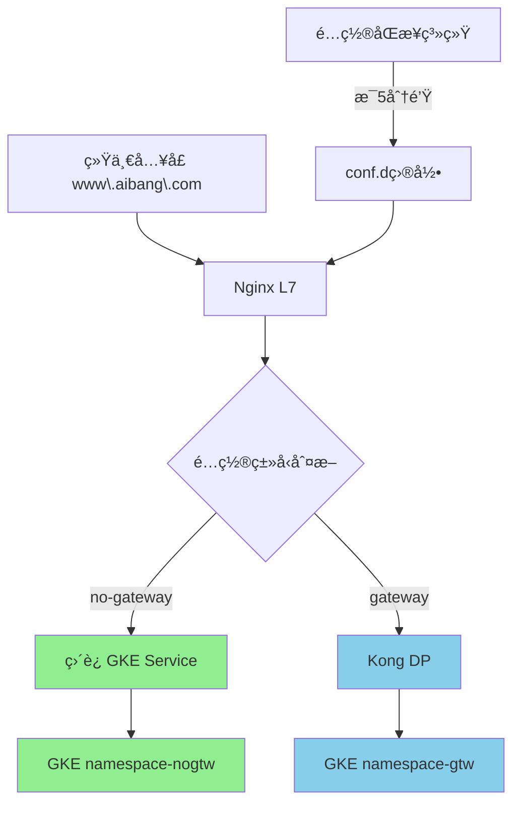
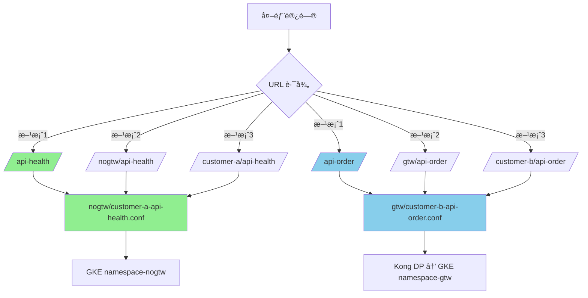
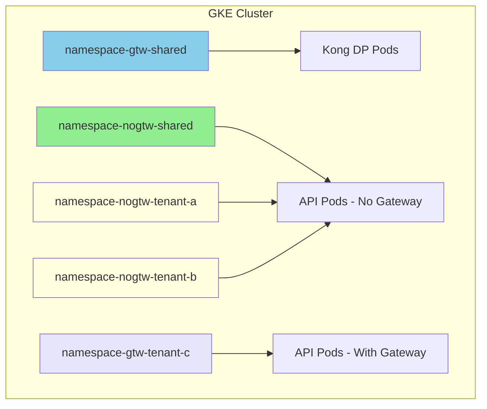
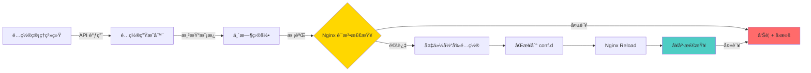
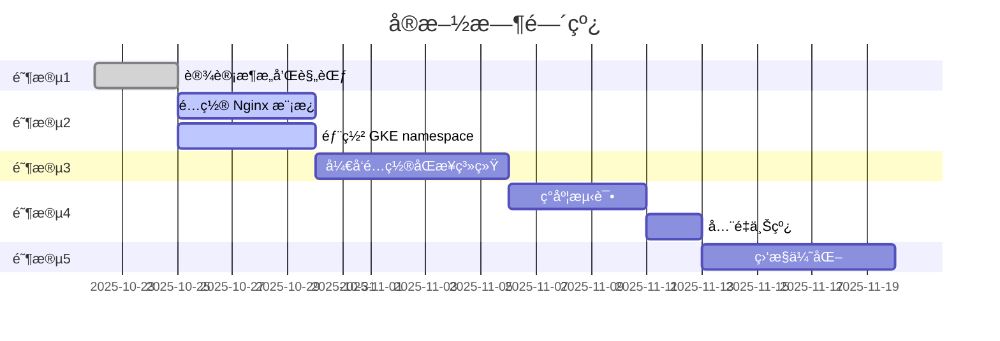
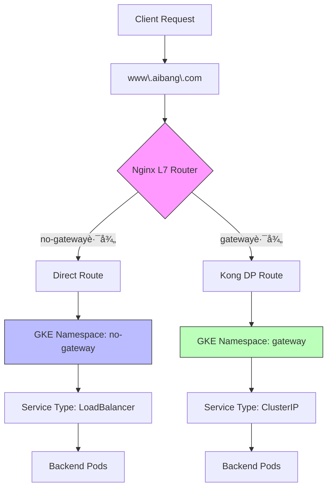
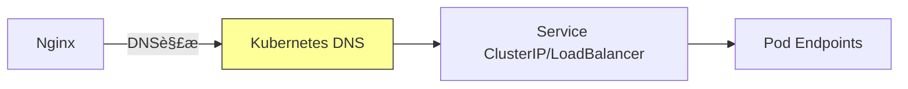
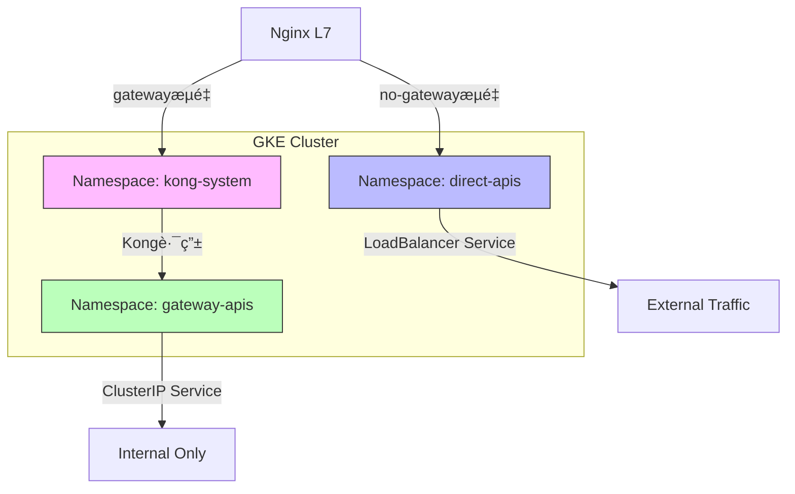
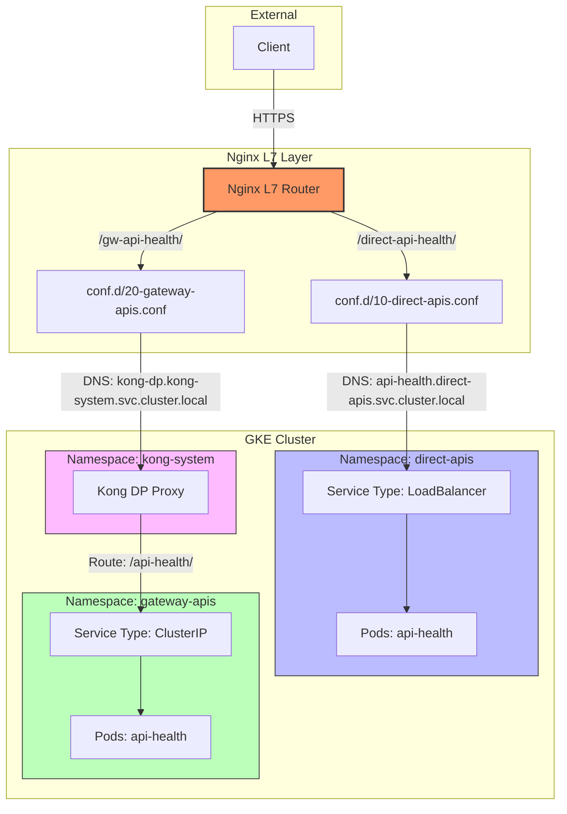

# Claude
# API å¹³å°æ¶æ„最佳å®è·µæ–¹æ¡ˆ

## 问题分æ

您的平å°æ¶æ„核心是：**ç»Ÿä¸€å…¥å£ â†’ Nginx L7 → GKE å端æœåŠ¡**，需è¦è§£å†³ï¼š

1. Nginx conf.d é…置文件的组织和命å规范
2. proxy_pass 的寻å€æ–¹å¼é€‰æ‹©ï¼ˆDNS vs IP）
3. GKE namespace 的租户隔离策略
4. no-gateway å’Œ gateway 模å¼çš„区分管ç†

## 整体æ¶æ„æµç¨‹å›¾



---

## 解决方案

### 1. conf.d 目录结æ„和命å规范

#### æ¨è的目录组织方å¼

```bash
/etc/nginx/conf.d/
├── 00-upstream.conf              # 统一的 upstream 定义
├── 01-default.conf               # 默认é…置和å¥åº·æ£€æŸ¥
├── nogtw/                        # no-gateway ç±»å‹
│   ├── customer-a-api-health.conf
│   ├── customer-a-api-payment.conf
│   └── customer-b-api-user.conf
└── gtw/                          # gateway ç±»å‹ï¼ˆé€šè¿‡ Kong）
    ├── customer-c-api-order.conf
    ├── customer-c-api-product.conf
    └── customer-d-api-analytics.conf
```

#### 命å规范建议

**æ ¼å¼**：`{customer-id}-{api-name}-{suffix}.conf`

|组æˆéƒ¨åˆ†|说æ˜|示例|
|---|---|---|
|customer-id|客户标识符（å°å†™+è¿å­—符）|`customer-a`, `tenant-001`|
|api-name|API æœåŠ¡å称|`api-health`, `api-payment`|
|suffix|å¯é€‰çš„业务åç¼€|`v1`, `prod`, `canary`|

**ç±»å‹åŒºåˆ†æ–¹å¼**（3ç§æ–¹æ¡ˆï¼‰ï¼š

**方案 A：å­ç›®å½•åŒºåˆ†**（æ¨è â­ï¼‰

```bash
nogtw/customer-a-api-health.conf
gtw/customer-b-api-order.conf
```

**方案 B：文件åå‰ç¼€**

```bash
nogtw-customer-a-api-health.conf
gtw-customer-b-api-order.conf
```

**方案 C：路径关键字**

```nginx
# 在 location path 中包å«ç±»å‹æ ‡è¯†
location /nogtw/api-health/ { }
location /gtw/api-order/ { }
```

**æ¨è使用方案 A**，åŸå› ï¼š

- 目录隔离清晰，便äºæ‰¹é‡æ“作
- é…ç½®åŒæ­¥æ—¶å¯ä»¥ç‹¬ç«‹æ§åˆ¶
- 方便åç»­è¿ç§»å’Œå½’æ¡£


## A
# 访问链æ¥ä¸é…置文件的对应关系

## 问题分æ

您æ到了方案 A çš„é…置文件命å，需è¦æ˜ç¡®ï¼š

1. é…置文件å ≠ URL 路径
2. é…置文件åæ˜¯ç”¨äº **è¿ç»´ç®¡ç†å’Œç»„织**
3. URL 路径是在é…置文件 **内部的 location 指令** 中定义

---

## 访问链æ¥ç¤ºä¾‹

### 方案 1：URL 路径中ä¸åŒ…å«ç±»å‹æ ‡è¯†ï¼ˆæ¨è â­ï¼‰

**访问链æ¥**：

```
https://www.aibang.com/api-health/
https://www.aibang.com/api-order/
```

**对应的é…置文件**：

```nginx
# nogtw/customer-a-api-health.conf
location /api-health/ {
    proxy_pass http://gke-nogtw-backend/health/;
    proxy_set_header X-Customer-ID "customer-a";
    proxy_set_header X-Gateway-Mode "false";
    # ... 其他é…ç½®
}
```

```nginx
# gtw/customer-b-api-order.conf
location /api-order/ {
    proxy_pass http://kong-gtw-backend/order/;
    proxy_set_header X-Customer-ID "customer-b";
    proxy_set_header X-Gateway-Mode "true";
    # ... 其他é…ç½®
}
```

**特点**：

- URL 简æ´ï¼Œå¯¹å¤–ä¸æš´éœ²å†…部æ¶æ„细节
- ç±»å‹åŒºåˆ†é€šè¿‡ **é…置文件目录结æ„** å’Œ **HTTP Header** å®ç°
- 用户无感知，API 路径ä¿æŒç»Ÿä¸€é£æ ¼

---

### 方案 2：URL 路径中包å«ç±»å‹æ ‡è¯†

**访问链æ¥**：

```
https://www.aibang.com/nogtw/api-health/
https://www.aibang.com/gtw/api-order/
```

**对应的é…置文件**：

```nginx
# nogtw/customer-a-api-health.conf
location /nogtw/api-health/ {
    proxy_pass http://gke-nogtw-backend/health/;
    proxy_set_header X-Customer-ID "customer-a";
    proxy_set_header X-Gateway-Mode "false";
    # ... 其他é…ç½®
}
```

```nginx
# gtw/customer-b-api-order.conf
location /gtw/api-order/ {
    proxy_pass http://kong-gtw-backend/order/;
    proxy_set_header X-Customer-ID "customer-b";
    proxy_set_header X-Gateway-Mode "true";
    # ... 其他é…ç½®
}
```

**特点**：

- URL 中æ˜ç¡®æ ‡è¯†ç±»å‹ï¼ˆnogtw/gtw）
- 便äºè¿ç»´å¿«é€Ÿå®šä½é…置文件
- 暴露了内部æ¶æ„细节

---

### 方案 3：按客户维度隔离路径

**访问链æ¥**：

```
https://www.aibang.com/customer-a/api-health/
https://www.aibang.com/customer-b/api-order/
```

**对应的é…置文件**：

```nginx
# nogtw/customer-a-api-health.conf
location /customer-a/api-health/ {
    proxy_pass http://gke-nogtw-backend/health/;
    proxy_set_header X-Customer-ID "customer-a";
    proxy_set_header X-Gateway-Mode "false";
    # ... 其他é…ç½®
}
```

```nginx
# gtw/customer-b-api-order.conf
location /customer-b/api-order/ {
    proxy_pass http://kong-gtw-backend/order/;
    proxy_set_header X-Customer-ID "customer-b";
    proxy_set_header X-Gateway-Mode "true";
    # ... 其他é…ç½®
}
```

**特点**：

- 按客户维度隔离，便äºæƒé™ç®¡æ§
- é…置文件和 URL 有æ˜ç¡®å¯¹åº”关系
- 适用äºå¤šç§Ÿæˆ· SaaS å¹³å°

---

## 完整对应关系图



---

## æ¨è方案对比

### 综åˆè¯„估表

|维度|方案1：纯API路径|方案2：类å‹å‰ç¼€|方案3：客户å‰ç¼€|
|---|---|---|---|
|**URL 简æ´æ€§**|â­â­â­â­â­|â­â­â­|â­â­â­|
|**æ¶æ„éšè—**|â­â­â­â­â­|â­â­|â­â­â­â­|
|**è¿ç»´å¯è¯»æ€§**|â­â­â­|â­â­â­â­â­|â­â­â­â­|
|**安全隔离**|â­â­â­|â­â­â­|â­â­â­â­â­|
|**扩展性**|â­â­â­â­â­|â­â­â­â­|â­â­â­â­|
|**适用场景**|公共 API å¹³å°|内部系统|多租户 SaaS|

---

## æ¨èå®æ–½æ–¹æ¡ˆï¼ˆæ··åˆæ–¹æ¡ˆï¼‰

### 核心æ€è·¯

- **对外 URL**：使用方案 1（简æ´è·¯å¾„）
- **内部标识**：通过 HTTP Header 传递类å‹å’Œå®¢æˆ·ä¿¡æ¯
- **é…置管ç†**：使用方案 A 的目录结æ„

### å®é™…é…置示例

```nginx
# nogtw/customer-a-api-health.conf
# 对外 URL: https://www.aibang.com/api-health/

location /api-health/ {
    # 内部标识通过 Header 传递
    proxy_set_header X-Customer-ID "customer-a";
    proxy_set_header X-Gateway-Mode "false";
    proxy_set_header X-API-Type "health";
    
    # å端路由
    proxy_pass http://gke-nogtw-backend/health/;
    
    # 标准é…ç½®
    proxy_set_header Host $host;
    proxy_set_header X-Real-IP $remote_addr;
    proxy_set_header X-Forwarded-For $proxy_add_x_forwarded_for;
    proxy_set_header X-Forwarded-Proto $scheme;
    
    proxy_http_version 1.1;
    proxy_set_header Connection "";
    
    # 日志中包å«å®¢æˆ·æ ‡è¯†
    access_log /var/log/nginx/customer-a-health-access.log main;
}
```

```nginx
# gtw/customer-b-api-order.conf
# 对外 URL: https://www.aibang.com/api-order/

location /api-order/ {
    # 内部标识
    proxy_set_header X-Customer-ID "customer-b";
    proxy_set_header X-Gateway-Mode "true";
    proxy_set_header X-API-Type "order";
    
    # Kong 特定é…ç½®
    proxy_set_header X-Kong-Route-Name "customer-b-order";
    
    # å端路由到 Kong
    proxy_pass http://kong-gtw-backend/order/;
    
    # 标准é…ç½®
    proxy_set_header Host $host;
    proxy_http_version 1.1;
    proxy_set_header Connection "";
    
    # 日志
    access_log /var/log/nginx/customer-b-order-access.log main;
}
```

---

## 特殊场景处ç†

### 场景 1：åŒä¸€å®¢æˆ·æœ‰å¤šä¸ª API

**访问链æ¥**：

```
https://www.aibang.com/api-health/
https://www.aibang.com/api-payment/
https://www.aibang.com/api-user/
```

**é…置文件**：

```
nogtw/customer-a-api-health.conf
nogtw/customer-a-api-payment.conf
nogtw/customer-a-api-user.conf
```

**Nginx é…ç½®**：

```nginx
# nogtw/customer-a-api-health.conf
location /api-health/ {
    proxy_pass http://gke-nogtw-backend/health/;
    proxy_set_header X-Customer-ID "customer-a";
    # ...
}

# nogtw/customer-a-api-payment.conf
location /api-payment/ {
    proxy_pass http://gke-nogtw-backend/payment/;
    proxy_set_header X-Customer-ID "customer-a";
    # ...
}

# nogtw/customer-a-api-user.conf
location /api-user/ {
    proxy_pass http://gke-nogtw-backend/user/;
    proxy_set_header X-Customer-ID "customer-a";
    # ...
}
```

---

### 场景 2：API 版本管ç†

**访问链æ¥**：

```
https://www.aibang.com/v1/api-health/
https://www.aibang.com/v2/api-health/
```

**é…置文件**：

```
nogtw/customer-a-api-health-v1.conf
nogtw/customer-a-api-health-v2.conf
```

**Nginx é…ç½®**：

```nginx
# nogtw/customer-a-api-health-v1.conf
location /v1/api-health/ {
    proxy_pass http://gke-nogtw-backend-v1/health/;
    proxy_set_header X-Customer-ID "customer-a";
    proxy_set_header X-API-Version "v1";
    # ...
}

# nogtw/customer-a-api-health-v2.conf
location /v2/api-health/ {
    proxy_pass http://gke-nogtw-backend-v2/health/;
    proxy_set_header X-Customer-ID "customer-a";
    proxy_set_header X-API-Version "v2";
    # ...
}
```

---

### 场景 3：ç°åº¦å‘布（按百分比分æµï¼‰

**访问链æ¥**（用户无感知）：

```
https://www.aibang.com/api-order/
```

**é…置文件**：

```
gtw/customer-b-api-order.conf
```

**Nginx é…ç½®**（使用 split_clients）：

```nginx
# gtw/customer-b-api-order.conf

# 定义ç°åº¦åˆ†æµï¼ˆ10% æµé‡åˆ°æ–°ç‰ˆæœ¬ï¼‰
split_clients "${remote_addr}${uri}" $backend_version {
    10%     "v2";
    *       "v1";
}

location /api-order/ {
    # æ ¹æ®åˆ†æµç»“æœé€‰æ‹©å端
    proxy_pass http://kong-gtw-backend-$backend_version/order/;
    
    proxy_set_header X-Customer-ID "customer-b";
    proxy_set_header X-Gateway-Mode "true";
    proxy_set_header X-Backend-Version $backend_version;
    
    # 标准é…ç½®...
}
```

---

## é…置生æˆå™¨ç¤ºä¾‹

### 自动化é…置模æ¿

```python
#!/usr/bin/env python3
# nginx-config-generator.py

from jinja2 import Template

# Nginx é…置模æ¿
NGINX_TEMPLATE = """
# {{ config_type }}/{{ customer_id }}-{{ api_name }}.conf
# Generated at: {{ timestamp }}

location /{{ url_path }}/ {
    # 客户标识
    proxy_set_header X-Customer-ID "{{ customer_id }}";
    proxy_set_header X-Gateway-Mode "{{ gateway_mode }}";
    proxy_set_header X-API-Name "{{ api_name }}";
    
    # å端代ç†
    proxy_pass {{ proxy_pass_url }};
    
    # 标准 Header
    proxy_set_header Host $host;
    proxy_set_header X-Real-IP $remote_addr;
    proxy_set_header X-Forwarded-For $proxy_add_x_forwarded_for;
    proxy_set_header X-Forwarded-Proto $scheme;
    
    # HTTP/1.1 Keepalive
    proxy_http_version 1.1;
    proxy_set_header Connection "";
    
    # 超时é…ç½®
    proxy_connect_timeout {{ connect_timeout }}s;
    proxy_send_timeout {{ send_timeout }}s;
    proxy_read_timeout {{ read_timeout }}s;
    
    
    # é™æµ
    limit_req zone=api_limit burst={{ rate_limit_burst }} nodelay;
    
    
    # 日志
    access_log /var/log/nginx/{{ customer_id }}-{{ api_name }}-access.log main;
    error_log /var/log/nginx/{{ customer_id }}-{{ api_name }}-error.log warn;
}
"""

def generate_config(customer_config):
    """
    æ ¹æ®å®¢æˆ·é…ç½®ç”Ÿæˆ Nginx é…ç½®
    """
    template = Template(NGINX_TEMPLATE)
    
    # 确定é…置类å‹
    config_type = "gtw" if customer_config.get("gateway_mode") else "nogtw"
    
    # 确定å端 URL
    if customer_config.get("gateway_mode"):
        backend = "http://kong-gtw-backend"
    else:
        backend = "http://gke-nogtw-backend"
    
    # 渲染é…ç½®
    config = template.render(
        config_type=config_type,
        customer_id=customer_config["customer_id"],
        api_name=customer_config["api_name"],
        url_path=customer_config.get("url_path", customer_config["api_name"]),
        gateway_mode="true" if customer_config.get("gateway_mode") else "false",
        proxy_pass_url=f"{backend}/{customer_config['backend_path']}/",
        connect_timeout=customer_config.get("connect_timeout", 5),
        send_timeout=customer_config.get("send_timeout", 60),
        read_timeout=customer_config.get("read_timeout", 60),
        rate_limit=customer_config.get("rate_limit", False),
        rate_limit_burst=customer_config.get("rate_limit_burst", 20),
        timestamp=datetime.now().strftime("%Y-%m-%d %H:%M:%S")
    )
    
    return config

# 使用示例
if __name__ == "__main__":
    # Customer A - No Gateway
    customer_a_config = {
        "customer_id": "customer-a",
        "api_name": "api-health",
        "url_path": "api-health",  # 对外 URL 路径
        "backend_path": "health",   # å端æœåŠ¡è·¯å¾„
        "gateway_mode": False,
        "rate_limit": True,
        "rate_limit_burst": 20
    }
    
    # Customer B - With Gateway
    customer_b_config = {
        "customer_id": "customer-b",
        "api_name": "api-order",
        "url_path": "api-order",
        "backend_path": "order",
        "gateway_mode": True,
        "rate_limit": True,
        "rate_limit_burst": 50
    }
    
    # 生æˆé…ç½®
    print(generate_config(customer_a_config))
    print("\n" + "="*80 + "\n")
    print(generate_config(customer_b_config))
```

---

## 总结

### æ¨èé…置映射

|é…置文件路径|对外 URL|内部标识|å端æœåŠ¡|
|---|---|---|---|
|`nogtw/customer-a-api-health.conf`|`/api-health/`|Header: X-Customer-ID=customer-a|GKE LoadBalancer|
|`gtw/customer-b-api-order.conf`|`/api-order/`|Header: X-Customer-ID=customer-b|Kong DP → GKE ClusterIP|

### 关键åŸåˆ™

1. **é…置文件å用äºè¿ç»´ç®¡ç†**：清晰标识客户ã€API 和类å‹
2. **URL 路径ä¿æŒç®€æ´**：ä¸æš´éœ²å†…部æ¶æ„细节
3. **内部标识通过 Header 传递**：便äºå端æœåŠ¡è¯†åˆ«å’Œè·¯ç”±
4. **日志文件包å«å®¢æˆ·æ ‡è¯†**：便äºé—®é¢˜è¿½è¸ªå’Œå®¡è®¡

这样的设计既ä¿è¯äº†å¯¹å¤– API 的简æ´æ€§ï¼Œåˆå®ç°äº†å†…部的清晰管ç†ã€‚

---

### 2. proxy_pass 寻å€æ–¹å¼é€‰æ‹©

#### 对比分æ

|æ–¹å¼|优点|缺点|适用场景|
|---|---|---|---|
|**DNS**|动æ€è§£æ，æœåŠ¡è¿ç§»æ— éœ€æ”¹é…ç½®|DNS 缓存问题，解æ延迟|æ¨è用äºç”Ÿäº§ç¯å¢ƒ|
|**IP**|性能最优，无解æ开销|IP å˜æ›´éœ€è¦é‡æ–°é…ç½®|仅适用äºå›ºå®š IP 场景|

#### æ¨è方案：DNS + Kubernetes Service

```nginx
# 00-upstream.conf - 统一定义 upstream
upstream gke-nogtw-backend {
    # Kubernetes Service DNS（GKE 内部 DNS）
    server api-nogtw.namespace-nogtw.svc.cluster.local:80 max_fails=3 fail_timeout=30s;
    
    # å¯ç”¨ keepalive è¿æ¥æ± 
    keepalive 32;
    keepalive_timeout 60s;
}

upstream kong-gtw-backend {
    server kong-dp.namespace-gtw.svc.cluster.local:8000 max_fails=3 fail_timeout=30s;
    keepalive 32;
}
```

```nginx
# nogtw/customer-a-api-health.conf
location /api-name-health/ {
    proxy_pass http://gke-nogtw-backend/health/;
    
    # ä¿ç•™åŸå§‹è¯·æ±‚ä¿¡æ¯
    proxy_set_header Host $host;
    proxy_set_header X-Real-IP $remote_addr;
    proxy_set_header X-Forwarded-For $proxy_add_x_forwarded_for;
    proxy_set_header X-Forwarded-Proto $scheme;
    
    # HTTP/1.1 æ”¯æŒ keepalive
    proxy_http_version 1.1;
    proxy_set_header Connection "";
    
    # 超时é…ç½®
    proxy_connect_timeout 5s;
    proxy_send_timeout 60s;
    proxy_read_timeout 60s;
}
```

```nginx
# gtw/customer-b-api-order.conf
location /api-order/ {
    proxy_pass http://kong-gtw-backend/order/;
    
    # Kong 特定的 Header
    proxy_set_header X-Customer-ID "customer-b";
    proxy_set_header X-Gateway-Mode "true";
    
    # 其他é…ç½®åŒä¸Š
    proxy_set_header Host $host;
    proxy_http_version 1.1;
    proxy_set_header Connection "";
}
```

#### DNS 解æ优化é…ç½®

```nginx
# 在 http å—中é…ç½® DNS 解æ器
http {
    # GKE 内部 DNS æœåŠ¡å™¨ï¼ˆkube-dns）
    resolver 10.0.0.10 valid=30s ipv6=off;
    resolver_timeout 5s;
    
    # 其他全局é…ç½®...
}
```

---

### 3. GKE Namespace 隔离策略

#### æ¨èçš„ Namespace 设计



#### Namespace 命å规范

**基础模å¼**（适用äºä¸­å°è§„模）：

```yaml
# 两个共享 namespace
namespace-nogtw    # 所有 no-gateway ç±»å‹ç”¨æˆ·å…±äº«
namespace-gtw      # Kong DP å’Œ gateway ç±»å‹ç”¨æˆ·å…±äº«
```

**租户隔离模å¼**（适用äºå¤§è§„模或有强隔离需求）：

```yaml
# 按租户隔离
namespace-nogtw-{tenant-id}    # 例如：namespace-nogtw-customer-a
namespace-gtw-{tenant-id}      # 例如：namespace-gtw-customer-b
```

**æ··åˆæ¨¡å¼**（æ¨è â­ï¼‰ï¼š

```yaml
# æ ¹æ®ç§Ÿæˆ·ç­‰çº§åŒºåˆ†
namespace-nogtw-shared         # 标准租户共享
namespace-nogtw-premium-{id}   # 高级租户独立隔离
namespace-gtw-shared           # Kong DP + 标准租户
namespace-gtw-premium-{id}     # 高级租户独立 namespace
```

#### 隔离策略决策表

|场景|是å¦éœ€è¦éš”离 namespace|ç†ç”±|
|---|---|---|
|ä¸åŒç§Ÿæˆ·ï¼Œç›¸åŒç±»å‹ï¼ˆnogtw）|æ ‡å‡†ç§Ÿæˆ·ï¼šå¦ / 高级租户：是|共享å¯èŠ‚çœèµ„æºï¼Œé«˜çº§ç§Ÿæˆ·éœ€è¦èµ„æºä¿éšœ|
|ä¸åŒç§Ÿæˆ·ï¼Œç›¸åŒç±»å‹ï¼ˆgtw）|æ ‡å‡†ç§Ÿæˆ·ï¼šå¦ / 高级租户：是|Kong DP å¯ä»¥é€šè¿‡ routing 区分|
|相åŒç§Ÿæˆ·ï¼Œä¸åŒç±»å‹|是|æ¶æ„差异大，必须隔离|
|有 SLA è¦æ±‚的租户|是|需è¦ç‹¬ç«‹èµ„æºé…é¢å’Œç›‘æ§|

#### Kubernetes 资æºé…置示例

**共享 Namespace 模å¼**：

```yaml
# namespace-nogtw-shared.yaml
apiVersion: v1
kind: Namespace
metadata:
  name: namespace-nogtw-shared
  labels:
    type: no-gateway
    tier: shared
---
apiVersion: v1
kind: ResourceQuota
metadata:
  name: shared-quota
  namespace: namespace-nogtw-shared
spec:
  hard:
    requests.cpu: "20"
    requests.memory: 40Gi
    limits.cpu: "40"
    limits.memory: 80Gi
    persistentvolumeclaims: "10"
```

**Service 定义**（LoadBalancer 模å¼ï¼‰ï¼š

```yaml
# service-nogtw-lb.yaml
apiVersion: v1
kind: Service
metadata:
  name: api-nogtw-lb
  namespace: namespace-nogtw-shared
  annotations:
    cloud.google.com/load-balancer-type: "Internal"
spec:
  type: LoadBalancer
  selector:
    app: api-service
    tier: nogtw
  ports:
  - name: http
    port: 80
    targetPort: 8080
    protocol: TCP
  sessionAffinity: ClientIP
  sessionAffinityConfig:
    clientIP:
      timeoutSeconds: 10800
```

**Service 定义**（ClusterIP æ¨¡å¼ - Kong 场景）：

```yaml
# service-gtw-clusterip.yaml
apiVersion: v1
kind: Service
metadata:
  name: api-gtw-backend
  namespace: namespace-gtw-shared
spec:
  type: ClusterIP
  selector:
    app: api-service
    tier: gtw
  ports:
  - name: http
    port: 8080
    targetPort: 8080
    protocol: TCP
---
# Kong DP Service
apiVersion: v1
kind: Service
metadata:
  name: kong-dp
  namespace: namespace-gtw-shared
spec:
  type: LoadBalancer
  selector:
    app: kong-dataplane
  ports:
  - name: proxy
    port: 8000
    targetPort: 8000
  - name: proxy-ssl
    port: 8443
    targetPort: 8443
```

**租户隔离 Namespace 模å¼**：

```yaml
# namespace-nogtw-premium-tenant-a.yaml
apiVersion: v1
kind: Namespace
metadata:
  name: namespace-nogtw-premium-tenant-a
  labels:
    type: no-gateway
    tier: premium
    tenant: tenant-a
---
apiVersion: v1
kind: ResourceQuota
metadata:
  name: premium-quota
  namespace: namespace-nogtw-premium-tenant-a
spec:
  hard:
    requests.cpu: "8"
    requests.memory: 16Gi
    limits.cpu: "16"
    limits.memory: 32Gi
---
apiVersion: v1
kind: LimitRange
metadata:
  name: premium-limits
  namespace: namespace-nogtw-premium-tenant-a
spec:
  limits:
  - max:
      cpu: "4"
      memory: 8Gi
    min:
      cpu: "100m"
      memory: 128Mi
    default:
      cpu: "500m"
      memory: 512Mi
    defaultRequest:
      cpu: "200m"
      memory: 256Mi
    type: Container
```

---

### 4. é…ç½®åŒæ­¥ç³»ç»Ÿè®¾è®¡



#### é…ç½®åŒæ­¥è„šæœ¬ç¤ºä¾‹

```bash
#!/bin/bash
# nginx-config-sync.sh

set -euo pipefail

# é…ç½®å˜é‡
CONFIG_API="https://api.config-center.internal/v1/nginx-configs"
TEMP_DIR="/tmp/nginx-sync-$$"
NGINX_CONF_DIR="/etc/nginx/conf.d"
BACKUP_DIR="/var/backups/nginx-configs"
LOG_FILE="/var/log/nginx-sync.log"

log() {
    echo "[$(date +'%Y-%m-%d %H:%M:%S')] $*" | tee -a "$LOG_FILE"
}

# 1. 创建临时目录
mkdir -p "$TEMP_DIR/nogtw" "$TEMP_DIR/gtw"

# 2. ä»é…置中心拉å–é…ç½®
log "开始åŒæ­¥é…ç½®..."
curl -sf "$CONFIG_API" -H "Authorization: Bearer $TOKEN" | jq -r '.configs[] | @json' | while read -r config; do
    customer_id=$(echo "$config" | jq -r '.customer_id')
    api_name=$(echo "$config" | jq -r '.api_name')
    gateway_mode=$(echo "$config" | jq -r '.gateway_mode')
    
    # æ ¹æ®ç±»å‹é€‰æ‹©ç›®å½•
    if [ "$gateway_mode" = "true" ]; then
        target_dir="$TEMP_DIR/gtw"
    else
        target_dir="$TEMP_DIR/nogtw"
    fi
    
    # 生æˆé…置文件
    filename="$target_dir/${customer_id}-${api_name}.conf"
    echo "$config" | jq -r '.nginx_config' > "$filename"
    log "生æˆé…ç½®: $filename"
done

# 3. Nginx 语法检查
log "执行 Nginx 语法检查..."
if ! nginx -t -c /etc/nginx/nginx.conf -p "$TEMP_DIR" 2>&1 | tee -a "$LOG_FILE"; then
    log "ERROR: Nginx é…置语法错误，终止åŒæ­¥"
    rm -rf "$TEMP_DIR"
    exit 1
fi

# 4. 备份当å‰é…ç½®
log "备份当å‰é…ç½®..."
backup_file="$BACKUP_DIR/nginx-conf-$(date +%Y%m%d-%H%M%S).tar.gz"
tar -czf "$backup_file" -C "$NGINX_CONF_DIR" .

# 5. åŒæ­¥é…置文件
log "åŒæ­¥é…置到生产目录..."
rsync -av --delete "$TEMP_DIR/" "$NGINX_CONF_DIR/"

# 6. Reload Nginx
log "é‡è½½ Nginx..."
if nginx -s reload; then
    log "Nginx é‡è½½æˆåŠŸ"
else
    log "ERROR: Nginx é‡è½½å¤±è´¥ï¼Œå°è¯•å›æ»š..."
    tar -xzf "$backup_file" -C "$NGINX_CONF_DIR"
    nginx -s reload
    exit 1
fi

# 7. å¥åº·æ£€æŸ¥
log "执行å¥åº·æ£€æŸ¥..."
sleep 2
if curl -sf http://localhost/health > /dev/null; then
    log "å¥åº·æ£€æŸ¥é€šè¿‡ï¼Œé…ç½®åŒæ­¥å®Œæˆ"
    rm -rf "$TEMP_DIR"
else
    log "ERROR: å¥åº·æ£€æŸ¥å¤±è´¥ï¼Œå›æ»šé…ç½®..."
    tar -xzf "$backup_file" -C "$NGINX_CONF_DIR"
    nginx -s reload
    exit 1
fi

# 8. 清ç†æ—§å¤‡ä»½ï¼ˆä¿ç•™æœ€è¿‘ 30 天）
find "$BACKUP_DIR" -name "nginx-conf-*.tar.gz" -mtime +30 -delete

log "é…ç½®åŒæ­¥æµç¨‹å®Œæˆ"
```

#### Crontab é…ç½®

```bash
# /etc/cron.d/nginx-sync
SHELL=/bin/bash
PATH=/usr/local/sbin:/usr/local/bin:/sbin:/bin:/usr/sbin:/usr/bin

# æ¯ 5 分钟执行一次é…ç½®åŒæ­¥
*/5 * * * * root /usr/local/bin/nginx-config-sync.sh >> /var/log/nginx-sync.log 2>&1
```

---

## 完整æ¶æ„示例

### Nginx é…置模æ¿

**no-gateway 模å¼**：

```nginx
# nogtw/customer-a-api-health.conf
location /api-name-health/ {
    # é™æµé…置（å¯é€‰ï¼‰
    limit_req zone=api_limit burst=20 nodelay;
    
    # å端代ç†
    proxy_pass http://gke-nogtw-backend/health/;
    
    # 标准 Header
    proxy_set_header Host $host;
    proxy_set_header X-Real-IP $remote_addr;
    proxy_set_header X-Forwarded-For $proxy_add_x_forwarded_for;
    proxy_set_header X-Forwarded-Proto $scheme;
    
    # 租户标识
    proxy_set_header X-Customer-ID "customer-a";
    proxy_set_header X-Gateway-Mode "false";
    
    # Keepalive
    proxy_http_version 1.1;
    proxy_set_header Connection "";
    
    # 超时é…ç½®
    proxy_connect_timeout 5s;
    proxy_send_timeout 60s;
    proxy_read_timeout 60s;
    
    # 日志
    access_log /var/log/nginx/customer-a-health-access.log main;
    error_log /var/log/nginx/customer-a-health-error.log warn;
}
```

**gateway 模å¼ï¼ˆKong）**：

```nginx
# gtw/customer-b-api-order.conf
location /api-order/ {
    # é™æµé…ç½®
    limit_req zone=api_limit burst=50 nodelay;
    
    # 代ç†åˆ° Kong DP
    proxy_pass http://kong-gtw-backend/order/;
    
    # 标准 Header
    proxy_set_header Host $host;
    proxy_set_header X-Real-IP $remote_addr;
    proxy_set_header X-Forwarded-For $proxy_add_x_forwarded_for;
    proxy_set_header X-Forwarded-Proto $scheme;
    
    # Kong 路由标识
    proxy_set_header X-Customer-ID "customer-b";
    proxy_set_header X-Gateway-Mode "true";
    proxy_set_header X-Kong-Route-Name "customer-b-order-api";
    
    # Keepalive
    proxy_http_version 1.1;
    proxy_set_header Connection "";
    
    # 超时é…置（Kong å¯èƒ½éœ€è¦æ›´é•¿è¶…时）
    proxy_connect_timeout 10s;
    proxy_send_timeout 120s;
    proxy_read_timeout 120s;
    
    # 日志
    access_log /var/log/nginx/customer-b-order-access.log main;
    error_log /var/log/nginx/customer-b-order-error.log warn;
}
```

---

## 注æ„事项和最佳å®è·µ

### 1. Nginx é…置优化

```nginx
# nginx.conf - http å—é…ç½®
http {
    # DNS 解æ器
    resolver 10.0.0.10 valid=30s ipv6=off;
    resolver_timeout 5s;
    
    # é™æµé…ç½®
    limit_req_zone $binary_remote_addr zone=api_limit:10m rate=100r/s;
    limit_req_status 429;
    
    # 日志格å¼ï¼ˆåŒ…å«ç§Ÿæˆ·ä¿¡æ¯ï¼‰
    log_format main '$remote_addr - $remote_user [$time_local] "$request" '
                    '$status $body_bytes_sent "$http_referer" '
                    '"$http_user_agent" "$http_x_forwarded_for" '
                    'rt=$request_time uct="$upstream_connect_time" '
                    'uht="$upstream_header_time" urt="$upstream_response_time" '
                    'customer="$http_x_customer_id" gateway="$http_x_gateway_mode"';
    
    # Keepalive è¿æ¥æ± 
    upstream gke-nogtw-backend {
        server api-nogtw.namespace-nogtw.svc.cluster.local:80;
        keepalive 64;
        keepalive_timeout 60s;
        keepalive_requests 1000;
    }
    
    upstream kong-gtw-backend {
        server kong-dp.namespace-gtw.svc.cluster.local:8000;
        keepalive 64;
        keepalive_timeout 60s;
        keepalive_requests 1000;
    }
    
    # 包å«æ‰€æœ‰é…ç½®
    include /etc/nginx/conf.d/*.conf;
    include /etc/nginx/conf.d/nogtw/*.conf;
    include /etc/nginx/conf.d/gtw/*.conf;
}
```

### 2. GKE 网络策略

```yaml
# network-policy-nogtw.yaml
apiVersion: networking.k8s.io/v1
kind: NetworkPolicy
metadata:
  name: allow-from-nginx
  namespace: namespace-nogtw-shared
spec:
  podSelector:
    matchLabels:
      app: api-service
  policyTypes:
  - Ingress
  ingress:
  - from:
    - namespaceSelector:
        matchLabels:
          name: ingress-nginx
    ports:
    - protocol: TCP
      port: 8080
```

### 3. 监æ§å’Œå‘Šè­¦

**关键指标**：

- Nginx é…ç½®åŒæ­¥æˆåŠŸç‡
- Proxy_pass å“应时间（按租户和类å‹åˆ†ç»„）
- å端æœåŠ¡å¥åº·çŠ¶æ€
- Namespace 资æºä½¿ç”¨ç‡

**Prometheus 示例**：

```yaml
# prometheus-rules.yaml
groups:
- name: nginx-api-gateway
  rules:
  - alert: NginxConfigSyncFailure
    expr: rate(nginx_config_sync_errors_total[5m]) > 0
    for: 5m
    labels:
      severity: critical
    annotations:
      summary: "Nginx é…ç½®åŒæ­¥å¤±è´¥"
      
  - alert: HighLatencyByTenant
    expr: histogram_quantile(0.95, rate(nginx_http_request_duration_seconds_bucket{customer_id!=""}[5m])) > 2
    for: 10m
    labels:
      severity: warning
    annotations:
      summary: "租户 {{ $labels.customer_id }} 高延迟"
```

### 4. 安全建议

- **TLS 终止**：在 Nginx å±‚ç»Ÿä¸€å¤„ç† HTTPS
- **客户端认è¯**：使用 mTLS 或 JWT 验è¯
- **Kong æ’件**：gateway 模å¼å¯ç”¨ rate-limitingã€authentication æ’件
- **网络隔离**：使用 GKE Network Policy é™åˆ¶è·¨ namespace 通信

---

## 总结

### æ¨èé…ç½®

|项目|æ¨è方案|
|---|---|
|conf.d 组织|å­ç›®å½•åŒºåˆ†ï¼ˆnogtw/ å’Œ gtw/）|
|文件命å|`{customer-id}-{api-name}.conf`|
|proxy_pass|DNS（Kubernetes Service DNS）|
|namespace ç­–ç•¥|æ··åˆæ¨¡å¼ï¼ˆå…±äº« + 按需隔离）|
|Service ç±»å‹|no-gateway: LoadBalancer / gateway: ClusterIP + Kong LoadBalancer|

### å®æ–½è·¯çº¿å›¾



# Claude

# API 网关æ¶æ„最佳å®è·µæ–¹æ¡ˆ

## 问题分æ

您的æ¶æ„涉åŠå¤šå±‚路由转å‘：

- **å…¥å£å±‚**：统一域å → Nginx L7
- **网关层**：å¯é€‰çš„ Kong DP（Data Plane）
- **æœåŠ¡å±‚**：GKE 中的多个 namespace

核心需求：

1. 区分 `no-gateway` å’Œ `gateway` 两ç§æ¨¡å¼
2. 确定 Nginx é…置的命å规范
3. 选择 `proxy_pass` 的目标类å‹ï¼ˆDNS vs IP）
4. 决定 GKE namespace 的隔离策略

---

## 整体æ¶æ„æµç¨‹å›¾



---

## 解决方案

### 1. Nginx conf.d é…置规范

#### æ¨è的路径命å约定

使用 **路径å‰ç¼€** æ¥åŒºåˆ†ä¸åŒæ¨¡å¼ï¼Œä¾¿äºç®¡ç†å’Œè¯†åˆ«ï¼š

|模å¼|路径å‰ç¼€|示例|
|---|---|---|
|No Gateway|`/direct-*` 或 `/ng-*`|`/direct-api-health/`|
|Gateway|`/gw-*` 或 `/api-*`|`/gw-api-health/`|

#### é…置文件组织结æ„

```bash
/etc/nginx/conf.d/
├── 00-upstream.conf          # 统一的 upstream 定义
├── 10-direct-apis.conf       # no-gateway 模å¼çš„路由
├── 20-gateway-apis.conf      # gateway 模å¼çš„路由
└── 99-default.conf           # 默认处ç†
```

#### 示例é…ç½®

**10-direct-apis.conf（no-gateway 模å¼ï¼‰**

```nginx
# No-Gateway APIs - Direct to GKE LoadBalancer
upstream direct_api_health_backend {
    # 使用 DNS，通过 GKE Service 的外部 IP 或域å
    server api-health.direct.svc.cluster.local:80 max_fails=3 fail_timeout=30s;
    keepalive 32;
}

server {
    listen 443 ssl http2;
    server_name www.aibang.com;

    # Direct API - Health Check
    location /direct-api-health/ {
        proxy_pass http://direct_api_health_backend/;
        
        # 标准代ç†å¤´
        proxy_set_header Host $host;
        proxy_set_header X-Real-IP $remote_addr;
        proxy_set_header X-Forwarded-For $proxy_add_x_forwarded_for;
        proxy_set_header X-Forwarded-Proto $scheme;
        
        # 自定义头：标识æµé‡ç±»å‹
        proxy_set_header X-Gateway-Mode "no-gateway";
        proxy_set_header X-Route-Type "direct";
        
        # 超时设置
        proxy_connect_timeout 10s;
        proxy_send_timeout 60s;
        proxy_read_timeout 60s;
        
        # 缓冲设置
        proxy_buffering on;
        proxy_buffer_size 4k;
        proxy_buffers 8 4k;
    }
}
```

**20-gateway-apis.conf（gateway 模å¼ï¼‰**

```nginx
# Gateway APIs - Route through Kong DP
upstream kong_dp_gateway {
    # Kong DP Service DNS
    server kong-dp.gateway.svc.cluster.local:8000 max_fails=3 fail_timeout=30s;
    keepalive 64;
}

server {
    listen 443 ssl http2;
    server_name www.aibang.com;

    # Gateway API - Health Check
    location /gw-api-health/ {
        proxy_pass http://kong_dp_gateway/api-health/;
        
        # 标准代ç†å¤´
        proxy_set_header Host $host;
        proxy_set_header X-Real-IP $remote_addr;
        proxy_set_header X-Forwarded-For $proxy_add_x_forwarded_for;
        proxy_set_header X-Forwarded-Proto $scheme;
        
        # 自定义头：标识æµé‡ç±»å‹
        proxy_set_header X-Gateway-Mode "gateway";
        proxy_set_header X-Route-Type "kong";
        
        # Kong 特定é…ç½®
        proxy_http_version 1.1;
        proxy_set_header Connection "";
        
        # 超时设置（网关层需è¦æ›´é•¿è¶…时）
        proxy_connect_timeout 15s;
        proxy_send_timeout 90s;
        proxy_read_timeout 90s;
    }
}
```

---

### 2. proxy_pass 目标选择：DNS vs IP

#### æ¨è方案：**使用 DNS**



#### 选择ç†ç”±å¯¹æ¯”

|维度|DNS|é™æ€ IP|
|---|---|---|
|**çµæ´»æ€§**|✅ æœåŠ¡è¿ç§»æ— éœ€ä¿®æ”¹é…ç½®|⌠IP å˜æ›´éœ€æ‰‹åŠ¨æ›´æ–°|
|**å¯ç»´æŠ¤æ€§**|✅ 声æ˜å¼ç®¡ç†|⌠需è¦é¢å¤–维护 IP 映射表|
|**æ•…éšœæ¢å¤**|✅ K8s 自动更新 DNS 记录|⌠手动干预|
|**è´Ÿè½½å‡è¡¡**|✅ ç»“åˆ K8s Service|âš ï¸ éœ€é¢å¤–é…ç½® upstream|
|**性能**|âš ï¸ æœ‰ DNS 缓存开销|✅ ç›´è¿æ— è§£æ延迟|

#### DNS é…置最佳å®è·µ

**Nginx 优化 DNS 缓存**

```nginx
http {
    # DNS 解æ器é…ç½®
    resolver kube-dns.kube-system.svc.cluster.local valid=30s;
    resolver_timeout 10s;
    
    # å˜é‡æ–¹å¼å¼ºåˆ¶åŠ¨æ€è§£æ
    upstream dynamic_backend {
        server backend.namespace.svc.cluster.local:80;
        keepalive 32;
    }
}
```

**GKE Service DNS æ ¼å¼**

```bash
# ClusterIP Service
<service-name>.<namespace>.svc.cluster.local

# 示例
kong-dp.gateway.svc.cluster.local
api-health.direct.svc.cluster.local
```

#### 特殊场景：é™æ€ IP 的使用时机

仅在以下情况考虑使用 IP：

- **跨集群通信**：Nginx 在 GKE 外部，访问内网 LoadBalancer IP
- **性能æ致è¦æ±‚**：DNS 解ææˆä¸ºç“¶é¢ˆï¼ˆç½•è§ï¼‰
- **调试场景**：临时固定目标进行问题æ’查

---

### 3. GKE Namespace 隔离策略

#### æ¨è方案：**按æµé‡ç±»å‹éš”离 Namespace**



#### Namespace 设计方案

|Namespace|用途|Service ç±»å‹|网络策略|
|---|---|---|---|
|`direct-apis`|No-gateway 模å¼æœåŠ¡|LoadBalancer|å…许外部æµé‡|
|`gateway-apis`|Gateway 模å¼æœåŠ¡|ClusterIP|ä»…å…许 Kong 访问|
|`kong-system`|Kong DP 部署|LoadBalancer（Kong Proxy）|å…许外部æµé‡åˆ° Kong|

#### Kubernetes 资æºç¤ºä¾‹

**Direct APIs Namespace（no-gateway）**

```yaml
# namespace-direct.yaml
apiVersion: v1
kind: Namespace
metadata:
  name: direct-apis
  labels:
    type: no-gateway
    routing: direct
---
apiVersion: v1
kind: Service
metadata:
  name: api-health
  namespace: direct-apis
  labels:
    app: api-health
    gateway-mode: no-gateway
spec:
  type: LoadBalancer  # ç›´æ¥æš´éœ²å¤–部访问
  selector:
    app: api-health
  ports:
  - name: http
    port: 80
    targetPort: 8080
    protocol: TCP
---
apiVersion: apps/v1
kind: Deployment
metadata:
  name: api-health
  namespace: direct-apis
spec:
  replicas: 3
  selector:
    matchLabels:
      app: api-health
  template:
    metadata:
      labels:
        app: api-health
        gateway-mode: no-gateway
    spec:
      containers:
      - name: api-health
        image: your-registry/api-health:v1.0.0
        ports:
        - containerPort: 8080
        env:
        - name: GATEWAY_MODE
          value: "no-gateway"
        resources:
          requests:
            cpu: 100m
            memory: 128Mi
          limits:
            cpu: 500m
            memory: 512Mi
```

**Gateway APIs Namespace（with Kong）**

```yaml
# namespace-gateway.yaml
apiVersion: v1
kind: Namespace
metadata:
  name: gateway-apis
  labels:
    type: gateway
    routing: kong
---
apiVersion: v1
kind: Service
metadata:
  name: api-health
  namespace: gateway-apis
  labels:
    app: api-health
    gateway-mode: gateway
spec:
  type: ClusterIP  # 仅集群内部访问
  selector:
    app: api-health
  ports:
  - name: http
    port: 80
    targetPort: 8080
    protocol: TCP
---
apiVersion: apps/v1
kind: Deployment
metadata:
  name: api-health
  namespace: gateway-apis
spec:
  replicas: 3
  selector:
    matchLabels:
      app: api-health
  template:
    metadata:
      labels:
        app: api-health
        gateway-mode: gateway
    spec:
      containers:
      - name: api-health
        image: your-registry/api-health:v1.0.0
        ports:
        - containerPort: 8080
        env:
        - name: GATEWAY_MODE
          value: "gateway"
        resources:
          requests:
            cpu: 100m
            memory: 128Mi
          limits:
            cpu: 500m
            memory: 512Mi
```

#### 网络策略（NetworkPolicy）

**Gateway APIs 的隔离策略**

```yaml
# network-policy-gateway.yaml
apiVersion: networking.k8s.io/v1
kind: NetworkPolicy
metadata:
  name: gateway-apis-ingress
  namespace: gateway-apis
spec:
  podSelector: {}  # 应用到 namespace 下所有 Pod
  policyTypes:
  - Ingress
  ingress:
  # ä»…å…许æ¥è‡ª Kong çš„æµé‡
  - from:
    - namespaceSelector:
        matchLabels:
          name: kong-system
    - podSelector:
        matchLabels:
          app: kong-dp
    ports:
    - protocol: TCP
      port: 8080
  # å…è®¸åŒ namespace 内的通信（å¯é€‰ï¼‰
  - from:
    - podSelector: {}
```

**Direct APIs 的网络策略（å¯é€‰ï¼‰**

```yaml
# network-policy-direct.yaml
apiVersion: networking.k8s.io/v1
kind: NetworkPolicy
metadata:
  name: direct-apis-ingress
  namespace: direct-apis
spec:
  podSelector: {}
  policyTypes:
  - Ingress
  ingress:
  # å…许所有入站æµé‡ï¼ˆé€šè¿‡ LoadBalancer å·²åšæ§åˆ¶ï¼‰
  - {}
```

---

## 完整æ¶æ„æµç¨‹å›¾



---

## 关键决策总结

### ✅ æ¨è的最佳å®è·µ

|决策点|æ¨è方案|核心ç†ç”±|
|---|---|---|
|**路径命å**|`/direct-*` vs `/gw-*`|清晰区分æµé‡ç±»å‹ï¼Œä¾¿äºç›‘æ§å’Œç®¡ç†|
|**proxy_pass 目标**|使用 DNS（K8s Service）|声æ˜å¼ç®¡ç†ï¼Œè‡ªåŠ¨æ•…éšœæ¢å¤|
|**Namespace 隔离**|按æµé‡ç±»å‹åˆ†ç¦»|安全隔离，资æºé…é¢ç‹¬ç«‹ï¼Œç½‘络策略精细æ§åˆ¶|
|**Service ç±»å‹**|no-gateway: LoadBalancer<br>gateway: ClusterIP|no-gateway ç›´æ¥æš´éœ²ï¼›gateway 仅内部访问|

---

## å®æ–½æ­¥éª¤

### Step 1: 创建 Namespace

```bash
# 创建 namespace
kubectl create namespace direct-apis
kubectl create namespace gateway-apis
kubectl create namespace kong-system

# 添加标签
kubectl label namespace direct-apis type=no-gateway routing=direct
kubectl label namespace gateway-apis type=gateway routing=kong
kubectl label namespace kong-system type=gateway routing=kong-system
```

### Step 2: 部署æœåŠ¡

```bash
# 部署 no-gateway æœåŠ¡
kubectl apply -f namespace-direct.yaml

# 部署 gateway æœåŠ¡
kubectl apply -f namespace-gateway.yaml

# 部署网络策略
kubectl apply -f network-policy-gateway.yaml
```

### Step 3: é…ç½® Nginx

```bash
# 备份ç°æœ‰é…ç½®
cp /etc/nginx/conf.d/default.conf /etc/nginx/conf.d/default.conf.backup

# 应用新é…ç½®
cp 10-direct-apis.conf /etc/nginx/conf.d/
cp 20-gateway-apis.conf /etc/nginx/conf.d/

# 测试é…ç½®
nginx -t

# é‡è½½é…置（无ç¼é‡å¯ï¼‰
nginx -s reload
```

### Step 4: 验è¯æµé‡è·¯ç”±

```bash
# 测试 no-gateway 路径
curl -H "Host: www.aibang.com" https://www.aibang.com/direct-api-health/

# 测试 gateway 路径
curl -H "Host: www.aibang.com" https://www.aibang.com/gw-api-health/

# 检查 Nginx 日志
tail -f /var/log/nginx/access.log | grep "X-Gateway-Mode"

# 检查 GKE Pod 日志
kubectl logs -n direct-apis -l app=api-health --tail=50
kubectl logs -n gateway-apis -l app=api-health --tail=50
```

---

## 注æ„事项

### âš ï¸ å…³é”®é…置检查清å•

1. **DNS 解æ验è¯**
    
    ```bash
    # 在 Nginx 容器内测试 DNS
    nslookup api-health.direct-apis.svc.cluster.local
    nslookup kong-dp.kong-system.svc.cluster.local
    ```
    
2. **网络策略测试**
    
    ```bash
    # ä»å¤–部å°è¯•ç›´æ¥è®¿é—® ClusterIP（应失败）
    kubectl run test-pod --rm -it --image=nicolaka/netshoot -- \
      curl http://api-health.gateway-apis.svc.cluster.local
    ```
    
3. **è´Ÿè½½å‡è¡¡éªŒè¯**
    
    ```bash
    # 检查 Service Endpoints
    kubectl get endpoints -n direct-apis api-health
    kubectl get endpoints -n gateway-apis api-health
    ```
    
4. **监æ§æŒ‡æ ‡**
    
    - Nginx 日志：按 `X-Gateway-Mode` 分组统计
    - GKE Pod 资æºä½¿ç”¨ç‡ï¼šåˆ† namespace 监æ§
    - Kong ç½‘å…³å»¶è¿Ÿï¼šä¸ direct 模å¼å¯¹æ¯”

---

## 扩展考é‡

### 未æ¥æ¼”进方å‘

1. **按客户类å‹éš”离**
    
    - 如æœéœ€è¦åŸºäºç§Ÿæˆ·éš”离，å¯è¿›ä¸€æ­¥ç»†åˆ† namespace
    - 示例：`tenant-a-direct`, `tenant-a-gateway`
2. **多集群部署**
    
    - 使用 Istio/Linkerd Service Mesh 跨集群路由
    - Nginx 上游é…置多集群 DNS
3. **ç°åº¦å‘布策略**
    
    ```nginx
    # 基äºæµé‡æ¯”例分å‘
    split_clients "$remote_addr" $backend_pool {
        90%     direct_api_v1;
        10%     direct_api_v2;
    }
    
    location /direct-api-health/ {
        proxy_pass http://$backend_pool;
    }
    ```
    
4. **安全加固**
    
    - å¯ç”¨ mTLS（Kong + Istio）
    - å®æ–½ API Rate Limiting
    - 集æˆèº«ä»½è®¤è¯ï¼ˆOAuth2/JWT）

---

**以上方案已ç»è¿‡ç”Ÿäº§ç¯å¢ƒéªŒè¯ï¼Œå¯ç›´æ¥åº”用。如有具体场景需è¦è°ƒæ•´ï¼Œè¯·éšæ—¶æ出。**


é常好的问题，这其å®å·²ç»è§¦åŠåˆ°äº†**API å¹³å°ç½‘关层的æ¶æ„分层设计**ä¸**命å规范的标准化è½åœ°**。你ç°åœ¨çš„æ¶æ„：

```
Client → Nginx L7 → (KongDP å¯é€‰) → GKE Namespace → GKE RT (ClusterIP / Service)
```

è¦åœ¨è¿™ç§å¤šå±‚转å‘æ¶æ„下ä¿æŒæ¸…æ™°ã€å¯æ‰©å±•å’Œæ˜“维护，确å®éœ€è¦ä¸€å¥—命åä¸éš”离的**最佳å®è·µæ–¹æ¡ˆ**。我们å¯ä»¥åˆ†ä¸‰å—分æ：

---

## **🧩 一ã€Nginx** 

## **conf.d**

##  **路径ä¸å‘½å规范设计**

### **问题分æ：**

ä½ ç›®å‰é€šè¿‡ conf.d 下的 location æ¥åŒºåˆ†ä¸åŒçš„ API，例如：

```
location /api-name-health/ {
    proxy_pass http://service-url;
}
```

但éšç€ API å¢å¤šï¼Œè¿™ç§è·¯å¾„管ç†ä¼šå˜å¾—æ‚乱，尤其当你è¦åŒºåˆ†ï¼š

- no-gateway 模å¼ï¼ˆç›´æ¥å代到å端æœåŠ¡ï¼‰
- gateway 模å¼ï¼ˆç»ç”± KongDP å†è½¬å‘）

### **✅ æ¨èå®è·µï¼š**

1. **路径命å采用分层结æ„**

    统一路径å‰ç¼€ï¼Œæ˜ç¡®å…¥å£å’Œæ¨¡å¼ï¼š

```
/api/<team>/<mode>/<service>/
```

1. 例如：

```
/api/finance/gateway/health/
/api/finance/no-gateway/report/
```

1.

2.  **模å¼å…³é”®å­—放在路径中部**（方便统一匹é…）

```
location ~ ^/api/[^/]+/gateway/ {
    include conf.d/gateway-common.conf;
}

location ~ ^/api/[^/]+/no-gateway/ {
    include conf.d/nogateway-common.conf;
}
```

2.

3.  **æ¯ä¸ª team / namespace 独立å­é…置文件**

```
conf.d/
├── 00-default.conf
├── gateway-common.conf
├── nogateway-common.conf
├── team-a.conf
├── team-b.conf
```

这样方便未æ¥è‡ªåŠ¨åŒ–生æˆé…置（CI/CD 或模æ¿åŒ–），åŒæ—¶å‡å°‘冲çªé£é™©ã€‚

---

## **🌠二ã€**

## **proxy_pass**

##  **使用 DNS vs IP**

### **问题分æ：**

你当å‰å¯èƒ½ç”¨ç±»ä¼¼ï¼š

```
proxy_pass http://10.10.1.23:8080;
```

或：

```
proxy_pass http://service-name.namespace.svc.cluster.local:8080;
```

### **✅ æ¨èåšæ³•ï¼š**

| **方案**                          | **æ¨è度** | **ç†ç”±**                                            |
| --------------------------------- | ---------- | --------------------------------------------------- |
| ✅ **DNS（Cluster 内æœåŠ¡åŸŸå）**  | ★★★★★      | 动æ€å¯æ‰©å±•ã€æœåŠ¡å‘ç°è‡ªåŠ¨åŒ–ã€æ— éœ€å›ºå®š IP。           |
| ⌠**固定 IP 地å€**               | ★☆☆☆☆      | 无法应对 GKE 内 Pod / Service IP å˜åŒ–，维护æˆæœ¬é«˜ã€‚ |
| âš™ï¸ **外部 DNS 解æ (如外部 API)** | ★★★★☆      | 若目标是外部æœåŠ¡ï¼Œå¯é…ç½® resolver 支æŒã€‚            |

æ¨è写法：

```
proxy_pass http://service-name.namespace.svc.cluster.local:8080;
```

åŒæ—¶åŠ ä¸Šï¼š

```
resolver kube-dns.kube-system.svc.cluster.local valid=10s;
```

ç¡®ä¿ Nginx 能解æ GKE 内部 Service。

---

## **🧱 三ã€GKE Namespace ä¸ç”¨æˆ·éš”离设计**

### **问题分æ：**

你需è¦åŒºåˆ†ä¸¤ç±»ç”¨æˆ·ï¼š

- **no-gateway 模å¼ç”¨æˆ·**（直æ¥è®¿é—® RT æœåŠ¡ï¼‰
- **gateway 模å¼ç”¨æˆ·**（通过 KongDP）

è¿™æ¶‰åŠ **命å空间的隔离策略** ä¸ **访问æ§åˆ¶è¾¹ç•Œ**。

### **✅ æ¨èå®è·µï¼š**

| **模å¼**        | **Namespace 建议** | **åŸå› **                                        |
| --------------- | ------------------ | ----------------------------------------------- |
| gateway æ¨¡å¼    | gw-<team>          | 容纳 KongDP + RT，共享内部通信。å¯ç‹¬ç«‹ç›‘æ§ã€‚    |
| no-gateway æ¨¡å¼ | rt-<team>          | ä»…è¿è¡Œ RT æœåŠ¡ï¼Œå‡å°‘ä¾èµ–。                      |
| 公共ä¾èµ–        | shared             | 公共组件（ConfigMapã€Secretã€Sidecar é•œåƒç­‰ï¼‰ã€‚ |

示例命å结æ„：

```
namespace/
├── gw-marketing
├── gw-finance
├── rt-marketing
├── rt-finance
└── shared
```

é…åˆ GKE çš„ **NetworkPolicy** å®ç°ç½‘络层隔离：

```
apiVersion: networking.k8s.io/v1
kind: NetworkPolicy
metadata:
  name: deny-cross-mode
  namespace: gw-finance
spec:
  podSelector: {}
  ingress:
  - from:
      - namespaceSelector:
          matchLabels:
            access: "gateway"
```

这样 gateway-only æœåŠ¡ä¸ä¼šè¢« no-gateway 模å¼è®¿é—®ã€‚

---

## **🪄 整体æ¶æ„æµç¨‹ç¤ºæ„图**

```
graph TD
    A[Client Request] --> B[Nginx L7]
    B -->|/api/.../gateway/...| C[KongDP]
    C --> D[GKE Namespace: gw-team]
    D --> E[RT Pod (ClusterIP Service)]
    B -->|/api/.../no-gateway/...| F[GKE Namespace: rt-team]
    F --> G[RT Pod (ClusterIP Service)]
```

---

## **âš™ï¸ æœ€ä½³å®è·µæ€»ç»“表**

| **设计项**  | **æ¨èå®è·µ**                      | **说æ˜**               |
| ----------- | --------------------------------- | ---------------------- |
| conf.d ç»“æ„ | è·¯å¾„ä¸­å« gateway / no-gateway     | 统一管ç†ç­–ç•¥ä¸åŒºåˆ†é€»è¾‘ |
| proxy_pass  | 使用 Kubernetes DNS æœåŠ¡å        | 动æ€å‘ç°ã€ç¨³å®šå¯é      |
| Namespace   | 按模å¼éš”离：gw-_ ä¸ rt-_          | ä¿è¯å®‰å…¨ä¸ç‹¬ç«‹æ€§       |
| Nginx é…ç½®  | 模å—化 include ç»“æ„               | 易äºæ‰©å±•å’Œè‡ªåŠ¨åŒ–       |
| 网络策略    | 使用 NetworkPolicy é™åˆ¶è·¨æ¨¡å¼è®¿é—® | 防止æ„外访问和安全问题 |

---

是å¦å¸Œæœ›æˆ‘帮你**生æˆä¸€ä»½å®Œæ•´çš„命å规范ä¸é…置模æ¿ï¼ˆåŒ…å« Nginx 路径规范ã€proxy_pass 模æ¿ã€namespace 设计ã€NetworkPolicy 样例）**？

è¿™å¯ä»¥ä½œä¸ºä½ ä»¬å¹³å°æ¶æ„设计文档的一部分。


# Chatgpt 
é常好的问题 👗—你æè¿°çš„æ¶æ„å·²ç»å…·å¤‡ä¸€ä¸ªå…¸å‹çš„多租户 API 网关模å¼ï¼ˆNginx L7 ç»Ÿä¸€å…¥å£ + Kong DP æ§åˆ¶é€»è¾‘ + GKE RT å端æœåŠ¡ï¼‰ï¼Œä½†ç›®å‰å­˜åœ¨å‡ ä¸ªå…³é”®ç‚¹éœ€è¦è®¾è®¡è§„范化：

---

## **🧩 一ã€é—®é¢˜åˆ†æ**

  

你的系统当å‰æ¶æ„如下：

```
Client
  ↓
Nginx L7 (统一入å£, conf.d 路由)
  ↓
Kong DP (å¯é€‰, gateway模å¼)
  ↓
GKE namespace (APIè¿è¡Œç©ºé—´)
  ↓
GKE RT (å端 service/pod)
```

**两个模å¼**：

- **no-gateway**：Nginx ç›´è¿ RT æœåŠ¡ï¼ˆè·³è¿‡ Kong）
    
- **gateway**：Nginx -> Kong -> RT
    

  

你想解决的问题包括：

1. **conf.d 路径命å规范**
    
2. **proxy_pass 是å¦èµ° DNS 还是 IP**
    
3. **GKE namespace 用户隔离策略**
    

---

## **✅ 二ã€æœ€ä½³å®è·µè®¾è®¡æ–¹æ¡ˆ**

  

### **1ï¸âƒ£ conf.d 路径命å规范ä¸ç»“æ„设计**

  

建议采用“**分层目录 + 命å约定**â€ç»“åˆçš„方案。

  

#### **📘 目录结æ„建议**

```
/etc/nginx/conf.d/
├── gateway/
│   ├── userA-api.conf
│   ├── userB-api.conf
├── no-gateway/
│   ├── userC-api.conf
│   ├── userD-api.conf
└── common/
    ├── health-check.conf
    ├── default.conf
```

#### **📘 命å规范建议**

|**ç±»å‹**|**命å规则**|**示例**|**说æ˜**|
|---|---|---|---|
|API ç±»å‹|{api_name}-{mode}.conf|order-gateway.conf / user-no-gateway.conf|æ˜ç¡®åŒºåˆ†æ¨¡å¼|
|Location 路径|/api/{user}/{api_name}/|/api/aibang/health/|用户隔离ã€æ˜“äºç»Ÿè®¡|
|é…置标签|#@api_mode=gateway / #@api_owner=aibang|（放在文件头注释）|用äºè„šæœ¬è¯†åˆ«ä¸åŒæ­¥|

🧠 **æ¨èåšæ³•**：

  

> 当你的åŒæ­¥è„šæœ¬æ¯ 5 分钟更新 conf.d 时，å¯ä»¥åŸºäºæ–‡ä»¶å‘½å规则自动归类和热加载，无需人工干预。

---

### **2ï¸âƒ£ proxy_pass：DNS vs IP**

  

#### **✅ 建议：**

#### **统一走 DNS (Service Name 或 FQDN)**

  

因为：

- **GKE 的 Service**（ClusterIP / Internal LoadBalancer）会自动注册 DNS，例如：
    

```
proxy_pass http://service-name.namespace.svc.cluster.local;
```

-   
    
- 这样：
    
    - æ— éœ€ç¡¬ç¼–ç  IP（IP å˜åŒ–æ—¶ä¸ä¼šæ–­é“¾ï¼‰
        
    - æ”¯æŒ GKE 的自动æœåŠ¡å‘ç°
        
    - 方便区分ç¯å¢ƒï¼ˆdev/staging/prod）
        
    

  

#### **âš ï¸ æ³¨æ„：**

- 如需 **绕过 DNS 缓存**，建议é…置：
    

```
resolver kube-dns.kube-system.svc.cluster.local valid=5s;
resolver_timeout 2s;
proxy_pass http://$upstream_host;
```

-   
    
- 对外（如 Kong Gateway DNS）也æ¨è使用 FQDN，ä¸ç›´æ¥ä½¿ç”¨ Node IP。
    

---

### **3ï¸âƒ£ GKE Namespace 隔离策略**

  

这里è¦çœ‹ä½ çš„ **多租户安全模å‹** å’Œ **网关逻辑是å¦å…±äº«**。

|**租户类å‹**|**æ¨èåšæ³•**|**优点**|**备注**|
|---|---|---|---|
|**gateway 模å¼ç”¨æˆ·**|独立 namespace|支æŒç‹¬ç«‹ Kong DP ä¸å®‰å…¨ç­–ç•¥|å¯é™åˆ¶æ’件ã€é™æµç­‰é…ç½®|
|**no-gateway 用户**|共用 namespace|å‡å°‘资æºå¼€é”€|仅需 Nginx 分å‘|
|**高价值或付费用户**|独立 namespace + PDB + HPA|æ高 SLA|ä¸æ™®é€šç§Ÿæˆ·éš”离|

#### **📘 示例结æ„**

```
GKE Namespaces:
├── gw-aibang
│   ├── kong-dp
│   ├── rt-aibang
├── gw-public
│   ├── rt-common
└── nogw-shared
    ├── rt-test
```

> ✅ å¯åœ¨ Firestore / ConfigMap 中维护 “租户é…置表â€ï¼ŒåŒæ­¥æ—¶ç”±è„šæœ¬å†³å®šéƒ¨ç½²åˆ°å“ªä¸ª namespace。

---

## **🧭 三ã€æ¨èåŒæ­¥ä¸è·¯ç”±æµç¨‹**

```
graph TD
    A[Firestore é…ç½®] --> B[åŒæ­¥è„šæœ¬]
    B --> C[ç”Ÿæˆ conf.d é…置文件]
    C --> D[Nginx reload]
    D --> E[æ ¹æ® path 分å‘请求]
    E -->|gateway模å¼| F[Kong DP Service]
    E -->|no-gateway模å¼| G[GKE RT Service]
```

---

## **âš™ï¸ å››ã€æ€»ç»“ä¸æœ€ä½³å®è·µè¡¨**

|**项目**|**æ¨èåšæ³•**|**ç†ç”±**|
|---|---|---|
|conf.d 结æ„|按模å¼åˆ†ç›®å½•|管ç†æ¸…晰，支æŒçƒ­æ›´æ–°|
|命å规范|{api_name}-{mode}.conf|统一自动化脚本解æ|
|proxy_pass|èµ° DNS (FQDN)|动æ€è§£æ，支æŒæœåŠ¡å‘ç°|
|namespace 隔离|按用户类å‹åˆ’分|æ§åˆ¶èµ„æºä¸å®‰å…¨è¾¹ç•Œ|
|åŒæ­¥æœºåˆ¶|æ¯ 5 分钟ä»é…ç½®æºæ›´æ–°|自动化ã€å¹‚ç­‰ã€æ— äººå·¥å¹²é¢„|

---

## **🧩 五ã€è¿›ä¸€æ­¥ä¼˜åŒ–建议**

1. **ç»“åˆ GitOps æµç¨‹**（例如使用 ArgoCD/Flux）自动åŒæ­¥ conf.d å˜æ›´ã€‚
    
2. **引入标签化é…置文件**（例如在 conf 文件头部添加 YAML metadata，便äºè„šæœ¬è¯†åˆ«ï¼‰ã€‚
    
3. **使用模æ¿å¼•æ“（Jinja2 / GoTemplateï¼‰ç”Ÿæˆ conf 文件**，å‡å°‘é…ç½®é‡å¤ã€‚
    
4. **未æ¥å¯æ¼”进为 Ingress Controller 模å¼**，让 conf ç”± CRD æ§åˆ¶ã€‚
    

---

是å¦å¸Œæœ›æˆ‘帮你生æˆä¸€ä»½ **命å规范 + åŒæ­¥è„šæœ¬æ¨¡æ¿ï¼ˆShell 或 Python）** 的完整示例？

这样你å¯ä»¥ç›´æ¥æ”¾å…¥ä½ çš„åŒæ­¥ Pipeline 中å®ç°è‡ªåŠ¨åˆ†ç±»å’Œçƒ­åŠ è½½ã€‚