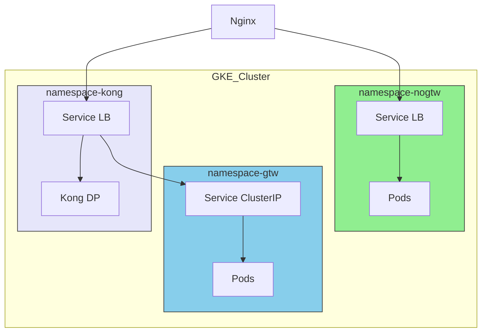

# API 平台架构最佳实践方案 (Gemini)

## 1. 问题分析

平台当前需要一套标准的 API 接入与管理方案，以支持 `gateway` 和 `no-gateway` 两种模式。核心挑战在于：

1.  **URL 统一性**：对外提供简洁、一致的 URL，隐藏内部实现细节。
2.  **模式可区分**：平台内部（Nginx、后端服务、监控系统）必须能够清晰地识别每种请求的模式。
3.  **用户无感知**：API 的使用者无需根据模式不同而修改任何代码或配置。
4.  **自动化管理**：设计必须与现有的“每5分钟同步一次 `conf.d`”的自动化流程兼容。

本文档将提供一套完整的最佳实践，涵盖命名规范、流量路由、服务隔离和配置管理，以应对上述挑战。

---

## 2. 核心设计原则

我们设计的基石是**“前端一致，后端分流”**。

| 设计目标           | 实现策略                                                     |
| ------------------ | ------------------------------------------------------------ |
| **URL 简洁统一**   | 所有 API 路径保持统一风格，例如 `/api-health/`，不包含任何模式或租户标识。 |
| **架构内部识别**   | 通过 **Nginx 配置文件目录结构** 区分模式，并通过注入 **自定义 HTTP Header** (`X-Gateway-Mode`) 将模式信息传递给下游。 |
| **用户代码无感知** | 模式切换对 API 调用者完全透明，无需更改 URL、Host 或参数。 |
| **配置清晰可维**   | 配置文件与 API、客户、模式一一对应，便于自动化生成和人工排查。 |

---

## 3. 整体架构流程

```mermaid
graph TD
    subgraph "用户侧"
        A[Client]
    end

    subgraph "平台入口层"
        B["Nginx L7 (www.aibang.com)"]
    end

    subgraph "平台网关/服务层 (GKE)"
        C["Kong DP (在 'gateway' Namespace)"]
        D["GKE Service (在 'no-gateway' Namespace)"]
        E["后端 Pods (在 'gateway' Namespace)"]
        F["后端 Pods (在 'no-gateway' Namespace)"]
    end

    A -- "https://www.aibang.com/api-xxx/" --> B

    B -- "location 匹配配置文件在 gtw 目录" --> |"注入 Header: X-Gateway-Mode: true"| C
    B -- "location 匹配配置文件在 nogtw 目录" --> |"注入 Header: X-Gateway-Mode: false"| D

    C -- "路由" --> E
    D -- "负载均衡" --> F

    style B fill:#f9f,stroke:#333,stroke-width:2px
    style C fill:#87CEEB,stroke:#333
    style D fill:#90EE90,stroke:#333
```

---

## 4. 详细设计方案

### 4.1. Nginx `conf.d` 目录与命名规范

这是实现模式区分的核心。通过物理目录结构来隔离不同模式的配置，是最清晰、最不易出错的方式。

#### **推荐目录结构**

```bash
/etc/nginx/conf.d/
├── gtw/                          # Gateway 模式 (通过 Kong)
│   ├── customer-b-api-order.conf
│   └── ...
├── nogtw/                        # No-Gateway 模式 (直连 GKE Service)
│   ├── customer-a-api-health.conf
│   └── ...
└── 00-default.conf               # 默认配置或健康检查
```

#### **配置文件命名规范**

采用 `{customer-id}-{api-name}.conf` 的格式，确保每个文件都能清晰地追溯到其所有者和功能。

#### **配置示例**

**A. no-gateway 模式 (`nogtw/customer-a-api-health.conf`)**

```nginx
# 文件路径: /etc/nginx/conf.d/nogtw/customer-a-api-health.conf
# API 所有者: customer-a
# API 模式: no-gateway

location /api-health/ {
    # 1. 代理到后端的 K8s Service DNS
    proxy_pass http://api-health.namespace-nogtw.svc.cluster.local;

    # 2. 注入内部标识 Header
    proxy_set_header X-Customer-ID "customer-a";
    proxy_set_header X-Gateway-Mode "false"; # 明确告知下游这是 no-gateway 流量

    # 3. 标准代理配置
    proxy_set_header Host $host;
    proxy_set_header X-Real-IP $remote_addr;
    proxy_set_header X-Forwarded-For $proxy_add_x_forwarded_for;
    proxy_set_header X-Forwarded-Proto $scheme;
    proxy_http_version 1.1;
    proxy_set_header Connection "";

    # 4. 日志分流 (可选，但推荐)
    access_log /var/log/nginx/customer-a-health-access.log main;
}
```

**B. gateway 模式 (`gtw/customer-b-api-order.conf`)**

```nginx
# 文件路径: /etc/nginx/conf.d/gtw/customer-b-api-order.conf
# API 所有者: customer-b
# API 模式: gateway

location /api-order/ {
    # 1. 代理到 Kong DP 的 K8s Service DNS
    proxy_pass http://kong-dp.namespace-gtw.svc.cluster.local/order/;

    # 2. 注入内部标识 Header
    proxy_set_header X-Customer-ID "customer-b";
    proxy_set_header X-Gateway-Mode "true"; # 明确告知下游这是 gateway 流量

    # 3. 标准代理配置
    proxy_set_header Host $host;
    proxy_set_header X-Real-IP $remote_addr;
    proxy_set_header X-Forwarded-For $proxy_add_x_forwarded_for;
    proxy_set_header X-Forwarded-Proto $scheme;
    proxy_http_version 1.1;
    proxy_set_header Connection "";

    # 4. 日志分流
    access_log /var/log/nginx/customer-b-order-access.log main;
}
```

### 4.2. `proxy_pass` 寻址方式：DNS vs. IP

**结论：必须使用 DNS。**

在 Kubernetes 环境中，Pod 的 IP 是动态变化的，直接使用 IP 会导致服务中断。应始终使用 Kubernetes 的内部服务发现机制。

| 方式                  | 优点                                       | 缺点                               | 推荐度 |
| --------------------- | ------------------------------------------ | ---------------------------------- | ------ |
| **DNS (K8s Service)** | **动态、自愈、原生支持、无需维护**         | 有微小的 DNS 解析开销              | ⭐⭐⭐⭐⭐ |
| **IP 地址**           | 无解析开销                                 | **无法应对 Pod 变化，运维灾难**    | ⭐☆☆☆☆ |

**最佳实践：**

在 `nginx.conf` 的 `http` 块中配置 `resolver`，指向 KubeDNS，并为 `proxy_pass` 使用完整的 Service FQDN。

```nginx
http {
    # 指向 GKE 内部的 DNS 服务 (kube-dns)
    resolver 10.0.0.10 valid=30s; # GKE 默认 kube-dns Service IP
    resolver_timeout 5s;

    # ... 其他配置
}
```

### 4.3. GKE Namespace 隔离策略

**结论：按模式和责任进行隔离。**

物理隔离是保障安全、资源和稳定性的最有效手段。

#### **推荐 Namespace 设计**

| Namespace 名称      | 用途                               | Service 类型         | 网络策略 (NetworkPolicy)             |
| ------------------- | ---------------------------------- | -------------------- | ------------------------------------ |
| `namespace-nogtw`   | 部署所有 `no-gateway` 模式的后端服务 | `LoadBalancer` (Internal) | 仅允许来自 Nginx Ingress 的流量      |
| `namespace-gtw`     | 部署所有 `gateway` 模式的后端服务  | `ClusterIP`          | 仅允许来自 `namespace-kong` 的流量   |
| `namespace-kong`    | 独立部署 Kong DP 组件              | `LoadBalancer` (Internal) | 仅允许来自 Nginx Ingress 的流量      |

#### **隔离示意图**



#### **Kubernetes 网络策略示例**

为了强制实现上述隔离，应部署 `NetworkPolicy` 资源。

**示例：保护 `gateway` 模式的服务**

此策略确保只有来自 `namespace-kong` 的 Pod 才能访问 `namespace-gtw` 中的服务。

```yaml
# policy-allow-kong-to-gateway-services.yaml
apiVersion: networking.k8s.io/v1
kind: NetworkPolicy
metadata:
  name: allow-kong-ingress
  namespace: namespace-gtw # 应用在 gateway 服务所在的 namespace
spec:
  podSelector: {} # 应用于此 namespace 的所有 Pod
  policyTypes:
  - Ingress
  ingress:
  - from:
    - namespaceSelector:
        matchLabels:
          # 精确匹配 Kong 所在的 namespace
          kubernetes.io/metadata.name: namespace-kong
    ports:
    - protocol: TCP
      port: 8080 # 后端服务监听的端口
```

---

## 5. 配置同步与自动化

现有的每5分钟同步一次的机制可以完美地与此设计结合。

```mermaid
graph TD
    A[配置源 (如 Firestore, Git Repo)] -- "读取 API 列表" --> B(自动化脚本)
    B -- "根据 'mode' 字段选择模板" --> C{渲染 Nginx 配置}
    C -- "mode: 'gateway'" --> D["写入 gtw/customer-x.conf"]
    C -- "mode: 'no-gateway'" --> E["写入 nogtw/customer-y.conf"]
    D & E -- "同步到 Nginx Pod" --> F(执行 nginx -t 校验)
    F -- "校验成功" --> G(执行 nginx -s reload)
    F -- "校验失败" --> H(告警, 不执行 reload)
```

这个设计使得整个流程高度自动化，并且易于追踪和管理。

---

## 6. 总结与最佳实践

| 架构关注点           | 最佳实践方案                                                 | 核心价值                               |
| -------------------- | ------------------------------------------------------------ | -------------------------------------- |
| **1. `conf.d` 实践** | **子目录区分模式** (`gtw/`, `nogtw/`)，文件名包含客户与API信息。 | 物理隔离，配置清晰，易于自动化。       |
| **2. `proxy_pass`**  | **必须使用 K8s Service DNS** (`<svc>.<ns>.svc.cluster.local`)。 | 动态、自愈，符合云原生原则。           |
| **3. GKE 隔离**      | **按模式划分独立 Namespace**，并使用 `NetworkPolicy` 强制隔离。 | 安全、稳定，资源管理清晰。             |
| **4. 模式识别**      | **注入自定义 Header** (`X-Gateway-Mode`, `X-Customer-ID`)。    | 向下游传递上下文，便于监控、日志和审计。 |

通过采纳此方案，您的 API 平台将拥有一个健壮、可扩展且易于维护的网关层，同时为最终用户提供了最简洁、最一致的使用体验。
