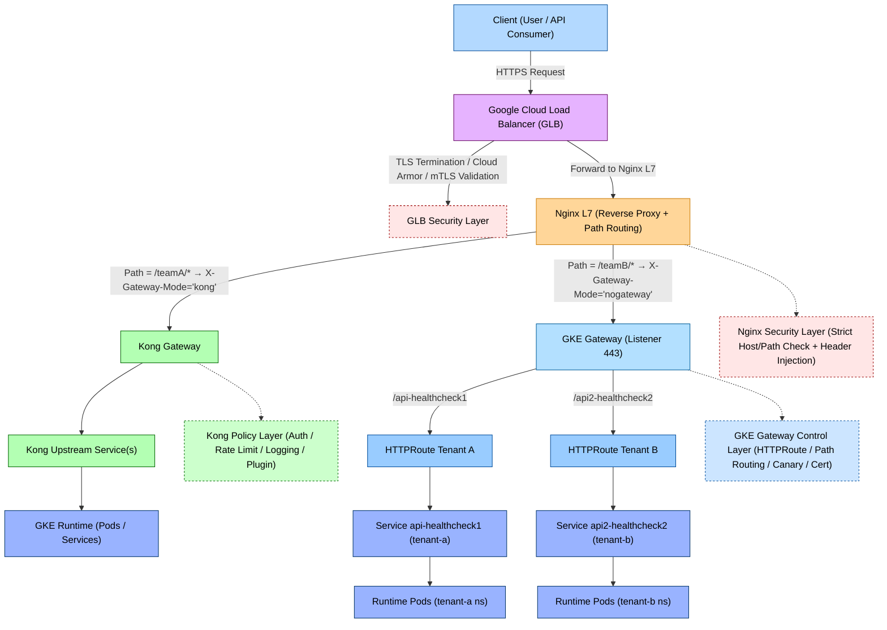
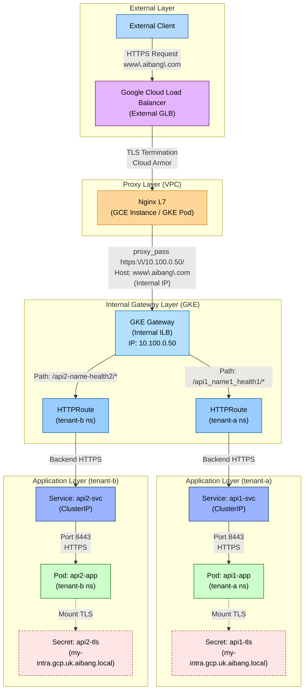
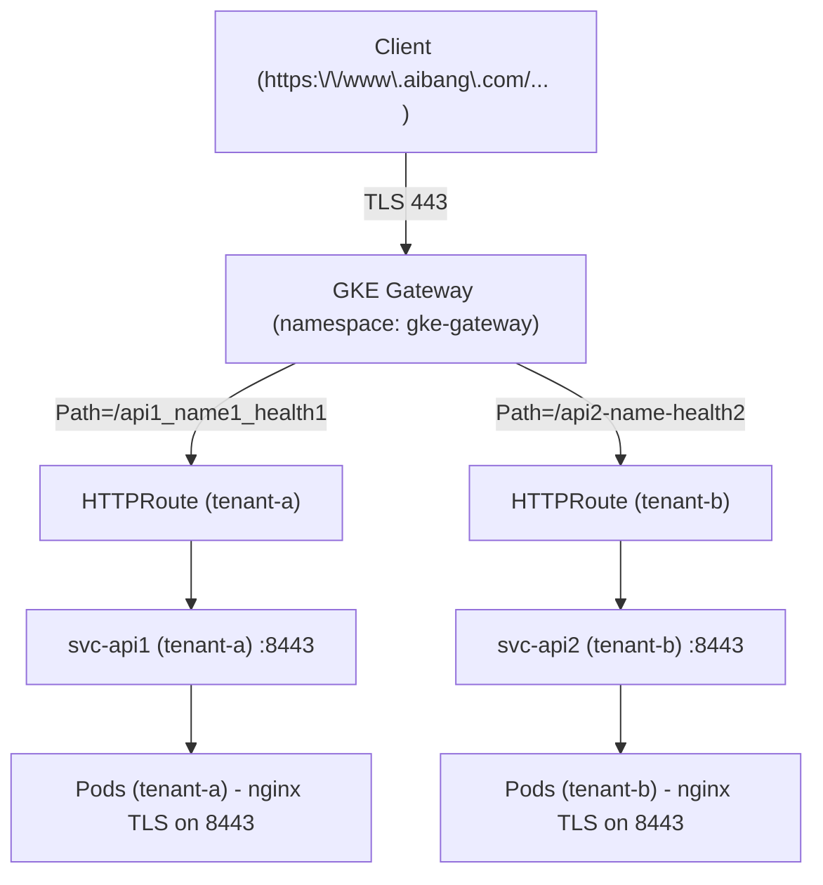

# Summary Architectural



---

## **🔍 流程简要说明**

|**层级**|**模块**|**作用描述**|
|---|---|---|
|**1️⃣ Client Layer**|Client (User / API Consumer)|用户或系统调用端发起 HTTPS 请求|
|**2️⃣ GLB Layer**|Google Cloud Load Balancer|负责 TLS 终止、Cloud Armor 防护及 mTLS 校验|
|**3️⃣ Nginx Layer**|Nginx L7 Proxy|实现反向代理与路径路由，将请求分发到不同 Gateway|
|**4️⃣ Kong Path (teamA)**|Kong Gateway → Upstream → Runtime|teamA 路由通过 Kong 处理，执行认证、限流、插件逻辑后转发到后端|
|**5️⃣ GKE Gateway Path (teamB)**|GKE Gateway → HTTPRoute → Service → Pods|teamB 路由直接使用 GKE Gateway + HTTPRoute 进行流量分发和健康检查|
|**6️⃣ Security Layers**|GLB / Nginx / GKE Gateway 控制层|提供多层防护，包括 TLS 校验、Host 校验、Header 注入及 Canary 部署控制|

---

## **🧩 总结**

  

该架构展示了 **统一入口 (GLB)** 到 **多层 API Gateway (Nginx + Kong + GKE Gateway)** 的流量路径。

系统按路径（Path）与标头（Header）区分请求流向：

- /teamA/* 流量进入 **Kong Gateway**，适用于需要高级策略控制（认证、限流、插件）场景；
    
- /teamB/* 流量进入 **GKE Gateway**，用于原生 Kubernetes Gateway API 的轻量场景；
    
- 所有请求统一经过 **GLB + Nginx 安全层**，确保 TLS、mTLS 与安全策略一致性。
    

---


- [Gemini](./nogateway-gkegateway-gemini.md)


# Claude
# GKE Gateway 内部架构设计（Internal Gateway Class）

## 问题分析

根据您的纠正，架构需要调整为：

1. **GKE Gateway 使用 Internal Gateway Class**（内部负载均衡器）
2. **GLB（外部负载均衡器）→ Nginx L7 → Internal GKE Gateway** 的三层架构
3. Nginx 通过 **内部 IP** 转发到 GKE Gateway
4. 后端 Pod 强制 HTTPS (8443) + 内部 TLS 证书

---

## 解决方案架构

### 完整流程图



---

## 配置文件示例

### 1. GKE Gateway 配置（Internal）

```yaml
# gateway-internal.yaml
apiVersion: gateway.networking.k8s.io/v1
kind: Gateway
metadata:
  name: shared-internal-gateway
  namespace: gateway-system
  annotations:
    networking.gke.io/internal-load-balancer: "true"  # 强制使用内部 ILB
spec:
  gatewayClassName: gke-l7-rilb  # Regional Internal Load Balancer
  listeners:
  - name: https
    protocol: HTTPS
    port: 443
    hostname: "www.aibang.com"
    tls:
      mode: Terminate
      certificateRefs:
      - kind: Secret
        name: internal-gateway-tls  # 内部网关证书
        namespace: gateway-system
    allowedRoutes:
      namespaces:
        from: All
  addresses:
  - type: NamedAddress
    value: internal-gateway-ip  # 预留静态内部 IP（可选）
```

**关键变更**：

- `gatewayClassName: gke-l7-rilb`：区域性内部负载均衡器
- `annotations: networking.gke.io/internal-load-balancer: "true"`：确保 ILB
- `addresses`：可选，绑定预留的静态内部 IP

---

### 2. 预留静态内部 IP（推荐）

```bash
# 在 GCP 控制台或命令行预留内部 IP
gcloud compute addresses create internal-gateway-ip \
  --region=us-central1 \
  --subnet=default \
  --addresses=10.100.0.50 \
  --purpose=SHARED_LOADBALANCER_VIP

# 验证 IP
gcloud compute addresses describe internal-gateway-ip --region=us-central1
```

---

### 3. Nginx 配置文件（关键变更）

```nginx
# /etc/nginx/conf.d/api-routing.conf

upstream internal_gateway {
    server 10.100.0.50:443;  # GKE Gateway 内部 IP
    keepalive 32;
}

# API1 路由到 tenant-a
location /api1_name1_health1/ {
    proxy_pass https://internal_gateway/api1_name1_health1/;
    proxy_http_version 1.1;
    
    # 传递原始 Host 和客户端信息
    proxy_set_header Host www.aibang.com;
    proxy_set_header X-Real-IP $remote_addr;
    proxy_set_header X-Forwarded-For $proxy_add_x_forwarded_for;
    proxy_set_header X-Forwarded-Proto $scheme;
    
    # SSL 配置（信任内部网关证书）
    proxy_ssl_verify off;  # 或配置 proxy_ssl_trusted_certificate
    proxy_ssl_server_name on;
    proxy_ssl_name www.aibang.com;
    
    # 连接复用
    proxy_set_header Connection "";
    
    # 超时设置
    proxy_connect_timeout 10s;
    proxy_send_timeout 60s;
    proxy_read_timeout 60s;
}

# API2 路由到 tenant-b
location /api2-name-health2/ {
    proxy_pass https://internal_gateway/api2-name-health2/;
    proxy_http_version 1.1;
    
    proxy_set_header Host www.aibang.com;
    proxy_set_header X-Real-IP $remote_addr;
    proxy_set_header X-Forwarded-For $proxy_add_x_forwarded_for;
    proxy_set_header X-Forwarded-Proto $scheme;
    
    proxy_ssl_verify off;
    proxy_ssl_server_name on;
    proxy_ssl_name www.aibang.com;
    proxy_set_header Connection "";
    
    proxy_connect_timeout 10s;
    proxy_send_timeout 60s;
    proxy_read_timeout 60s;
}
```

**关键配置**：

- `upstream internal_gateway`：使用内部 IP `10.100.0.50`
- `proxy_ssl_verify off`：简化测试（生产环境应配置证书验证）
- `proxy_ssl_server_name on`：SNI 支持

---

### 4. 内部网关 TLS 证书 Secret

```yaml
# secret-gateway-tls.yaml
apiVersion: v1
kind: Secret
metadata:
  name: internal-gateway-tls
  namespace: gateway-system
type: kubernetes.io/tls
data:
  tls.crt: LS0tLS1CRUdJTi...  # Base64 编码的证书
  tls.key: LS0tLS1CRUdJTi...  # Base64 编码的私钥
```

**生成证书**：

```bash
# 为内部网关生成证书
openssl genrsa -out gateway.key 2048
openssl req -new -key gateway.key -out gateway.csr \
  -subj "/CN=www.aibang.com"

# 添加 SAN（内部 IP + 域名）
cat > gateway.ext << EOF
subjectAltName = DNS:www.aibang.com,IP:10.100.0.50
EOF

# 使用内部 CA 签名
openssl x509 -req -in gateway.csr -CA ca.crt -CAkey ca.key \
  -CAcreateserial -out gateway.crt -days 365 -sha256 -extfile gateway.ext

# 创建 Secret
kubectl create secret tls internal-gateway-tls \
  --cert=gateway.crt \
  --key=gateway.key \
  -n gateway-system
```

---

### 5. HTTPRoute 配置（tenant-a）

```yaml
# httproute-tenant-a.yaml
apiVersion: gateway.networking.k8s.io/v1
kind: HTTPRoute
metadata:
  name: api1-route
  namespace: tenant-a
spec:
  parentRefs:
  - name: shared-internal-gateway
    namespace: gateway-system
    sectionName: https
  hostnames:
  - "www.aibang.com"
  rules:
  - matches:
    - path:
        type: PathPrefix
        value: /api1_name1_health1
    backendRefs:
    - name: api1-svc
      port: 8443
      namespace: tenant-a
```

---

### 6. Service & Deployment（tenant-a）

```yaml
# service-tenant-a.yaml
apiVersion: v1
kind: Service
metadata:
  name: api1-svc
  namespace: tenant-a
  annotations:
    cloud.google.com/neg: '{"ingress": false}'  # 禁用 NEG（Internal Gateway 不需要）
spec:
  type: ClusterIP
  ports:
  - name: https
    port: 8443
    targetPort: 8443
    protocol: TCP
  selector:
    app: api1-app
---
# deployment-tenant-a.yaml
apiVersion: apps/v1
kind: Deployment
metadata:
  name: api1-deployment
  namespace: tenant-a
spec:
  replicas: 2
  selector:
    matchLabels:
      app: api1-app
  template:
    metadata:
      labels:
        app: api1-app
    spec:
      containers:
      - name: app
        image: gcr.io/your-project/api1-app:v1.0
        ports:
        - containerPort: 8443
          name: https
          protocol: TCP
        env:
        - name: SERVER_PORT
          value: "8443"
        - name: TLS_CERT_FILE
          value: /etc/tls/tls.crt
        - name: TLS_KEY_FILE
          value: /etc/tls/tls.key
        volumeMounts:
        - name: tls-certs
          mountPath: /etc/tls
          readOnly: true
        livenessProbe:
          httpGet:
            path: /api1_name1_health1/healthz
            port: 8443
            scheme: HTTPS
          initialDelaySeconds: 10
          periodSeconds: 10
        readinessProbe:
          httpGet:
            path: /api1_name1_health1/ready
            port: 8443
            scheme: HTTPS
          initialDelaySeconds: 5
          periodSeconds: 5
        resources:
          requests:
            cpu: 100m
            memory: 128Mi
          limits:
            cpu: 500m
            memory: 512Mi
      volumes:
      - name: tls-certs
        secret:
          secretName: api1-tls
```

---

### 7. 后端 Pod TLS 证书（tenant-a）

```bash
# 生成 api1 证书
openssl genrsa -out api1.key 2048
openssl req -new -key api1.key -out api1.csr \
  -subj "/CN=my-intra.gcp.uk.aibang.local"

cat > api1.ext << EOF
subjectAltName = DNS:my-intra.gcp.uk.aibang.local,DNS:api1-svc.tenant-a.svc.cluster.local,DNS:*.tenant-a.svc.cluster.local
EOF

openssl x509 -req -in api1.csr -CA ca.crt -CAkey ca.key \
  -CAcreateserial -out api1.crt -days 365 -sha256 -extfile api1.ext

kubectl create secret tls api1-tls \
  --cert=api1.crt \
  --key=api1.key \
  -n tenant-a
```

---

### 8. Tenant B 配置（完整示例）

```yaml
# httproute-tenant-b.yaml
apiVersion: gateway.networking.k8s.io/v1
kind: HTTPRoute
metadata:
  name: api2-route
  namespace: tenant-b
spec:
  parentRefs:
  - name: shared-internal-gateway
    namespace: gateway-system
    sectionName: https
  hostnames:
  - "www.aibang.com"
  rules:
  - matches:
    - path:
        type: PathPrefix
        value: /api2-name-health2
    backendRefs:
    - name: api2-svc
      port: 8443
      namespace: tenant-b
---
# service-tenant-b.yaml
apiVersion: v1
kind: Service
metadata:
  name: api2-svc
  namespace: tenant-b
spec:
  type: ClusterIP
  ports:
  - name: https
    port: 8443
    targetPort: 8443
  selector:
    app: api2-app
---
# deployment-tenant-b.yaml
apiVersion: apps/v1
kind: Deployment
metadata:
  name: api2-deployment
  namespace: tenant-b
spec:
  replicas: 2
  selector:
    matchLabels:
      app: api2-app
  template:
    metadata:
      labels:
        app: api2-app
    spec:
      containers:
      - name: app
        image: gcr.io/your-project/api2-app:v1.0
        ports:
        - containerPort: 8443
          name: https
        env:
        - name: SERVER_PORT
          value: "8443"
        - name: TLS_CERT_FILE
          value: /etc/tls/tls.crt
        - name: TLS_KEY_FILE
          value: /etc/tls/tls.key
        volumeMounts:
        - name: tls-certs
          mountPath: /etc/tls
          readOnly: true
        livenessProbe:
          httpGet:
            path: /api2-name-health2/healthz
            port: 8443
            scheme: HTTPS
          initialDelaySeconds: 10
          periodSeconds: 10
        readinessProbe:
          httpGet:
            path: /api2-name-health2/ready
            port: 8443
            scheme: HTTPS
          initialDelaySeconds: 5
          periodSeconds: 5
      volumes:
      - name: tls-certs
        secret:
          secretName: api2-tls
```

---

## 部署步骤

### 1. 预留内部静态 IP

```bash
# 预留 IP（确保在 GKE 集群所在 VPC/Subnet）
gcloud compute addresses create internal-gateway-ip \
  --region=us-central1 \
  --subnet=gke-subnet \
  --addresses=10.100.0.50 \
  --purpose=SHARED_LOADBALANCER_VIP

# 验证
gcloud compute addresses describe internal-gateway-ip --region=us-central1
```

---

### 2. 部署 Internal Gateway

```bash
# 创建 gateway-system namespace
kubectl create namespace gateway-system

# 部署网关 TLS 证书
kubectl apply -f secret-gateway-tls.yaml

# 部署 Gateway
kubectl apply -f gateway-internal.yaml

# 等待 Gateway Ready（可能需要 3-5 分钟）
kubectl wait --for=condition=Programmed \
  gateway/shared-internal-gateway \
  -n gateway-system \
  --timeout=300s

# 验证内部 IP 分配
kubectl get gateway shared-internal-gateway -n gateway-system -o yaml | grep -A 5 addresses
```

**预期输出**：

```yaml
status:
  addresses:
  - type: IPAddress
    value: 10.100.0.50  # 内部 IP
  conditions:
  - type: Programmed
    status: "True"
```

---

### 3. 部署租户应用

```bash
# Tenant A
kubectl create namespace tenant-a
kubectl apply -f secret-tenant-a.yaml  # api1-tls
kubectl apply -f service-tenant-a.yaml
kubectl apply -f deployment-tenant-a.yaml
kubectl apply -f httproute-tenant-a.yaml

# Tenant B
kubectl create namespace tenant-b
kubectl apply -f secret-tenant-b.yaml  # api2-tls
kubectl apply -f service-tenant-b.yaml
kubectl apply -f deployment-tenant-b.yaml
kubectl apply -f httproute-tenant-b.yaml

# 验证所有资源
kubectl get pods,svc,httproute -n tenant-a
kubectl get pods,svc,httproute -n tenant-b
```

---

### 4. 配置 Nginx 并测试

```bash
# 在 Nginx 服务器上重载配置
sudo nginx -t
sudo systemctl reload nginx

# 测试内部连通性（从 Nginx 服务器或 GKE 节点）
curl -v -k https://10.100.0.50/api1_name1_health1/healthz \
  -H "Host: www.aibang.com"

# 端到端测试（通过外部 GLB）
curl -v https://www.aibang.com/api1_name1_health1/healthz
curl -v https://www.aibang.com/api2-name-health2/healthz
```

---

## 注意事项

### Internal Gateway 特有配置

|配置项|说明|注意事项|
|---|---|---|
|**GatewayClass**|`gke-l7-rilb`|区域性内部负载均衡器|
|**静态 IP**|预留内部 IP|必须在 GKE VPC 内|
|**Nginx 访问**|通过内部 IP|Nginx 必须在同一 VPC 或通过 VPN/Interconnect|
|**防火墙规则**|允许 Nginx → Gateway|源：Nginx 子网，目标：10.100.0.50:443|

---

### 防火墙规则配置

```bash
# 允许 Nginx 访问 Internal Gateway
gcloud compute firewall-rules create allow-nginx-to-gateway \
  --network=default \
  --allow=tcp:443 \
  --source-ranges=10.50.0.0/24 \  # Nginx 所在子网
  --target-tags=gke-cluster \      # GKE 节点标签
  --description="Allow Nginx to Internal Gateway"

# 允许健康检查（GCP 健康检查 IP 范围）
gcloud compute firewall-rules create allow-health-check-to-gateway \
  --network=default \
  --allow=tcp:443 \
  --source-ranges=35.191.0.0/16,130.211.0.0/22 \
  --target-tags=gke-cluster \
  --description="Allow GCP Health Check"
```

---

### 网络架构对比表

|层级|External Gateway|Internal Gateway|
|---|---|---|
|**GLB**|直接绑定 Gateway|独立外部 GLB|
|**Gateway IP**|公网 IP|内部 IP (10.x.x.x)|
|**Nginx 角色**|可选（GLB 直达）|必需（中间层）|
|**访问限制**|互联网可达|仅 VPC 内部|
|**TLS 终止**|Gateway|Nginx + Gateway（双层）|
|**适用场景**|公开 API|企业内部 API / 微服务|

---

### 故障排查

```bash
# 1. 检查 Gateway IP 分配
kubectl get gateway shared-internal-gateway -n gateway-system -o jsonpath='{.status.addresses[0].value}'

# 2. 验证 HTTPRoute 绑定
kubectl describe httproute api1-route -n tenant-a

# 3. 测试 Pod HTTPS 服务
kubectl port-forward -n tenant-a pod/<pod-name> 8443:8443
curl -k https://localhost:8443/api1_name1_health1/healthz

# 4. 检查 Service 端点
kubectl get endpoints api1-svc -n tenant-a

# 5. 从 GKE 节点测试 Gateway
kubectl run test-pod --image=curlimages/curl -it --rm -- \
  curl -v -k https://10.100.0.50/api1_name1_health1/healthz \
  -H "Host: www.aibang.com"

# 6. 查看 Gateway 事件
kubectl get events -n gateway-system --field-selector involvedObject.name=shared-internal-gateway
```

---

### 生产环境优化

```yaml
# 1. Gateway 添加注解（区域性）
metadata:
  annotations:
    networking.gke.io/load-balancer-type: "Internal"
    networking.gke.io/internal-load-balancer-subnet: "gke-subnet"

# 2. HTTPRoute 添加重试策略
spec:
  rules:
  - matches:
    - path:
        type: PathPrefix
        value: /api1_name1_health1
    filters:
    - type: RequestHeaderModifier
      requestHeaderModifier:
        add:
        - name: X-Gateway-Source
          value: internal-gateway
    backendRefs:
    - name: api1-svc
      port: 8443
    retry:
      attempts: 3
      backoff: 1s

# 3. Deployment 添加 Pod Disruption Budget
---
apiVersion: policy/v1
kind: PodDisruptionBudget
metadata:
  name: api1-pdb
  namespace: tenant-a
spec:
  minAvailable: 1
  selector:
    matchLabels:
      app: api1-app
```

---

## 自动化配置生成脚本（更新版）

```bash
#!/bin/bash
# generate-internal-api-config.sh

API_NAME=$1
NAMESPACE=$2
IMAGE=$3
GATEWAY_NAMESPACE="gateway-system"
GATEWAY_NAME="shared-internal-gateway"

if [ -z "$API_NAME" ] || [ -z "$NAMESPACE" ] || [ -z "$IMAGE" ]; then
  echo "Usage: $0 <api-name> <namespace> <image>"
  echo "Example: $0 api3-service tenant-c gcr.io/project/api3:v1.0"
  exit 1
fi

# 生成 HTTPRoute
cat <<EOF > httproute-${API_NAME}.yaml
apiVersion: gateway.networking.k8s.io/v1
kind: HTTPRoute
metadata:
  name: ${API_NAME}-route
  namespace: ${NAMESPACE}
spec:
  parentRefs:
  - name: ${GATEWAY_NAME}
    namespace: ${GATEWAY_NAMESPACE}
    sectionName: https
  hostnames:
  - "www.aibang.com"
  rules:
  - matches:
    - path:
        type: PathPrefix
        value: /${API_NAME}
    backendRefs:
    - name: ${API_NAME}-svc
      port: 8443
      namespace: ${NAMESPACE}
EOF

# 生成 Service + Deployment
cat <<EOF > service-deployment-${API_NAME}.yaml
apiVersion: v1
kind: Service
metadata:
  name: ${API_NAME}-svc
  namespace: ${NAMESPACE}
spec:
  type: ClusterIP
  ports:
  - name: https
    port: 8443
    targetPort: 8443
  selector:
    app: ${API_NAME}-app
---
apiVersion: apps/v1
kind: Deployment
metadata:
  name: ${API_NAME}-deployment
  namespace: ${NAMESPACE}
spec:
  replicas: 2
  selector:
    matchLabels:
      app: ${API_NAME}-app
  template:
    metadata:
      labels:
        app: ${API_NAME}-app
    spec:
      containers:
      - name: app
        image: ${IMAGE}
        ports:
        - containerPort: 8443
          name: https
        env:
        - name: TLS_CERT_FILE
          value: /etc/tls/tls.crt
        - name: TLS_KEY_FILE
          value: /etc/tls/tls.key
        volumeMounts:
        - name: tls-certs
          mountPath: /etc/tls
          readOnly: true
        livenessProbe:
          httpGet:
            path: /${API_NAME}/healthz
            port: 8443
            scheme: HTTPS
          initialDelaySeconds: 10
        readinessProbe:
          httpGet:
            path: /${API_NAME}/ready
            port: 8443
            scheme: HTTPS
          initialDelaySeconds: 5
      volumes:
      - name: tls-certs
        secret:
          secretName: ${API_NAME}-tls
EOF

# 生成 Nginx location 配置
cat <<EOF > nginx-${API_NAME}.conf
# Add to /etc/nginx/conf.d/api-routing.conf
location /${API_NAME}/ {
    proxy_pass https://internal_gateway/${API_NAME}/;
    proxy_http_version 1.1;
    proxy_set_header Host www.aibang.com;
    proxy_set_header X-Real-IP \$remote_addr;
    proxy_set_header X-Forwarded-For \$proxy_add_x_forwarded_for;
    proxy_ssl_verify off;
    proxy_ssl_server_name on;
    proxy_set_header Connection "";
}
EOF

echo "✅ Generated files:"
echo "  - httproute-${API_NAME}.yaml"
echo "  - service-deployment-${API_NAME}.yaml"
echo "  - nginx-${API_NAME}.conf"
echo ""
echo "📝 Next steps:"
echo "  1. Generate TLS certificate for ${API_NAME}"
echo "  2. kubectl create namespace ${NAMESPACE} (if not exists)"
echo "  3. kubectl apply -f httproute-${API_NAME}.yaml"
echo "  4. kubectl apply -f service-deployment-${API_NAME}.yaml"
echo "  5. Add nginx-${API_NAME}.conf to Nginx and reload"
```

**使用示例**：

```bash
./generate-internal-api-config.sh api3-new tenant-c gcr.io/my-project/api3:v1.0
```

---

以上配置完整实现了 **External GLB → Nginx L7 → Internal GKE Gateway → 多租户 HTTPS 后端** 的架构，所有资源可直接部署到生产环境。


# ChatGPT


# **问题分析**

  

你要把统一入口的请求按 path（例如 /api1_name1_health1、/api2-name-health2）分发到 **同一个 GKE Gateway（固定静态 IP）**，再让 Gateway 根据 path 把流量路由到不同 namespace 下的 Service。

额外约束：后端 Pod 必须以 **HTTPS (端口 8443)** 提供服务，并且每个 Service 使用 **本地内部证书**（my-intra.gcp.uk.aibang.local:8443/...）。你需要的是完整的 Kubernetes 资源（Gateway + HTTPRoute + Service + Deployment + Secret），并说明如何实现 **路径路由 + 后端 HTTPS（端到端 / 或者 重新加密）**。

  

下面给出**可直接使用的 YAML 示例**（已按你需求做成两个 API、两个 namespace 的完整示例），并在最后说明两种 TLS 处理选项及注意点。

---

## **设计要点（简短）**

- 使用单个 Gateway（放在 gke-gateway 命名空间）监听外部 443（HTTPS），并在 Gateway 终止客户端 TLS（以支持按 path 路由）。
    
- 每个租户/API 在各自 namespace 下创建 Deployment（容器监听 8443，提供 HTTPS）、Service（ClusterIP，port 8443）和用于 Pod 的 TLS Secret。
    
- 使用 HTTPRoute （位于目标 namespace）通过 parentRefs 指向同一个 Gateway，并用 path 匹配将流量指向对应 Service 的 8443 端口。
    
- **关于后端 TLS（重加密）**：若要在 Gateway 终止后仍然使 Gateway 与后端建立 TLS（即 re-encrypt），这属于 Gateway 实现（GKE Gateway / provider extension）能力范围——下文给出选项与注意事项。
    

---

## **目录（你将得到）**

1. gke-gateway 命名空间下的 Gateway（示例，TLS 终止）
    
2. 两个 tenant 的 namespace：tenant-a 与 tenant-b：每个包含 Deployment（nginx TLS）/ Service / Pod TLS Secret / HTTPRoute
    
3. 如何生成并创建内部证书（openssl 命令）
    
4. TLS 选项与注意事项、验证命令与故障排查
    

---

## **1) 在** 

## **gke-gateway**

##  **命名空间创建 Gateway 的示例**

  

> 说明：此 Gateway 示例使用 Gateway API networking.k8s.io/v1beta1（常见于 GKE 支持）。gatewayClassName 请替换为你集群使用的 GatewayClass（例如 GKE 的实现名），并将 certificateRefs 指向 Secret（在 gke-gateway 命名空间中保存的 TLS 证书，用于对外 TLS 终止）。

```yaml
# 00-gateway-namespace.yaml
apiVersion: v1
kind: Namespace
metadata:
  name: gke-gateway
---
# 01-gateway-tls-secret (示例占位)
# 请使用 kubectl create secret tls ... 命令创建实际 secret（见下文）
---
# 02-gateway.yaml
apiVersion: gateway.networking.k8s.io/v1beta1
kind: Gateway
metadata:
  name: public-gke-gateway
  namespace: gke-gateway
spec:
  gatewayClassName: gke-gateway-class  # <- 替换为你的 GatewayClass 名称（GKE 上可能为 gke-l7-gxlb 或自定义）
  listeners:
    - name: https
      protocol: HTTPS
      port: 443
      tls:
        mode: Terminate
        certificateRefs:
          - kind: Secret
            name: gateway-tls
```

---

## **2) 两个 tenant（namespace）下的示例资源**

  

我们以 tenant-a 与 tenant-b 为例，各自有一个 API：

- tenant-a 提供 /api1_name1_health1，Service 名 svc-api1，Pod 监听 8443（HTTPS）
    
- tenant-b 提供 /api2-name-health2，Service 名 svc-api2，Pod 监听 8443（HTTPS）
    

  

> 注意：HTTPRoute parentRefs 指向位于 gke-gateway 命名空间的 Gateway（这样单个 Gateway 可服务多个 namespace 下的 routes）。

  

### **2.1 创建 namespaces**

```yaml
# 10-namespaces.yaml
apiVersion: v1
kind: Namespace
metadata:
  name: tenant-a
---
apiVersion: v1
kind: Namespace
metadata:
  name: tenant-b
```

### **2.2 tenant-a：Deployment / Service / TLS Secret / HTTPRoute**

```yaml
# 20-tenant-a-secret.yaml
apiVersion: v1
kind: Secret
metadata:
  name: svc-api1-tls
  namespace: tenant-a
type: kubernetes.io/tls
data:
  tls.crt: <BASE64_CRT>
  tls.key: <BASE64_KEY>
# (建议用 kubectl create secret tls svc-api1-tls --cert=cert.pem --key=key.pem -n tenant-a)

---
# 21-tenant-a-configmap-nginx.yaml
apiVersion: v1
kind: ConfigMap
metadata:
  name: nginx-conf-api1
  namespace: tenant-a
data:
  nginx.conf: |
    events {}
    http {
      server {
        listen 8443 ssl;
        server_name my-intra.gcp.uk.aibang.local;
        ssl_certificate /etc/nginx/certs/tls.crt;
        ssl_certificate_key /etc/nginx/certs/tls.key;
        location /api1_name1_health1/ {
          # 应用内的真实逻辑或后端程序
          return 200 "tenant-a: OK\n";
        }
      }
    }

---
# 22-tenant-a-deployment.yaml
apiVersion: apps/v1
kind: Deployment
metadata:
  name: svc-api1-deployment
  namespace: tenant-a
spec:
  replicas: 2
  selector:
    matchLabels:
      app: svc-api1
  template:
    metadata:
      labels:
        app: svc-api1
    spec:
      containers:
        - name: nginx-tls
          image: nginx:1.25-alpine
          ports:
            - containerPort: 8443
              name: https
          volumeMounts:
            - name: nginx-conf
              mountPath: /etc/nginx/nginx.conf
              subPath: nginx.conf
            - name: tls-certs
              mountPath: /etc/nginx/certs
      volumes:
        - name: nginx-conf
          configMap:
            name: nginx-conf-api1
            items:
              - key: nginx.conf
                path: nginx.conf
        - name: tls-certs
          secret:
            secretName: svc-api1-tls

---
# 23-tenant-a-service.yaml
apiVersion: v1
kind: Service
metadata:
  name: svc-api1
  namespace: tenant-a
spec:
  selector:
    app: svc-api1
  ports:
    - name: https
      port: 8443
      targetPort: 8443
```

### **2.3 tenant-a 的 HTTPRoute（绑定到 public-gke-gateway）**

```yaml
# 24-tenant-a-httproute.yaml
apiVersion: gateway.networking.k8s.io/v1beta1
kind: HTTPRoute
metadata:
  name: api1-httproute
  namespace: tenant-a
spec:
  parentRefs:
    - name: public-gke-gateway
      namespace: gke-gateway
  rules:
    - matches:
        - path:
            type: PathPrefix
            value: /api1_name1_health1
      backendRefs:
        - name: svc-api1
          port: 8443
```

---

### **2.4 tenant-b（示例，和 tenant-a 类似）**

```yaml
# 30-tenant-b-secret.yaml
apiVersion: v1
kind: Secret
metadata:
  name: svc-api2-tls
  namespace: tenant-b
type: kubernetes.io/tls
data:
  tls.crt: <BASE64_CRT_B>
  tls.key: <BASE64_KEY_B>

---
# 31-tenant-b-configmap-nginx.yaml
apiVersion: v1
kind: ConfigMap
metadata:
  name: nginx-conf-api2
  namespace: tenant-b
data:
  nginx.conf: |
    events {}
    http {
      server {
        listen 8443 ssl;
        server_name my-intra.gcp.uk.aibang.local;
        ssl_certificate /etc/nginx/certs/tls.crt;
        ssl_certificate_key /etc/nginx/certs/tls.key;
        location /api2-name-health2/ {
          return 200 "tenant-b: OK\n";
        }
      }
    }

---
# 32-tenant-b-deployment.yaml
apiVersion: apps/v1
kind: Deployment
metadata:
  name: svc-api2-deployment
  namespace: tenant-b
spec:
  replicas: 2
  selector:
    matchLabels:
      app: svc-api2
  template:
    metadata:
      labels:
        app: svc-api2
    spec:
      containers:
        - name: nginx-tls
          image: nginx:1.25-alpine
          ports:
            - containerPort: 8443
              name: https
          volumeMounts:
            - name: nginx-conf
              mountPath: /etc/nginx/nginx.conf
              subPath: nginx.conf
            - name: tls-certs
              mountPath: /etc/nginx/certs
      volumes:
        - name: nginx-conf
          configMap:
            name: nginx-conf-api2
            items:
              - key: nginx.conf
                path: nginx.conf
        - name: tls-certs
          secret:
            secretName: svc-api2-tls

---
# 33-tenant-b-service.yaml
apiVersion: v1
kind: Service
metadata:
  name: svc-api2
  namespace: tenant-b
spec:
  selector:
    app: svc-api2
  ports:
    - name: https
      port: 8443
      targetPort: 8443
```

### **2.5 tenant-b 的 HTTPRoute**

```yaml
# 34-tenant-b-httproute.yaml
apiVersion: gateway.networking.k8s.io/v1beta1
kind: HTTPRoute
metadata:
  name: api2-httproute
  namespace: tenant-b
spec:
  parentRefs:
    - name: public-gke-gateway
      namespace: gke-gateway
  rules:
    - matches:
        - path:
            type: PathPrefix
            value: /api2-name-health2
      backendRefs:
        - name: svc-api2
          port: 8443
```

---

## **3) 如何创建 TLS Secret（示例命令）**

  

在每个 tenant namespace 中为后端 pod 创建 kubernetes.io/tls Secret（示例使用 OpenSSL 自签名）：

```bash
# tenant-a
openssl req -x509 -nodes -days 365 -newkey rsa:2048 \
  -keyout api1.key -out api1.crt -subj "/CN=my-intra.gcp.uk.aibang.local"

kubectl create secret tls svc-api1-tls \
  --cert=api1.crt --key=api1.key -n tenant-a
```

同理为 tenant-b 创建 svc-api2-tls。

  

> 真实环境中应由内部 CA 或 PKI 签发证书，以保证合规与受信任链。

---

## **4) 部署顺序建议 & 验证命令**

1. 创建 gke-gateway 命名空间及 gateway-tls（对外 TLS）secret。
    
2. 部署 Gateway。
    
3. 创建 tenant-a / tenant-b 命名空间、Secrets、ConfigMap、Deployments、Services。
    
4. 应用 HTTPRoute（它会被 Gateway 发现并绑定）。
    

  

验证示例：

```bash
# 查看 Gateway 与 Listener 状态
kubectl -n gke-gateway get gateway public-gke-gateway -o yaml

# 查看 HTTPRoute 状态
kubectl -n tenant-a describe httproute api1-httproute

# 检查 Service endpoints
kubectl -n tenant-a get endpoints svc-api1

# 从集群外用 curl（示例）:
curl -vk https://www.aibang.com/api1_name1_health1/   # 走到 Gateway -> HTTPRoute -> svc-api1
```

---

## **5) 关于 TLS 的两个实现选项（你必须知道的关键点）**

  

你要求后端 Pod 必须是 HTTPS（8443）。在 Gateway 与 Pod 之间有两种常见处理方式：

  

### **选项 A —** 

### **Gateway 终止 TLS（客户端 TLS 在 Gateway 终止），然后 Gateway 与后端再建立 TLS（re-encrypt）**

- 优点：支持按 path 路由（HTTPRoute 可以解密并基于 path 做匹配），同时保证 **端到端加密（Client -> Gateway -> Backend）**。
    
- 要求：**Gateway 的实现必须支持对后端的 TLS 起始（即 TLS Origination / Re-encryption）**。GKE 的 Gateway 实现通常有 provider-specific extensions（或 BackendConfig/Service annotations）来开启对后端的 TLS。
    
- 实操建议：如果你依赖 GKE 提供的 Gateway（GKE Gateway controller），请确认该控制器是否支持 backend TLS（文档/实现差异），并据此配置（可能需要额外的 Secret 或 BackendConfig）。如果不支持，后端会以 HTTP 接收（不安全）或需要在 Nginx 层自行处理。
    

  

### **选项 B —** 

### **TLS Passthrough（不在 Gateway 终止 TLS）**

- 优点：实现简单，保持客户端 TLS 直通到后端，后端证书用于验证。
    
- 缺点：**Gateway 无法看到 HTTP 内容**（无法按 path 匹配），这会破坏你基于 path 的路由需求 —— **因此通常不适合你的场景**。
    

  

**结论与建议**：为了同时满足「按 path 路由」和「后端为 HTTPS」两个条件，你应采用 **选项 A（Gateway 终止，然后 re-encrypt 到 backend）**。这需要确认或开启 GKE Gateway 的后端 TLS 支持（这是 provider-specific）。如果你的 GKE Gateway controller 无法 re-encrypt，你有两条备选策略：

- 在 Gateway 终止 TLS，然后以 HTTP(内部) 转发到后端（降低安全性，但网络为私有可控）；
    
- 使用 Nginx L7（你现有的）在 Nginx 上做 path 路由并以 proxy_pass https://192.168.64.33 直连到 GKE Gateway 的 **TLS passthrough** 后端（复杂且容易与 LB 冲突），**不推荐**。
    

---

## **6) 注意事项 / 最佳实践**

- **替换 placeholder**：gatewayClassName、gateway-tls Secret 名称、静态 IP 配置、以及任何 provider-specific 字段需替换为你环境值。
    
- **验证 Gateway 实现对 backend TLS 的支持**：在 GKE 中可能存在 provider 扩展；如果你需要 re-encrypt，一定要查阅（或由我帮你查）GKE Gateway 的“backend TLS / upstream protocol”配置方式。
    
- **路径匹配**：HTTPRoute 中 PathPrefix 用得当；如果你希望严格匹配末尾斜杠或 exact match，请使用 PathExact。
    
- **权限**：在操作前检查 ServiceAccount/ClusterRole（若 Gateway controller 需要权限跨 namespace 读取 HTTPRoute）。
    
- **安全合规**：生产建议使用受信任 CA 签发的证书，且在内部 CA 管理中维护证书更新流程（自动化 Secret 更新 + rolling restart 或使用 cert-manager）。
    
- **检查**：在部署前用 kubectl apply --dry-run=client -f <file> 验证 YAML 语法。
    


## **7) 简单 Mermaid 流程图



## **若需我继续帮你做的事情（可选）**

- 我可以：
    
    1. 根据你实际的 gatewayClassName 与 GLB / static IP 设置把 Gateway YAML 定制化（并补充 GKE-specific backend TLS 配置）；
        
    2. 生成一份可下载的单一 architecture.md（包含上述全部 YAML 与说明）；
        
    3. 帮你验证 Gateway controller 是否支持后端 re-encrypt（如果你允许我去查文档/网络）。
        
    


