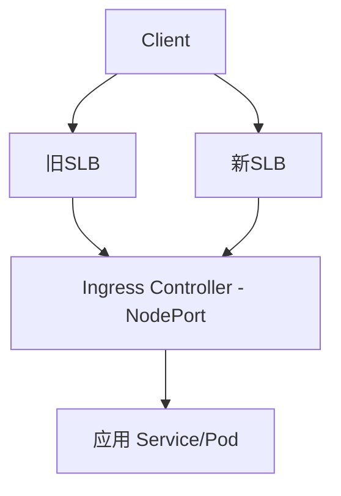

处于迁移场景，所以需要让 **旧 SLB（Cluster A）** 和 **新 SLB（Cluster B）** 同时绑定到同一个 Ingress Controller（比如 Nginx Ingress Controller），以便做到 **双入口共存**，然后逐步迁移流量。

  

在阿里云上确实可以实现，一个 Ingress Controller（通常是一个 Service 类型为 LoadBalancer 的 Service）可以被多个 SLB 绑定。

---

## **实现思路**

1. **创建两个 SLB**（旧的和新的，都在阿里云控制台手动创建好）。
    
2. **Ingress Controller 的 Service 保持不变**（即 ClusterIP 类型的 Service，由 Helm 或 YAML 部署）。
    
3. **通过 ALB/SLB 后端服务器组绑定 K8s Worker 节点 + NodePort** 的方式，把 **两个 SLB 都指向同一个 NodePort**，从而实现一个 Ingress Controller 对应多个 SLB。
    

---

## **实现方式 1：控制台操作（推荐）**

1. **创建新 SLB**
    
    - 登录 [阿里云 SLB 控制台](https://slb.console.aliyun.com)。
        
    - 选择同一 VPC、Region，创建一个新的 **公网或私网 SLB**（和旧的保持一致）。
        
    
2. **配置监听器**
    
    - 在新建 SLB 上添加监听（HTTP/HTTPS/TCP）。
        
    - 监听端口设置为和 Ingress Controller Service 的 NodePort 匹配。
        
    - 协议要和你 Ingress 一致，比如 HTTP/HTTPS。
        
    
3. **绑定后端服务器组**
    
    - 在新 SLB 上绑定 **K8s 节点（ECS 实例）**。
        
    - 端口选择为 Ingress Controller Service 暴露的 **NodePort**（不是 ClusterIP）。
        
    - 这样，新 SLB 和旧 SLB 都会把流量转发到同一个 Ingress Controller。
        
    

---

## **实现方式 2：命令行（kubectl + aliyun CLI）**

1. **查找 Ingress Controller Service 的 NodePort**
    

```
kubectl get svc -n ingress-nginx
```

1. 输出示例：
    

```
NAME            TYPE        CLUSTER-IP   EXTERNAL-IP   PORT(S)                      AGE
ingress-nginx   NodePort    10.0.0.100   <none>        80:32222/TCP,443:32223/TCP   10d
```

1. 👉 NodePort 分别是 32222 (HTTP) 和 32223 (HTTPS)。
    
2. **获取 K8s Worker 节点 ECS 实例 ID**
    

```
aliyun ecs DescribeInstances --RegionId cn-hangzhou \
  --query 'Instances.Instance[*].{id:InstanceId,ip:PrivateIpAddress.IpAddress[0]}'
```

2.   
    
3. **创建 SLB 并配置监听**
    

```
# 创建 SLB
aliyun slb CreateLoadBalancer --RegionId cn-hangzhou --LoadBalancerName new-slb-for-ingress

# 创建监听器（HTTP 80 -> NodePort 32222）
aliyun slb CreateLoadBalancerHTTPListener \
  --LoadBalancerId lb-xxxxxx \
  --ListenerPort 80 \
  --BackendServerPort 32222 \
  --Bandwidth -1 \
  --Scheduler wrr
```

3.   
    
4. **绑定 ECS 节点到 SLB 后端**
    

```
aliyun slb AddBackendServers \
  --LoadBalancerId lb-xxxxxx \
  --BackendServers '[{"ServerId":"i-1234567890","Port":"32222","Weight":"100"}]'
```

4. （把所有 Worker 节点都加上）
    

---

## **迁移步骤建议**

1. **保持旧 SLB 正常服务**。
    
2. **新建 SLB 并绑定 Ingress Controller NodePort**。
    
3. **DNS 配置双解析**（旧域名指向旧 SLB IP，新域名或临时测试域名指向新 SLB IP）。
    
4. **灰度流量迁移**：逐步切换 DNS 或者在客户端层面做分流。
    
5. **确认新 SLB 正常工作后**，解绑旧 SLB 并释放。
    

---

### **Mermaid 迁移拓扑**



---

要不要我帮你写一个 **完整的双 SLB 绑定迁移 checklist（表格形式）**，方便你直接用作迁移步骤执行？