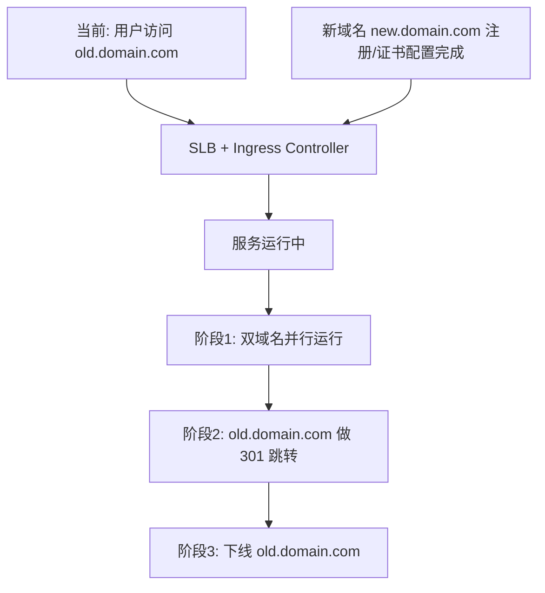
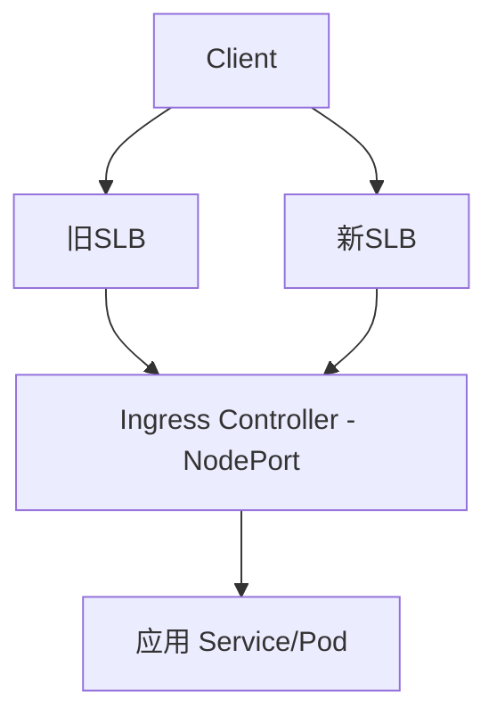

# New

```bash
关于阿里云的SLB,我有这样一个想法 我是不是可以将两个不同的域名绑定到一个SLB里面 SLB后面又对应了一个Ingress的controller 其实我Ingress的controller里面可以侦听不同的域名来满足我对应的需求 所以说我需要理解一下这个过程 或者说2个SLB它合在一起的好处 或者分开的好处,帮我评估 . 还有个问题就是我原来的那个域名不是很合适,我期待用第二个域名来替换第一个域名. 比如平台 已经运行了用户,如果做完重新的onboarding或者说重新的deploy之后, 它能使用我这个新的域名来对外提供服务。帮我评估方案
```

好的，我们来系统分析一下你在阿里云 **SLB (Server Load Balancer) + K8S Ingress Controller** 场景下的几个问题和方案。

---

## **1. 是否可以将两个域名绑定到一个 SLB？**

- **可以的**。
    
    阿里云 SLB 的核心能力是四层/七层转发：
    
- 你可以在一个 SLB 的监听规则中绑定多个域名，流量都会转发到后端 Ingress Controller。
    
- K8S Ingress Controller（比如 Nginx、Traefik、Kong Ingress）本身支持基于 Host 字段来路由不同的域名，因此 SLB 只需要保证把流量转发到 Ingress Controller 的 Service。
    

  

### **流程示意**

```bash
graph TD;
    A[客户端请求 - domain1.com / domain2.com] --> B[阿里云 SLB - 多个域名监听];
    B --> C[Ingress Controller Service];
    C --> D[Ingress Controller Pod];
    D -->|Host=domain1.com| E[后端应用1];
    D -->|Host=domain2.com| F[后端应用2];
```

所以，多个域名共享一个 SLB 是完全没问题的，Ingress Controller 来区分路由。

---

## **2. 一个 SLB vs 两个 SLB 的利弊**

|**方案**|**优点**|**缺点**|**适用场景**|
|---|---|---|---|
|**一个 SLB 支持多个域名**|成本低（只需要一个 SLB 资源）、统一运维、Ingress 配置灵活|域名隔离性差，证书/安全策略必须放在一起，流量耦合|多个环境/服务共用一个入口，适合内部平台或成本敏感的场景|
|**两个 SLB 分开**|域名和证书完全隔离，安全策略独立，容灾或迁移更灵活|成本增加（每个 SLB单独计费）、额外的运维管理|对安全/隔离要求高的场景（如生产 vs 测试），或者不同业务方独立负责|

**总结**：

- 如果是**同一个团队/平台管理**，多个域名放一个 SLB 更省钱、省事。
    
- 如果是**不同团队/业务隔离**，建议拆开 SLB。
    

---

## **3. 域名替换（旧域名 → 新域名）**

  

这是你关心的重点：平台已有用户，想用新的域名替代旧域名。主要有三种方案：

  

### **方案 A：并行支持旧域名和新域名（推荐）**

- 在 Ingress 里同时配置旧域名和新域名。
    
- 用户可以继续使用旧域名访问，同时逐步迁移到新域名。
    
- 等确认没有人用旧域名后，再下线旧域名。
    

  

**Ingress 示例**：

```
apiVersion: networking.k8s.io/v1
kind: Ingress
metadata:
  name: my-ingress
  namespace: platform
spec:
  rules:
  - host: old.domain.com
    http:
      paths:
      - path: /
        pathType: Prefix
        backend:
          service:
            name: my-service
            port:
              number: 80
  - host: new.domain.com
    http:
      paths:
      - path: /
        pathType: Prefix
        backend:
          service:
            name: my-service
            port:
              number: 80
```

---

### **方案 B：301/302 跳转**

- 在 Ingress/Nginx 中配置 old.domain.com 的流量全部 301 Redirect 到 new.domain.com。
    
- 好处：引导用户快速切换到新域名。
    
- 坏处：如果用户应用里写死了域名（比如 API URL），需要修改。
    

---

### **方案 C：完全替换**

- 下线旧域名，只保留新域名。
    
- 需要所有用户重新 Onboarding 或改配置。
    
- 风险大，不建议直接替换，除非用户量少且可控。
    

---

## **4. 推荐的过渡流程**



---

## **结论与建议**

1. **两个域名绑定到一个 SLB 完全可行**，Ingress 根据 Host 区分路由。
    
2. **一个 SLB vs 两个 SLB**取决于隔离需求：一个 SLB 成本低、方便；两个 SLB 隔离性好、成本高。
    
3. **域名替换推荐采用“并行支持 + 301 跳转”的渐进迁移策略**，避免用户一次性 Onboarding 带来的风险。
    

---

要不要我帮你写一个 **对比表格（旧域名 vs 新域名迁移策略）**，清晰展示不同迁移方式的优缺点？
好的 👍 我帮你整理两部分：

1. **旧域名 vs 新域名迁移策略对比表格**
    
2. **Ingress TLS 配置示例**
    

---

## **1. 域名迁移策略对比表格**

|**策略**|**操作方式**|**优点**|**缺点**|**适用场景**|
|---|---|---|---|---|
|**并行支持**|Ingress 中同时配置 old.domain.com 和 new.domain.com，两者访问同一个 Service|平滑迁移，不影响现有用户，最小化风险|管理上需要同时维护两套证书|推荐，适合大多数生产系统|
|**301/302 跳转**|old.domain.com 请求自动重定向到 new.domain.com|引导用户快速切换，利于 SEO 和缓存刷新|如果用户代码写死了域名，可能出问题|平台希望强制用户逐步切换时使用|
|**直接替换**|删除 old.domain.com Ingress 规则，仅保留 new.domain.com|配置最简单|用户需要重新 Onboarding 或改配置，风险高|仅适合用户数量少且可控的环境|

---

## **2. Ingress TLS 配置**

  

如果你要对外提供 HTTPS 服务，必须在 Ingress 中增加 tls 配置，并且在阿里云 ACM（或自己管理的证书）中提前准备好对应的证书 Secret。

  

### **示例：同时支持旧域名和新域名，且都启用 TLS**

```
apiVersion: networking.k8s.io/v1
kind: Ingress
metadata:
  name: my-ingress
  namespace: platform
spec:
  tls:
  - hosts:
    - old.domain.com
    - new.domain.com
    secretName: platform-tls-secret  # 包含 old.domain.com 和 new.domain.com 证书
  rules:
  - host: old.domain.com
    http:
      paths:
      - path: /
        pathType: Prefix
        backend:
          service:
            name: my-service
            port:
              number: 80
  - host: new.domain.com
    http:
      paths:
      - path: /
        pathType: Prefix
        backend:
          service:
            name: my-service
            port:
              number: 80
```

### **关键点：**

1. **secretName**：
    
    - 必须是一个 kubernetes.io/tls 类型的 Secret。
        
    - 里面包含 tls.crt 和 tls.key。
        
    - 可以是一个证书里包含多个域名（SANs），也可以分别为不同域名配置不同的 Secret。
        
    
2. 如果要分开管理域名证书，也可以写多个 tls block，例如：
    

```
spec:
  tls:
  - hosts:
    - old.domain.com
    secretName: old-tls-secret
  - hosts:
    - new.domain.com
    secretName: new-tls-secret
```

---

✅ 建议方案：

- **迁移期**：并行支持两个域名（都配置 TLS 证书），保证用户无感切换。
    
- **稳定后**：将 old.domain.com 改为 301 跳转，通知用户更新配置。
    
- **最终**：彻底下线 old.domain.com，只保留新域名证书。
    

---

要不要我再帮你出一份 **证书管理方式的对比表格**（一个 Secret 放多个域名 vs 多个 Secret 分别放域名）？这样你可以更直观看到证书管理的优缺点。

# Multiple SLB
处于迁移场景，所以需要让 **旧 SLB（Cluster A）** 和 **新 SLB（Cluster B）** 同时绑定到同一个 Ingress Controller（比如 Nginx Ingress Controller），以便做到 **双入口共存**，然后逐步迁移流量。

  

在阿里云上确实可以实现，一个 Ingress Controller（通常是一个 Service 类型为 LoadBalancer 的 Service）可以被多个 SLB 绑定。

---

## **实现思路**

1. **创建两个 SLB**（旧的和新的，都在阿里云控制台手动创建好）。
    
2. **Ingress Controller 的 Service 保持不变**（即 ClusterIP 类型的 Service，由 Helm 或 YAML 部署）。
    
3. **通过 ALB/SLB 后端服务器组绑定 K8s Worker 节点 + NodePort** 的方式，把 **两个 SLB 都指向同一个 NodePort**，从而实现一个 Ingress Controller 对应多个 SLB。
    

---

## **实现方式 1：控制台操作（推荐）**

1. **创建新 SLB**
    
    - 登录 [阿里云 SLB 控制台](https://slb.console.aliyun.com)。
        
    - 选择同一 VPC、Region，创建一个新的 **公网或私网 SLB**（和旧的保持一致）。
        
    
2. **配置监听器**
    
    - 在新建 SLB 上添加监听（HTTP/HTTPS/TCP）。
        
    - 监听端口设置为和 Ingress Controller Service 的 NodePort 匹配。
        
    - 协议要和你 Ingress 一致，比如 HTTP/HTTPS。
        
    
3. **绑定后端服务器组**
    
    - 在新 SLB 上绑定 **K8s 节点（ECS 实例）**。
        
    - 端口选择为 Ingress Controller Service 暴露的 **NodePort**（不是 ClusterIP）。
        
    - 这样，新 SLB 和旧 SLB 都会把流量转发到同一个 Ingress Controller。
        
    

---

## **实现方式 2：命令行（kubectl + aliyun CLI）**

1. **查找 Ingress Controller Service 的 NodePort**
    

```
kubectl get svc -n ingress-nginx
```

1. 输出示例：
    

```
NAME            TYPE        CLUSTER-IP   EXTERNAL-IP   PORT(S)                      AGE
ingress-nginx   NodePort    10.0.0.100   <none>        80:32222/TCP,443:32223/TCP   10d
```

1. 👉 NodePort 分别是 32222 (HTTP) 和 32223 (HTTPS)。
    
2. **获取 K8s Worker 节点 ECS 实例 ID**
    

```
aliyun ecs DescribeInstances --RegionId cn-hangzhou \
  --query 'Instances.Instance[*].{id:InstanceId,ip:PrivateIpAddress.IpAddress[0]}'
```

2.   
    
3. **创建 SLB 并配置监听**
    

```
# 创建 SLB
aliyun slb CreateLoadBalancer --RegionId cn-hangzhou --LoadBalancerName new-slb-for-ingress

# 创建监听器（HTTP 80 -> NodePort 32222）
aliyun slb CreateLoadBalancerHTTPListener \
  --LoadBalancerId lb-xxxxxx \
  --ListenerPort 80 \
  --BackendServerPort 32222 \
  --Bandwidth -1 \
  --Scheduler wrr
```

3.   
    
4. **绑定 ECS 节点到 SLB 后端**
    

```
aliyun slb AddBackendServers \
  --LoadBalancerId lb-xxxxxx \
  --BackendServers '[{"ServerId":"i-1234567890","Port":"32222","Weight":"100"}]'
```

4. （把所有 Worker 节点都加上）
    

---

## **迁移步骤建议**

1. **保持旧 SLB 正常服务**。
    
2. **新建 SLB 并绑定 Ingress Controller NodePort**。
    
3. **DNS 配置双解析**（旧域名指向旧 SLB IP，新域名或临时测试域名指向新 SLB IP）。
    
4. **灰度流量迁移**：逐步切换 DNS 或者在客户端层面做分流。
    
5. **确认新 SLB 正常工作后**，解绑旧 SLB 并释放。
    

---

### **Mermaid 迁移拓扑**



---

要不要我帮你写一个 **完整的双 SLB 绑定迁移 checklist（表格形式）**，方便你直接用作迁移步骤执行？