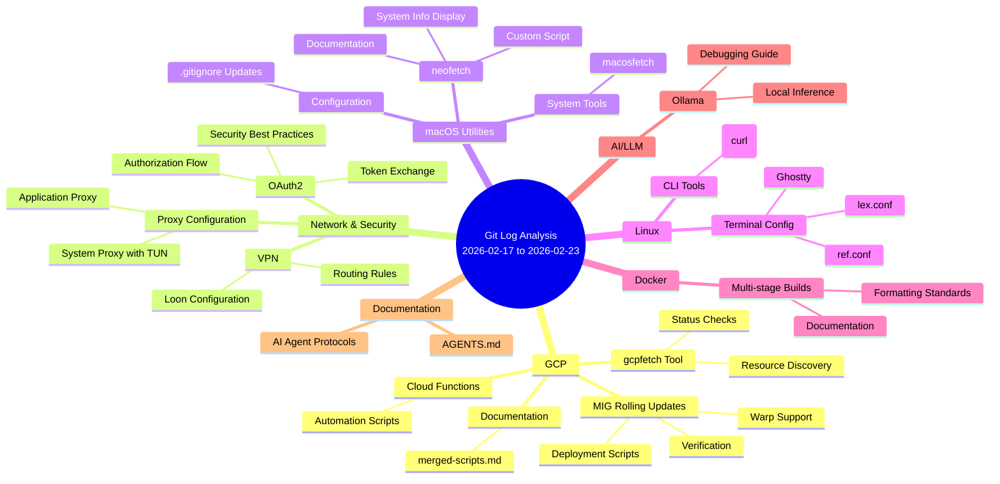

# Git Log Analysis Report (Last Week)

> **Report Generated:** 2026-02-23  
> **Analysis Period:** 2026-02-17 to 2026-02-23  
> **Total Commits:** 11

---

## Overview

This week's development activity focused on **GCP infrastructure automation**, **networking documentation**, **macOS utilities**, and **VPN/proxy configurations**. The work demonstrates a strong emphasis on DevOps tooling, cloud infrastructure management, and system configuration.

---

## File Changes by Technical Domain

### 1. GCP (Google Cloud Platform) 🟦

> **Files:** 8 | **Activity:** High

| File | Status | Description |
|------|--------|-------------|
| `gcp/gcp-infor/merged-scripts.md` | Added | Merged GCP scripts documentation |
| `gcp/gcp-infor/gcp-explore.sh` | Added | GCP exploration utility script |
| `gcp/gcp-infor/gcp-functions.sh` | Added | GCP functions automation script |
| `gcp/gcp-infor/gcpfetch` | Added | GCP information fetcher tool |
| `gcp/gcp-infor/gcpfetch-README.md` | Added | Documentation for gcpfetch |
| `gcp/gce/rolling/rolling-mig-and-verify-status.sh` | Renamed | Rolling MIG deployment script (typo fix) |
| `gcp/gce/rolling/rolling-mig-and-verify-status-warp.sh` | Added | Warp-enabled version of rolling MIG script |

#### Key Knowledge Points

- **Managed Instance Group (MIG) Rolling Updates** — Automation scripts for deploying and verifying rolling updates across GCE instance groups
- **GCP Information Gathering** — Created tooling (`gcpfetch`) for quick GCP resource discovery and status checks
- **Cloud Functions Automation** — Shell scripts for managing and invoking GCP Cloud Functions
- **Script Maintenance** — Renamed file to fix typo (`rooling` → `rolling`), demonstrating attention to code quality

---

### 2. Network & Security 🟩

> **Files:** 3 | **Activity:** Medium

| File | Status | Description |
|------|--------|-------------|
| `network/docs/oauth2-authorization.md` | Modified (3x) | OAuth2 authorization flow documentation |
| `network/docs/appproxy.md` | Added | Application proxy configuration guide |
| `vpn/systemproxy-with-tun.md` | Modified (2x) | System proxy with TUN interface setup |
| `vpn/loon.conf` | Added | Loon VPN configuration file |

#### Key Knowledge Points

- **OAuth2 Authorization Flow** — Comprehensive documentation of OAuth2 grant types, token exchange, and security best practices
- **Application-Level Proxying** — Configuration patterns for app-specific proxy routing
- **TUN-based VPN** — System-level proxy configuration using TUN interfaces for full-device traffic routing
- **Loon VPN Rules** — Custom VPN routing rules for selective traffic handling

---

### 3. macOS System Utilities 🟨

> **Files:** 5 | **Activity:** Medium

| File | Status | Description |
|------|--------|-------------|
| `bin/macosfetch` | Added | macOS system information fetcher |
| `bin/neofetch` | Added | Neofetch wrapper/utility |
| `macos/neofetch/neofetch.sh` | Added | Neofetch display script |
| `neofetch.md` | Added | Neofetch usage documentation |
| `.gitignore` | Modified | Updated ignore patterns |

#### Key Knowledge Points

- **System Information Display** — Custom `neofetch` implementation for macOS system profiling
- **Dotfiles Management** — Proper `.gitignore` configuration for development environments
- **Shell Script Organization** — Binary utilities in `bin/` directory for PATH accessibility

---

### 4. Linux Configuration 🟥

> **Files:** 3 | **Activity:** Low

| File | Status | Description |
|------|--------|-------------|
| `linux/scripts/curl-weather.md` | Added | Weather API curl command examples |
| `linux/config/ghostty-config/lex.conf` | Added | Personal Ghostty terminal configuration |
| `linux/config/ghostty-config/ref.conf` | Added | Reference Ghostty configuration |

#### Key Knowledge Points

- **Terminal Emulator Configuration** — Ghostty terminal setup with custom keybindings and appearance settings
- **CLI Weather Integration** — Using curl to fetch weather data from APIs directly in terminal

---

### 5. Docker 🟪

> **Files:** 1 | **Activity:** Low

| File | Status | Description |
|------|--------|-------------|
| `docker/multistage-builds/Dockerfile.md` | Modified | Multi-stage Docker build documentation |

#### Key Knowledge Points

- **Multi-stage Builds** — Documentation standards for Docker multi-stage build patterns
- **Markdown Formatting** — Normalized list indentation for better readability

---

### 6. AI/LLM Integration 🟧

> **Files:** 1 | **Activity:** Low

| File | Status | Description |
|------|--------|-------------|
| `ai/debug-ollama.md` | Added | Ollama LLM debugging guide |

#### Key Knowledge Points

- **Ollama Debugging** — Techniques for troubleshooting local LLM deployment and inference

---

### 7. Documentation Standards ⬜

> **Files:** 1 | **Activity:** Low

| File | Status | Description |
|------|--------|-------------|
| `AGENTS.md` | Added | AI agent interaction guidelines |

#### Key Knowledge Points

- **AI Agent Protocols** — Documentation for how AI assistants should interact with the codebase

---

## Mermaid Mindmap

---

## Summary Statistics

| Domain               | Files Added | Files Modified | Files Renamed | Total |
|----------------------|-------------|----------------|---------------|-------|
| GCP                  | 6           | 0              | 1             | 7     |
| Network & Security   | 2           | 3              | 0             | 5     |
| macOS Utilities      | 4           | 1              | 0             | 5     |
| Linux                | 3           | 0              | 0             | 3     |
| Docker               | 0           | 1              | 0             | 1     |
| AI/LLM               | 1           | 0              | 0             | 1     |
| Documentation        | 1           | 0              | 0             | 1     |
| **Total**            | **17**      | **5**          | **1**         | **23**|

---

## Key Insights

1. **Infrastructure Automation Focus** — Heavy investment in GCP tooling suggests active cloud infrastructure management and deployment automation needs.

2. **Documentation-Driven Development** — Strong emphasis on documenting configurations, scripts, and workflows indicates a mature approach to knowledge management.

3. **Local Development Environment** — macOS and Linux configuration work shows attention to developer experience and productivity tooling.

4. **Security & Networking** — OAuth2 and VPN/proxy work suggests work on secure application architectures and network configurations.

5. **AI Integration** — Adding Ollama debugging documentation indicates exploration of local LLM deployment for development workflows.

---

## Recommendations

1. **Consider consolidating** GCP fetch tools into a single CLI utility
2. **Add tests** for rolling MIG deployment scripts to ensure reliability
3. **Document** the relationship between appproxy and systemproxy configurations
4. **Version** the neofetch configuration for easy rollback

---

*Generated automatically from git log analysis*
