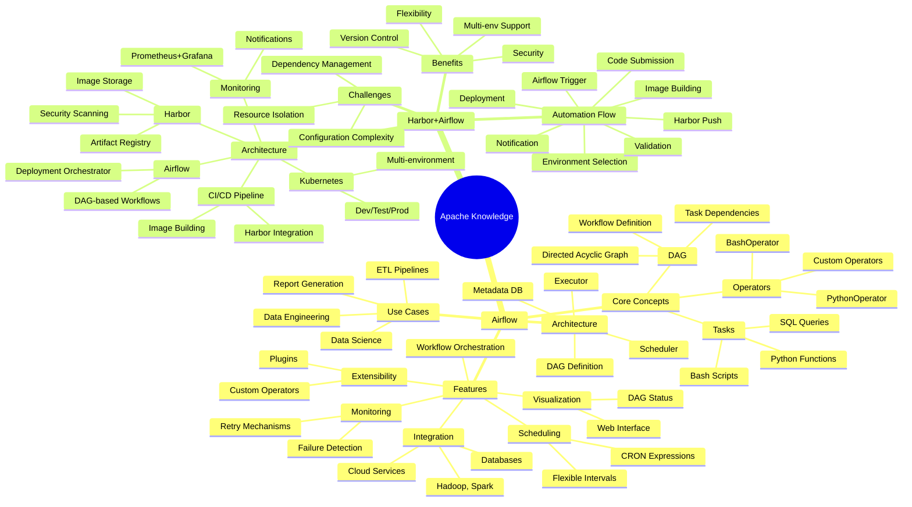

# Apache Knowledge Mind Map

## Apache Airflow

### Core Concepts
- **DAG (Directed Acyclic Graph)**
  - Definition: A series of tasks with ordered dependencies
  - Purpose: Ensures tasks run in dependency order
  - Components:
    - Tasks: Basic operational units (Python functions, Bash scripts, SQL queries)
    - Operators: Define task operations (PythonOperator, BashOperator, etc.)
    - Dependencies: Relationships between tasks (Task A must complete before Task B)

### Key Features
- **Workflow Orchestration**
  - Define dependencies as DAGs
  - Clear execution order
- **Scheduling**
  - Flexible scheduling (CRON expressions)
  - Daily, hourly intervals
- **Visualization**
  - Web interface for DAG status
  - Monitor execution, failures, retries
- **Monitoring & Retry**
  - Failure detection
  - Retry strategies
- **Extensibility**
  - Custom operators and sensors
  - Plugin system
- **Integration**
  - Hadoop, Spark, Postgres, MySQL, S3, GCS, Kafka

### Use Cases
- **ETL (Extract, Transform, Load)**
  - Data pipeline orchestration
  - Multiple data sources
- **Data Science Workflows**
  - Model training automation
  - Regular analysis tasks
- **Data Engineering**
  - Data processing task management
  - Cleaning and transformation
- **Report Generation**
  - Scheduled reports
  - Automated delivery

### Architecture Components
- **DAG Definition**
  - Python code defining workflow
  - Task dependencies
- **Scheduler**
  - Runs DAGs according to schedule
- **Executor**
  - Determines how tasks run
  - Sequential, Local, Celery, Kubernetes
- **Metadata Database**
  - Stores state information
  - PostgreSQL, MySQL, SQLite

## Harbor + Airflow Integration

### Architecture Components
- **Harbor**
  - Artifact registry
  - Image storage and distribution
  - Security scanning and signing
- **Airflow**
  - Deployment orchestrator
  - DAG-based workflows
- **CI/CD Pipeline**
  - Builds and pushes images
  - Connects to Harbor
- **Kubernetes Clusters**
  - Multi-environment deployment
  - Dev, Test, Staging, Production
- **Monitoring & Notification**
  - Prometheus + Grafana
  - Slack/email notifications

### Automation Flow
1. Developer submits code
2. CI/CD builds image
3. Push image to Harbor
4. Airflow detects new image/request
5. Select deployment environment
6. Deploy to selected environment
7. Validate deployment
8. Notify results and update status

### Benefits
- Multi-environment support
- Flexibility in DAG configuration
- Security through image scanning
- Version management

### Challenges
- Complexity in Airflow configuration
- Dependency management
- Resource isolation across environments

## Knowledge Connections

### Common Themes
- **Orchestration**: Both focus on managing complex workflows
- **Automation**: Reducing manual intervention
- **Scheduling**: Time-based or event-driven execution
- **Monitoring**: Tracking execution status and health

### Integration Points
- Harbor as artifact store for Airflow-managed deployments
- Airflow DAGs triggering Harbor-based release pipelines
- Multi-environment deployment coordination
- Security and compliance through Harbor features

### Best Practices
- Use DAGs to define clear dependencies
- Implement proper error handling and retry mechanisms
- Maintain version control for both code and configurations
- Apply security scanning to all artifacts
- Monitor and alert on deployment status

## Visual Mind Map

