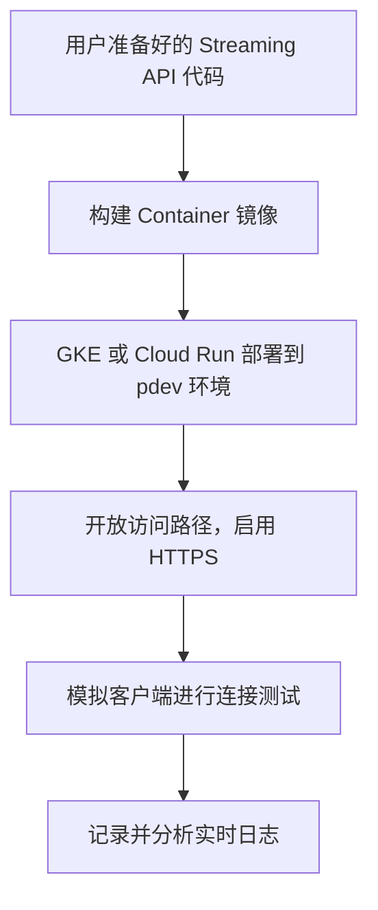
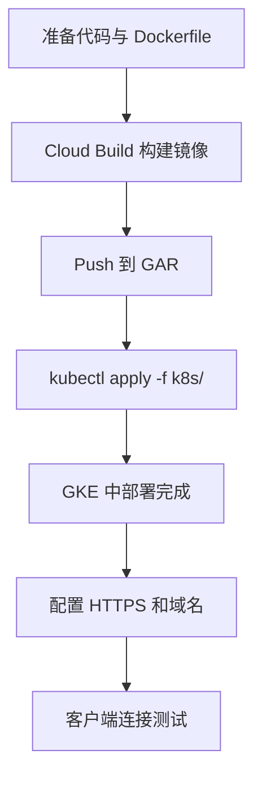
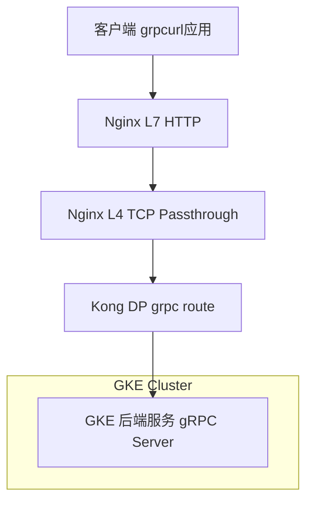

# Stream Events API 学习与实践文档

---

# 摘要

- 在 **gRPC Streaming** 或任何基于 **HTTP/2** 协议的服务架构中，**不仅 GKE 后端要支持 gRPC/HTTP2，前面的每一层（Nginx L4/L7、Kong DP、LB）都必须正确转发并支持该协议**，否则连接会失败或退化为 HTTP/1.1，导致 Streaming 不可用或行为异常。
- `grpcurl` 是一个用于调试 gRPC 服务的关键命令行工具。

### API 描述

```text
A stream events API allows applications to receive a continuous flow of data from a source, enabling real-time updates and event-driven interactions. Unlike traditional REST APIs that require requests for data, stream APIs maintain an open connection to push data as it becomes available.

流事件API允许应用程序接收来自源的实时数据流，支持实时更新和事件驱动的交互。不同于传统REST API，它们保持开放连接，实时推送数据。
```

### 表：GCP流式API计算选项：PoC��焦分析

| 标准 | Cloud Run | GKE (Autopilot) | App Engine Flex |
| :--- | :--- | :--- | :--- |
| **PoC设置速度** | 最快 | 较慢 | 慢 |
| **流式配置复杂度** | 低（仅需设置超时） | 高（需配置`BackendConfig`） | 中等 |
| **运维开销** | 最低 | 中等 | 低 |
| **成本模型** | 按使用付费，可缩减至零 | 按集群资源付费，无零扩展 | 按实例运行时长付费，无零扩展 |
| **可扩展性** | 快速，基于请求的自动伸缩 | 灵活，基于Pod指标的自动伸缩 | 自动伸缩，但速度较慢 |
| **灵活性/控制力** | 中等 | 最高 | 中等 |
| **PoC推荐度** | **强烈推荐** | 适用于已有GKE环境的团队 | 不推荐 |

### 关键架构组合

- Nginx (启用 HTTP/2) + Kong DP (启用 gRPC) + GKE Runtime

### 实时通信协议：gRPC流 vs. WebSockets

| 标准 | gRPC 流 | WebSockets |
| :--- | :--- | :--- |
| **底层协议** | HTTP/2 | HTTP/1.1 (升级而来) |
| **数据格式** | 二进制 (Protocol Buffers) | 文本 (JSON) 或 二进制 |
| **浏览器支持** | 需要gRPC-Web代理 | 原生支持 |
| **性能** | 更高 (多路复用, 二进制格���) | 较高 (但受限于HTTP/1.1) |
| **API契约** | 严格 (在 `.proto` 文件中定义) | 松散 (由应用层面定义) |
| **开发体验** | 需要代码生成工具 (protoc) | 简单，使用标准API |
| **理想用例** | 服务间通信、移动客户端 | Web应用、浏览器客户端 |

---

# PoC 指南：Stream Events API on GCP

要在 GCP 工程中完成一次 **Stream Events API** 的 PoC（Proof of Concept）测试，你可以从以下几个关键方向准备和理解。以下内容将帮助你全面评估并组织所需资源。

## ✅ 测试 PoC 所需准备清单（职责清晰）

| 项目 | 说明 | 示例或建议 Pod 负责人 |
| :--- | :--- | :--- |
| **API 部署** | 将 User 提供的 Stream Events API 部署到 pdev 环境 | Backend / DevOps |
| **流式协议理解** | 理解 Stream API 所采用的通信协议（如 SSE, gRPC Streaming, WebSocket） | Backend Pod |
| **流量模拟/消费方** | 实现或使用已有的客户端消费 Stream 数据（可为 CLI, Postman, 浏览器, 脚本等） | Frontend / QA / Dev Support |
| **测试用例设计** | 设计包含连接中断、重连、异常数据等的完整��试用例 | QA / Dev Support |
| **监控与日志** | 打开日志或在 GCP 上配置监控流量与连接信息（Cloud Logging, Cloud Trace） | DevOps |
| **安全控制/限流** | 如果走公网接入，需要评估 API 的认证、授权、速率限制等策略 | Platform / SRE |

---

## 📌 推荐从哪些地方着手

### 1. 理解 Stream API 的类型

Streaming API 通常采用以下协议之一：

| 协议类型 | 特性说明 | 示例应用场景 |
| :--- | :--- | :--- |
| **SSE (Server-Sent Events)** | 单向，从服务端向客户端发送事件（基于 HTTP） | 浏览器事件推送、状态监控 |
| **WebSocket** | 双向通信，连接保持，适合实时交互 | 实时聊天、股票推送 |
| **gRPC Streaming** | 基于 HTTP/2 的流式传输，支持双向、单向流 | 内部服务通信，低延迟高性能需求 |
| **HTTP Long Polling** | 伪流式，通过循环请求实现 | 老旧浏览器兼容，延时高 |

> 🔍 **建议：优先确认该 API 使用的协议类型（可在 Swagger 或文档说明中查看）。**

### 2. GCP 平台准备



-   **部署平台：**
    -   若为长连接，推荐使用 **GKE**（更好控制连接保持）。
    -   若为短连接或需快速部署测试，可用 **Cloud Run**。
-   **开放端口/协议注意：**
    -   SSE / WebSocket / gRPC Streaming 必须使用 **HTTPS** 和支持 **HTTP/2**。

### 3. 测试设计建议

| 测试场景 | 内容 |
| :--- | :--- |
| **正常连接** | 客户端连接成功，持续接收事件 |
| **异常重连** | 模拟网络断开后重连，检查连接恢复是否正常 |
| **超时 / KeepAlive** | 是否有心跳机制或超时断开机制 |
| **多客户端并发连接** | 模拟多个客户端连接，观察服务端的性能表现 |
| **数据内容验证** | 事件格式是否符合预期，是否支持 JSON schema 校验等 |
| **错误码与关闭行为** | 服务端主动关闭连接是否有明确返回码、消息 |

### 4. 流式日志 / Debug

启用如下 GCP 功能辅助排查：

-   **Cloud Logging**：查看连接数、错误码
-   **Cloud Trace / APM**：若支持 tracing，可用来看事件流是否被完整处理
-   **客户端日志**：建议记录 Event ID、时间戳、事件内容、断开重连次数等

---

## 📘 你可以提前了解的相关概念

| 概念/术语 | 推荐文档或资源说明 |
| :--- | :--- |
| **Streaming API 类型** | [MDN: Server-sent events](https://developer.mozilla.org/en-US/docs/Web/API/Server-sent_events) |
| **WebSocket / SSE 差异** | [Ably: WebSockets vs. SSE](https://ably.com/concepts/websockets-vs-sse) |
| **gRPC Streaming** | [gRPC Concepts](https://grpc.io/docs/guides/concepts/) |
| **Cloud Run vs GKE** | [Google Cloud: Cloud Run vs GKE](https://cloud.google.com/run/docs/compare-gke) |

---

## ✅ GKE 部署 PoC：Stream Events API 示例

下面是一个完整的 **GKE 上部署 Stream Events API** 的参考 PoC 结构，适用于 pdev 环境。

### 📁 项目结构预期

```bash
stream-events-api/
├── Dockerfile
├── k8s/
│   ├── deployment.yaml
│   ├── service.yaml
│   ── ingress.yaml
├── README.md
└── src/
    └── main.py
```

### 🐳 Dockerfile 示例 (Python/SSE)

假设使用 Python FastAPI + SSE：

```dockerfile
FROM python:3.11-slim

WORKDIR /app
COPY ./src /app

RUN pip install fastapi uvicorn sse-starlette

CMD ["uvicorn", "main:app", "--host", "0.0.0.0", "--port", "8080"]
```

### 🚀 GKE 部署 YAML

#### k8s/deployment.yaml

```yaml
apiVersion: apps/v1
kind: Deployment
metadata:
  name: stream-events-api
  labels:
    app: stream-events-api
spec:
  replicas: 2
  selector:
    matchLabels:
      app: stream-events-api
  template:
    metadata:
      labels:
        app: stream-events-api
    spec:
      containers:
        - name: stream-events-api
          image: gcr.io/[YOUR_PROJECT_ID]/stream-events-api:latest
          ports:
            - containerPort: 8080
          readinessProbe:
            httpGet:
              path: /healthz
              port: 8080
            initialDelaySeconds: 5
            periodSeconds: 10
```

#### k8s/service.yaml

```yaml
apiVersion: v1
kind: Service
metadata:
  name: stream-events-api
spec:
  selector:
    app: stream-events-api
  ports:
    - protocol: TCP
      port: 80
      targetPort: 8080
  type: ClusterIP
```

#### k8s/ingress.yaml (假设使用 Ingress + HTTPS)

```yaml
apiVersion: networking.k8s.io/v1
kind: Ingress
metadata:
  name: stream-events-api-ingress
  annotations:
    kubernetes.io/ingress.class: "gce"
    networking.gke.io/managed-certificates: "stream-api-cert"
spec:
  rules:
    - host: stream-api.pdev.example.com
      http:
        paths:
          - path: /
            pathType: Prefix
            backend:
              service:
                name: stream-events-api
                port:
                  number: 80
```

> 💡 如需启用 WebSocket/gRPC，请确认 Load Balancer 使用 **HTTP/2** 和正确的路径转发配置。

### ✅ GCP 构建与部署流程



### 🧪 ���例连接测试脚本 (SSE)

```bash
curl -N http://stream-api.pdev.example.com/events
```

### ✅ 验证点 Checklist

| 验证项 | 是否通过 | 说明 |
| :--- | :--- | :--- |
| **Pod 正常运行** | ✅ | `kubectl get pods` 状态为 Running |
| **readinessProbe 正常** | ✅ | 正确响应 `/healthz` |
| **服务可访问** | ✅ | 使用 curl/浏览器可接收事件 |
| **HTTPS 有效** | ✅ | 是否配置 TLS 和域名 |
| **多客户端测试** | ✅ | 同时连接多个客户端是否正常 |
| **日志可观测性** | ✅ | 能看到请求连接与事件发送日志 |

---

## ✅ WebSocket 和 gRPC Streaming 在 GKE 上部署示例

### 🧩 一、WebSocket Streaming API 部署示例

**场景说明**: 服务保持 WebSocket 长连接，推送实时事件。适合用于前端或 Node.js 客户端测试。

#### 示例应用结构 (Node.js Express)

```javascript
// src/main.js
const express = require('express');
const http = require('http');
const { Server } = require('ws');

const app = express();
const server = http.createServer(app);
const wss = new Server({ server });

wss.on('connection', (ws) => {
  console.log('Client connected');
  setInterval(() => {
    ws.send(JSON.stringify({ event: 'ping', timestamp: new Date() }));
  }, 3000);
});

app.get('/healthz', (_, res) => res.send('ok'));

server.listen(8080, () => {
  console.log('WebSocket server listening on 8080');
});
```

#### Dockerfile

```dockerfile
FROM node:20-alpine
WORKDIR /app
COPY ./src /app
RUN npm install ws express
CMD ["node", "main.js"]
```

#### GKE YAML 资源

1.  `readinessProbe` 仍使用 `/healthz`。
2.  Ingress 需开启 WebSocket 支持。

```yaml
# ingress.yaml
apiVersion: networking.k8s.io/v1
kind: Ingress
metadata:
  name: websocket-ingress
  annotations:
    # 如果使用 Nginx Ingress Controller
    nginx.ingress.kubernetes.io/proxy-read-timeout: "3600"
    nginx.ingress.kubernetes.io/enable-websocket: "true"
spec:
  # ... rules
```

> ✅ GCE Ingress 原生支持 WebSocket，但仍需设置 `BackendConfig` 保持连接稳定。

---

### 🧬 二、gRPC Streaming API 示例 (Python 实现)

**场景说明**: 实现一个简单的双向 gRPC 流式聊天 API。

#### Proto 定义 (chat.proto)

```proto
syntax = "proto3";

service ChatService {
  rpc ChatStream(stream ChatMessage) returns (stream ChatMessage);
}

message ChatMessage {
  string user = 1;
  string message = 2;
  int64 timestamp = 3;
}
```

#### Python 服务端示例 (src/server.py)

```python
import grpc
from concurrent import futures
import time
import chat_pb2
import chat_pb2_grpc

class ChatService(chat_pb2_grpc.ChatServiceServicer):
    def ChatStream(self, request_iterator, context):
        for req in request_iterator:
            print(f"[{req.user}] {req.message}")
            yield chat_pb2.ChatMessage(user="server", message="ack", timestamp=int(time.time()))

def serve():
    server = grpc.server(futures.ThreadPoolExecutor(max_workers=10))
    chat_pb2_grpc.add_ChatServiceServicer_to_server(ChatService(), server)
    server.add_insecure_port('[::]:50051')  # use insecure for h2c
    server.start()
    server.wait_for_termination()

if __name__ == '__main__':
    serve()
```

#### Dockerfile

```dockerfile
FROM python:3.11-slim
WORKDIR /app
COPY ./src /app
RUN pip install grpcio grpcio-tools
CMD ["python", "server.py"]
```

### 🔧 GKE 配置关键点 (gRPC)

#### deployment.yaml

```yaml
apiVersion: apps/v1
kind: Deployment
metadata:
  name: grpc-stream-server
spec:
  # ...
  template:
    # ...
    spec:
      containers:
        - name: grpc-stream-server
          image: gcr.io/[YOUR_PROJECT]/grpc-server:latest
          ports:
            - containerPort: 50051
          readinessProbe:
            tcpSocket:
              port: 50051
```

#### service.yaml

```yaml
apiVersion: v1
kind: Service
metadata:
  name: grpc-service
  annotations:
    cloud.google.com/backend-config: '{"default": "grpc-backend-config"}'
spec:
  selector:
    app: grpc-stream-server
  ports:
    - name: grpc
      port: 80
      targetPort: 50051
  type: ClusterIP
```

#### backend-config.yaml

```yaml
apiVersion: cloud.google.com/v1
kind: BackendConfig
metadata:
  name: grpc-backend-config
spec:
  timeoutSec: 3600
  protocol: HTTP2
```

#### ingress.yaml

```yaml
apiVersion: networking.k8s.io/v1
kind: Ingress
metadata:
  name: grpc-ingress
  annotations:
    kubernetes.io/ingress.class: "gce"
    cloud.google.com/app-protocols: '{"grpc-service":"HTTP2"}'
spec:
  rules:
    - host: grpc-api.pdev.example.com
      http:
        paths:
          - path: /
            pathType: ImplementationSpecific
            backend:
              service:
                name: grpc-service
                port:
                  number: 80
```

### ✅ 验证连接 (gRPC 客户端示例)

```bash
# 安装 grpcurl
grpcurl -plaintext grpc-api.pdev.example.com:80 list
grpcurl -d '{}' -plaintext grpc-api.pdev.example.com:80 ChatService/ChatStream
```

### ✅ 注意事项

| 检查项 | WebSocket | gRPC Streaming |
| :--- | :--- | :--- |
| **是否支持长连接** | ✅ | ✅ |
| **是否需要 HTTP/2** | ❌ (HTTP/1.1 足够) | ✅ (强制 HTTP/2) |
| **客户端接入方式** | 浏览器 / curl / ws lib | grpcurl / gRPC 客户端 |
| **GKE LB 配置** | ✅ | ✅ (需 App Protocol) |
| **readinessProbe** | ✅ `/healthz` | ✅ TCP 探针 |
| **端口暴露** | ✅ 8080 -> 80 | ✅ 50051 -> 80 |

---

## 📦 端到端 gRPC 架构部署 (Nginx -> Kong -> GKE)

以下是适用于 **Nginx L7 → Nginx L4 → Kong DP → GKE gRPC 后端** 架构的完整部署 YAML 文件及验证流程。

### 架构部署结构图



### 🧱 一、后端服务：GKE gRPC Server

#### 1.1 grpc-server-deployment.yaml

```yaml
apiVersion: apps/v1
kind: Deployment
metadata:
  name: grpc-server
spec:
  replicas: 2
  selector:
    matchLabels:
      app: grpc-server
  template:
    metadata:
      labels:
        app: grpc-server
    spec:
      containers:
        - name: grpc-server
          image: gcr.io/[YOUR_PROJECT_ID]/grpc-server:latest
          ports:
            - containerPort: 50051
          readinessProbe:
            tcpSocket:
              port: 50051
            initialDelaySeconds: 3
            periodSeconds: 10
```

#### 1.2 grpc-server-service.yaml

```yaml
apiVersion: v1
kind: Service
metadata:
  name: grpc-server
  annotations:
    cloud.google.com/backend-config: '{"default": "grpc-backend-config"}'
spec:
  selector:
    app: grpc-server
  ports:
    - name: grpc
      port: 80
      targetPort: 50051
  type: ClusterIP
```

#### 1.3 grpc-backend-config.yaml

```yaml
apiVersion: cloud.google.com/v1
kind: BackendConfig
metadata:
  name: grpc-backend-config
spec:
  timeoutSec: 3600
  protocol: HTTP2
```

### 🛠 二、Kong Route 配置

可通过 Admin API 或 Declarative 配置：

```yaml
# kong-grpc-service.yaml
_format_version: "3.0"
services:
  - name: grpc-service
    host: grpc-server.default.svc.cluster.local # 假设在 default namespace
    port: 80
    protocol: grpc
    routes:
      - name: grpc-route
        paths:
          - /
        protocols:
          - grpc
```

> ✅ 若使用 Kong Ingress Controller，建议直接使用 `KongIngress` 资源。

### 🧩 三、Nginx L4 配置 (tcp proxy)

```nginx
stream {
    upstream kong_grpc {
        server kong-dp.kong-namespace.svc.cluster.local:8000;
    }

    server {
        listen 8443;
        proxy_pass kong_grpc;
        proxy_protocol on;
    }
}
```

### 🌐 四、Nginx L7 配置 (支持 gRPC/HTTP2)

```nginx
server {
    listen 443 ssl http2;
    server_name grpc-api.example.com;

    ssl_certificate /etc/nginx/ssl/fullchain.pem;
    ssl_certificate_key /etc/nginx/ssl/privkey.pem;

    location / {
        grpc_pass grpc://127.0.0.1:8443;  # 指向 L4 passthrough
        error_page 502 = /error502grpc;
    }

    location = /error502grpc {
        internal;
        default_type application/grpc;
        add_header grpc-status 14;
        add_header grpc-message "unavailable";
        return 204;
    }
}
```

### ✅ 验证流程 Checklist

| 步骤 | 验证项 | 命令或方式 |
| :--- | :--- | :--- |
| 1 | **确认 GKE Pod 正常** | `kubectl get pods -l app=grpc-server` |
| 2 | **测试 ClusterIP 可访问** | `grpcurl -plaintext grpc-server.default.svc.cluster.local:80 list` |
| 3 | **测试 Kong DP 转发** | `grpcurl -plaintext kong-dp-service:8000 list` |
| 4 | **验证 Nginx L4 转发** | `grpcurl -plaintext nginx-l4-service:8443 list` |
| 5 | **最终端到端访问** | `grpcurl -proto ./chat.proto -H "Host: grpc-api.example.com" https://grpc-api.example.com:443 ChatService/ChatStream` |
| 6 | **检查协议** | 抓包 / 浏览器开发者工具 → ALPN 协议为 `h2` |
| 7 | **检查 Kong 日志** | 查看请求命中 route/service |

### 🎯 推荐增强

| 项目 | 建议配置 |
| :--- | :--- |
| **Kong TLS 验证** | 使用 `grpcs` 端到端 TLS（GKE 后端必须启用 TLS） |
| **客户端证书认证** | 使用 Kong Gateway + mTLS + Client Validation |
| **限流与审计** | 使用 Kong 插件配置 `rate-limiting` 和 `log` 插件 |
| **日志观测** | Stackdriver Logging + Kong Log Plugin |

---

# 在GCP上构建流式事件API的概念验证（PoC）权威指南

## 第一部分：在GCP上解构“流式事件API”

### 1.1. Google Cloud事件驱动架构（EDA）导论

事件驱动架构（Event-Driven Architecture, EDA）是一种软件设计模式，其中微服务对状态的变化（称为“事件”）做出反应。这些事件可以携带具体的数据（例如商品价格或配送地址），也可以作为标识符（例如订单已收到或已发货的通知）。事件触发微服务协同工作以实现共同目标，但这些服务之间除了事件格式外，无需了解彼此的任何信息。

在GCP环境中，一个典型的事件驱动系统由三个核心解耦组件构成：

-   **事件生产者（Event Producers）**：生成事件的系统或服务。
-   **事件路由器（Event Router）**：也称为代理（Broker），负责接收、过滤事件，并将其分发给相应的消费者。GCP中的Cloud Pub/Sub是此角色的典型代表。
-   **事件消费者（Event Consumers）**：也称为接收器（Sinks），是订阅并处理事件的服务。

这种架构模式的主要优势在于其固有的特性，这些特性对于构建现代化、可扩展的系统至关重要：

-   **松散耦合与开发者敏捷性**：生产者和消费者在逻辑上是分离的，这意味着服务可以独立地进行扩展、更新和部署，而不会相互影响。这种解耦减少了系统间的依赖，并允许使用不同的编程语言和框架进行开发。
-   **异步事件处理与弹性**：事件是异步生成的，发布后无需等待响应。松散耦合的组件确保了如果一个服务发生故障，其他服务不会受到影响，从而提高了整个系统的弹性。
-   **基于推送的消息传递与成本效益**：事件驱动系统支持基于推送的消息传递，客户端无需持续轮询远程服务以获取状态变更，从而实现了实时更新。这不仅可以进行即时的数据处理和分析，还能显著减少网络I/O，从而降低成本。

### 1.2. 流式API的本质：从REST的范式转变

用户提到的“流式事件API”代表了与传统REST API的根本性范式转变。传统的REST API遵循请求-响应模型：客户端发起请求，服务器处理后返回响应，然后连接关闭。为了获取更新，客户端必须重复此过程，即所谓的“轮询”。

相比之下，流式API（如使用WebSockets或gRPC流）在客户端和服务器之间建立一个持久的、开放的连接。一旦连接建立，服务器可以在任何时候主动向客户端“推送”数据，只要有新的事件或数据可用。这种模式的核心价值在于实现了真正的实时交互，客户端能���即时接收更新，而无需进行低效的轮询。一个具体的例子是，当一个文件被上传到Google Cloud Storage (GCS)时，GCS可以发布一个事件。这个事件可以触发一系列下游流程，例如一个Cloud Function来处理文件，并将结果实时地通过流式API推送到前端应用，而这一切都是自动且即时的。

### 1.3. 深度解析：采用EDA的战略意义

选择事件驱动架构不仅仅是一项技术决策，更是一项组织和思维方式的决策。它要求开发团队从传统的同步、命令式思维（“执行这个操作”）转向异步、声明式思维（“这件事发生了”）。这种转变对系统的可观测性和团队协作模式产生了深远的影响。

在一个传统的同步API调用链中，路径是清晰且可追溯的。如果服务A调用服务B，而服务B失败，错误会立即传播回服务A。但在事件驱动架构中，生产者将事件发送到像Pub/Sub这样的消息代理后，其任务便已完成。消费者稍后才会异步地处理该事件。如果消费者处理失败，生产者并不会立即知晓。这种解耦是系统弹性的基石，��同时也给问题追溯带来了挑战。传统的静态代码分析效果有限，而通过全面的日志记录和监控进行动态追踪变得至关重要。因此，构建流式API的决定，从一开始就意味着需要对强大的可观测性工具（如Cloud Logging和Cloud Monitoring）进行投入，而不是将其视为事后工作。本次PoC的设计也必须包含相应的监控验证计划。

此外，事件驱动架构催生了一种名为“事件溯源”（Event Sourcing）的强大模式，即使在PoC阶段也值得考虑其潜力。事件是关于已发生事实的不可变记录。如果系统中的每一次状态变更都被捕获为一个事件并持久化存储，那么这个事件日志就构成了系统的唯一真实来源。这带来了巨大的优势：能够重建应用在任意时间点的状态，用于调试复杂的事件序列，并提供一个完整且不可篡改的审计追踪。对于PoC而言，这意味着在设计事件负载（payload）时，不仅要考虑当前消费者的需求，还应包含足够丰富的上下文信息，以便未来进行审计或事件重放。

## 第二部分：架构的支柱：Google Cloud Pub/Sub

### 2.1. Pub/Sub简介：GCP的全球消息服务

在GCP的事件驱动架构中，Cloud Pub/Sub扮演着“中央神经系统”的角色。它是一个完全托管、可扩展的异步消息传递服务，旨在解耦消息的生产者和消费者。Pub/Sub的核心特性使其成为构建企业级流式解决方案的理想选择：

-   **全球可扩展性**：能够以极低的延迟在全球范围内每秒处理数百万条消息。
-   **高可靠性**：保证消息的“至少一次”投递，并提供机制来处理重复消息。
-   **完全托管**：无需预配或管理分区、代理等基础设施，开发者可以专注于业务逻辑。

### 2.2. 核心概念：Pub/Sub的语言

要有效地使用Pub/Sub，必须理解其核心术语：

-   **主题（Topic）**：一个命名的资源，发布者将消息发送到这里。它代表了一个消息流。
-   **发布者（Publisher）**：创建消息并将其发送到特定主题的应用程序或服务。
-   **消息（Message）**：通过服务传输的数据单元。它包含一个数据负载（payload）和可选的元数据属性（attributes）。
    **��性**是一个关键特性，它允许消费者根据键值对来过滤消息，从而实现更精细的路由逻辑。
-   **订阅（Subscription）**：一个命名的资源，代表了从特定主题流向一个或多个订阅者的消息流。
-   **订阅者（Subscriber）**：从订阅中接收消息的应用程序或服务。

### 2.3. 关键抉择：推送、拉取与流式拉取订阅

Pub/Sub提供了三种主要的消息投递机制，这是一个关键的架构决策点。

-   **推送订阅（Push Subscription）**：当消息到达时，Pub/Sub会立即将其作为HTTP POST请求发送到预先配置的HTTPS端点（例如，一个Cloud Run服务）。这种方式简单，并且与无服务器计算模式天然契合。
-   **拉取订阅（Pull Subscription）**：订阅者应用程序必须主动向Pub/Sub服务请求（或“拉取”）消息。这赋予了消费者对消息处理速率的完全控制权。
-   **流式拉取订阅（Streaming Pull）**：这是拉取模式的一种高级形式，订阅者与Pub/Sub建立一个持久的双向gRPC连接。消息会通过这个流持续不断地被发送给订阅者，为高吞吐量场��提供了最低的延迟。

### 2.4. 深度解析：订阅类型与计算选择的共生关系

选择推送还是拉取模式并非孤立的决定，它与计算平台（Cloud Run或GKE）的选择紧密相连。这是一个关键的因果关系，理解这一点对于设计高效的系统至关重要。

Cloud Run服务本质上是一个通过HTTPS端点暴露的服务，其设计初衷就是为了响应HTTP请求而被调用。而Pub/Sub的推送订阅恰好通过向指定端点发送HTTP POST请求来工作。这两者形成了完美的、原生的集成。Cloud Run的自动伸缩机制正是由这些来自Pub/Sub的HTTP请求速率所触发，构成了一个无缝的、高效的无服务器处理模式。

相比之下，一个GKE Pod本身并非一个公开的HTTP端点。尽管它可能运行着一个Web服务器，但它位于集群的私有网络内部。若要使用推送模式，需要通过Kubernetes Service和Ingress将其暴露出来，这无疑增加了配置的复杂性。因此，GKE更适合采用**拉取**模型。在Pod中运行一个长期存在的进程，该进程使用Pub/Sub客户端库持续地从订阅中拉取消息。这使得应用程序能够对消息的获取、批处理、确认（ack）和流量控制拥有精细的控制力，这种控制力在高吞吐量、高可靠性要求的GKE应用中通常是必需的。

**表1：Pub/Sub订阅模型：战略性比较**

| 特性 | 推送订阅 (Push) | 拉取订阅 (Pull) | 流式拉取订阅 (Streaming Pull) |
| :--- | :--- | :--- | :--- |
| **工作机制** | Pub/Sub主动向HTTP端点发送POST请求 | 客户端主动向Pub/Sub请求消息 | 客户端建立持久gRPC流，消息被持续推送 |
| **理想计算目标** | Cloud Run, Cloud Functions | GKE, Compute Engine | GKE, Compute Engine (高吞吐量) |
| **流量控制** | 控制权在Pub/Sub，消费者被动接收 | 消费者完全控制拉取速率和批次大小 | 客户端通过流控制配置进行精细控制 |
| **基础设施** | 无服务器，无需维护客户端 | 需要一个长期运行的客户端进程 | 需要一个长期运行的、支持gRPC流的客户端 |
| **延迟** | 较低，取决于网络和端点响应 | 较高，受轮询间隔影响 | 最低，适用于实时处理 |
| **典型用例** | 简单的Webhook集成、无服务器事件处理 | 高���吐量数据处理、任务队列、需要精确控制处理速率的场景 | 实时分析、需要最低延迟的大规模数据流处理 |

### 2.5. PoC的实践准备步骤

为了支持后续的PoC，建议执行以下准备工作：

1.  在GCP项目中启用Pub/Sub API。
2.  使用GCP控制台或`gcloud`命令行工具创建一个主题，例如`poc-stream-events`。
3.  为该主题创建两个订阅，以便可以同时测试两种计算路径：
    -   一个**推送订阅**，例如`poc-api-push-subscription`。在创建时可以暂时不指定端点URL。
    -   一个**拉取订阅**，例如`poc-api-pull-subscription`。

## 第三部分：为您的PoC选择合适的计算环境

### 3.1. 选项A：Cloud Run - 无服务器方法

Cloud Run是部署容器化应用的完全托管平台，对于本次PoC而言，它是首选方案。

**核心优势**：

-   **动态自动伸缩与零成本扩展**：Cloud Run能够根据传入请求的数量快速扩展实例，并在没有流量时缩减至零。这对于流量不确定的PoC环境而言，具有极高的成本效益。
-   **极简的运维开销**：开发者只需关注容器���像的构建和部署，无需管理底层虚拟机、集群或操作系统。
-   **原生流式支持**：Google已明确宣布Cloud Run支持WebSockets和gRPC双向流，使其成为构建流式API的一流平台。

**关键考量与限制**：

-   **请求超时**：流式连接仍然受制于Cloud Run服务的请求超时设置。必须将此值设置为您希望流保持打开的最大时长，上限为60分钟。这是本次PoC中一项至关重要的配置。
-   **无状态性**：Cloud Run实例是短暂且无状态的。如果连接到不同实例的客户端之间需要同步数据（例如，在一个聊天室应用中），则必须依赖外部状态存储，如Memorystore for Redis或Firestore。
-   **CPU分配**：默认情况下，CPU仅在处理请求时分配。如果服务需要在请求处理之外执行后台工作，则需要将CPU分配模式设置为“始终分配CPU”，这会带来额外的成本。

### 3.2. 选项B：Google Kubernetes Engine (GKE) - 编排的力量

GKE是GCP提供的托管Kubernetes服务，它提供了无与伦比的灵活性和控制力。

**核心优势**：

-   **最大化的灵活性**：GKE��许对运行时环境、网络、存储和安全进行完全的自定义。任何库、边车代理（sidecar）或复杂的网络拓扑都可以实现。
-   **强大的生态系统与可移植性**：可以充分利用庞大的开源Kubernetes生态系统。对于已有Kubernetes实践经验或以容器编排为核心战略的组织而言，这是一个自然的选择。

**关键考量与挑战**：

-   **运维开销**：即使使用GKE Autopilot模式，其管理开销也远高于Cloud Run。您需要处理集群、节点、`kubectl`命令行工具以及大量的YAML配置文件。
-   **流式网络的复杂性**：要在GKE上正确配置WebSockets并非易事。默认的GKE Ingress控制器所配置的外部应用负载均衡器有30秒的连接超时限制，这对于长连接的WebSockets是致命的。解决方案是创建一个`BackendConfig`自定义资源（CRD）来覆盖这个超时设置，这比Cloud Run的配置要复杂得��。
-   **成本**：GKE集群无法缩减至零。即使没有流量，集群也会有基础的运行成本，这使得它对于PoC而言比Cloud Run更昂贵。

### 3.3. 选项C：App Engine Flexible Environment - 一个比较性说明

App Engine Flexible Environment（GAE Flex）是另一个可行的选择，但相对不太常见。它是一个基于虚拟机的托管平台，可以运行自定义容器镜像。它也支持HTTP流式传输。然而，与Cloud Run相比，它的部署和扩展速度较慢，且无法缩减至零，成本模型更接近GKE，但灵活性较低。对于本次PoC，它相对于Cloud Run或GKE的优势并不明显。

### 3.4. 深度解析：解读“易用性”背后的设计哲学

在GKE上设置WebSockets的“困难”与在Cloud Run上的“容易”，根源于它们核心设计哲学的不同。Cloud Run是**应用感知**的，其主要职责是为特定的容器化服务管理流量。而GKE Ingress是**基础设施感知**的，它负责管理整个集群的流量，并需要明确的指令来处理像WebSocket这样的特殊应用协议。

具体来说，Cloud Run的核心工作是运行您的容器并为其���入HTTP流量。当Google为Cloud Run增加WebSocket支持时，他们将其无缝地集成到了这个核心的请求服务路径中。超时设置是服务本身的一个直接属性，配置起来非常直观。

而GKE Ingress控制器的核心工作是基于Kubernetes资源（Ingress、Service）来配置一个独立的Google Cloud产品——外部应用负载均衡器。这个负载均衡器本身功能强大，支持CDN、IAP等多种高级功能。因此，要配置一个特定的负载均衡器特性，比如为WebSockets设置更长的后端超时，不能简单地在Ingress资源上添加一个注解。您必须使用一个GCP特有的自定义资源`BackendConfig`，通过GKE控制器将这个配置传递给底层的负载均衡器。这种多步骤、间接的配置路径正是GKE强大功能和抽象层级所带来的权衡。这并非缺陷，而是为灵活性付出的代价。对于一个专注于API功能的PoC而言，这种复杂性很可能是不必要的。

**表2：GCP流式API计算选项：PoC聚焦分析**

| 标准 | Cloud Run | GKE (Autopilot) | App Engine Flex |
| :--- | :--- | :--- | :--- |
| **PoC设置速度** | 最快 | 较慢 | 慢 |
| **流式配置复杂度** | 低（仅需设置超时） | 高（需配置`BackendConfig`） | 中等 |
| **运维开销** | 最低 | 中等 | 低 |
| **成本模型** | 按使用付费，可缩减至零 | 按集群资源付费，无零扩展 | 按实例运行时长付费，无零扩展 |
| **可扩展性** | 快速，基于请求的自动伸缩 | 灵活，基于Pod指标的自动伸缩 | 自动伸缩，但速度较慢 |
| **灵活性/控制力** | 中等 | 最高 | 中等 |
| **PoC推荐度** | **强烈推荐** | 适用于已有GKE环境的团队 | 不推荐 |

## 第四部分：实现实时连接：协议深度剖析

### 4.1. GCP上的WebSockets

WebSockets协议在单个TCP连接上提供了一个持久的、全双工的通信通道，是构建实时应用的理想选择。

-   **在Cloud Run上实现**：实现过程“开箱即用”。关键步骤仅包括部署容器和在服务上设置足够长的请求超时时间。需要注意的是，Cloud Run的会话亲和性（Session Affinity）是“尽力而为”的，这意味着客户端的重连请求仍有可能被路由到不同的实例。因此，健壮的客户端重连逻辑以及在必要时使用外部共享状态存储（如Redis）是重要的考虑因素。
-   **在GKE上实现**：这需要更多的工作。如前所述，外部应用负载均衡器默认的30秒超时是一个已知的问题。标准的解决方案是创建一个`BackendConfig`资源，在其中设置一个更长的超时时间（例如86400秒，即24小时），然后通过注解将其与后端的Kubernetes Service关联起来。对于更复杂的部署，一个更可靠的替代方案是使用第三方的Ingress控制器，如Nginx Ingress Controller，它对WebSockets提供了更强大和灵活的支持。

### 4.2. GCP上的gRPC双向流

gRPC是Google开发的一个高性能、开源的远程过程调用（RPC）框架，它使用HTTP/2作为传输协议，并使用Protocol Buffers（Protobufs）作为接口定义语言。

**主要优势**：

-   **性能**：HTTP/2支持多路复用（在一个连接上并行处理多个请求和响应流），而Protobufs提供了高效的二进制序列化格式。这使得gRPC通常比基于HTTP/1.1和JSON的WebSockets更快。
-   **严格的API契约**：使用`.proto`文件定义服务接口，可以为多��语言自动生成客户端和服务器端的代码存根（stubs），从而减少了集成错误并保证了类型安全。

**在Cloud Run上实现**：完全支持。只需在部署服务时启用“使用端到端HTTP/2”选项即可。这是一个简单的复选框或命令行标志。

### 4.3. 深度解析：选择您的协议 - 超越性能炒作

在gRPC和WebSockets之间做出选择，不仅仅是关于性能基准测试，更关乎客户端生态系统和开发工作流程。

WebSockets是一个Web标准，被所有现代浏览器原生支持。这意味着前端开发者可以使用标准的浏览器JavaScript API来消费一个WebSocket服务，而无需任何特殊的库或构建工具。

相比之下，gRPC并非浏览器的原生协议。要从Web应用中调用gRPC服务，需要一个名为gRPC-Web的代理层。这个代理负责将浏览器的HTTP/1.1请求转换为后端的gRPC/HTTP/2请求。这为前端的构建和部署流程增加了一个额外的基础设施组件和复杂性。

因此，可以得出一个清晰的决策路径：

-   如果流式API的主要消费者是**Web浏览器**，WebSockets提供了更简单、���直接的实现路径。
-   如果消费者是其他的**后端服务**（即服务间通信）或移动客户端，那么gRPC凭借其卓越的性能、严格的契约和对多路复用等高级功能的原生支持，是更优越的选择。

**表3：实时通信协议：gRPC流 vs. WebSockets**

| 标准 | gRPC 流 | WebSockets |
| :--- | :--- | :--- |
| **底层协议** | HTTP/2 | HTTP/1.1 (升级而来) |
| **数据格式** | 二进制 (Protocol Buffers) | 文本 (JSON) 或 二进制 |
| **浏览器支持** | 需要gRPC-Web代理 | 原生支持 |
| **性能** | 更高 (多路复用, 二进制格式) | 较高 (但受限于HTTP/1.1) |
| **API契约** | 严格 (在 `.proto` 文件中定义) | 松散 (由应用层面定义) |
| **开发体验** | 需要代码生成工具 (protoc) | 简单，使用标准API |
| **理想用例** | 服务间通信、移动客户端 | Web应用、浏览器客户端 |

## 第五部分：您的PoC实践蓝图

本部分提供两条具体、可操作的实施路径。对于PoC，强烈推荐路径A，因为它更简单、更快速，且成本更低。

### 5.1. 路径A：使用Cloud Run的无服务器路线（推荐��

此路径将API部署为Cloud Run服务，并使用Pub/Sub推送订阅进行触发。

#### 1. 前提条件

-   一个已启用结算功能的GCP项目。
-   在项目中启用以下API：Cloud Run Admin API, Cloud Build API, Cloud Pub/Sub API。
-   安装并配置Google Cloud CLI (`gcloud`)。

#### 2. 容器化您的API

-   为您的API（例如，使用Node.js、Python或Go编写）创建一个`Dockerfile`。
-   确保您的应用程序代码监听由`PORT`环境变量指定的端口。这是Cloud Run注入的标准环境变量。

一个简单的Node.js Express + Socket.IO应用的`Dockerfile`示例：

```dockerfile
# 使用官方的Node.js 18基础镜像
FROM node:18-slim

# 设置工作目录
WORKDIR /usr/src/app

# 复制package.json和package-lock.json
COPY package*.json ./

# 安装依赖
RUN npm install

# 复制应用源代码
COPY . .

# 暴露端口（虽然Cloud Run会忽略这个，但这是个好习惯）
EXPOSE 8080

# 启动应用的命令
CMD [ "node", "server.js" ]
```

#### 3. 部署到Cloud Run

-   使用`gcloud run deploy`命令进行部署。此命令将自动构建容器镜像（使用Cloud Build）并部署服务。
-   **关键**：使用`--timeout`标志设置长超时时间，并根据需要设置`--concurrency`。
-   如果使用gRPC，请添加`--use-http2`标志。

部署WebSocket服务的命令示例：

```bash
gcloud run deploy stream-api-poc \
  --source . \
  --platform managed \
  --region us-central1 \
  --allow-unauthenticated \
  --timeout=3600 \
  --concurrency=80
```

-   `--source .`：指示gcloud从当前目录的源代码构建。
-   `--allow-unauthenticated`：为PoC方便起见，允许公共访问。在生产环境中应使用IAM进行保护。
-   `--timeout=3600`：将请求超时设置为1小时（3600秒）。

#### 4. 与Pub/Sub集成

-   进入GCP控制台，找到之前创建的推送订阅 (`poc-api-push-subscription`)。
-   编辑订阅，将“推送端点”的URL设置为刚刚部署的Cloud Run服务的URL。
-   为了安全起见，建议为该订阅创建一个专用的服务账号，并授予该账号调用特定Cloud Run服务的权限（`roles/run.invoker`）。然后在订阅设置中指定使用此服务账号进行身份验证。

#### 5. 测试与验证

-   使用GCP控制台或`gcloud`向`poc-stream-events`主题发布一条测试消息。
-   使用一个简单的WebSocket客户端（例如，一个HTML文件或命令行工具如`wscat`）连接到Cloud Run服务的URL。
-   验证流程：消息被发布到Pub/Sub -> Pub/Sub将消息推送到Cloud Run -> Cloud Run服务接收到HTTP POST请求，处理消息 -> Cloud Run通过活动的WebSocket连接将处理结果发送给客户端。
-   在GCP控制台检查Cloud Run服务的日志，确认接收到了来自Pub/Sub的请求。

### 5.2. 路径B：使用GKE的编排路线

此路径将API部署为GKE中的Pod，并使用Pub/Sub拉取订阅来获取消息。

#### 1. 前提条件

-   创建一个GKE集群（推荐使用Autopilot模式以简化管理）。
-   配置`kubectl`以连接到新创建的集群。

#### 2. 创建Kubernetes资源

-   **Deployment.yaml**：定义如何运行您的API容器。

```yaml
apiVersion: apps/v1
kind: Deployment
metadata:
  name: stream-api-deployment
spec:
  replicas: 2
  selector:
    matchLabels:
      app: stream-api
  template:
    metadata:
      labels:
        app: stream-api
    spec:
      containers:
      - name: stream-api-container
        image: gcr.io/YOUR_PROJECT_ID/stream-api:v1
        ports:
        - containerPort: 8080
```

-   **Service.yaml**：在集群内部暴露Deployment。

```yaml
apiVersion: v1
kind: Service
metadata:
  name: stream-api-service
  annotations:
    cloud.google.com/backend-config: '{"ports": {"8080":"stream-api-backendconfig"}}'
spec:
  type: NodePort
  selector:
    app: stream-api
  ports:
  - port: 80
    targetPort: 8080
    name: http
```

**注意**：这里的`cloud.google.com/backend-config`注解是关键，它将服务与下一步的`BackendConfig`关联起来。

#### 3. 为WebSockets配置Ingress

-   **BackendConfig.yaml**：这是GCP特有的CRD，用于配置负载均衡器的后端服务。

```yaml
apiVersion: cloud.google.com/v1
kind: BackendConfig
metadata:
  name: stream-api-backendconfig
spec:
  timeoutSec: 86400 # 设置24小时超时
```

-   **Ingress.yaml**：创建外部应用负载均衡器并管理外部流量。

```yaml
apiVersion: networking.k8s.io/v1
kind: Ingress
metadata:
  name: stream-api-ingress
spec:
  defaultBackend:
    service:
      name: stream-api-service
      port:
        number: 80
```

应用这些YAML文件后，GKE将创建一个配置了长超时的外部负载均衡器，能够正确处理WebSocket连接。

#### 4. 与Pub/Sub集成

-   修改您的应用程序代码，使其包含Google Cloud Pub/Sub客户端库。
-   代码逻辑需要实现一个循环，主动从拉取订阅 (`poc-api-pull-subscription`) 中**拉取**消息。
-   拉取到消息后，进行处理，并通过WebSocket连接将结果发送给客户端，最后**确认**（ack）消息。

#### 5. 测试与验证

-   向`poc-stream-events`主题发布一条测试消息。
-   将WebSocket客户端连接到Ingress分配的外部IP地址。
-   验证流程：消息发布到Pub/Sub -> GKE Pod中的应用拉取到该消息 -> 应用处理后通过WebSocket发送给客户端。
-   使用`kubectl logs <pod-name>`检查Pod的日志，确认消息已被拉取和处理。

## 第六部分：超越PoC：生产环境考量

### 6.1. 监控与日志记录

-   **结构化日志**：确保您的应用程序输出JSON格式的结构化日志。这使得在Cloud Logging中进行过滤、搜索和分析变得极为高效。
-   **核心指标**：对于Cloud Run，重点监控请求计数、延迟（特别是p99延迟）和容器实例数量。对于GKE，监控Pod的CPU和内存使用率、重启次数以及Pub/Sub订阅的积压消息数量（`num_undelivered_messages`）。
-   **WebSocket监控**：在GKE上，负载均衡器的标准指标无法直接反映活动的WebSocket连接数。这通常需要应用层面实现自定义指标（例如，通过Prometheus客户端库），并将它们发送到Cloud Monitoring进行可视化和告警。
-   **告警**：为关键指标设置告警策略，例如错误率飙升、延迟超过阈值或Pub/Sub订阅积压持续增长。

### 6.2. 安全性

-   **IAM与身份**：遵循最小权限原则。对于Cloud Run，为Pub/Sub推送订阅创建一个专用的服务账号，仅授予其调用目标服务的`run.invoker`角色。对于GKE，使用Workload Identity将Kubernetes服务账号与GCP服务账号绑定，使Pod能够安全地访问Pub/Sub等GCP服务，而无需在容器中存储密钥文件。
-   **端点安全**：对于面向公众的API，应在负载均���器前部署Google Cloud Armor，以防御DDoS攻击和常见的Web漏洞。对于内部API，配置Cloud Run的Ingress控制或GKE Ingress，将流量限制在VPC网络或特定的IP范围内。

### 6.3. 扩展与成本管理

-   **Cloud Run**：扩展是全自动的。成本控制的主要手段是设置`max-instances`参数，以防止在意外流量高峰时产生不可控的费用。
-   **GKE**：使用Horizontal Pod Autoscaler (HPA) 根据CPU/内存利用率或自定义指标（如Pub/Sub订阅积压大小）自动伸缩Pod数量。同时配置Cluster Autoscaler来动态调整节点池的大小，以优化资源利用率和成本。
-   **日志成本**：对于处理大量请求的服务，Cloud Logging的费用可能会很高。如果请求日志本身价值不大，可以考虑在Cloud Run服务或GKE的负载均衡器上配置日志排除规则，以禁用请求日志的摄取，从而显著降低成本。

## 结论与建议

本次分析旨在为在GCP上实施流式事件API的PoC提供一个全面、深入的技术蓝图。通过对事件驱动架构、核心GCP服务以及实时通信协议的详细剖析，可以得出以下核心结论���建议：

1.  **架构模式的选择**：事件驱动架构是构建现代化、可扩展、高弹性系统的首选模式。其核心在于通过像Cloud Pub/Sub这样的消息代理实现服务间的解耦，从而提升开发敏捷性和系统鲁棒性。
2.  **计算平台的推荐**：对于本次PoC，**Cloud Run是明确的、强烈推荐的计算平台**。它在设置速度、运维简易性和成本效益方面具有压倒性优势。其原生的流式支持和与Pub/Sub推送订阅的无缝集成，极大地降低了实现PoC的复杂度和时间成本。GKE虽然提供了无与伦比的灵活性，但其固有的运维开销和在配置流式网络方面的复杂性，使其更适合于对环境有高度定制化需求的、成熟的生产系统。
3.  **通信协议的决策**：协议的选择应基于客户端的生态系统。如果API的主要消费者是**Web浏览器，建议使用WebSockets**，因为它无需额外工具即可被原生支持，开发体验最为流畅。如果API用于**服务间通信，gRPC是更优的选择**，因为它能提供更高的性能和更严格的API契约。

**最终PoC实施路径建议**：

为确保PoC能够快速、经济、有效地验证核心业务逻辑，建议采用以下技术栈组合：

-   **消息代理**：**Google Cloud Pub/Sub**，作为事件驱动架构的可靠支柱。
-   **订阅模式**：**推送订阅（Push Subscription）**，利用其与无服务器平台的原生集成。
-   **计算平台**：**Google Cloud Run**，利用其快速部署、自动伸缩和低运维成本的特性。
-   **通信协议**：根据客户端类型在**WebSockets**（用于浏览器）和**gRPC流**（用于后端服务）之间选择。

遵循**第五部分**中详细阐述的**“路径A：使用Cloud Run的无服务器路线”**，将能够以最高效率完成本次PoC，为后续的生产化部署奠定坚实的基础。