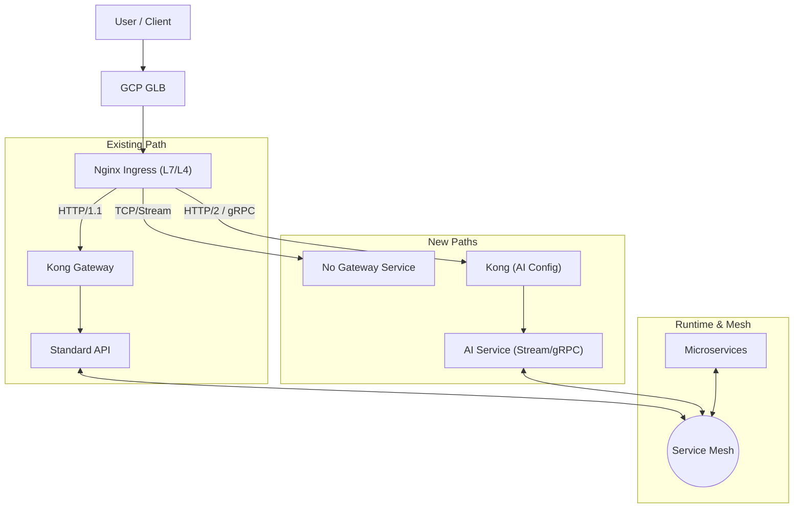

# API 平台演进：从标准 API 到多模式服务支持

## 1. 背景与现状

我们当前的 API 平台基于 **GCP (Google Cloud Platform)** 构建，核心流量链路为：
`GCP GLB (Global Load Balancer) -> Nginx (L7 Ingress) -> Kong Gateway (API Management) -> Runtime (GKE/Java/Python/Go/Node.js)`

这套架构目前完美支持了 **Standard API**（标准 RESTful API）的托管，提供了统一的认证、鉴权、限流和监控能力。然而，随着业务的扩展和 AI 技术的发展，我们需要支持更多样化的服务形态，包括 **Container**（通用容器服务）、**No Gateway**（直连/高性能服务）、**Microservices**（微服务架构）以及 **AI Services**（流式/事件驱动服务）。

本文档旨在深度解析这些服务形态的区别，并探讨我们的平台如何演进以支持这些新需求。

---

## 2. 服务模式深度解析

### 2.1. Standard API (标准 API)
*   **定义**: 传统的 Request-Response 模型，通常基于 HTTP/1.1 RESTful 规范。
*   **特点**:
    *   **强治理**: 必须经过 API 网关，接受严格的 AuthN/AuthZ、Rate Limiting、Logging 等策略管控。
    *   **无状态**: 适合水平扩展。
    *   **面向外部**: 主要作为对外暴露的业务能力接口。
*   **当前支持**: ✅ 完美支持。

### 2.2. Container (通用容器服务)
*   **定义**: 用户只需提供一个容器镜像，平台负责运行，不强制要求遵循 REST API 规范。可能是 Web App、后台 Worker、定时任务或非标准 HTTP 服务。
*   **特点**:
    *   **灵活性**: 关注点在于“运行代码”而非“暴露接口”。
    *   **弱治理**: 可能不需要复杂的 API 网关策略，或者只需要最基础的路由功能。
    *   **生命周期**: 可能包含非 HTTP 的生命周期（如批处理）。
*   **区别**: 与 Standard API 相比，它更像是一个 PaaS (Platform as a Service) 运行时，而非 SaaS 接口。

### 2.3. No Gateway (无网关/直连服务)
*   **定义**: 流量不经过 API 网关（Kong）的应用层处理，直接到达后端服务，或者仅经过 4 层（TCP/UDP）转发。
*   **特点**:
    *   **高性能**: 减少了网关层的 Hop，降低延迟（Latency）。
    *   **特殊协议**: 支持网关无法解析的私有协议或非 HTTP 协议（如纯 TCP、UDP、MQTT）。
    *   **内部使用**: 通常用于受信任的内部服务间调用，或对延迟极度敏感的场景。
*   **区别**: 牺牲了统一治理能力（鉴权、监控需自理），换取了极致的性能或协议灵活性。

### 2.4. Microservices (微服务架构)
*   **定义**: 一组小型、松耦合的服务协同工作。重点在于**服务间通信 (East-West Traffic)** 而非单纯的外部访问 (North-South Traffic)。
*   **特点**:
    *   **服务发现**: 服务之间需要动态发现彼此。
    *   **复杂的调用链**: 一个外部请求可能触发内部几十次服务调用。
    *   **治理下沉**: 熔断、重试、负载均衡等逻辑通常下沉到 Sidecar (Service Mesh) 而非集中式网关。
*   **区别**: Standard API 关注“大门”的守卫，Microservices 关注“房间”内部的协作。

### 2.5. AI Services (AI 流式/事件服务)
*   **定义**: 基于长连接和实时数据流的服务，如 LLM 的 Token 流式输出、语音识别流、实时推理等。
*   **特点**:
    *   **协议特殊**: 强依赖 **HTTP/2**, **gRPC**, **WebSocket**, **SSE (Server-Sent Events)**。
    *   **长连接**: 连接持续时间长，对超时（Timeout）配置敏感。
    *   **双向通信**: 客户端和服务端可能同时发送数据（如 gRPC Bi-directional streaming）。
*   **区别**: 打破了传统的“请求-立即响应-关闭”模型，要求全链路（GLB -> Nginx -> Kong -> App）都支持长连接和特定协议。

---

## 3. 平台支持策略与演进方案

为了在现有架构上支持上述服务，我们需要对各层级进行差异化配置或引入新组件。

### 3.1. 架构概览图

### 3.2. 详细支持方案

#### A. 支持 Container (通用容器)
*   **策略**: **Cloud Run 集成** 或 **GKE 简化部署**。
*   **实施**:
    *   利用 GCP 的 **Cloud Run** 作为无服务器容器运行时，适合无状态、HTTP 驱动的容器。
    *   在 GKE 中提供通用的 Helm Chart 模板，允许用户部署不通过 Kong 的服务（通过 Kubernetes Service 直接暴露或仅走 Nginx Ingress）。

#### B. 支持 No Gateway (无网关)
*   **策略**: **Nginx L4 透传** 或 **GKE L4 LoadBalancer**。
*   **实施**:
    *   **方案一 (推荐)**: 在 Nginx 层配置 `stream` 模块，进行 TCP/UDP 透传，直接指向后端 Service，完全绕过 Kong。
    *   **方案二**: 为特定服务创建类型为 `LoadBalancer` 的 Kubernetes Service，直接获取 GCP 的 L4 LB IP，绕过所有 Ingress 层（适合极高性能需求）。

#### C. 支持 Microservices (微服务)
*   **策略**: **引入 Service Mesh (如 Istio / Anthos Service Mesh)**。
*   **实施**:
    *   Kong 继续负责 **南北向 (North-South)** 流量（外部入口）。
    *   引入 **Istio/ASM** 接管 **东西向 (East-West)** 流量。
    *   Kong 可以作为 Mesh 的 Ingress Gateway，或者与 Mesh 的 Sidecar 协同工作。
    *   利用 Mesh 提供的 mTLS、细粒度流量控制和全链路追踪（Tracing）来管理微服务复杂性。

#### D. 支持 AI Services (Stream Events)
*   **策略**: **全链路协议升级与超时调优**。
*   **实施**:
    *   **GCP GLB**: 开启 HTTP/2 支持。
    *   **Nginx**:
        *   配置 `grpc_pass` 或 `proxy_pass` 并开启 HTTP/2。
        *   **关键**: 调大 `proxy_read_timeout` 和 `keepalive_timeout`，避免长连接被意外切断（例如设置为 3600s）。
        *   支持 WebSocket Upgrade 头。
    *   **Kong**:
        *   配置 Service 的 `protocol` 为 `grpc` 或 `http` (针对 SSE)。
        *   配置 Route 匹配 gRPC 方法或 WebSocket 路径。
        *   同样需要调整 Upstream 的超时设置。
    *   **Runtime (GKE)**:
        *   配置 `BackendConfig` (GCP CRD) 以调整 GKE Ingress Controller (如果使用) 的超时参数。
        *   应用本身需实现 Keepalive/Heartbeat 机制以保活。

### 3.3. 总结对照表

| 服务类型 | 关键需求 | 平台改造点 | 推荐路径 |
| :--- | :--- | :--- | :--- |
| **Standard API** | 统一治理, REST | 无 (维持现状) | GLB -> Nginx -> Kong -> App |
| **Container** | 灵活运行 | 提供通用部署模板 / Cloud Run | GLB -> Nginx -> App (可选 Kong) |
| **No Gateway** | 高性能, 私有协议 | Nginx L4 Stream 或 L4 LB | GLB (TCP) -> Nginx (TCP) -> App |
| **Microservices**| 服务间通信, 治理 | 引入 Service Mesh (ASM/Istio) | Kong (入口) + Mesh (内部) |
| **AI Services** | 长连接, HTTP/2, gRPC | 全链路超时调整, HTTP/2 开启 | GLB -> Nginx (H2) -> Kong (H2) -> App |

通过上述演进，我们的平台将从单一的 API 管理平台转变为一个支持多模态计算和服务的综合性云原生平台。
