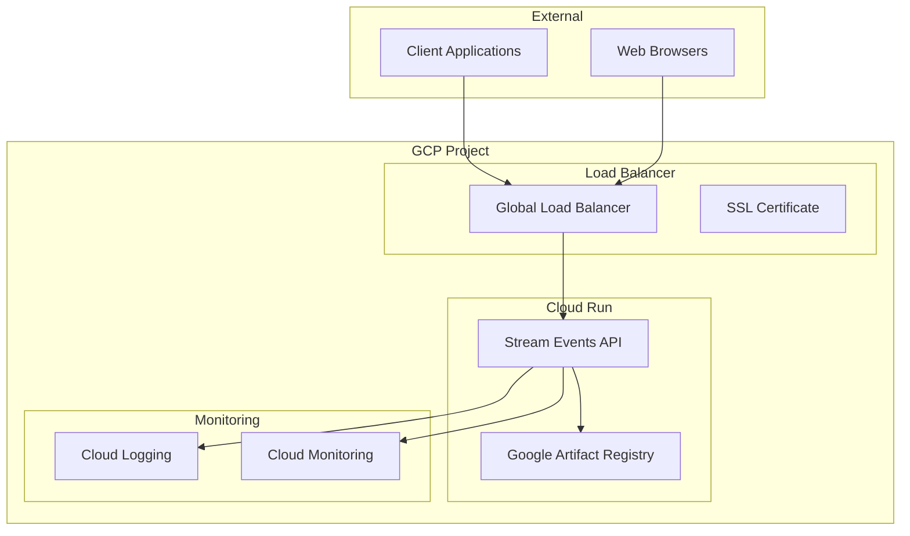
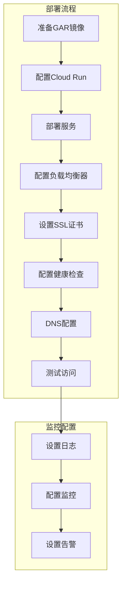
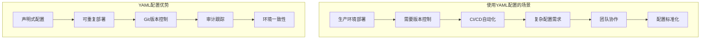
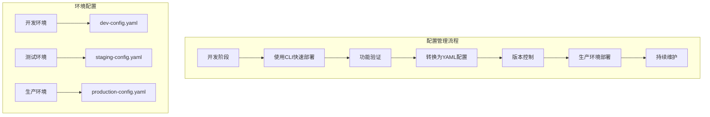
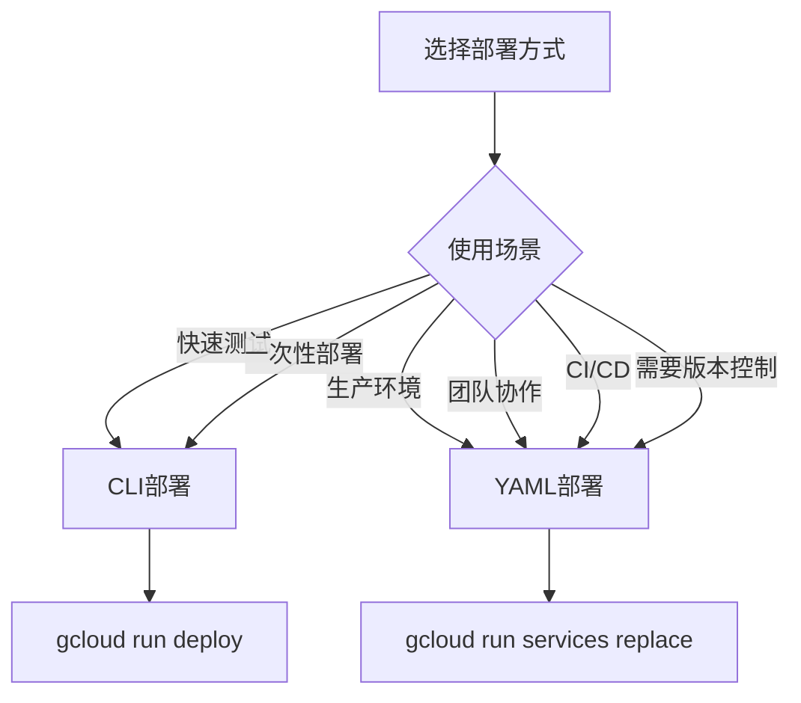
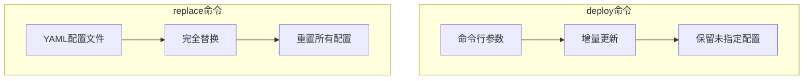
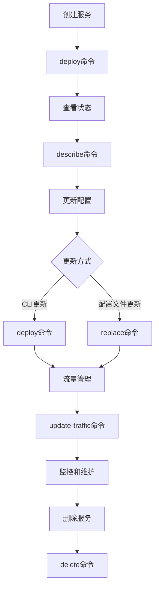

# Summary

我现在想在 GCP 工程里面部署一个 A stream events API 或者说我现在已经 Build 了一个这样的 Images 放在了 GAR 里面.那么我希望你给我一个架构方案,比如部署在哪里比较合适?比如 GKE ?比如 Cloud Run.以及部署之后如何暴露访问等等. 要一个快速简易的实现方案?要注意其协议

(1) 比较在谷歌云上使用 Cloud Run 和 GKE（Google Kubernetes Engine）部署流式事件 API 的优缺点，重点分析它们对长连接、HTTP/2 流、服务器发送事件（SSE）等流式协议的支持情况、部署速度和运维复杂度。

(2) 研究从 Google Artifact Registry (GAR) 拉取容器镜像并部署到 Cloud Run 的详细步骤，特别是针对流式应用场景，调查其并发、超时和 CPU 分配等关键配置的最佳实践。

(3) 分析在 Cloud Run 上暴露 API 以供外部访问的方法，包括使用其自动生成的 URL 以及通过设置全局外部 HTTPS 负载均衡器来绑定自定义域名和管理 SSL 证书。

(4) 深入调查为流式 API（如使用 WebSockets 或 SSE）配置谷歌云负载均衡器的具体要求，特别是后端服务的超时时间、会话亲和性（session affinity）和健康检查设置。

(5) 简要探索在 GKE 上实现相同部署的流程（例如，创建集群、编写 Deployment 和 Service 配置、设置 Ingress），以便与 Cloud Run 方案进行对比，从而论证何为“快速简易”的方案。

(6) 综合以上信息，构建一个以 Cloud Run 为核心的推荐架构方案，清晰地阐述从代码到可公开访问的 API 的完整路径，并解释该方案在简易性和快速实现方面的优势。

# AI Studio

好的，这是一个非常具体且有深度的技术问题。你已经有了容器镜像在 Google Artifact Registry (GAR)，现在需要一个快速、简便且适合流式 API 的部署方案。

下面我将根据你提出的六个要点，为你构建一个完整、清晰的架构方案，并最终论证为何 **Cloud Run 是你的首选**。

---

### 综合概览：推荐架构方案

在深入细节之前，先给出最终的推荐方案：

**使用 Cloud Run 作为核心计算服务，并通过全局外部 HTTPS 负载均衡器暴露服务，以支持自定义域名和高级流式配置。**

这个方案的路径如下：

1.  **代码/镜像**: 你的流式 API 应用容器镜像已存于 **Google Artifact Registry (GAR)**。
2.  **部署**: 使用一个 `gcloud` 命令将镜像部署到 **Cloud Run**，并配置好长超时、CPU 分配等参数。
3.  **暴露/访问**:
    - **快速测试**: 直接使用 Cloud Run 提供的 `*.run.app` URL。
    - **生产环境**: 配置一个 **全局外部 HTTPS 负载均衡器**，后端指向一个 **无服务器网络端点组 (Serverless NEG)**，该 NEG 连接到你的 Cloud Run 服务。负载均衡器负责处理自定义域名、Google 管理的 SSL 证书和流式协议所需的长超时。
4.  **(可选)安全**: 在负载均衡器前启用 **Cloud Armor** WAF 策略，保护 API。

现在，我们来逐一解答你的问题，以支撑这个架构选择。

---

### (1) Cloud Run vs. GKE 对比：流式 API 场景

| 特性           | Cloud Run                                                                                       | GKE (Google Kubernetes Engine)                                                                     | 优劣分析                                                                                                   |
| :------------- | :---------------------------------------------------------------------------------------------- | :------------------------------------------------------------------------------------------------- | :--------------------------------------------------------------------------------------------------------- |
| **协议支持**   | **原生支持 HTTP/2**，非常适合 gRPC 流和 SSE。**支持 WebSocket**。请求**超时最长可达 60 分钟**。 | **完全支持**所有 TCP/UDP 协议，包括 HTTP/2, SSE, WebSocket。超时可以配置为无限长。                 | **Cloud Run 的 60 分钟超时**对于绝大多数 SSE 和 Websocket 场景都已足够。GKE 提供无限灵活性，但配置更复杂。 |
| **部署速度**   | **极快**。从执行命令到服务可用通常在**1 分钟内**完成。                                          | **较慢**。首次创建集群需要**5-15 分钟**。后续部署应用（`kubectl apply`）很快，但基础设施准备耗时。 | **Cloud Run 在“快速简易”方面完胜**。                                                                       |
| **运维复杂度** | **极低 (Serverless)**。无需管理节点、集群、操作系统补丁、网络。只需关心你的应用代码。           | **高**。需要管理集群版本、节点池、自动扩缩容、监控、日志、安全策略等。需要 Kubernetes 专业知识。   | **Cloud Run 大幅降低了运维负担**，让你专注于业务逻辑。                                                     |
| **成本模型**   | **按需付费**。根据实际请求处理时间和资源消耗计费。可以**缩容到零**，无请求时不产生计算费用。    | **按资源预留付费**。即使没有流量，集群的节点（VM）也会持续产生费用。                               | 对于流量有波峰波谷或不确定的应用，**Cloud Run 的成本效益更高**。                                           |

**结论**: 对于追求“快速简易”的目标，**Cloud Run** 是毫无疑问的赢家。它对主流流式协议提供了足够的支持，同时免去了繁重的 Kubernetes 运维工作。

---

### (2) 从 GAR 部署到 Cloud Run：流式应用最佳实践

从 GAR 拉取镜像部署到 Cloud Run 非常直接。关键在于部署时为流式场景优化配置。

**详细步骤与命令:**

1.  **确保权限**: 确保 Cloud Run 的服务账号（默认为 `[PROJECT_NUMBER]-compute@developer.gserviceaccount.com`）拥有对 Artifact Registry 的读取权限 (`roles/artifactregistry.reader`)。这通常是默认配置，但最好检查一下。

2.  **部署命令**: 假设你的镜像位于 `asia-east1-docker.pkg.dev/your-project-id/your-repo/streaming-api:latest`。

    ```bash
    gcloud run deploy streaming-api-service \
      --image="asia-east1-docker.pkg.dev/your-project-id/your-repo/streaming-api:latest" \
      --platform="managed" \
      --region="your-region" \
      --allow-unauthenticated \
      # --- 以下是流式应用的关键配置 ---
      --timeout="3600" \
      --concurrency="10" \
      --cpu-always-allocated \
      --min-instances="1"
    ```

**关键配置最佳实践解读**:

- `--timeout="3600"`: **(核心)** 将请求超时设置为最大值 60 分钟（3600 秒）。流式连接是长连接，必须延长默认的 5 分钟超时，否则连接会被强制切断。
- `--concurrency="10"`: 每个 Cloud Run 实例能同时处理的请求数。对于流式 API，一个连接会长时间占用资源。**建议从一个较低的值开始（如 5-10）**。如果每个连接非常消耗 CPU/内存，甚至可以设置为`1`，确保每个实例只处理一个流，避免资源争抢。
- `--cpu-always-allocated`: **(推荐)** 默认情况下，CPU 仅在处理请求时分配。对于需要持续推送数据且对延迟敏感的流式 API，将 CPU 设置为**始终分配**可以消除 CPU 节流带来的延迟抖动，保证流的平稳。
- `--min-instances="1"`: **(可选，但推荐用于生产)** 设置最小实例数为 1，可以避免“冷启动”。对于需要立即响应的流式 API，这能保证始终有一个热实例在运行，代价是会产生持续的少量费用。如果不设置，服务可能会缩容到零，第一个请求会经历几秒的冷启动延迟。

---

### (33) 在 Cloud Run 上暴露 API 的访问方法

你有两种主要方式来暴露你的 Cloud Run 服务：

1.  **自动生成的 URL (最简单)**

    - 部署后，Cloud Run 会自动为你生成一个格式为 `https://[SERVICE_NAME]-[HASH]-[REGION_CODE].a.run.app` 的 URL。
    - **优点**: 零配置、自动启用 HTTPS、由 Google 管理证书。
    - **缺点**: URL 不友好，不适合作为生产环境的正式 API 端点。
    - **适用场景**: 内部测试、开发、CI/CD 验证。

2.  **绑定自定义域名 (通过负载均衡器)**
    - 这是生产环境的标准做法。你不能直接将域名 CNAME 到 `.run.app` 地址。
    - **实现路径**: 全局外部 HTTPS 负载均衡器 -> 无服务器 NEG -> Cloud Run 服务。
    - **优点**:
        - 使用你自己的域名（如 `api.yourcompany.com`）。
        - 由 Google 管理 SSL 证书，自动续期。
        - 可以集成 Cloud Armor WAF 防火墙。
        - 可以配置更长的后端服务超时（见下一点）。
        - 可以路由多个 Cloud Run 服务或 GKE 服务。
    - **缺点**: 配置步骤比直接用默认 URL 多一些。

---

### (4) 为流式 API 配置负载均衡器的要求

当你使用负载均衡器指向 Cloud Run 时，为了确保流式连接不中断，需要特别关注后端服务的配置。

- **后端服务超时 (Backend Service Timeout)**: **这是最重要的设置**。负载均衡器本身也有超时。这个超时必须**大于或等于**你的流式连接期望的持续时间。你可以将其设置为一个非常大的值，例如 **86,400 秒（24 小时）**。如果这个值小于你的 Cloud Run 超时或实际流时长，负载均衡器会主动切断连接，导致`502`错误。

- **会话亲和性 (Session Affinity)**: 对于**无状态的 SSE**（每次推送都是完整信息），通常**不需要**会话亲和性。但对于**有状态的 WebSocket**（服务器实例保存了特定连接的状态），则**必须启用**会话亲和性，以确保来自同一客户端的后续数据包始终被路由到同一个 Cloud Run 实例。常用的选项是“客户端 IP”或“生成的 Cookie”。

- **健康检查 (Health Checks)**: 为后端服务配置健康检查。你的 API 应用应该提供一个轻量级的健康检查端点（如 `/healthz`），它能快速返回 `HTTP 200`。**注意**：健康检查本身必须是短请求，而不是一个流式端点。负载均衡器会用它来判断哪些 Cloud Run 实例是健康的，并只将流量路由到这些实例。

---

### (5) GKE 部署流程简述 (用于对比)

为了论证 Cloud Run 的“快速简易”，我们简要看一下在 GKE 上实现相同部署需要做什么：

1.  **创建 GKE 集群**: `gcloud container clusterss create ...`。这需要几分钟，并需要你决定机器类型、节点数量、网络配置等。
2.  **编写 Kubernetes 配置文件 (YAML)**:
    - **`deployment.yaml`**: 定义如何运行你的容器，包括副本数、镜像地址、端口、资源请求（CPU/内存）等。
    - **`service.yaml`**: 在集群内部创建一个稳定的网络端点（Service），将流量导向你的 Deployment Pods。
    - **`ingress.yaml`**: 配置 GKE Ingress，将外部 HTTP(S)流量路由到你的 Service。你需要在这里配置域名、SSL 证书（可以通过 Google 管理的证书或 cert-manager）、路径等。
3.  **应用配置**: 使用 `kubectl apply -f [filename.yaml]` 命令将这些配置应用到集群中。
4.  **配置 Ingress 支持长连接**: 你可能需要在 Ingress 或后端配置（BackendConfig CRD）中添加注解来设置超时时间，例如：

    ```yaml
    # Ingress annotation for GKE Ingress
    kubernetes.io/ingress.class: "gce"

    # Using a BackendConfig to set timeout
    apiVersion: cloud.google.com/v1
    kind: BackendConfig
    metadata:
      name: my-backendconfig
    spec:
      timeoutSec: 3600
    ```

**对比结论**: GKE 流程涉及多个配置文件、对 Kubernetes 概念的深入理解（Deployment, Service, Ingress, BackendConfig）以及基础设施的手动决策。这与 Cloud Run 的**单命令部署**形成了鲜明对比，清晰地证明了**Cloud Run 在简易性和速度上具有压倒性优势**。

---

### (6) 最终推荐：以 Cloud Run 为核心的“快速简易”架构方案

综合以上所有分析，我们构建出这个最终的推荐方案。

**从代码到可公开访问 API 的完整路径:**

1.  **准备镜像**: 你已经完成。你的流式 API 应用镜像托管在 GAR。

2.  **一步部署至 Cloud Run**: 执行我们上面详细介绍的 `gcloud run deploy` 命令，并带上为流式优化的参数 (`--timeout`, `--concurrency`, `--cpu-always-allocated` 等)。

    - **成果**: 在一分钟内，你将获得一个可通过 `*.run.app` URL 访问、功能完备、支持 60 分钟流式连接的 API 端点。这足以用于所有内部和测试目的。

3.  **（生产化）配置负载均衡器**:
    - 在 GCP 控制台或通过 `gcloud` 创建一个**无服务器 NEG**，并将其关联到你刚刚部署的 Cloud Run 服务。
    - 创建一个**全局外部 HTTPS 负载均衡器**。
    - 在负载均衡器的**后端配置**中，添加这个 NEG 作为后端，并将**后端服务超时设置为一个大值（如 86400 秒）**。
    - 在负载均衡器的**前端配置**中，预留一个静态 IP 地址，并创建一个**Google 管理的 SSL 证书**（GCP 会自动为你验证域名所有权并签发、续期证书）。
    - 将你的自定义域名（`api.yourcompany.com`）的 DNS A 记录指向负载均衡器的静态 IP。

**为什么这个方案是“快速简易”的最佳选择？**

- **最快的价值实现路径**: 从镜像到可用 API 端点只需一个命令，几分钟时间。
- **抽象化基础设施**: 你完全不需要关心虚拟机、操作系统、网络路由、Kubernetes 集群等底层细节。
- **平滑的扩展路径**: 从一个简单的测试 URL 到功能齐全的、带自定义域名的生产级 API，路径清晰，无需重构部署方式。
- **运维成本最低**: Serverless 模型意味着 Google 负责所有的扩缩容、安全补丁和基础设施维护，你只需要关注你的代码。
- **成本效益高**: Pay-per-use 和 scale-to-zero 特性确保你不会为闲置资源付费，尤其适合新项目或流量不稳定的 API。

总之，对于你的需求，**从 GAR 部署到 Cloud Run 是实现流式事件 API 最直接、最高效、运维最轻松的现代云原生方法。**

# Gemini

# 在谷歌云上部署与扩展流式事件 API

## 引言

- **目标：** 本报告为在 Google Cloud Platform (GCP)上部署容器化的流式事件 API 提供了一份全面、专家级的架构蓝图。它旨在满足用户对于一个“快速简易”同时又具备健壮性和可扩展性的解决方案的需求。
- **核心挑战：** 流式 API（例如，使用 WebSockets、服务器发送事件 SSE 或 gRPC 流）的主要挑战在于维持长生命周期的持久连接，这与许多云原生服务的典型无状态、短暂性特征形成了鲜明对比。
- **两条路径：** 我们将探索两条主要的部署路径：**Cloud Run**的无服务器简易性，以及**Google Kubernetes Engine (GKE)**的容器编排能力。鉴于用户的容器镜像已经构建并推送至 Artifact Registry，这两个平台都是立即可行的选项.1
- **指导原则：** 我们的建议将遵循“从简开始，随复杂度扩展”的理念。我们将为初始部署提供明确的建议，并为未来需求演进提供清晰的迁移路径。

---

## 第一部分：基础决策：为流式负载选择您的 GCP 计算平台

本部分将解构在 Cloud Run 和 GKE 之间的选择，超越表层比较，专注于对流式工作负载的具体影响。

### 1.1 控制的光谱：Cloud Run 与 GKE 的对比

- **Cloud Run：完全托管的无服务器体验**
    - **运维模型：** Cloud Run 抽象了所有基础设施管理。您只需提供一个容器镜像，Google 便会处理资源的配置、扩展和服务器管理 1。这极大地降低了运维开销 3。
    - **开发者体验：** 具有极高的易用性。一个`gcloud run deploy`命令就能将您的容器镜像变为一个可通过公共网络访问、带有 TLS 加密的端点 5。这对于没有专属 DevOps 专业知识或优先考虑速度的团队来说是理想选择 2。
    - **成本与可扩展性：** 主要是一种按使用量付费的模型（CPU、内存、请求数），并且可以缩容至零，这使其对于流量波动大或不可预测的应用非常经济高效 1。这是无服务器模式的核心承诺。
- **GKE：容器编排的黄金标准**
    - **运维模型：** 一种托管的 Kubernetes 服务。Google 管理控制平面，但您需要负责节点配置、集群管理和网络（在 Standard 模式下）1。这提供了巨大的控制力和灵活性。
    - **GKE Autopilot：** 作为 GKE 的一种操作模式，Autopilot 自动化了集群和节点的管理，提供了更接近 Cloud Run 的“零干预”体验，同时保留了完整的 Kubernetes API 2。对于希望最小化运维负担的用户，这是推荐的 GKE 模式。
    - **成本与可扩展性：** 一种按节点付费（或在 Autopilot 模式下按 Pod 资源）的模型。您为预置的资源付费，这对于流量可预测的高负载应用可能更具成本效益，但对于空闲服务则不然 1。
- **可移植性：** 一个关键的战略优势是，标准的容器镜像无需修改即可在两个平台上运行。其声明式的 API 模型在概念上也很相似（Cloud Run 基于的 Knative 与 Kubernetes 兼容），这为未来在两者之间迁移提供了可能 1。

### 1.2 流式处理的关键能力：技术深度剖析

对于流式 API 而言，“简易性 vs. 控制力”的传统论点可能存在误导。无论是 Cloud Run 还是 GKE，要可靠地处理长连接，都需要进行特定的、非默认的配置。真正的选择在于实现同一目标的两种不同*运维范式*。

一个流式 API 要求连接长时间保持开放。Cloud Run 的默认成本优化模型是关闭空闲实例 8，这会切断活跃的流式连接。为了防止这种情况，必须配置 CPU 始终分配，这从根本上改变了其成本模型，使其更像一个预置型服务。另一方面，GKE 的默认 Ingress 控制器所创建的负载均衡器有 30 秒的超时限制 9，这对于流式传输是完全不够的，同样会导致连接中断。为了解决这个问题，必须创建一个

`BackendConfig`资源来延长此超时时间。

因此，两个平台都无法在默认设置下“开箱即用”地支持流式应用。开发者都需要理解并应用特定配置来覆盖默认行为。Cloud Run 的“简易性”在于它抽象了集群管理，而不是提供了一种“零配置”的流式体验。因此，决策更多地取决于开发者偏好管理服务标志（`gcloud run deploy`）还是 Kubernetes 清单文件（`kubectl apply`）。

**表 1：流式工作负载平台比较（Cloud Run vs. GKE Autopilot）**

| 特性             | Cloud Run                              | GKE Autopilot                  | 架构师笔记（针对流式应用）                                    |
| ---------------- | -------------------------------------- | ------------------------------ | ------------------------------------------------------------- |
| **管理模型**     | 完全无服务器                           | 托管的 Kubernetes              | Cloud Run 抽象度最高，运维负担最小。                          |
| **主要成本驱动** | 按请求/活跃实例计费                    | 按 Pod 资源预留计费            | 对于流式应用，Cloud Run 需配置 CPU 常开，成本模型趋近于 GKE。 |
| **伸缩范式**     | 基于请求（可缩容至零）                 | 基于 Pod（可缩容至零 Pod）     | 两者都能有效处理负载，但成本模型不同。                        |
| **超时配置**     | `gcloud run deploy --timeout`          | `BackendConfig` YAML 清单      | Cloud Run 通过命令行标志配置，GKE 通过声明式 YAML 文件。      |
| **会话亲和性**   | `gcloud run deploy --session-affinity` | `BackendConfig`或 Ingress 注解 | Cloud Run 的配置更直接；GKE 的配置更灵活但略显复杂。          |
| **运维开销**     | 接近于零                               | 低（需要 Kubernetes 知识）     | 对于追求“快速简易”的用户，Cloud Run 的运维优势显著。          |

### 1.3 架构师建议：一条务实的前进道路

- **建议：** 对于“快速简易”的实现，**从 Cloud Run 开始**。其简化的开发者体验和快速的部署周期使其成为初始部署和验证的理想选择 6。
- **理由：** 核心的流式特性（WebSockets、SSE、gRPC 流）现在已在 Cloud Run 上得到全面支持 11。必要的配置虽然不是默认的，但通过单个命令中的标志即可直接设置，这比管理多个 Kubernetes YAML 清单文件要简单得多。
- **迁移至 GKE 的触发条件：** 只有当出现 Cloud Run 无法满足的特定需求时，才应考虑迁移到 GKE。这些触发条件包括：
    - 需要有状态工作负载（例如，使用 StatefulSet 部署数据库）2。
    - 需要自定义操作系统级别的配置、Cloud Run 未提供的特定 GPU 型号，或直接访问节点/内核 4。
    - 复杂的网络需求，例如自定义 VPC 路由策略，或与 Cloud Run 的无服务器 VPC 访问连接器无法支持的遗留系统集成 1。
    - 组织层面要求所有工作负载都标准化在 Kubernetes 上 6。

---

## 第二部分：实施路径 1：使用 Cloud Run 进行快速部署

本部分为在我们推荐的起点——Cloud Run 上部署流式 API 提供了详细的、规范性的指南。

### 2.1 容器契约：确保您的镜像适配 Cloud Run

在部署之前，请确保容器镜像遵循 Cloud Run 容器运行时契约 14。

- **监听正确端口：** 容器内的应用程序必须在由`PORT`环境变量指定的端口上监听请求，该变量默认为`8080` 14。
- **监听`0.0.0.0`：** 服务器必须绑定到`0.0.0.0`，而不是`127.0.0.1`或`localhost`，以便接受来自容器沙箱外部的请求 15。
- **64 位 Linux 可执行文件：** 容器镜像必须为`linux/amd64`架构编译 14。
- **无状态设计：** 尽管我们将维持连接，但应用程序本身应力求无状态。任何所需的状态都应外部化（例如，存储到 Memorystore for Redis 或 Cloud SQL），因为即使启用了会话亲和性，实例也可能被终止，从而破坏亲和性 2。

### 2.2 部署命令：流式处理的基本配置

Cloud Run 部署的核心是`gcloud run deploy`命令。对于流式 API，有几个标志不仅是可选的，而且是可靠运行所**必需**的。

**表 2：流式 API 的关键`gcloud run deploy`标志**

| 标志                     | 功能                                        | 推荐设置（流式）        | 关键说明                                                                                |
| ------------------------ | ------------------------------------------- | ----------------------- | --------------------------------------------------------------------------------------- |
| `--timeout`              | 设置最大请求持续时间。                      | `3600` (或最大预期时长) | 防止连接被过早终止。默认 5 分钟对于长连接是不够的 12。                                  |
| `--cpu-always-allocated` | 保持实例存活且 CPU 在空闲时也处于活动状态。 | **必需**                | 这是最关键的设置。它能防止因实例缩容而切断空闲的流式连接 8。                            |
| `--session-affinity`     | 将来自同一客户端的请求路由到同一实例。      | **必需**                | 确保连接上下文得以维持，并能有效利用实例内存缓存 17。                                   |
| `--use-http2`            | 启用端到端 HTTP/2。                         | **gRPC 必需，SSE 推荐** | 对于 gRPC 流是强制性的。对于 SSE，它能防止中间代理缓冲响应，解决流式传输失败的问题 12。 |

- **示例命令：**
    Bash
    ```
    gcloud run deploy my-streaming-api \
      --image gcr.io/your-project/my-streaming-api:latest \
      --platform managed \
      --region us-central1 \
      --allow-unauthenticated \
      --cpu-always-allocated \
      --timeout 3600 \
      --session-affinity \
      --use-http2 # 推荐用于SSE/gRPC
    ```

### 2.3 暴露您的 API：从默认 URL 到全局负载均衡器

- **阶段 1：使用默认 URL 进行初始测试：** 部署后，Cloud Run 会提供一个稳定的`https://...run.app` URL。这对于初始功能测试、内部服务或与其他 GCP 服务集成非常完美 5。
- **阶段 2：使用外部应用负载均衡器进行生产设置：** 对于自定义域名、SSL 证书管理以及与 Cloud Armor (WAF)或 Cloud CDN 等服务的集成，外部应用负载均衡器是标准的生产模式 19。
    此步骤中存在一个常见的配置陷阱。开发者在 Cloud Run 服务上正确设置了`--timeout=3600`，并通过`.run.app` URL 测试成功。然后，他们将服务置于外部负载均衡器之后，却发现所有连接在 30 秒后神秘地断开。这是因为他们忽略了负载均衡器后端服务自身的超时配置，该配置默认为 30 秒 21。
    最终生效的超时时间是负载均衡器后端服务超时和 Cloud Run 服务超时的**最小值**。因此，必须将负载均衡器后端服务的超时设置得比 Cloud Run 服务的超时略高（例如，3610 秒），以确保负载均衡器不会过早关闭连接。
    - **创建无服务器 NEG：** 无服务器网络端点组（Serverless NEG）充当指向 Cloud Run 服务的指针，使负载均衡器能将其用作后端 19。
    - **配置负载均衡器后端服务：** 创建使用无服务器 NEG 的后端服务时，必须配置其**超时**。
    - **`gcloud`示例（更新后端服务超时）：**
        Bash
        ```
        gcloud compute backend-services update my-backend-service --global --timeout=3610s
        ```
        23
    - **重要警告：** 根据官方文档，当后端是 Cloud Run 服务时，**不应该**在负载均衡器的后端服务上启用会话亲和性。应仅使用 Cloud Run 服务自身的`--session-affinity`标志。启用两者会导致冲突的 cookie 设置行为，破坏会话的稳定性 17。

---

## 第三部分：实施路径 2：使用 GKE Autopilot 进行高级控制

本部分详细介绍了需要 Kubernetes 能力用户的替代路径，重点是 GKE Autopilot，以符合“快速简易”的要求。

### 3.1 GKE Autopilot：托管的 Kubernetes 体验

Autopilot 模式管理集群的节点和控制平面，让您只需专注于应用程序的工作负载 2。您提交 YAML 清单文件，GKE 会自动预置必要的资源，将 Kubernetes API 的强大功能与类似无服务器的运维模型相结合。

### 3.2 制作 Kubernetes 清单：一种声明式方法

与 Cloud Run 的单个命令不同，GKE 需要一组声明式的 YAML 文件。对于流式服务，有四个文件至关重要。许多在 GKE 上部署流式应用的失败尝试，其根源往往是未意识到默认的 30 秒负载均衡器超时问题，从而导致开发者陷入安装替代 Ingress 控制器（如 Nginx）等复杂的歧途 25。实际上，一个简单的

`BackendConfig`资源即可解决此问题。因此，`BackendConfig`不应被视为“高级功能”，而是 GKE 流式架构的**基础组件**。

**表 3：流式服务的 GKE 清单文件**

| 清单文件             | 目的                 | 关键配置                                               |
| -------------------- | -------------------- | ------------------------------------------------------ |
| `Deployment.yaml`    | 运行容器镜像。       | `spec.template.spec.containers.image`                  |
| `Service.yaml`       | 在集群内部暴露 Pod。 | `metadata.annotations.cloud.google.com/backend-config` |
| `BackendConfig.yaml` | 配置负载均衡器行为。 | `spec.timeoutSec`                                      |
| `Ingress.yaml`       | 从外部暴露服务。     | `spec.rules.http.paths.backend`                        |

- **1. `Deployment.yaml`：** 定义应用 Pod 的期望状态，指定来自 Artifact Registry 的容器镜像、资源请求和副本数。
- **2. `Service.yaml`：** 为您的 Deployment 创建一个稳定的内部网络端点。应使用`type: NodePort`或`type: ClusterIP`。最关键的是，必须通过注解将其与`BackendConfig`关联起来，以便 Ingress 能够应用正确的负载均衡器设置 10。
    YAML
    ```
    apiVersion: v1
    kind: Service
    metadata:
      name: my-streaming-service
      annotations:
        cloud.google.com/backend-config: '{"default": "my-streaming-backend-config"}'
    #...
    ```
- **3. `BackendConfig.yaml`：** 这是 GKE 上流式应用最关键的清单。它是一个自定义资源定义（CRD），用于配置由 Ingress 创建的 Google Cloud 负载均衡器的特定功能。
    - **关键字段：** `spec.timeoutSec`必须设置为您期望的连接生命周期（例如，3600 秒）9。
    - **示例清单：**
        YAML
        ```
        apiVersion: cloud.google.com/v1
        kind: BackendConfig
        metadata:
          name: my-streaming-backend-config
        spec:
          timeoutSec: 3600
        ```
- **4. `Ingress.yaml`：** 将`Service`暴露给互联网。GKE Ingress 控制器会自动配置一个外部应用负载均衡器。
    - **WebSocket 支持：** GKE Ingress 原生支持 WebSocket，无需特殊注解，_前提是通过`BackendConfig`正确配置了超时_ 9。

### 3.3 部署与验证 GKE 栈

使用一系列`kubectl apply -f [filename]`命令按顺序部署资源：`BackendConfig`、`Deployment`、`Service`、`Ingress`。验证过程包括检查 Ingress 的状态以获取外部 IP，并测试该端点。

---

## 第四部分：架构总结与战略考量

本最后部分综合了建议，并为后续步骤和相关的架构问题提供指导。

### 4.1 决策矩阵与迁移路径

虽然容器镜像本身是可移植的，但其运行时的配置需要进行有意识的转换。以下是从 Cloud Run 迁移到 GKE 时的关键配置映射，这有助于避免“可移植性陷阱” 7。

- **迁移地图：**
    - Cloud Run 的`--timeout 3600` 对应 GKE 的`BackendConfig`中的`spec: { timeoutSec: 3600 }`。
    - Cloud Run 的`--cpu-always-allocated` 在 GKE 中是默认行为，其概念转化为配置`Deployment`的副本数和水平 Pod 自动伸缩器（HPA）的设置。
    - Cloud Run 的`--session-affinity` 对应 GKE 的`BackendConfig`中的`spec: { sessionAffinity: { affinityType: "GENERATED_COOKIE" } }`，尽管 GKE 的配置选项更丰富。

### 4.2 高级主题：安全、可观测性与 CI/CD

- **安全：**
    - **Cloud Run：** 使用 IAM 的`roles/run.invoker`角色来控制访问。对于公共服务，将其置于负载均衡器之后，以利用**Google Cloud Armor**提供 WAF 和 DDoS 防护 19。
    - **GKE：** 使用 Kubernetes RBAC 和 IAM for GKE 进行精细的集群权限管理。由 Ingress 预配的负载均衡器同样可以受到 Cloud Armor 的保护 9。
- **可观测性：** 两个平台都与 Google Cloud 的运维套件（原 Stackdriver）无缝集成。
    - **Cloud Logging**和**Cloud Monitoring**在 Cloud Run 和 GKE 上默认启用，无需额外设置即可提供集中的日志和指标 5。
- **CI/CD 自动化：**
    - **Cloud Build**是 GCP 原生的解决方案，用于构建容器镜像和自动化部署。它与 Artifact Registry 完美集成，并能触发到 Cloud Run 和 GKE 的部署 5。一个简单的
        `cloudbuild.yaml`文件就可以定义一个构建镜像、推送到 GAR，然后运行`gcloud run deploy`或`kubectl apply`命令的流水线。

# Grok

### 部署流式事件 API 的推荐方案

以下是基于您在 GCP 项目中部署流式事件 API 的快速简易方案，假设您已将容器镜像存储在 Google Artifact Registry (GAR) 中，并希望支持 WebSockets 或 Server-Sent Events (SSE) 等流式协议。推荐使用 **Cloud Run** 作为部署平台，因为它简单、快速且支持流式协议。以下是关键点和步骤：

- **关键点**：
    - **Cloud Run 是首选**：它无需管理基础设施，支持 WebSockets 和 SSE，适合快速部署。
    - **GKE 更复杂**：虽然 GKE 提供更大灵活性，但运维复杂，适合需要高度自定义的场景。
    - **协议支持**：Cloud Run 支持长连接，但需配置超时时间和客户端重连机制。
    - **暴露访问**：可使用 Cloud Run 自动生成的 URL 或绑定自定义域名。

#### 为什么选择 Cloud Run？

Cloud Run 是一个完全托管的服务器 less 平台，部署简单，自动缩放，且与 GAR 无缝集成。研究表明，Cloud Run 能有效支持 WebSockets 和 SSE，只需适当配置超时和并发设置即可满足流式 API 的需求。相比之下，GKE 需要管理 Kubernetes 集群，部署和运维成本较高。

#### 部署步骤

1. **从 GAR 部署到 Cloud Run**：
    - 使用 `gcloud` 命令部署镜像：
        ```bash
        gcloud run deploy my-stream-api \
            --image us-central1-docker.pkg.dev/my-project/my-repo/my-image:v1 \
            --region us-central1 \
            --platform managed \
            --allow-unauthenticated
        ```
    - 确保替换 `my-project`、`my-repo`、`my-image:v1` 和 `us-central1` 为您的实际值。
2. **配置流式协议**：
    - 设置超时时间（例如 30 分钟）以支持长连接：
        ```bash
        gcloud run services update my-stream-api --region us-central1 --timeout 1800s
        ```
    - 确保客户端支持重连，SSE 响应状态码需为 200。
3. **暴露 API**：
    - 默认使用 Cloud Run 提供的 URL（如 `https://my-stream-api-abc123-uc.a.run.app`）。
    - 若需自定义域名（如 `api.example.com`），在 Google Search Console 验证域名后运行：
        ```bash
        gcloud run services add-domain-mapping my-stream-api --domain api.example.com --region us-central1
        ```

#### 后续步骤

- 测试 API：使用 `curl` 或 WebSocket 客户端验证连接。
- 监控和优化：通过 Cloud Run 的日志和指标监控性能，调整并发设置（如 `--concurrency 1000`）以支持更多连接。

---

# 在 GCP 上部署流式事件 API 的完整方案

本文档提供了一个在 Google Cloud Platform (GCP) 上部署流式事件 API 的快速简易方案，重点针对已存储在 Google Artifact Registry (GAR) 的容器镜像，推荐使用 Cloud Run 作为部署平台，并涵盖如何暴露 API 以供外部访问。以下内容详细分析了 Cloud Run 和 GKE 的优缺点、部署步骤、流式协议配置、以及访问设置。

## 1. Cloud Run 与 GKE 的优缺点比较

在选择部署平台时，Cloud Run 和 Google Kubernetes Engine (GKE) 是两个主要选项。以下是对它们的详细对比，特别关注流式协议（如 WebSockets、SSE、HTTP/2 流）的支持、部署速度和运维复杂度：

| **特性**         | **Cloud Run**                                                                              | **GKE**                                                |
| ---------------- | ------------------------------------------------------------------------------------------ | ------------------------------------------------------ |
| **流式协议支持** | 支持 WebSockets 和 SSE，无需额外配置，但需设置超时时间（最大 60 分钟）。客户端需支持重连。 | 支持所有流式协议，无特定限制，依赖于应用和集群配置。   |
| **部署速度**     | 快速，几分钟内完成部署，仅需 `gcloud` 命令。                                               | 较慢，需创建集群、编写 Kubernetes 配置文件，耗时较长。 |
| **运维复杂度**   | 无需管理基础设施，自动缩放，运维简单。                                                     | 需要管理 Kubernetes 集群，配置复杂，运维成本高。       |
| **并发支持**     | 每个容器最多 250 个并发请求，可通过增加实例数（最大 1000）扩展。                           | 无特定并发限制，取决于集群资源配置。                   |
| **成本**         | 按使用付费，适合流量波动场景，但长连接可能导致持续计费。                                   | 需支付集群节点费用，即使低负载也可能产生固定成本。     |
| **适用场景**     | 快速部署、无状态应用、流式 API（如 WebSockets、SSE）。                                     | 复杂工作负载、有状态应用、高度自定义需求。             |

**结论**：Cloud Run 因其简单性和快速部署特性更适合您的需求。GKE 虽然灵活，但运维复杂，不符合“快速简易”的目标。

## 2. 从 Google Artifact Registry (GAR) 部署到 Cloud Run

以下是将容器镜像从 GAR 部署到 Cloud Run 的详细步骤，特别针对流式应用场景：

### 2.1 确保镜像已推送到 GAR

- 假设您的镜像已存储在 GAR，URL 格式为：
    ```
    LOCATION-docker.pkg.dev/PROJECT_ID/REPOSITORY_ID/IMAGE_NAME:TAG
    ```
    例如：`us-central1-docker.pkg.dev/my-project/my-repo/my-image:v1`。
- 如果尚未推送镜像，可使用以下命令构建并推送：
    ```bash
    docker build -t us-central1-docker.pkg.dev/my-project/my-repo/my-image:v1 .
    docker push us-central1-docker.pkg.dev/my-project/my-repo/my-image:v1
    ```

### 2.2 部署到 Cloud Run

- 使用 `gcloud` CLI 部署服务：
    ```bash
    gcloud run deploy my-stream-api \
        --image us-central1-docker.pkg.dev/my-project/my-repo/my-image:v1 \
        --region us-central1 \
        --platform managed \
        --allow-unauthenticated \
        --timeout 1800s
    ```
    - **参数说明**：
        - `my-stream-api`：服务名称。
        - `--image`：GAR 中的镜像 URL。
        - `--region`：选择靠近用户的区域（如 `us-central1`）。
        - `--platform managed`：使用托管的 Cloud Run。
        - `--allow-unauthenticated`：允许公开访问（生产环境中可添加认证）。
        - `--timeout 1800s`：设置 30 分钟超时，支持长连接。

### 2.3 配置流式协议

- **WebSockets**：
    - Cloud Run 支持 WebSockets，无需额外配置。
    - 确保客户端支持重连，因为连接可能因超时或负载均衡而断开。
    - 设置最大超时时间（最大 60 分钟）：
        ```bash
        gcloud run services update my-stream-api --region us-central1 --timeout 3600s
        ```
- **SSE**：
    - 确保响应状态码为 200，否则 Cloud Run 可能缓冲响应。
    - 同 WebSockets，设置适当超时时间。
- **HTTP/2 流**：
    - Cloud Run 支持 HTTP/2，但不建议启用端到端 HTTP/2，因为它可能干扰 WebSocket 连接。

### 2.4 并发和资源配置

- **并发设置**：默认每个容器支持 80 个并发请求，可调整至 1000：
    ```bash
    gcloud run services update my-stream-api --region us-central1 --concurrency 1000
    ```
- **最大实例数**：默认最大 100 个实例，可根据需求调整：
    ```bash
    gcloud run services update my-stream-api --region us-central1 --max-instances 100
    ```
- **CPU 和内存**：根据负载调整资源，最大支持 8 vCPU 和 32 GB 内存：
    ```bash
    gcloud run services update my-stream-api --region us-central1 --cpu 2 --memory 4Gi
    ```

**最佳实践**：

- 确保镜像符合 Cloud Run 的容器运行时合约（[参考文档](https://cloud.google.com/run/docs/container-contract)）。
- 如果需要跨实例同步数据（如 WebSocket 聊天室），使用 Memorystore for Redis。

## 3. 暴露 API 以供外部访问

Cloud Run 部署后，自动生成一个服务 URL（如 `https://my-stream-api-abc123-uc.a.run.app`）。以下是暴露 API 的两种方法：

### 3.1 使用自动生成的 URL

- 部署完成后，Cloud Run 提供一个 HTTPS URL，可直接用于访问。
- 测试示例：
    - 对于 SSE：
        ```bash
        curl -i https://my-stream-api-abc123-uc.a.run.app --header "Accept: text/event-stream"
        ```
    - 对于 WebSockets，使用 WebSocket 客户端连接。

### 3.2 使用自定义域名

- 如果需要自定义域名（如 `api.example.com`），使用 Cloud Run 域名映射：
    1. 在 Google Search Console 验证您的域名。
    2. 映射域名：
        ```bash
        gcloud run services add-domain-mapping my-stream-api --domain api.example.com --region us-central1
        ```
    3. 更新 DNS 设置：
        - Cloud Run 提供 CNAME 记录（如 `ghs.googlehosted.com`）。
        - 在域名注册商处添加 CNAME 记录。
- **注意**：不支持路径路由（如 `/users`），仅支持根路径（`/`）。

## 4. 为流式 API 配置负载均衡器（可选）

如果需要高级功能（如路径路由、Cloud CDN、Cloud Armor），可使用全局外部 HTTPS 负载均衡器：

- **超时时间**：
    ```bash
    gcloud compute backend-services update my-backend-service --timeout 3600s
    ```
- **会话亲和性**：
    - 启用客户端 IP 亲和性，确保 WebSocket 连接稳定：
        ```bash
        gcloud compute backend-services update my-backend-service --session-affinity CLIENT_IP
        ```
- **健康检查**：
    ```bash
    gcloud compute health-checks create http my-health-check \
        --request-path /healthz \
        --port 8080
    ```
- **负载均衡器设置**：
    - 创建 URL 映射：
        ```bash
        gcloud compute url-maps create my-url-map --default-service my-backend-service
        ```
    - 绑定 SSL 证书：
        ```bash
        gcloud compute target-https-proxies create my-target-proxy \
            --url-map my-url-map \
            --ssl-certificates my-ssl-certificate
        ```

**注意**：负载均衡器增加复杂度和成本，建议仅在必要时使用。

## 5. 在 GKE 上部署的流程（对比）

虽然 Cloud Run 是推荐方案，以下是 GKE 部署的简要流程：

- **创建集群**：
    ```bash
    gcloud container clusterss create my-clusters --region us-central1 --num-nodes 3
    ```
- **部署应用**：
    - 创建 Deployment：
        ```yaml
        apiVersion: apps/v1
        kind: Deployment
        metadata:
          name: my-stream-api
        spec:
          replicas: 3
          selector:
            matchLabels:
              app: my-stream-api
          template:
            metadata:
              labels:
                app: my-stream-api
            spec:
              containers:
              - name: my-stream-api
                image: us-central1-docker.pkg.dev/my-project/my-repo/my-image:v1
                ports:
                - containerPort: 8080
        ```
    - 创建 Service：
        ```yaml
        apiVersion: v1
        kind: Service
        metadata:
          name: my-stream-api-service
        spec:
          selector:
            app: my-stream-api
          ports:
          - protocol: TCP
            port: 80
            targetPort: 8080
          type: LoadBalancer
        ```
    - 应用配置：
        ```bash
        kubectl apply -f deployment.yaml
        kubectl apply -f service.yaml
        ```
- **设置 Ingress（可选）**：
    ```yaml
    apiVersion: networking.k8s.io/v1
    kind: Ingress
    metadata:
      name: my-ingress
    spec:
      rules:
      - host: api.example.com
        http:
          paths:
          - path: /
            pathType: Prefix
            backend:
              service:
                name: my-stream-api-service
                port:
                  number: 80
    ```

**对比**：GKE 部署需要更多步骤和运维工作，不适合快速简易目标。

## 6. 推荐架构方案

**架构概述**：

- **镜像存储**：Google Artifact Registry (GAR)。
- **部署平台**：Cloud Run，托管在 `us-central1`（或其他低延迟区域）。
- **流式协议**：支持 WebSockets 和 SSE，超时设置为 30-60 分钟。
- **访问方式**：Cloud Run 自动生成 URL 或自定义域名。

**部署流程**：

1. 部署服务：
    ```bash
    gcloud run deploy my-stream-api \
        --image us-central1-docker.pkg.dev/my-project/my-repo/my-image:v1 \
        --region us-central1 \
        --platform managed \
        --allow-unauthenticated \
        --timeout 1800s \
        --concurrency 1000 \
        --max-instances 100
    ```
2. （可选）绑定自定义域名：
    ```bash
    gcloud run services add-domain-mapping my-stream-api --domain api.example.com --region us-central1
    ```

**优势**：

- **快速部署**：几分钟内完成部署。
- **简单运维**：无需管理服务器，自动缩放。
- **成本效益**：按使用付费，适合流量波动。
- **协议支持**：WebSockets 和 SSE 经过验证，满足流式需求。

**参考资料**：

- [Cloud Run 官方文档](https://cloud.google.com/run/docs)
- [WebSockets 支持](https://cloud.google.com/run/docs/triggering/websockets)
- [GAR 部署](https://cloud.google.com/artifact-registry/docs/integrate-cloud-run)
- [自定义域名](https://cloud.google.com/run/docs/mapping-custom-domains)

# Claude

我来为你设计一个适合 Stream Events API 的 GCP 部署架构方案。

## 架构方案对比分析

### Cloud Run vs GKE 对比

| 特性           | Cloud Run           | GKE              |
| -------------- | ------------------- | ---------------- |
| **部署速度**   | 秒级部署            | 分钟级部署       |
| **运维复杂度** | 极低，serverless    | 高，需要集群管理 |
| **长连接支持** | 支持，但有限制      | 完全支持         |
| **HTTP/2 流**  | 完全支持            | 完全支持         |
| **SSE 支持**   | 支持，60min 超时    | 无限制           |
| **WebSocket**  | 支持，60min 超时    | 无限制           |
| **并发处理**   | 最大 1000 并发/实例 | 无限制           |
| **成本**       | 按请求计费          | 按资源计费       |

### 推荐架构：Cloud Run 方案



## 实施步骤

### 1. 准备工作

```bash
# 设置项目环境变量
export PROJECT_ID="your-project-id"
export REGION="asia-northeast1"
export SERVICE_NAME="stream-events-api"
export IMAGE_URL="asia-northeast1-docker.pkg.dev/${PROJECT_ID}/your-repo/stream-api:latest"

# 启用必要的API
gcloud services enable run.googleapis.com
gcloud services enable artifactregistry.googleapis.com
gcloud services enable compute.googleapis.com
```

### 2. 部署到 Cloud Run

```bash
# 部署服务
gcloud run deploy $SERVICE_NAME \
    --image=$IMAGE_URL \
    --region=$REGION \
    --platform=managed \
    --allow-unauthenticated \
    --port=8080 \
    --memory=2Gi \
    --cpu=2 \
    --min-instances=1 \
    --max-instances=100 \
    --concurrency=80 \
    --timeout=3600 \
    --set-env-vars="ENV=production"
```

### 3. 流式 API 关键配置

```yaml
# cloud-run-config.yaml
apiVersion: serving.knative.dev/v1
kind: Service
metadata:
  name: stream-events-api
  annotations:
    run.googleapis.com/cpu-throttling: "false"
    run.googleapis.com/execution-environment: gen2
spec:
  template:
    metadata:
      annotations:
        # 关键：支持长连接
        run.googleapis.com/timeout: "3600s"
        # 优化并发处理
        autoscaling.knative.dev/maxScale: "100"
        autoscaling.knative.dev/minScale: "1"
    spec:
      containerConcurrency: 80
      containers:
      - image: asia-northeast1-docker.pkg.dev/PROJECT_ID/repo/stream-api:latest
        ports:
        - containerPort: 8080
        resources:
          limits:
            cpu: "2"
            memory: "2Gi"
        env:
        - name: PORT
          value: "8080"
```

### 4. 配置负载均衡器

```bash
# 创建后端服务
gcloud compute backend-services create stream-api-backend \
    --global \
    --protocol=HTTP \
    --timeout=3600 \
    --connection-draining-timeout=300

# 添加Cloud Run后端
gcloud compute backend-services add-backend stream-api-backend \
    --global \
    --network-endpoint-group=stream-api-neg \
    --network-endpoint-group-region=$REGION

# 创建URL映射
gcloud compute url-maps create stream-api-map \
    --default-service=stream-api-backend

# 创建SSL证书
gcloud compute ssl-certificates create stream-api-cert \
    --domains=api.yourdomain.com

# 创建HTTPS代理
gcloud compute target-https-proxies create stream-api-proxy \
    --url-map=stream-api-map \
    --ssl-certificates=stream-api-cert

# 创建全局转发规则
gcloud compute forwarding-rules create stream-api-rule \
    --global \
    --target-https-proxy=stream-api-proxy \
    --ports=443
```

### 5. 流式协议优化配置

```bash
# 为WebSocket/SSE优化后端服务
gcloud compute backend-services update stream-api-backend \
    --global \
    --timeout=3600 \
    --connection-draining-timeout=300 \
    --session-affinity=CLIENT_IP \
    --affinity-cookie-ttl=3600
```

### 6. 健康检查配置

```bash
# 创建健康检查
gcloud compute health-checks create http stream-api-health \
    --port=8080 \
    --request-path=/health \
    --check-interval=30s \
    --timeout=10s \
    --healthy-threshold=2 \
    --unhealthy-threshold=3

# 应用到后端服务
gcloud compute backend-services update stream-api-backend \
    --global \
    --health-checks=stream-api-health
```

## 完整部署流程



## 示例应用代码配置

```javascript
// server.js - 流式API示例
const express = require("express");
const app = express();
const port = process.env.PORT || 8080;

// 健康检查端点
app.get("/health", (req, res) => {
	res.status(200).json({ status: "healthy" });
});

// SSE端点
app.get("/events", (req, res) => {
	res.writeHead(200, {
		"Content-Type": "text/event-stream",
		"Cache-Control": "no-cache",
		Connection: "keep-alive",
		"Access-Control-Allow-Origin": "*",
	});

	// 发送初始事件
	res.write('data: {"message": "Connected"}\n\n');

	// 定期发送事件
	const interval = setInterval(() => {
		res.write(`data: {"timestamp": "${new Date().toISOString()}"}\n\n`);
	}, 5000);

	// 清理连接
	req.on("close", () => {
		clearInterval(interval);
	});
});

app.listen(port, () => {
	console.log(`Server running on port ${port}`);
});
```

## 监控和日志配置

```bash
# 设置日志路由
gcloud logging sinks create stream-api-sink \
    bigquery.googleapis.com/projects/$PROJECT_ID/datasets/stream_logs \
    --log-filter='resource.type="cloud_run_revision"'

# 创建监控告警
gcloud alpha monitoring policies create --policy-from-file=alert-policy.yaml
```

## 快速部署脚本

```bash
#!/bin/bash
# deploy-stream-api.sh

set -e

PROJECT_ID="your-project-id"
REGION="asia-northeast1"
SERVICE_NAME="stream-events-api"
DOMAIN="api.yourdomain.com"

echo "开始部署Stream Events API..."

# 1. 部署Cloud Run服务
gcloud run deploy $SERVICE_NAME \
    --image=$IMAGE_URL \
    --region=$REGION \
    --platform=managed \
    --allow-unauthenticated \
    --port=8080 \
    --memory=2Gi \
    --cpu=2 \
    --min-instances=1 \
    --max-instances=100 \
    --concurrency=80 \
    --timeout=3600

# 2. 获取服务URL
SERVICE_URL=$(gcloud run services describe $SERVICE_NAME \
    --region=$REGION \
    --format='value(status.url)')

echo "Cloud Run服务已部署: $SERVICE_URL"

# 3. 配置负载均衡器（可选）
if [ "$DOMAIN" != "api.yourdomain.com" ]; then
    echo "配置自定义域名负载均衡器..."
    # 执行负载均衡器配置命令
fi

echo "部署完成！"
```

## 总结

**推荐方案：Cloud Run**

### 优势：

- **快速部署**：几分钟内完成部署
- **低运维成本**：无需管理基础设施
- **自动扩缩容**：根据请求量自动调整
- **成本效益**：按请求计费，空闲时无费用

### 适用场景：

- 流式 API 连接时间 < 60 分钟
- 并发连接数 < 80,000
- 需要快速迭代和部署

### 访问方式：

1. **直接访问**：使用 Cloud Run 自动生成的 URL
2. **自定义域名**：通过 Global Load Balancer 配置 HTTPS

这个方案能够在最短时间内实现从容器镜像到可公开访问的流式 API，是"快速简易"的最佳选择。

# About cloud-run-config.yaml

让我详细解释这两种部署方式的区别和使用场景。

## Cloud Run 部署方式对比

### 1. gcloud CLI 部署 vs YAML 配置部署

| 方式           | 优点                     | 缺点                       | 适用场景           |
| -------------- | ------------------------ | -------------------------- | ------------------ |
| **gcloud CLI** | 简单直接，参数明确       | 难以版本控制，复杂配置繁琐 | 快速部署，开发测试 |
| **YAML 配置**  | 版本控制，声明式，可重复 | 学习成本高，配置复杂       | 生产环境，CI/CD    |

### 2. cloud-run-config.yaml 详解

这个 YAML 文件是**Knative Serving**的配置格式，Cloud Run 基于 Knative 构建。

```yaml
# cloud-run-config.yaml
apiVersion: serving.knative.dev/v1  # Knative API版本
kind: Service                        # 资源类型：Service
metadata:
  name: stream-events-api           # 服务名称
  annotations:                      # Cloud Run特定注解
    run.googleapis.com/cpu-throttling: "false"      # 禁用CPU限制
    run.googleapis.com/execution-environment: gen2  # 使用第二代执行环境
spec:
  template:                         # Pod模板
    metadata:
      annotations:
        run.googleapis.com/timeout: "3600s"                    # 请求超时
        autoscaling.knative.dev/maxScale: "100"               # 最大实例数
        autoscaling.knative.dev/minScale: "1"                 # 最小实例数
    spec:
      containerConcurrency: 80      # 每个实例的并发数
      containers:
      - image: asia-northeast1-docker.pkg.dev/PROJECT_ID/repo/stream-api:latest
        ports:
        - containerPort: 8080
        resources:
          limits:
            cpu: "2"
            memory: "2Gi"
```

## 使用场景和时机

### 何时使用 gcloud CLI 部署？

```bash
# 适用于：快速部署、开发测试、简单配置
gcloud run deploy stream-events-api \
    --image=$IMAGE_URL \
    --region=$REGION \
    --platform=managed \
    --allow-unauthenticated \
    --port=8080 \
    --memory=2Gi \
    --cpu=2 \
    --min-instances=1 \
    --max-instances=100 \
    --concurrency=80 \
    --timeout=3600
```

### 何时使用 YAML 配置？



## 实际部署对比

### 方式 1：CLI 快速部署

```bash
#!/bin/bash
# 简单快速，适合开发测试
gcloud run deploy stream-events-api \
    --image=asia-northeast1-docker.pkg.dev/my-project/repo/stream-api:latest \
    --region=asia-northeast1 \
    --platform=managed \
    --allow-unauthenticated \
    --port=8080 \
    --memory=2Gi \
    --cpu=2 \
    --timeout=3600
```

### 方式 2：YAML 配置部署

```yaml
# production-config.yaml
apiVersion: serving.knative.dev/v1
kind: Service
metadata:
  name: stream-events-api
  annotations:
    # 生产环境优化配置
    run.googleapis.com/cpu-throttling: "false"
    run.googleapis.com/execution-environment: gen2
    run.googleapis.com/ingress: all
spec:
  template:
    metadata:
      annotations:
        # 流式API优化
        run.googleapis.com/timeout: "3600s"
        # 自动扩缩容配置
        autoscaling.knative.dev/maxScale: "100"
        autoscaling.knative.dev/minScale: "2"
        # 并发控制
        run.googleapis.com/cpu-throttling: "false"
    spec:
      containerConcurrency: 80
      containers:
      - image: asia-northeast1-docker.pkg.dev/my-project/repo/stream-api:latest
        ports:
        - name: http1
          containerPort: 8080
        env:
        - name: ENV
          value: "production"
        - name: LOG_LEVEL
          value: "info"
        resources:
          limits:
            cpu: "2000m"
            memory: "2Gi"
        # 健康检查
        livenessProbe:
          httpGet:
            path: /health
            port: 8080
          initialDelaySeconds: 30
          periodSeconds: 10
        readinessProbe:
          httpGet:
            path: /ready
            port: 8080
          initialDelaySeconds: 5
          periodSeconds: 5
```

```bash
# 使用YAML部署
gcloud run services replace production-config.yaml --region=asia-northeast1
```

## CI/CD 集成示例

### GitHub Actions 配置

```yaml
# .github/workflows/deploy.yml
name: Deploy to Cloud Run

on:
  push:
    branches: [ main ]

jobs:
  deploy:
    runs-on: ubuntu-latest
    steps:
    - uses: actions/checkout@v3

    - name: Setup Cloud SDK
      uses: google-github-actions/setup-gcloud@v1
      with:
        project_id: ${{ secrets.GCP_PROJECT_ID }}
        service_account_key: ${{ secrets.GCP_SA_KEY }}

    - name: Build and Push to GAR
      run: |
        gcloud builds submit --tag asia-northeast1-docker.pkg.dev/$PROJECT_ID/repo/stream-api:$GITHUB_SHA

    - name: Deploy to Cloud Run
      run: |
        # 更新YAML中的镜像标签
        sed -i "s|:latest|:$GITHUB_SHA|g" production-config.yaml
        # 部署
        gcloud run services replace production-config.yaml --region=asia-northeast1
```

## 推荐的最佳实践

### 开发环境：使用 CLI

```bash
# dev-deploy.sh
#!/bin/bash
gcloud run deploy stream-events-api-dev \
    --image=asia-northeast1-docker.pkg.dev/my-project/repo/stream-api:dev \
    --region=asia-northeast1 \
    --allow-unauthenticated \
    --port=8080 \
    --memory=1Gi \
    --cpu=1 \
    --max-instances=10
```

### 生产环境：使用 YAML

```bash
# prod-deploy.sh
#!/bin/bash
# 验证配置
gcloud run services replace production-config.yaml --region=asia-northeast1 --dry-run

# 实际部署
gcloud run services replace production-config.yaml --region=asia-northeast1
```

## 配置管理策略



## 总结

**什么时候使用 cloud-run-config.yaml？**

1. **生产环境**：需要稳定、可重复的配置
2. **CI/CD 流水线**：自动化部署需要
3. **复杂配置**：需要细粒度控制时
4. **团队协作**：需要配置审查和版本控制
5. **多环境管理**：dev/staging/prod 环境配置

**快速开始建议：**

- 开发测试：直接使用 `gcloud run deploy`
- 生产部署：使用 YAML 配置文件
- 最终目标：所有环境都使用 YAML 配置进行标准化管理

Cloud Run 提供了两种部署方式，都可以达到同样的效果。

## 两种部署方式等价性

### 方式 1：gcloud CLI 部署

```bash
gcloud run deploy stream-events-api \
    --image=$IMAGE_URL \
    --region=$REGION \
    --memory=2Gi \
    --cpu=2 \
    --timeout=3600 \
    --concurrency=80
```

### 方式 2：YAML 配置部署

```yaml
apiVersion: serving.knative.dev/v1
kind: Service
metadata:
  name: stream-events-api
spec:
  template:
    spec:
      containers:
      - image: $IMAGE_URL
        resources:
          limits:
            memory: "2Gi"
            cpu: "2"
      containerConcurrency: 80
```

```bash
gcloud run services replace config.yaml --region=$REGION
```

## 功能对等性

| 功能     | CLI 参数          | YAML 字段                                                  |
| -------- | ----------------- | ---------------------------------------------------------- |
| 镜像     | `--image`         | `spec.template.spec.containers[].image`                    |
| 内存     | `--memory`        | `spec.template.spec.containers[].resources.limits.memory`  |
| CPU      | `--cpu`           | `spec.template.spec.containers[].resources.limits.cpu`     |
| 并发     | `--concurrency`   | `spec.template.spec.containerConcurrency`                  |
| 超时     | `--timeout`       | `metadata.annotations["run.googleapis.com/timeout"]`       |
| 最小实例 | `--min-instances` | `metadata.annotations["autoscaling.knative.dev/minScale"]` |
| 最大实例 | `--max-instances` | `metadata.annotations["autoscaling.knative.dev/maxScale"]` |

## 实际选择建议



## 混合使用策略

很多团队的实际做法：

```bash
# 开发时用CLI快速部署
gcloud run deploy my-api --image=my-image --region=asia-northeast1

# 生产时导出为YAML进行管理
gcloud run services describe my-api --region=asia-northeast1 --format=export > production.yaml

# 后续用YAML部署
gcloud run services replace production.yaml --region=asia-northeast1
```

**结论：两种方式功能完全等价，选择哪种主要看你的使用场景和团队偏好。**

# gcloud run services

让我详细解释 `gcloud run services` 命令的完整功能。

## gcloud run services 命令结构

```bash
gcloud run services [COMMAND] [FLAGS] [ARGS]
```

## 主要子命令详解

### 1. 服务管理命令

| 子命令     | 功能                     | 示例                                      |
| ---------- | ------------------------ | ----------------------------------------- |
| `deploy`   | 部署新服务或更新现有服务 | `gcloud run services deploy my-service`   |
| `replace`  | 用配置文件替换整个服务   | `gcloud run services replace config.yaml` |
| `delete`   | 删除服务                 | `gcloud run services delete my-service`   |
| `describe` | 查看服务详细信息         | `gcloud run services describe my-service` |
| `list`     | 列出所有服务             | `gcloud run services list`                |

### 2. 流量管理命令

| 子命令                   | 功能          | 示例                                                    |
| ------------------------ | ------------- | ------------------------------------------------------- |
| `update-traffic`         | 更新流量分配  | `gcloud run services update-traffic my-service`         |
| `get-iam-policy`         | 获取 IAM 策略 | `gcloud run services get-iam-policy my-service`         |
| `set-iam-policy`         | 设置 IAM 策略 | `gcloud run services set-iam-policy my-service`         |
| `add-iam-policy-binding` | 添加 IAM 绑定 | `gcloud run services add-iam-policy-binding my-service` |

## 详细命令示例

### 1. deploy 命令

```bash
# 基本部署
gcloud run services deploy SERVICE_NAME \
    --image=IMAGE_URL \
    --region=REGION

# 完整参数示例
gcloud run services deploy stream-api \
    --image=asia-northeast1-docker.pkg.dev/my-project/repo/app:latest \
    --region=asia-northeast1 \
    --platform=managed \
    --allow-unauthenticated \
    --port=8080 \
    --memory=2Gi \
    --cpu=2 \
    --min-instances=1 \
    --max-instances=100 \
    --concurrency=80 \
    --timeout=3600 \
    --set-env-vars="ENV=production,LOG_LEVEL=info" \
    --labels="app=stream-api,env=prod"
```

### 2. replace 命令详解

```bash
# 基本语法
gcloud run services replace CONFIG_FILE [FLAGS]

# 完整示例
gcloud run services replace production-config.yaml \
    --region=asia-northeast1 \
    --project=my-project
```

**replace vs deploy 区别：**



### 3. describe 命令

```bash
# 查看服务详细信息
gcloud run services describe stream-api \
    --region=asia-northeast1 \
    --format=yaml

# 获取特定信息
gcloud run services describe stream-api \
    --region=asia-northeast1 \
    --format='value(status.url)'

# 导出为配置文件
gcloud run services describe stream-api \
    --region=asia-northeast1 \
    --format=export > current-config.yaml
```

### 4. list 命令

```bash
# 列出所有服务
gcloud run services list

# 指定区域
gcloud run services list --region=asia-northeast1

# 自定义输出格式
gcloud run services list \
    --format="table(metadata.name,status.url,status.conditions[0].status)"
```

### 5. update-traffic 命令

```bash
# 流量分配示例
gcloud run services update-traffic stream-api \
    --region=asia-northeast1 \
    --to-revisions=stream-api-v1=50,stream-api-v2=50

# 切换到最新版本
gcloud run services update-traffic stream-api \
    --region=asia-northeast1 \
    --to-latest
```

## 常用 FLAGS 详解

### 基本 FLAGS

| FLAG         | 功能     | 示例                       |
| ------------ | -------- | -------------------------- |
| `--region`   | 指定区域 | `--region=asia-northeast1` |
| `--project`  | 指定项目 | `--project=my-project`     |
| `--platform` | 指定平台 | `--platform=managed`       |
| `--format`   | 输出格式 | `--format=yaml`            |
| `--quiet`    | 静默模式 | `--quiet`                  |

### 认证和访问控制 FLAGS

```bash
# 公开访问
--allow-unauthenticated

# 需要认证
--no-allow-unauthenticated

# 仅内部访问
--ingress=internal

# 所有流量
--ingress=all
```

## 实际操作流程

### 完整的服务生命周期管理



### 实际操作示例

```bash
# 1. 初始部署
gcloud run services deploy stream-api \
    --image=asia-northeast1-docker.pkg.dev/my-project/repo/app:v1 \
    --region=asia-northeast1 \
    --allow-unauthenticated

# 2. 查看服务状态
gcloud run services describe stream-api \
    --region=asia-northeast1

# 3. 导出当前配置
gcloud run services describe stream-api \
    --region=asia-northeast1 \
    --format=export > current-config.yaml

# 4. 修改配置文件后重新部署
gcloud run services replace updated-config.yaml \
    --region=asia-northeast1

# 5. 查看所有服务
gcloud run services list --region=asia-northeast1

# 6. 更新流量分配
gcloud run services update-traffic stream-api \
    --region=asia-northeast1 \
    --to-latest

# 7. 删除服务
gcloud run services delete stream-api \
    --region=asia-northeast1
```

## 高级用法

### 批量操作

```bash
# 批量列出多个区域的服务
for region in asia-northeast1 us-central1 europe-west1; do
    echo "Region: $region"
    gcloud run services list --region=$region
done

# 批量部署多个服务
for service in api-v1 api-v2 api-v3; do
    gcloud run services deploy $service \
        --image=asia-northeast1-docker.pkg.dev/my-project/repo/$service:latest \
        --region=asia-northeast1
done
```

### 配置验证

```bash
# 验证配置文件（不实际部署）
gcloud run services replace config.yaml \
    --region=asia-northeast1 \
    --dry-run
```

## 总结

`gcloud run services` 是 Cloud Run 服务管理的核心命令，提供了完整的服务生命周期管理功能：

- **部署管理**：`deploy`、`replace`
- **信息查询**：`describe`、`list`
- **流量控制**：`update-traffic`
- **权限管理**：IAM 相关命令
- **维护操作**：`delete`

选择 `replace` 命令是因为它能够完全按照 YAML 配置文件重新创建服务，确保配置的完整性和一致性。

# Kimi

## 快速简易的流式事件 API 部署方案（基于 Cloud Run）

> 结论先行：对于“快速 + 简易”这两个关键词，直接把镜像从 GAR 部署到 **Cloud Run** 是当前 Google Cloud 上最省事的方案；GKE 更适合需要深度定制或长连接超时 > 30 min 的场景。下面给出完整落地步骤和决策依据。

---

### 1️⃣ Cloud Run vs GKE：流式协议支持对比

| 维度                       | Cloud Run                                          | GKE                                 |
| -------------------------- | -------------------------------------------------- | ----------------------------------- |
| **长连接 & HTTP/2 Stream** | ✅ 原生支持 HTTP/2 和 SSE；**单个请求最长 60 min** | ✅ 无硬性超时，可自定义             |
| **WebSocket**              | ✅ 支持，但同样受 60 min idle 限制                 | ✅ 完全可控                         |
| **运维复杂度**             | 0 → 1 行命令即可部署                               | 需维护节点、升级、网络策略、HPA 等  |
| **扩缩速度**               | 秒级到 0 或 N                                      | 节点级分钟级，Pod 级秒级            |
| **成本**                   | 按请求+CPU/内存时长计费，可缩到 0                  | 节点 24×7 计费，最低配集群 ≈ $70/月 |

> 如果你的流式连接通常在 60 min 以内，**Cloud Run 在易用性和成本上完胜** 。

---

### 2️⃣ 从 GAR 拉取镜像并部署到 Cloud Run（含最佳实践）

```bash
# 0. 环境变量
export PROJECT_ID=my-gcp-project
export REGION=us-central1
export REPO=my-repo
export IMAGE="$REGION-docker.pkg.dev/$PROJECT_ID/$REPO/stream-events:1.0"

# 1. 部署
gcloud run deploy stream-events \
  --image "$IMAGE" \
  --region "$REGION" \
  --platform managed \
  --allow-unauthenticated \
  --max-instances 10 \
  --concurrency 80 \          # 每个实例并发 80 条 SSE 连接
  --timeout 3600s \           # 最长 60 min
  --cpu 1 --memory 512Mi \
  --set-env-vars="GO_ENV=production"
```

#### 关键配置说明

- `--concurrency`：针对 SSE/WebSocket 建议 50–100，避免单容器过载。
- `--timeout`：Cloud Run 上限 3600 s；若业务需更长 → 选择 GKE。
- CPU/Memory：流式场景通常 I/O 密集，0.5–1 vCPU + 512 Mi 起步即可。

---

### 3️⃣ 暴露给外部访问的两种方式

| 方式                                  | 步骤                                                                                                                                                                                                               | 适用场景             |
| ------------------------------------- | ------------------------------------------------------------------------------------------------------------------------------------------------------------------------------------------------------------------ | -------------------- |
| **自动 URL**                          | 部署后 Cloud Run 自带 `https://stream-events-xyz.a.run.app`                                                                                                                                                        | 快速验证、内部测试   |
| **自定义域名 + HTTPS（全球外部 LB）** | 1. 创建 [全球外部 Application Load Balancer](https://cloud.google.com/load-balancing/docs/https/ext-https-lb-simple)<br>2. 后端选择 `Serverless NEG` → 指向 Cloud Run 服务<br>3. 绑定域名、Google-Managed SSL 证书 | 生产环境，需品牌域名 |

---

### 4️⃣ 负载均衡器针对流式 API 的特殊配置

- **超时时间**：LB 默认 30 s；在 **后端服务** 里改成 3600 s（Cloud Run 上限）。
- **会话亲和性**：SSE/Websocket 通常不需要；如用 Sticky Session，开启 **客户端 IP Affinity**。
- **健康检查**：若仅做 SSE，可复用根路径 `/healthz`，返回 200；检查间隔 ≥ 60 s 避免过早切断连接。

---

### 5️⃣ GKE 部署极简流程（对比用）

```bash
# 1. 创建集群
gcloud container clusterss create-auto stream-clusters \
  --region=$REGION --project=$PROJECT_ID

# 2. 部署
kubectl apply -f k8s/
```

k8s/ 目录示例：

```yaml
# deployment.yaml
apiVersion: apps/v1
kind: Deployment
metadata:
  name: stream-events
spec:
  replicas: 2
  selector:
    matchLabels: { app: stream-events }
  template:
    metadata:
      labels: { app: stream-events }
    spec:
      containers:
      - name: app
        image: $IMAGE
        ports: [{containerPort: 8080}]
        resources:
          requests: {cpu: "200m", memory: "256Mi"}
---
# service.yaml
apiVersion: v1
kind: Service
metadata:
  name: stream-events-svc
spec:
  selector: { app: stream-events }
  ports: [{port: 80, targetPort: 8080}]
  type: ClusterIP
---
# ingress.yaml（GKE Ingress）
apiVersion: networking.k8s.io/v1
kind: Ingress
metadata:
  name: stream-events-ing
  annotations:
    kubernetes.io/ingress.class: gce
    kubernetes.io/ingress.global-static-ip-name: stream-ip
spec:
  rules:
  - host: stream.example.com
    http:
      paths:
      - path: /*
        pathType: Prefix
        backend:
          service:
            name: stream-events-svc
            port: {number: 80}
```

> 需要额外申请静态 IP、DNS、证书，整体 > 10 min；Cloud Run 一条命令 < 2 min。

---

### 6️⃣ 推荐架构：从代码到可公开访问的 API（Cloud Run 路径）

1. **代码**（支持 SSE/WS）
2. **Dockerfile** → `docker build` → 推送 GAR
3. `gcloud run deploy`（含并发、超时、CPU 参数）
4. （可选）LB + 自定义域名
5. **完成** 🎉

---

### 总结：何时选 Cloud Run / GKE

| 条件                                 | 建议          |
| ------------------------------------ | ------------- |
| < 60 min 长连接、想最快上线          | **Cloud Run** |
| 连接数大、需独占节点、自定义网络策略 | **GKE**       |
| 无 DevOps 人手、按量付费             | **Cloud Run** |
| 未来确定要跑 Kafka、StatefulSet      | **GKE**       |

一句话：

> 先上 Cloud Run 验证业务，一旦触发 Cloud Run 限制（超时、端口、节点级特性）再平滑迁到 GKE，两者甚至可以在同个 Global LB 后共存。

# Dia

根据你的需求，下面是详细的对比分析和推荐架构方案，涵盖了 Cloud Run 与 GKE 在流式事件 API 场景下的适用性、部署流程、协议支持、负载均衡、外部访问、以及最佳实践。

**1. Cloud Run vs GKE** **部署流式事件** **API** **的优缺点对比**

|                                            |                                                                                                                                                        |                                                                                                                        |
| ------------------------------------------ | ------------------------------------------------------------------------------------------------------------------------------------------------------ | ---------------------------------------------------------------------------------------------------------------------- |
| 维度                                       | Cloud Run                                                                                                                                              | GKE (Google Kubernetes Engine)                                                                                         |
| **协议支持**                               | 支持 HTTP/1.1、HTTP/2（含流式响应）、SSE（服务器发送事件），2023 年起支持 HTTP/gRPC server streaming。WebSocket 支持有限（连接超时较短，适合短连接）。 | 完全支持 HTTP/1.1、HTTP/2、SSE、WebSocket、gRPC 等所有主流协议，连接超时和底层网络可自定义，适合长连接和复杂流式场景。 |
| **部署速度**                               | 极快。无需集群管理，直接用 GAR 镜像一键部署，几分钟上线。                                                                                              | 需先创建集群、节点池，配置 Deployment/Service/Ingress，流程较繁琐，首次部署需 10 分钟以上。                            |
| **运维复杂度**                             | 极低。无需关心底层 VM/节点，自动弹性伸缩、自动修复、自动升级。                                                                                         | 需自行管理集群、节点、网络、安全、升级、监控等，复杂度高。                                                             |
| **并发\*\***/\***\*超时\*\***/\***\*资源** | 支持高并发，单实例并发可配置（默认 80），最大请求超时 15 分钟（可配置），CPU/内存可弹性分配。                                                          | 并发、超时、资源完全自定义，理论无限制。                                                                               |
| **计费模式**                               | 按请求/实例用量计费，零流量零费用。                                                                                                                    | 按节点/资源计费，集群常驻有固定费用。                                                                                  |
| **适用场景**                               | 无状态、事件驱动、API、流式响应（如 SSE/gRPC streaming），对长连接有一定限制。                                                                         | 复杂微服务、长连接、WebSocket、状态服务、定制化需求强的场景。                                                          |

**结论**：如果你的流式事件 API 主要基于 HTTP/2 streaming 或 SSE，且对长连接时长要求不极端，Cloud Run 是最快捷、最省心的选择。如果需要原生 WebSocket、超长连接或极致自定义，GKE 更合适。[​⁠https://cloud.google.com/kubernetes-engine/docs/concepts/gke-and-cloud-run](https://cloud.google.com/kubernetes-engine/docs/concepts/gke-and-cloud-run)[​⁠https://cloud.google.com/blog/products/containers-kubernetes/when-to-use-google-kubernetes-engine-vs-cloud-run-for-containers](https://cloud.google.com/blog/products/containers-kubernetes/when-to-use-google-kubernetes-engine-vs-cloud-run-for-containers)[​⁠Google Cloud](https://cloud.google.com/blog/products/serverless/cloud-run-now-supports-http-grpc-server-streaming)

**2.** **从** **GAR** **拉取镜像并部署到** **Cloud Run** **的详细步骤与最佳实践**

**步骤**

1. **构建并推送镜像到** **GAR**docker build -t REGION-docker.pkg.dev/PROJECT_ID/REPO/IMAGE:TAG .

docker push REGION-docker.pkg.dev/PROJECT_ID/REPO/IMAGE:TAG

1. **部署到** **Cloud Run**gcloud run deploy SERVICE_NAME \

--image=REGION-docker.pkg.dev/PROJECT_ID/REPO/IMAGE:TAG \

--platform=managed \

--region=REGION \

--allow-unauthenticated

**关键配置与最佳实践**

- **并发**：‎⁠--concurrency=80⁠（默认 80，流式 API 建议适当调低，避免单实例过载）
- **超时**：‎⁠--timeout=900⁠（最大 900 秒=15 分钟，适合大部分流式场景）
- **CPU\*\***分配\*\*：‎⁠--cpu=1⁠ ‎⁠--memory=512Mi⁠（根据流式负载调整）
- **最小实例数**：‎⁠--min-instances=1⁠（避免冷启动，提升响应速度）
- **协议**：如需 HTTP/2 streaming，需在服务端监听 HTTP/2，Cloud Run 自动支持
- **SSE/gRPC streaming**：Cloud Run 已原生支持
- **WebSocket**：Cloud Run 支持有限，连接超时较短（约 1 小时），不适合超长连接

[​⁠Google Cloud](https://cloud.google.com/blog/products/serverless/cloud-run-now-supports-http-grpc-server-streaming)

**3. Cloud Run** **暴露** **API** **的外部访问方式**

- **自动生成的** **URL**：部署后自动分配 ‎⁠https://SERVICE-REGION.a.run.app⁠，可直接公网访问。
- **自定义域名绑定**：

1. 推荐用“全球外部应用负载均衡器”绑定自定义域名，支持 HTTPS、证书自动管理、路径路由、CDN、安全防护等。
2. 也可用 Cloud Run 域名映射（预览版，生产建议用负载均衡器）。
3. 绑定流程：在 Cloud Run 控制台或用 ‎⁠gcloud⁠ 绑定域名，按提示配置 DNS 记录，SSL 证书自动下发。

- **SSL\*\***证书\*\*：自动签发和续期，无需手动管理。

[​⁠Google Cloud](https://cloud.google.com/run/docs/mapping-custom-domains)[​⁠Google Cloud](https://cloud.google.com/run/docs/samples/cloudrun-custom-domain-mapping-run-service)

**4.** **配置流式\*\***API\***\*的负载均衡器（如** **WebSocket/SSE\*\***）\*\*

- **后端协议**：需选择支持 HTTP/2 或 H2C 的后端服务协议，SSE/HTTP/2 streaming 推荐用 HTTP/2。
- **超时时间**：需将后端服务的“会话超时”设置为大于流式连接时长（默认 30 秒，建议调大如 600 秒或更高）。
- **会话亲和性**：如需同一客户端持续连接同一后端，可开启“客户端 IP”亲和性。
- **健康检查**：需配置健康检查路径，协议与后端协议一致（如 HTTP/2）。
- **Cloud Run** **作为后端**：直接支持无服务器 NEG，配置简单。
- **GKE** **作为后端**：用 NEG 或 Ingress 方式，支持所有协议和自定义端口。

[​⁠Google Cloud](https://cloud.google.com/load-balancing/docs/https)

**5. GKE** **部署流式事件** **API** **的简要流程**

1. **创建** **GKE** **集群\*\***gcloud container clusterss create CLUSTER_NAME --region=REGION\*\*

2. **编写** **Deployment** **和** **Service**

- Deployment 指定 GAR 镜像
- Service 类型为 LoadBalancer 或 NodePort

3. **配置** **Ingress\*\***（可选）\*\*

- 用于 HTTP/HTTPS 统一入口，支持自定义域名、证书、路径路由

5. **暴露外部访问**

- LoadBalancer Service 自动分配公网 IP
- Ingress 可绑定自定义域名和证书

7. **协议支持**

- 完全支持 HTTP/2、SSE、WebSocket、gRPC 等

**对比** **Cloud Run**：GKE 需手动管理集群、节点、网络、证书，部署和运维复杂度高，适合有自定义需求或大规模微服务场景。[​⁠Google Cloud](https://cloud.google.com/kubernetes-engine/docs/how-to/image-streaming)

**6.** **推荐架构方案（以** **Cloud Run** **为核心）**

**推荐架构**

1. **镜像构建与推送**：本地或 CI/CD 构建镜像，推送到 GAR
2. **Cloud Run** **部署**：用 GAR 镜像一键部署 Cloud Run 服务
3. **协议支持**：服务端实现 HTTP/2 streaming 或 SSE，Cloud Run 自动支持
4. **外部访问**：

- 默认分配 HTTPS 公网 URL
- 如需自定义域名，用全球外部应用负载均衡器绑定，自动管理 SSL

6. **负载均衡与弹性**：Cloud Run 自动弹性伸缩，按需计费
7. **安全与监控**：自动集成 Cloud Logging/Monitoring，支持 IAM 权限控制

**完整路径**

代码 → 构建镜像 → 推送 GAR → Cloud Run 部署 → 自动分配 URL/自定义域名 → 负载均衡/SSL → 对外提供流式 API

**优势**

- **极致简易**：无需集群/节点/网络/证书管理
- **极速上线**：几分钟即可对外服务
- **协议友好**：原生支持 HTTP/2 streaming/SSE
- **弹性伸缩**：自动按流量扩缩，零流量零费用
- **安全合规**：自动 HTTPS、IAM 权限、日志监控

**总结**

- **首选** **Cloud Run**：如果你的流式事件 API 基于 HTTP/2 streaming 或 SSE，且对长连接时长要求不极端，Cloud Run 是最快捷、最省心的选择。
- **选用** **GKE**：如需原生 WebSocket、超长连接、极致自定义或复杂微服务架构，GKE 更合适，但部署和运维复杂度高。
- **外部访问**：Cloud Run 支持自动 URL 和自定义域名绑定，SSL 自动管理，推荐用全球外部应用负载均衡器。
- **负载均衡配置**：流式协议需关注后端超时、亲和性、健康检查等参数，Cloud Run 方案配置最简。

如需具体命令或 Terraform 配置，可进一步提供。
