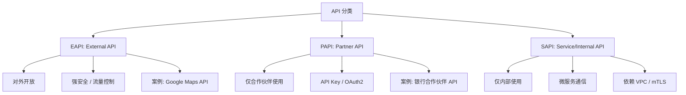

在业界里，不同组织对 API 有不同的分类标准，但通常是按照 **受众（Audience）**、**用途（Purpose）**、**安全性（Security Level）** 来区分。

---

## **常见 API 分类**

|**分类方式**|**类型**|**说明**|
|---|---|---|
|**受众 / 对外开放程度**|**EAPI（External API）**|外部 API，通常面向第三方开发者或外部客户开放。比如 Google Maps API、支付接口（Stripe、PayPal API）。需要强身份认证、安全网关、流量控制。|
||**PAPI（Partner API）**|合作伙伴 API，仅对特定合作伙伴开放。比 EAPI 更加受限，通常签署协议后分发凭证。比如银行开放给合作方的对接接口。|
||**SAPI（Service API / Internal API）**|内部 API，也叫 Internal API，主要在企业或组织内部使用。比如微服务之间的调用接口。安全性依赖 VPC、mTLS、Kong 内部路由等。|
|**功能用途**|数据 API|提供数据访问，比如 SQL-like 查询、统计结果。|
||过程 API|封装业务逻辑，执行特定任务（如提交订单）。|
||系统 API|提供底层系统能力（如 Kubernetes API、Linux syscalls）。|
|**交互协议**|REST API|基于 HTTP 的资源操作，使用 JSON/HTTP verbs。|
||gRPC API|基于 HTTP/2 的高性能二进制 RPC 调用，常用于内部微服务。|
||GraphQL API|客户端定义查询结构，减少冗余数据。|
||WebSocket API|双向长连接，常用于实时推送。|

---

## **重点：EAPI / PAPI / SAPI 的区别**

---

### **简单对比表格**

|**类型**|**全称**|**使用范围**|**安全特征**|**示例**|
|---|---|---|---|---|
|**EAPI**|External API|对外部客户/公众|强认证、限流、防护、审计|Google Maps、Twitter API|
|**PAPI**|Partner API|对合作伙伴|API Key、OAuth2、契约合约|银行对接合作方接口|
|**SAPI**|Service API / Internal API|内部系统/微服务|VPC 内通信、mTLS、少量外部暴露|Kubernetes API、内部微服务 API|

---

要点总结：

- **EAPI** → 完全对外，要求 **最强的安全和 SLA**。
    
- **PAPI** → 半开放，只针对合作伙伴，要求 **契约约束和配额管理**。
    
- **SAPI** → 内部使用，通常只在企业网络内通信，**安全依赖网络隔离和内控**。
    

---

要不要我帮你画一个 **流量路径示例图**，展示 EAPI / PAPI / SAPI 在实际部署中如何经过 Kong Gateway / Ingress / Internal Service？