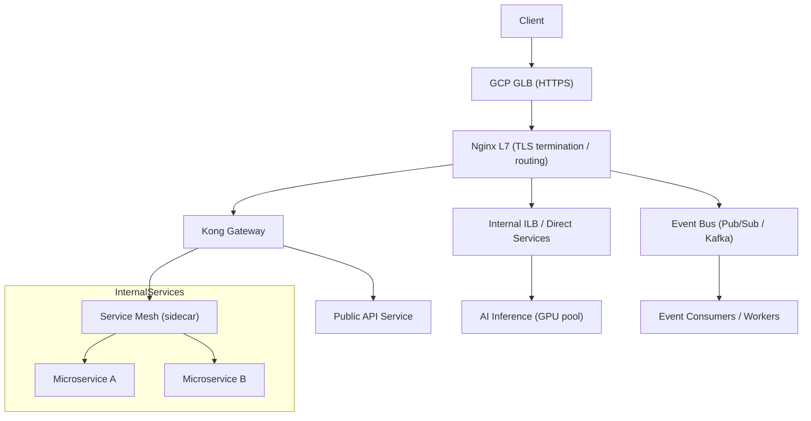

# **问题分析**

你现在的常规链路是：**GCP GLB → Nginx L7 → Kong Gateway → Runtime (Java/Go/Python/Node)**，主要对外暴露 API。随着业务扩展，需要支持更多形式的服务：**容器直连（no gateway）**、**微服务内部调用**、**事件/流式 API（Stream / Event / gRPC Streaming / WebSocket）**、以及面向 AI 的推理/流处理服务。目标是评估这些模式的差异、对平台的要求，以及给出可操作的落地建议（架构、部署、运维、验证与故障排查）。

---

# **解决方案（分层概览 + 平台支持要点）**

按能力分层来考虑：**入口层（GLB/Ingress）→ 网关/路由层（Nginx/Kong/Service Mesh）→ 运行层（K8S / Cloud Run / VMs）→ 异步/事件层（Pub/Sub/Kafka）→ AI/推理层（有状态/GPU/特殊资源）**。

1. **传统 API（现状）**

    - 继续用 GLB + Nginx L7 做 TLS/HTTP(S) termination、WAF（Cloud Armor）；Kong 负责认证、配额、路由、插件（限流、重试、跨域、审计）。
    - 保持现有监控/日志（Stackdriver / BigQuery / ELK）与可观测性（分布式追踪）。

2. **容器直连 / No Gateway（部分服务直接暴露）**

    - 适用于内部服务或低延迟需求（例如大模型推理节点）。可把这些服务放到独立的子网 / 内部负载均衡（ILB）或使用 private GCLB + IAP。
    - 需要更细粒度的网络策略（NetworkPolicy）、访问控制（IAM + mTLS 或 VPC-SC）与审计。
    - 提供接入模板（K8S Service + Internal L4/L7 LB）与安全指南。

3. **微服务架构（Service-to-Service）**

    - 引入**服务网格（如 Istio/Linkerd/consul）**以实现熔断、流量管理、mTLS、可观测性与流量镜像。
    - 对已有 Kong 可保留作为“北向 API 网关”，而内部 east-west 流量由 Service Mesh 管理。
    - 减少应用改造，优先采用 sidecar 模式（自动注入）。

4. **事件驱动 / 流式 API（Stream / gRPC / WebSocket）**

    - 两类模式：
        - **短连接/长连接 gRPC streaming / WebSocket**：需要 L7 支持 HTTP/2 或 WebSocket 升级，注意连接并发、idle 超时、proxy timeout 策略（Nginx / Kong / GLB 配置）。
        - **异步事件（Pub/Sub / Kafka）**：把请求放入消息系统，后端消费并返回结果（同步 -> polling 或 callback）。适合任务型、大吞吐。
    - 监控连接数、backpressure、重试与幂等性设计。

5. **AI / 推理服务（低延迟、大算力、流水线）**

    - 运行层：支持 GPU 实例或 Node Pool（GKE 节点带 GPU）、或托管（Cloud Run 并不适合长时间 GPU）。
    - 模型服务：可采用模型服务器（Triton、TorchServe）或 gRPC 接口暴露。推理通常需要：高并发连接、大带宽、内存/显存监控、批量合并（batching）支持。
    - 数据流：大模型可能需要输入流（视频/音频流）或分段请求，需设计分段、windowing 与流控策略。

---

# **具体操作步骤（平台层面落地清单）**

1. **能力清单与分组**

    - 列出服务分类：Public API、Internal API、Streaming API、Event Consumers、AI Inference。

2. **Ingress 与路由策略**

    - 继续使用 GLB + Nginx L7，确保 Nginx 支持 HTTP/2、WebSocket。
    - 对需要低延迟/内部访问的服务，使用 Internal L4/L7 或直接用 NodePort+ILB。

3. **引入服务网格（按阶段）**

    - POC：选择 Istio/Linkerd，先对一小组服务启用 sidecar，验证 mTLS/telemetry/traffic shifting。

4. **流式/事件支持**

    - 部署 Kafka 或 使用 Pub/Sub（GCP）做事件总线。定义事件 schema（protobuf/avro）。
    - 为长连接设计超时与连接复用策略（Nginx 和 Kong 的 keepalive、proxy_read_timeout、client_body_timeout）。

5. **AI 支持**

    - 建立专用 GPU node pool + autoscaling policy（基于 GPU 使用率）。
    - 部署模型服务器（容器化），用 gRPC 做高效传输。给出可选：批量请求入口层（batcher）减少上下文切换。

6. **安全与认证**

    - 外部：GLB + Cloud Armor + WAF 策略 + Kong 身份鉴权（OAuth / JWT / API Key）。
    - 内部：服务网格 mTLS + NetworkPolicy + IAM 最小权限。

7. **运维 / SLO / 可观测性**

    - 指标：请求延迟、错误率、连接数、GPU/CPU/Memory、消息队列滞后。日志集中化到 BigQuery/ELK；Trace 用 OpenTelemetry。
    - 灰度/金丝雀部署：使用 Istio 或 Kong 的流量分割能力。

8. **模板化与自动化**

    - 为不同类型服务准备 Git repo 模板（Deployment + HPA + Service + Ingress/KongRoute + NetworkPolicy + ResourceQuota）。
    - CI/CD：在 pipeline 中加入 YAML 校验（kubeval）、dry-run、和流量切换步骤。

---

# **代码示例（可直接使用的模板片段）**

> **注意**：执行命令前请检查 gcloud / kubectl 权限与上下文；部署前用 kubectl apply --dry-run=client -f 验证 YAML。

## **1) 普通 HTTP 服务（示例：Node.js）**

```
apiVersion: apps/v1
kind: Deployment
metadata:
  name: demo-node
  namespace: demo
spec:
  replicas: 3
  selector:
    matchLabels:
      app: demo-node
  template:
    metadata:
      labels:
        app: demo-node
    spec:
      containers:
      - name: demo-node
        image: gcr.io/your-project/demo-node:latest
        ports:
        - containerPort: 8080
        readinessProbe:
          httpGet:
            path: /health
            port: 8080
          initialDelaySeconds: 5
          periodSeconds: 10
        resources:
          requests:
            cpu: "250m"
            memory: "256Mi"
          limits:
            cpu: "1"
            memory: "1Gi"
---
apiVersion: v1
kind: Service
metadata:
  name: demo-node
  namespace: demo
spec:
  selector:
    app: demo-node
  ports:
  - port: 80
    targetPort: 8080
```

## **2) Kong Route（示例：Declarative 或 Admin API）**

```
_format_version: "2.1"
services:
- name: demo-node
  url: http://demo-node.demo.svc.cluster.local:8080
  routes:
  - name: demo-route
    paths:
    - /demo
    methods:
    - GET
plugins:
- name: key-auth
  service: demo-node
```

## **3) gRPC Streaming 服务的注意（Nginx 配置片段）**

```
# Nginx 要启用 http2 并且 proxy_pass 支持 http2 后端
# 示例 nginx upstream（简化）
upstream grpc_backend {
    server 10.0.0.10:8080;
}

server {
    listen 443 ssl http2;
    ssl_certificate /etc/ssl/cert.pem;
    ssl_certificate_key /etc/ssl/key.pem;

    location /grpc.MyService/ {
        grpc_pass grpc://grpc_backend;
        grpc_set_header X-Forwarded-For $proxy_add_x_forwarded_for;
        # 注意调整超时
        proxy_connect_timeout 60s;
        proxy_read_timeout 3600s;
    }
}
```

## **4) 事件消费者（示例：Kubernetes Deployment 订阅 Pub/Sub）**

```
apiVersion: apps/v1
kind: Deployment
metadata:
  name: pubsub-consumer
  namespace: demo
spec:
  replicas: 2
  template:
    spec:
      containers:
      - name: consumer
        image: gcr.io/your-project/pubsub-consumer:latest
        env:
        - name: SUBSCRIPTION
          value: "projects/your-project/subscriptions/my-sub"
        resources:
          requests:
            cpu: "200m"
            memory: "512Mi"
```

## **5) GPU Node Pool & Model Server（K8S Pod 示例）**

```
apiVersion: apps/v1
kind: Deployment
metadata:
  name: triton
  namespace: ai
spec:
  replicas: 1
  template:
    spec:
      containers:
      - name: triton
        image: nvcr.io/nvidia/tritonserver:xx
        resources:
          limits:
            nvidia.com/gpu: 1
            memory: "16Gi"
            cpu: "2000m"
        ports:
        - containerPort: 8001  # gRPC
```

---

# **流程图（Mermaid）**



---

# **注意事项与最佳实践**

- **权限与配置检查**：在运行 kubectl、gcloud 或部署脚本前，确认当前账户对目标项目/namespace 的权限（IAM、Service Account）。
- **YAML 校验**：部署前使用 kubeval、kubectl apply --dry-run=client 或 CI 中的验证步骤。
- **超时与连接管理**：流式服务需调整 Nginx/Kong/GLB 的 keepalive、timeout 和最大连接数，避免被中间代理切断。
- **幂等与重试**：对外 API 保持幂等设计；对异步消息设计幂等消费。网关层可配置有限次重试与指数退避。
- **资源隔离**：为 AI / GPU 作业建专用 Node Pool，并用 Taints/Tolerations 限定。
- **观测与 SLO**：提前定义 SLO（p99 latency、error rate），并把关键指标接入告警（PagerDuty / Ops）。
- **灰度发布**：使用流量分割（Istio 或 Kong）做 Canary / A/B。
- **成本控制**：GPU、长期保持的 long-lived connections 会显著增加成本，需制定 autoscale 与 idle 回收策略。
- **故障排查要点**：
    - 若长连接断开：检查 Nginx/Kong 的 proxy_read_timeout、GLB 的 idle timeout。
    - 若单次请求失败（并发下）：检查 DNS、conn tracking、socket limits、pod 端口耗尽、线程池/连接池（应用层）。
    - 若消息滞后：检查 backlog、consumer liveness、分区/offset 情况。

---

# **推荐分阶段落地计划（快速路径）**

1. **1-2 周 POC**：选 1 个流式 API 与 1 个 AI 推理服务进行 POC：验证 Nginx+Kong 的长连接配置、部署模型服务器到 GPU node pool。
2. **2-4 周 内部化**：引入 Service Mesh 至部分内部微服务，评估性能与复杂度。
3. **4-8 周 扩展**：把事件总线（Pub/Sub 或 Kafka）正式化，建立事件 schema 与监控面板。
4. **长期**：模板化 CI/CD（yaml 模板）、成本监控、SLO 和运维 runbook。

---

如果你愿意，我可以：

- 生成 **针对你当前平台** 的具体 Kubernetes / Kong / Nginx 配置模版（把你的 namespace、域名、镜像名替换进去即可），或
- 帮你写一份 **POC 清单**（逐项测试项与验证命令），包括需要在 Nginx / Kong / GLB 上调整的具体参数与验证方法。
