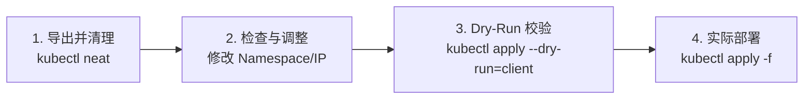

# Kubernetes `kubectl get -o yaml` 导出配置清理与格式化指南

> **摘要**：在使用 `kubectl get <resource> -o yaml` 导出集群中已有资源时，输出包含大量由 Kubernetes 控制平面自动注入的运行时元数据（如 `creationTimestamp`、`resourceVersion`、`uid`、`managedFields`、`status` 等）。本文解答清理后的 YAML 是否可以直接用于 `kubectl apply`，并详细介绍 `kubectl-neat`、`yq` 等工具的离线/在线格式化清理方法。

---

## 目录

- [1. 核心问题解答：清理后的 YAML 能否直接 `kubectl apply`？](#1-核心问题解答清理后的-yaml-能否直接-kubectl-apply)
- [2. 为什么要清理导出 YAML？](#2-为什么要清理导出-yaml)
- [3. 需要清理的典型字段清单](#3-需要清理的典型字段清单)
- [4. 格式化与清理工具及使用方法](#4-格式化与清理工具及使用方法)
  - [4.1 方法一：专业插件 `kubectl-neat`（强烈推荐）](#41-方法一专业插件-kubectl-neat强烈推荐)
  - [4.2 方法二：CLI 工具 `yq`（脚本与流水线方案）](#42-方法二cli-工具-yq脚本与流水线方案)
  - [4.3 方法三：原生 `kubectl --dry-run=client -o yaml`（模板生成）](#43-方法三原生-kubectl---dry-runclient--o-yaml模板生成)
- [5. 工具对比与场景选择指南](#5-工具对比与场景选择指南)
- [6. 从导出到 Apply 的标准工作流](#6-从导出到-apply-的标准工作流)
- [7. 常见踩坑与注意事项](#7-常见踩坑与注意事项)

---

## 1. 核心问题解答：清理后的 YAML 能否直接 `kubectl apply`？

**答案：能，完全可以！**

只要彻底清理掉 Kubernetes 控制平面注入的**运行时状态字段**（如 `status`、`metadata.uid`、`metadata.resourceVersion` 等）以及**特定环境绑定配置**（如 Service 的 `spec.clusterIP`、Pod 的 `spec.nodeName`），导出的 YAML 就会恢复成干净的**声明式资源清单（Declarative Manifest）**。

恢复后的 YAML 可以：
1. 直接在原集群或新集群中运行 `kubectl apply -f <filename>.yaml`。
2. 纳管到 Git 仓库进行版本控制（GitOps 规范）。
3. 作为模板供 Helm 或 Kustomize 进行参数化复用。

---

## 2. 为什么要清理导出 YAML？

如果对直接通过 `kubectl get <resource> -o yaml` 拿到的原始 YAML 运行 `kubectl apply -f`，通常会遭遇以下问题：

| 问题类型 | 具体表现与后果 |
| :--- | :--- |
| **apply 报错拒绝** | 携带 `metadata.resourceVersion` 或 `metadata.uid` 重新提交时，k8s API 会因乐观锁校验失败或 ID 冲突报 `ResourceVersion mismatch` / `already exists` 错误。 |
| **状态污染** | `status` 包含部署前的临时状态信息（如 `readyReplicas`、`podIP`），施加时会被控制平面忽略或引发意料之外的控制器重建逻辑。 |
| **极差的可读性** | Kubernetes 1.18+ 引入的 Server-Side Apply 会产生大量 `metadata.managedFields` 跟踪信息，往往占用数百行无用空间。 |
| **环境绑定硬编码** | 包含特定集群的动态分配值（如 `clusterIP: 10.96.12.34` 或 PV `volumeName`），导致无法迁移至新 Namespace 或新集群部署。 |

---

## 3. 需要清理的典型字段清单

在对 YAML 进行清洗时，需要剥离以下三类字段：

### (1) 通用只读元数据 (`metadata`)
* `metadata.creationTimestamp`（创建时间戳）
* `metadata.resourceVersion`（版本号/乐观锁）
* `metadata.uid`（对象唯一标识符）
* `metadata.generation`（Spec 变更世代数）
* `metadata.managedFields`（服务端字段所有权跟踪）
* `metadata.selfLink`（已废弃的 API 路径）
* `metadata.ownerReferences`（父级控制关联，若跨父组件复用需清理）
* `metadata.annotations["kubectl.kubernetes.io/last-applied-configuration"]`（旧 apply 缓存 JSON）

### (2) 动态运行时状态 (`status`)
* 整个 `status:` 顶层节点（包括 `conditions`、`containerStatuses`、`phase`、`loadBalancer` 等）。

### (3) 环境与运行时绑定字段 (`spec`)
* **Service**: `spec.clusterIP` / `spec.clusterIPs` / `spec.healthCheckNodePort`
* **Pod / Deployment**: `spec.template.spec.nodeName` / `status.podIP`
* **PV / PVC**: `spec.claimRef.uid` / `spec.claimRef.resourceVersion` / `spec.volumeName`
* **StorageClass / Secret**: 特定环境生成的动态加解密 Key 或标识

---

## 4. 格式化与清理工具及使用方法

### 4.1 方法一：专业插件 `kubectl-neat`（强烈推荐）

`kubectl-neat` 是开源社区最受欢迎的专职 YAML 清理工具（GitHub: `itaysk/kubectl-neat`）。

#### 智能特性
与简单的文本正则删除不同，`kubectl-neat` 具有 **Kubernetes 架构感知的智能裁剪**能力：
1. **删除运行时状态**：自动剥离 `status`、`managedFields`、`uid` 等。
2. **剔除默认填充值**：自动识别并剔除 Kubernetes API 默认填充的规范字段（例如 Pod 中的 `dnsPolicy: ClusterFirst`、`restartPolicy: Always`、`terminationMessagePath` 等），让 YAML 极其干净。

#### 安装方式
```bash
# 方式 A：通过 kubectl 官方插件管理器 Krew 安装（推荐）
kubectl krew install neat

# 方式 B：通过 macOS Homebrew 安装
brew install kubectl-neat

# 方式 C：通过 Go 编译安装
go install github.com/itaysk/kubectl-neat@latest
```

#### 常见使用场景

```bash
# 场景 1：管道结合 kubectl 导出干净的 YAML（最常用）
kubectl get deployment myapp -o yaml | kubectl neat > myapp-clean.yaml

# 场景 2：直接使用 neat 封装命令导出
kubectl neat get -- deployment myapp -o yaml > myapp-clean.yaml

# 场景 3：清理本地已存在的“肮脏”YAML 文件
kubectl neat -f dirty-deployment.yaml > clean-deployment.yaml

# 场景 4：生成干净的 JSON 格式
kubectl get pod myapp -o json | kubectl neat -o json
```

---

### 4.2 方法二：CLI 工具 `yq`（脚本与流水线方案）

如果在 CI/CD 环境或未安装 `kubectl-neat` 的场景下，可使用 YAML 命令行解析工具 `yq`（yq v4）进行指定节点的精确剔除。

#### 使用命令

```bash
# 精确删除常见的只读和状态节点
kubectl get deploy myapp -o yaml | \
  yq eval 'del(
    .metadata.resourceVersion,
    .metadata.uid,
    .metadata.annotations."kubectl.kubernetes.io/last-applied-configuration",
    .metadata.creationTimestamp,
    .metadata.generation,
    .metadata.managedFields,
    .metadata.selfLink,
    .status
  )' - > myapp-clean.yaml
```

> **局限性**：`yq` 只能删除人工指定的字段，无法识别并清理 K8s 系统自动补齐的 `spec` 内部默认值。

---

### 4.3 方法三：原生 `kubectl --dry-run=client -o yaml`（模板生成）

如果是为了获取某个新资源的标准 YAML 结构，**无需从已有集群资源 `kubectl get` 后再清理**，可以直接利用 `kubectl` 命令行自带的离线试运行功能生成 100% 干净的规范模板。

#### 实用示例

```bash
# 生成干净的 Deployment 模板
kubectl create deployment myapp --image=nginx:alpine --dry-run=client -o yaml > deployment.yaml

# 生成干净的 Service 模板
kubectl expose deployment myapp --port=80 --target-port=8080 --type=NodePort --dry-run=client -o yaml > service.yaml

# 生成干净的 ConfigMap 模板
kubectl create configmap my-config --from-literal=key1=val1 --dry-run=client -o yaml > configmap.yaml
```

---

## 5. 工具对比与场景选择指南

| 维度 | `kubectl-neat` | `yq` 表达式 | `kubectl --dry-run=client` |
| :--- | :--- | :--- | :--- |
| **主要定位** | 已有资源物理瘦身与智能清理 | 通用 YAML 解析与字段裁剪 | 命令行快捷生成全新资源模板 |
| **智能去重默认值** | **支持** (剥离 K8s 系统默认字段) | 不支持 (仅删除指定 Key) | 天然无冗余 |
| **安装依赖** | 需额外安装插件/二进制 | 需安装 `yq` | 零依赖 (Kubectl 自带) |
| **适用场景** | 导出已有生产资源做备份/迁移 | CI/CD 自动化脚本构建 | 从零快速撰写标准清单 |
| **代码洁净度** | ★★★★★ | ★★★★☆ | ★★★★★ |

---

## 6. 从导出到 Apply 的标准工作流

建议遵循以下四步法完成资源导出的再应用：



### 详细步骤

1. **导出并智能清理**：
   ```bash
   kubectl get deployment my-app -n prod -o yaml | kubectl neat > my-app.yaml
   ```

2. **检查并微调配置文件**：
   * 打开 `my-app.yaml`，检查是否需要变更 `metadata.namespace`、镜像 Tag 或副本数 `replicas`。
   * 如果属于跨环境部署，确认外部依赖（如 Secret 名称、PVC 名称）在新环境中是否存在。

3. **静态 Dry-Run 语法校验**：
   ```bash
   kubectl apply -f my-app.yaml --dry-run=client
   ```

4. **正式部署**：
   ```bash
   kubectl apply -f my-app.yaml
   ```

---

## 7. 常见踩坑与注意事项

1. **Namespace 硬编码冲突**：
   如果导出的 YAML 带有 `metadata.namespace: default`，直接 `kubectl apply -f file.yaml -n dev` 时，`-n dev` 参数**不会覆盖** YAML 内指定的 `namespace`。需手动清理或修改 `metadata.namespace`。
2. **Service 资源 `spec.clusterIP` 保留导致失败**：
   对 Service 资源进行清理时，若保留了固定的 `spec.clusterIP: 10.96.x.x` 并在新集群中 apply，会因 IP 冲突或不在 CIDR 范围内报错。必须确保删除 `clusterIP` 字段。
3. **Secret 数据 base64 解析**：
   从 `kubectl get secret` 导出的配置在 `data:` 中为 Base64 编码数据。若需作为干净的源码保存，建议转换为 `stringData:` 的明文格式以便 Git 进行差异对比。
4. **Server-Side Apply (SSA) 兼容性**：
   在启用 SSA 的集群中，如果不清理 `metadata.managedFields`，每次应用都可能引发字段所有权冲突（Field Ownership Conflicts）。使用 `kubectl-neat` 可彻底规避此问题。