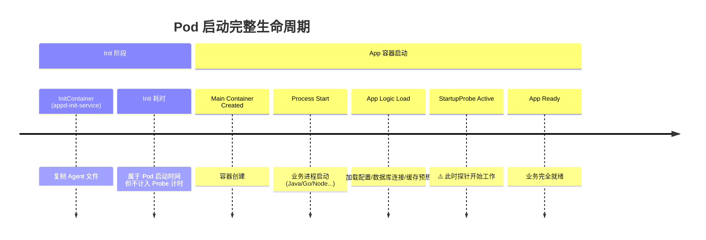
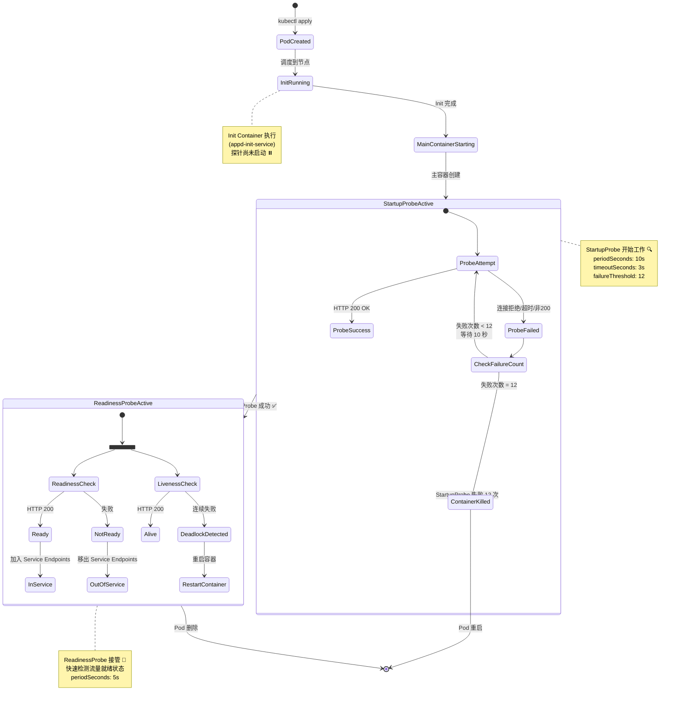
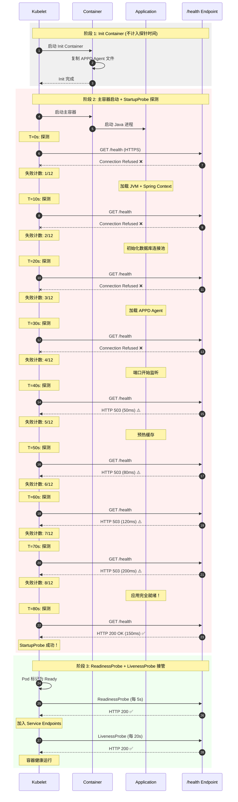
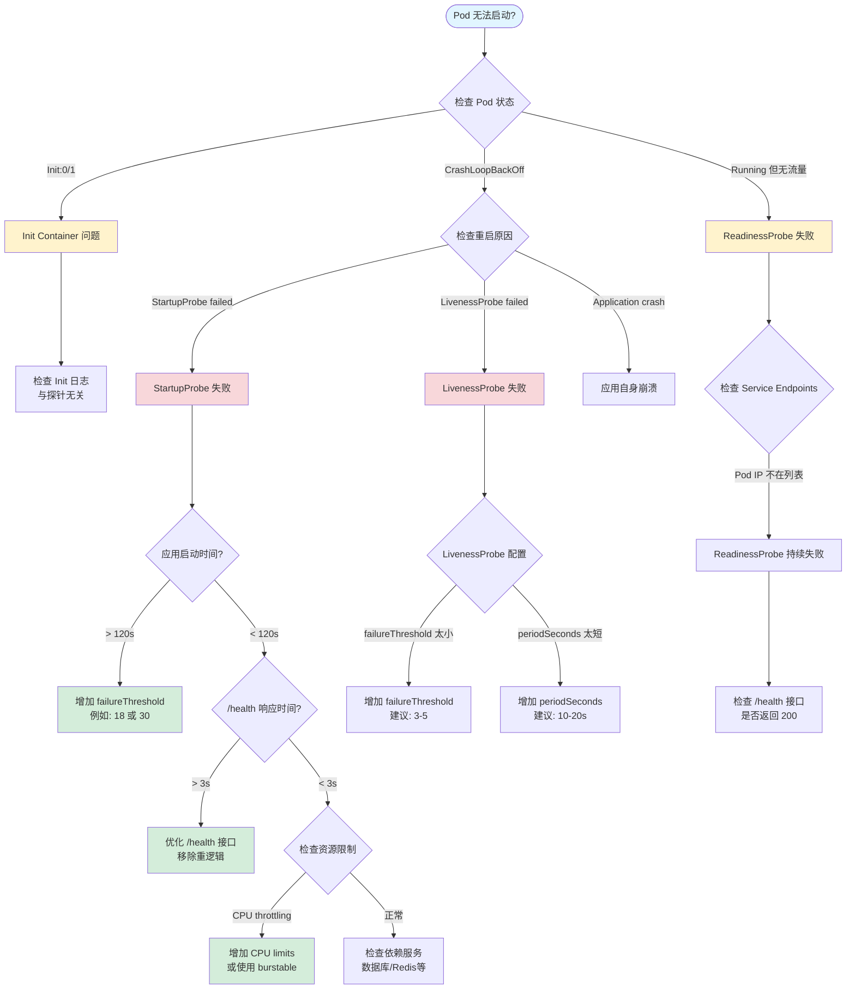

# GKE Explorer: 探针配置最佳实践指南

本文档基于您的 Deployment 模板 (`{{apiName}}-{{apiVersion}}-deployment`)，为您提供一套可落地的 Pod 启动与存活探针（Probe）配置方案。

## 📋 目录

1. [核心概念：启动流程与探针](#1-核心概念启动流程与探针)
2. [第一步：测量真实启动时间](#2-第一步测量真实启动时间-the-metric)
3. [第二步：参数计算公式](#3-第二步参数计算公式-the-math)
4. [最佳实践配置模板](#4-最佳实践配置模板)
5. [深度解析](#5-深度解析-deep-dive)
6. [常见问题解答](#6-常见问题解答-faq)
7. [总结：平台化建议](#7-总结平台化建议)
8. [可视化：探针完整工作流程](#8-可视化探针完整工作流程) ⭐ 推荐
9. [附录：StartupProbe 详细时序分析](#9-附录startupprobe-详细时序分析)

---

## 1. 核心概念：启动流程与探针

要准确配置探针，首先必须理解 Pod 的启动时间线，特别是 `InitContainer` 与 `StartupProbe` 的关系。

### 1.1 启动时间线分析

在您的 Deployment 中，启动过程分为两个阶段：



> [!IMPORTANT]
> **关键认知**：
> `startupProbe`、`livenessProbe` 和 `readinessProbe` **只在主容器（Containers）启动后才开始计时**。
>
> *   **Init Container (appd-init-service)** 的耗时**不会**消耗 `startupProbe` 的时间配额。
> *   如果 Init Container 卡住（例如 `cp -r` 极慢或失败），Pod 状态会停留在 `Init:0/1`，此时主容器还没创建，探针根本还没开始工作。
> *   因此，**探针配置无需考虑 Init Container 的耗时**。

### 1.2 探针职责矩阵

| 探针类型 | 关键参数 | 职责 | 失败后果 | 建议配置原则 |
| :--- | :--- | :--- | :--- | :--- |
| **Startup** | `failureThreshold` | **保护慢启动**。给应用足够的时间完成初始化（加载类、连接池等）。 | **重启容器** (Kill & Restart) | **宁大勿小**。覆盖 99% 的启动场景。 |
| **Readiness** | `periodSeconds` | **流量控制**。决定是否将 Pod IP 加入 Service 的 Endpoints。 | **切断流量** (Service 摘除) | **敏捷**。快速发现故障并切断流量。 |
| **Liveness** | `failureThreshold` | **死锁检测**。发现应用假死（进程在但无法处理请求）。 | **重启容器** (Kill & Restart) | **保守**。避免因短暂波动导致的误杀。 |

---

## 2. 第一步：测量真实启动时间 (The Metric)

在设置参数之前，我们需要知道应用的“真实启动耗时”。这不仅仅是进程启动的时间，而是**业务逻辑完全加载完成，能够响应健康检查**的时间。

### 2.1 测量方法：裸启动测试 (Bare Metal Start)

我们推荐使用**“移除探针法”**进行一次基准测试。这能避免探针本身的干扰（如配置过紧导致的反复重启）。

**操作步骤：**

1.  **创建测试 Deployment**：复制现有的 Deployment YAML。
2.  **移除探针**：注释掉 `startupProbe`, `readinessProbe`, `livenessProbe` 部分。
3.  **部署并观察**：使用提供的脚本测量从 `ContainerStarted` 到 `Health Check 200 OK` 的时间。

> [!TIP]
> 也就是说，我们测量的不是 `Init` 的时间，而是主容器从 **Process Started** -> **Ready** 的时长。

### 2.2 测量脚本 (pod_measure_startup_fixed.sh)

我们提供了一个自动化脚本来测量 Pod 的真实启动时间。该脚本会：
- 自动读取 Pod 的探针配置
- 计算从容器启动到 Ready 状态的耗时
- 分析当前配置是否合理
- 提供优化建议

**脚本位置**：`k8s/scripts/pod_measure_startup_fixed.sh`

#### 使用方法

```bash
# 基本用法
./pod_measure_startup_fixed.sh -n <namespace> <pod-name>

# 示例：测量 nginx Pod 的启动时间
./pod_measure_startup_fixed.sh -n lex nginx-deployment-854b5bc678-m428j
```

#### 输出示例

```
━━━━━━━━━━━━━━━━━━━━━━━━━━━━━━━━━━━━━━━━
测量 Pod 启动时间: nginx-deployment-854b5bc678-m428j (命名空间: lex)
━━━━━━━━━━━━━━━━━━━━━━━━━━━━━━━━━━━━━━━━

📋 步骤 1: 获取 Pod 基本信息
   Pod 创建时间: 2025-10-29T10:58:34Z
   容器启动时间: 2025-11-30T05:07:28Z

📋 步骤 2: 分析就绪探针配置
   就绪探针配置:
   {
     "failureThreshold": 3,
     "httpGet": {
       "path": "/",
       "port": 80,
       "scheme": "HTTP"
     },
     "periodSeconds": 20,
     "successThreshold": 1,
     "timeoutSeconds": 3
   }

   提取的探针参数:
   - Scheme: HTTP
   - Port: 80
   - Path: /
   - Initial Delay: 0s
   - Period: 20s
   - Failure Threshold: 3

⏱️  步骤 3: 检查 Pod Ready 状态
   Pod 已处于 Ready 状态
   Ready 时间: 2025-11-30T05:07:38Z

━━━━━━━━━━━━━━━━━━━━━━━━━━━━━━━━━━━━━━━━
📊 最终结果 (Result)
━━━━━━━━━━━━━━━━━━━━━━━━━━━━━━━━━━━━━━━━
✅ 应用程序启动耗时: 10 秒
   (基于 Kubernetes Ready 状态)

📋 当前探针配置分析:
   - 当前配置允许的最大启动时间: 60 秒
   - 实际启动时间: 10 秒
   ✓ 当前配置足够

💡 建议的优化配置:
   readinessProbe:
     httpGet:
       path: /
       port: 80
       scheme: HTTP
     initialDelaySeconds: 0
     periodSeconds: 20
     failureThreshold: 1

📋 或者使用 startupProbe (推荐):
   startupProbe:
     httpGet:
       path: /
       port: 80
       scheme: HTTP
     initialDelaySeconds: 0
     periodSeconds: 10
     failureThreshold: 1
   readinessProbe:
     httpGet:
       path: /
       port: 80
       scheme: HTTP
     initialDelaySeconds: 0
     periodSeconds: 5
     failureThreshold: 3
━━━━━━━━━━━━━━━━━━━━━━━━━━━━━━━━━━━━━━━━
```

#### 脚本功能特点

1. **自动检测探针配置**：无需手动指定端口和路径
2. **支持 HTTP 和 HTTPS**：自动识别协议类型
3. **实时探测**：如果 Pod 未 Ready，会实时探测直到成功
4. **智能建议**：基于实际启动时间计算推荐配置
5. **跨平台支持**：兼容 macOS 和 Linux

#### 多次测量建议

为了获得准确的 P99 启动时间，建议：

```bash
# 1. 删除现有 Pod，让其重建
kubectl delete pod <pod-name> -n <namespace>

# 2. 等待新 Pod 创建
kubectl get pods -n <namespace> -w

# 3. 测量新 Pod 的启动时间
./pod_measure_startup_fixed.sh -n <namespace> <new-pod-name>

# 4. 重复 3-5 次，记录结果
```

假设测量结果如下（示例）：
*   第 1 次: 15s
*   第 2 次: 25s
*   第 3 次: 22s
*   第 4 次: 18s
*   第 5 次: 40s (P99)

**使用 P99 值（40s）作为配置依据**，确保 99% 的启动场景都能成功。

---

## 3. 第二步：参数计算公式 (The Math)

基于测量出的 **P99（最慢启动时间）**，我们可以科学地计算出推荐参数。

### 3.1 StartupProbe：保护启动

目标：确保即使在最慢的情况下，应用也有足够的时间启动，同时留有安全冗余（Buffer）。

*   **Period (探测间隔)**: 建议固定为 **10s**。如果设置太短（如 1s），会增加 CPU 消耗且无必要。
*   **Target Duration (目标保护时长)** = `P99启动时间` × `1.5` (安全系数)。
*   **FailureThreshold (失败阈值)** = `Target Duration` / `Period`。

> **示例计算**：
> *   P99 启动时间 = 40s
> *   安全保护时长 = 40s × 1.5 = 60s
> *   Period = 10s
> *   **FailureThreshold** = 60 / 10 = **6**

### 3.2 ReadinessProbe：敏捷上线

目标：应用一旦 Ready，尽快切入流量；运行中一旦异常，尽快切断流量。

*   **InitialDelay**: 建议设为 **0** 或极小值（如 5s）。因为 StartupProbe 成功后意味着应用已经 Ready，无需再次强制等待。
*   **Period**: **5s - 10s**。
*   **FailureThreshold**: **3** 次。
*   **Timeout**: **1s - 3s**。不要太长，如果健康检查 3 秒都不回，说明服务负载极高，不应再接流量。

### 3.3 LivenessProbe：兜底防线

目标：只有在应用彻底死锁（Deadlock）时才重启。

*   **InitialDelay**: **0**。StartupProbe 成功后接管，天然不需要 Delay。
*   **Period**: **10s - 20s**。
*   **FailureThreshold**: **3 - 5** 次。
*   **Timeout**: **5s**。给它多一点宽容度，避免因 GC 或瞬时高负载导致的重启。

---

## 4. 最佳实践配置模板

将上述逻辑应用到您的 `deployment.yaml` 中：

### 4.1 场景 A：普通 Java/Go 应用 (启动耗时 < 60s)

```yaml
      # 启动探针：核心是为了给应用 "买时间"
      startupProbe:
        httpGet:
          scheme: HTTPS
          path: /{{apiName}}/{{minorVersion}}/.well-known/health
          port: {{port}}
        periodSeconds: 10
        timeoutSeconds: 3
        failureThreshold: 12  # 提供 10 * 12 = 120s 的启动窗口，足够应对大多数慢启动
        successThreshold: 1

      # 就绪探针：核心是 "敏捷"
      readinessProbe:
        httpGet:
          scheme: HTTPS
          path: /{{apiName}}/{{minorVersion}}/.well-known/health # 💡 建议：尽量使用轻量接口
          port: {{port}}
        initialDelaySeconds: 0 # Startup 成功后立即开始
        periodSeconds: 5       # 每 5 秒检查一次
        timeoutSeconds: 2      # 超时 2 秒即视为一次失败
        failureThreshold: 3    # 连续 3 次失败则摘除流量

      # 存活探针：核心是 "稳重"
      livenessProbe:
        httpGet:
          scheme: HTTPS
          path: /{{apiName}}/{{minorVersion}}/.well-known/health
          port: {{port}}
        initialDelaySeconds: 0

结论：这个设置是合理的，能够满足您的需求。

这里有一个核心概念需要澄清：timeoutSeconds 并不需要覆盖整个应用的启动时间。

为什么是合理的？
Kubernetes 的 StartupProbe 是通过 “多次重试” 来覆盖启动时间的，而不是通过“单次超长等待”。

让我们拆解一下您的场景：

总窗口期 (Total Window)：
您有 12次机会 (failureThreshold: 12)。
每 10秒 试一次 (periodSeconds: 10)。
这意味着：只要您的应用在 120秒 (12 * 10s) 内启动完成，就没有问题。
单次探测 (Single Probe)：
timeoutSeconds: 3 意味着：Kubelet 发起一个 HTTP 请求，如果 3秒内 没收到回复，就记为 “1次失败”。
关键点：失败了没事！我们还有 11 次机会。
模拟应用启动过程
假设您的应用需要 40秒 才能启动完成。在这 40秒内，应用可能完全不响应网络请求（或者响应极慢）。这里的流程是这样的：

T=0s: 探针第 1 次探测。应用在忙着加载各类 Bean，没处理请求。
结果：3秒后超时。
计数：失败 1 次 (还剩 11 次)。
T=10s: 探针第 2 次探测。应用还在忙，甚至连端口都没监听。
结果：Connection Refused (瞬间失败)。
计数：失败 2 次 (还剩 10 次)。
T=20s: ...... 失败 3 次。
T=30s: ...... 失败 4 次。
T=40s: 应用终于启动好了！端口打开了，逻辑加载完了。
T=50s: 探针第 6 次探测。
结果：应用在 200ms 内返回了 HTTP 200 OK。
最终结果：StartupProbe 成功！Pod 被标记为 Ready，进入正常运行。
什么时候 timeoutSeconds: 3 会有问题？
只有一种情况会导致问题：您的应用“已经启动好了”，但是哪怕处理一个最简单的 /health 请求，也需要死死卡住超过 3秒。

如果 /health 接口只是简单返回 "OK"，通常只需要几毫秒。
如果 /health 接口里写了复杂的数据库查询，导致每次都要查 5秒钟数据库才能回包，那就会永远超时，导致 Pod 起不来。
这就是为什么我们建议：健康检查接口一定要轻量。
总结建议
FailureThreshold (12次)：这是给您“加载业务逻辑”的时间（120秒）。
TimeoutSeconds (3秒)：这是要求您的健康检查接口“反应要快”，不要卡顿。
所以，只要您的应用最终能在 120秒内启动完成，并且启动后的 /health 接口响应速度正常（<3s），这个配置就是安全的
```
### 4.2 场景 B：慢启动/重资源应用 (启动耗时 > 2分钟)

例如需要加载大量缓存或模型的 AI 服务。

```yaml
      # 启动探针：为慢启动应用提供更长的窗口
      startupProbe:
        httpGet:
          scheme: HTTPS
          path: /{{apiName}}/{{minorVersion}}/.well-known/health
          port: {{port}}
        periodSeconds: 10
        timeoutSeconds: 3
        failureThreshold: 30  # 提供 10 * 30 = 300s (5分钟) 的启动窗口
        successThreshold: 1

      # 就绪探针和存活探针配置与场景 A 相同
      readinessProbe:
        httpGet:
          scheme: HTTPS
          path: /{{apiName}}/{{minorVersion}}/.well-known/health
          port: {{port}}
        initialDelaySeconds: 0
        periodSeconds: 5
        timeoutSeconds: 2
        failureThreshold: 3

      livenessProbe:
        httpGet:
          scheme: HTTPS
          path: /{{apiName}}/{{minorVersion}}/.well-known/health
          port: {{port}}
        initialDelaySeconds: 0
        periodSeconds: 20
        timeoutSeconds: 5
        failureThreshold: 3
```

**关键点**：
- **增加 `failureThreshold`**（不是 `timeoutSeconds`）来延长启动窗口
- 应用慢是因为在处理业务逻辑，而不是单次 HTTP 请求慢
- HTTP 请求本身应该快速返回（即使在启动期间返回 503）

---

## 5. 深度解析 (Deep Dive)

### 5.1 核心释疑：单次超时(Timeout) vs 启动窗口(Window)

很多用户担心：*"我的应用启动要 1分钟，但 `timeoutSeconds` 只有 3秒，会不会有问题？"*

**答案：完全没问题。**

Kubernetes 的 StartupProbe 是通过 **“多次重试”** 来覆盖启动时间的。

*   **FailureThreshold (12次) × Period (10s) = 120秒**：这是给应用的**启动预算**。只要在这 120秒内任何时候启动完成，都是成功的。
*   **TimeoutSeconds (3秒)**：这是对**健康检查接口响应速度**的要求。
    *   在启动期间（前 119秒），Probe 请求超时或被拒绝都没关系，这只消耗“重试次数”。
    *   一旦应用启动完成，Probe 请求应该在 3秒内迅速返回。如果您的 `/health` 接口逻辑太重（如执行长耗时 SQL）导致永远超过 3秒，探针才会永远失败。

### 5.2 Java 应用的时间账单：Spring 与 APPD

您可能会在日志中看到：
`Root WebApplicationContext: initialization completed in 8000 ms`

**问：这 8000ms 算在哪里？**

**答：这完全属于主容器启动时间，必须包含在 `startupProbe` 的预算内。**

让我们看一个典型的 Java + AppDynamics (APPD) 应用启动时间线：

```mermaid
gantt
    dateFormat  s
    axisFormat  %s
    title Java 应用真实启动耗时分解

    section 阶段
    JVM 初始化 (类加载)      :active, jvm, 0, 5s
    APPD Agent 注入/连接     :crit, appd, 5, 15s
    Spring Context Init     :active, spring, 15, 23s
    Tomcat/Undertow 启动     :server, 23, 26s
    应用完全 Ready           :milestone, ready, 26, 0s
```



1.  **JVM Start**: Java 虚拟机本身的启动成本。
2.  **APPD Agent Overhead**: **这是容易被忽视的大头**。Agent 需要连接 Controller、下载配置、修改字节码（Instrumentation）。这通常会增加 10% - 30% 的启动耗时。
3.  **Spring Init (8000ms)**: 这是日志里打印的时间，**它只是总耗时的一部分**。
4.  **Web Server Start**: 端口终于被监听，此时 Probe 才能连上。

**结论**：
如果日志显示 Spring 启动用了 8秒，您的**真实端到端启动时间**（从 Pod Created 到 Ready）可能高达 **20-30秒**。
因此，配置 `startupProbe` 时，**不要只参考 Spring 的启动日志**，务必使用 `measure_startup.sh` 脚本测量的**真实总时长**。

---

## 6. 常见问题解答 (FAQ)

### Q1: Init Container 执行慢会导致 Probe 失败重启吗？
**不会。**
如果是 `appd-init-service` 复制文件花了 5 分钟，Pod 状态会一直是 `Init:0/1`。此时主容器还没启动，Kubelet 不会执行任何 Probe，因此也不会触发 Probe 失败重启。
*注：如果 Init Container 崩溃退出，那是 Pod 的 RestartPolicy 控制的，与 Probe 无关。*

### Q2: 既然有了 StartupProbe，还需要 InitialDelaySeconds 吗？
**基本不需要。**
在 Kubernetes v1.18+ 引入 `startupProbe` 后，它就是用来替代“通过预估 `initialDelaySeconds` 来等待启动”这种笨办法的。
推荐做法：
*   `startupProbe`: 配置足够的 FailureThreshold。
*   `liveness/readiness`: `initialDelaySeconds: 0`。

### Q3: 为什么我的 Probe 总是超时 (Timeout)？
检查以下几点：
1.  **资源限制 (CPU throttling)**: 启动阶段 CPU 需求大，如果 `resources.limits.cpu` 设置过小，应用响应极慢。
2.  **依赖级联**: 健康检查接口是否去连了数据库？如果数据库慢，探针就慢。推荐健康检查**仅检查应用本身状态**，或者用独立的 `/ready` 接口检查依赖，`/live` 接口仅检查进程。

### Q4: 如何处理 "配置加载" 对启动的影响？
如果应用需要拉取远程配置（如 Spring Cloud Config），这属于“业务启动逻辑”。
**策略**：这会计入 StartupProbe 的时间。因此需要测量这一段耗时，并包含在 StartupProbe 的 `failureThreshold` 缓冲中。

---

## 7. 总结：平台化建议

如果您要为用户提供自助配置，建议遵循以下流程：

1.  **Default (默认值)**:
    *   Startup: 120s (10s * 12) —— 覆盖绝大多数应用。
    *   Liveness: 3次 * 20s —— 足够宽容。
2.  **Override (自定义)**:
    *   允许用户覆盖 `failureThreshold`（针对慢启动应用）。
    *   允许用户覆盖 `path`（针对自定义健康检查路径）。
3.  **Validate (校验)**:
    *   禁止用户将 `timeoutSeconds` 设得过大（如 >10s），这会掩盖系统性能问题。

---

## 8. 可视化：探针完整工作流程

### 8.1 Pod 启动全流程图（带探针状态）



### 8.2 探针时序交互图（80秒启动场景）



### 8.3 探针决策树（故障排查指南）



### 8.4 三种探针对比可视化

```mermaid
gantt
    title 探针生命周期与职责分工
    dateFormat s
    axisFormat %Ss
    
    section Init 阶段
    Init Container 执行 :crit, init, 0, 15s
    探针未启动 :milestone, 15, 0s
    
    section StartupProbe
    保护启动窗口 (0-120s) :active, startup, 15, 135s
    探测 #1 (失败) :milestone, 15, 0s
    探测 #2 (失败) :milestone, 25, 0s
    探测 #3 (失败) :milestone, 35, 0s
    探测 #4 (失败) :milestone, 45, 0s
    探测 #5 (失败) :milestone, 55, 0s
    探测 #6 (失败) :milestone, 65, 0s
    探测 #7 (失败) :milestone, 75, 0s
    探测 #8 (失败) :milestone, 85, 0s
    探测 #9 (成功) :milestone, 95, 0s
    
    section ReadinessProbe
    流量控制 (快速响应) :done, readiness, 95, 200s
    每 5s 检查一次 :milestone, 95, 0s
    
    section LivenessProbe
    死锁检测 (保守策略) :done, liveness, 95, 200s
    每 20s 检查一次 :milestone, 95, 0s
```



---

## 9. 附录：StartupProbe 详细时序分析

### 9.1 探针失败场景详细拆解（基于您的配置）

让我们用您的实际配置来拆解 StartupProbe 的工作机制：

**配置参数**：
```yaml
startupProbe:
  httpGet:
    scheme: HTTPS
    path: /{{apiName}}/{{minorVersion}}/.well-known/health
    port: {{port}}
  periodSeconds: 10        # 每 10 秒探测一次（从上次探测开始计时）
  timeoutSeconds: 3        # 单次探测超时时间 3 秒
  failureThreshold: 12     # 允许失败 12 次
  successThreshold: 1      # 成功 1 次即通过
```

**总启动窗口 = 10s × 12 = 120秒**

**重要概念**：
- `periodSeconds: 10` 表示从**本次探测开始**到**下次探测开始**的间隔是 10 秒
- 如果探测在 3 秒内完成（成功或超时），实际等待时间约为 7 秒
- 如果探测瞬间失败（如连接被拒绝），实际等待时间约为 10 秒

---

### 9.2 场景 A：正常启动（应用耗时 80 秒）

假设您的应用需要 80 秒才能完全启动并响应健康检查。

**关键理解**：`periodSeconds: 10` 是指从**上一次探测开始**到**下一次探测开始**的间隔，不是从上一次探测结束开始计时。

#### 详细时间线（精确到毫秒级）

```
━━━━━━━━━━━━━━━━━━━━━━━━━━━━━━━━━━━━━━━━━━━━━━━━━━━━━━━━━━━━━━━━━━━━━━━━━━━━━━
探测次数 #1
━━━━━━━━━━━━━━━━━━━━━━━━━━━━━━━━━━━━━━━━━━━━━━━━━━━━━━━━━━━━━━━━━━━━━━━━━━━━━━
T = 0.000s:  探测开始
             ├─ Kubelet 发起 HTTPS 请求到 /health
             ├─ 应用未启动，端口未监听
T = 0.001s:  ├─ 连接被拒绝（Connection Refused，几乎瞬间失败）
             └─ 失败计数: 1/12
             
【累积耗时】从容器启动到现在：0.001 秒
【下次探测】T = 0s（本次开始） + 10s（periodSeconds） = 10s

━━━━━━━━━━━━━━━━━━━━━━━━━━━━━━━━━━━━━━━━━━━━━━━━━━━━━━━━━━━━━━━━━━━━━━━━━━━━━━
探测次数 #2
━━━━━━━━━━━━━━━━━━━━━━━━━━━━━━━━━━━━━━━━━━━━━━━━━━━━━━━━━━━━━━━━━━━━━━━━━━━━━━
T = 10.000s: 探测开始（距离第 1 次探测开始正好 10 秒）
             ├─ 应用仍在加载 Spring Context
             ├─ 端口未监听
T = 10.001s: ├─ 连接被拒绝
             └─ 失败计数: 2/12
             
【累积耗时】从容器启动到现在：10.001 秒
【下次探测】T = 10s + 10s = 20s

━━━━━━━━━━━━━━━━━━━━━━━━━━━━━━━━━━━━━━━━━━━━━━━━━━━━━━━━━━━━━━━━━━━━━━━━━━━━━━
探测次数 #3
━━━━━━━━━━━━━━━━━━━━━━━━━━━━━━━━━━━━━━━━━━━━━━━━━━━━━━━━━━━━━━━━━━━━━━━━━━━━━━
T = 20.000s: 探测开始
             ├─ 应用正在初始化数据库连接池
T = 20.001s: ├─ 连接被拒绝
             └─ 失败计数: 3/12
             
【累积耗时】从容器启动到现在：20.001 秒
【下次探测】T = 20s + 10s = 30s

━━━━━━━━━━━━━━━━━━━━━━━━━━━━━━━━━━━━━━━━━━━━━━━━━━━━━━━━━━━━━━━━━━━━━━━━━━━━━━
探测次数 #4
━━━━━━━━━━━━━━━━━━━━━━━━━━━━━━━━━━━━━━━━━━━━━━━━━━━━━━━━━━━━━━━━━━━━━━━━━━━━━━
T = 30.000s: 探测开始
             ├─ 应用正在加载 APPD Agent
T = 30.001s: ├─ 连接被拒绝
             └─ 失败计数: 4/12
             
【累积耗时】从容器启动到现在：30.001 秒
【下次探测】T = 30s + 10s = 40s

━━━━━━━━━━━━━━━━━━━━━━━━━━━━━━━━━━━━━━━━━━━━━━━━━━━━━━━━━━━━━━━━━━━━━━━━━━━━━━
探测次数 #5
━━━━━━━━━━━━━━━━━━━━━━━━━━━━━━━━━━━━━━━━━━━━━━━━━━━━━━━━━━━━━━━━━━━━━━━━━━━━━━
T = 40.000s: 探测开始
             ├─ 应用端口刚刚打开，但业务逻辑未就绪
             ├─ 连接成功！Kubelet 发送 HTTP GET 请求
T = 40.050s: ├─ 应用返回 503 Service Unavailable（响应耗时 50ms）
             └─ 失败计数: 5/12  ⚠️ 注意：即使响应快，返回非 200 也算失败
             
【累积耗时】从容器启动到现在：40.050 秒
【下次探测】T = 40s + 10s = 50s

━━━━━━━━━━━━━━━━━━━━━━━━━━━━━━━━━━━━━━━━━━━━━━━━━━━━━━━━━━━━━━━━━━━━━━━━━━━━━━
探测次数 #6
━━━━━━━━━━━━━━━━━━━━━━━━━━━━━━━━━━━━━━━━━━━━━━━━━━━━━━━━━━━━━━━━━━━━━━━━━━━━━━
T = 50.000s: 探测开始
             ├─ 应用仍在预热缓存
T = 50.080s: ├─ 应用返回 503（响应耗时 80ms）
             └─ 失败计数: 6/12
             
【累积耗时】从容器启动到现在：50.080 秒
【下次探测】T = 50s + 10s = 60s

━━━━━━━━━━━━━━━━━━━━━━━━━━━━━━━━━━━━━━━━━━━━━━━━━━━━━━━━━━━━━━━━━━━━━━━━━━━━━━
探测次数 #7
━━━━━━━━━━━━━━━━━━━━━━━━━━━━━━━━━━━━━━━━━━━━━━━━━━━━━━━━━━━━━━━━━━━━━━━━━━━━━━
T = 60.000s: 探测开始
             ├─ 应用仍在加载配置
T = 60.120s: ├─ 应用返回 503（响应耗时 120ms）
             └─ 失败计数: 7/12
             
【累积耗时】从容器启动到现在：60.120 秒
【下次探测】T = 60s + 10s = 70s

━━━━━━━━━━━━━━━━━━━━━━━━━━━━━━━━━━━━━━━━━━━━━━━━━━━━━━━━━━━━━━━━━━━━━━━━━━━━━━
探测次数 #8
━━━━━━━━━━━━━━━━━━━━━━━━━━━━━━━━━━━━━━━━━━━━━━━━━━━━━━━━━━━━━━━━━━━━━━━━━━━━━━
T = 70.000s: 探测开始
             ├─ 应用几乎就绪
T = 70.200s: ├─ 应用返回 503（响应耗时 200ms）
             └─ 失败计数: 8/12
             
【累积耗时】从容器启动到现在：70.200 秒
【下次探测】T = 70s + 10s = 80s

━━━━━━━━━━━━━━━━━━━━━━━━━━━━━━━━━━━━━━━━━━━━━━━━━━━━━━━━━━━━━━━━━━━━━━━━━━━━━━
探测次数 #9 ✅ 成功！
━━━━━━━━━━━━━━━━━━━━━━━━━━━━━━━━━━━━━━━━━━━━━━━━━━━━━━━━━━━━━━━━━━━━━━━━━━━━━━
T = 80.000s: 探测开始
             ├─ 应用刚刚完全启动！（端口监听 + 业务逻辑就绪）
             ├─ Kubelet 发起 HTTPS 请求
T = 80.150s: ├─ 应用返回 HTTP 200 OK（响应耗时 150ms）
             └─ ✅ 探针成功！successThreshold = 1，立即通过
             
【累积耗时】从容器启动到现在：80.150 秒
【Pod 状态】进入 Ready 状态，开始接收流量
```

#### 关键时间节点总结

| 探测次数 | 开始时间 | 结束时间 | 探测耗时 | 累积总耗时 | 结果 | 失败计数 |
|---------|---------|---------|---------|-----------|------|---------|
| #1 | 0.000s | 0.001s | 0.001s | 0.001s | 连接被拒绝 | 1/12 |
| #2 | 10.000s | 10.001s | 0.001s | 10.001s | 连接被拒绝 | 2/12 |
| #3 | 20.000s | 20.001s | 0.001s | 20.001s | 连接被拒绝 | 3/12 |
| #4 | 30.000s | 30.001s | 0.001s | 30.001s | 连接被拒绝 | 4/12 |
| #5 | 40.000s | 40.050s | 0.050s | 40.050s | HTTP 503 | 5/12 |
| #6 | 50.000s | 50.080s | 0.080s | 50.080s | HTTP 503 | 6/12 |
| #7 | 60.000s | 60.120s | 0.120s | 60.120s | HTTP 503 | 7/12 |
| #8 | 70.000s | 70.200s | 0.200s | 70.200s | HTTP 503 | 8/12 |
| #9 | 80.000s | 80.150s | 0.150s | **80.150s** | ✅ HTTP 200 | 成功 |

#### 核心理解

1. **periodSeconds = 10** 的含义：
   - 第 1 次探测在 T=0s **开始**
   - 第 2 次探测在 T=10s **开始**（不管第 1 次什么时候结束）
   - 第 3 次探测在 T=20s **开始**
   - 以此类推...

2. **探测耗时不影响下次探测时间**：
   - 即使第 5 次探测耗时 50ms，第 6 次仍然在 T=50s 开始
   - 即使第 1 次探测瞬间失败（1ms），第 2 次仍然在 T=10s 开始

3. **累积总耗时 = 最后一次探测结束的时间**：
   - 应用在 80.150 秒完成整个启动过程
   - 失败了 8 次，还剩 4 次机会（12 - 8 = 4）

**结论**：应用在 80 秒启动完成，探针在第 9 次（T=80s 开始，T=80.150s 成功）通过，远未达到 12 次失败阈值。配置安全。

---

### 9.3 场景 B：健康检查接口响应慢（超时陷阱）

假设应用在 30 秒就启动完成了，但 `/health` 接口逻辑太重（例如查询数据库、调用下游服务），导致每次响应都需要 5 秒。

```
T = 0s:  探针第 1 次探测开始
         ├─ 应用未启动，连接被拒绝（瞬间失败）
         └─ 失败计数: 1/12

T = 10s: 探针第 2 次探测开始
         ├─ 应用未启动，连接被拒绝
         └─ 失败计数: 2/12

T = 20s: 探针第 3 次探测开始
         ├─ 应用未启动，连接被拒绝
         └─ 失败计数: 3/12

T = 30s: 探针第 4 次探测开始
         ├─ 应用刚刚启动完成！（但 /health 接口逻辑太重）
         ├─ Kubelet 发起请求
         ├─ 应用开始处理 /health 请求（查询数据库...）
         ├─ T = 33s: Kubelet 等待 3 秒后超时断开连接
         ├─ 应用在 T = 35s 才返回 200（但 Kubelet 已经放弃了）
         └─ 失败计数: 4/12  ⚠️ 超时视为失败

T = 40s: 探针第 5 次探测开始
         ├─ 同样的问题：应用需要 5 秒处理
         ├─ T = 43s: Kubelet 在 3 秒后超时
         └─ 失败计数: 5/12

T = 50s: 探针第 6 次探测开始 -> T = 53s 超时 -> 失败计数: 6/12
T = 60s: 探针第 7 次探测开始 -> T = 63s 超时 -> 失败计数: 7/12
T = 70s: 探针第 8 次探测开始 -> T = 73s 超时 -> 失败计数: 8/12
T = 80s: 探针第 9 次探测开始 -> T = 83s 超时 -> 失败计数: 9/12
T = 90s: 探针第 10 次探测开始 -> T = 93s 超时 -> 失败计数: 10/12
T = 100s: 探针第 11 次探测开始 -> T = 103s 超时 -> 失败计数: 11/12
T = 110s: 探针第 12 次探测开始 -> T = 113s 超时 -> 失败计数: 12/12

T = 113s: ❌ failureThreshold 达到 12，容器被 Kill 并重启
```

**结论**：应用明明在 30 秒就启动好了，但因为健康检查接口响应太慢（>3秒），导致探针永远超时，最终在 T=113s 触发重启。这就是为什么 `/health` 接口必须轻量。

---

### 9.4 场景 C：配置不足（failureThreshold 太小）

假设您错误地配置了 `failureThreshold: 5`（而不是 12），应用启动需要 80 秒。

```
T = 0s:  探针第 1 次探测开始 -> 连接被拒绝 -> 失败计数: 1/5
T = 10s: 探针第 2 次探测开始 -> 连接被拒绝 -> 失败计数: 2/5
T = 20s: 探针第 3 次探测开始 -> 连接被拒绝 -> 失败计数: 3/5
T = 30s: 探针第 4 次探测开始 -> 连接被拒绝 -> 失败计数: 4/5
T = 40s: 探针第 5 次探测开始 -> 连接被拒绝 -> 失败计数: 5/5

T = 40s: ❌ failureThreshold 达到 5，容器被 Kill 并重启
         （应用本来在 T=80s 就能启动好，但没机会了）
```

**结论**：启动窗口（10s × 5 = 50秒）小于应用真实启动时间（80秒），导致应用永远无法启动，陷入重启循环。

---

### 9.5 关键时间节点总结

在您的配置下（`periodSeconds: 10`, `timeoutSeconds: 3`, `failureThreshold: 12`）：

| 时间维度 | 作用 | 您的配置值 | 说明 |
|---------|------|-----------|------|
| **启动窗口** | 给应用"买时间" | 10s × 12 = **120秒** | 应用必须在 120 秒内启动完成 |
| **探测间隔** | 重试频率 | **10秒** | 每 10 秒尝试一次 |
| **单次超时** | 接口响应要求 | **3秒** | 每次 /health 请求必须在 3 秒内返回 200 |
| **失败容忍** | 重试次数 | **12次** | 允许失败 12 次，第 13 次失败才重启 |

**三个关键认知**：
1. **启动窗口（120秒）** 是给应用"加载业务逻辑"的时间（Spring 初始化、数据库连接、缓存预热等）。
2. **单次超时（3秒）** 是要求 `/health` 接口"反应要快"，不要在接口里做重逻辑。
3. **失败次数（12次）** 是缓冲机制，允许应用在启动期间多次失败，只要最终成功即可。

**配置是否合理？**
- 如果您的应用启动耗时 < 120秒，且 `/health` 接口响应 < 3秒 → ✅ 配置安全
- 如果应用启动耗时 > 120秒 → ⚠️ 需要增加 `failureThreshold`（例如改为 18，提供 180秒窗口）
- 如果 `/health` 接口响应 > 3秒 → ❌ 需要优化接口逻辑，而不是增加 `timeoutSeconds`

---

## 10. 最终总结与快速参考

### 10.1 黄金法则（必须记住的 3 条）

```
┌─────────────────────────────────────────────────────────────────────┐
│ 1️⃣  启动窗口 = periodSeconds × failureThreshold                     │
│    例如: 10s × 12 = 120秒启动保护                                    │
│                                                                       │
│ 2️⃣  periodSeconds 从本次探测【开始】到下次探测【开始】               │
│    不是从本次探测结束开始计时                                         │
│                                                                       │
│ 3️⃣  timeoutSeconds 是对 /health 接口响应速度的要求                   │
│    不是给应用启动的时间（那是 failureThreshold 的职责）              │
└─────────────────────────────────────────────────────────────────────┘
```

### 10.2 快速配置决策表

| 应用启动时间 | failureThreshold | periodSeconds | timeoutSeconds | 总窗口 |
|------------|-----------------|--------------|---------------|--------|
| < 60秒 | 12 | 10s | 3s | 120秒 ✅ |
| 60-120秒 | 12 | 10s | 3s | 120秒 ⚠️ |
| 120-180秒 | 18 | 10s | 3s | 180秒 ✅ |
| 180-300秒 | 30 | 10s | 3s | 300秒 ✅ |
| > 300秒 | 自定义 | 10s | 3s | 自定义 |

**计算公式**：`failureThreshold = (P99启动时间 × 1.5) / 10`

### 10.3 故障排查速查表

| 症状 | 可能原因 | 解决方案 |
|-----|---------|---------|
| Pod 一直 `Init:0/1` | Init Container 卡住 | 检查 Init 日志，与探针无关 |
| `CrashLoopBackOff` + StartupProbe failed | 启动时间 > 窗口 | 增加 `failureThreshold` |
| `CrashLoopBackOff` + 探针超时 | `/health` 接口太慢 | 优化接口逻辑，移除重查询 |
| Pod Running 但无流量 | ReadinessProbe 失败 | 检查 `/health` 是否返回 200 |
| Pod 频繁重启 | LivenessProbe 太敏感 | 增加 `failureThreshold` 或 `periodSeconds` |
| CPU throttling | 资源限制过小 | 增加 `resources.limits.cpu` |

### 10.4 推荐配置模板（复制即用）

```yaml
# ✅ 推荐配置：适用于大多数 Java/Go/Node 应用
startupProbe:
  httpGet:
    scheme: HTTPS
    path: /{{apiName}}/{{minorVersion}}/.well-known/health
    port: {{port}}
  periodSeconds: 10        # 固定 10 秒
  timeoutSeconds: 3        # /health 必须在 3 秒内响应
  failureThreshold: 12     # 提供 120 秒启动窗口
  successThreshold: 1      # 成功 1 次即通过

readinessProbe:
  httpGet:
    scheme: HTTPS
    path: /{{apiName}}/{{minorVersion}}/.well-known/health
    port: {{port}}
  initialDelaySeconds: 0   # StartupProbe 成功后立即接管
  periodSeconds: 5         # 快速检测（5 秒）
  timeoutSeconds: 2        # 敏捷切断流量
  failureThreshold: 3      # 连续 3 次失败摘除

livenessProbe:
  httpGet:
    scheme: HTTPS
    path: /{{apiName}}/{{minorVersion}}/.well-known/health
    port: {{port}}
  initialDelaySeconds: 0   # StartupProbe 成功后立即接管
  periodSeconds: 20        # 保守检测（20 秒）
  timeoutSeconds: 5        # 宽容度更高
  failureThreshold: 3      # 避免误杀
```

### 10.5 关键时间点记忆口诀

```
探针开始看主容器，Init 再慢也不怕
十秒一次从头算，探测结束不影响
三秒超时看接口，启动时间看失败次数
十二次机会一百二，应用慢启不用愁
```

**解释**：
- **探针开始看主容器**：探针只在主容器启动后才开始工作
- **Init 再慢也不怕**：Init Container 耗时不计入探针时间
- **十秒一次从头算**：periodSeconds 从本次探测开始计时
- **探测结束不影响**：探测耗时不影响下次探测时间
- **三秒超时看接口**：timeoutSeconds 是对 /health 接口的要求
- **启动时间看失败次数**：failureThreshold 决定启动窗口
- **十二次机会一百二**：12 × 10s = 120秒启动保护
- **应用慢启不用愁**：增加 failureThreshold 即可

### 10.6 下一步行动

1. **测量启动时间**：使用 `pod_measure_startup_fixed.sh` 脚本获取真实数据
   ```bash
   ./pod_measure_startup_fixed.sh -n <namespace> <pod-name>
   ```
2. **计算参数**：根据 P99 启动时间计算 `failureThreshold`
   - 公式：`failureThreshold = (P99启动时间 × 1.5) / periodSeconds`
   - 脚本会自动提供建议值
3. **应用配置**：更新 Deployment YAML
   ```bash
   kubectl apply -f deployment.yaml
   ```
4. **验证效果**：观察 Pod 启动过程，确保不再 CrashLoopBackOff
   ```bash
   kubectl get pods -n <namespace> -w
   kubectl describe pod <pod-name> -n <namespace>
   ```
5. **优化接口**：确保 `/health` 接口轻量快速（< 3秒）
   - 移除数据库查询
   - 移除外部服务调用
   - 仅检查应用本身状态

---

## 📚 参考资源

- [Kubernetes 官方文档：Configure Liveness, Readiness and Startup Probes](https://kubernetes.io/docs/tasks/configure-pod-container/configure-liveness-readiness-startup-probes/)
- [GKE 最佳实践：Health Checks](https://cloud.google.com/kubernetes-engine/docs/concepts/ingress#health_checks)
- [Spring Boot Actuator Health Endpoint](https://docs.spring.io/spring-boot/docs/current/reference/html/actuator.html#actuator.endpoints.health)

---

**文档版本**: v2.0  
**最后更新**: 2024-12  
**维护者**: GKE Platform Team  
**反馈**: 如有问题或建议，请提交 Issue 或 PR
