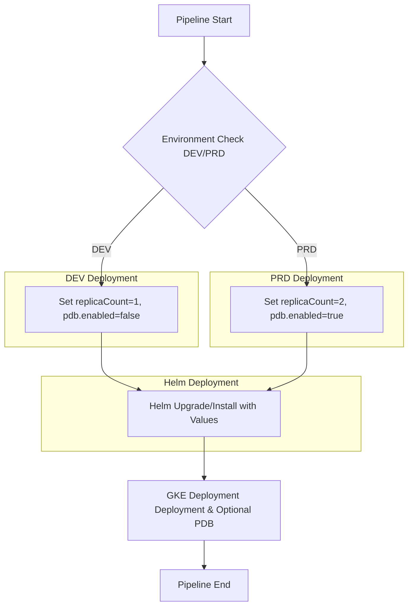

- [summary](#summary)
- [**GKE 部署 PDB 动态控制方案**](#gke-部署-pdb-动态控制方案)
  - [**背景**](#背景)
  - [**需求分析**](#需求分析)
  - [**方案设计**](#方案设计)
- [DeepSeek](#deepseek)
    - [1. Helm Values 分层设计（核心控制逻辑）](#1-helm-values-分层设计核心控制逻辑)
    - [2. 智能 PDB 生成逻辑（Helm Template）](#2-智能-pdb-生成逻辑helm-template)
    - [3. 生命周期自动化设计](#3-生命周期自动化设计)
      - [部署阶段逻辑：](#部署阶段逻辑)
      - [清理阶段逻辑：](#清理阶段逻辑)
    - [4. 多环境兼容实现方案](#4-多环境兼容实现方案)
    - [5. CI/CD 流水线增强建议](#5-cicd-流水线增强建议)
    - [6. 运维监控增强](#6-运维监控增强)
    - [技术选型对比表](#技术选型对比表)
    - [实施路线图](#实施路线图)
    - [关键风险控制](#关键风险控制)
- [Other](#other)
- [**GKE 部署 PDB 动态控制方案**](#gke-部署-pdb-动态控制方案-1)
- [**GKE Helm 部署 PDB 动态控制方案**](#gke-helm-部署-pdb-动态控制方案)
  - [**背景**](#背景-1)
  - [**需求分析**](#需求分析-1)
  - [**方案设计**](#方案设计-1)
    - [**1. `values.yaml` 配置**](#1-valuesyaml-配置)
- [流程设计](#流程设计)
- [Grok](#grok)
- [gemini](#gemini)

# summary 
- target
	1.	PRD 环境：确保 replicas >= 2 时应用 PDB 以保证升级时最少有 1 个 Pod 可用。
	2.	DEV 环境：replicas = 1 时不应用 PDB，因为 PDB 可能会阻止升级。
	3.	CD Pipeline：动态判断环境并决定是否应用 PDB。
	4.	清理逻辑：删除 api_name_version_X.Y.Z 时，也要清理 PDB。
    5.  Using Helm 部署 PDB 动态控制方案
    6.  Verify new Deployment User number in PRD

# **GKE 部署 PDB 动态控制方案**
## **背景**

为了确保 **GKE Cluster** 在升级过程中平滑进行，并保证 **最小 Pod 数量可用**，我们计划在 **PRD 环境** 配置 **PodDisruptionBudget (PDB)**，但 **DEV 环境不需要**。当然这个针对的用户的Runtime而言.

---

## **需求分析**
| 需求 | 方案 |
|------|------|
| 仅在 PRD 时启用 PDB | `values.yaml` 里动态控制 PDB 生成 |
| PRD 至少 2 个 replicas | `values-prd.yaml` 里 `replicas: 2` |
| DEV 仅 1 个 Pod 且无 PDB | `values.yaml` 里 `replicas: 1` 且 `pdb.enabled: false` |
| Helm 统一管理 PDB 和 Deployment | `helm upgrade --install` 时动态渲染 |
| 删除 API 时自动清理 PDB | `helm uninstall` 自动删除相关资源 |

---

## **方案设计**
1. templates/pdb.yaml（动态创建 PDB）
- Helm 的 tpl 语法允许我们动态控制 PDB 是否部署：
```yaml
{{- if and (eq .Values.environment "PRD") (ge .Values.replicas 2) }}
{{- if or (eq .Values.environment "PRD") (eq .Values.environment "PPP") }}
apiVersion: policy/v1
kind: PodDisruptionBudget
metadata:
  name: {{ .api_name_version }}-pdb
spec:
  minAvailable: {{ .Values.pdb.minAvailable }}
  selector:
    matchLabels:
      app: {{ .api_name_version }}
{{- end }}
```
逻辑解析：
	•	eq .Values.environment "PRD" Or PPP  → 仅在 PRD PPP 环境启用 PDB。
	•	ge .Values.replicas 2 → 仅在 replicas ≥ 2 时启用 PDB。 我们可以不考虑这个逻辑了 或者也考虑进去 ,有些测试用户需求比较多?
        {{- if or (eq .Values.environment "PRD") (eq .Values.environment "PPP") }}
	•	minAvailable: {{ .Values.pdb.minAvailable }} → 动态调整 PDB 的最小可用 Pod 数。
```yaml
{{- if eq .Values.environment "PRD" }}
{{- if or (eq .Values.environment "PRD") (eq .Values.environment "PPP") (ge .Values.replicas 2) }}
apiVersion: policy/v1
kind: PodDisruptionBudget
metadata:
  name: {{ .api_name_version }}-pdb
  labels:
    app: {{ .api_name_version }}
    environment: {{ .Values.environment }}
spec:
  minAvailable: 1
  selector:
    matchLabels:
      app: {{ .api_name_version }}
{{- end }}
```


CD Pipeline 渲染 Helm

在 CI/CD Pipeline 部署时：

1. DEV 部署（不会创建 PDB）
`helm upgrade --install my-api ./my-api-chart -f values.yaml`

1. PRD 部署（会创建 PDB）
`helm upgrade --install my-api ./my-api-chart -f values-prd.yaml`

	•	在 DEV 环境 → pdb.yaml 逻辑不会执行（不会创建 PDB）。
	•	在 PRD 环境 → pdb.yaml 逻辑会执行（创建 PDB）。

1. 清理逻辑

当用户删除 api_name_version_1.0.0 时：

`helm uninstall api_name_version_1.0.0`

Helm 会自动删除 Deployment 和 PDB，无需手动管理 PDB 资源。


# DeepSeek
根据你的需求，结合 Helm 的灵活性和 Kubernetes 的 PDB 机制，我为你设计以下解决方案：

---

### 1. Helm Values 分层设计（核心控制逻辑）
在 `values.yaml` 中定义环境差异参数，推荐使用分层 values 文件结构：

```yaml
# values-dev.yaml
environment: dev
replicaCount: 1
pdb:
  enabled: false

# values-prd.yaml
environment: prd
replicaCount: 2
pdb:
  enabled: true
  minAvailable: 1  # 或 maxUnavailable: 1
```

---

### 2. 智能 PDB 生成逻辑（Helm Template）
在 Helm Chart 的 `templates/pdb.yaml` 中实现动态判断：

```yaml
{{- if .Values.pdb.enabled }}
{{- $replicaCheck := ge (int .Values.replicaCount) 2 }}
{{- if or (eq .Values.environment "prd") $replicaCheck }}
apiVersion: policy/v1
kind: PodDisruptionBudget
metadata:
  name: {{ include "fullname" . }}-pdb
  labels:
    {{- include "labels" . | nindent 4 }}
spec:
  {{- if .Values.pdb.minAvailable }}
  minAvailable: {{ .Values.pdb.minAvailable }}
  {{- else if .Values.pdb.maxUnavailable }}
  maxUnavailable: {{ .Values.pdb.maxUnavailable }}
  {{- end }}
  selector:
    matchLabels:
      app: {{ include "appname" . }}
{{- end }}
{{- end }}
```

---

### 3. 生命周期自动化设计
#### 部署阶段逻辑：
```python
if (env == PRD) || (replicas >= 2):
    deploy_pdb()
else:
    skip_pdb()
```

#### 清理阶段逻辑：
```python
# 通过 Helm Hook 实现级联删除
annotations:
  "helm.sh/hook": pre-delete,pre-upgrade
  "helm.sh/hook-weight": "-5"
```

---

### 4. 多环境兼容实现方案
建议采用 **条件判断 + 默认值继承** 的模式：

```yaml
# _helpers.tpl
{{- define "shouldCreatePDB" -}}
{{- if .Values.pdb.enabled -}}
{{- if or (eq .Values.environment "prd") (ge (int .Values.replicaCount) 2) -}}
true
{{- end -}}
{{- end -}}
{{- end -}}
```

---

### 5. CI/CD 流水线增强建议
在部署流水线中增加环境校验：

```bash
# Pipeline 示例
if [[ "$ENV" == "prd" ]]; then
   helm upgrade --install -f values-prd.yaml
else
   helm upgrade --install -f values-dev.yaml
fi
```

---

### 6. 运维监控增强
建议在监控系统中配置 PDB 状态告警：

```yaml
# Prometheus 告警规则示例
- alert: PDBViolation
  expr: kube_poddisruptionbudget_status_current_healthy < kube_poddisruptionbudget_status_desired_healthy
  for: 5m
  labels:
    severity: critical
  annotations:
    description: PDB {{ $labels.name }} 处于违反状态
```

---

### 技术选型对比表
| 方案 | 优点 | 缺点 | 适用场景 |
|------|------|------|----------|
| 环境变量控制 | 简单直观 | 需维护多套配置 | 环境差异明显时 |
| 副本数自动判断 | 动态适应变化 | 需处理临界值问题 | 弹性伸缩场景 |
| 显式开关控制 | 完全可控 | 增加配置复杂度 | 需要精细控制时 |

---

### 实施路线图
1. **Phase 1**：在 Helm Chart 中实现 PDB 模板
2. **Phase 2**：配置不同环境的 values 文件
3. **Phase 3**：在 CI/CD 流水线集成环境检测
4. **Phase 4**：实施监控告警配置
5. **Phase 5**：文档化运维流程（含清理规范）

---

### 关键风险控制
1. **Dev 环境误启用**：通过 `values-dev.yaml` 硬锁定 `pdb.enabled: false`
2. **临界值处理**：当 PRD 环境缩容到 1 个副本时自动禁用 PDB
3. **残留资源清理**：使用 Helm Hook 确保级联删除

```yaml
# 清理钩子示例
annotations:
  "helm.sh/hook-delete-policy": before-hook-creation,hook-succeeded
```

---

该方案通过 Helm 的模板能力实现环境差异的智能处理，同时保持配置的简洁性。PDB 的创建/清理完全由 Helm 生命周期管理，无需额外运维操作。建议在实施前在测试环境验证临界值场景。


# Other

# **GKE 部署 PDB 动态控制方案**
# **GKE Helm 部署 PDB 动态控制方案**

## **背景**

为了确保 **GKE Cluster** 在升级过程中平滑进行，并保证 **最小 Pod 数量可用**，我们计划在 **PRD 环境** 配置 **PodDisruptionBudget (PDB)**，但 **DEV 环境不需要**。当然这个针对的用户的Runtime而言.

---

## **需求分析**
| 需求 | 方案 |
|------|------|
| 仅在 PRD 时启用 PDB | `values.yaml` 里动态控制 PDB 生成 |
| PRD 至少 2 个 replicas | `values-prd.yaml` 里 `replicas: 2` |
| DEV 仅 1 个 Pod 且无 PDB | `values.yaml` 里 `replicas: 1` 且 `pdb.enabled: false` |
| Helm 统一管理 PDB 和 Deployment | `helm upgrade --install` 时动态渲染 |
| 删除 API 时自动清理 PDB | `helm uninstall` 自动删除相关资源 |

---

## **方案设计**

### **1. `values.yaml` 配置**
`values.yaml` 是 Helm 的配置文件，我们可以在这里定义 **环境变量 (`environment`)** 和 **Pod 数量 (`replicas`)**，同时用 `pdb.enabled` 变量决定是否启用 **PodDisruptionBudget (PDB)**。

```yaml
# 环境配置（DEV 或 PRD）
environment: DEV   # 可以设置为 PRD

# Deployment 相关配置
replicas: 1  # PRD >= 2，DEV = 1

# PDB 相关配置
pdb:
  enabled: false  # PRD 下且 replicas >= 2 时自动启用
  minAvailable: 1  # PDB 至少保持 1 个 Pod 可用
```
2. templates/pdb.yaml（动态创建 PDB）

Helm 的 tpl 语法允许我们动态控制 PDB 是否部署：
```yaml
{{- if and (eq .Values.environment "PRD") (ge .Values.replicas 2) }}
{{- if or (eq .Values.environment "PRD") (eq .Values.environment "PPP") }}
apiVersion: policy/v1
kind: PodDisruptionBudget
metadata:
  name: {{ .api_name_version }}-pdb
spec:
  minAvailable: {{ .Values.pdb.minAvailable }}
  selector:
    matchLabels:
      app: {{ .api_name_version }}
{{- end }}
```
逻辑解析：
	•	eq .Values.environment "PRD" → 仅在 PRD 环境启用 PDB。
	•	ge .Values.replicas 2 → 仅在 replicas ≥ 2 时启用 PDB。
	•	minAvailable: {{ .Values.pdb.minAvailable }} → 动态调整 PDB 的最小可用 Pod 数。
```yaml
{{- if eq .Values.environment "PRD" }}
{{- if or (eq .Values.environment "PRD") (eq .Values.environment "PPP") }}
apiVersion: policy/v1
kind: PodDisruptionBudget
metadata:
  name: {{ .api_name_version }}-pdb
  labels:
    app: {{ .api_name_version }}
    environment: {{ .Values.environment }}
spec:
  minAvailable: 1
  selector:
    matchLabels:
      app: {{ .api_name_version }}
{{- end }}
```
3. templates/deployment.yaml（动态调整 replicas）

如果希望 replicas 也可以动态调整，修改 deployment.yaml：
```yaml
apiVersion: apps/v1
kind: Deployment
metadata:
  name: {{ .api_name_version }}
spec:
  replicas: {{ .Values.replicas }}
  selector:
    matchLabels:
      app: {{ .api_name_version }}
  template:
    metadata:
      labels:
        app: {{ .api_name_version }}
    spec:
      containers:
        - name: my-app
          image: my-app-image:latest
```
4. values-prd.yaml（PRD 环境配置）
- 为了区分 DEV 和 PRD，我们可以创建一个 values-prd.yaml：
- 这个办法不太好.
```yaml
environment: PRD
replicas: 2  # PRD 下至少 2 个 Pod
pdb:
  enabled: true
  minAvailable: 1
```
5. CD Pipeline 渲染 Helm

在 CI/CD Pipeline 部署时：

6. DEV 部署（不会创建 PDB）
`helm upgrade --install my-api ./my-api-chart -f values.yaml`

7. PRD 部署（会创建 PDB）
`helm upgrade --install my-api ./my-api-chart -f values-prd.yaml`

	•	在 DEV 环境 → pdb.yaml 逻辑不会执行（不会创建 PDB）。
	•	在 PRD 环境 → pdb.yaml 逻辑会执行（创建 PDB）。

8. 清理逻辑

当用户删除 api_name_version_1.0.0 时：

`helm uninstall api_name_version_1.0.0`

Helm 会自动删除 Deployment 和 PDB，无需手动管理 PDB 资源。

最终方案总结

这套方案兼顾了 动态控制、平滑升级、自动清理，并且完美适配 CD Pipeline 和 Helm 部署。🚀


# 流程设计

1. CD Pipeline 逻辑

CD Pipeline 在部署 API 时：
	•	解析环境变量 ENV（PRD 或 DEV）。
	•	解析 replicas 值，确保 PRD replicas >= 2。
	•	只有在 PRD 且 replicas >= 2 时，才部署 PDB。

2. Helm 或 Kustomize 方案

CD Pipeline 可以基于 Helm 或 Kustomize 动态管理 PDB：
	•	Helm 方案
	•	使用 values.yaml 配置 replicas 和 PDB 是否启用。
	•	仅在 PRD 时应用 PodDisruptionBudget。
	•	通过 --set environment=PRD 动态控制。
示例 Helm values.yaml
```yaml
environment: DEV   # 或 PRD
replicas: 1
pdb:
  enabled: false
```
templates/pdb.yaml（仅在 PRD 启用 PDB）
```yaml
{{- if and (eq .Values.environment "PRD") (ge .Values.replicas 2) }}
{{- if or (eq .Values.environment "PRD") (eq .Values.environment "PPP") }}
apiVersion: policy/v1
kind: PodDisruptionBudget
metadata:
  name: {{ .api_name_version }}-pdb
spec:
  minAvailable: 1
  selector:
    matchLabels:
      app: {{ .api_name_version }}
{{- end }}
```
CD Pipeline 渲染

`helm upgrade --install my-api ./my-api-chart --set environment=PRD --set replicas=2`


	•	Kustomize 方案
	•	base 目录定义 Deployment，不包含 PDB。
	•	overlays/prd 目录添加 PDB 资源，仅适用于 PRD。
示例 kustomization.yaml
```yaml
namespace: my-api-ns
resources:
  - deployment.yaml
```
overlays/prd/kustomization.yaml
```yaml
namespace: my-api-ns
resources:
  - ../../base
  - pdb.yaml
```
CD Pipeline
```bash
if [ "$ENV" == "PRD" ]; then
  kustomize build overlays/prd | kubectl apply -f -
else
  kustomize build base | kubectl apply -f -
fi
```
3. 资源清理逻辑

当用户删除 api_name_version_1.0.0 时：
	•	kubectl delete deployment api_name_version_1.0.0
	•	同时删除对应的 PDB

`kubectl delete pdb api_name_version_1.0.0-pdb --ignore-not-found`


如果使用 Helm：

`helm uninstall api_name_version_1.0.0`

Helm 会自动删除 PDB 和 Deployment。

如果使用 Kustomize：

`kubectl delete -k overlays/prd`

最终方案总结

| 方案         | 逻辑                                                | 适用场景             |
| ------------ | --------------------------------------------------- | -------------------- |
| Helm         | 使用 values.yaml 动态控制 PDB 是否启用              | 适用于标准化的 CI/CD |
| Kustomize    | base 目录定义基础资源，overlays/prd 仅 PRD 添加 PDB | 适用于 GitOps        |
| 手动 kubectl | Pipeline 直接检查 ENV 决定是否 apply PDB            | 适用于已有 CI/CD     |

你可以根据现有的 CD 方式选择合适的方案，推荐 Helm 进行管理，确保 PRD 环境平滑升级，同时保证清理逻辑完整。


# Grok
你的问题涉及如何在 GKE 集群中使用 PodDisruptionBudget (PDB) 实现平滑升级，同时适配 DEV 和 PRD 环境的差异化需求，并结合 Helm 和 CI/CD pipeline 进行管理和清理。以下是一个系统的设计方案，逐步解答你的需求：
设计目标
平滑升级：确保 GKE 集群升级时始终有可用实例，PRD 环境通过 PDB 保证高可用。
环境差异化：DEV 环境 replicas=1 无需 PDB，PRD 环境 replicas>=2 时部署 PDB。
模版化部署：通过 Helm 的 values.yaml 动态控制 PDB 部署。
清理逻辑：确保 PDB 资源跟随 Deployment 生命周期被正确清理。
Pipeline 集成：在 CD 流程中根据环境动态调整逻辑。
整体设计方案
1. Helm Chart 结构设计
使用 Helm 模版化部署，动态决定是否生成 PDB 资源。以下是推荐的 Helm Chart 结构：
```bash
my-chart/
├── templates/
│   ├── deployment.yaml       # Deployment 模版
│   ├── pdb.yaml             # PDB 模版（条件渲染）
│   └── _helpers.tpl         # 辅助函数
├── values.yaml              # 默认配置
└── values-prd.yaml          # PRD 环境专用配置
```
a. values.yaml（默认配置，适用于 DEV）
```yaml
replicaCount: 1
environment: "dev"
pdb:
  enabled: false
  minAvailable: 1
app:
  name: "my-app"
```
b. values-prd.yaml（PRD 专用配置）
```yaml
replicaCount: 2
environment: "prd"
pdb:
  enabled: true
  minAvailable: 1  # 或根据需求调整
app:
  name: "my-app"
```
c. templates/deployment.yaml
```yaml
apiVersion: apps/v1
kind: Deployment
metadata:
  name: {{ .Values.app.name }}
spec:
  replicas: {{ .Values.replicaCount }}
  selector:
    matchLabels:
      app: {{ .Values.app.name }}
  template:
    metadata:
      labels:
        app: {{ .Values.app.name }}
    spec:
      containers:
      - name: {{ .Values.app.name }}
        image: "your-image:{{ .Values.image.tag }}"
```
d. templates/pdb.yaml
```yaml
{{- if .Values.pdb.enabled }}
apiVersion: policy/v1
kind: PodDisruptionBudget
metadata:
  name: {{ .Values.app.name }}-pdb
spec:
  minAvailable: {{ .Values.pdb.minAvailable }}
  selector:
    matchLabels:
      app: {{ .Values.app.name }}
{{- end }}
```
通过 {{- if .Values.pdb.enabled }} 条件，确保 PDB 只在启用时生成。
2. 环境差异化逻辑
DEV 环境：replicaCount=1，pdb.enabled=false，不会生成 PDB 资源。
PRD 环境：replicaCount>=2，pdb.enabled=true，生成 PDB 资源。
动态控制：在 Helm values 文件中通过 environment 和 replicaCount 判断是否启用 PDB。
可以在 _helpers.tpl 中定义辅助逻辑，进一步增强条件判断：
```yaml
{{/* _helpers.tpl */}}
{{- define "pdb.enabled" -}}
{{- if and (eq .Values.environment "prd") (ge .Values.replicaCount 2) -}}
true
{{- else -}}
false
{{- end -}}
{{- end -}}
```
然后在 pdb.yaml 中使用：
```yaml
{{- if (include "pdb.enabled" .) }}
apiVersion: policy/v1
kind: PodDisruptionBudget
metadata:
  name: {{ .Values.app.name }}-pdb
spec:
  minAvailable: {{ .Values.pdb.minAvailable }}
  selector:
    matchLabels:
      app: {{ .Values.app.name }}
{{- end }}
```
这样，只有 PRD 环境且 replicaCount>=2 时才会部署 PDB。
3. CI/CD Pipeline 集成
你的 CD pipeline 需要根据环境加载不同的 values 文件并执行 Helm 部署。以下是一个示例（假设使用 GitHub Actions）：
```yaml
name: Deploy to GKE
on:
  push:
    branches:
      - main
jobs:
  deploy:
    runs-on: ubuntu-latest
    steps:
    - uses: actions/checkout@v3
    - name: Set Environment
      run: |
        if [ "${{ github.ref }}" == "refs/heads/main" ]; then
          echo "ENV=prd" >> $GITHUB_ENV
          echo "VALUES_FILE=values-prd.yaml" >> $GITHUB_ENV
        else
          echo "ENV=dev" >> $GITHUB_ENV
          echo "VALUES_FILE=values.yaml" >> $GITHUB_ENV
        fi
    - name: Deploy with Helm
      run: |
        helm upgrade --install my-app ./my-chart \
          -f ${{ env.VALUES_FILE }} \
          --namespace ${{ env.ENV }} \
          --set image.tag=${{ github.sha }}
```
DEV 环境：加载 values.yaml，replicaCount=1，不部署 PDB。
PRD 环境：加载 values-prd.yaml，replicaCount>=2，部署 PDB。
4. 清理逻辑
为了确保 PDB 资源跟随 Deployment 清理，需要：
命名一致性：PDB 的 metadata.name 与 Deployment 的 app 标签关联（例如 {{ .Values.app.name }}-pdb）。
Helm 卸载：当用户删除 Deployment 时，Helm 会自动清理关联的 PDB 资源。
bash
helm uninstall my-app --namespace prd
手动清理（可选）：如果用户通过其他方式删除 Deployment，提供脚本检查并清理残留 PDB：
bash
kubectl delete pdb -l app=my-app --namespace prd
在 pipeline 中添加清理步骤：
```yaml
- name: Cleanup Old Resources
  run: |
    helm uninstall my-app --namespace ${{ env.ENV }} || true
    kubectl delete pdb -l app=my-app --namespace ${{ env.ENV }} || true
```
5. 平滑升级验证
PRD 环境：replicaCount>=2 配合 minAvailable=1，确保升级时至少 1 个 Pod 可用。
DEV 环境：无 PDB，单实例部署，升级可能短暂中断（符合 DEV 环境的低要求）。
GKE 集群升级：结合 GKE 的 PodDisruptionBudget 支持，集群升级会尊重 PDB 约束。
完整流程总结
Helm Chart：
使用 values.yaml 和 values-prd.yaml 区分 DEV 和 PRD 配置。
PDB 模版通过条件渲染动态生成。
Pipeline：
根据分支或环境变量选择不同的 values 文件。
执行 helm upgrade 部署。
清理：
Helm 卸载自动清理 PDB。
提供脚本清理残留资源。
验证：
PRD 环境测试 PDB 生效（kubectl describe pdb）。
DEV 环境确认无 PDB 部署。
额外建议
PDB 参数调整：根据业务需求调整 minAvailable 或 maxUnavailable，例如：
高可用业务：minAvailable: 50%。
低负载业务：minAvailable: 1。
监控集成：在 PRD 环境中通过 Prometheus 监控 Pod 可用性，确保 PDB 生效。
版本控制：在 values.yaml 中添加版本字段（如 api_name_version_1.0.0），便于清理特定版本资源。
这样设计既满足了平滑升级和环境差异化的需求，又保证了清理逻辑的完整性，同时与 Helm 和 Pipeline 无缝集成。有什么具体细节需要调整或补充，可以告诉我！

# gemini 
为了在 GKE API 平台上平滑升级并确保最小 Pod 数量可用，同时兼容 DEV 和 PRD 环境并处理清理逻辑，我们可以设计一个基于 Helm 和 Pipeline 的流程，利用 `PodDisruptionBudget` (PDB) 资源。以下是详细的设计方案：

**1.  Helm Chart 结构调整和 `values.yaml` 配置**

为了动态控制 PDB 的部署，我们需要在 Helm Chart 的 `values.yaml` 中引入相关的配置项。

*   **`values.yaml` 配置项:**

```yaml
replicaCount: 1 # DEV 环境默认副本数
pdb:
  enabled: false # 默认禁用 PDB
  minAvailable: 1  # PDB 最小可用 Pod 数量，PRD 环境可以调整
environment: "DEV" # 默认环境为 DEV

deployment:
  # ... Deployment 的其他配置
  replicas: {{ .Values.replicaCount }}
  # ...
```

*   **PDB 资源模板 (`templates/pdb.yaml`):**

创建一个 PDB 模板，并使用 Helm 的 `if` 条件语句来控制是否部署 PDB。条件可以基于 `pdb.enabled` 和 `environment` (或 `replicaCount`)。

```yaml
{{- if and .Values.pdb.enabled (ge .Values.deployment.replicas 2) (eq .Values.environment "PRD") }}
apiVersion: policy/v1
kind: PodDisruptionBudget
metadata:
  name: {{ template "fullname" . }}-pdb
  labels:
    app: {{ template "name" . }}
    chart: {{ .Chart.Name }}-{{ .Chart.Version | replace "+" "_" }}
    release: {{ .Release.Name }}
    heritage: {{ .Release.Service }}
spec:
  minAvailable: {{ .Values.pdb.minAvailable }}
  selector:
    matchLabels:
      app: {{ template "name" . }}
{{- end }}
```

**说明:**

*   `{{- if and .Values.pdb.enabled (ge .Values.deployment.replicas 2) (eq .Values.environment "PRD") }}`:  这个 `if` 条件确保只有当 `pdb.enabled` 为 `true` **并且** `deployment.replicas` 大于等于 2 **并且** `environment` 为 `PRD` 时，才会部署 PDB。
*   `{{ template "fullname" . }}-pdb`:  PDB 的名称可以基于 Helm 的命名模板，确保唯一性。
*   `minAvailable: {{ .Values.pdb.minAvailable }}`:  PDB 的 `minAvailable` 值从 `values.yaml` 中获取，方便在 PRD 环境中调整。
*   `selector`:  PDB 的 `selector` 应该匹配 Deployment 的 Pod 标签，通常是 `app` 标签。

**2.  CD Pipeline 设计**

在 CD Pipeline 中，我们需要根据不同的环境设置 `values.yaml` 中的参数。

*   **Pipeline 步骤:**

    1.  **环境检测:**  Pipeline 需要识别当前部署的环境 (DEV 或 PRD)。这可以通过 Pipeline 的环境变量或配置来确定 (例如 `ENVIRONMENT=DEV` 或 `ENVIRONMENT=PRD`)。
    2.  **Helm 值覆盖:**  在 Helm deploy 步骤中，根据环境设置 `values.yaml` 的值。

    *   **DEV 环境 Pipeline 示例:**

        ```bash
        # ... 其他 Pipeline 步骤 ...

        # 设置 Helm values 用于 DEV 环境
        helm upgrade --install my-api-release ./helm-chart \
          --set replicaCount=1 \
          --set pdb.enabled=false \
          --set environment=DEV \
          --namespace my-namespace

        # ... 其他 Pipeline 步骤 ...
        ```

    *   **PRD 环境 Pipeline 示例:**

        ```bash
        # ... 其他 Pipeline 步骤 ...

        # 设置 Helm values 用于 PRD 环境
        helm upgrade --install my-api-release ./helm-chart \
          --set replicaCount=2 \
          --set pdb.enabled=true \
          --set environment=PRD \
          --namespace my-namespace

        # ... 其他 Pipeline 步骤 ...
        ```

    *   **更灵活的 Pipeline 值设置:**  可以使用更灵活的方式，例如使用 `envsubst` 或类似的工具，将 Pipeline 环境变量注入到 `values.yaml` 文件中，然后再执行 `helm upgrade` 命令。

        ```bash
        # 假设 pipeline 中有环境变量 ENVIRONMENT (DEV/PRD)

        if [ "$ENVIRONMENT" == "PRD" ]; then
          pdb_enabled=true
          replica_count=2
        else
          pdb_enabled=false
          replica_count=1
        fi

        helm upgrade --install my-api-release ./helm-chart \
          --set replicaCount=$replica_count \
          --set pdb.enabled=$pdb_enabled \
          --set environment=$ENVIRONMENT \
          --namespace my-namespace
        ```

**3.  清理逻辑**

当需要清理 API (例如 `api_name_version_1.0.0`) 时，如果使用 Helm 部署，最简单的清理方式是使用 Helm 的 `uninstall` 命令。

*   **Helm Uninstall:**

    ```bash
    helm uninstall my-api-release -n my-namespace
    ```

    当执行 `helm uninstall` 命令时，Helm 会删除该 Release 下所有部署的 Kubernetes 资源，包括 Deployment、Service、Ingress **以及我们部署的 PDB**。  因为 PDB 是 Helm Chart 的一部分，所以会被自动清理掉。

*   **确保 PDB 是 Helm Chart 的一部分:** 重要的是要确保 `templates/pdb.yaml` 文件确实存在于你的 Helm Chart 中，并且 PDB 是通过 Helm 进行部署和管理的。

**4.  流程图 (Mermaid)**



**5.  总结和最佳实践**

*   **使用 Helm 管理 PDB**: 将 PDB 定义为 Helm Chart 的一部分，可以方便地进行部署、升级和清理。
*   **`values.yaml` 动态配置**:  通过 `values.yaml` 和 Helm 的模板功能，可以灵活地控制 PDB 是否部署以及相关的参数。
*   **Pipeline 自动化**:  使用 CD Pipeline 自动化部署流程，并根据环境动态设置 Helm 的 Values，确保 DEV 和 PRD 环境的差异化配置。
*   **Helm Uninstall 清理**:  使用 Helm 的 `uninstall` 命令进行资源清理，可以确保 PDB 等所有相关资源都被正确删除。
*   **测试验证**:  在 DEV 和 PRD 环境中充分测试 Pipeline 和 Helm Chart，验证 PDB 是否按预期部署和工作，以及清理逻辑是否正确。
*   **监控 PDB 状态**:  在 PRD 环境中，监控 PDB 的状态，确保在节点维护或升级时，Pod 的驱逐受到 PDB 的保护，服务平滑可用。可以使用 `kubectl get pdb -n <namespace>` 命令查看 PDB 的状态。

通过以上设计，你可以有效地在 GKE 平台上实现 PDB 的动态部署和管理，确保 PRD 环境的平滑升级，同时兼容 DEV 环境，并简化资源清理流程。 使用 Helm 和 Pipeline 结合的方式，能够提供灵活、可维护和自动化的 API 平台部署方案。