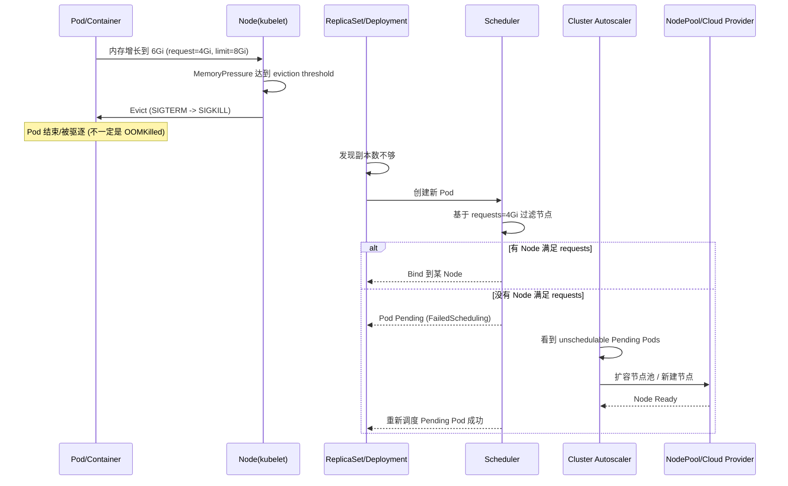
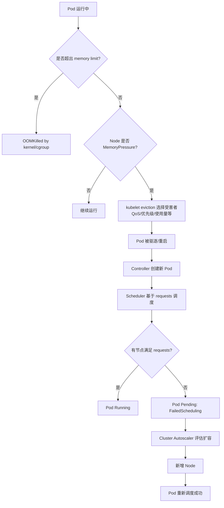

# Kubernetes Requests/Limits、调度默认行为与 Autoscaling（场景推演）

> Last Updated: 2026-03-16  
> Related: [`k8s-request.md`](k8s-request.md), [`k8s-request-limit.md`](k8s-request-limit.md)

你关心的核心可以浓缩成一句话：

> **Scheduler 主要按 `requests` 进行“能不能放下”的计算；是否扩容取决于“有没有 Pending Pod”与 HPA/VPA 指标；Pod 在 Node 上“死掉”更多是 kubelet 的驱逐/OOM/节点压力，而不是 Scheduler 主动迁移。**

---

## 1. 默认调度到底看什么？

### 1.1 调度时：基本只看 `requests`（不是 `limits`）

- **CPU/Memory 的 `requests`**：决定 Pod *能不能被调度到某个 Node*（Node allocatable - 已分配 requests）。
- **CPU/Memory 的 `limits`**：决定 Pod *运行时* 的资源上限行为（CPU 会 throttling；内存超过 limit 会 OOMKilled）。

> 关键点：**Scheduler 不会因为 “Node 当前真实内存快满了” 就自动迁走你的 Pod**。它做的主要是“承诺式（requests）装箱”。

### 1.2 QoS（影响谁先被驱逐）

Kubernetes 会根据 requests/limits 形成 QoS 类别（驱逐优先级大致：BestEffort 最容易被杀，Guaranteed 最不容易）：

- **Guaranteed**：requests == limits（且都设置）
- **Burstable**：requests < limits（你举的 request=4Gi, limit=8Gi 属于它）
- **BestEffort**：requests/limits 都不设

当 Node **MemoryPressure** 时，kubelet 会优先驱逐 QoS 更低、且“超出 requests 使用更多”的 Pod（Burstable 常中枪）。

---

## 2. “什么时候横向扩展、什么时候纵向扩展？”

先把概念对齐：K8s **不会给一个正在跑的 Pod 动态加 request/memory**。所谓“纵向扩展”通常是 **重建 Pod** 来应用新 requests/limits。

### 2.1 横向扩展（HPA）：加 Pod 副本数

触发条件（最常见）：

- CPU/Memory utilization（注意：**utilization 的分母是 requests**）
- 自定义指标（QPS、队列长度等）

例如：Pod request.memory=4Gi，实际用到 6Gi，则 memory utilization = 150%。如果 HPA target=80%，会倾向扩容副本。

### 2.2 纵向扩展（VPA）：调 requests/limits（通过重建 Pod 生效）

触发条件：

- VPA 根据历史使用量计算推荐值；Auto 模式会 **evict Pod** 来让新 requests 生效。

约束（很重要）：

- VPA 和 HPA（基于 CPU/Memory 的）通常不能同时对同一容器生效，否则会“一个加副本，一个加 request”打架（可以用自定义指标的 HPA + VPA 搭配）。

### 2.3 集群层扩展（Cluster Autoscaler, CA）：加 Node（扩 Node Pool）

触发条件（最关键）：

- **出现 Pending Pod，且 CA 判断：新增某种节点后该 Pod 可以被调度**（且不被 taint/affinity 等约束阻挡）。

> CA 不会因为“某个 Pod 内存高/节点压力大”就直接加节点；它看的是“调度失败导致的 Pending”。

---

## 3. 你的场景推演：request=4Gi，limit=8Gi，Pod 用到 6Gi 但“Node 没资源了”

你描述的“Pod 死掉，但没超过 limit”，在生产里最常见是两类原因：

1. **Node 发生内存压力（MemoryPressure），kubelet 触发 eviction**（你是 Burstable，且用了 6Gi > request 4Gi，容易被选中）
2. **节点上其他进程/Pod 抢内存导致系统 OOM/驱逐**（即便你没超过自己的 cgroup limit）

### 3.1 事件链（简化版）



### 3.2 “为什么 Node 没资源会导致 Pod 死，而不是自动扩容？”

因为这里有两套完全不同的触发路径：

- **kubelet eviction**：发生在 Node 上（运行期），为了保住 Node 稳定性会杀 Pod。它不负责扩容。
- **Cluster Autoscaler**：发生在集群层（调度期），它只因 **Pending 且不可调度** 而扩容。

如果你的 Pod 被驱逐后，新 Pod **仍能被调度到现有 Node**（即 requests=4Gi 还能放得下），那就 **不会触发 CA**，但你仍可能在新的 Node 上再次遭遇 MemoryPressure → 再次驱逐（形成“抖动/死亡循环”）。

---

## 4. 资源不足时的“默认流程图”：调度 vs 驱逐 vs 扩容



---

## 5. 你要怎么验证“到底发生了什么”？（可操作命令）

### 5.1 看 Pod 是被 OOMKilled 还是被 Evicted

```bash
kubectl describe pod <pod> -n <ns>
kubectl get events -n <ns> --sort-by=.lastTimestamp | tail -n 50
```

你重点看：

- `Reason: OOMKilled`（容器超过 memory limit）
- `Reason: Evicted` / `The node was low on resource: memory`（节点内存压力驱逐）
- `FailedScheduling`（调度失败，才会走到 CA 扩容可能性）

### 5.2 看 HPA 是否在“用 requests 当分母”触发扩容

```bash
kubectl get hpa -A
kubectl describe hpa <hpa> -n <ns>
```

如果 HPA 用 memory utilization：

- requests.memory 太小会导致 utilization 虚高（例如启动瞬间 326%），从而 **上线即扩容**（你在 `k8s-request-limit.md` 里也提到了类似现象）。

### 5.3 看 Cluster Autoscaler 是否真的扩了节点

- Pending Pod + `FailedScheduling` 是前置条件（`kubectl describe pod` 能看到）。
- CA 日志（GKE 里通常在系统组件日志/云控制台里）会说明它为什么 scale up / scale down。

---

## 6. 针对该场景的“务实建议”（避免抖动与误扩容）

1. **把 requests.memory 设到“稳态或启动后典型值”的附近**（至少别比常态低太多）。  
   - 否则：HPA memory utilization 容易虚高；Burstable 容易在 Node 压力下被驱逐。
2. **关键服务优先用 Guaranteed（requests=limits）**，用 HPA 横向扩容来抗峰值（而不是靠 limits 突发顶住）。  
3. **对会突发的服务**：  
   - 要么提高 requests（减少 eviction 风险）  
   - 要么接受 eviction（并确保有足够副本 + PDB + 快速启动）
4. **把“扩 Pod”和“扩 Node”的触发链路打通**：  
   - HPA 扩 Pod → 新 Pod Pending → CA 扩 Node  
   - 否则 HPA 扩出来的 Pod 只会 Pending，形成“假扩容”。

---

## 7. 一句话回答你的具体疑问

> “request 4 / limit 8，Pod 用到 6G 没到 limit，但 Node 没资源，Pod 死了，扩展流程是什么？”

- Pod 死通常是 **Node MemoryPressure → kubelet eviction**（不是 Scheduler 扩容）。
- Deployment/ReplicaSet 会拉起新 Pod。
- 新 Pod **如果因为 requests=4Gi 找不到节点** → 进入 Pending（FailedScheduling）→ 才可能触发 **Cluster Autoscaler 扩 Node**。
- HPA 是否扩 Pod，取决于指标（memory utilization 时分母是 requests=4Gi，所以 6Gi 会显示 150%）。

