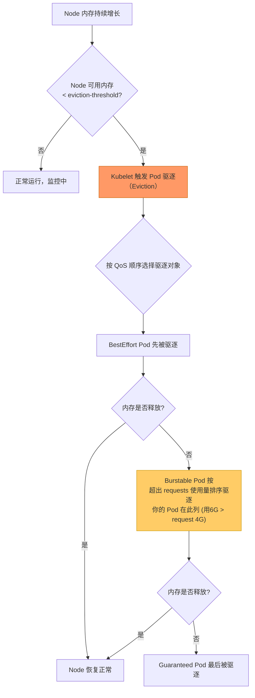
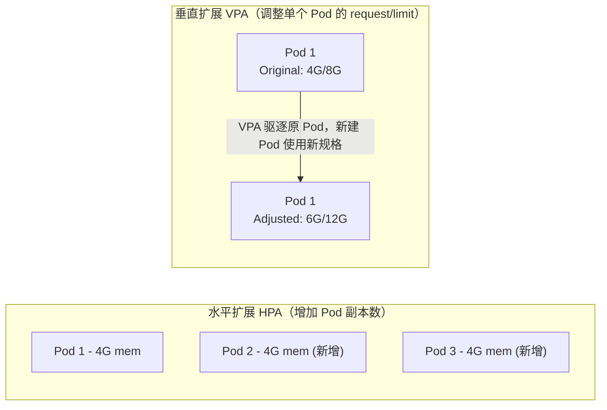
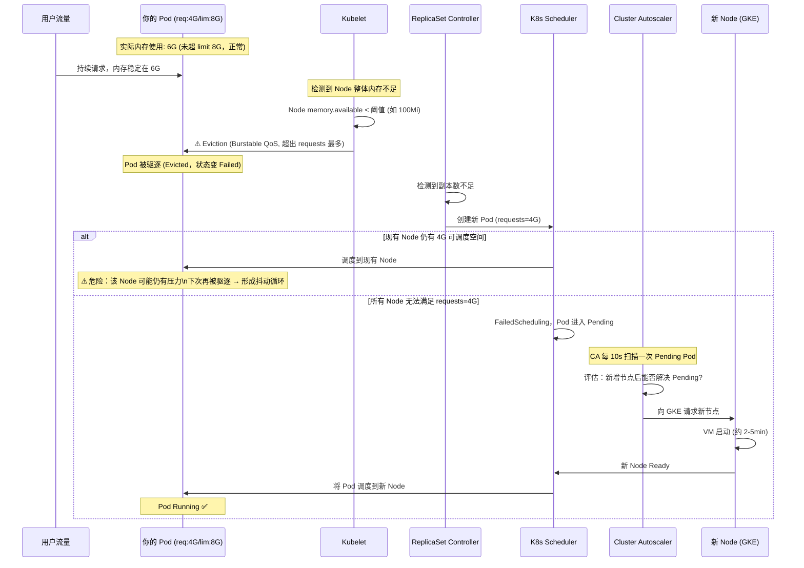
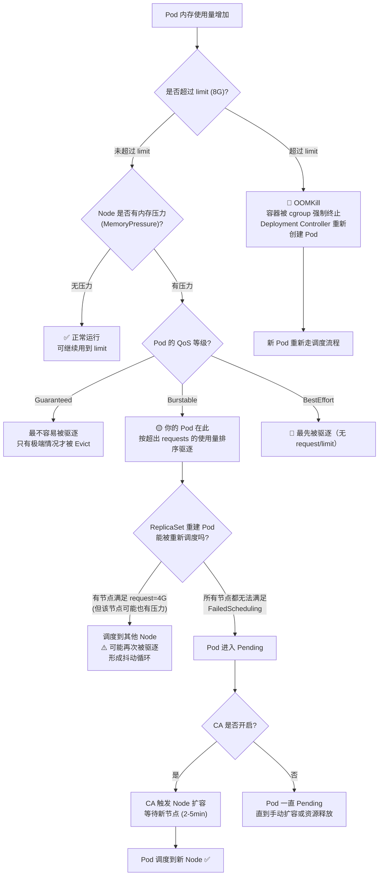
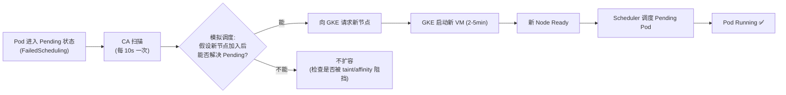
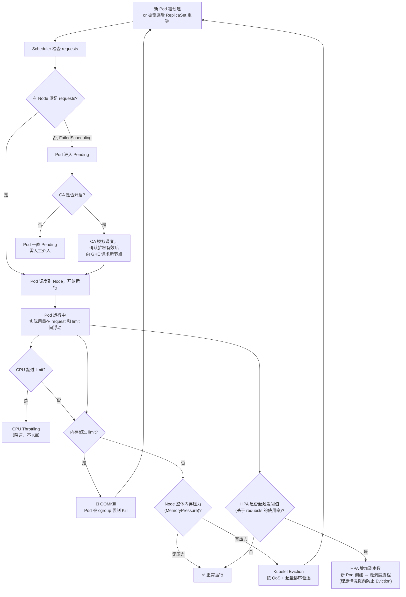

# Kubernetes 资源调度与自动扩缩容深度解析

> **核心问题**：`request: 4G / limit: 8G` 的 Pod 正在使用 6G 内存（未达 Limit），但它所在的 Node 已经没有资源了，会发生什么？横向扩展和纵向扩展分别在什么时候触发？

---

## 1. 理解资源的两个核心概念

```
┌──────────────────────────────────────────────────────────┐
│                  K8s 资源模型                             │
│                                                          │
│  requests          limits                                │
│  ─────────         ─────────                             │
│  调度的"门票"       运行的"天花板"                           │
│  Scheduler 看这里   Kubelet 限制这里                        │
│                                                          │
│  ├─── 4G request ──────────── 8G limit ────▶             │
│  ↑ 节点至少要有这么多   ↑ Pod 用到这里就会 OOMKill          │
│  "空位"才能落地        （内存），或被 throttle（CPU）         │
└──────────────────────────────────────────────────────────┘
```

| 属性 | requests | limits |
| :--- | :--- | :--- |
| **作用阶段** | 调度阶段（Scheduler 筛选节点） | 运行阶段（Kubelet/cgroup 限制） |
| **超出时行为（CPU）** | N/A | CPU throttling（限速，不 Kill） |
| **超出时行为（内存）** | N/A | OOMKill（Pod 被 Kill，然后重启） |
| **影响 QoS 等级** | 是 | 是 |

> **关键点**：Scheduler **不会**因为"Node 当前真实内存快满了"就自动迁走你的 Pod。它做的是"承诺式（requests）装箱"——只看 requests 的账本，不看真实使用量。

---

## 2. QoS 等级决定你的 Pod 有多"高贵"

QoS 等级是 K8s 在节点资源紧张时，决定**先驱逐谁**的标准：

| QoS 等级 | 条件 | 被驱逐优先级 | 你的场景（request 4G / limit 8G） |
| :--- | :--- | :---: | :--- |
| **Guaranteed** | requests == limits（CPU 和内存均设置） | 最后被驱逐 | ❌ 不满足（4G ≠ 8G） |
| **Burstable** | requests < limits，且至少一项有设置 | 中等 | ✅ **你的 Pod 是这个** |
| **BestEffort** | requests 和 limits 均未设置 | **最先** 被驱逐 | ❌ 不适用 |

> **注意**：你的 Pod 是 `Burstable`。当节点内存不足时，`BestEffort` 先被 Kill，然后才轮到你的 Pod。Kubelet 会在 Burstable 中按**实际使用量超过 requests 的程度**排序，用的越多越先被驱逐。

---

## 3. 你的核心场景：Pod 用了 6G，节点没资源了

### 3.1 发生的原因分析

```
Pod 的 request = 4G，limit = 8G
Pod 实际使用 = 6G（在 limit 内，正常！）

Node 上的其他 Pod 也在扩张，
导致 Node 整体内存被压满 → Node 进入内存压力状态
```

这里有个重要认知：

> **Pod 用 6G 没有超过 limit（8G），所以这个 Pod 本身不会因为"超限"被 OOMKill。**
> 但是它可能因为"Node 级别内存压力（Memory Pressure）"而被 Kubelet Evict（驱逐）。
> **这是两套完全不同的机制！**

### 3.2 Node 内存压力触发机制



**Kubelet 的默认 Eviction 阈值**（硬驱逐，可在 kubelet 配置中修改）：
- `memory.available < 100Mi` → 开始强制驱逐（GKE 中此值可能不同）
- `nodefs.available < 10%` → 磁盘不足驱逐

---

## 4. 横向扩展 vs 纵向扩展：K8s 的扩缩策略

K8s 默认**不支持纵向自动扩展（Vertical Scaling of running Pod）**，必须通过特定组件实现。这是两个维度完全不同的扩缩：



| 维度 | **HPA 水平扩展** | **VPA 垂直扩展** | **CA 节点扩展** |
| :--- | :--- | :--- | :--- |
| **扩什么** | 增加 Pod 副本数 | 调整单个 Pod 的资源规格 | 增加 Node 节点数 |
| **触发信号** | Pod CPU/内存使用率超 HPA 阈值 | Pod 实际需求超出 request 一段时间（历史数据） | 有 Pending Pod 且当前节点无法调度 |
| **对现有 Pod 影响** | 不重启，新建 Pod | **必须 Evict 后重建 Pod**（当前 K8s 限制） | 不影响现有 Pod |
| **是否 K8s 原生默认启用** | ❌ 需手动配置 | ❌ 需安装 VPA 组件 | ❌ GKE 需显式开启 |
| **能与对方同时使用?** | ⚠️ VPA + HPA（CPU/内存）不能同时用，会冲突 | ⚠️ 同上 | ✅ 与 HPA/VPA 配合 |
| **何时适合** | 无状态服务，流量弹性 | 资源规格难以提前估算的服务 | Pod 调度失败时扩节点 |

---

## 5. 完整的扩缩容时序图（你的场景）

### 5.1 从 Pod 运行正常 → Node 紧张 → 触发扩展的全流程



### 5.2 关键时序拆解

```
T+0s   Pod 使用 6G 内存（正常，limit=8G，未超）
T+Xs   Node 其他 Pod 也在涨，Node 整体内存耗尽
T+Xs   Kubelet 检测到 memory pressure，开始 Eviction
T+Xs   BestEffort Pod 先被驱逐（如有）
T+Xs   你的 Burstable Pod 被驱逐（用了 6G > request 4G，属于"欠账最多"）
T+Xs   Pod 状态变为 Failed，ReplicaSet Controller 检测到副本不足
T+Xs   ReplicaSet 创建一个新 Pod（requests 仍然是 4G）
T+10s  Scheduler 尝试调度新 Pod（需要找到有 4G allocatable 空余的 Node）

    情况 A：有 Node 能容纳 4G → 调度成功
            ⚠️ 但如果那个 Node 也在压力中，可能再次被驱逐（死亡循环！）
    情况 B：所有 Node 都满了 → Pod 处于 Pending (FailedScheduling)

T+15s  CA 检测到 Pending Pod（CA 扫描间隔约 10s）
T+15s  CA 模拟调度，确认新增节点后 Pod 可调度
T+15s  CA 向 GKE API 请求新节点
T+4min 新 Node 创建完成，状态变 Ready（GKE 通常 2-5 分钟）
T+4min Scheduler 将 Pending Pod 调度到新 Node
T+5min Pod Running，业务恢复
```

> ⚠️ **关键认知 1**：你的 Pod 使用 6G 内存（未超 limit 8G）**不会被 OOMKill**，但会因为 **Node 级别的内存压力被 Kubelet Evict**。
>
> ⚠️ **关键认知 2**：CA 扩容的前提是 **Pod 进入 Pending (FailedScheduling)**。如果被驱逐的 Pod 找到了其他节点的空间而正常调度，就**不会触发 CA**，但可能在新节点上再次遭遇压力，形成"驱逐 → 重调度 → 再驱逐"的抖动死亡循环。

---

## 6. 不同情况下 Pod 的命运（完整决策树）



---

## 7. 横向扩展（HPA）的工作机制

### 7.1 HPA 触发信号

HPA 的扩缩是基于**每个 Pod 相对于其 request 的资源使用率**，而不是绝对值：

```
HPA 计算公式:
desiredReplicas = ceil(currentReplicas × (currentMetricValue / desiredMetricValue))

示例:
- 当前 2 个 Pod，每个 Pod memory request = 4G
- 2 个 Pod 实际内存总用量 = 12G（每个用 6G）
- 平均使用率 = (12G / 2) / 4G × 100% = 150%
- HPA 目标 = 75%
- 期望副本数 = ceil(2 × (150% / 75%)) = ceil(4) = 4 个 Pod
                                              ↑ HPA 早就该扩了！
```

### 7.2 HPA 最小配置（兼顾内存与 CPU）

```yaml
apiVersion: autoscaling/v2
kind: HorizontalPodAutoscaler
metadata:
  name: myapp-hpa
spec:
  scaleTargetRef:
    apiVersion: apps/v1
    kind: Deployment
    name: myapp
  minReplicas: 2        # 至少保持 2 个副本（提高可用性）
  maxReplicas: 10
  metrics:
  - type: Resource
    resource:
      name: cpu
      target:
        type: Utilization
        averageUtilization: 65    # Pod CPU 超过 request 的 65% 时扩
  - type: Resource
    resource:
      name: memory
      target:
        type: Utilization
        averageUtilization: 75    # Pod 内存超过 request 的 75% 时扩
  behavior:
    scaleUp:
      stabilizationWindowSeconds: 60    # 避免启动峰值误扩容（等 60s 才确认扩容）
      policies:
      - type: Pods
        value: 2
        periodSeconds: 60             # 每分钟最多增加 2 个 Pod
    scaleDown:
      stabilizationWindowSeconds: 300   # 缩容前保持 5 分钟稳定期，防止误缩
```

> **⚠️ 关键提示**：HPA 的内存使用率分母是 **request**，不是 limit。你的场景中 request=4G，实际用了 6G，使用率 = 6/4 = `150%`。如果你设 `averageUtilization: 75`，那 150% >> 75%，**在 Node 压力产生之前，HPA 就应该早已触发扩容**，增加副本分散负载，理想情况下会避免 Node 内存耗尽的场景。

---

## 8. CA 节点扩容的触发条件与时序

GKE 的 Cluster Autoscaler **不是基于 CPU/内存使用率**工作的，而是基于 **Pod 调度状态（是否有 Pending Pod）**：



**CA 不扩容的常见原因**（容易踩坑）：

| 情况 | 原因 | 解决方法 |
| :--- | :--- | :--- |
| Pod 有 `nodeSelector` 但没有匹配节点 | CA 模拟调度时找不到合适的 Node Pool 扩容 | 确认 Node Pool 的 Label 满足 Pod 的 `nodeSelector` |
| Pod 有 `PodAntiAffinity` 强规则 | 新节点加入也无法满足 Anti-affinity 约束 | 放松 Anti-affinity（从 required 改为 preferred） |
| 已达到 Node Pool 的 `maxNodes` | CA 已达配置上限，无法扩容 | 提高 `--max-nodes` 或申请 GCP 配额 |
| Pod 有 `cluster-autoscaler.kubernetes.io/safe-to-evict: "false"` | 该注解会阻止 CA 将该 Pod 所在节点缩容，但**不影响扩容** | 仅对真正不可驱逐的关键 Pod 设置 |

---

## 9. 不启用 HPA / CA 时的默认情况

如果你**什么都没配置**，K8s 的默认行为是：

| 场景 | 默认行为 | 影响 |
| :--- | :--- | :--- |
| Pod CPU 超出 request，但未超 limit | 借用节点空闲 CPU，被 throttle 到 limit | 性能抖动，但不 Kill |
| Pod CPU 超出 limit | CPU Throttling（降速，不 Kill） | 延迟增加 |
| Pod 内存超出 limit | **OOMKill（立即 Kill）**，Deployment Controller 重建 | 服务中断，重启 |
| Node 内存被压满 | Kubelet 按 QoS/超量使用排序驱逐 Pod | 被驱逐 Pod 进入 Pending |
| Pod Pending，无节点满足调度 | Pod **永久 Pending**（CA 未开启） | 业务无法恢复，需人工介入 |
| 流量增大，单个 Pod 处理不过来 | **没有自动扩容 Pod**，响应延迟增加 | 最终导致超时、熔断 |

---

## 10. 针对你场景的最佳实践建议（request 4G / limit 8G）

### 10.1 QoS 选择建议

```
你的 Pod: request=4G, limit=8G → Burstable QoS

建议评估:
- 如果你的服务是核心服务（如 Ingress Gateway，Payment API）
  → 考虑把 request 提高到 8G，使 request=limit，QoS 变 Guaranteed
  → 代价：节点需要有 8G 连续空位，调度更难，但绝不会被 Evict

- 如果服务允许偶尔重启（如批处理，内部工具）
  → 保持 Burstable 即可，request=4G, limit=8G 是合理的
  → 注意：request 不要设太低！用了 6G 但 request 只有 1G，
           Eviction 风险极高（超出比例最大）
```

### 10.2 避免"抖动死亡循环"的关键配置

这是你场景中最容易被忽视的陷阱：Pod 被驱逐 → 重新调度到其他节点 → 其他节点也有压力 → 再次被驱逐。

解决方案是**在 Node 内存压力产生之前，已经通过 HPA 将负载分散到更多 Pod**：

```
错误顺序（被动）：
  Node 压满 → Eviction → Pending → CA 扩容 → 节点就绪（5-10分钟后）

正确顺序（主动 + HPA）：
  内存使用率 > 75% → HPA 扩 Pod → 新 Pod Pending → CA 扩 Node（提前准备）
                        ↑ 在节点被压垮之前就分散了负载
```

### 10.3 监控与告警配置（建议必备）

```bash
# 查看当前 Pod 资源实际使用
kubectl top pods -n <namespace> --sort-by=memory

# 查看某节点的资源分配情况（重点看 Allocated resources）
kubectl describe node <node-name> | grep -A 10 "Allocated resources"

# 确认 Pod 是被 OOMKilled 还是被 Evicted
kubectl describe pod <pod-name> -n <ns>
kubectl get events -n <ns> --sort-by=.lastTimestamp | tail -n 50
# 重点看: OOMKilled / Evicted / FailedScheduling

# 查看集群 CA 状态（是否在扩容）
kubectl -n kube-system describe configmap cluster-autoscaler-status
```

### 10.4 建议配置三原则

```
原则 1：request 要设置成你"稳态或启动后典型值"的附近
         ↳ request 太低 → Eviction 风险极高（超额比例越大越先被驱逐）
         ↳ request 太高 → 调度困难，节点利用率低

原则 2：limit 最多设置为 request 的 2 倍
         ↳ request:4G / limit:8G → 合理
         ↳ request:1G / limit:16G → 危险（杠杆极高，Eviction 排序首位）

原则 3：高可用服务务必配齐 HPA + PodDisruptionBudget + CA
         ↳ HPA 提前分散负载（主动）
         ↳ PDB 保证驱逐/升级时始终有副本在线
         ↳ CA 保证有充足节点承载 HPA 扩出来的 Pod
```

---

## 11. 完整资源调度流程图（总览）



---

## 参考链接

- [K8s 资源 requests 与 limits 官方文档](https://kubernetes.io/docs/concepts/configuration/manage-resources-containers/)
- [K8s QoS 等级官方文档](https://kubernetes.io/docs/tasks/configure-pod-container/quality-service-pod/)
- [K8s HPA 官方文档](https://kubernetes.io/docs/tasks/run-application/horizontal-pod-autoscale/)
- [GKE Cluster Autoscaler](https://cloud.google.com/kubernetes-engine/docs/concepts/cluster-autoscaler)
- [K8s Pod Eviction 机制](https://kubernetes.io/docs/concepts/scheduling-eviction/node-pressure-eviction/)
