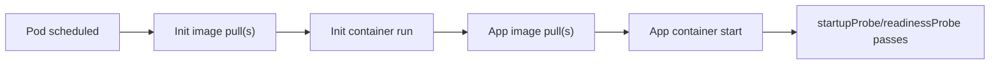

# GKE Pod Image Pull Time Exploration

## 1. Goal and Constraints

- Goal: measure how long image pulling really takes during a GKE deployment.
- Scope: include both `initContainers` images and normal `containers` images.
- Primary concern: image pull start time, end time, and a Pod-level total view.
- Constraint: prefer a method you can run from `kubectl` first, without SSHing into every node.

Problem type: `performance` and `deployment`

Complexity: `Moderate`

## 2. Recommended Architecture (V1)

### Recommendation

Use **Pod events** as the first implementation.

Reason:

1. kubelet emits `Pulling` / `Pulled` events for Pod image operations.
2. it works for both init container images and app container images.
3. it does not require direct node access.
4. it is the fastest way to get a production-usable answer in GKE.

### What to measure

You should collect two numbers:

1. **Per-image duration**
   Meaning: how long one image pull took according to kubelet events.
2. **Wall-clock pull window**
   Meaning: earliest image pull start to latest image pull end for the Pod.

The second number is usually more useful for deployment impact.

### Traffic-style model for startup delay



Important:

- init containers run before app containers.
- image cache can make a later pull appear very fast or invisible.
- total deployment delay is not always equal to sum of each image duration.

## 3. Trade-offs and Alternatives

### Option A: Pod events

Best first choice.

Pros:

- no node SSH
- easy to automate
- works in normal GKE RBAC with `kubectl get pod` and `kubectl get events`
- can be tied directly to one Pod

Cons:

- event timestamps are operationally useful, but not perfect for byte-level registry transfer timing
- old events may expire
- cached images may produce `already present on machine` or near-zero pull time

### Option B: Node-level kubelet/container runtime logs

More accurate if you need deep diagnosis.

Pros:

- closer to the real runtime behavior
- useful when events are missing

Cons:

- operationally heavier in GKE
- harder to automate cluster-wide
- not a good V1 unless event-based measurement is insufficient

### Option C: Continuous observability

Use logs-based metrics or periodic collection if you want long-term trend data.

Pros:

- good for regression tracking across releases
- suitable for platform-level reporting

Cons:

- more setup
- not necessary for initial diagnosis

## 4. Implementation Steps

### V1 design

The recommended script flow is:

1. get Pod JSON
2. list all init and app images
3. fetch Pod events
4. extract `Pulling`, `Pulled`, and `Failed`
5. compute per-image start/end/duration
6. compute Pod-level wall-clock pull window

### Script

Reference script style: [verify_pod_measure_startup_fixed_en.sh](/Users/lex/git/knowledge/k8s/custom-liveness/explore-startprobe/verify_pod_measure_startup_fixed_en.sh)

Generated script: [verify_pod_image_pull_time.sh](/Users/lex/git/knowledge/k8s/custom-liveness/explore-startprobe/verify_pod_image_pull_time.sh)

```bash
#!/bin/bash

set -euo pipefail

GREEN='\033[0;32m'
BLUE='\033[0;34m'
YELLOW='\033[1;33m'
RED='\033[0;31m'
NC='\033[0m'

usage() {
    echo "Usage: $0 -n <namespace> <pod-name>"
    echo "Example: $0 -n default my-api-pod-abc123"
}

to_epoch() {
    local ts="$1"
    if [[ -z "${ts}" || "${ts}" == "null" ]]; then
        echo ""
        return 0
    fi

    if [[ "$OSTYPE" == "darwin"* ]]; then
        date -j -f "%Y-%m-%dT%H:%M:%SZ" "$ts" "+%s" 2>/dev/null || true
    else
        date -d "$ts" "+%s" 2>/dev/null || true
    fi
}

pick_event_time() {
    jq -r '(.eventTime // .lastTimestamp // .firstTimestamp // .metadata.creationTimestamp // "")'
}

extract_reported_duration_seconds() {
    local message="$1"
    MESSAGE="$message" python3 - <<'PY'
import os
import re

msg = os.environ.get("MESSAGE", "")
patterns = [
    r'in ([0-9]+(?:\.[0-9]+)?)s',
    r'in ([0-9]+(?:\.[0-9]+)?)ms',
]

for pattern in patterns:
    match = re.search(pattern, msg)
    if not match:
        continue
    value = float(match.group(1))
    if pattern.endswith('ms'):
        value /= 1000.0
    print(f"{value:.3f}")
    raise SystemExit(0)

print("")
PY
}

if [[ $# -lt 3 ]]; then
    usage
    exit 1
fi

while getopts "n:" opt; do
    case "$opt" in
        n) NAMESPACE="$OPTARG" ;;
        *) usage; exit 1 ;;
    esac
done
shift $((OPTIND-1))

POD_NAME="${1:-}"
if [[ -z "${NAMESPACE:-}" || -z "${POD_NAME}" ]]; then
    usage
    exit 1
fi

if ! command -v kubectl >/dev/null 2>&1; then
    echo "kubectl is required" >&2
    exit 1
fi

if ! command -v jq >/dev/null 2>&1; then
    echo "jq is required" >&2
    exit 1
fi

echo -e "${BLUE}━━━━━━━━━━━━━━━━━━━━━━━━━━━━━━━━━━━━━━━━${NC}"
echo -e "${BLUE}Pod Image Pull Analysis: ${POD_NAME} (Namespace: ${NAMESPACE})${NC}"
echo -e "${BLUE}━━━━━━━━━━━━━━━━━━━━━━━━━━━━━━━━━━━━━━━━${NC}\n"

POD_JSON="$(kubectl get pod "${POD_NAME}" -n "${NAMESPACE}" -o json 2>/dev/null)" || {
    echo -e "${RED}❌ Error: Pod not found or kubectl access failed${NC}"
    exit 1
}

POD_UID="$(echo "$POD_JSON" | jq -r '.metadata.uid')"
NODE_NAME="$(echo "$POD_JSON" | jq -r '.spec.nodeName // "N/A"')"
POD_START_TIME="$(echo "$POD_JSON" | jq -r '.status.startTime // "N/A"')"

echo -e "${GREEN}Pod UID:${NC} ${POD_UID}"
echo -e "${GREEN}Node Name:${NC} ${NODE_NAME}"
echo -e "${GREEN}Pod Start Time:${NC} ${POD_START_TIME}"

echo -e "\n${YELLOW}📋 Step 1: Container/Image Inventory${NC}"
echo "$POD_JSON" | jq -r '
  [
    (.spec.initContainers[]? | {
      type: "init",
      name: .name,
      image: .image,
      imagePullPolicy: (.imagePullPolicy // "IfNotPresent")
    }),
    (.spec.containers[]? | {
      type: "app",
      name: .name,
      image: .image,
      imagePullPolicy: (.imagePullPolicy // "IfNotPresent")
    })
  ]
  | flatten
  | (["TYPE","CONTAINER","PULL_POLICY","IMAGE"] | @tsv),
    (.[] | [.type, .name, .imagePullPolicy, .image] | @tsv)
' | awk 'BEGIN { FS="\t"; OFS="\t" } { print }'

EVENTS_JSON="$(kubectl get events -n "${NAMESPACE}" -o json 2>/dev/null)"
PULL_EVENTS="$(echo "$EVENTS_JSON" | jq --arg pod_uid "$POD_UID" '
  [
    .items[]
    | select(.involvedObject.uid == $pod_uid)
    | select(.reason == "Pulling" or .reason == "Pulled" or .reason == "Failed")
    | {
        reason: .reason,
        message: (.message // ""),
        time: (.eventTime // .lastTimestamp // .firstTimestamp // .metadata.creationTimestamp // "")
      }
  ]
  | sort_by(.time)
')"

PULL_EVENT_COUNT="$(echo "$PULL_EVENTS" | jq 'length')"
if [[ "$PULL_EVENT_COUNT" -eq 0 ]]; then
    echo -e "\n${RED}❌ No Pulling/Pulled events found for this Pod${NC}"
    exit 1
fi

echo -e "\n${YELLOW}📋 Step 2: Image Pull Events${NC}"
echo "$PULL_EVENTS" | jq -r '.[] | [.time, .reason, .message] | @tsv' | while IFS=$'\t' read -r event_time reason message; do
    echo "  ${event_time} [${reason}] ${message}"
done

declare -A IMAGE_START_TS
declare -A IMAGE_END_TS
declare -A IMAGE_STATUS
declare -A IMAGE_DURATION_FROM_MESSAGE

while IFS= read -r row; do
    reason="$(echo "$row" | jq -r '.reason')"
    message="$(echo "$row" | jq -r '.message')"
    event_time="$(echo "$row" | pick_event_time)"
    image="$(echo "$message" | sed -n 's/.*image "\(.*\)".*/\1/p' | head -1)"

    if [[ -z "$image" ]]; then
        continue
    fi

    if [[ "$reason" == "Pulling" && -z "${IMAGE_START_TS[$image]:-}" ]]; then
        IMAGE_START_TS["$image"]="$event_time"
        IMAGE_STATUS["$image"]="pulling"
    fi

    if [[ "$reason" == "Pulled" ]]; then
        IMAGE_END_TS["$image"]="$event_time"
        IMAGE_STATUS["$image"]="pulled"
        duration_from_message="$(extract_reported_duration_seconds "$message")"
        if [[ -n "$duration_from_message" ]]; then
            IMAGE_DURATION_FROM_MESSAGE["$image"]="$duration_from_message"
        fi
        if echo "$message" | grep -qi "already present on machine"; then
            IMAGE_STATUS["$image"]="cached"
        fi
    fi

    if [[ "$reason" == "Failed" ]]; then
        IMAGE_END_TS["$image"]="$event_time"
        IMAGE_STATUS["$image"]="failed"
    fi
done < <(echo "$PULL_EVENTS" | jq -c '.[]')

echo -e "\n${YELLOW}📊 Step 3: Per-Image Pull Duration${NC}"
printf "%-8s %-22s %-22s %-12s %-10s %s\n" "TYPE" "START" "END" "DURATION(s)" "STATUS" "IMAGE"

EARLIEST_PULL=""
LATEST_PULL=""
SUM_SECONDS="0"

while IFS=$'\t' read -r type container_name image image_pull_policy; do
    start_ts="${IMAGE_START_TS[$image]:-}"
    end_ts="${IMAGE_END_TS[$image]:-}"
    status="${IMAGE_STATUS[$image]:-unknown}"
    duration="${IMAGE_DURATION_FROM_MESSAGE[$image]:-}"

    if [[ -z "$duration" && -n "$start_ts" && -n "$end_ts" ]]; then
        start_epoch="$(to_epoch "$start_ts")"
        end_epoch="$(to_epoch "$end_ts")"
        if [[ -n "$start_epoch" && -n "$end_epoch" ]]; then
            duration="$((end_epoch - start_epoch))"
        fi
    fi

    if [[ -z "$duration" && "$status" == "cached" ]]; then
        duration="0"
    fi

    if [[ -n "$start_ts" ]]; then
        if [[ -z "$EARLIEST_PULL" || "$(to_epoch "$start_ts")" -lt "$(to_epoch "$EARLIEST_PULL")" ]]; then
            EARLIEST_PULL="$start_ts"
        fi
    fi

    if [[ -n "$end_ts" ]]; then
        if [[ -z "$LATEST_PULL" || "$(to_epoch "$end_ts")" -gt "$(to_epoch "$LATEST_PULL")" ]]; then
            LATEST_PULL="$end_ts"
        fi
    fi

    if [[ -n "$duration" && "$duration" != "null" ]]; then
        SUM_SECONDS="$(awk "BEGIN {print ${SUM_SECONDS} + ${duration}}")"
    fi

    printf "%-8s %-22s %-22s %-12s %-10s %s\n" \
        "$type" \
        "${start_ts:-N/A}" \
        "${end_ts:-N/A}" \
        "${duration:-N/A}" \
        "$status" \
        "$image"
done < <(echo "$POD_JSON" | jq -r '
  (.spec.initContainers[]? | ["init", .name, .image, (.imagePullPolicy // "IfNotPresent")] | @tsv),
  (.spec.containers[]? | ["app", .name, .image, (.imagePullPolicy // "IfNotPresent")] | @tsv)
')

echo -e "\n${YELLOW}📦 Step 4: Aggregated View${NC}"
echo -e "${GREEN}Sum of per-image durations:${NC} ${SUM_SECONDS} seconds"

if [[ -n "$EARLIEST_PULL" && -n "$LATEST_PULL" ]]; then
    earliest_epoch="$(to_epoch "$EARLIEST_PULL")"
    latest_epoch="$(to_epoch "$LATEST_PULL")"
    if [[ -n "$earliest_epoch" && -n "$latest_epoch" ]]; then
        wall_clock="$((latest_epoch - earliest_epoch))"
        echo -e "${GREEN}Wall-clock pull window:${NC} ${wall_clock} seconds"
        echo -e "${GREEN}Earliest pull event:${NC} ${EARLIEST_PULL}"
        echo -e "${GREEN}Latest pull event:${NC} ${LATEST_PULL}"
    fi
fi

echo -e "\n${YELLOW}🧠 Interpretation${NC}"
echo "  - Sum of per-image durations can overcount if multiple image pulls overlap."
echo "  - Wall-clock pull window is usually closer to the Pod-level deployment delay."
echo "  - If an image is already cached on the node, observed duration may be 0 or there may be no pull event."
echo "  - If the same image is used by multiple containers, the node usually pulls it once and reuses the cache."
```

### How to run

```bash
cd /Users/lex/git/knowledge/k8s/custom-liveness/explore-startprobe
chmod +x ./verify_pod_image_pull_time.sh
./verify_pod_image_pull_time.sh -n <namespace> <pod-name>
```

### Example output interpretation

If you see:

```text
init     2026-03-07T10:00:01Z  2026-03-07T10:00:09Z  8     pulled   gcr.io/x/init:v1
app      2026-03-07T10:00:10Z  2026-03-07T10:00:28Z  18    pulled   gcr.io/x/app:v9
```

Then:

- init image pull took about 8 seconds
- app image pull took about 18 seconds
- image-related Pod startup delay was at least about 27 seconds wall-clock

## 5. Validation and Rollback

### How to validate the numbers

Use this sequence:

1. deploy with a **new image digest/tag**
2. run the script immediately after Pod scheduling
3. compare output with:
   - `kubectl describe pod <pod>`
   - `kubectl get events -n <ns> --sort-by=.lastTimestamp`

### How to get a real cold-pull number

If you want the **true uncached pull time**, do not test on a node that already has the image.

Better approaches:

1. deploy to a fresh node pool
2. deploy to newly created nodes after scale-out
3. use a brand-new image digest

Avoid manually clearing image cache on production nodes.

### What can make the number look smaller than reality

- image already cached on the node
- same layers already cached from another image
- event retention window expired
- multiple pulls overlapped

## 6. Reliability and Cost Optimizations

### Immediate improvements

- keep Artifact Registry in the same region as the GKE cluster
- reduce image size and layer count
- split heavy build tools out of the runtime image
- keep init images minimal because they block the whole Pod startup chain

### Structural improvements

- warm nodes with a small DaemonSet if a release uses a large common base image
- separate latency-sensitive workloads onto a node pool with predictable cache behavior
- track pull time over multiple rollouts, not from one Pod only

### Long-term improvements

- build a periodic job that measures representative Pod pull time after each release
- export the result into Cloud Monitoring or your release report
- correlate image pull time with node pool, image digest, and registry region

## 7. Handoff Checklist

- confirm Pod has both init and app images if you need both measured
- run the script on a newly created rollout Pod, not an old stable Pod
- note whether the node is fresh or warm
- compare per-image duration and wall-clock window
- record image digest, node name, and rollout timestamp

## Recommendation Summary

The best deployable V1 is:

1. start with Pod event-based measurement
2. use a fresh node or fresh image digest to avoid cache distortion
3. use **wall-clock pull window** as the main rollout-impact number
4. only go to node-level runtime logs if Pod events are insufficient

## References

- [Kubernetes Init Containers](https://kubernetes.io/docs/concepts/workloads/pods/init-containers/)
- [Kubernetes Images](https://kubernetes.io/docs/concepts/containers/images/)
- [GKE Troubleshoot Image Pulls](https://cloud.google.com/kubernetes-engine/docs/troubleshooting/image-pulls)
