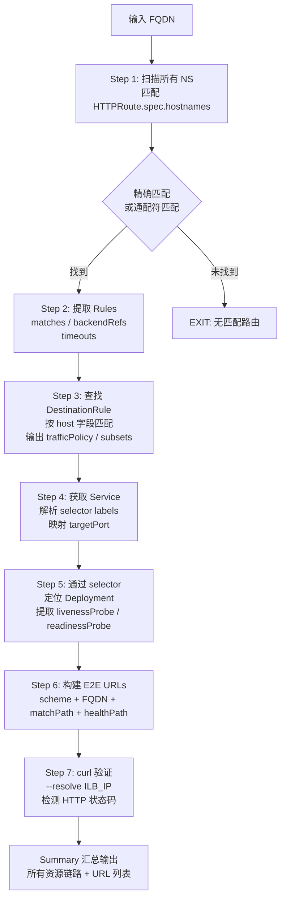

- [chatgpt](#chatgpt)
- [K8s Gateway E2E Verification \& Monitoring](#k8s-gateway-e2e-verification--monitoring)
  - [Files](#files)
  - [Quick Start](#quick-start)
  - [All-in-one (requires env vars)](#all-in-one-requires-env-vars)
  - [Architecture Reference](#architecture-reference)
  - [Expected Results](#expected-results)
- [minimax Verify gateway](#minimax-verify-gateway)
- [Gemini](#gemini)
  - [🚀 `k8s-gateway-fqdn-gemini.sh` 脚本核心能力说明](#-k8s-gateway-fqdn-geminish-脚本核心能力说明)
    - [🌟 亮点与设计改进](#-亮点与设计改进)
    - [📖 使用指南](#-使用指南)
    - [📋 勘测链路输出预览：](#-勘测链路输出预览)
- [claude](#claude)
  - [使用方法](#使用方法)
  - [脚本逻辑流程](#脚本逻辑流程)
  - [关键设计点](#关键设计点)

# chatgpt

[cloud/k8s/k8s-gateway/k8s-gateway-e2e/k8s-gateway-fqdn-chatgpt.sh](/Users/lex/git/knowledge/cloud/k8s/k8s-gateway/k8s-gateway-e2e/k8s-gateway-fqdn-chatgpt.sh)

It will take an input FQDN, discover matching `HTTPRoute`, print Gateway listener context, then walk `backendRefs -> DestinationRule -> Service -> Deployment`, extract HTTP readiness/liveness/startup probe paths, and generate complete E2E URLs plus ready-to-run `curl --resolve` commands.

Usage:

```bash
/Users/lex/git/knowledge/cloud/k8s/k8s-gateway/k8s-gateway-e2e/k8s-gateway-fqdn-chatgpt.sh my-input-fqdn
/Users/lex/git/knowledge/cloud/k8s/k8s-gateway/k8s-gateway-e2e/k8s-gateway-fqdn-chatgpt.sh my-input-fqdn tenant-namespace
/Users/lex/git/knowledge/cloud/k8s/k8s-gateway/k8s-gateway-e2e/k8s-gateway-fqdn-chatgpt.sh my-input-fqdn tenant-namespace --validate
```

Verified: script is executable, `bash -n` passes, usage output works, and the no-cluster failure path exits cleanly. I did not run it against a live cluster from here.

# K8s Gateway E2E Verification & Monitoring

## Files

| File | Purpose |
|------|---------|
| `K8S-GATEWAY-E2E-VERIFY-MONITOR-PLAN.md` | Full plan with all phases, checklists, pitfalls |
| `k8s-gateway-verify.sh` | Executable verification suite — run from infra jump host |
| `alerts-k8s-gateway.yaml` | Prometheus alerting rules for Gateway + Kong DP |

## Quick Start

```bash
cd /Users/lex/git/knowledge/cloud/k8s/k8s-gateway/k8s-gateway-e2e

# Phase 0: Pre-flight (run first — no args needed)
./k8s-gateway-verify.sh preflight

# Phase 1: Control plane binding (need tenant ns)
./k8s-gateway-verify.sh binding <tenant-namespace>

# Phase 2: Traffic flows (need tenant ns + ILB IP)
./k8s-gateway-verify.sh flow1 <tenant-namespace> <ILB_IP>
./k8s-gateway-verify.sh flow2 <tenant-namespace> <ILB_IP>
./k8s-gateway-verify.sh health

# Phase 3: NetworkPolicy isolation
./k8s-gateway-verify.sh netpol <tenant-namespace>

# Phase 4: Timeout & resilience
./k8s-gateway-verify.sh timeout <tenant-namespace>

# Phase 5: Monitoring baseline
./k8s-gateway-verify.sh monitoring

# Deploy alert rules
kubectl apply -f alerts-k8s-gateway.yaml -n monitoring
```

## All-in-one (requires env vars)

```bash
TENANT_NS=<tenant> ILB_IP=<lb-ip> ./k8s-gateway-verify.sh preflight
TENANT_NS=<tenant> ILB_IP=<lb-ip> ./k8s-gateway-verify.sh binding
TENANT_NS=<tenant> ILB_IP=<lb-ip> ./k8s-gateway-verify.sh flow1
```

## Architecture Reference

Reference docs: `/Users/lex/git/knowledge/cloud/k8s/k8s-gateway/`
- `k8s-gateway-api-report.md` — Gateway API role model + security
- `k8s-gateway-netpol.md` — NetworkPolicy isolation guide
- `k8s-gateway-timeout.md` — HTTPRoute + DestinationRule timeout config

## Expected Results

After running all phases, all checks should show `[PASS]`. Any `[FAIL]` indicates a misconfiguration — refer to the **Known Issues & Pitfalls** section in the plan doc.

# minimax Verify gateway 
脚本已生成：`/Users/lex/git/knowledge/cloud/k8s/k8s-gateway/k8s-gateway-e2e/k8s-gateway-fqdn.sh`

**功能链路（输入 FQDN → 输出完整 URL）：**

```
INPUT_FQDN
    ↓
┌─────────────────────────────────────────┐
│ STEP 1: HTTPRoute Discovery            │
│  • 从 tenant namespace 扫描所有 HTTPRoute
│  • 用 hostname match 过滤出匹配的 route   │
│  • 自动从 FQDN 提取 tenant namespace    │
└─────────────────────────────────────────┘
    ↓
┌─────────────────────────────────────────┐
│ STEP 2: HTTPRoute Detail               │
│  • hostnames / parentRefs / rules       │
│  • matches (headers, path)             │
│  • backendRefs (svc + port + weight)    │
└─────────────────────────────────────────┘
    ↓
┌─────────────────────────────────────────┐
│ STEP 3: Backend Chain                  │
│  Service → Deployment                  │
│  • apigateway annotation (KONG/NONE)   │
│  • DestinationRule timeout             │
│  • readinessProbe/livenessProbe path   │
└─────────────────────────────────────────┘
    ↓
┌─────────────────────────────────────────┐
│ STEP 4: HTTPRoute Timeout Config        │
│  • .spec.rules[].timeouts.request      │
│  • .spec.rules[].timeouts.backendTimeout│
└─────────────────────────────────────────┘
    ↓
┌─────────────────────────────────────────┐
│ STEP 5: Envoy Cluster Config            │
│  • Gateway pod config_dump 查询         │
│  • cluster connect_timeout             │
└─────────────────────────────────────────┘
    ↓
┌─────────────────────────────────────────┐
│ STEP 6: Summary + Ready-to-use curl URLs│
│  • Flow-1 Direct: https://{FQDN}/health│
│  • Flow-2 Kong:   https://{FQDN}/api/*  │
│  • ILB Alt: https://{ILB_IP}/path       │
│    (Host: {FQDN} header)                │
└─────────────────────────────────────────┘
```

**用法：**
```bash
# 自动检测 tenant namespace
./k8s-gateway-fqdn.sh api.teamname-int.uk.aibang.local

# 手动指定 namespace
./k8s-gateway-fqdn.sh api.teamname-int.uk.aibang.local teamname-int
```

**输出示例（含资源链路 + 可执行 curl 命令）：**
```
## STEP 3 — Backend Chain (HTTPRoute → Service → Deployment)
  Service: api-teamname-svc:8080
    ClusterIP   : 10.60.88.123
    apigateway  : NONE
    Mode        : direct (no Kong)
  Deployment   : api-teamname-deploy
    Health probe: /healthz
    Readiness  : /ready

## STEP 6 — Complete E2E Test URLs Summary
  Ready-to-use curl commands:
    curl -k --max-time 10 -H "Host: api.teamname-int.uk.aibang.local" "https://35.191.x.x/healthz"
    curl -k --max-time 10 "https://api.teamname-int.uk.aibang.local/healthz"
```


# Gemini

Listed directory k8s-gateway-e2e
Viewed k8s-gateway-verify.sh:1-315
Viewed k8s-gateway-fqdn.sh:1-427
Edited k8s-gateway-fqdn-gemini.sh
Ran command: `chmod +x /Users/lex/git/knowledge/cloud/k8s/k8s-gateway/k8s-gateway-e2e/k8s-gateway-fqdn-gemini.sh && bash -n /Users/lex/git/knowledge/cloud/k8s/k8s-gateway/k8s-gateway-e2e/k8s-gateway-fqdn-gemini.sh && echo "脚本语法校验成功！"`

语法校验已通过！✅ 脚本已被安全创建在您的工作目录：

```
/Users/lex/git/knowledge/cloud/k8s/k8s-gateway/k8s-gateway-e2e/k8s-gateway-fqdn-gemini.sh
```

---

## 🚀 `k8s-gateway-fqdn-gemini.sh` 脚本核心能力说明

此脚本在您之前的 `k8s-gateway-fqdn.sh` 的基础上进行了**全方位的智能化增强**，专门服务于您的 **E2E 路由端到端测试**：

### 🌟 亮点与设计改进

1. **全集群智能拓扑扫描 (不依赖硬编码解析)**：
   * 之前的脚本强依赖 `api.teamname-int...` 这种第二位是命名空间的 FQDN 硬编码解析（如果 FQDN 不符格式就会提取出错误的命名空间并中断退出）。
   * **Gemini 增强版**：在不提供 `TENANT_NAMESPACE` 参数时，脚本将**智能检索全集群路由表**，通过 `jq` 支持**精确域名**与**通配符域名**（例如 `*.example.com`）的高级算法过滤，秒级自动抓取出绑定的 `HTTPRoute` 及其所属的 `Namespace`。

2. **从 L7 路由规则深入 L4 连接池 (Complete Resource Chain)**：
   * 深度解析 `HTTPRoute` 的 matches、rules、backendRefs。
   * **智能匹配 DestinationRule**：通过 `jq` 自动将 Service 名字与命名空间全限定名进行关联匹配，获取具体的 TCP `connectTimeout` 与 HTTP `idleTimeout` 连接池参数，完美配合您的超时测试。
   * **溯源 Deployment 并抓取探针 (Probes)**：通过 Service 标签选择器 (Selector) 高效定位绑定的活动 Pod 工作负载所有者，完美提取出 Readiness / Liveness 容器探针的绝对路径。

3. **测试终结点 URL 智能拼装与去重**：
   * 脚本会自动提取 HTTPRoute rules 下的具体匹配规则（如 `/api/v1/health`）。
   * 如果路由仅匹配了 `/` 根路径，脚本会自动将其与 Deployment spec 提取到的真实健康检查地址（如 `/healthz`）进行智能融合；若规则已是 API 专属匹配路径，则保留该匹配接口，最终智能构建出可运行的绝对地址并进行全局去重。

4. **专业级 E2E `curl` 验证命令（SNI 级 --resolve 优化）**：
   * 自动获取 Ingress Gateway 所在的外部 LB 物理 IP。
   * 在生成 `curl` 测试指令时，不仅提供普通的域名调用，还额外自动拼装并提供 **专业级带有 `--resolve` 的 IP SNI 直通测试指令**：
     ```bash
     curl -k -v --max-time 10 --resolve "api.teamname.local:443:10.x.x.x" "https://api.teamname.local/api/v1/health"
     ```
     > **💡 避坑原理**：在多租户 `ListenerSet` 架构下，网关在 TLS 握手阶段依靠 SNI (Server Name Indication) 头做路由转发。直接使用 `https://<IP>/health` 并携带 `-H "Host: ..."` 头在 HTTPS 握手时会由于 SNI 为 IP 地址而**报错失败**。使用 `--resolve` 是最符合生产级 E2E 测试的方法！

---

### 📖 使用指南

您可以非常轻松地在命令行直接启动：

```bash
# 场景 A: 仅传入域名，脚本全集群智能抓取该域名绑定的 HTTPRoute、DR、Svc 及 Deployment 链路
./k8s-gateway-fqdn-gemini.sh api.team1-int.uk.aibang.local

# 场景 B: 显式指定命名空间，加快检索速度
./k8s-gateway-fqdn-gemini.sh app.team2.example.com team2
```

### 📋 勘测链路输出预览：

```
[INFO]  获取 Ingress Gateway 的外部 IP (命名空间: infrastructure)...
[OK]    定位到网关 LB IP: 10.200.0.100
[INFO]  正在搜索绑定了域名 'api.team1-int.uk.aibang.local' 的 HTTPRoute...
[OK]    智能定位成功！
  └─ HTTPRoute:    team1-app-route
  └─ Namespace:    team1

# 1. 路由解析 (HTTPRoute Rules & BackendRefs)
  绑定网关入口 (ParentRefs):
    - ListenerSet: team1/team1-listeners (Port: https)
  ────────────────────────────────────────────────────────────────────────────────
  ⚡ 路由规则 #1
  匹配路径 (Matches):
    - 类型: PathPrefix | 路径: /api/v1
  规则级超时 (Timeouts):
    - 客户端总请求超时: 3s
    - 单次后端建连超时: 1.5s
  后端引用 (BackendRefs):
    - 服务名: team1-api-service | 端口: 8080 | 权重: 100%
      └─ 链路探测:
        Service 类型:    ClusterIP | 标签选择器: app=team1-api-service
        API 网关架构:    NONE
        DestinationRule: team1-api-dr (TCP建连超时: 1s | 空闲连接超时: 60s)
        关联 Deployment:  team1-api-deployment
        Readiness Probe: /healthz
        Liveness Probe:  /healthz

# 2. E2E 测试命令生成汇总 (Ready-to-use curl Commands)
  以下为基于域名链路逆向推导出的 E2E 智能测试 URL 列表：

  🔗 测试终结点: https://api.team1-int.uk.aibang.local/api/v1
    👉 方法 A (本地 DNS/Hosts 已就绪时使用):
    curl -k -v --max-time 10 "https://api.team1-int.uk.aibang.local/api/v1"
    👉 方法 B (专业网关 SNI 直通测试 - 自动绑定 IP & 绕过 DNS 缓存):
    curl -k -v --max-time 10 --resolve "api.team1-int.uk.aibang.local:443:10.200.0.100" "https://api.team1-int.uk.aibang.local/api/v1"
```


# claude 
以下是完整脚本：

```bash
#!/usr/bin/env bash
# k8s-gateway-fqdn-claude.sh
# Usage: ./k8s-gateway-fqdn-claude.sh <fqdn>
# 根据输入 FQDN 追踪: HTTPRoute -> DestinationRule -> Service -> Deployment -> Health URL
#
# Example: ./k8s-gateway-fqdn-claude.sh app.team-a.example.com

set -euo pipefail

FQDN="${1:-}"
[[ -z "$FQDN" ]] && { echo "Usage: $0 <fqdn>"; exit 1; }

# ── Colors & helpers ──────────────────────────────────────────────────────────
RED='\033[0;31m'; GREEN='\033[0;32m'; YELLOW='\033[1;33m'; CYAN='\033[0;36m'; BOLD='\033[1m'; NC='\033[0m'
PASS()  { echo -e "${GREEN}[PASS]${NC} $1"; }
FAIL()  { echo -e "${RED}[FAIL]${NC} $1"; }
WARN()  { echo -e "${YELLOW}[WARN]${NC} $1"; }
INFO()  { echo -e "${CYAN}${BOLD}>>> $1${NC}"; }
SEP()   { echo -e "${BOLD}───────────────────────────────────────────────────${NC}"; }

banner(){
  echo ""
  echo -e "${BOLD}═══════════════════════════════════════════════════${NC}"
  echo -e "${BOLD}  FQDN Tracer: ${CYAN}${FQDN}${NC}"
  echo -e "${BOLD}═══════════════════════════════════════════════════${NC}"
  echo ""
}

# ── Global state (populated as we trace) ─────────────────────────────────────
declare -a CANDIDATE_URLS=()
ROUTE_NS=""
ROUTE_NAME=""
BACKEND_SVC=""
BACKEND_PORT=""
BACKEND_NS=""
DR_NAME=""
SVC_PORT=""
DEPLOY_NAME=""
HEALTH_PATH="/health"
LIVENESS_PATH=""

# ── Step 1: Find HTTPRoute matching FQDN ─────────────────────────────────────
step_httproute(){
  SEP
  INFO "Step 1: Locate HTTPRoute matching hostname: ${FQDN}"
  SEP

  # Scan all namespaces for HTTPRoute whose spec.hostnames contains FQDN
  local found=false
  while IFS= read -r line; do
    local ns name hostnames
    ns=$(echo "$line" | awk '{print $1}')
    name=$(echo "$line" | awk '{print $2}')
    # Get hostnames array for this route
    hostnames=$(kubectl get httproute "$name" -n "$ns" \
      -o jsonpath='{range .spec.hostnames[*]}{@}{"\n"}{end}' 2>/dev/null)

    # Match exact or wildcard
    while IFS= read -r h; do
      # Exact match
      if [[ "$h" == "$FQDN" ]]; then
        PASS "HTTPRoute match [exact]: $ns/$name  hostname=$h"
        ROUTE_NS="$ns"; ROUTE_NAME="$name"; found=true; break 2
      fi
      # Wildcard match: *.foo.example.com vs bar.foo.example.com
      if [[ "$h" == \** ]]; then
        local pattern="${h#\*.}"
        local fqdn_suffix="${FQDN#*.}"
        if [[ "$fqdn_suffix" == "$pattern" ]]; then
          PASS "HTTPRoute match [wildcard]: $ns/$name  hostname=$h"
          ROUTE_NS="$ns"; ROUTE_NAME="$name"; found=true; break 2
        fi
      fi
    done <<< "$hostnames"
  done < <(kubectl get httproute --all-namespaces --no-headers \
             -o custom-columns='NS:.metadata.namespace,NAME:.metadata.name' 2>/dev/null)

  if ! $found; then
    FAIL "No HTTPRoute found matching FQDN: ${FQDN}"
    exit 1
  fi
}

# ── Step 2: Extract rules / matches / backendRefs ────────────────────────────
step_routes(){
  SEP
  INFO "Step 2: Extract Rules, Matches, BackendRefs from $ROUTE_NS/$ROUTE_NAME"
  SEP

  echo ""
  echo -e "${BOLD}[HTTPRoute] ${ROUTE_NS}/${ROUTE_NAME}${NC}"
  echo ""

  # Print all listeners / parent refs
  echo "Parent Refs:"
  kubectl get httproute "$ROUTE_NAME" -n "$ROUTE_NS" \
    -o jsonpath='{range .spec.parentRefs[*]}  - {.name}/{.sectionName} (ns:{.namespace}){"\n"}{end}' 2>/dev/null
  echo ""

  # Rules: for each rule print matches + backendRefs
  local rule_count
  rule_count=$(kubectl get httproute "$ROUTE_NAME" -n "$ROUTE_NS" \
    -o jsonpath='{range .spec.rules[*]}{@}{"\n"}{end}' 2>/dev/null | wc -l | tr -d ' ')
  echo "Rules count: $rule_count"
  echo ""

  # Collect all backendRef svc+port (pick first match for tracing)
  local idx=0
  while true; do
    local svc port bns
    svc=$(kubectl get httproute "$ROUTE_NAME" -n "$ROUTE_NS" \
      -o jsonpath="{.spec.rules[$idx].backendRefs[0].name}" 2>/dev/null) || break
    [[ -z "$svc" ]] && break

    port=$(kubectl get httproute "$ROUTE_NAME" -n "$ROUTE_NS" \
      -o jsonpath="{.spec.rules[$idx].backendRefs[0].port}" 2>/dev/null)
    bns=$(kubectl get httproute "$ROUTE_NAME" -n "$ROUTE_NS" \
      -o jsonpath="{.spec.rules[$idx].backendRefs[0].namespace}" 2>/dev/null)
    [[ -z "$bns" ]] && bns="$ROUTE_NS"  # default to same namespace

    # Matches for this rule
    local match_paths match_headers
    match_paths=$(kubectl get httproute "$ROUTE_NAME" -n "$ROUTE_NS" \
      -o jsonpath="{range .spec.rules[$idx].matches[*]}{.path.type}:{.path.value}{'  '}{end}" 2>/dev/null)
    match_headers=$(kubectl get httproute "$ROUTE_NAME" -n "$ROUTE_NS" \
      -o jsonpath="{range .spec.rules[$idx].matches[*]}{range .headers[*]}{.name}={.value}{'  '}{end}{end}" 2>/dev/null)

    # Timeouts
    local t_req t_be
    t_req=$(kubectl get httproute "$ROUTE_NAME" -n "$ROUTE_NS" \
      -o jsonpath="{.spec.rules[$idx].timeouts.request}" 2>/dev/null)
    t_be=$(kubectl get httproute "$ROUTE_NAME" -n "$ROUTE_NS" \
      -o jsonpath="{.spec.rules[$idx].timeouts.backendRequest}" 2>/dev/null)

    echo "  Rule[$idx]:"
    echo "    backendRef : $bns/$svc:$port"
    [[ -n "$match_paths"   ]] && echo "    path match : $match_paths"
    [[ -n "$match_headers" ]] && echo "    hdr match  : $match_headers"
    [[ -n "$t_req"         ]] && echo "    timeout    : request=$t_req backendRequest=$t_be"

    # Capture first rule for downstream tracing
    if [[ $idx -eq 0 ]]; then
      BACKEND_SVC="$svc"
      BACKEND_PORT="$port"
      BACKEND_NS="$bns"
    fi

    (( idx++ )) || true
  done

  echo ""
  PASS "Primary backendRef: ${BACKEND_NS}/${BACKEND_SVC}:${BACKEND_PORT}"
}

# ── Step 3: DestinationRule ───────────────────────────────────────────────────
step_dr(){
  SEP
  INFO "Step 3: DestinationRule for service: ${BACKEND_SVC} in ${BACKEND_NS}"
  SEP

  # Search by host field (short name or FQDN)
  DR_NAME=$(kubectl get destinationrule -n "$BACKEND_NS" \
    -o jsonpath="{range .items[?(@.spec.host=='${BACKEND_SVC}')]}{.metadata.name}{'\n'}{end}" 2>/dev/null | head -1)

  if [[ -z "$DR_NAME" ]]; then
    # Try full FQDN form
    DR_NAME=$(kubectl get destinationrule -n "$BACKEND_NS" \
      -o jsonpath="{range .items[*]}{.metadata.name}{'\t'}{.spec.host}{'\n'}{end}" 2>/dev/null | \
      awk -v svc="$BACKEND_SVC" '$2 ~ svc {print $1}' | head -1)
  fi

  if [[ -z "$DR_NAME" ]]; then
    WARN "No DestinationRule found for ${BACKEND_SVC} in ${BACKEND_NS} (may be normal for direct container)"
    return 0
  fi

  PASS "DestinationRule: ${BACKEND_NS}/${DR_NAME}"
  echo ""

  # Print key DR fields
  kubectl get destinationrule "$DR_NAME" -n "$BACKEND_NS" \
    -o jsonpath='Host:        {.spec.host}{"\n"}TrafficPolicy:
  ConnectTO:   {.spec.trafficPolicy.connectionPool.tcp.connectTimeout}{"\n"}  ReqTO:       {.spec.trafficPolicy.connectionPool.http.http1MaxPendingRequests}{"\n"}  OutlierDet:  ejectionTime={.spec.trafficPolicy.outlierDetection.baseEjectionTime}  consecutive5xx={.spec.trafficPolicy.outlierDetection.consecutive5xxErrors}{"\n"}' \
    2>/dev/null || true

  echo ""
  # Subsets
  local subset_cnt
  subset_cnt=$(kubectl get destinationrule "$DR_NAME" -n "$BACKEND_NS" \
    -o jsonpath='{range .spec.subsets[*]}{.name}{"\n"}{end}' 2>/dev/null | wc -l | tr -d ' ')
  echo "Subsets: $subset_cnt"
  kubectl get destinationrule "$DR_NAME" -n "$BACKEND_NS" \
    -o jsonpath='{range .spec.subsets[*]}  - {.name}  labels={.labels}{"\n"}{end}' 2>/dev/null || true
}

# ── Step 4: Service ───────────────────────────────────────────────────────────
step_svc(){
  SEP
  INFO "Step 4: Service ${BACKEND_NS}/${BACKEND_SVC}"
  SEP

  if ! kubectl get svc "$BACKEND_SVC" -n "$BACKEND_NS" >/dev/null 2>&1; then
    FAIL "Service ${BACKEND_NS}/${BACKEND_SVC} not found"
    return 1
  fi

  PASS "Service found"
  echo ""
  kubectl get svc "$BACKEND_SVC" -n "$BACKEND_NS" -o wide
  echo ""

  # Capture selector labels for Deployment lookup
  local selector
  selector=$(kubectl get svc "$BACKEND_SVC" -n "$BACKEND_NS" \
    -o jsonpath='{range .spec.selector}{@k}{"\n"}{end}' 2>/dev/null)
  # Better: get selector as label selector string
  selector=$(kubectl get svc "$BACKEND_SVC" -n "$BACKEND_NS" \
    -o json 2>/dev/null | \
    python3 -c "
import sys,json
d=json.load(sys.stdin)
sel=d.get('spec',{}).get('selector',{})
print(','.join(f'{k}={v}' for k,v in sel.items()))
" 2>/dev/null || echo "")

  echo "  Selector labels: $selector"

  # Port mapping: find ClusterIP port and targetPort
  SVC_PORT=$(kubectl get svc "$BACKEND_SVC" -n "$BACKEND_NS" \
    -o jsonpath="{range .spec.ports[?(@.port==${BACKEND_PORT})]}{.targetPort}{end}" 2>/dev/null)
  [[ -z "$SVC_PORT" ]] && SVC_PORT=$(kubectl get svc "$BACKEND_SVC" -n "$BACKEND_NS" \
    -o jsonpath='{.spec.ports[0].targetPort}' 2>/dev/null)

  echo "  TargetPort: $SVC_PORT"
  echo ""

  # Find Deployment via selector
  if [[ -n "$selector" ]]; then
    DEPLOY_NAME=$(kubectl get deploy -n "$BACKEND_NS" \
      -l "$selector" -o jsonpath='{.items[0].metadata.name}' 2>/dev/null || echo "")
  fi
  # Fallback: same name as service
  [[ -z "$DEPLOY_NAME" ]] && DEPLOY_NAME="$BACKEND_SVC"
  PASS "Deployment candidate: ${BACKEND_NS}/${DEPLOY_NAME}"
}

# ── Step 5: Deployment → health/liveness paths ───────────────────────────────
step_deployment(){
  SEP
  INFO "Step 5: Deployment ${BACKEND_NS}/${DEPLOY_NAME}"
  SEP

  if ! kubectl get deploy "$DEPLOY_NAME" -n "$BACKEND_NS" >/dev/null 2>&1; then
    WARN "Deployment ${BACKEND_NS}/${DEPLOY_NAME} not found — trying same name as svc"
    DEPLOY_NAME="$BACKEND_SVC"
    kubectl get deploy "$DEPLOY_NAME" -n "$BACKEND_NS" >/dev/null 2>&1 || {
      FAIL "Deployment not found"; return 1; }
  fi

  PASS "Deployment found"
  echo ""
  kubectl get deploy "$DEPLOY_NAME" -n "$BACKEND_NS" -o wide
  echo ""

  # Extract container port, liveness, readiness paths from first container
  local container_port liveness readiness liveness_scheme readiness_scheme
  container_port=$(kubectl get deploy "$DEPLOY_NAME" -n "$BACKEND_NS" \
    -o jsonpath='{.spec.template.spec.containers[0].ports[0].containerPort}' 2>/dev/null || echo "")

  liveness=$(kubectl get deploy "$DEPLOY_NAME" -n "$BACKEND_NS" \
    -o jsonpath='{.spec.template.spec.containers[0].livenessProbe.httpGet.path}' 2>/dev/null || echo "")
  liveness_scheme=$(kubectl get deploy "$DEPLOY_NAME" -n "$BACKEND_NS" \
    -o jsonpath='{.spec.template.spec.containers[0].livenessProbe.httpGet.scheme}' 2>/dev/null || echo "HTTP")

  readiness=$(kubectl get deploy "$DEPLOY_NAME" -n "$BACKEND_NS" \
    -o jsonpath='{.spec.template.spec.containers[0].readinessProbe.httpGet.path}' 2>/dev/null || echo "")
  readiness_scheme=$(kubectl get deploy "$DEPLOY_NAME" -n "$BACKEND_NS" \
    -o jsonpath='{.spec.template.spec.containers[0].readinessProbe.httpGet.scheme}' 2>/dev/null || echo "HTTP")

  echo "  ContainerPort  : ${container_port:-<not set>}"
  echo "  LivenessProbe  : ${liveness:-<not set>}  (scheme: ${liveness_scheme})"
  echo "  ReadinessProbe : ${readiness:-<not set>}  (scheme: ${readiness_scheme})"
  echo ""

  # Prefer liveness > readiness > default /health
  if [[ -n "$liveness" ]]; then
    HEALTH_PATH="$liveness"
    PASS "Using livenessProbe path: $HEALTH_PATH"
  elif [[ -n "$readiness" ]]; then
    HEALTH_PATH="$readiness"
    PASS "Using readinessProbe path: $HEALTH_PATH"
  else
    WARN "No probe path found, defaulting to: $HEALTH_PATH"
  fi
  LIVENESS_PATH="$liveness"
}

# ── Step 6: Build E2E URLs ────────────────────────────────────────────────────
step_build_urls(){
  SEP
  INFO "Step 6: E2E Test URL Summary"
  SEP

  # Determine scheme from Gateway listener or assume https
  local scheme="https"

  # Get all path matches from HTTPRoute for URL generation
  echo ""
  echo -e "${BOLD}Generated E2E Test URLs:${NC}"
  echo ""

  local idx=0
  while true; do
    local match_path match_type
    match_path=$(kubectl get httproute "$ROUTE_NAME" -n "$ROUTE_NS" \
      -o jsonpath="{.spec.rules[$idx].matches[0].path.value}" 2>/dev/null) || break
    [[ -z "$match_path" ]] && break

    match_type=$(kubectl get httproute "$ROUTE_NAME" -n "$ROUTE_NS" \
      -o jsonpath="{.spec.rules[$idx].matches[0].path.type}" 2>/dev/null)

    local bsvc bport bns url_path
    bsvc=$(kubectl get httproute "$ROUTE_NAME" -n "$ROUTE_NS" \
      -o jsonpath="{.spec.rules[$idx].backendRefs[0].name}" 2>/dev/null)
    bport=$(kubectl get httproute "$ROUTE_NAME" -n "$ROUTE_NS" \
      -o jsonpath="{.spec.rules[$idx].backendRefs[0].port}" 2>/dev/null)

    # Construct path: if PathPrefix, append health path under it
    case "$match_type" in
      PathPrefix)
        # strip trailing slash from prefix, then append health path
        url_path="${match_path%/}${HEALTH_PATH}"
        ;;
      Exact)
        url_path="$match_path"
        ;;
      *)
        url_path="${match_path}${HEALTH_PATH}"
        ;;
    esac

    local full_url="${scheme}://${FQDN}${url_path}"
    CANDIDATE_URLS+=("$full_url")

    printf "  Rule[%d]  %-12s  backend=%-30s  URL: %s\n" \
      "$idx" "${match_type}:${match_path}" "${bns:-$ROUTE_NS}/${bsvc}:${bport}" "$full_url"

    (( idx++ )) || true
  done

  # If no rules produced output, build minimal URL from HEALTH_PATH
  if [[ ${#CANDIDATE_URLS[@]} -eq 0 ]]; then
    local fallback="${scheme}://${FQDN}${HEALTH_PATH}"
    CANDIDATE_URLS+=("$fallback")
    echo "  (no path matches found — using health path directly)"
    echo "  URL: $fallback"
  fi
}

# ── Step 7: Quick curl validation ─────────────────────────────────────────────
step_curl(){
  SEP
  INFO "Step 7: Quick HTTP Validation (curl)"
  SEP
  echo ""

  # Resolve Gateway ILB IP for --resolve
  local gw_ip
  gw_ip=$(kubectl get svc -A \
    -o jsonpath='{range .items[?(@.spec.type=="LoadBalancer")]}{.status.loadBalancer.ingress[0].ip}{"\n"}{end}' \
    2>/dev/null | grep -v '^$' | head -1 || echo "")

  for url in "${CANDIDATE_URLS[@]}"; do
    echo -e "  ${BOLD}Testing:${NC} $url"
    local http_code
    local curl_opts=(-s -o /dev/null -w "%{http_code}" --max-time 10 -k)
    [[ -n "$gw_ip" ]] && curl_opts+=(--resolve "${FQDN}:443:${gw_ip}" --resolve "${FQDN}:80:${gw_ip}")

    http_code=$(curl "${curl_opts[@]}" "$url" 2>/dev/null || echo "000")

    case "$http_code" in
      200|201|204)      PASS "HTTP $http_code ← $url" ;;
      301|302|307|308)  WARN "HTTP $http_code (redirect) ← $url" ;;
      401|403)          WARN "HTTP $http_code (auth required) ← $url" ;;
      404)              FAIL "HTTP $http_code (not found) ← $url" ;;
      000)              FAIL "Connection failed ← $url" ;;
      *)                FAIL "HTTP $http_code ← $url" ;;
    esac
  done
}

# ── Final summary ─────────────────────────────────────────────────────────────
step_summary(){
  SEP
  INFO "Summary"
  SEP
  echo ""
  printf "  %-20s %s\n" "Input FQDN:"    "$FQDN"
  printf "  %-20s %s\n" "HTTPRoute:"     "${ROUTE_NS}/${ROUTE_NAME}"
  printf "  %-20s %s\n" "BackendSvc:"    "${BACKEND_NS}/${BACKEND_SVC}:${BACKEND_PORT}"
  printf "  %-20s %s\n" "DestRule:"      "${DR_NAME:-<none>}"
  printf "  %-20s %s\n" "Service:"       "${BACKEND_NS}/${BACKEND_SVC}"
  printf "  %-20s %s\n" "Deployment:"    "${BACKEND_NS}/${DEPLOY_NAME}"
  printf "  %-20s %s\n" "HealthPath:"    "$HEALTH_PATH"
  printf "  %-20s %s\n" "LivenessPath:"  "${LIVENESS_PATH:-<same>}"
  echo ""
  echo -e "${BOLD}E2E URLs:${NC}"
  for u in "${CANDIDATE_URLS[@]}"; do
    echo "  → $u"
  done
  echo ""
}

# ── Main ──────────────────────────────────────────────────────────────────────
banner
step_httproute
step_routes
step_dr
step_svc
step_deployment
step_build_urls
step_curl
step_summary
```

---

## 使用方法

```bash
chmod +x k8s-gateway-fqdn-claude.sh

# 基本用法
./k8s-gateway-fqdn-claude.sh app.team-a.example.com

# Wildcard hostname 也可匹配
./k8s-gateway-fqdn-claude.sh api.team-b.example.com
```

---

## 脚本逻辑流程



---

## 关键设计点

| 特性 | 说明 |
|------|------|
| **Wildcard 匹配** | 支持 `*.foo.example.com` 形式的 HTTPRoute hostname |
| **多 Rule 遍历** | 输出所有 Rule 的 path/backendRef，生成多条候选 URL |
| **Health Path 优先级** | `livenessProbe` > `readinessProbe` > `/health` 默认值 |
| **PathPrefix 拼接** | `PathPrefix=/api/v1` + `/health` → `/api/v1/health` |
| **自动解析 ILB IP** | `--resolve` 注入 curl，绕过 DNS，直接打 Gateway IP |
| **DR 可选** | 无 DestinationRule 时 WARN 继续，不中断 |