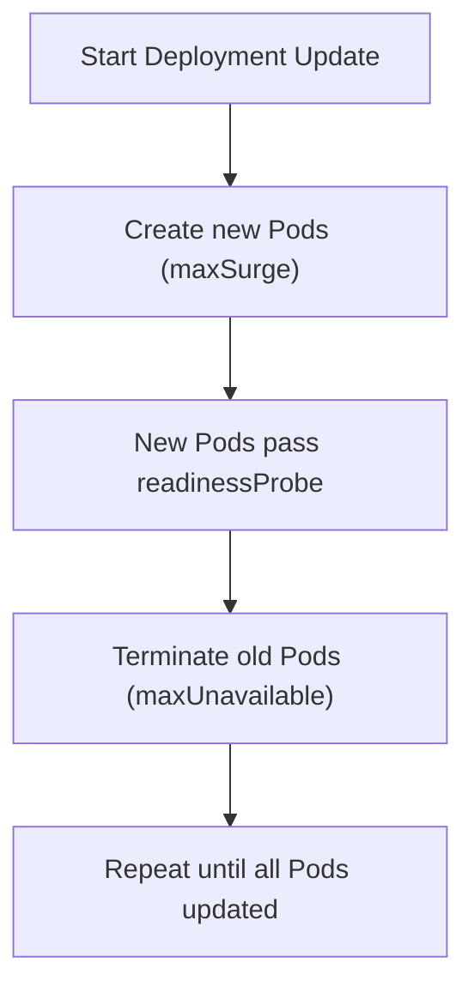

# GKE Deployment RollingUpdate 参数设计分析

## 1. 问题分析

我们 GKE deployment rollingupdate 为什么配置：

```yaml
maxSurge: 2
maxUnavailable: 1
```

而不是：

```yaml
maxSurge: 1
maxUnavailable: 0
```

是因为想要部署更新快吗？

在 **Kubernetes Deployment RollingUpdate** 策略中，两个关键参数控制升级行为：

| 参数           | 含义                                  |
| -------------- | ------------------------------------- |
| maxSurge       | 升级过程中允许**额外创建的 Pod 数量** |
| maxUnavailable | 升级过程中允许**不可用的 Pod 数量**   |

升级时 Kubernetes 会遵循两个约束：

```
当前 Pod 数 ≤ desired + maxSurge
不可用 Pod 数 ≤ maxUnavailable
```

因此：

- **maxSurge 控制升级速度**
- **maxUnavailable 控制可用性风险**

---

## 2. 两种配置对比

假设 Deployment：

```
replicas = 2
```

### 方案 A（严格高可用）

```
maxSurge: 1
maxUnavailable: 0
```

升级过程：

| 步骤  | 旧 Pod | 新 Pod | 总 Pod |
| ----- | ------ | ------ | ------ |
| 初始  | 2      | 0      | 2      |
| Step1 | 2      | 1      | 3      |
| Step2 | 1      | 1      | 2      |
| Step3 | 1      | 2      | 3      |
| Step4 | 0      | 2      | 2      |

**特点：**

- **始终保证 2 个 Pod 可用**
- **升级速度较慢**
- **资源增加少**

**适用于：**

- 严格 SLA
- 对 downtime 极度敏感
- 请求不能失败

---

### 方案 B（速度优先）

```
maxSurge: 2
maxUnavailable: 1
```

升级过程：

| 步骤  | 旧 Pod | 新 Pod | 总 Pod |
| ----- | ------ | ------ | ------ |
| 初始  | 2      | 0      | 2      |
| Step1 | 2      | 2      | 4      |
| Step2 | 1      | 2      | 3      |
| Step3 | 0      | 2      | 2      |

**特点：**

- **升级速度更快**
- **可能短暂只有 1 个可用 Pod**
- **需要更多资源**

---

## 3. 为什么很多平台使用 `maxSurge: 2, maxUnavailable: 1`

### 原因 1：加快升级速度

当 replicas 很小时：

```
replicas = 2
```

如果使用：

```
maxSurge: 1, maxUnavailable: 0
```

升级会 **一台一台替换**。

但如果：

```
maxSurge: 2
```

可以 **一次性启动所有新 Pod**。

---

### 原因 2：容忍短暂失败

很多 API 平台具有：

- **Retry**
- **Load Balancer**
- **Connection draining**

例如你的架构：

```
Client
↓
Nginx L7
↓
Nginx L4
↓
Kong DP
↓
GKE Service
```

在这种多层架构下：

- 单 Pod 不可用 **通常不会影响整体服务**
- 上游可以自动重试

因此允许：

```
maxUnavailable: 1
```

换取：

- 更快升级
- 更低 rollout 时间

---

### 原因 3：避免 readiness delay 导致 rollout 卡住

如果：

```
maxUnavailable: 0
```

而新 Pod readiness 很慢：

```
startup = 30s
readiness = 30s
```

升级会：

```
旧 Pod 不能删除
新 Pod 必须 ready
```

可能造成 rollout **非常慢甚至卡住**。

---

## 4. 生产环境推荐配置策略

更合理的方式不是固定值，而是 **按 replicas 比例设置**。

### 推荐策略

| replicas | maxSurge | maxUnavailable | 原因       |
| -------- | -------- | -------------- | ---------- |
| 1        | 1        | 0              | 保证零停机 |
| 2        | 1        | 0 或 1         | 高可用     |
| 3        | 1        | 1              | 平衡       |
| 4+       | 25%      | 25%            | 标准推荐   |
| 10+      | 30%      | 20%            | 大规模服务 |

Kubernetes 官方推荐：

```
maxSurge: 25%
maxUnavailable: 25%
```

示例：

```
replicas = 8

maxSurge = 2
maxUnavailable = 2
```

---

## 5. API 平台常见配置（最佳实践）

对于 **API Gateway / Java API / 微服务**：

推荐：

```yaml
strategy:
  type: RollingUpdate
  rollingUpdate:
    maxSurge: 50%
    maxUnavailable: 25%
```

例如：

```
replicas = 4

maxSurge: 2
maxUnavailable: 1
```

**特点：**

- 升级速度快
- 可用性仍然高
- rollout 不会卡住

---

## 6. 与 PDB 配合

在生产环境通常还要结合：

```
PodDisruptionBudget
```

例如：

```yaml
apiVersion: policy/v1
kind: PodDisruptionBudget
metadata:
  name: api-pdb
spec:
  minAvailable: 2
  selector:
    matchLabels:
      app: api
```

这样可以保证：

- 节点升级
- Pod Eviction

不会同时影响太多实例。

---

## 7. 升级流程示意



---

## 8. 针对你当前平台（GKE + Kong + Nginx）的建议

你的平台链路：

```
Client
→ Nginx L7
→ Nginx L4
→ Kong
→ GKE Service
→ Pod
```

**建议：**

```
replicas >= 3
```

**Deployment：**

```
maxSurge: 50%
maxUnavailable: 25%
```

**示例：**

```
replicas: 4

maxSurge: 2
maxUnavailable: 1
```

**优点：**

- rollout 快
- 不会影响 API
- Pod restart 不会触发 502

---

## 9. 一条最重要的经验

真正决定 RollingUpdate 是否安全的不是：

```
maxSurge / maxUnavailable
```

而是：

```
readinessProbe + graceful shutdown
```

例如：

```
terminationGracePeriodSeconds: 30
preStop hook
readinessProbe
```

否则即使：

```
maxUnavailable: 0
```

仍然可能出现 **502 / connection reset**。

---

## 10. 非生产环境 vs 生产环境

### 非生产环境

通常默认的数量是 **1 到 2 个**。

### 生产环境

默认是 **2 到 4 个**，也就是说最少有 2 个。

---

## 11. 生产经验总结

| Pod 数量 | 推荐策略                  |
| -------- | ------------------------- |
| 1        | maxSurge=1, maxUnavailable=0 |
| 2        | maxSurge=1, maxUnavailable=0 |
| 3        | maxSurge=1, maxUnavailable=1 |
| 4+       | 25% / 25%                 |

**核心原则：**

```
Pod 越少 → 越保守
Pod 越多 → 越可以并行升级
```

---

## 附录：扩展阅读建议

如果你愿意，我可以再帮你总结一份 **GKE API Platform Deployment 最佳实践模板（生产级 YAML）**，包括：

- RollingUpdate
- PDB
- HPA
- Anti-affinity
- Graceful shutdown

基本是 **Google SRE + Kubernetes production 标准配置**。
