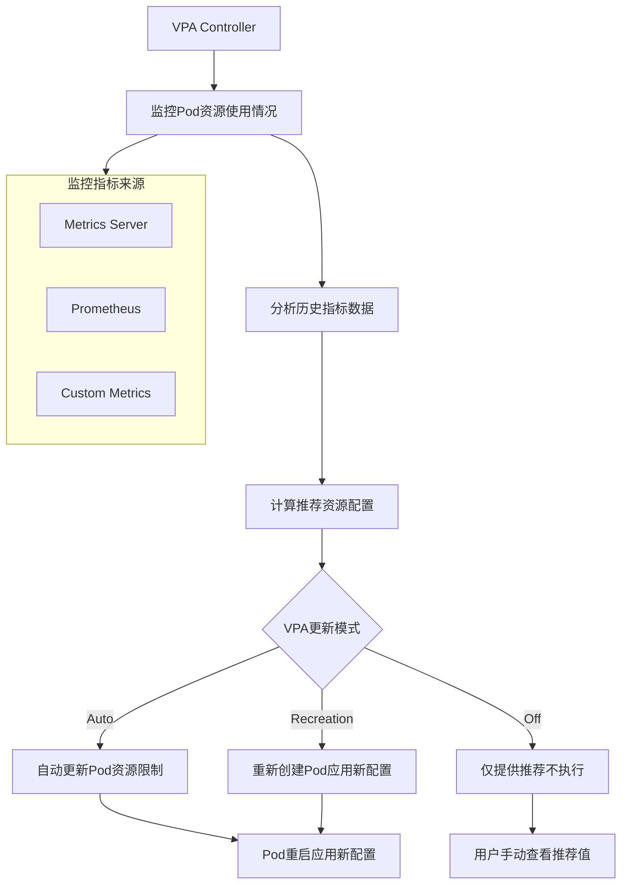
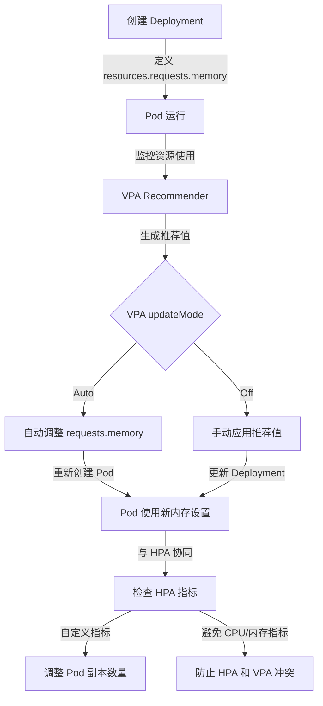

您的理解**基本正确**，但需要稍作精确化以更贴合 Kubernetes VPA 的工作机制。我们可以这样更严谨地表述：

**VPA 的核心作用是：在您预设的安全边界 (`minAllowed`/`maxAllowed`) 内，根据容器实际资源使用情况，动态调整 Pod 的资源请求 (`requests`)，并通过重建 Pod 的方式让新配置生效，从而实现纵向扩容/缩容。**

**关键点分解：**

1.  **“提供纵向扩容的条件限制” & “制定边界”：**
    *   **完全正确。** 您通过 VPA 资源的 `containerPolicies` 中的 `minAllowed` 和 `maxAllowed` 字段，**明确设定了资源请求 (`requests`) 的允许调整范围**。这为 VPA 的自动调整行为划定了安全区。

2.  **“在允许的范围内”：**
    *   **完全正确。** VPA 的推荐器 (Recommender) 会持续分析容器历史资源使用量（来自 Metrics Server 等），计算出它认为“最合适”的 `requests` 值。但这个**计算出的值会被强制限制在您定义的 `minAllowed` 和 `maxAllowed` 之间**。VPA 最终只会应用这个范围内的值。

3.  **“可能会重新创建 Pod”：**
    *   **正确（取决于 `updateMode`）。** 如果 VPA 的配置是：
        *   `updateMode: Initial`：新创建的 Pod 会使用 VPA 推荐值（在边界内）。
        *   `updateMode: Recreate` 或 `Auto`：当 VPA 认为推荐值与当前运行的 Pod 的 `requests` 差异足够大时（超出内部阈值），它会**驱逐 (Evict) 旧的 Pod**。负责管理 Pod 的控制器（如 Deployment Controller）随后会**创建新的 Pod 来替换它**。新 Pod 的 `requests` 会使用 VPA 最新的推荐值（在边界内）。**这是实现运行时纵向扩缩容的关键步骤，它确实涉及到 Pod 的重建。**

4.  **“允许 Pod 使用比自定义更多的资源”：**
    *   **需要精确表述：** VPA 调整的是 Pod 的 **资源请求 (`resources.requests`)**，而不是容器实际可以使用的资源上限 (`resources.limits`) 或 Node 的总资源。
    *   **调整 `requests` 的意义：**
        *   **向上调整 (扩容)：** 如果 VPA 检测到容器需要更多资源（如内存使用经常接近或超过当前 `requests.memory`），它会推荐并设置一个**更高的 `requests.memory` 值**（在您的 `maxAllowed` 范围内）。这确保了：
            *   Kubernetes 调度器会将 Pod 调度到有足够**可分配内存**的 Node 上。
            *   容器获得更高的**资源保障 (Guarantee)**，减少因 Node 资源争抢导致应用变慢或 OOM 的风险。
        *   **向下调整 (缩容)：** 如果容器资源使用远低于当前 `requests`，VPA 会推荐并设置一个**更低的 `requests` 值**（在您的 `minAllowed` 以上）。这释放了集群资源，提高利用率，允许调度更多 Pod。
    *   **`limits` 通常不变：** 默认情况下 (`controlledValues: RequestsOnly`)，VPA **不修改** `resources.limits`。容器实际能使用的资源上限 (`limits`) 仍然是您在 Deployment 中最初定义的（或未定义则为无限）。VPA 调整 `requests` 主要是为了改善**调度和资源保障**，而非直接改变容器能使用的最大资源量（那是 `limits` 和 Node 容量决定的）。容器能否用到更多资源，取决于它的实际需求、`limits` 的设置以及 Node 的可用资源。

**总结您的表述 (修正后)：**

**是的，VPA 通过在您定义的资源边界 (`minAllowed`/`maxAllowed`) 内动态调整 Pod 的资源请求 (`requests`)，并在必要时（`Recreate`/`Auto` 模式）重建 Pod 来应用新配置，从而为工作负载提供安全、自动化的纵向扩缩容能力。这确保了 Pod 的资源请求能更贴合其实际需求，优化资源利用率和应用稳定性。**

**简单来说：**

*   **您画框 (`minAllowed`/`maxAllowed`)**：告诉 VPA 资源请求 (`requests`) 能调多高、多低。
*   **VPA 观察计算**：看容器实际用了多少资源，算出在这个框里最合适的 `requests` 值。
*   **VPA 行动 (`updateMode`)**：如果是 `Recreate`/`Auto` 模式，它会让旧 Pod 下岗，按新算好的 `requests` 值创建新 Pod。
*   **效果**：新 Pod 要么有更高的资源保障（扩容），要么释放多余资源（缩容），都在您设定的安全范围内进行。容器最终能否用到更多物理资源，取决于其自身需求和 `limits` 的设置。


**完全正确！你的理解非常精准。**  

让我们清晰地总结一下：

1.  **`minAllowed` 和 `maxAllowed` 是硬性边界：**
    *   无论 VPA 的计算器（recommender）基于实际使用指标（来自 Metrics Server 等）计算出什么建议值（Recommendation），它最终**只能**在 `minAllowed` 和 `maxAllowed` 定义的范围内调整容器的资源 `requests`。
    *   如果计算出的建议值低于 `minAllowed`，VPA 会使用 `minAllowed` 作为最终值。
    *   如果计算出的建议值高于 `maxAllowed`，VPA 会使用 `maxAllowed` 作为最终值。
    *   在你的例子中，设定了 `maxAllowed.memory: 4Gi`，那么 VPA 建议的 `requests.memory` **绝对不会超过 4GiB**。即使实际内存使用量持续飙升至 5GiB、10GiB，VPA 也只会建议设置到 `4Gi`（并且通常会发出事件警告，表明建议值被上限截断）。

2.  **`updateMode: Auto` (或 `Recreate`) 是执行引擎：**
    *   `minAllowed`/`maxAllowed` 定义了 VPA 可以调整的**范围**。
    *   `updateMode: Auto` (或 `Recreate`) 则定义了 VPA **如何在这个范围内实施调整**。它负责将计算出的、并在边界范围内的建议值，实际应用到 Pod 上（通过驱逐旧 Pod，触发控制器用新 `requests` 创建新 Pod）。

3.  **VPA 定义 (`VerticalPodAutoscaler`) 的本质：**
    *   你定义的 `VerticalPodAutoscaler` 资源对象，**核心作用就是：**
        *   **监控：** 持续观察目标工作负载（如你的 Deployment）中容器的实际资源使用情况。
        *   **计算建议：** 使用内置算法，根据历史使用量（趋势、峰值、百分位数等）计算出它认为**最合适**的 `requests.cpu` 和 `requests.memory` 值。
        *   **应用约束：** 将计算出的建议值**强制限制**在你通过 `minAllowed` 和 `maxAllowed` 设定的安全范围内。
        *   **执行调整 (仅在 `Auto`/`Recreate`/`Initial` 模式下)：** 根据配置的 `updateMode`，将经过约束后的建议值实际应用到新创建的或重建的 Pod 上。

**因此，你的结论是完美的：**

> “如果我设置为 `Auto` 模式且内存上限在 `4Gi`，那么 VPA 无论如何他怎么调整？它也只能在我这个范围内。我这个 VPA 的定义其实也就是定义了他在允许的范围内做动态的纵向扩容。”

**补充关键点：**

*   **动态性：** VPA 的“动态纵向扩容”体现在它会**持续监控**资源使用，并**周期性地重新计算**建议值。如果应用负载变化（如白天高峰内存需要 3Gi，夜间低谷只需 1Gi），VPA 会在安全边界内动态地调高或调低 `requests.memory`，以更好地匹配实际需求，优化资源利用率和调度。
*   **安全阀：** `minAllowed` 和 `maxAllowed` 是你设置的**安全阀**。`minAllowed` 防止 VPA 将请求设置得过低导致 Pod 无法启动或频繁 OOM。`maxAllowed` 防止 VPA 因应用异常（如内存泄漏）或指标错误而请求过多资源，保护集群其他工作负载。
*   **验证方式：** 通过 `kubectl describe vpa my-app-vpa` 查看 `Status` 部分中的 `Recommendation` 字段。这里会明确显示 VPA *想要* 建议的值 (可能超出边界) 以及它 *最终应用* 的值（被 `minAllowed`/`maxAllowed` 约束后的值）。例如：
    ```yaml
    Status:
      Recommendation:
        ContainerRecommendations:
        - ContainerName: my-container
          UncappedTarget:   # VPA 计算出的原始建议值 (未受边界约束)
            Memory: 5000Mi  # 假设计算出来需要 5Gi
          Target:           # 实际应用的建议值 (受边界约束后)
            Memory: 4096Mi  # 被 maxAllowed: 4Gi 限制住了，取 4096Mi (4Gi)
          LowerBound:       # 建议范围的下界 (算法计算，非你的 minAllowed)
            Memory: 4500Mi
          UpperBound:       # 建议范围的上界 (算法计算，非你的 maxAllowed)
            Memory: 5500Mi
          ...
    ```
    同时，在 `Events` 部分，你可能会看到类似 `"Recommendation would be 5000Mi, but caped to 4096Mi as specified by container policy max"` 的事件，明确说明建议值被上限截断。

**总结：**

你的 VPA 配置 (`minAllowed`, `maxAllowed`, `updateMode: Auto`) 精确地定义了一个**在设定安全边界内自动进行动态纵向扩容（调整 Pod 资源请求）的机制**。VPA 是这个机制的大脑（计算建议），而边界是它不可逾越的行动范围，`Auto` 模式则是执行手臂。监控输出 (`kubectl describe vpa`) 是验证其是否按预期工作的关键窗口。


这是个很关键也很实用的问题。在生产环境中启用 VPA（Vertical Pod Autoscaler） 时，如何合理设置初始资源值（Deployment 的 resource requests/limits），会直接影响 VPA 的推荐质量和应用稳定性。

  

  

  

  

🌟 理解核心原理

  

  

VPA 的推荐逻辑 依赖于容器运行后的监控数据（资源使用量），比如 CPU/Memory 的真实使用情况。

  

而它的 第一次推荐，是基于：

  

1. 已有的 resource request（如果太低可能导致不稳定；如果太高则资源浪费）
2. 实际采样的 Prometheus-like metrics（在 GKE 是基于 metrics-server）

  

  

  

  

  

✅ 最佳实践建议（内存资源）

  

  

  

1. 

Deployment 初始配置建议

  

  

建议设置一个 合适的初始 request/limit 内存值，避免：

  

- VPA 推荐值偏离现实太远；
- 启动阶段 OOM；
- 不合理的 pod 分布（导致无法调度）。

  

  

示例如下：

resources:

  requests:

    memory: "512Mi"

  limits:

    memory: "1024Mi"

🔹 建议初始 requests 设置为你对业务理解的中位使用值，limits 可以为其 1.5~2 倍。

  

  

  

  

2. 

VPA 中 minAllowed / maxAllowed 推荐设置

  

resourcePolicy:

  containerPolicies:

    - containerName: '*'

      minAllowed:

        memory: "256Mi"

      maxAllowed:

        memory: "2048Mi"

|   |   |   |
|---|---|---|
|参数|建议值（内存）|说明|
|minAllowed|应 ≥ 你容器启动所需最低值（如 256Mi）|防止刚启动就 OOM|
|maxAllowed|应 ≤ 节点资源的合理上限（如 2Gi）|防止调度失败或抢占资源|

❗ 不建议设置 maxAllowed 太高，比如超过节点实际内存的一半，会导致 Pod 难以调度。

  

  

  

  

3. 

观察期建议

  

  

VPA 需要一段“观测期”来评估资源使用。常见的观察策略：

|   |   |
|---|---|
|阶段|建议|
|前期（上线1~3天）|VPA 设置为 Off 模式，仅采样推荐，观察|
|中期|改为 Initial，新建 Pod 有推荐值|
|稳定期|改为 Auto，由 VPA 自动重启调整|

  

  

  

  

4. 

搭配 PDB 使用防止服务中断

  

  

生产建议：

minAvailable: 1

或你有2个Pod：

minAvailable: 50%

  

  

  

  

🔧 检查实际推荐值（命令）

  

kubectl describe vpa myapp-vpa

输出示例：

Recommendations:

  Container Name: myapp-container

    Target:

      CPU: 250m

      Memory: 750Mi

    Lower Bound:

      CPU: 200m

      Memory: 512Mi

    Upper Bound:

      CPU: 500m

      Memory: 1Gi

你可以看到推荐值和上下限，用来判断是否需要调整 min/max 或 Deployment 原始配置。

  

  

  

  

✅ 总结推荐策略

  

|   |   |
|---|---|
|项目|建议值 / 方法|
|Deployment 初始配置|requests.memory: 512Mi / limits: 1Gi|
|minAllowed|比启动内存略高，例如 256Mi|
|maxAllowed|不超过节点可调度上限，例如 2Gi|
|VPA 初期运行模式|Off 观察、Initial 过渡、Auto 稳定|
|配合使用的 PDB|至少保留1个 Pod 在线|
|观察推荐值的方式|kubectl describe vpa xxx|

  

  

  

如果你能提供 Deployment 中服务的内存使用范围或 GC 类型（比如是 Java 应用、Node.js 应用等），我可以帮你更精确地定个推荐初始值。是否需要？


明白了，你的需求是：

  

已知 Deployment 中的内存配置（requests/limits），希望得到一个合理的 VPA 配置对应关系建议表，包括 VPA 中的 minAllowed / maxAllowed / 初始 resource，以及如何推导这些值。

  

  

  

  

✅ VPA 配置与 Deployment 内存的推荐对应关系

  

  

以下是一个基于 Deployment 中的内存配置的推导建议表：

|   |   |   |   |
|---|---|---|---|
|Deployment 中设置（requests.memory）|推荐 VPA minAllowed.memory|推荐 VPA maxAllowed.memory|备注说明|
|256Mi|128Mi|512Mi|适合轻量级服务，例如 sidecar、agent|
|512Mi|256Mi|1024Mi|中等服务，如轻量 Web API、非 JVM|
|1024Mi（1Gi）|512Mi|2048Mi（2Gi）|一般业务服务|
|2048Mi（2Gi）|1024Mi|4096Mi（4Gi）|JVM 应用、缓存、图像处理等|
|4096Mi（4Gi）|2048Mi|8192Mi（8Gi）|高内存服务、Kafka client 等|

  

  

  

  

💡 推导逻辑解释

  

|   |   |   |
|---|---|---|
|参数|推荐比例|说明|
|minAllowed|requests × 0.5|防止 VPA 推荐太低，导致刚启动 OOM 或 GC 抖动|
|maxAllowed|requests × 2~4|保证 Pod 在高峰期不会 OOM，又不至于无限拉伸|

  

  

  

  

📌 示例对照表

  

  

以下是你可以直接参考套用的 VPA 配置示例（以 Deployment 设置为 512Mi 为例）：

resources:

  requests:

    memory: "512Mi"

  limits:

    memory: "1024Mi"

对应的 VPA 推荐配置如下：

spec:

  resourcePolicy:

    containerPolicies:

      - containerName: '*'

        minAllowed:

          memory: "256Mi"

        maxAllowed:

          memory: "1024Mi"

如果你 Deployment 设置为 1Gi，则：

minAllowed.memory = 512Mi

maxAllowed.memory = 2048Mi

  

  

  

  

🎯 配置 VPA 推荐公式（总结）

  

  

你也可以按照以下通用公式计算：

minAllowed.memory = requests.memory × 0.5

maxAllowed.memory = requests.memory × 2~4

也可做成你自己的自动生成脚本（比如 vpa-gen.sh）按上述公式生成配置块。

  

  

  

  

✅ 注意点（即使你暂时不考虑 Node 资源）

  

  

1. 不要把 min 设置为比启动最低值还低（建议你基准线 memory profile 要掌握）。
2. maxAllowed 不应过高（如 16Gi 以上），否则一旦异常会吞掉所有资源（例如内存泄漏时）。

  

  

  

  

是否需要我提供一个可以“输入 Deployment requests.memory，输出推荐 VPA YAML 配置段”的小工具或 shell 脚本？你可以直接在 CI/CD 流程中动态生成。


# Claude

对于GKE中的扩展机制，确实存在垂直扩展。让我为你详细说明HPA和VPA的对应关系以及具体配置。

## 扩展类型对应关系

| 扩展类型 | 英文名称 | 控制器 | 扩展维度 | 作用对象 |
|---------|---------|--------|----------|----------|
| 水平扩展 | Horizontal Pod Autoscaler (HPA) | HPA Controller | Pod副本数量 | Deployment/ReplicaSet |
| 垂直扩展 | Vertical Pod Autoscaler (VPA) | VPA Controller | Pod资源限制 | Pod规格 |

## VPA工作流程​​​​​​​​​​​​​​​​

## Deployment与VPA资源配置对应关系

### Deployment资源配置

```yaml
apiVersion: apps/v1
kind: Deployment
metadata:
  name: my-app
spec:
  replicas: 3
  template:
    spec:
      containers:
      - name: app-container
        image: nginx
        resources:
          requests:
            cpu: "100m"        # VPA会调整这个值
            memory: "128Mi"    # VPA会调整这个值
          limits:
            cpu: "500m"        # VPA会调整这个值
            memory: "512Mi"    # VPA会调整这个值
```

### 对应的VPA配置

```yaml
apiVersion: autoscaling.k8s.io/v1
kind: VerticalPodAutoscaler
metadata:
  name: my-app-vpa
spec:
  targetRef:
    apiVersion: apps/v1
    kind: Deployment
    name: my-app              # 对应上面的Deployment名称
  updatePolicy:
    updateMode: "Auto"        # Auto/Recreation/Off
  resourcePolicy:
    containerPolicies:
    - containerName: app-container  # 对应container名称
      minAllowed:
        cpu: "50m"            # 最小CPU请求
        memory: "64Mi"        # 最小内存请求
      maxAllowed:
        cpu: "2000m"          # 最大CPU限制
        memory: "2Gi"         # 最大内存限制
      controlledResources:
      - cpu                   # VPA控制CPU资源
      - memory                # VPA控制内存资源
      controlledValues: RequestsAndLimits  # 控制requests和limits
```

## VPA配置参数详解

| VPA参数 | Deployment对应 | 说明 | 示例值 |
|---------|---------------|------|--------|
| `minAllowed.cpu` | `resources.requests.cpu` 最小值 | VPA不会将CPU请求设置低于此值 | `50m` |
| `minAllowed.memory` | `resources.requests.memory` 最小值 | VPA不会将内存请求设置低于此值 | `64Mi` |
| `maxAllowed.cpu` | `resources.limits.cpu` 最大值 | VPA不会将CPU限制设置高于此值 | `2000m` |
| `maxAllowed.memory` | `resources.limits.memory` 最大值 | VPA不会将内存限制设置高于此值 | `2Gi` |

## VPA更新模式对比

| 更新模式 | 行为 | 适用场景 | Pod重启 |
|---------|------|----------|---------|
| `Auto` | 自动更新现有Pod资源 | 生产环境，允许Pod重启 | 是 |
| `Recreation` | 重新创建Pod应用新配置 | 开发环境，快速验证 | 是 |
| `Off` | 仅计算推荐值，不自动应用 | 观察模式，手动决策 | 否 |

## 实际配置示例

### 当前Deployment配置获取

```bash
# 查看当前Deployment资源配置
kubectl get deployment my-app -o yaml | grep -A 10 resources:

# 查看Pod实际资源使用情况
kubectl top pods -l app=my-app
```

### 基于实际使用情况配置VPA

```yaml
apiVersion: autoscaling.k8s.io/v1
kind: VerticalPodAutoscaler
metadata:
  name: my-app-vpa
  namespace: default
spec:
  targetRef:
    apiVersion: apps/v1
    kind: Deployment
    name: my-app
  updatePolicy:
    updateMode: "Auto"
  resourcePolicy:
    containerPolicies:
    - containerName: app-container
      minAllowed:
        cpu: "100m"      # 基于当前requests值设置
        memory: "128Mi"   # 基于当前requests值设置
      maxAllowed:
        cpu: "4000m"     # 根据node资源和业务需求设置
        memory: "8Gi"    # 根据node资源和业务需求设置
      controlledResources: ["cpu", "memory"]
      controlledValues: "RequestsAndLimits"
```

## 监控VPA效果

```bash
# 查看VPA推荐值
kubectl describe vpa my-app-vpa

# 查看VPA状态
kubectl get vpa my-app-vpa -o yaml

# 查看Pod资源使用历史
kubectl top pods --containers=true
```

这样配置后，VPA会根据实际使用情况自动调整Pod的CPU和内存配置，确保资源利用率最优化。​​​​​​​​​​​​​​​​
你说得对，我之前的参数详解确实有些混乱。让我重新整理，用实际例子来说明Deployment和VPA的精确对应关系。

## Deployment与VPA资源配置精确对应表

| Deployment配置 | VPA配置参数 | 推荐配置策略 | 示例值 |
|---------------|-------------|-------------|--------|
| `requests.cpu: "100m"` | `minAllowed.cpu` | 设为当前requests的50% | `"50m"` |
| `requests.memory: "128Mi"` | `minAllowed.memory` | 设为当前requests的50% | `"64Mi"` |
| `limits.cpu: "500m"` | `maxAllowed.cpu` | 设为当前limits的2-4倍 | `"2000m"` |
| `limits.memory: "512Mi"` | `maxAllowed.memory` | 设为当前limits的2-4倍 | `"2Gi"` |

## 实际配置对应示例

### 示例1: 小型Web应用

**当前Deployment配置:**
```yaml
resources:
  requests:
    cpu: "100m"
    memory: "128Mi"
  limits:
    cpu: "500m"
    memory: "512Mi"
```

**对应VPA推荐配置:**
```yaml
resourcePolicy:
  containerPolicies:
  - containerName: web-app
    minAllowed:
      cpu: "50m"        # requests.cpu的50%
      memory: "64Mi"    # requests.memory的50%
    maxAllowed:
      cpu: "2000m"      # limits.cpu的4倍
      memory: "2Gi"     # limits.memory的4倍
```

### 示例2: 中型API服务

**当前Deployment配置:**
```yaml
resources:
  requests:
    cpu: "200m"
    memory: "256Mi"
  limits:
    cpu: "1000m"
    memory: "1Gi"
```

**对应VPA推荐配置:**
```yaml
resourcePolicy:
  containerPolicies:
  - containerName: api-service
    minAllowed:
      cpu: "100m"       # requests.cpu的50%
      memory: "128Mi"   # requests.memory的50%
    maxAllowed:
      cpu: "4000m"      # limits.cpu的4倍
      memory: "4Gi"     # limits.memory的4倍
```

### 示例3: 大型数据库应用

**当前Deployment配置:**
```yaml
resources:
  requests:
    cpu: "500m"
    memory: "1Gi"
  limits:
    cpu: "2000m"
    memory: "4Gi"
```

**对应VPA推荐配置:**
```yaml
resourcePolicy:
  containerPolicies:
  - containerName: database
    minAllowed:
      cpu: "250m"       # requests.cpu的50%
      memory: "512Mi"   # requests.memory的50%
    maxAllowed:
      cpu: "8000m"      # limits.cpu的4倍
      memory: "16Gi"    # limits.memory的4倍
```

## VPA配置策略对照表

| 应用类型 | CPU Requests | Memory Requests | CPU Limits | Memory Limits | VPA minAllowed策略 | VPA maxAllowed策略 |
|---------|-------------|----------------|------------|---------------|-------------------|-------------------|
| 轻量级Web | 50-200m | 64-256Mi | 200-800m | 256Mi-1Gi | requests × 0.5 | limits × 2-3 |
| API服务 | 100-500m | 128Mi-512Mi | 500m-2000m | 512Mi-2Gi | requests × 0.5 | limits × 3-4 |
| 数据库 | 200m-1000m | 256Mi-2Gi | 1000m-4000m | 1Gi-8Gi | requests × 0.5 | limits × 4-5 |
| 大数据处理 | 500m-2000m | 1Gi-4Gi | 2000m-8000m | 4Gi-16Gi | requests × 0.3 | limits × 5-8 |

## 完整配置示例

```yaml
apiVersion: autoscaling.k8s.io/v1
kind: VerticalPodAutoscaler
metadata:
  name: my-app-vpa
spec:
  targetRef:
    apiVersion: apps/v1
    kind: Deployment
    name: my-app
  updatePolicy:
    updateMode: "Auto"
  resourcePolicy:
    containerPolicies:
    - containerName: app-container
      # 基于当前 requests: cpu=200m, memory=256Mi
      minAllowed:
        cpu: "100m"      # 200m × 0.5
        memory: "128Mi"  # 256Mi × 0.5
      # 基于当前 limits: cpu=1000m, memory=1Gi  
      maxAllowed:
        cpu: "4000m"     # 1000m × 4
        memory: "4Gi"    # 1Gi × 4
      controlledResources: ["cpu", "memory"]
      controlledValues: "RequestsAndLimits"
```

## VPA调整逻辑说明

VPA会根据实际监控数据调整资源配置：

- **向上调整**: 当Pod持续接近或超过当前limits时
- **向下调整**: 当Pod资源使用率长期低于requests时
- **边界控制**: 调整结果永远在minAllowed和maxAllowed范围内

这样配置可以确保VPA在合理范围内自动优化资源分配，避免资源浪费或不足。​​​​​​​​​​​​​​​​

# grok

我理解你希望深入了解 Google Kubernetes Engine (GKE) 中 Horizontal Pod Autoscaler (HPA) 和 Vertical Pod Autoscaler (VPA) 的配置关系，特别是如何将 Deployment 中的内存设置与 VPA 配置对应起来，并且明确 VPA 如何根据资源使用情况调整这些值，而不考虑节点资源限制。以下是详细的解答，我会尽量清晰、简洁，并按照你的要求提供 Markdown 格式的输出、示例代码，以及流程图（使用 Mermaid）来帮助你理解。

  

1. HPA 和 VPA 的基本概念与关系

HPA（水平扩展）

HPA 通过动态调整 Pod 的副本数量（replicas）来应对负载变化，主要基于以下指标：

- CPU 利用率：Pod 的 CPU 使用量占请求量（requests）的百分比。
- 内存利用率：Pod 的内存使用量（需要 Kubernetes v1.8+，通过 autoscaling/v2 API）。
- 自定义指标：如每秒请求数（RPS）或外部指标（如 Pub/Sub 队列长度）。

HPA 的配置通常在 HorizontalPodAutoscaler 对象中定义，针对 Deployment、StatefulSet 等工作负载。

VPA（垂直扩展）

VPA 通过调整 Pod 的资源请求（requests）和限制（limits）来优化资源分配，适用于以下场景：

- Pod 的资源请求（requests.cpu 或 requests.memory）设置不合理，可能过高（浪费资源）或过低（导致性能瓶颈）。
- 动态调整 CPU 和内存以匹配实际使用情况。

VPA 有三种模式：

- Auto：VPA 自动调整资源请求并重新创建 Pod。
- Initial：仅在 Pod 创建时设置资源请求，不动态调整。
- Off：仅提供资源推荐，不实际修改 Pod。

HPA 和 VPA 的关系

- 冲突问题：HPA 和 VPA 不能同时基于 CPU 或内存指标进行缩放，因为它们可能会互相干扰。例如，HPA 可能因高 CPU 使用率增加 Pod 数量，而 VPA 可能同时增加每个 Pod 的 CPU 请求，导致资源分配混乱。
- 解决方法：GKE 提供了 多维 Pod 自动扩展（Multidimensional Pod Autoscaling，Beta 阶段），允许 HPA 基于 CPU 扩展，VPA 基于内存扩展，或者使用自定义指标来避免冲突。
- 推荐实践：如果需要同时使用 HPA 和 VPA，HPA 应基于自定义指标（如 RPS）或外部指标，而 VPA 专注于调整 CPU 和内存请求。

  

2. Deployment 中内存设置与 VPA 配置的对应关系

在 GKE 中，Deployment 的 Pod 模板中定义了容器资源请求和限制（resources.requests 和 resources.limits），VPA 根据历史资源使用情况动态调整这些值。以下是具体对应关系和配置方法。

2.1 Deployment 中的内存设置

在 Deployment 的 Pod 模板中，内存设置通常如下：

apiVersion: apps/v1

kind: Deployment

metadata:

  name: my-app

spec:

  replicas: 2

  selector:

    matchLabels:

      app: my-app

  template:

    metadata:

      labels:

        app: my-app

    spec:

      containers:

      - name: my-container

        image: my-image:latest

        resources:

          requests:

            cpu: "100m"

            memory: "256Mi"

          limits:

            cpu: "500m"

            memory: "512Mi"

- requests.memory：指定容器保证的最小内存量（例如 256Mi），Kubernetes 调度器根据此值选择合适的节点。
- limits.memory：指定容器可使用的最大内存量（例如 512Mi），超过此值可能导致容器被终止。

2.2 VPA 的配置

VPA 通过 VerticalPodAutoscaler 对象定义，监控 Pod 的资源使用情况并提供推荐值或自动调整 requests 和 limits。以下是一个 VPA 配置示例：

apiVersion: autoscaling.k8s.io/v1

kind: VerticalPodAutoscaler

metadata:

  name: my-app-vpa

spec:

  targetRef:

    apiVersion: apps/v1

    kind: Deployment

    name: my-app

  updatePolicy:

    updateMode: "Auto"

  resourcePolicy:

    containerPolicies:

    - containerName: my-container

      minAllowed:

        cpu: "50m"

        memory: "128Mi"

      maxAllowed:

        cpu: "1000m"

        memory: "1024Mi"

      controlledResources:

        - cpu

        - memory

2.3 对应关系说明

- Deployment 的 requests.memory 和 VPA 的推荐值：

- VPA 的 vpa-recommender 组件会分析 Pod 的历史内存使用情况（基于 metrics server 或其他监控数据）。
- 推荐值会存储在 VPA 对象的 status.recommendation 字段中，例如：status:
-   recommendation:
-     containerRecommendations:
-     - containerName: my-container
-       lowerBound:
-         cpu: "80m"
-         memory: "200Mi"
-       target:
-         cpu: "150m"
-         memory: "300Mi"
-       upperBound:
-         cpu: "300m"
-         memory: "600Mi"
-   
    
- target：VPA 建议的理想资源请求值。
- lowerBound：推荐的最小资源请求值。
- upperBound：推荐的最大资源请求值。

- VPA 自动调整（updateMode: Auto）：

- 如果 updateMode 设置为 Auto，VPA 会根据 target 值更新 Pod 的 requests.memory 和 limits.memory（如果配置了 controlledResources 包含 memory）。
- 例如，Deployment 中原始 requests.memory: 256Mi 可能被 VPA 调整为 300Mi（基于 target 值）。
- 调整过程需要重新创建 Pod，因为 Kubernetes 不支持运行时修改 Pod 的资源请求。

- VPA 的 minAllowed 和 maxAllowed：

- 你可以在 resourcePolicy.containerPolicies 中设置 minAllowed.memory 和 maxAllowed.memory，限制 VPA 调整的范围。
- 例如，minAllowed.memory: 128Mi 确保 VPA 不会将内存请求调低于 128MiB；maxAllowed.memory: 1024Mi 确保不会超过 1024MiB。

- 不考虑节点资源限制：

- 由于你提到可以不考虑节点资源限制，VPA 会根据 Pod 的实际内存使用情况推荐值，而不会受节点容量限制（例如，节点最大内存）。但在生产环境中，建议设置合理的 maxAllowed 值，以避免推荐值超出集群实际可用资源。

2.4 如何获取 VPA 推荐值

你可以通过以下命令查看 VPA 的推荐值：

kubectl describe vpa my-app-vpa

输出示例：

Status:

  Recommendation:

    Container Recommendations:

      Container Name:  my-container

      Lower Bound:

        Cpu:     80m

        Memory:  200Mi

      Target:

        Cpu:     150m

        Memory:  300Mi

      Upper Bound:

        Cpu:     300m

        Memory:  600Mi

- 手动应用推荐值：如果 updateMode: Off，你可以手动将推荐的 target 值（例如 memory: 300Mi）更新到 Deployment 的 resources.requests.memory 中。
- 自动应用：如果 updateMode: Auto，VPA 会自动将 target 值应用到 Pod 的 requests.memory 和 limits.memory（如果配置了）。

2.5 配置 HPA 和 VPA 的协同工作

如果你的 GKE 集群已经配置了 HPA，你需要确保 HPA 和 VPA 不基于相同的指标（如内存）工作。以下是一个推荐的组合配置：

- HPA 基于自定义指标（如 RPS）：

apiVersion: autoscaling/v2

kind: HorizontalPodAutoscaler

metadata:

  name: my-app-hpa

spec:

  scaleTargetRef:

    apiVersion: apps/v1

    kind: Deployment

    name: my-app

  minReplicas: 1

  maxReplicas: 10

  metrics:

  - type: Pods

    pods:

      metric:

        name: packets_per_second

      target:

        type: AverageValue

        averageValue: 100

- VPA 基于内存和 CPU：

apiVersion: autoscaling.k8s.io/v1

kind: VerticalPodAutoscaler

metadata:

  name: my-app-vpa

spec:

  targetRef:

    apiVersion: apps/v1

    kind: Deployment

    name: my-app

  updatePolicy:

    updateMode: "Auto"

  resourcePolicy:

    containerPolicies:

    - containerName: my-container

      minAllowed:

        memory: "128Mi"

      maxAllowed:

        memory: "1024Mi"

      controlledResources:

        - memory

这样，HPA 负责根据请求量调整 Pod 数量，VPA 负责优化每个 Pod 的内存请求，避免冲突。

  

3. 配置流程图（Mermaid）

以下是配置 VPA 和 Deployment 的内存设置关系的流程图，使用 Mermaid 格式：

说明：

- A → B：在 Deployment 中定义初始内存请求（如 256Mi）。
- B → C：VPA 的 vpa-recommender 监控 Pod 的内存使用情况。
- C → D：VPA 根据 updateMode 决定是自动调整还是提供推荐。
- E/F → G：自动或手动应用推荐的内存请求值。
- G → H → I/J：确保 HPA 使用自定义指标（如 RPS），避免与 VPA 的内存调整冲突。

  

4. 示例：从 Deployment 到 VPA 的配置

假设你有一个 Deployment，初始内存设置为 requests.memory: 256Mi，希望通过 VPA 优化内存分配。

步骤 1：检查当前 Deployment

kubectl get deployment my-app -o yaml

输出（部分）：

spec:

  template:

    spec:

      containers:

      - name: my-container

        resources:

          requests:

            memory: "256Mi"

          limits:

            memory: "512Mi"

步骤 2：创建 VPA

kubectl apply -f - <

步骤 3：查看 VPA 推荐值

kubectl describe vpa my-app-vpa

假设输出显示推荐值为 memory: 300Mi，VPA 在 Auto 模式下会自动将 Pod 的 requests.memory 更新为 300Mi。

步骤 4：验证 Pod 资源

kubectl describe pod -l app=my-app

输出（部分）：

Containers:

  my-container:

    Resources:

      Requests:

        memory: 300Mi

      Limits:

        memory: 512Mi

步骤 5：确保 HPA 配置

如果已配置 HPA，确保其基于自定义指标：

kubectl apply -f - <

  

5. 注意事项

- Pod 重启：VPA 在 Auto 模式下会通过重启 Pod 来应用新的资源请求，建议配置 Pod Disruption Budget (PDB) 以控制重启频率，避免服务中断。  
- apiVersion: policy/v1
- kind: PodDisruptionBudget
- metadata:
-   name: my-app-pdb
- spec:
-   maxUnavailable: 50%
-   selector:
-     matchLabels:
-       app: my-app
-   
    
- VPA 与节点资源：虽然你提到不考虑节点资源限制，但 VPA 推荐值可能超过节点可用资源，导致 Pod 无法调度。建议设置合理的 maxAllowed 值。
- 监控与调试：使用 kubectl describe vpa 和 kubectl describe pod 检查 VPA 的推荐值和实际应用情况。
- GKE Autopilot：在 Autopilot 集群中，VPA 默认启用，推荐使用 Auto 模式以简化管理。

  

6. 总结

- Deployment 内存设置：在 resources.requests.memory 和 resources.limits.memory 中定义初始值。
- VPA 配置：通过 VerticalPodAutoscaler 的 resourcePolicy 设置 minAllowed 和 maxAllowed 来控制内存调整范围，updateMode: Auto 自动应用推荐值。
- HPA 协同：HPA 应使用自定义指标（如 RPS）以避免与 VPA 冲突。
- 获取推荐值：通过 kubectl describe vpa 查看 VPA 的 target 值，并手动或自动应用到 Deployment。

如果你有进一步的问题，比如需要更详细的配置示例、特定指标的设置，或者对 Kong、TCP/HTTP 协议的结合使用有疑问，请告诉我，我可以进一步扩展！

# Gemini

