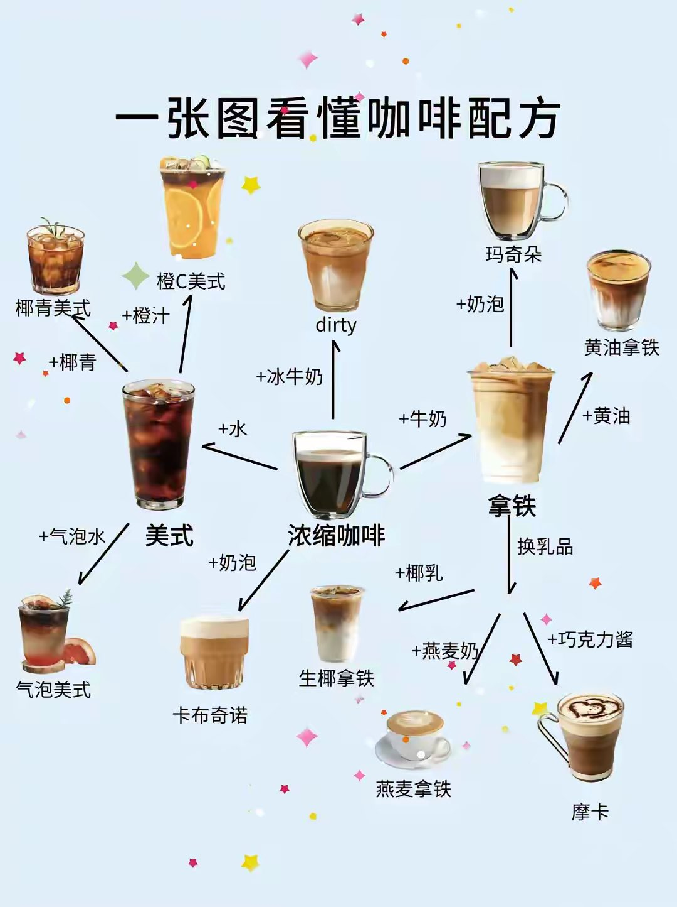
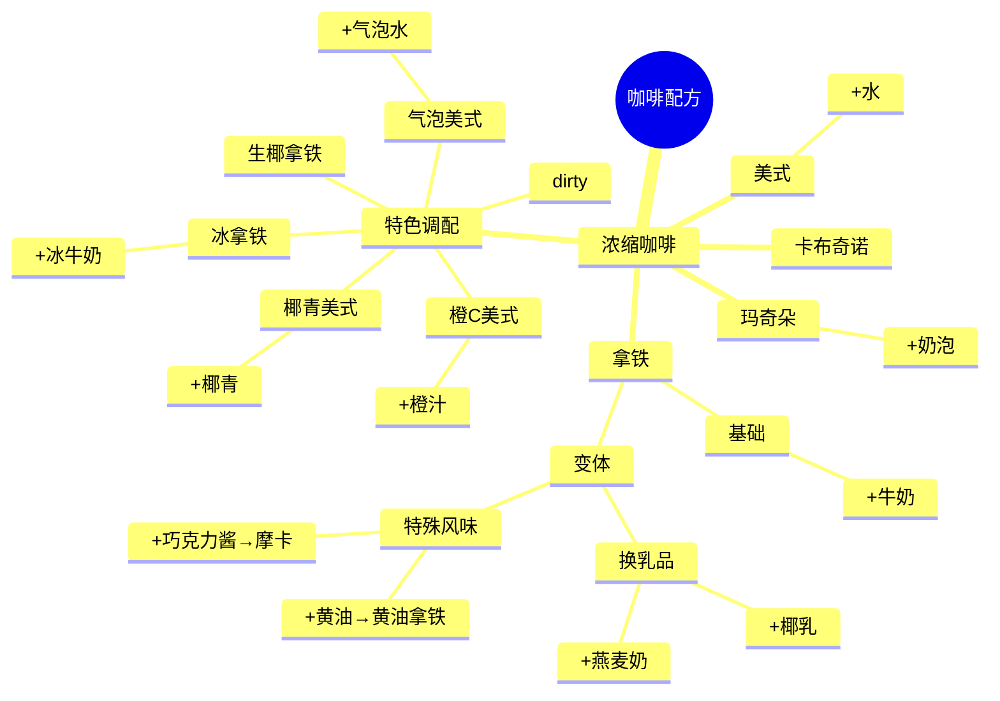

### **咖啡饮品比例表**
| 咖啡类型 | 咖啡量（浓缩） | 水/奶量       | 比例（咖啡 : 液体） | 备注（制作建议）                 |
|----------|----------------|---------------|---------------------|----------------------------------|
| 热美式   | 30ml（1份）    | 90–120ml 热水 | **1:3 至 1:4**      | 直接加热水，喜欢浓可减少水量。   |
| 冰美式   | 30ml（1份）    | 60–90ml 冷水  | **1:2 至 1:3**      | 冷水+冰块，搅拌后饮用更冰爽。    |
| 拿铁     | 30ml（1份）    | 150–180ml 牛奶 | **1:5 至 1:6**      | 蒸汽牛奶+薄奶泡，奶量可依喜好增减。 |


### **示例用量（按常见杯型）**
| 杯型       | 热美式（300ml杯） | 冰美式（350ml杯） | 拿铁（350ml杯） |
|------------|-------------------|-------------------|-----------------|
| **浓缩咖啡** | 60ml（双份）      | 60ml（双份）      | 60ml（双份）    |
| **水/牛奶**  | 240ml 热水        | 120ml冷水 + 满冰  | 240ml 牛奶      |
| **比例**     | 1:4               | 1:2（水）         | 1:4             |


- 

---

### **关键说明**
1. **浓缩咖啡基准**：  
   - 1份浓缩 ≈ 30ml（单份），2份 ≈ 60ml（双份），可根据咖啡机调整。
   - 若无浓缩咖啡，可用挂耳/手冲咖啡代替（需提高浓度，如粉水比1:10）。

2. **冰美式技巧**：  
   - 建议 **“先冰块→咖啡→冷水”** 分层更明显，融化后浓度适中。

3. **拿铁变体**：  
   - 喜欢咖啡味浓：比例 **1:3–1:4**（如30ml咖啡+90–120ml牛奶）。  
   - 喜欢奶香顺滑：比例 **1:6–1:7**（如30ml咖啡+180–210ml牛奶）。  

4. **其他调整**：  
   - 可加入糖浆、焦糖等调味（建议先按基础比例制作，再逐步添加）。  
   - 冰拿铁：牛奶减量（如1:4）+ 冰块，避免稀释。

---
---
希望这份表格能帮助您精准调配咖啡！如有其他需求（如冷萃、澳白等），可随时补充说明~ ☕️



以下是优化后的咖啡配方思维导图，使用多种形状和符号增强可视化效果：

```mermaid
mindmap
  root((🍑 咖啡配方))
    ((☕ 浓缩咖啡))
      🌟 基础款
        ((美式))
          💧水
        {玛奇朵}
          ☁️奶泡
      🥛 拿铁家族
        ◈ 基础
          🥛牛奶
        ◇ 乳品变体
          ((🔄换乳品))
            🥥椰乳
            🌾燕麦奶
        ✨ 特殊风味
          🧈黄油
            ((🧈黄油拿铁))
          🍫巧克力酱
            [[🍫摩卡]]
    ✨ 经典款
      {卡布奇诺}
    🌈 特色调配
      <> 果味系列
        🥥椰青美式
          🥥椰青
        🍊橙C美式
          🍊橙汁
      <> 气泡系列
        🫧气泡美式
          🫧气泡水
      <> 网红特调
        ((生椰拿铁))
        💠 dirty
      ❄️ 冰饮
        🧊冰牛奶
```

### 可视化说明：
1. **形状系统**：
   - 双圆环`(( ))`：核心咖啡基底（浓缩咖啡/生椰拿铁）
   - 菱形`{ }`：经典咖啡款式
   - 六边形`<>`：调配系列分类
   - 圆角矩形`[ ]`：特殊成品名称
   - 默认矩形：基础原料

2. **图标系统**：
   - ☕ 咖啡相关符号
   - 🥥🍊 水果原料标识
   - 🧊❄️ 冰饮标记
   - ✨🌟 特色标记

3. **颜色提示**：
   - 暖色系（🍑/🧈）：乳制品相关
   - 冷色系（💧/🧊）：水/冰饮相关
   - 绿色系（🌾/🥥）：植物基原料

如果需要更精细的样式控制，可以通过以下CSS扩展实现（需要支持的环境）：


这种设计既保持了文本可编辑性，又通过符号系统和形状差异增强了视觉层次感。