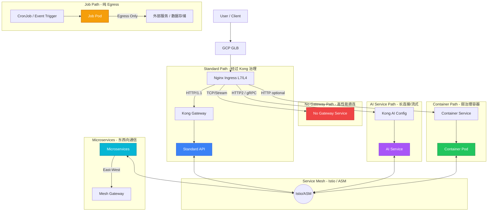
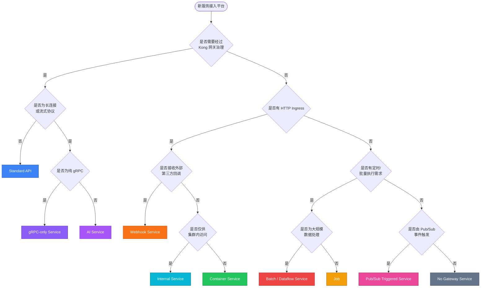

# API 平台演进：从标准 API 到多模式服务支持

## 1. 背景与现状

我们当前的 API 平台基于 **GCP (Google Cloud Platform)** 构建，核心流量链路为：
`GCP GLB (Global Load Balancer) -> Nginx (L7 Ingress) -> Kong Gateway (API Management) -> Runtime (GKE/Java/Python/Go/Node.js)`

这套架构目前完美支持了 **Standard API**（标准 RESTful API）的托管，提供了统一的认证、鉴权、限流和监控能力。然而，随着业务的扩展和 AI 技术的发展，我们需要支持更多样化的服务形态，包括 **Container**（通用容器服务）、**No Gateway**（直连/高性能服务）、**Microservices**（微服务架构）以及 **AI Services**（流式/事件驱动服务）。

本文档旨在深度解析这些服务形态的区别，并探讨我们的平台如何演进以支持这些新需求。

---

## 2. 服务模式深度解析

### 2.1. Standard API (标准 API)
*   **定义**: 传统的 Request-Response 模型，通常基于 HTTP/1.1 RESTful 规范。
*   **特点**:
    *   **强治理**: 必须经过 API 网关，接受严格的 AuthN/AuthZ、Rate Limiting、Logging 等策略管控。
    *   **无状态**: 适合水平扩展。
    *   **面向外部**: 主要作为对外暴露的业务能力接口。
*   **当前支持**: ✅ 完美支持。

### 2.2. Container (通用容器服务)
*   **定义**: 用户只需提供一个容器镜像，平台负责运行，不强制要求遵循 REST API 规范。可能是 Web App、后台 Worker、定时任务或非标准 HTTP 服务。
*   **特点**:
    *   **灵活性**: 关注点在于"运行代码"而非"暴露接口"。
    *   **弱治理**: 可能不需要复杂的 API 网关策略，或者只需要最基础的路由功能。
    *   **生命周期**: 可能包含非 HTTP 的生命周期（如批处理）。
*   **区别**: 与 Standard API 相比，它更像是一个 PaaS (Platform as a Service) 运行时，而非 SaaS 接口。

### 2.3. No Gateway (无网关/直连服务)
*   **定义**: 流量不经过 API 网关（Kong）的应用层处理，直接到达后端服务，或者仅经过 4 层（TCP/UDP）转发。
*   **特点**:
    *   **高性能**: 减少了网关层的 Hop，降低延迟（Latency）。
    *   **特殊协议**: 支持网关无法解析的私有协议或非 HTTP 协议（如纯 TCP、UDP、MQTT）。
    *   **内部使用**: 通常用于受信任的内部服务间调用，或对延迟极度敏感的场景。
*   **区别**: 牺牲了统一治理能力（鉴权、监控需自理），换取了极致的性能或协议灵活性。

### 2.4. Microservices (微服务架构)
*   **定义**: 一组小型、松耦合的服务协同工作。重点在于**服务间通信 (East-West Traffic)** 而非单纯的外部访问 (North-South Traffic)。
*   **特点**:
    *   **服务发现**: 服务之间需要动态发现彼此。
    *   **复杂的调用链**: 一个外部请求可能触发内部几十次服务调用。
    *   **治理下沉**: 熔断、重试、负载均衡等逻辑通常下沉到 Sidecar (Service Mesh) 而非集中式网关。
*   **区别**: Standard API 关注"大门"的守卫，Microservices 关注"房间"内部的协作。

### 2.5. AI Services (AI 流式/事件服务)
*   **定义**: 基于长连接和实时数据流的服务，如 LLM 的 Token 流式输出、语音识别流、实时推理等。
*   **特点**:
    *   **协议特殊**: 强依赖 **HTTP/2**, **gRPC**, **WebSocket**, **SSE (Server-Sent Events)**。
    *   **长连接**: 连接持续时间长，对超时（Timeout）配置敏感。
    *   **双向通信**: 客户端和服务端可能同时发送数据（如 gRPC Bi-directional streaming）。
*   **区别**: 打破了传统的"请求-立即响应-关闭"模型，要求全链路（GLB -> Nginx -> Kong -> App）都支持长连接和特定协议。

### 2.6. Job (定时任务 / 离线计算服务)
*   **定义**: 一次性或周期性的离线任务，通常没有持续运行的 HTTP 服务。常见场景包括：数据同步、报表生成、模型训练、批处理、事件驱动的消息消费等。
*   **特点**:
    *   **纯 Egress（纯出站）**: Job 通常作为数据生产者或数据搬运工，不需要接收外部流量（无 Ingress 需求）。
    *   **无状态执行**: 每次运行相互独立，不依赖前一次执行的状态。
    *   **无持久连接**: 不需要长连接，无需考虑 HTTP/2、WebSocket 等协议。
    *   **调度驱动**: 由 Cron、Event Trigger 或手动触发，不依赖流量驱动。
*   **与 Standard API 的区别**: Standard API 是流量入口（Ingress-heavy），Job 是流量出口（Egress-heavy）；Standard API 需要全链路治理，Job 只需要放行 Egress 即可。
*   **与 Container 的关系**: Job 本质上是一种特殊的 Container，但缺少 HTTP 入口流量，属于纯执行型 workload。

---

## 3. 平台隔离原则

### 3.1. API 类型间的访问控制

我们的平台遵循以下核心隔离原则：

| 源类型 \ 目标类型 | Standard API | Container | No Gateway | Microservices | AI Services | Job |
| :--- | :---: | :---: | :---: | :---: | :---: | :---: |
| **Standard API** | ✅ 允许 | ✅ 允许 | ✅ 允许 | ✅ 允许 | ✅ 允许 | ✅ 允许 |
| **Container** | ❌ 禁止 | ✅ 允许 | ⚠️ 受控 | ⚠️ 受控 | ⚠️ 受控 | ✅ 允许 |
| **No Gateway** | ⚠️ 受控 | ⚠️ 受控 | ✅ 允许 | ⚠️ 受控 | ⚠️ 受控 | ✅ 允许 |
| **Microservices** | ⚠️ 受控 | ⚠️ 受控 | ⚠️ 受控 | ✅ 允许 | ⚠️ 受控 | ✅ 允许 |
| **AI Services** | ⚠️ 受控 | ⚠️ 受控 | ⚠️ 受控 | ⚠️ 受控 | ✅ 允许 | ✅ 允许 |
| **Job** | ❌ 禁止 | ✅ 允许 | ✅ 允许 | ✅ 允许 | ✅ 允许 | ✅ 允许 |

**核心原则说明**：

1. **Standard API 受特殊保护**: 所有需要经过网关治理的 API（Standard API）被视为信任边界。Container 和 Job 默认**不能**访问 Standard API，防止未授权的流量绕网关直接触达受保护服务。

2. **Container 之间的隔离**: 同类型 Container 之间可以互相访问，支持微服务化的内部通信。

3. **Job 的 Egress 放行**: Job 作为纯数据搬运角色，默认放行所有 Egress；但**禁止**访问 Standard API（与 Container 原则一致）。

4. **受控跨域访问**: No Gateway、Microservices、AI Services 访问其他类型时需要基于 Namespace 和 Label 进行显式授权（Security Policy）。

### 3.2. Namespace 级别隔离

在同一命名空间内，API 之间的隔离基于以下机制：

*   **NetworkPolicy**: 使用 Kubernetes NetworkPolicy 限制同 Namespace 内的 Pod 间通信。默认 Deny-all，仅允许白名单流量。
*   **Pod Label 过滤**: 通过 `app.kubernetes.io/name`、`app.kubernetes.io/component`、`app.kubernetes.io/instance` 等标签进行细粒度策略匹配。
*   **Sidecar 强制**: 在 Istio/ASM 环境下，通过 Sidecar Proxy 强制 mTLS 和 AuthorizationPolicy，实现零信任通信。

**Namespace 隔离层级**：

```
┌─────────────────────────────────────────────────┐
│                Cluster (集群)                    │
│                                                  │
│  ┌─────────────────────┐  ┌─────────────────────┐│
│  │   Namespace: prod   │  │  Namespace: dev    ││
│  │                      │  │                      ││
│  │  [Standard API]     │  │  [Container]        ││
│  │  [AI Service]       │  │  [Job]              ││
│  │                     │  │                      ││
│  │  跨 Namespace 需受控  │  │  跨 Namespace 需受控  ││
│  └─────────────────────┘  └─────────────────────┘│
└─────────────────────────────────────────────────┘
```

### 3.3. Label-Based 策略示例

```yaml
# 禁止 Container 访问 Standard API 的 AuthorizationPolicy 示例
apiVersion: security.istio.io/v1beta1
kind: AuthorizationPolicy
metadata:
  name: container-to-standard-ban
  namespace: istio-system
spec:
  selector:
    matchLabels:
      app.kubernetes.io/component: standard-api
  rules:
  - from:
    - source:
        principals: []
        notNamespaces: ["*"]  # 禁止所有来源
    # 等价于: 拒绝所有非 Standard API 类型的访问
```

---

## 4. 平台支持策略与演进方案

为了在现有架构上支持上述服务，我们需要对各层级进行差异化配置或引入新组件。

### 4.1. 架构概览图



### 4.2. 详细支持方案

#### A. 支持 Container (通用容器)
*   **策略**: **Cloud Run 集成** 或 **GKE 简化部署**。
*   **实施**:
    *   利用 GCP 的 **Cloud Run** 作为无服务器容器运行时，适合无状态、HTTP 驱动的容器。
    *   在 GKE 中提供通用的 Helm Chart 模板，允许用户部署不通过 Kong 的服务（通过 Kubernetes Service 直接暴露或仅走 Nginx Ingress）。

#### B. 支持 No Gateway (无网关)
*   **策略**: **Nginx L4 透传** 或 **GKE L4 LoadBalancer**。
*   **实施**:
    *   **方案一 (推荐)**: 在 Nginx 层配置 `stream` 模块，进行 TCP/UDP 透传，直接指向后端 Service，完全绕过 Kong。
    *   **方案二**: 为特定服务创建类型为 `LoadBalancer` 的 Kubernetes Service，直接获取 GCP 的 L4 LB IP，绕过所有 Ingress 层（适合极高性能需求）。

#### C. 支持 Microservices (微服务)
*   **策略**: **引入 Service Mesh (如 Istio / Anthos Service Mesh)**。
*   **实施**:
    *   Kong 继续负责 **南北向 (North-South)** 流量（外部入口）。
    *   引入 **Istio/ASM** 接管 **东西向 (East-West)** 流量。
    *   Kong 可以作为 Mesh 的 Ingress Gateway，或者与 Mesh 的 Sidecar 协同工作。
    *   利用 Mesh 提供的 mTLS、细粒度流量控制和全链路追踪（Tracing）来管理微服务复杂性。

#### D. 支持 AI Services (Stream Events)
*   **策略**: **全链路协议升级与超时调优**。
*   **实施**:
    *   **GCP GLB**: 开启 HTTP/2 支持。
    *   **Nginx**:
        *   配置 `grpc_pass` 或 `proxy_pass` 并开启 HTTP/2。
        *   **关键**: 调大 `proxy_read_timeout` 和 `keepalive_timeout`，避免长连接被意外切断（例如设置为 3600s）。
        *   支持 WebSocket Upgrade 头。
    *   **Kong**:
        *   配置 Service 的 `protocol` 为 `grpc` 或 `http` (针对 SSE)。
        *   配置 Route 匹配 gRPC 方法或 WebSocket 路径。
        *   同样需要调整 Upstream 的超时设置。
    *   **Runtime (GKE)**:
        *   配置 `BackendConfig` (GCP CRD) 以调整 GKE Ingress Controller (如果使用) 的超时参数。
        *   应用本身需实现 Keepalive/Heartbeat 机制以保活。

#### E. 支持 Job (定时任务 / 离线任务)
*   **策略**: **Kubernetes CronJob + NetworkPolicy Egress 白名单**。
*   **实施**:
    *   **调度**: 使用 Kubernetes `CronJob` 资源管理定时任务，或使用 Argo Workflows / Tekton Pipelines 进行复杂工作流编排。
    *   **Egress 放行**: 为 Job Pod 配置 `NetworkPolicy` Egress 规则，放行目标存储/数据库的出口流量（无需 Ingress）。
    *   **禁止访问 Standard API**: 通过 Istio AuthorizationPolicy 显式禁止 Job 访问带有 `app.kubernetes.io/component: standard-api` 标签的 Pod。
    *   **无 Sidecar 必要**: Job 通常不需要 Service Mesh Sidecar（纯 Egress 场景），可使用 `sidecar.istio.io/inject: "false"` 注解优化资源占用。
    *   **Label 标记**: Job Pod 应携带明确标签，便于策略匹配：
        ```yaml
        app.kubernetes.io/component: job
        app.kubernetes.io/workload-type: cronjob  # 或 "batch", "data-pipeline"
        ```

---

## 2.7. GKE 平台扩展类型探索

> 以下类型是在 GCP/GKE 平台上常见的更细粒度分类，作为平台多样性支持的参考储备。

### 2.7.1. Pub/Sub Triggered Service（事件驱动服务）
*   **定义**: 服务不监听 HTTP 端口，而是通过订阅 **GCP Pub/Sub Topic** 被动接收消息并处理。
*   **特点**:
    *   **纯 Pull 模式**: 由 Pub/Sub 客户端主动拉取（或 Push Subscription 推送到 HTTP 端点）。
    *   **解耦异步**: 生产者与消费者完全解耦，适合高并发削峰场景。
    *   **无需 Ingress**: 若使用 Pull 模式，不需要任何 Ingress 规则。
    *   **Egress 放行**: 需要访问 Pub/Sub API（`pubsub.googleapis.com`）。
*   **与 Job 的关系**: Pub/Sub Triggered Service 本质是 **长驻版本的 Job**，持续监听消息而非一次性执行。
*   **平台支持建议**: 提供 Workload Identity 绑定，让 Pod 以最小权限订阅指定 Topic；配置 Egress NetworkPolicy 放行 `*.googleapis.com:443`。

### 2.7.2. Internal Service（纯内部服务）
*   **定义**: 服务完全不对外暴露，仅供集群内其他服务调用（East-West Only）。没有外部 Ingress，也不经过 Kong。
*   **特点**:
    *   **ClusterIP 类型**: Kubernetes Service 类型为 `ClusterIP`，无外部访问入口。
    *   **无需经过网关**: 不需要 Kong、不需要 Nginx Ingress。
    *   **依赖 Mesh 治理**: 在 Istio/ASM 环境下，通过 AuthorizationPolicy 控制哪些服务可以访问它。
    *   **典型场景**: 数据库连接池代理、内部缓存服务、配置中心、内部 RPC 服务。
*   **隔离原则**: 通过 `AuthorizationPolicy` + Pod Label 限制调用方，防止非授权服务访问。

### 2.7.3. gRPC-only Service（纯 gRPC 服务）
*   **定义**: 专门提供 gRPC 接口的服务，不提供 REST HTTP 端点。通常用于高性能内部微服务通信或 AI 推理接口。
*   **特点**:
    *   **强类型契约**: 基于 Protobuf 定义接口，编译时类型安全。
    *   **HTTP/2 强依赖**: 全链路（GLB、Nginx、Kong）必须支持 HTTP/2。
    *   **可选是否过 Kong**: 对外暴露的 gRPC 可以过 Kong（需配置 `grpc` protocol）；内部调用可以不过 Kong，直接走 Service Mesh。
*   **与 AI Services 的关系**: AI 推理服务（如 Triton、TorchServe）常以 gRPC-only 形式暴露，可归入 AI Services 子类。

### 2.7.4. Webhook Service（回调接收服务）
*   **定义**: 被动接收第三方系统（如 GitHub、Slack、Stripe）的 HTTP POST 回调请求的服务。
*   **特点**:
    *   **必须有 Ingress**: 需要对外暴露一个 HTTPS 端点，以接收外部推送。
    *   **无需主动 Egress（通常）**: 被动接收为主，处理后可能写入内部存储。
    *   **安全要求高**: 需要验证请求签名（如 HMAC），防止伪造请求。
    *   **是否过 Kong**: 推荐走 Kong 进行签名验证插件处理，或使用 Kong 的 JWT/HMAC 插件做鉴权。
*   **与 Standard API 的关系**: Webhook 可视为特殊的 Standard API，但调用方是外部系统而非最终用户。

### 2.7.5. Batch / Dataflow Service（大规模批处理）
*   **定义**: 需要处理海量数据的批处理任务，通常对接 GCP Dataflow、BigQuery 或 Spark on Dataproc。
*   **特点**:
    *   **资源密集型**: 需要 GPU/高内存 Node Pool，运行时间可能长达数小时。
    *   **纯 Egress**: 类似 Job，不需要 Ingress；但 Egress 目标通常是 GCS、BigQuery、Dataflow API。
    *   **调度方式**: 通常由 Cloud Scheduler -> Pub/Sub -> Job 触发，或直接通过 Argo Workflows 编排。
    *   **区别于 Job**: Job 通常是轻量级短任务（秒级到分钟级），Batch Service 是重量级长任务（小时级）。
*   **平台支持建议**: 配置专属 Node Pool（大内存/GPU）；使用 Spot/Preemptible VM 降低成本；配置 Workload Identity 访问 GCS/BQ。


### 4.3. 总结对照表

| 服务类型 | 关键需求 | 平台改造点 | 推荐路径 | Ingress | Egress | Flow/Modeling | 访问 Standard API |
| :--- | :--- | :--- | :--- | :---: | :---: | :---: | :---: |
| **Standard API** | 统一治理, REST | 无 (维持现状) | GLB -> Nginx -> Kong -> App | ✅ 必需 | ✅ 允许 | ✅ 需要 | ✅ 允许 |
| **Container** | 灵活运行, 弱治理 | 通用部署模板 / Cloud Run | GLB -> Nginx -> App (可选 Kong) | ⚠️ 可选 | ✅ 允许 | ⚠️ 可选 | ❌ 禁止 |
| **No Gateway** | 高性能, 私有协议 | Nginx L4 Stream 或 L4 LB | GLB (TCP) -> Nginx (TCP) -> App | ❌ 无 | ✅ 允许 | ❌ 不需要 | ⚠️ 受控 |
| **Microservices** | 服务间通信, 治理 | 引入 Service Mesh (ASM/Istio) | Kong (入口) + Mesh (内部) | ⚠️ 受控 | ✅ 允许 | ✅ 需要 (mTLS) | ⚠️ 受控 |
| **AI Services** | 长连接, HTTP/2, gRPC | 全链路超时调整, HTTP/2 开启 | GLB -> Nginx (H2) -> Kong (H2) -> App | ✅ 必需 | ✅ 允许 | ⚠️ 可选 | ⚠️ 受控 |
| **Job** | 定时/离线, 纯 Egress | CronJob + Egress NetworkPolicy | CronJob / Argo Workflows | ❌ 无 | ✅ 放行 | ❌ 不需要 | ❌ 禁止 |
| **Pub/Sub Triggered** | 事件驱动, 异步消费 | Workload Identity + Egress 放行 | Pub/Sub -> Pull Consumer (GKE) | ❌ 无 (Pull) | ✅ 允许 | ❌ 不需要 | ❌ 禁止 |
| **Internal Service** | 纯内部 East-West | ClusterIP + AuthorizationPolicy | Mesh 东西向 only | ❌ 无 | ⚠️ 受控 | ⚠️ 可选 | ⚠️ 受控 |
| **gRPC-only Service** | 高性能 RPC, Protobuf | 全链路 HTTP/2 + Kong gRPC 支持 | GLB -> Nginx (H2) -> Kong (gRPC) -> App | ✅ 必需 | ✅ 允许 | ⚠️ 可选 | ⚠️ 受控 |
| **Webhook Service** | 接收外部回调 | Kong HMAC/签名验证插件 | GLB -> Nginx -> Kong (验签) -> App | ✅ 必需 | ⚠️ 可选 | ⚠️ 可选 | ⚠️ 受控 |
| **Batch / Dataflow** | 大规模数据处理, 长时运行 | 专属 Node Pool + Spot VM | Argo / Cloud Scheduler -> GKE Job | ❌ 无 | ✅ 放行 | ❌ 不需要 | ❌ 禁止 |

---

## 5. 演进路线图

```
Phase 1 (当前): Standard API + AI Services
Phase 2 (Q2):   Container 部署支持 + Namespace 隔离 + Label-Based NetworkPolicy
Phase 3 (Q3):   Job 类型支持 + Egress 白名单 + Pub/Sub Triggered Service
Phase 4 (Q4):   No Gateway 高性能路径 + Microservices Mesh 化 + Internal Service
Phase 5 (H1+): gRPC-only Service + Webhook Service + Batch/Dataflow 专属节点池
```

### 服务类型决策树



---

通过上述演进，我们的平台将从单一的 API 管理平台转变为一个支持多模态计算和服务的综合性云原生平台，同时通过强隔离原则保障各类型服务之间的安全边界。