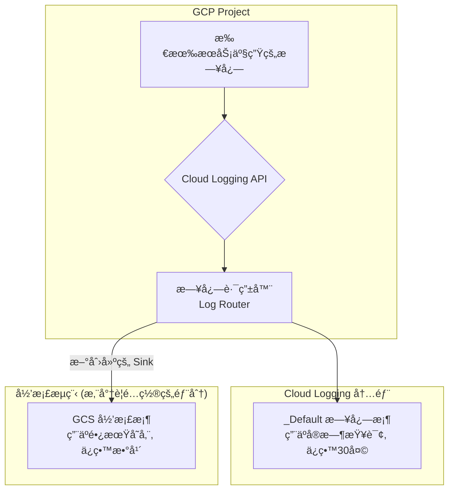

# summary

- analyze all the bucket Configure
- for some buckets using ç›´æ¥ä½¿ç”¨ Archive 存储类别
    - we have enabled lifecycle for some buckets
    -

# GCP 日志归档策略å®æ–½æŒ‡å—

## 概述

本文档详细介ç»å¦‚何在 GCP 项目中å®æ–½æ—¥å¿—归档策略，通过将日志ä»é«˜æˆæœ¬çš„ Cloud Logging 转移到ä½æˆæœ¬çš„ Google Cloud Storage (GCS) Archive 存储类别，å®ç°é•¿æœŸæˆæœ¬ä¼˜åŒ–。

## 归档策略的价值

### æˆæœ¬å¯¹æ¯”分æ

| å­˜å‚¨æ–¹å¼      | 注入æˆæœ¬         | 月存储æˆæœ¬ (æ¯ GiB) | 年存储æˆæœ¬ (1 TiB) | 适用场景       |
| ------------- | ---------------- | ------------------- | ------------------ | -------------- |
| Cloud Logging | $0.50/GiB        | $0.01/GiB           | $122.88            | å®æ—¶æŸ¥è¯¢å’Œåˆ†æ |
| GCS Standard  | å…è´¹ (通过 Sink) | $0.02/GiB           | $245.76            | 频ç¹è®¿é—®       |
| GCS Nearline  | å…è´¹ (通过 Sink) | $0.01/GiB           | $122.88            | 月度访问       |
| GCS Archive   | å…è´¹ (通过 Sink) | $0.0012/GiB         | $14.76             | 长期归档       |

**关键æ´å¯Ÿ**: 使用 GCS Archive 进行长期存储比 Cloud Logging 节çœçº¦ **88% çš„æˆæœ¬**。

## å®æ–½æ–¹æ¡ˆ

### 方案一：基础归档é…ç½®

#### 1. 创建 GCS 归档存储桶

```bash
#!/bin/bash
# create-archive-bucket.sh

PROJECT_ID="your-project-id"
BUCKET_NAME="${PROJECT_ID}-logs-archive"
REGION="us-central1"

echo "创建日志归档存储桶..."

# 创建存储桶，直æ¥ä½¿ç”¨ Archive 存储类别
gsutil mb -c ARCHIVE -l $REGION gs://$BUCKET_NAME

# 设置存储桶标签
gsutil label ch -l purpose:log-archive gs://$BUCKET_NAME
gsutil label ch -l cost-optimization:enabled gs://$BUCKET_NAME

echo "存储桶创建完æˆ: gs://$BUCKET_NAME"
```

#### 2. é…置生命周期策略

```bash
# 创建生命周期é…置文件
cat > lifecycle-policy.json << 'EOF'
{
  "lifecycle": {
    "rule": [
      {
        "action": {
          "type": "SetStorageClass",
          "storageClass": "ARCHIVE"
        },
        "condition": {
          "age": 0,
          "matchesStorageClass": ["STANDARD", "NEARLINE", "COLDLINE"]
        }
      },
      {
        "action": {
          "type": "Delete"
        },
        "condition": {
          "age": 2555
        }
      }
    ]
  }
}
EOF

# 应用生命周期策略
gsutil lifecycle set lifecycle-policy.json gs://$BUCKET_NAME

echo "生命周期策略é…置完æˆ"
```

#### 3. 创建日志æ¥æ”¶å™¨ (Log Sink)

```bash
# create-log-sink.sh

PROJECT_ID="your-project-id"
BUCKET_NAME="${PROJECT_ID}-logs-archive"
SINK_NAME="archive-all-logs"

echo "创建日志归档æ¥æ”¶å™¨..."

# 创建æ¥æ”¶å™¨ - 归档所有 INFO 级别以上的日志
gcloud logging sinks create $SINK_NAME \
  storage.googleapis.com/$BUCKET_NAME \
  --log-filter='severity>=INFO' \
  --project=$PROJECT_ID

# è·å–æ¥æ”¶å™¨çš„æœåŠ¡è´¦å·
SINK_SERVICE_ACCOUNT=$(gcloud logging sinks describe $SINK_NAME \
  --project=$PROJECT_ID \
  --format='value(writerIdentity)')

echo "æ¥æ”¶å™¨æœåŠ¡è´¦å·: $SINK_SERVICE_ACCOUNT"

# 为æ¥æ”¶å™¨æœåŠ¡è´¦å·æˆäºˆå­˜å‚¨æ¡¶å†™å…¥æƒé™
gsutil iam ch $SINK_SERVICE_ACCOUNT:objectCreator gs://$BUCKET_NAME

echo "日志归档æ¥æ”¶å™¨é…置完æˆ"
```

### 方案二：分级归档策略

#### 1. 多层级存储桶é…ç½®

```bash
#!/bin/bash
# create-tiered-archive.sh

PROJECT_ID="your-project-id"
REGION="us-central1"

# 创建ä¸åŒå±‚级的存储桶
declare -A BUCKETS=(
    ["hot"]="STANDARD"      # çƒ­æ•°æ® - 30天内
    ["warm"]="NEARLINE"     # æ¸©æ•°æ® - 30-90天
    ["cold"]="COLDLINE"     # å†·æ•°æ® - 90-365天
    ["archive"]="ARCHIVE"   # å½’æ¡£æ•°æ® - 365天以上
)

for tier in "${!BUCKETS[@]}"; do
    bucket_name="${PROJECT_ID}-logs-${tier}"
    storage_class="${BUCKETS[$tier]}"

    echo "创建 $tier 层存储桶: $bucket_name"
    gsutil mb -c $storage_class -l $REGION gs://$bucket_name

    # 设置标签
    gsutil label ch -l tier:$tier gs://$bucket_name
    gsutil label ch -l purpose:log-archive gs://$bucket_name
done

echo "分层存储桶创建完æˆ"
```

#### 2. 智能生命周期管ç†

```bash
# 为æ¯ä¸ªå­˜å‚¨æ¡¶é…置生命周期策略
create_lifecycle_policy() {
    local bucket_name=$1
    local tier=$2

    case $tier in
        "hot")
            cat > lifecycle-${tier}.json << 'EOF'
{
  "lifecycle": {
    "rule": [
      {
        "action": {"type": "SetStorageClass", "storageClass": "NEARLINE"},
        "condition": {"age": 30}
      }
    ]
  }
}
EOF
            ;;;;
        "warm")
            cat > lifecycle-${tier}.json << 'EOF'
{
  "lifecycle": {
    "rule": [
      {
        "action": {"type": "SetStorageClass", "storageClass": "COLDLINE"},
        "condition": {"age": 60}
      }
    ]
  }
}
EOF
            ;;;;
        "cold")
            cat > lifecycle-${tier}.json << 'EOF'
{
  "lifecycle": {
    "rule": [
      {
        "action": {"type": "SetStorageClass", "storageClass": "ARCHIVE"},
        "condition": {"age": 275}
      }
    ]
  }
}
EOF
            ;;;;
        "archive")
            cat > lifecycle-${tier}.json << 'EOF'
{
  "lifecycle": {
    "rule": [
      {
        "action": {"type": "Delete"},
        "condition": {"age": 2555}
      }
    ]
  }
}
EOF
            ;;;;
    esac

    gsutil lifecycle set lifecycle-${tier}.json gs://$bucket_name
    echo "生命周期策略已应用到 $bucket_name"
}

# 应用生命周期策略到所有存储桶
for tier in hot warm cold archive; do
    bucket_name="${PROJECT_ID}-logs-${tier}"
    create_lifecycle_policy $bucket_name $tier
done
```

#### 3. 智能日志路由é…ç½®

```bash
#!/bin/bash
# create-smart-routing.sh

PROJECT_ID="your-project-id"

# 创建ä¸åŒä¼˜å…ˆçº§çš„日志æ¥æ”¶å™¨
create_log_sink() {
    local sink_name=$1
    local bucket_tier=$2
    local log_filter=$3
    local description=$4

    bucket_name="${PROJECT_ID}-logs-${bucket_tier}"

    echo "创建æ¥æ”¶å™¨: $sink_name -> $bucket_name"

    gcloud logging sinks create $sink_name \
      storage.googleapis.com/$bucket_name \
      --log-filter="$log_filter" \
      --description="$description" \
      --project=$PROJECT_ID

    # è·å–并æˆæƒæœåŠ¡è´¦å·
    sink_sa=$(gcloud logging sinks describe $sink_name \
      --project=$PROJECT_ID \
      --format='value(writerIdentity)')

    gsutil iam ch $sink_sa:objectCreator gs://$bucket_name

    echo "æ¥æ”¶å™¨ $sink_name é…置完æˆ"
}

# 高优先级日志 -> 热存储 (便äºå¿«é€ŸæŸ¥è¯¢)
create_log_sink "critical-logs-sink" "hot" \
  'severity>=ERROR OR (protoPayload.serviceName="gke.googleapis.com" AND protoPayload.methodName~"create|delete")' \
  "Critical logs for immediate access"

# 审计日志 -> 温存储 (åˆè§„è¦æ±‚)
create_log_sink "audit-logs-sink" "warm" \
  'protoPayload.serviceName!="" AND severity>=INFO' \
  "Audit logs for compliance"

# 应用日志 -> 冷存储 (å¶å°”查询)
create_log_sink "application-logs-sink" "cold" \
  'resource.type="k8s_container" AND severity>=INFO' \
  "Application logs for historical analysis"

# 系统日志 -> 归档存储 (长期ä¿ç•™)
create_log_sink "system-logs-sink" "archive" \
  'resource.type="gce_instance" OR resource.type="k8s_node"' \
  "System logs for long-term archival"

echo "智能日志路由é…置完æˆ"
```

### 方案三：Terraform 自动化部署

#### 1. Terraform 归档模å—

```hcl
# terraform/modules/log-archive/main.tf

variable "project_id" {
  description = "GCP 项目 ID"
  type        = string
}

variable "region" {
  description = "存储桶区域"
  type        = string
  default     = "us-central1"
}

variable "retention_years" {
  description = "å½’æ¡£ä¿ç•™å¹´æ•°"
  type        = number
  default     = 7
}

# 归档存储桶
resource "google_storage_bucket" "log_archive" {
  name          = "${var.project_id}-logs-archive"
  location      = var.region
  storage_class = "ARCHIVE"

  # 防止æ„外删除
  lifecycle {
    prevent_destroy = true
  }

  # 版本æ§åˆ¶
  versioning {
    enabled = false
  }

  # 统一存储桶级访问
  uniform_bucket_level_access = true

  # 生命周期规则
  lifecycle_rule {
    condition {
      age = var.retention_years * 365
    }
    action {
      type = "Delete"
    }
  }

  # 标签
  labels = {
    purpose           = "log-archive"
    cost-optimization = "enabled"
    environment      = "all"
  }
}

# å…¨é‡æ—¥å¿—å½’æ¡£æ¥æ”¶å™¨
resource "google_logging_project_sink" "archive_sink" {
  name        = "archive-all-logs"
  destination = "storage.googleapis.com/${google_storage_bucket.log_archive.name}"

  # 归档所有 INFO 级别以上的日志
  filter = "severity>=INFO"

  # æ’除已ç»åœ¨å…¶ä»–æ¥æ”¶å™¨ä¸­å¤„ç†çš„日志，é¿å…é‡å¤
  exclusions {
    name        = "exclude-already-processed"
    description = "Exclude logs already processed by other sinks"
    filter      = "resource.type=\"k8s_container\" AND severity>=ERROR"
  }

  unique_writer_identity = true
}

# 为æ¥æ”¶å™¨æˆæƒ
resource "google_storage_bucket_iam_member" "archive_writer" {
  bucket = google_storage_bucket.log_archive.name
  role   = "roles/storage.objectCreator"
  member = google_logging_project_sink.archive_sink.writer_identity
}

# 分层归档存储桶
resource "google_storage_bucket" "tiered_archive" {
  for_each = {
    hot     = "STANDARD"
    warm    = "NEARLINE"
    cold    = "COLDLINE"
    archive = "ARCHIVE"
  }

  name          = "${var.project_id}-logs-${each.key}"
  location      = var.region
  storage_class = each.value

  uniform_bucket_level_access = true

  # 分层生命周期规则
  dynamic "lifecycle_rule" {
    for_each = each.key == "hot" ? [1] : []
    content {
      condition {
        age = 30
      }
      action {
        type          = "SetStorageClass"
        storage_class = "NEARLINE"
      }
    }
  }

  dynamic "lifecycle_rule" {
    for_each = each.key == "warm" ? [1] : []
    content {
      condition {
        age = 60
      }
      action {
        type          = "SetStorageClass"
        storage_class = "COLDLINE"
      }
    }
  }

  dynamic "lifecycle_rule" {
    for_each = each.key == "cold" ? [1] : []
    content {
      condition {
        age = 275
      }
      action {
        type          = "SetStorageClass"
        storage_class = "ARCHIVE"
      }
    }
  }

  dynamic "lifecycle_rule" {
    for_each = each.key == "archive" ? [1] : []
    content {
      condition {
        age = var.retention_years * 365
      }
      action {
        type = "Delete"
      }
    }
  }

  labels = {
    tier              = each.key
    purpose           = "log-archive"
    cost-optimization = "enabled"
  }
}

# 输出
output "archive_bucket_name" {
  description = "归档存储桶å称"
  value       = google_storage_bucket.log_archive.name
}

output "archive_sink_writer_identity" {
  description = "å½’æ¡£æ¥æ”¶å™¨çš„写入身份"
  value       = google_logging_project_sink.archive_sink.writer_identity
}

output "tiered_buckets" {
  description = "分层存储桶信æ¯"
  value = {
    for k, v in google_storage_bucket.tiered_archive : k => {
      name          = v.name
      storage_class = v.storage_class
      url           = v.url
    }
  }
}
```

#### 2. 使用 Terraform 模å—

```hcl
# main.tf

module "log_archive" {
  source = "./modules/log-archive"

  project_id       = "your-project-id"
  region          = "us-central1"
  retention_years = 7
}

# 输出归档信æ¯
output "archive_info" {
  value = {
    bucket_name     = module.log_archive.archive_bucket_name
    writer_identity = module.log_archive.archive_sink_writer_identity
    tiered_buckets  = module.log_archive.tiered_buckets
  }
}
```

## 归档策略最佳å®è·µ

### 1. æ•°æ®åˆ†ç±»ç­–ç•¥

```bash
# 按é‡è¦æ€§å’Œè®¿é—®é¢‘ç‡åˆ†ç±»æ—¥å¿—
create_classification_sinks() {
    local project_id=$1

    # 关键业务日志 - 热存储 (快速访问)
    gcloud logging sinks create critical-business-logs \
      storage.googleapis.com/${project_id}-logs-hot \
      --log-filter='severity>=ERROR AND (resource.type="k8s_container" OR resource.type="cloud_function")' \
      --project=$project_id

    # 安全审计日志 - 温存储 (åˆè§„è¦æ±‚)
    gcloud logging sinks create security-audit-logs \
      storage.googleapis.com/${project_id}-logs-warm \
      --log-filter='protoPayload.serviceName="iam.googleapis.com" OR protoPayload.serviceName="cloudresourcemanager.googleapis.com"' \
      --project=$project_id

    # 性能监æ§æ—¥å¿— - 冷存储 (分æ用途)
    gcloud logging sinks create performance-logs \
      storage.googleapis.com/${project_id}-logs-cold \
      --log-filter='resource.type="gce_instance" AND jsonPayload.message=~"performance|metrics"' \
      --project=$project_id

    # 调试日志 - 归档存储 (长期ä¿ç•™)
    gcloud logging sinks create debug-logs \
      storage.googleapis.com/${project_id}-logs-archive \
      --log-filter='severity=DEBUG OR severity=INFO' \
      --project=$project_id
}
```

### 2. æˆæœ¬ç›‘æ§å’Œä¼˜åŒ–

```bash
#!/bin/bash
# monitor-archive-costs.sh

PROJECT_ID="your-project-id"

echo "监æ§å½’档存储æˆæœ¬..."

# è·å–å„存储桶的大å°å’Œæˆæœ¬
for tier in hot warm cold archive; do
    bucket_name="${PROJECT_ID}-logs-${tier}"

    # è·å–存储桶大å°
    size_bytes=$(gsutil du -s gs://$bucket_name | awk '{print $1}')
    size_gb=$((size_bytes / 1024 / 1024 / 1024))

    # 计算月度æˆæœ¬ (简化计算)
    case $tier in
        "hot") cost_per_gb=0.020 ;;;
        "warm") cost_per_gb=0.010 ;;;
        "cold") cost_per_gb=0.004 ;;;
        "archive") cost_per_gb=0.0012 ;;;
    esac

    monthly_cost=$(echo "$size_gb * $cost_per_gb" | bc -l)

    echo "存储桶: $bucket_name"
    echo "  大å°: ${size_gb} GB"
    echo "  月度æˆæœ¬: \$$$(printf "%.2f" $monthly_cost)"
    echo ""
done

echo "æˆæœ¬ç›‘æ§å®Œæˆ"
```

### 3. æ•°æ®æ£€ç´¢ç­–ç•¥

```bash
#!/bin/bash
# retrieve-archived-logs.sh

# ä»å½’档存储中检索日志的脚本
retrieve_logs() {
    local bucket_name=$1
    local date_filter=$2
    local output_dir=$3

    echo "ä» $bucket_name 检索日志..."
    echo "日期过滤器: $date_filter"
    echo "输出目录: $output_dir"

    # 创建输出目录
    mkdir -p $output_dir

    # 列出匹é…的对象
    gsutil ls "gs://$bucket_name/**$date_filter*" > temp_file_list.txt

    # 批é‡ä¸‹è½½
    while read -r file_path; do
        echo "下载: $file_path"
        gsutil cp "$file_path" "$output_dir/"
    done < temp_file_list.txt

    # 清ç†ä¸´æ—¶æ–‡ä»¶
    rm temp_file_list.txt

    echo "日志检索完æˆï¼Œæ–‡ä»¶ä¿å­˜åœ¨: $output_dir"
}

# 使用示例
# retrieve_logs "your-project-logs-archive" "2024-01" "./retrieved_logs"
```

## å®æ–½æ£€æŸ¥æ¸…å•

### 准备阶段

- [ ] 确认项目æƒé™ (Storage Admin, Logging Admin)
- [ ] 选择存储区域 (考虑数æ®ä¸»æƒå’Œå»¶è¿Ÿ)
- [ ] 确定ä¿ç•™ç­–ç•¥ (æ ¹æ®åˆè§„è¦æ±‚)
- [ ] 规划存储桶命å规范

### å®æ–½é˜¶æ®µ

- [ ] 创建归档存储桶
- [ ] é…置生命周期策略
- [ ] 创建日志æ¥æ”¶å™¨
- [ ] æˆæƒæœåŠ¡è´¦å·æƒé™
- [ ] 测试日志æµå‘

### 验è¯é˜¶æ®µ

- [ ] 验è¯æ—¥å¿—正确路由到归档存储
- [ ] 检查存储桶æƒé™é…ç½®
- [ ] 测试日志检索æµç¨‹
- [ ] 监æ§æˆæœ¬å˜åŒ–

### 维护阶段

- [ ] 定期审查存储使用é‡
- [ ] 监æ§å½’æ¡£æˆæœ¬è¶‹åŠ¿
- [ ] 调整生命周期策略
- [ ] 更新访问æƒé™

## æ•…éšœæ’除

### 常è§é—®é¢˜

1. **日志未出ç°åœ¨å½’档存储桶**

    ```bash
    # 检查æ¥æ”¶å™¨çŠ¶æ€
    gcloud logging sinks describe SINK_NAME --project=PROJECT_ID

    # 检查æœåŠ¡è´¦å·æƒé™
    gsutil iam get gs://BUCKET_NAME
    ```

2. **存储æˆæœ¬é«˜äºé¢„期**

    ```bash
    # 检查存储类别分布
    gsutil ls -L -b gs://BUCKET_NAME

    # 分æ对象大å°åˆ†å¸ƒ
    gsutil du -h gs://BUCKET_NAME
    ```

3. **检索速度慢**
    ```bash
    # Archive 存储需è¦æ¢å¤æ—¶é—´
    # 考虑使用 Coldline 替代 Archive 用äºéœ€è¦å¿«é€Ÿè®¿é—®çš„æ•°æ®
    ```

## æˆæœ¬æ•ˆç›Šåˆ†æ

### å®æ–½å‰å对比

å‡è®¾é¡¹ç›®æ¯æœˆäº§ç”Ÿ 1TB 日志：

**å®æ–½å‰ (ä»… Cloud Logging)**:

- 注入æˆæœ¬: 1024 GB × $0.50 = $512
- 存储æˆæœ¬ (90 天): 1024 GB × $0.01 × 3 = $30.72
- 月度总æˆæœ¬: $542.72

**å®æ–½å (Cloud Logging + GCS Archive)**:

- 注入æˆæœ¬: 1024 GB × $0.50 = $512
- Cloud Logging 存储 (30 天): 1024 GB × $0.01 × 1 = $10.24
- GCS Archive 存储 (60 天): 1024 GB × $0.0012 × 2 = $2.46
- 月度总æˆæœ¬: $524.70

**月度节çœ**: $18.02 (3.3%)
**年度节çœ**: $216.24

éšç€æ—¶é—´æ¨ç§»ï¼Œå½’档数æ®é‡å¢åŠ ï¼ŒèŠ‚çœæ•ˆæœä¼šæ›´åŠ æ˜¾è‘—。

## 总结

通过å®æ–½ GCS 归档策略，您å¯ä»¥ï¼š

1. **显著é™ä½é•¿æœŸå­˜å‚¨æˆæœ¬** - Archive 存储比 Cloud Logging 便宜 88%
2. **ä¿æŒæ•°æ®å®Œæ•´æ€§** - 所有日志都被ä¿ç•™ï¼Œåªæ˜¯å­˜å‚¨ä½ç½®ä¸åŒ
3. **满足åˆè§„è¦æ±‚** - 长期ä¿ç•™å®¡è®¡å’Œå®‰å…¨æ—¥å¿—
4. **çµæ´»çš„检索选项** - æ ¹æ®éœ€è¦æ£€ç´¢å†å²æ•°æ®
5. **自动化管ç†** - 通过生命周期策略自动转æ¢å­˜å‚¨ç±»åˆ«

建议ä»å•ä¸€å½’档存储桶开始，然åæ ¹æ®å®é™…需求é€æ­¥å®æ–½åˆ†å±‚归档策略。

# ChatGPT

👌 好问题，这个就是 **日志归档（Archival）** 的最佳å®è·µï¼Œå°¤å…¶æ˜¯å½“ä½ è¦å‡å°‘ Logging 的存储费用，但åˆä¸æƒ³å½»åº•ä¸¢æ‰å†å²æ—¥å¿—时。

在 GCP 里å®ç° **日志归档到 GCS**，主è¦ä¾èµ– **Log Sink**（日志汇èšå™¨ï¼‰ã€‚

---

## **一ã€æ•´ä½“æ€è·¯**

1. **创建日志æ¥æ”¶å™¨ (Sink)** → æŠŠæ—¥å¿—ä» \_Default / \_Required 导出到 GCS。
2. **选择目标存储桶** →
3. **æ§åˆ¶å¯¼å‡ºèŒƒå›´** → ä½ å¯ä»¥åªå¯¼å‡ºç‰¹å®šç¯å¢ƒ / 特定日志等级（如 ERROR）。
4. **ä¿ç•™å‘¨æœŸç­–ç•¥** → Cloud Logging 的桶ä¿ç•™æ—¶é—´å¯ä»¥çŸ­ï¼ˆå¦‚ 7 å¤©ï¼‰ï¼Œé•¿æœŸæ—¥å¿—é  GCS ä¿å­˜ã€‚

---

## **二ã€å®ç°æ­¥éª¤**

### **1. 创建 GCS 桶（Archive 存储类别）**

```bash
# 1. 定义å˜é‡ (请根æ®æ‚¨çš„项目进行修改)
PROJECT_ID="your-gcp-project-id"
REGION="us-central1" # 选择离您æœåŠ¡è¿‘的区域
BUCKET_NAME="${PROJECT_ID}-log-archive-bucket" # æ¨è使用项目ID作为å‰ç¼€ï¼Œç¡®ä¿å称唯一

# 2. 创建 GCS 存储桶
# -c ARCHIVE: 指定默认存储类别为 Archive，这是æˆæœ¬æœ€ä½çš„类别。
# -l $REGION: 指定存储桶所在的地ç†ä½ç½®ã€‚
# -p $PROJECT_ID: 指定该存储桶所å±çš„项目。
gsutil mb -c ARCHIVE -l $REGION -p $PROJECT_ID gs://$BUCKET_NAME
```

### **2. 创建日志æ¥æ”¶å™¨ (Sink) 以导出日志**

æ¥ä¸‹æ¥ï¼Œæˆ‘们需è¦å‘Šè¯‰ Cloud Logging 将日志路由到我们刚刚创建的 GCS 桶中。这通过创建“日志æ¥æ”¶å™¨ (Log Sink)â€æ¥å®ç°ã€‚

```bash
# 1. 定义å˜é‡
SINK_NAME="archive-all-logs-to-gcs"
DESTINATION_BUCKET="storage.googleapis.com/${BUCKET_NAME}"

# 2. 创建日志æ¥æ”¶å™¨
# --log-filter: 这是最é‡è¦çš„å‚数之一，用äºå†³å®šå“ªäº›æ—¥å¿—需è¦è¢«å½’档。
#               留空或设置为 "severity>=DEFAULT" å¯å½’档所有日志。
#               设置为 "severity>=INFO" 是一个常è§çš„良好å®è·µã€‚
# --description: 为您的æ¥æ”¶å™¨æ·»åŠ æ述，方便未æ¥ç®¡ç†ã€‚
gcloud logging sinks create $SINK_NAME $DESTINATION_BUCKET \
  --log-filter="severity>=INFO" \
  --description="将所有INFOåŠä»¥ä¸Šçº§åˆ«çš„日志归档到GCS" \
  --project=$PROJECT_ID
```

### **3. 为æ¥æ”¶å™¨æˆæƒ (关键步骤)**

创建æ¥æ”¶å™¨å，GCP 会为其生æˆä¸€ä¸ªä¸“用的æœåŠ¡è´¦å·ï¼ˆService Account），称为“写入者身份 (Writer Identity)â€ã€‚您必须æˆäºˆè¿™ä¸ªæœåŠ¡è´¦å·å‘目标 GCS 存储桶写入数æ®çš„æƒé™ï¼Œå¦åˆ™æ—¥å¿—将无法导出。

```bash
# 1. è·å–æ¥æ”¶å™¨çš„æœåŠ¡è´¦å· (Writer Identity)
SINK_WRITER_IDENTITY=$(gcloud logging sinks describe $SINK_NAME \
  --project=$PROJECT_ID \
  --format='value(writerIdentity)')

echo "æ¥æ”¶å™¨çš„æœåŠ¡è´¦å·ä¸º: $SINK_WRITER_IDENTITY"

# 2. å°† '存储对象创建者 (roles/storage.objectCreator)' 角色æˆäºˆè¯¥æœåŠ¡è´¦å·
# è¿™å…许æœåŠ¡è´¦å·åœ¨æŒ‡å®šçš„GCS桶中创建（å³å†™å…¥ï¼‰æ—¥å¿—文件。
gsutil iam ch $SINK_WRITER_IDENTITY:objectCreator gs://$BUCKET_NAME
```

### **4. 验è¯é…ç½®**

é…置完æˆå，等待几分钟，然å进行验è¯ï¼Œä»¥ç¡®ä¿ä¸€åˆ‡æ­£å¸¸å·¥ä½œã€‚

```bash
# 1. 检查æ¥æ”¶å™¨çŠ¶æ€ï¼Œç¡®ä¿æ²¡æœ‰é”™è¯¯
gcloud logging sinks describe $SINK_NAME --project=$PROJECT_ID

# 2. 检查GCS桶中是å¦å·²å¼€å§‹å‡ºç°æ—¥å¿—文件
# 日志文件会按 å¹´/月/æ—¥ 的目录结æ„存放。
gsutil ls gs://$BUCKET_NAME/
```

å¦‚æœ `gsutil ls` 命令返å›äº†ä»¥æ—¥å¿—å称命å的文件夹，说æ˜æ‚¨çš„归档策略已æˆåŠŸé…置并开始è¿è¡Œã€‚

---

## 总结

通过以上四个步骤，您已ç»æˆåŠŸå»ºç«‹äº†ä¸€ä¸ªåŸºç¡€ä½†åŠŸèƒ½å®Œå¤‡çš„日志归档系统。这个系统会自动将您项目中的日志导出到ä½æˆæœ¬çš„ GCS Archive 存储中，既满足了长期数æ®ä¿ç•™çš„åˆè§„性需求，åˆæ大地优化了您的日志存储æˆæœ¬ã€‚



---

# Claude

针对 GCS 归档策略的é…置，我将为您æ供完整的å®ç°æ–¹æ¡ˆã€‚

## GCS 归档策略é…ç½®

### 1. 创建归档存储桶

```bash
# 创建专用的归档存储桶
gsutil mb -c ARCHIVE -l us-central1 gs://your-project-archive-logs

# 或者创建标准存储桶å通过生命周期策略转æ¢
gsutil mb -c STANDARD -l us-central1 gs://your-project-logs
```

### 2. é…置生命周期管ç†ç­–ç•¥

```json
{
	"lifecycle": {
		"rule": [
			{
				"action": {
					"type": "SetStorageClass",
					"storageClass": "NEARLINE"
				},
				"condition": {
					"age": 30,
					"matchesStorageClass": ["STANDARD"]
				}
			},
			{
				"action": {
					"type": "SetStorageClass",
					"storageClass": "COLDLINE"
				},
				"condition": {
					"age": 90,
					"matchesStorageClass": ["NEARLINE"]
				}
			},
			{
				"action": {
					"type": "SetStorageClass",
					"storageClass": "ARCHIVE"
				},
				"condition": {
					"age": 365,
					"matchesStorageClass": ["COLDLINE"]
				}
			},
			{
				"action": {
					"type": "Delete"
				},
				"condition": {
					"age": 2555
				}
			}
		]
	}
}
```

```bash
# 应用生命周期策略
gsutil lifecycle set lifecycle.json gs://your-project-logs
```

### 3. Cloud Logging å½’æ¡£æ¥æ”¶å™¨é…ç½®

```bash
# 创建归档日志æ¥æ”¶å™¨
gcloud logging sinks create archive-sink \
    storage.googleapis.com/your-project-archive-logs \
    --log-filter='timestamp >= "2024-01-01T00:00:00Z"'

# 创建按日期分区的æ¥æ”¶å™¨
gcloud logging sinks create daily-archive-sink \
    "storage.googleapis.com/your-project-logs/logs/year=%Y/month=%m/day=%d" \
    --log-filter='severity >= "INFO"'
```

### 4. 存储类别对比表

| 存储类别 | è®¿é—®é¢‘ç‡ | 最短存储时间 | 检索费用 | 月存储æˆæœ¬/GB |
| -------- | -------- | ------------ | -------- | ------------- |
| STANDARD | 频ç¹è®¿é—® | æ—            | æ—        | $0.020        |
| NEARLINE | 月度访问 | 30 天        | $0.01/GB | $0.010        |
| COLDLINE | 季度访问 | 90 天        | $0.02/GB | $0.004        |
| ARCHIVE  | 年度访问 | 365 天       | $0.05/GB | $0.0012       |

### 5. Terraform é…置示例

```hcl
# 归档存储桶
resource "google_storage_bucket" "archive_logs" {
  name     = "${var.project_id}-archive-logs"
  location = var.region

  storage_class = "ARCHIVE"

  versioning {
    enabled = true
  }

  lifecycle_rule {
    condition {
      age = 30
      matches_storage_class = ["STANDARD"]
    }
    action {
      type          = "SetStorageClass"
      storage_class = "NEARLINE"
    }
  }

  lifecycle_rule {
    condition {
      age = 90
      matches_storage_class = ["NEARLINE"]
    }
    action {
      type          = "SetStorageClass"
      storage_class = "COLDLINE"
    }
  }

  lifecycle_rule {
    condition {
      age = 365
      matches_storage_class = ["COLDLINE"]
    }
    action {
      type          = "SetStorageClass"
      storage_class = "ARCHIVE"
    }
  }

  lifecycle_rule {
    condition {
      age = 2555  # 7å¹´å删除
    }
    action {
      type = "Delete"
    }
  }
}

# 日志æ¥æ”¶å™¨
resource "google_logging_project_sink" "archive_sink" {
  name        = "archive-sink"
  destination = "storage.googleapis.com/${google_storage_bucket.archive_logs.name}"

  filter = <<EOF
timestamp >= "2024-01-01T00:00:00Z"
severity >= "INFO"
EOF

  unique_writer_identity = true
}

# ç»™æ¥æ”¶å™¨æœåŠ¡è´¦å·å­˜å‚¨æƒé™
resource "google_storage_bucket_iam_member" "archive_sink_writer" {
  bucket = google_storage_bucket.archive_logs.name
  role   = "roles/storage.objectCreator"
  member = google_logging_project_sink.archive_sink.writer_identity
}
```

### 6. å½’æ¡£æµç¨‹å›¾

```mermaid
flowchart TD
    A[应用日志] --> B[Cloud Logging]
    B --> C{日志过滤器}
    C -->|匹é…| D[å½’æ¡£æ¥æ”¶å™¨]
    C -->|ä¸åŒ¹é…| E[标准日志ä¿ç•™]
    D --> F[GCS存储桶]
    F --> G[STANDARD存储类别]
    G -->|30天å| H[NEARLINE存储类别]
    H -->|90天å| I[COLDLINE存储类别]
    I -->|365天å| J[ARCHIVE存储类别]
    J -->|7å¹´å| K[自动删除]

    subgraph æˆæœ¬ä¼˜åŒ–
        L[频ç¹è®¿é—®: $0.020/GB/月]
        M[月度访问: $0.010/GB/月]
        N[季度访问: $0.004/GB/月]
        O[年度访问: $0.0012/GB/月]
    end

    G -.-> L
    H -.-> M
    I -.-> N
    J -.-> O
```

### 7. 监æ§å’Œå‘Šè­¦è®¾ç½®

```yaml
# monitoring.yaml
apiVersion: monitoring.coreos.com/v1
kind: PrometheusRule
metadata:
  name: gcs-archive-monitoring
spec:
  groups:
  - name: gcs-archive.rules
    rules:
    - alert: HighArchiveStorageCost
      expr: gcs_bucket_size_bytes{storage_class="ARCHIVE"} > 1000000000000
      for: 1h
      annotations:
        summary: "归档存储æˆæœ¬è¿‡é«˜"
        description: "归档存储超过1TB，请检查归档策略"
```

```bash
# 设置存储预算告警
gcloud billing budgets create \
    --billing-account=BILLING_ACCOUNT_ID \
    --display-name="GCS Archive Budget" \
    --budget-amount=500USD \
    --threshold-rules-percent=50,75,90,100 \
    --services=services/95FF2355-5EA1-4552-9139-518C70635437
```

### 8. å®ç”¨è„šæœ¬

```bash
#!/bin/bash
# archive_setup.sh - 自动é…置归档策略

PROJECT_ID="your-project-id"
BUCKET_NAME="${PROJECT_ID}-archive-logs"
REGION="us-central1"

# 创建存储桶
echo "Creating archive bucket..."
gsutil mb -c STANDARD -l $REGION gs://$BUCKET_NAME

# 应用生命周期策略
echo "Applying lifecycle policy..."
gsutil lifecycle set lifecycle.json gs://$BUCKET_NAME

# 创建日志æ¥æ”¶å™¨
echo "Creating log sink..."
gcloud logging sinks create archive-sink \
    storage.googleapis.com/$BUCKET_NAME \
    --log-filter='severity >= "INFO"'

# 设置IAMæƒé™
echo "Setting up IAM permissions..."
SINK_SERVICE_ACCOUNT=$(gcloud logging sinks describe archive-sink --format="value(writerIdentity)")
gsutil iam ch ${SINK_SERVICE_ACCOUNT}:objectCreator gs://$BUCKET_NAME

echo "Archive setup completed!"
```

### 9. æˆæœ¬ä¼˜åŒ–建议

- **日志过滤**: åªå½’æ¡£é‡è¦æ—¥å¿—，é¿å… DEBUG 级别日志
- **å‹ç¼©**: å¯ç”¨ gzip å‹ç¼©å‡å°‘存储空间
- **分区策略**: 按时间分区便äºç®¡ç†å’Œæ£€ç´¢
- **定期审查**: 定期检查归档策略的有效性

这套é…置将帮您å®ç°å®Œæ•´çš„ GCS 归档策略，既能满足åˆè§„è¦æ±‚åˆèƒ½æœ‰æ•ˆæ§åˆ¶æˆæœ¬ã€‚
