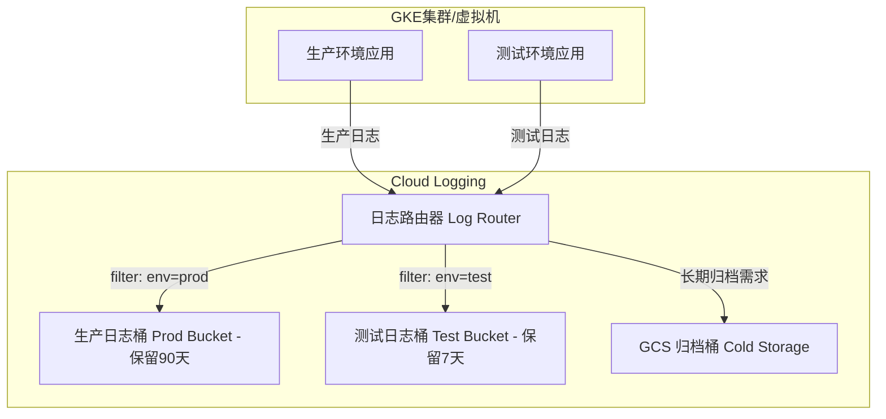

# GCP 日志成本优化与治理权威指南

## 前言

在云原生时代，日志是保障系统可观测性的基石，但其成本也常常成为企业上云的沉重负担。本指南旨在为您提供一套系统性的 Google Cloud (GCP) 日志成本优化与治理方案。我们将从成本的根源入手，深入探讨日志的生命周期管理、GKE 集群的精细化过滤策略，并通过自动化脚本赋能您的 FinOps 实践，最终实现技术可观测性与财务可持续性之间的完美平衡。

---

## 第 1 节：解构日志成本：钱花在了哪里？

GCP 日志的成本主要由两部分构成，理解这两者的差异是制定优化策略的出发点。

1.  **注入成本 (Ingestion Cost)**：这是成本的大头。当日志被发送并写入 Cloud Logging 时，GCP 会按数据量收取一次性费用（约 $0.5/GiB）。这笔费用包含了日志的实时索引、查询和分析能力。
2.  **存储成本 (Retention Cost)**：对于存储超过默认期限（通常是30天）的日志，GCP 会收取相对低廉的月度存储费（约 $0.01/GiB/月）。

**核心洞察**：**阻止 1GB 的无用日志被写入，比将 1GB 的日志存储时间从30天缩短到7天，能节省约50倍的成本。** 因此，我们的首要目标是**减少注入量**。

### 主要成本来源

- **审计日志 (Audit Logs)**：特别是数据访问日志 (Data Access Logs)，体量巨大，是潜在的成本黑洞。
- **GKE 系统与工作负载日志**：`kubelet`、`containerd` 等系统组件和应用容器产生的日志。
- **应用日志 (Application Logs)**：业务应用直接输出的日志，其数量和质量直接影响成本。

---

## 第 2 节：日志生命周期与保留策略

针对您关注的“确保测试环境和PRD环境一致，但保留时间完全控制”的需求，最佳实践是为不同环境配置差异化的日志保留策略。

### 核心原则：分环境、分水桶

我们不直接修改 `_Default` 桶，而是创建自定义日志桶 (Log Bucket)，为不同环境量身定制保留策略。



### 实施步骤 (`gcloud` CLI)

1.  **创建自定义日志桶**

    ```bash
    # 为测试环境创建，保留7天
    gcloud logging buckets create test-logs-bucket \
      --location=global \
      --retention-days=7 \
      --project=YOUR_TEST_PROJECT_ID

    # 为生产环境创建，保留90天
    gcloud logging buckets create prod-logs-bucket \
      --location=global \
      --retention-days=90 \
      --project=YOUR_PROD_PROJECT_ID
    ```

2.  **创建日志接收器 (Sink) 以路由日志**

    ```bash
    # 将测试项目的日志路由到新创建的测试桶
    gcloud logging sinks create test-env-sink \
      logging.googleapis.com/projects/YOUR_TEST_PROJECT_ID/locations/global/buckets/test-logs-bucket \
      --project=YOUR_TEST_PROJECT_ID \
      --log-filter='resource.labels.project_id="YOUR_TEST_PROJECT_ID"'

    # 对生产项目执行类似操作
    gcloud logging sinks create prod-env-sink \
      logging.googleapis.com/projects/YOUR_PROD_PROJECT_ID/locations/global/buckets/prod-logs-bucket \
      --project=YOUR_PROD_PROJECT_ID \
      --log-filter='resource.labels.project_id="YOUR_PROD_PROJECT_ID"'
    ```

通过这种方式，您可以精确控制每个环境的日志保留成本，同时保持日志内容和格式的一致性。

---

## 第 3 节：GKE 精准过滤：实用配方 (Recipes)

这是成本优化的核心环节。通过在日志注入前使用排除过滤器 (Exclusion Filters)，我们可以丢弃大量低价值、高频率的“噪音”日志。

### 在哪里配置？

导航至 **日志记录 (Logging) > 日志路由器 (Logs Router)**，编辑 `_Default` 接收器或您自定义的接收器，在“排除项”中添加规则。

### 实用配方清单

以下是一些可直接复制使用的过滤器，能覆盖80%的GKE噪音场景：

1.  **排除 Kubernetes 健康检查日志**
    K8s 的 `livenessProbe` 和 `readinessProbe` 会产生海量、重复的日志。

    ```sql
    -- 过滤器名称: exclude-k8s-health-checks
    -- 过滤器规则:
    resource.type="k8s_container" AND httpRequest.userAgent =~ "kube-probe"
    ```

2.  **排除低严重性日志 (非生产环境)**
    在开发和测试环境中，通常只关心 `WARNING` 级别以上的日志。

    ```sql
    -- 过滤器名称: exclude-low-severity-logs
    -- 过滤器规则:
    resource.type="k8s_container" AND severity < WARNING
    ```

3.  **排除特定高频噪音的容器**
    服务网格的边车 (如 `istio-proxy`) 或其他监控代理是主要的噪音源。

    ```sql
    -- 过滤器名称: exclude-istio-proxy
    -- 过滤器规则:
    resource.type="k8s_container" AND resource.labels.container_name="istio-proxy"
    ```

4.  **使用采样 (Sampling) 过滤高流量日志**
    对于某些对调试有一定价值但频率极高的日志，可以只保留一小部分样本。

    ```sql
    -- 过滤器名称: sample-high-traffic-logs
    -- 过滤器规则:
    -- 假设这是某个高频的业务日志，我们只注入5%的样本
    resource.type="k8s_container" AND jsonPayload.message =~ "User login successful" AND sample(insertId, 0.05)
    ```

---

## 第 4 节：审计与监控脚本

为了让您能快速掌握当前 GCP 项目的日志配置现状，我为您准备了一个检查脚本。该脚本可以帮助您识别哪些项目需要进行优化。

### `audit-gcp-logging.sh`

```bash
#!/bin/bash
#
# audit-gcp-logging.sh - 一个用于审计GCP项目日志配置的脚本
#
# 功能:
# 1. 列出当前用户可访问的所有GCP项目。
# 2. 对每个项目，获取其日志桶的保留策略。
# 3. 对每个项目，列出其配置的日志接收器 (Sinks) 和排除项 (Exclusions)。
# 4. 检查当前 kubectl 上下文中的 GKE 集群日志配置。

set -e
echo "### GCP 日志配置审计脚本 ###"
echo ""

# 获取所有可访问的项目ID
PROJECT_IDS=$(gcloud projects list --format="value(projectId)" --sort-by=projectId)

if [ -z "$PROJECT_IDS" ]; then
    echo "错误：无法获取GCP项目列表。请确保您已通过 'gcloud auth login' 和 'gcloud auth application-default login' 认证。"
    exit 1
fi

echo "发现以下项目，将逐一检查："
echo "$PROJECT_IDS"
echo "=================================================="

for project in $PROJECT_IDS; do
    echo "项目: $project"
    echo "--------------------------------------------------"

    # 设置当前项目
    gcloud config set project "$project" > /dev/null

    # 1. 检查日志桶配置
    echo "[1] 日志桶 (Log Buckets) 配置:"
    buckets=$(gcloud logging buckets list --project="$project" --format="table(name,retentionDays,location)")
    if [ -z "$buckets" ]; then
        echo "  未找到自定义日志桶。"
    else
        echo "$buckets"
    fi
    echo ""

    # 2. 检查日志接收器 (Sinks)
    echo "[2] 日志接收器 (Sinks) 配置:"
    sinks=$(gcloud logging sinks list --project="$project" --format="table(name,destination,filter)")
    if [[ "$sinks" == *"Listed 0 items."* ]]; then
        echo "  未找到日志接收器。"
    else
        echo "$sinks"
    fi
    echo ""

    # 3. 检查排除项 (Exclusions)
    echo "[3] 全局排除项 (Exclusions) 配置:"
    exclusions=$(gcloud logging exclusions list --project="$project" --format="table(name,filter,disabled)")
    if [[ "$exclusions" == *"Listed 0 items."* ]]; then
        echo "  未找到全局排除项。"
    else
        echo "$exclusions"
    fi
    echo ""
    echo "=================================================="
done


# 4. 检查GKE集群配置
echo "检查当前 kubectl 上下文中的 GKE 集群..."
CURRENT_CONTEXT=$(kubectl config current-context)
if [ -z "$CURRENT_CONTEXT" ]; then
    echo "警告: 未找到有效的 kubectl 上下文，跳过 GKE 检查。"
else
    echo "当前上下文: $CURRENT_CONTEXT"
    # 从上下文中提取集群名称和位置/区域
    CLUSTER_NAME=$(kubectl config get-contexts "$CURRENT_CONTEXT" --no-headers | awk '{print $3}')
    LOCATION=$(gcloud container clusters list --filter="name=$CLUSTER_NAME" --format="value(location)")

    if [ -n "$CLUSTER_NAME" ] && [ -n "$LOCATION" ]; then
        echo "[4] GKE 集群 ($CLUSTER_NAME) 日志配置:"
        gcloud container clusters describe "$CLUSTER_NAME" --location "$LOCATION" \
          --format="value(loggingConfig.enableComponents)"
    else
        echo "无法从当前 kubectl 上下文确定 GKE 集群信息。"
    fi
fi

echo ""
echo "审计完成。"
```

### 如何使用此脚本

1.  将以上内容保存为 `audit-gcp-logging.sh` 文件。
2.  在您的终端中，授予其执行权限：`chmod +x audit-gcp-logging.sh`。
3.  确保您已安装并登录 `gcloud` CLI 和 `kubectl`。
4.  运行脚本：`./audit-gcp-logging.sh`。

脚本将输出一份清晰的报告，展示每个项目的日志保留天数、路由规则和过滤规则，帮助您快速定位高成本风险点。

---

## 结论与行动建议

1.  **立即行动**：使用提供的审计脚本，全面盘点您所有GCP项目的日志配置。
2.  **区分环境**：为非生产环境（开发、测试）创建独立的日志桶，并设置较短的保留期（如7-14天）。
3.  **应用过滤器**：将本指南中的GKE排除过滤器配方，应用到所有环境中，特别是针对健康检查和边车代理的过滤器。
4.  **审查审计日志**：与您的GCP管理员合作，审查并禁用非生产环境中非必要的数据访问审计日志。
5.  **拥抱自动化**：将日志配置（桶、接收器、过滤器）纳入您的 Terraform 或 IaC 流程中，实现标准化和版本控制。

通过以上组合拳，您可以在不牺牲关键可观测性的前提下，将GCP日志成本降低50%甚至更多。
