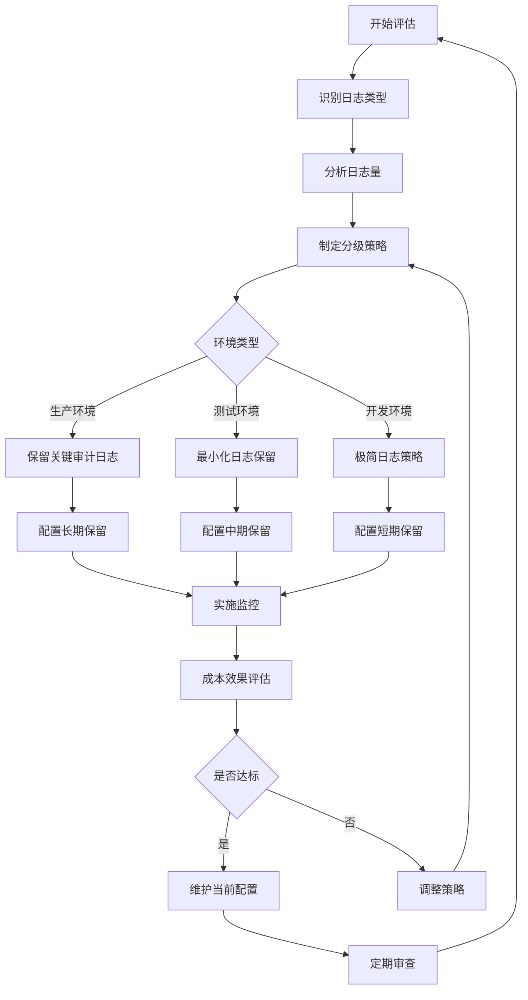

# Summay

# ask
```bash
考虑到 GCP 的成本控制，我们希望调整或优化 GCP 项目日志。
我们目前使用 GCP 项目，管理员正在审查是否可以在组织层级禁用部分审计日志。
我们也可以检查是否能采取类似的措施。下面部分就是我想要的一些控制或者说操作方案.
例如，在 GCP 项目和 GKE 集群层面进行一些配置调整。
为所有非生产环境更新日志保留策略。
换句话说，我们可能需要在工程层面建立相应的管控措施。我想探索是否存在一种良好方案，或具体如何实现。
比如日志的成本来源分析,我也比较关注比如日志的级别比如我为了确保测试环境和PRD环境一致,不做调整,但是保留时间我可以完全控制,所以关于这部分需要详细探索下日志生命周期与保留策略,
GKE 排除过滤器的实用配方也可以存在
另外我也需要写一个脚本来获取我比如某个GCP工程的一些跟日志有关的配置.比如说GKE ,Buckets 之类的
```


# Gemini
# 谷歌云日志成本优化战略指南：以 GKE 为核心

## 第 1 节：解构 GCP 日志成本模型

为了有效控制和优化 Google Cloud Platform (GCP) 的日志成本，首先必须深入理解其计费模型的内在逻辑。成本并非单一维度，而是由日志生命周期中的多个环节共同构成。精准识别这些成本驱动因素，是制定任何优化策略的基石。本节将详细剖析 GCP 日志的计费结构，并重点分析源自 Google Kubernetes Engine (GKE) 的主要成本来源。

### 1.1 日志账单剖析：日志注入与存储

GCP Cloud Logging 的计费模型主要围绕两大核心环节：数据注入 (Ingestion) 和数据保留 (Retention)。这种双重结构的设计，极大地影响了成本优化的策略方向 1。

- **注入成本 (Ingestion Cost)**：这是日志成本的主要组成部分。当日志条目被发送到 Cloud Logging API 并存储于日志存储桶 (Log Bucket) 中时，GCP 会收取一次性的注入费用。标准定价为每 GiB 0.50 美元。这项费用不仅涵盖了日志的接收，还包括了长达 30 天的索引、查询和分析能力 1。这意味着，无论日志在第一个月内存储一天还是三十天，其主要的初始成本都已产生。
    
- **免费配额 (Free Tier)**：为了方便用户入门和支持小型项目，GCP 为每个项目提供了每月首个 50 GiB 的免费日志注入配额 1。对于许多初创项目或小型开发环境而言，这个额度可能在初期足以覆盖所有日志费用。然而，这种免费配额也可能成为成本管理的“双刃剑”。它容易在项目初期掩盖潜在的日志成本问题，一旦应用规模扩大或部署了日志输出冗长的服务，日志量会迅速超过免费额度，导致预期之外的费用激增。因此，即便在免费额度内，也应从项目伊始就建立成本意识和优化实践，将免费配-额视为成本缓冲，而非运营基线。
    
- **保留成本 (Retention Cost)**：对于需要将日志存储超过默认 30 天（或自定义的更短期限）的场景，GCP 会收取额外的存储费用。该费用远低于注入成本，定价为每月每 GiB 0.01 美元 1。这种显著的价格差异揭示了一个核心的优化原则：阻止不必要的日志被注入，其成本效益远高于缩短已注入日志的保留时间。仅仅将保留期从 30 天缩短至 7 天，对总账单的影响微乎其微，因为这只节省了极小部分的存储费用。相比之下，通过过滤器阻止 1 GiB 的日志进入系统，则直接节省了 0.50 美元的注入费。
    
- **免费功能**：值得注意的是，Cloud Logging 中一些关键的架构组件是免费的。例如，作为日志过滤与路由核心的日志路由器 (Log Router) 本身不产生额外费用。同样，将日志存储桶升级以使用 Log Analytics 功能（支持 SQL 查询）也是免费的 1。这鼓励用户积极利用这些高级功能来构建更精细化的日志管理流程，而无需担心工具本身带来额外成本。
    

### 1.2 识别 GKE 的主要成本驱动因素

一个活跃的 GKE 集群会产生多种类型的日志流，它们的来源、价值和体量各不相同。识别并分类这些日志源是实施精准优化的前提。

- **应用日志 (`WORKLOAD`)**：这是由用户部署在 GKE 节点上的非系统容器产生的日志，通常被写入标准输出 (`stdout`) 和标准错误 (`stderr`) 3。这类日志的体量完全取决于应用程序自身的行为，是日志量最大且最不稳定的来源。一个配置不当或处于调试模式的应用程序，可能在短时间内产生海量的日志，成为最主要的成本驱动因素。
    
- **系统日志 (`SYSTEM`)**：这类日志源自维持 GKE 集群正常运行的核心组件，包括运行在 `kube-system`、`gke-system` 等命名空间下的 Pod，以及节点上的 `kubelet`、容器运行时 (containerd/docker) 等关键服务 3。这些日志对于诊断集群健康状况、排查节点问题至关重要，是保障稳定性的基础。
    
- **审计日志 (Audit Logs)**：这是一类特殊的、强制生成的日志，用于记录“谁在何时何地做了什么”，对安全审计和合规性至关重要。审计日志本身又分为几种类型 4：
    
    - **管理员活动日志 (Admin Activity Logs)**：记录修改资源配置或元数据的 API 调用，例如创建 GKE 集群或更改 IAM 策略。这类日志始终被写入，无法被禁用或排除 4。
        
    - **系统事件日志 (System Event Logs)**：记录由 Google 系统而非用户直接操作引发的资源配置变更，例如 GKE 节点池的自动扩缩容。这类日志同样是强制性的，无法禁用 4。
        
    - **数据访问日志 (Data Access Logs)**：记录读取资源配置、元数据或用户数据的 API 调用。这类日志的体量可能极其庞大。除 BigQuery 外，大多数服务的该类型日志默认处于禁用状态 4。在开发环境中，无意中启用对 Cloud Storage 或 Cloud SQL 等服务的数据访问日志，是导致日志费用意外飙升的常见“陷阱”。
        

### 表 1：长期日志存储成本对比分析

为了直观地展示不同存储方案在成本上的巨大差异，下表对在不同 GCP 服务中存储 1 TiB 日志一年的总成本进行了估算。该分析清晰地证明了将日志归档至低成本存储服务的经济价值，为第四节中讨论的日志归档策略提供了数据支持。

|服务|一次性注入成本 (1 TiB)|月度存储成本 (每 TiB)|年度存储成本 (1 TiB)|年度总成本 (注入 + 存储)|
|---|---|---|---|---|
|Cloud Logging (标准保留)|$512.00 ($0.50/GiB)|$10.24 ($0.01/GiB)|$122.88|$634.88|
|Cloud Storage (Standard)|$0.00 (通过 Sink 导出)|~$20.48|~$245.76|~$245.76|
|Cloud Storage (Nearline)|$0.00 (通过 Sink 导出)|~$10.24|~$122.88|~$122.88|
|Cloud Storage (Archive)|$0.00 (通过 Sink 导出)|~$1.23|~$14.76|~$14.76|
|BigQuery (Active Logical)|$0.00 (通过 Sink 导出)|~$23.55|~$282.60|~$282.60|

注：Cloud Storage 和 BigQuery 的存储成本基于 `us-central1` 区域的公开价格估算，实际费用可能因区域和具体使用情况而异。通过日志接收器 (Sink) 导出日志到这些目标服务是免费的 7。

此表清晰地表明，将日志归档至 Cloud Storage Archive 类别进行长期存储，其成本远低于将其保留在 Cloud Logging 中。这为实施“热数据在 Logging，冷数据在 GCS”的分层存储策略提供了强有力的经济依据。

## 第 2 节：基础控制：配置 GKE 日志生成

成本优化的第一个干预点，也是最直接的控制手段，是在日志生成的源头——GKE 集群本身——进行配置。通过控制 GKE 向 Cloud Logging API 发送哪些类型的日志，可以从宏观上对日志体量进行管理。这是一种宽泛但高效的“总开关”式策略。

### 2.1 从源头控制日志收集：`SYSTEM` 与 `WORKLOAD`

GKE 提供了在集群级别配置日志收集范围的选项，允许用户精确选择要启用的日志组件 9。

- **核心选项**：两个主要的配置值是 `SYSTEM` 和 `WORKLOAD` 3。
    
    - `SYSTEM`：仅收集系统组件的日志，如前文所述的 `kube-system` 命名空间下的 Pod 和节点服务日志。
        
    - `WORKLOAD`：收集所有用户部署的应用程序容器日志。
        
- **默认行为**：默认情况下，新创建的 GKE 集群会同时启用 `SYSTEM` 和 `WORKLOAD` 日志的收集 3。这意味着集群产生的所有日志都会被发送到 Cloud Logging。
    
- **优化策略**：在开发环境中，如果开发者主要依赖命令行工具（如 `kubectl logs`）进行实时调试，而不需要在 GCP 控制台中对应用日志进行历史回溯和复杂查询，那么禁用 `WORKLOAD` 日志是一个非常有效的成本削减措施。此举可以立即消除大部分可变的、由应用产生的日志成本，同时保留对集群健康至关重要的系统日志。对于 Autopilot 集群，虽然过去配置选项有限，但现在也支持仅启用系统日志 11。
    

这种配置选择深刻地影响着开发团队的工作流程。禁用 `WORKLOAD` 日志虽然能显著节约成本，但也意味着开发者将失去 Cloud Logging UI (Logs Explorer) 这一强大的、中心化的日志查询与分析工具 12。他们的调试工作流必须转向

`kubectl logs` 或 `stern` 等命令行工具。对于需要同时监控多个 Pod 日志流的复杂调试场景，这种转变可能会降低开发效率。因此，调整 GKE 日志配置并非纯粹的技术或财务决策，而是一个需要与开发团队充分沟通和协调的社会技术决策。平台团队必须权衡节省的成本与可能对开发者速度造成的影响。

### 2.2 使用 `gcloud` CLI 的实践操作

将上述策略付诸实践，可以通过 `gcloud` 命令行工具在集群创建或更新时轻松完成。

- **创建新集群时配置**：使用 `--logging` 标志来指定要收集的日志组件。例如，以下命令将创建一个只收集系统日志的新集群：
    
    Bash
    
    ```
    gcloud container clusters create CLUSTER_NAME \
        --zone=COMPUTE_ZONE \
        --logging=SYSTEM
    ```
    
    这个命令明确指示 GKE 只部署收集系统日志的代理，从而从源头上阻止了应用日志的发送 10。
    
- **更新现有集群配置**：对于已经存在的集群，同样可以使用 `--logging` 标志进行更新。此操作会触发集群的变更，可能导致控制平面或节点的更新。
    
    Bash
    
    ```
    gcloud container clusters update CLUSTER_NAME \
        --zone=COMPUTE_ZONE \
        --logging=SYSTEM
    ```
    
    执行此命令后，GKE 将调整其日志代理的配置，停止收集工作负载日志 10。
    
- **关于废弃的标志**：需要注意的是，一些旧的 `gcloud` 标志，如 `--enable-cloud-logging`，已被废弃。现代的、推荐的做法是使用更具描述性的 `--logging` 标志，或者在某些场景下使用 `--logging-service` 标志来指定日志记录服务 14。本指南将始终采用当前推荐的最佳实践。
    

### 2.3 针对开发环境的战略建议

基于以上控制能力，可以为不同的开发场景制定相应的日志策略：

- **场景一：最大化成本节约**
    
    - **配置**：`--logging=SYSTEM`
        
    - **适用情况**：开发团队习惯于使用 `kubectl logs` 进行实时调试，对历史应用日志的集中查询需求较低。或者，项目处于早期原型阶段，主要关注功能实现而非长期运营。
        
    - **效果**：保留了诊断集群健康所必需的系统日志，同时完全消除了应用日志带来的成本。
        
- **场景二：平衡方法**
    
    - **配置**：`--logging=SYSTEM,WORKLOAD` (默认)
        
    - **适用情况**：开发团队高度依赖 Logs Explorer 的图形化界面进行调试，认为其价值超过了日志成本。团队愿意投入精力实施更精细的过滤策略（详见第三节）来控制日志噪音。
        
    - **效果**：提供了完整的日志可见性，但需要后续通过排除过滤器进行“外科手术式”的成本优化。
        
- **场景三：采用第三方可观测性平台**
    
    - **配置**：`--logging=SYSTEM`
        
    - **适用情况**：团队已经采用如 Datadog、Splunk 或其他第三方日志管理解决方案，并在集群中部署了相应的日志收集代理。
        
    - **效果**：避免了将应用日志同时发送到 Cloud Logging 和第三方平台，从而产生双重成本。GCP 只负责收集其自身管理的系统组件日志，应用日志则由专用的第三方代理处理。
        

## 第 3 节：精准控制：通过注入时过滤减少日志量

在宏观上控制了日志源之后，下一步是进行更精细、更具外科手术精神的优化。这是整个成本控制策略中技术含量最高、效果最显著的一环。通过在日志被 Cloud Logging 系统正式接收（并计费）之前，使用排除过滤器 (Exclusion Filters) 将低价值、高频率的日志条目丢弃，可以实现最大化的成本节约。

### 3.1 日志路由器与接收器排除项的角色

要理解过滤机制，必须先了解 Cloud Logging 的内部数据流。

- **核心组件：日志路由器 (Log Router)**：所有从 GKE（以及其他 GCP 服务）发送的日志，首先会到达对应项目的日志路由器 3。它扮演着日志流的中央交通枢纽角色。
    
- **数据流向：日志接收器 (Sinks)**：日志路由器根据配置的接收器规则，决定将日志条目路由到何处。每个 GCP 项目默认包含两个接收器：`_Required` 和 `_Default`。`_Default` 接收器负责将绝大多数日志路由到同名的 `_Default` 日志存储桶中 8。
    
- **过滤机制：排除过滤器 (Exclusion Filters)**：过滤器被应用于接收器之上。当一个日志条目到达接收器时，会先经过排除过滤器的检查。如果该条目匹配了任何一个排除过滤器的规则，它将被直接丢弃，不会被路由到接收器的目的地，也因此不会产生注入费用 16。
    
- **关键特性**：
    
    - 过滤器使用功能强大的日志查询语言 (Logging Query Language) 来定义匹配规则 16。
        
    - 被排除的日志虽然不产生注入费用，但它们在被丢弃前仍然消耗了 `entries.write` API 的配额 17。这一点对于日志吞吐量极高的系统是一个需要注意的细节。在高负载下，即使日志被排除，发送日志的 API 调用本身仍可能触及速率限制，导致关键日志被节流。这意味着，对于超大规模应用，排除过滤器不能完全替代在应用层面降低日志生成量的措施。
        

这种“先过滤后注入”的机制，使得团队能够将日志管理从被动的数据收集转变为一种主动的、有明确意图的可观测性策略。默认行为是“先收集一切，再事后分析”，而实施排除过滤器则要求工程师主动定义哪些日志是“不重要”的。这个过程本身就是一个宝贵的工程实践，它迫使团队审视和评估不同日志类型的真实价值，从而提升最终被保留日志的信噪比，使 Logs Explorer 在排障时更为高效。

### 3.2 GKE 排除过滤器的实用配方

以下是一些针对 GKE 开发环境常见场景的、可直接应用的排除过滤器配方。这些过滤器应被添加至 `_Default` 接收器。

#### 实施步骤 (通过 GCP 控制台):

1. 在 GCP 控制台中，导航至 **日志记录 (Logging)** > **日志路由器 (Logs Router)** 16。
    
2. 找到名为 `_Default` 的接收器，点击其右侧的菜单（三个点），选择 **修改接收器 (Edit sink)**。
    
3. 在“选择要从接收器中滤除的日志”部分，点击 **添加排除项 (Add exclusion)**。
    
4. 为排除项命名（例如 `exclude-dev-debug-logs`），然后在“构建排除过滤器”文本框中粘贴以下查询语句。
    
5. 点击 **更新接收器 (Update sink)** 保存更改。
    

#### 配方示例：

- **按严重性过滤**：在开发环境中，通常不需要保留 `DEBUG`、`INFO` 或 `NOTICE` 级别的日志。此过滤器可以排除所有低于 `WARNING` 级别的应用日志。
    
    SQL
    
    ```
    resource.type="k8s_container" AND resource.labels.cluster_name="your-dev-cluster" AND severity < WARNING
    ```
    
    (查询逻辑源自 17)
    
- **过滤健康检查日志**：Kubernetes 的存活探针 (liveness probe) 和就绪探针 (readiness probe) 会以固定频率访问应用，产生大量重复且价值极低的访问日志。可以通过其独特的 `User-Agent` 来识别并排除它们。
    
    SQL
    
    ```
    resource.type="k8s_container" AND httpRequest.userAgent =~ "kube-probe"
    ```
    
- **过滤高频噪音的边车 (Sidecar) 容器**：服务网格（如 Istio）的代理边车 (`istio-proxy`) 或其他监控代理通常会产生大量日志。如果这些日志对应用开发者调试无用，可以将其完全排除。
    
    SQL
    
    ```
    resource.type="k8s_container" AND resource.labels.container_name="istio-proxy"
    ```
    
    (查询逻辑源自 17)
    
- **使用采样 (Sampling) 过滤**：对于某些高流量但偶尔有用的日志（例如，负载测试期间的事务日志），可以只注入一小部分样本，而不是全部注入。`sample()` 函数可以实现这一点。
    
    SQL
    
    ```
    resource.type="k8s_container" AND jsonPayload.message =~ "transaction_completed" AND sample(insertId, 0.05)
    ```
    
    此过滤器将只注入约 5% 的匹配“transaction_completed”消息的日志条目 19。
    

### 3.3 驯服审计日志：禁用数据访问日志

如前所述，数据访问日志是潜在的巨大成本来源。在开发环境中，除非有特定的调试需求，否则应确保其处于禁用状态。

- **审查与禁用**：数据访问日志的配置独立于日志路由器，位于 IAM 策略中。
    
    1. 在 GCP 控制台中，导航至 **IAM 和管理 (IAM & Admin)** > **审计日志 (Audit Logs)** 6。
        
    2. 页面会列出项目中的所有 GCP 服务。
        
    3. 逐一检查每个服务，特别是 Cloud Storage、Cloud SQL、Spanner 等数据密集型服务。
        
    4. 在右侧的信息面板中，确保“数据读取 (Data Read)”、“数据写入 (Data Write)”和“管理员读取 (Admin Read)”这几个日志类型均未被勾选。
        
    5. 如果发现有任何非必要的服务启用了数据访问日志，立即取消勾选并保存更改。
        

对开发项目进行一次彻底的数据访问日志审查，是成本优化清单中一项高回报率的必做任务。

## 第 4 节：掌握日志生命周期与保留策略

在通过过滤器筛选出有价值的日志之后，下一步是管理这些已被注入的日志的生命周期。这包括决定它们在高性能、高成本的 Cloud Logging 中存储多久，以及如何将它们经济高效地归档以满足合规性或长期分析的需求。

### 4.1 超越 `_Default` 存储桶：自定义存储桶的威力

Cloud Logging 的架构允许用户创建自定义的日志存储桶，这为实施差异化的日志管理策略提供了基础。

- **自定义存储桶特性**：
    
    - 除了不可修改的 `_Required` 存储桶（固定保留 400 天的关键审计日志）和通用的 `_Default` 存储桶，用户可以创建多个自定义存储桶 5。
        
    - **区域性**：可以为自定义存储桶指定一个特定的 GCP 区域。这对于满足数据主权或合规性要求至关重要，确保日志数据物理上存储在特定地理位置 20。
        
    - **高级分析**：自定义存储桶可以升级以使用 Log Analytics，从而能够通过标准 SQL 对存储在其中的日志数据进行复杂的查询和分析 20。
        
- **战略价值**：自定义存储桶是实现日志隔离和差异化策略的核心工具。例如，可以创建一个名为 `dev-transient-logs` 的存储桶，用于存放开发过程中的临时日志，并设置一个极短的保留期；同时创建另一个名为 `security-audit-logs` 的存储桶，用于存放安全相关日志，并设置长达一年的保留期。
    

### 4.2 实施自定义保留策略

每个日志存储桶都可以独立配置其数据保留期，这是控制长期存储成本的直接手段。

- **配置保留期**：
    
    - 保留期可以在 1 天到 3650 天（约 10 年）之间任意设置，默认值为 30 天 20。
        
    - 对于开发环境，将日志保留期缩短（例如，7 天或 14 天）是一个简单有效的成本控制方法，可以显著减少已注入日志的持续存储费用 21。
        

#### 实施步骤 (通过 GCP 控制台):

1. 在 GCP 控制台中，导航至 **日志记录 (Logging)** > **日志存储 (Logs Storage)** 20。
    
2. 点击 **创建日志存储桶 (Create log bucket)**。
    
3. 为存储桶命名并提供描述，例如 `dev-short-term-logs`。
    
4. （可选）选择一个特定的存储区域。
    
5. 在设置保留期的步骤中，输入所需的天数，例如 `7`。
    
6. 点击 **创建存储桶 (Create bucket)**。
    
7. 创建存储桶后，还需要创建一个新的日志接收器 (Sink)，将其目标设置为这个新存储桶，并配置其包含过滤器以路由特定的开发日志。
    

### 4.3 通过日志接收器实现高级归档

为了兼顾实时分析能力和长期存储的经济性，最佳实践是采用分层存储策略，这可以通过日志接收器实现。

- **归档机制**：
    
    - 可以配置日志接收器，将日志从日志路由器直接路由到 Cloud Logging 存储桶之外的目标 8。
        
    - 最常见的归档目标是 Google Cloud Storage (GCS)、BigQuery 和 Pub/Sub 8。
        
    - 一个经典的归档模式是：在 Cloud Logging 中为日志设置一个较短的保留期（例如 30 天），以满足日常的、快速的查询和调试需求。同时，创建一个额外的日志接收器，将所有（或部分重要的）日志的副本路由到一个 GCS 存储桶中，用于长期、低成本的冷存储 18。
        
- **优势**：这种“热+冷”的架构实现了两全其美：
    
    - **热层 (Cloud Logging)**：提供对近期日志的快速、索引化搜索和分析能力。
        
    - **冷层 (GCS)**：以极低的成本满足合规性审计或未来进行大规模批处理分析的长期数据保留需求。
        

#### 实施步骤 (创建到 GCS 的归档接收器):

1. 确保已创建一个 GCS 存储桶用于归档。
    
2. 导航至 **日志路由器 (Logs Router)**，点击 **创建接收器 (Create sink)** 8。
    
3. 为接收器命名，例如 `archive-all-logs-to-gcs`。
    
4. 在“选择接收器服务”中，选择 **Cloud Storage 存储桶**，然后选择目标存储桶。
    
5. 在“选择要包含在接收器中的日志”部分，可以留空以导出所有日志，或设置一个过滤器以仅归档特定日志。
    
6. 点击 **创建接收器 (Create sink)**。
    
7. 创建后，GCP 会显示一个服务账号（写入者身份，Writer Identity）。必须将此服务账号授予目标 GCS 存储桶的“存储对象创建者”(`roles/storage.objectCreator`) 角色，以便接收器有权写入数据 8。
    

### 表 2：开发工作流的保留策略场景

不同的开发活动对日志的需求不同，采用一刀切的保留策略并非最优。下表为不同场景提供了差异化的策略建议，指导用户构建更精细、更高效的日志生命周期管理。

|工作流/日志类型|Cloud Logging 推荐保留期|归档策略 (Sink to GCS?)|理由|
|---|---|---|---|
|功能分支/沙盒开发|3-7 天|否|日志仅用于短期调试，价值随时间迅速衰减，无需长期保留。|
|CI/CD 流水线与构建|14-30 天|是（仅失败的构建日志）|成功构建的日志价值有限，但失败构建的日志对于排查流水线问题至关重要，值得归档。|
|Staging/QA 环境|30-60 天|是|需要足够的时间窗口来发现和调试回归性缺陷。所有日志都应归档以备审计和深度分析。|
|性能/负载测试|7 天|是|测试期间产生海量日志，短期保留在 Logging 中用于即时分析，然后归档至 GCS 进行离线深度分析。|
|开发环境安全/审计|365+ 天|是 (强制)|安全和审计日志必须长期保留以满足合规性要求，归档至 GCS 是最经济的选择。|

## 第 5 节：通过 Terraform 实现自动化与治理

手动通过 GCP 控制台进行配置虽然直观，但难以扩展、容易出错且缺乏版本控制。对于任何追求可靠性和效率的工程团队而言，采用基础设施即代码 (Infrastructure as Code, IaC) 的方式来管理日志配置是必然选择。Terraform 是实现这一目标的行业标准工具。

### 5.1 将日志管理作为代码的原则

- **一致性与可重复性**：Terraform 使用声明式配置文件来定义基础设施，确保在多个项目和环境中部署完全一致的日志配置 24。
    
- **版本控制与审计**：将 Terraform 配置文件存储在 Git 等版本控制系统中，所有对日志配置的变更都将经过代码审查 (Code Review)，并留下清晰的审计记录。这极大地增强了治理能力，并能有效防止手动操作引入的配置漂移 26。
    
- **单一事实来源**：Terraform 代码库成为日志架构的唯一事实来源，取代了易于过时且难以维护的文档。
    

### 5.2 Terraform 实施：一个完整的模块示例

本节提供一个全面的、经过注解的 Terraform 代码示例，它整合了前面章节讨论的所有关键优化策略。用户可以将其作为模块，在自己的环境中适配和部署。

#### 0. 提供商与认证配置

首先，需要配置 Google Provider 并进行身份验证。推荐使用应用默认凭据 (Application Default Credentials) 27。

Terraform

```
terraform {
  required_providers {
    google = {
      source  = "hashicorp/google"
      version = ">= 4.50.0"
    }
  }
}

provider "google" {
  project = "your-gcp-project-id"
  region  = "us-central1"
}
```

#### 1. GKE 集群：从源头控制日志

在 `google_container_cluster` 资源中，使用 `logging_config` 块来精确控制日志组件。

Terraform

```
resource "google_container_cluster" "dev_cluster" {
  name     = "dev-cluster"
  location = "us-central1-a"
  #... 其他集群配置...

  logging_config {
    enable_components = # 仅启用系统日志，等效于 gcloud --logging=SYSTEM
  }

  # 如果需要同时启用系统和工作负载日志，则使用：
  # logging_config {
  #   enable_components =
  # }
}
```

#### 2. 自定义日志存储桶与保留策略

使用 `google_logging_project_bucket_config` 资源来定义一个具有自定义保留策略的日志存储桶 28。

Terraform

```
resource "google_logging_project_bucket_config" "dev_logs_bucket" {
  project      = "your-gcp-project-id"
  location     = "global" # 或指定区域，如 "us-central1"
  bucket_id    = "dev-short-term-logs"
  description  = "Bucket for development logs with 14-day retention."
  retention_days = 14 # 为开发日志设置较短的保留期
}
```

#### 3. 日志接收器：归档到 GCS 并应用排除项

使用 `google_logging_project_sink` 资源创建将日志归档到 GCS 的接收器。此示例同时在接收器级别定义了排除项 29。

Terraform

```
# 首先，创建用于归档的 GCS 存储桶
resource "google_storage_bucket" "log_archive_bucket" {
  name          = "gcp-log-archive-your-unique-name"
  location      = "US"
  force_destroy = true # 在开发环境中方便销毁

  lifecycle_rule {
    action {
      type = "SetStorageClass"
      storage_class = "ARCHIVE"
    }
    condition {
      age = 30 # 30天后将对象转换为更便宜的 Archive 存储类别
    }
  }
}

# 创建日志接收器
resource "google_logging_project_sink" "archive_to_gcs_sink" {
  name        = "archive-all-to-gcs"
  project     = "your-gcp-project-id"
  destination = "storage.googleapis.com/${google_storage_bucket.log_archive_bucket.name}"
  
  # 包含过滤器：仅归档严重性为 INFO 及以上的日志
  filter      = "severity >= INFO"

  # 排除项：即使是 INFO 级别，也不归档来自 kube-probe 的健康检查日志
  exclusions {
    name        = "exclude-health-checks-from-archive"
    description = "Exclude GKE health check logs from archiving."
    filter      = "httpRequest.userAgent =~ \"kube-probe\""
  }
}

# 授予接收器服务账号写入 GCS 存储桶的权限
resource "google_storage_bucket_iam_member" "log_writer" {
  bucket = google_storage_bucket.log_archive_bucket.name
  role   = "roles/storage.objectCreator"
  member = google_logging_project_sink.archive_to_gcs_sink.writer_identity
}
```

Terraform 的资源模型揭示了项目级排除和接收器级排除之间的微妙但重要的区别。`google_logging_project_exclusion` 资源在项目层面全局生效，阻止匹配的日志被任何存储桶注入，是实现通用成本削减的有力工具 30。而接收器内部的

`exclusions` 块则仅对该特定接收器生效，用于微调特定数据路由管道的流量 29。这种架构设计允许构建复杂的日志路由策略，例如，全局排除所有

`DEBUG` 日志，然后用一个接收器将 `WARNING` 及以上日志路由到告警桶，同时用另一个接收器将所有剩余的 `INFO` 及以上日志路由到分析桶。

#### 4. 项目级排除规则

使用 `google_logging_project_exclusion` 资源来创建一个全局的排除规则，例如，丢弃所有 `DEBUG` 级别的日志 30。

Terraform

```
resource "google_logging_project_exclusion" "exclude_all_debug" {
  name        = "exclude-all-debug-severity-logs"
  project     = "your-gcp-project-id"
  description = "Exclude all logs with severity DEBUG or lower."
  
  # 过滤器：匹配所有类型资源中严重性为 DEBUG 的日志
  filter      = "severity = DEBUG"
}
```

通过将这些 Terraform 资源组合在一个模块中，团队可以确保每个新的开发项目都自动继承了一套经过优化的、符合成本治理规范的日志记录基础设施。

## 第 6 节：持续监控与优化

成本优化不是一次性的项目，而是一个需要持续监控、评估和调整的动态过程。建立一个有效的反馈循环，是确保日志成本长期处于可控范围的关键。本节将介绍如何利用 GCP 的原生工具来监控日志使用情况、发现成本异常并采取行动。

### 6.1 使用计费报告分析成本与用量

GCP 计费报告是理解和跟踪所有云服务成本的权威来源，包括 Cloud Logging。

- **核心功能**：计费报告工具允许用户通过多种维度（如项目、服务、SKU）对成本进行筛选和分组，并可视化成本趋势 32。
    
- **分析日志成本**：要专门分析日志成本，应进行如下配置 32：
    
    1. 导航至 GCP 控制台的 **结算 (Billing)** > **报告 (Reports)**。
        
    2. 在右侧的过滤器面板中，将 **服务 (Services)** 筛选为 **Cloud Logging**。
        
    3. 将 **分组依据 (Group by)** 设置为 **SKU**。
        
- **解读报告**：配置完成后，图表和表格将清晰地展示 Cloud Logging 下不同 SKU 的成本构成，例如：
    
    - `Log Volume`：日志注入费用，通常是成本大头。
        
    - `Log Storage`：日志保留费用。
        
    - 其他与 API 调用相关的费用。
        
        通过观察这些 SKU 的成本随时间的变化，可以直观地评估优化措施（如应用排除过滤器）的效果。建议将此视图保存为自定义报告，以便定期审查。
        

### 6.2 通过基于日志的指标进行主动监控

计费报告提供了事后的成本分析，而基于日志的指标 (Log-based Metrics) 则提供了近乎实时的、对日志量的运营级监控能力。

- **概念**：基于日志的指标可以将匹配特定过滤器的日志条目数量，转换为一个标准的 Cloud Monitoring 时序指标数据 33。
    
- **指标类型**：
    
    - **计数器 (Counter)**：最适合用于监控日志量。它会统计在单位时间内匹配过滤器的日志条目数量 34。
        
    - **分布 (Distribution)**：用于从日志内容中提取数值（如延迟时间）并生成统计分布，对于性能监控非常有用 34。
        
- **带标签的指标**：创建指标时，可以从日志条目的字段中提取值作为指标的标签 (Label)。这使得监控粒度可以下钻到非常精细的层面。例如，可以创建一个指标来统计日志注入量，并使用 GKE 的容器名称和命名空间作为标签 36。
    

#### 实施步骤 (创建按命名空间统计日志量的指标):

1. 导航至 **日志记录 (Logging)** > **基于日志的指标 (Log-based Metrics)**。
    
2. 点击 **创建指标 (Create metric)**。
    
3. 选择指标类型为 **计数器 (Counter)**。
    
4. 为指标命名，例如 `gke_log_volume_by_namespace`。
    
5. 在“构建过滤器”中输入：`resource.type="k8s_container"`。
    
6. 展开“标签”部分，点击 **添加标签 (Add Label)**。
    
    - **标签名称**：`namespace`
        
    - **标签提取器**：`EXTRACT(resource.labels.namespace_name)`
        
7. 点击 **创建指标 (Create metric)**。
    

创建此指标后，就可以在 Cloud Monitoring 的 Metrics Explorer 中查看每个 GKE 命名空间产生的日志量，从而快速定位到日志量异常的“罪魁祸首”。

### 6.3 对成本异常进行告警

建立了对日志量的精细化监控后，最后一步是为其配置自动化告警，从而将监控从被动观察转变为主动响应。

- **告警策略**：一旦有了代表日志量的自定义指标，就可以像对待任何其他系统指标（如 CPU 使用率）一样，为其创建 Cloud Monitoring 告警策略 33。
    
- **配置示例**：可以配置一个告警策略，当任何一个命名空间的日志注入速率（`gke_log_volume_by_namespace` 指标的变化率）在 15 分钟内增长超过某个阈值或出现异常峰值时，就通过电子邮件或 PagerDuty 发送通知。
    

#### 实施步骤 (创建告警策略):

1. 导航至 **监控 (Monitoring)** > **提醒 (Alerting)**。
    
2. 点击 **创建政策 (Create policy)**。
    
3. 在“选择指标”部分，搜索并选择刚刚创建的 `logging/user/gke_log_volume_by_namespace` 指标。
    
4. 配置触发条件，例如，“当任意时间序列在 5 分钟内高于阈值 1000 时触发”。
    
5. 配置通知渠道。
    
6. 保存告警政策。
    

通过这种方式，就建立了一个完整的 FinOps 反馈循环。当某个开发团队部署了一个产生异常日志量的应用时，平台团队会几乎立即收到告警，并能凭借指标提供的标签信息，精确定位到具体的命名空间和应用。这使得成本管理从每月一次的账单审查，转变为一个实时的、可操作的工程问题，从而在组织内部培养起一种对成本负责的工程文化。

## 结论与建议

对 GCP 日志成本，特别是 GKE 环境中的日志成本进行优化，是一项涉及技术、流程和文化的综合性任务。本指南通过深入剖析成本模型、提供分层控制策略、引入自动化代码实践以及建立持续监控反馈循环，为实现这一目标提供了一条清晰的路径。

核心结论与 actionable recommendations 总结如下：

1. **优先过滤，而非缩短保留期**：GCP 日志成本的核心在于高昂的**注入费用**。因此，最具成本效益的优化措施是通过**排除过滤器 (Exclusion Filters)** 在日志注入前将其丢弃。相比之下，仅仅缩短已注入日志的保留期，对总成本的削减效果非常有限。
    
2. **从源头进行宏观控制**：对于开发环境，应审慎评估是否需要收集所有**工作负载 (`WORKLOAD`) 日志**。如果开发工作流不强依赖 Cloud Logging UI，通过 `gcloud` 或 Terraform 将 GKE 集群配置为仅收集**系统 (`SYSTEM`) 日志**，是削减成本最简单、最直接的方法。
    
3. **实施精细化的“外科手术式”过滤**：对于需要收集工作负载日志的场景，必须实施严格的排除策略。重点过滤目标应包括：**低严重性日志 (DEBUG, INFO)**、**健康检查探针日志**以及**高频噪音的边车容器日志**。同时，必须对项目进行全面审查，确保非必要服务的**数据访问审计日志**处于禁用状态。
    
4. **采用分层存储的生命周期策略**：日志的价值随时间递减。应采用“热+冷”的分层存储模型。通过创建**自定义日志存储桶**并设置较短的保留期（如 7-30 天）来满足日常调试的“热”数据需求。同时，配置**日志接收器 (Sink)** 将所有日志的副本归档至**Google Cloud Storage (GCS)**，以极低的成本满足合规性和长期分析的“冷”数据存储需求。
    
5. **全面拥抱基础设施即代码 (IaC)**：所有日志相关的配置——包括 GKE 日志收集选项、自定义存储桶、保留策略、接收器和排除过滤器——都应通过 **Terraform** 进行管理。这不仅能确保配置的一致性和可重复性，还能通过版本控制和代码审查实现强大的治理和审计能力。
    
6. **建立持续监控与告警的反馈循环**：成本优化是一个持续的过程。应利用 **GCP 计费报告**定期审查日志成本。更重要的是，创建**基于日志的指标 (Log-based Metrics)** 来实时监控各工作负载的日志生成量，并为其配置**告警策略**。这能将成本问题从财务报表转化为实时的工程信号，推动形成全员参与的 FinOps 文化。
    

最终，成功的日志成本优化不仅仅是应用一系列技术技巧，更是要在工程团队中建立一种对资源消耗的深刻理解和责任感。通过本指南中提供的战略框架和具体操作方法，团队可以构建一个既能满足可观测性需求，又具备成本效益和可扩展性的健壮日志管理体系。

# Claude

基于您的需求，我将为您提供一个全面的 GCP 日志成本优化方案。这是一个多层级的控制策略，涉及组织、项目、GKE 集群等不同层面。

## GCP 日志成本优化策略

### 1. 审计日志控制策略

#### 组织级别控制

```yaml
# organization-audit-policy.yaml
auditConfigs:
- service: allServices
  auditLogConfigs:
  - logType: ADMIN_READ
    exemptedMembers:
    - serviceAccount:gke-cluster@project.iam.gserviceaccount.com
  - logType: DATA_READ
    exemptedMembers:
    - user:developer@company.com
  - logType: DATA_WRITE
    # 生产环境保留，非生产环境可考虑禁用
```

#### 项目级别选择性禁用

```bash
# 禁用特定服务的审计日志
gcloud logging sinks update _Default \
    --log-filter='NOT (protoPayload.serviceName="compute.googleapis.com" AND protoPayload.methodName="v1.compute.instances.list")'

# 为非生产环境设置更严格的过滤
gcloud logging sinks create cost-optimized-sink \
    bigquery.googleapis.com/projects/PROJECT_ID/datasets/logs_dataset \
    --log-filter='severity>=ERROR OR (protoPayload.serviceName="gke.googleapis.com" AND protoPayload.methodName~"create|delete")'
```

### 2. 日志保留策略配置

#### 分环境保留策略

```bash
# 生产环境 - 长期保留
gcloud logging buckets update _Default \
    --location=global \
    --retention-days=365

# 开发环境 - 短期保留
gcloud logging buckets update _Default \
    --location=global \
    --retention-days=30

# 测试环境 - 极短保留
gcloud logging buckets update _Default \
    --location=global \
    --retention-days=7
```

#### 基于日志类型的差异化保留

```yaml
# log-retention-policy.yaml
retentionPolicies:
  - logType: "audit"
    production: 365
    staging: 90
    development: 30
  - logType: "application"
    production: 180
    staging: 60
    development: 14
  - logType: "system"
    production: 90
    staging: 30
    development: 7
```

### 3. GKE 集群日志优化

#### GKE 集群日志配置

```yaml
# gke-logging-config.yaml
apiVersion: v1
kind: ConfigMap
metadata:
  name: fluent-bit-config
  namespace: kube-system
data:
  fluent-bit.conf: |
    [SERVICE]
        Flush         5
        Log_Level     info
        Daemon        off

    [INPUT]
        Name              tail
        Path              /var/log/containers/*.log
        Parser            cri
        Tag               kube.*
        Refresh_Interval  5
        Skip_Long_Lines   On

    [FILTER]
        Name                kubernetes
        Match               kube.*
        Kube_URL            https://kubernetes.default.svc:443
        Merge_Log           On
        K8S-Logging.Parser  On
        K8S-Logging.Exclude Off

    # 成本优化过滤器
    [FILTER]
        Name    grep
        Match   kube.*
        Exclude log .*debug.*|.*trace.*

    # 非生产环境额外过滤
    [FILTER]
        Name    grep
        Match   kube.*
        Exclude namespace_name kube-system|kube-public
```

#### 节点级日志控制

```bash
# 在GKE节点上配置日志轮转
cat > /etc/logrotate.d/gke-cost-optimization << EOF
/var/log/containers/*.log {
    daily
    rotate 3
    compress
    delaycompress
    missingok
    notifempty
    create 0644 root root
}
EOF
```

### 4. 成本控制实施流程



### 5. 具体实施配置

#### Terraform 配置示例

```hcl
# terraform/logging-optimization.tf
resource "google_logging_project_bucket_config" "cost_optimized" {
  for_each = var.environments

  project        = var.project_id
  location       = "global"
  retention_days = each.value.retention_days
  bucket_id      = "${each.key}-logs"

  description = "Cost optimized logging for ${each.key} environment"
}

resource "google_logging_project_sink" "filtered_sink" {
  for_each = var.environments

  name        = "${each.key}-filtered-sink"
  destination = "logging.googleapis.com/projects/${var.project_id}/locations/global/buckets/${each.key}-logs"

  filter = each.value.log_filter

  unique_writer_identity = true
}

# variables.tf
variable "environments" {
  type = map(object({
    retention_days = number
    log_filter    = string
  }))

  default = {
    production = {
      retention_days = 365
      log_filter    = "severity>=INFO"
    }
    staging = {
      retention_days = 90
      log_filter    = "severity>=WARNING"
    }
    development = {
      retention_days = 30
      log_filter    = "severity>=ERROR"
    }
  }
}
```

### 6. 监控和成本跟踪

#### 成本监控查询

```sql
-- BigQuery查询 - 日志成本分析
SELECT
  project_id,
  service.description as service_name,
  EXTRACT(DATE FROM usage_start_time) as usage_date,
  SUM(cost) as daily_cost,
  SUM(usage.amount) as usage_amount,
  usage.unit
FROM `PROJECT_ID.billing_export.gcp_billing_export_v1_BILLING_ACCOUNT_ID`
WHERE service.description LIKE '%Logging%'
  AND usage_start_time >= TIMESTAMP_SUB(CURRENT_TIMESTAMP(), INTERVAL 30 DAY)
GROUP BY 1,2,3,6
ORDER BY usage_date DESC, daily_cost DESC;
```

#### 日志量监控

```bash
# 创建监控指标
gcloud logging metrics create log_volume_metric \
    --description="Monitor log volume for cost control" \
    --log-filter='resource.type="gke_container"' \
    --value-extractor='EXTRACT(jsonPayload.bytes)'
```

### 7. 成本控制策略表

| 环境类型 | 保留期 | 日志级别 | 审计日志   | 预期节省 |
| -------- | ------ | -------- | ---------- | -------- |
| 生产环境 | 365 天 | INFO+    | 完整保留   | 基准     |
| 预生产   | 90 天  | WARN+    | 关键保留   | 40-50%   |
| 测试环境 | 30 天  | ERROR+   | 最小保留   | 60-70%   |
| 开发环境 | 7 天   | ERROR+   | 禁用非关键 | 70-80%   |

### 8. 实施检查清单

```bash
#!/bin/bash
# cost-optimization-checklist.sh

echo "GCP日志成本优化检查清单"
echo "========================"

# 1. 检查当前日志配置
echo "1. 检查当前日志bucket配置..."
gcloud logging buckets list --format="table(name,retentionDays,lifecycleState)"

# 2. 检查sink配置
echo "2. 检查当前sink配置..."
gcloud logging sinks list --format="table(name,destination,filter)"

# 3. 检查GKE集群日志配置
echo "3. 检查GKE集群日志配置..."
kubectl get configmap fluent-bit-config -n kube-system -o yaml

# 4. 估算潜在成本节省
echo "4. 分析日志量和成本..."
gcloud logging read "timestamp>=2024-01-01" --limit=0 --format="value(timestamp)" | wc -l
```

### 实施建议

1. **逐步实施**: 先从非生产环境开始测试
2. **监控影响**: 持续监控关键业务指标
3. **定期审查**: 每季度回顾成本和保留策略
4. **文档化**: 记录所有配置变更和影响

这个方案可以帮助您在保持必要审计合规性的同时，显著降低 GCP 日志相关成本。建议从开发环境开始实施，逐步推广到其他环境。

# ChatGPT

非常清晰 👍 你现在想做的是：

在 **项目级别 (Project) 和工程层面 (如 GKE Cluster)** 实现日志的**成本管控措施**，特别是对 **非生产环境缩短日志保留期、禁用或过滤不必要的日志**。下面给你整理了一份可执行的方案清单。

---

## **1. 成本来源**

- **日志写入 (ingestion cost)**：写入 Cloud Logging 的数据量。
- **日志存储 (retention cost)**：日志保存的时间越长，费用越高。
- **日志导出 (exports cost)**：导出到 BigQuery / PubSub / GCS 会产生额外费用。

因此优化的思路就是 **减少写入 + 缩短保存 + 控制导出**。

---

## **2. 组织级与项目级的区别**

- **组织级 (Org)**：
    - 管理员可以禁用某些 **Data Access Audit Logs**（这些日志量最大且成本高）。
- **项目 / 工程级 (Project / GKE)**：
    - 可以设置日志保留周期 (Retention Policy)。
    - 可以通过 **排除规则 (Exclusion filters)** 来丢弃无用日志。
    - 可以在 GKE 层面控制容器/代理输出的日志量。

---

## **3. 推荐的控制措施**

### **(A) 配置日志保留策略（Retention Policy）**

对不同环境设置不同的保留天数：

```
# 非生产环境设置 7 天
gcloud logging buckets update _Default \
  --location=global \
  --retention-days=7 \
  --project=PROJECT_ID

# 生产环境保持 30-90 天
gcloud logging buckets update _Default \
  --location=global \
  --retention-days=30 \
  --project=PROD_PROJECT_ID
```

---

### **(B) 日志排除规则（Exclusion Filters）**

常见做法是丢弃 **探针、健康检查、200 OK 请求**等无价值日志：

```
# 示例: 丢弃 GKE 容器的 readiness probe 日志
gcloud logging sinks update my-sink \
  --log-filter='NOT (resource.type="k8s_container" AND textPayload: "readiness probe")'
```

```
# 示例: 丢弃 HTTP LB 返回 200 的健康检查日志
resource.type="http_load_balancer"
httpRequest.status=200
```

---

### **(C) 使用自定义日志桶（Custom Buckets）**

为不同环境拆分日志桶，并配置不同保留期：

```
# 创建非生产日志桶，保留 7 天
gcloud logging buckets create nonprod-bucket \
  --location=global \
  --retention-days=7 \
  --project=PROJECT_ID
```

然后通过 **Log Router Sink** 把非生产环境的日志路由到该桶。

---

### **(D) 工程 / GKE 层面的措施**

1. **容器日志级别**：避免在非生产环境打印过多 DEBUG 日志。
2. **Sidecar 日志优化**：检查 Istio、Fluentd、Nginx 等组件，关闭或降低不必要日志。
3. **FluentBit / Logging Agent 配置**：可以在日志代理侧实现采样/过滤，减少上报。
4. **结构化日志**：相比纯文本日志，结构化 JSON 更易于过滤和聚合，减少无效存储。

---

## **4. 环境推荐策略**

| **环境**         | **保留时间** | **日志排除策略**      | **导出策略**          |
| ---------------- | ------------ | --------------------- | --------------------- |
| **生产 Prod**    | 30-90 天     | 丢弃探针/健康检查日志 | 导出到 BQ / SIEM 分析 |
| **预发 Staging** | 7-14 天      | 丢弃探针/200 OK 日志  | 仅必要导出            |
| **开发 Dev/QA**  | 3-7 天       | 激进丢弃无价值日志    | 不导出                |

---

## **5. 日志控制流程图**

```
graph TD;
    A[应用容器/GKE组件日志] --> B[Log Router]
    B -->|Exclusion过滤| C[过滤后日志]
    C --> D[非生产日志桶: 7天保留]
    C --> E[生产日志桶: 30-90天保留]
    E --> F[导出到 BigQuery / SIEM]
```

---

✅ **总结 / 行动建议**

1. **非生产环境** → 日志保留 7 天，开启排除规则，避免导出到 BigQuery。
2. **生产环境** → 保持 30-90 天，严格控制导出策略，只导出关键日志。
3. **GKE 工程层面** → 调整容器日志级别、使用代理过滤。
4. **组织层级** → 与管理员确认是否可以禁用部分 Data Access Audit Logs，减少全局日志量。

# ChatGPT Eng

Got it 👍 You’re basically looking for **GCP logging cost optimization** strategies, especially around **audit logs, GKE logs, and log retention**, with controls applied at **project** or **engineering (cluster/service)** level. Let’s break it down in a structured way.

---

## **1. Understand GCP Logging Cost Drivers**

In GCP, logging costs come from two main things:

- **Ingestion cost** → how much log data is written to Cloud Logging.
- **Storage/retention cost** → how long logs are kept (beyond the default free retention).
- **Exports cost** → if logs are exported to BigQuery, Pub/Sub, or external systems (can be more expensive than Logging itself).

So optimizations focus on **reducing ingestion** and **shortening retention**.

---

## **2. Organization vs. Project Controls**

- **Org-level Admin** can disable some **Data Access audit logs** (the noisiest ones).
- At the **project/GKE level**, engineering teams can:
    - Adjust **log retention**.
    - Use **exclusions** to drop noisy logs (e.g., health checks).
    - Control what gets written at workload level.

---

## **3. Key Techniques to Optimize Logs**

### **(A) Configure** 

### **Log Retention Policies**

By default:

- Admin Activity audit logs → 400 days (can’t change).
- Data Access logs → 30 days (default, can adjust).
- Normal GKE/system logs → 30 days.

👉 You can **set custom retention** per log bucket:

```
# Example: set retention to 7 days for non-prod logs
gcloud logging buckets update _Default \
  --location=global \
  --retention-days=7 \
  --project=PROJECT_ID
```

- Apply shorter retention (7–14 days) for **non-prod projects**.
- Keep longer only in **prod** (for compliance/incident investigation).

---

### **(B) Use** 

### **Log Exclusions**

###  **(filters to drop unneeded logs)**

Examples:

- Drop GKE **liveness/readiness probe logs**:

```
gcloud logging sinks update my-sink \
  --log-filter='NOT (resource.type="k8s_container" AND textPayload: "readiness probe")'
```

- Drop **health check 200 logs** from Load Balancers:

```
resource.type="http_load_balancer"
httpRequest.status=200
```

These exclusions **reduce ingestion cost directly**.

---

### **(C) Use** 

### **Log Router with Custom Buckets**

Instead of default \_Default bucket:

- Create **separate log buckets** for:
    - prod (long retention, full logging)
    - non-prod (short retention, more exclusions)

```
gcloud logging buckets create nonprod-bucket \
  --location=global \
  --retention-days=7 \
  --project=PROJECT_ID
```

Then create **log sink** to route non-prod logs there.

---

### **(D) Engineering-level Controls in GKE**

- **Workload logging**: Adjust container logging level (e.g., INFO vs DEBUG).
- **Disable excessive sidecar logs** if not needed.
- **FluentBit / Managed Prometheus**: configure sampling, filtering before logs reach Cloud Logging.
- **Structured logs** instead of raw text → smaller ingestion footprint.

---

## **4. Recommended Controls for Non-Prod**

Here’s a practical guideline you can apply:

| **Env**     | **Retention** | **Exclusions**             | **Export?**                |
| ----------- | ------------- | -------------------------- | -------------------------- |
| **Prod**    | 30–90 d       | Keep most, drop noise only | Export to BQ for analytics |
| **Staging** | 7–14 d        | Drop probes, 200 OKs, etc. | Maybe Pub/Sub only         |
| **Dev/QA**  | 3–7 d         | Aggressive exclusions      | No exports                 |

---

## **5. Example Flow (Mermaid)**

Here’s how logs can be controlled:

```
graph TD;
    A[Workload logs in GKE] --> B[Log Router]
    B -->|Exclusions applied| C[Filtered Logs]
    C --> D[Non-prod bucket (7d retention)]
    C --> E[Prod bucket (30-90d retention)]
    C --> F[Export to BigQuery / SIEM]
```

---

✅ **Summary / Action Plan**

1. Ask org-admin if Data Access audit logs are needed in all envs → disable if not.
2. Apply **shorter retention** in non-prod projects (7 days).
3. Set **log exclusions** for health checks, probes, debug logs.
4. Route logs into **separate buckets** (prod vs non-prod).
5. Optimize **GKE logging at workload level** (sampling, levels).

---

Would you like me to help you **draft a standardized Terraform/YAML template** for log buckets + exclusions (so you can roll it out across projects), or do you want a **step-by-step gcloud command guide** first?
