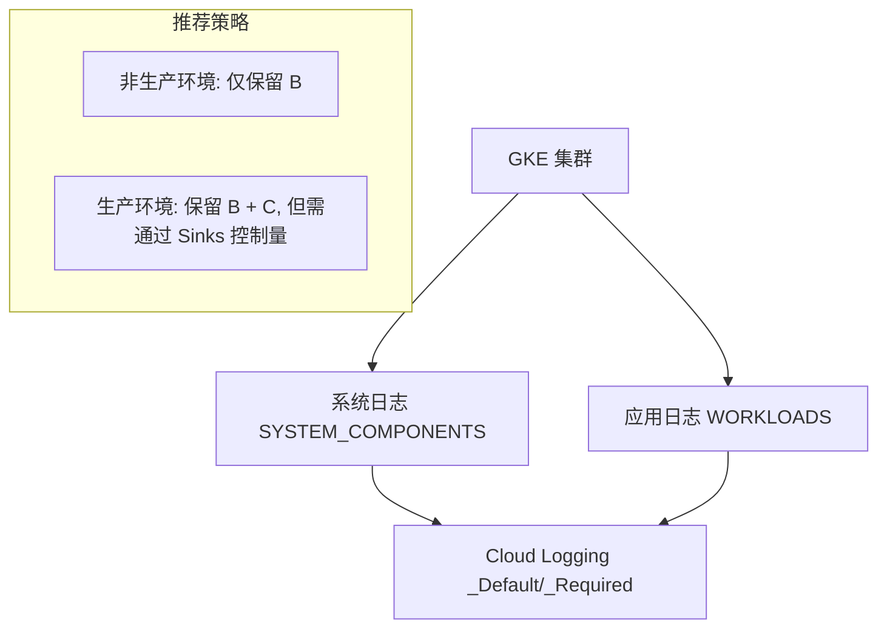

```bash
# 审计 GKE 集群配置
audit_gke_jiquns() {
    log_info "=== 审计 GKE 集群日志配置 ==="

    # 获取 GKE 集群列表
    jiquns=$(gcloud container jiquns list --project="$PROJECT_ID" --format="value(name,location)" 2>/dev/null)

    if [ $? -eq 0 ] && [ -n "$jiquns" ]; then
        while IFS=$'\t' read -r jiqun_name location; do
            if [ -n "$jiqun_name" ] && [ -n "$location" ]; then
                log_info "检查集群: $jiqun_name (位置: $location)"

                # 获取集群日志配置
                logging_config=$(gcloud container jiquns describe "$jiqun_name" \
                    --location="$location" \
                    --project="$PROJECT_ID" \
                    --format="value(loggingConfig.componentConfig.enableComponents)" 2>/dev/null)

                if [ -n "$logging_config" ]; then
                    echo "  日志组件: $logging_config"

                    if [[ "$logging_config" == *"SYSTEM_COMPONENTS"* ]] && [[ "$logging_config" == *"WORKLOADS"* ]]; then
                        log_warning "  集群启用了完整日志收集，考虑在非生产环境中禁用 WORKLOADS"
                    elif [[ "$logging_config" == *"SYSTEM_COMPONENTS"* ]]; then
                        log_success "  集群仅启用系统日志，成本已优化"
                    else
                        log_info "  集群日志配置: $logging_config"
                    fi
                else
                    log_warning "  无法获取集群日志配置"
                fi

                # 检查集群监控配置
                monitoring_config=$(gcloud container jiquns describe "$jiqun_name" \
                    --location="$location" \
                    --project="$PROJECT_ID" \
                    --format="value(monitoringConfig.componentConfig.enableComponents)" 2>/dev/null)

                if [ -n "$monitoring_config" ]; then
                    echo "  监控组件: $monitoring_config"
                fi

                echo ""
            fi
        done <<< "$jiquns"
    else
        log_info "项目中未发现 GKE 集群"
    fi

    echo ""
}
```

# workload

这个函数里面 集群启用了完整日志收集，考虑在非生产环境中禁用 WORKLOADS 我想了解如何禁止这个 workloads ,如果禁止了这个有什么影响么?

# summary

- why we can't disable workload
- we need Debug User logs. So we can't enable this logic

你的函数里已经能检查到 GKE 集群的 **LoggingConfig** 配置：

- SYSTEM_COMPONENTS → GKE 系统日志（kube-apiserver, kubelet, control plane, node agent 等）。
- WORKLOADS → Pod / Deployment / StatefulSet 等 **业务容器的 stdout/stderr 日志**。

---

## **一、如何禁用 WORKLOADS 日志收集**

目前 GKE 的 **loggingConfig** 可以在 **创建集群** 或 **更新集群** 时配置。

### **1. 更新已有集群：只保留系统日志**

```
gcloud container jiquns update "$CLUSTER_NAME" \
  --location "$LOCATION" \
  --logging=SYSTEM_COMPONENTS \
  --project "$PROJECT_ID"
```

### **2. 如果你想完全关闭日志收集（极端情况，不推荐）**

```
gcloud container jiquns update "$CLUSTER_NAME" \
  --location "$LOCATION" \
  --logging=NONE \
  --project "$PROJECT_ID"
```

---

## **二、禁用 WORKLOADS 的影响**

| **组件**          | **日志内容**                           | **禁用后影响**                                                                             |
| ----------------- | -------------------------------------- | ------------------------------------------------------------------------------------------ |
| SYSTEM_COMPONENTS | 控制面组件、节点 kubelet、GKE 系统日志 | 建议保留，关系到集群本身的健康状态                                                         |
| WORKLOADS         | Pod/容器应用程序 stdout/stderr 日志    | **不会再自动进入 Cloud Logging**，你在 GCP 控制台里 Logs Explorer 里就看不到业务容器日志了 |

⚠️ 也就是说：

- 你的 **业务 Pod 日志**（应用打印的标准输出、错误日志）将 **不再写入 Cloud Logging**。
- 你仍然可以在节点上或 kubectl logs 查看日志，但这些不会被集中存储，也不会出现在 \_Default 桶里。
- 如果团队依赖 Cloud Logging 做调试 / 分析 / 异常报警，禁用会带来问题。

---

## **三、推荐做法（成本控制 + 可观测性）**

1. **生产环境**

    - 建议保留 SYSTEM_COMPONENTS 和 WORKLOADS，因为生产需要完整日志。
    - 但可以 **通过 Sinks 过滤/路由**，只保留 ERROR/WARN 级别的应用日志，减少存储。

2. **非生产环境（dev, test, staging）**

    - 推荐只保留 SYSTEM_COMPONENTS，禁用 WORKLOADS，这样能显著减少日志量。
    - 如果需要应用日志，可以在本地 kubectl logs 调试，或者接第三方日志方案（如 Elasticsearch, Loki）。

---

### **Mermaid 流程图：GKE 日志采集对比**



---

✅ **总结**

- 你可以通过 gcloud container jiquns update ... --logging=SYSTEM_COMPONENTS 来禁用 WORKLOADS。
- 禁用后，应用日志不再进 Cloud Logging，只能 kubectl logs 或接入其他日志系统。
- 推荐：**非生产环境禁用 WORKLOADS，生产环境用日志路由减少费用**。

---

要不要我帮你写一个 **脚本函数**（类似你写的 audit_gke_jiquns），可以自动把 **非生产项目的所有 GKE 集群**都更新成只保留 SYSTEM_COMPONENTS，并打印修改结果？
