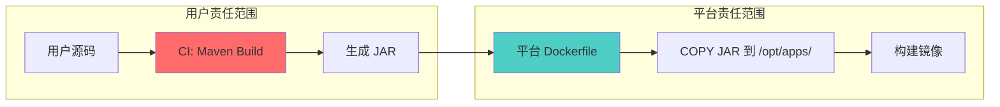

# WireMock 依赖缺失问题完整排查指南

## 问题概述

**错误信息：** `package com.github.tomakehurst.wiremock.client does not exist`

**场景特征：**
- ✅ 本地构建正常
- ❌ CI Pipeline 构建失败
- ⏳ 之前可用，现在突然失败
- 📦 用户之前未在 pom.xml 中显式声明该依赖

## 责任边界判定

### 构建流程分析



### 问题定位

**当前错误属于：用户层面问题（CI 构建阶段）**

**判断依据：**

1. **错误发生在编译阶段**
   ```bash
   # 这是 Java 编译器错误，发生在 mvn compile 阶段
   # 平台 Dockerfile 只在 mvn package 成功后才介入
   ```

2. **平台 Dockerfile 未参与编译**
   ```dockerfile
   # 平台 Dockerfile 只做文件拷贝
   FROM openjdk:11-jre-slim
   COPY target/*.jar /opt/apps/app.jar  # 此时 JAR 已存在
   ```

3. **错误发生时间线**
   ```mermaid
   graph LR
       A[Maven compile] -->|失败| B[错误: package not exist]
       B -.->|未到达| C[mvn package]
       C -.->|未到达| D[生成 JAR]
       D -.->|未到达| E[Dockerfile COPY]
       
       style B fill:#ff6b6b
       style E fill:#ddd
   ```

## 根因分析

### 为什么之前可用，现在失败？

| 可能原因 | 说明 | 验证方法 |
|---------|------|---------|
| **传递依赖变化** | 之前通过其他依赖间接引入，现在该依赖被移除或版本变化 | `mvn dependency:tree -Dverbose` |
| **Parent POM 变化** | 父 POM 的 dependencyManagement 发生变化 | 检查 parent POM 版本历史 |
| **CI 环境缓存清理** | 本地有缓存，CI 环境缓存被清空 | 检查 CI 缓存配置 |
| **Maven 仓库变化** | Nexus 仓库配置或内容发生变化 | 检查 Nexus 仓库状态 |
| **settings.xml 变化** | CI 环境的 Maven 配置被修改 | 对比历史 settings.xml |
| **依赖 scope 问题** | 依赖被标记为 test，但在 main 代码中使用 | 检查依赖 scope 配置 |

### 为什么本地正常，CI 失败？

```bash
# 本地环境
~/.m2/repository/  # 有完整缓存
~/.m2/settings.xml # 个人配置

# CI 环境
.m2/repository/    # 可能为空或不完整
settings.xml       # 可能缺失或配置不同
```

## 完整排查流程

### 步骤 1：确认依赖传递关系

```bash
# 1. 查看完整依赖树（本地）
mvn dependency:tree -Dverbose > local-deps.txt

# 2. 搜索 wiremock 相关依赖
grep -i "wiremock" local-deps.txt

# 3. 查看是否通过传递依赖引入
# 输出示例：
# [INFO] +- org.springframework.boot:spring-boot-starter-test:jar:2.7.0:test
# [INFO] |  \- com.github.tomakehurst:wiremock-jre8:jar:2.27.0:test
```

**关键问题：**
- WireMock 是否只在本地依赖树中出现？
- 它是通过哪个依赖传递引入的？
- 该传递依赖在 CI 环境中是否存在？

### 步骤 2：对比本地与 CI 环境

```bash
# 本地环境信息
mvn -v
java -version
cat ~/.m2/settings.xml
mvn help:effective-settings > local-effective-settings.xml

# CI 环境信息（在 Pipeline 中添加）
mvn -v
java -version
cat $HOME/.m2/settings.xml || echo "settings.xml not found"
mvn help:effective-settings > ci-effective-settings.xml
```

**对比检查清单：**

| 配置项 | 本地 | CI | 影响 |
|-------|------|----| -----|
| Maven 版本 | ? | ? | 依赖解析算法 |
| JDK 版本 | ? | ? | 类兼容性 |
| settings.xml | 存在 | ? | 仓库配置 |
| 仓库地址 | ? | ? | 依赖下载源 |
| 缓存状态 | 有缓存 | ? | 依赖可用性 |

### 步骤 3：检查依赖 Scope

```bash
# 查找所有 wiremock 相关依赖的 scope
grep -B 3 -A 3 "wiremock" pom.xml

# 检查是否在 main 代码中使用
find src/main -name "*.java" -exec grep -l "wiremock" {} \;
```

**常见问题：**

```xml
<!-- 错误配置：scope=test，但在 src/main 中使用 -->
<dependency>
    <groupId>com.github.tomakehurst</groupId>
    <artifactId>wiremock-jre8</artifactId>
    <scope>test</scope>  <!-- ❌ 错误 -->
</dependency>

<!-- 正确配置 -->
<dependency>
    <groupId>com.github.tomakehurst</groupId>
    <artifactId>wiremock-jre8</artifactId>
    <version>2.35.0</version>
    <scope>compile</scope>  <!-- ✅ 正确 -->
</dependency>
```

### 步骤 4：检查 Parent POM 和依赖管理

```bash
# 1. 查看 parent POM
grep -A 5 "<parent>" pom.xml

# 2. 查看依赖管理
mvn help:effective-pom | grep -A 50 "dependencyManagement"

# 3. 检查版本冲突
mvn dependency:tree -Dverbose | grep -i "omitted for conflict"
```

### 步骤 5：验证 Nexus 仓库

```bash
# 1. 检查 Nexus 连通性
curl -I "https://your-nexus.com/repository/maven-public/"

# 2. 检查 WireMock 是否存在
curl -I "https://your-nexus.com/repository/maven-public/com/github/tomakehurst/wiremock-jre8/2.35.0/wiremock-jre8-2.35.0.jar"

# 3. 搜索 WireMock
curl -u user:pass \
  "https://your-nexus.com/service/rest/v1/search?name=wiremock&repository=maven-public"
```

### 步骤 6：CI 环境 Debug

在 CI Pipeline 中添加 debug 步骤：

```yaml
# GitLab CI 示例
debug-dependencies:
  stage: build
  script:
    - echo "=== Maven 环境信息 ==="
    - mvn -v
    - java -version
    
    - echo "=== Settings 配置 ==="
    - cat ~/.m2/settings.xml || echo "settings.xml not found"
    - mvn help:effective-settings
    
    - echo "=== 依赖树分析 ==="
    - mvn dependency:tree -Dverbose > ci-deps.txt
    - cat ci-deps.txt
    - grep -i "wiremock" ci-deps.txt || echo "WireMock not found in dependency tree"
    
    - echo "=== 尝试下载 WireMock ==="
    - mvn dependency:get \
        -Dartifact=com.github.tomakehurst:wiremock-jre8:2.35.0 \
        -Dtransitive=false
    
    - echo "=== 详细构建日志 ==="
    - mvn clean compile -X 2>&1 | tee build-debug.log
    - grep -i "downloading\|failed" build-debug.log | grep -i wiremock
  artifacts:
    paths:
      - ci-deps.txt
      - build-debug.log
    when: always
```

## 解决方案

### 方案 1：显式声明依赖（推荐）

```xml
<!-- pom.xml -->
<dependencies>
    <!-- 显式声明 WireMock 依赖 -->
    <dependency>
        <groupId>com.github.tomakehurst</groupId>
        <artifactId>wiremock-jre8</artifactId>
        <version>2.35.0</version>
        <scope>compile</scope>  <!-- 或 test，根据实际使用场景 -->
    </dependency>
</dependencies>
```

**优点：**
- ✅ 明确依赖关系
- ✅ 避免传递依赖变化影响
- ✅ 版本可控

### 方案 2：使用 dependencyManagement 统一管理

```xml
<!-- pom.xml -->
<dependencyManagement>
    <dependencies>
        <dependency>
            <groupId>com.github.tomakehurst</groupId>
            <artifactId>wiremock-jre8</artifactId>
            <version>2.35.0</version>
        </dependency>
    </dependencies>
</dependencyManagement>

<dependencies>
    <dependency>
        <groupId>com.github.tomakehurst</groupId>
        <artifactId>wiremock-jre8</artifactId>
        <!-- 版本由 dependencyManagement 管理 -->
    </dependency>
</dependencies>
```

### 方案 3：配置 CI settings.xml

```xml
<!-- ci/settings.xml -->
<settings>
    <mirrors>
        <mirror>
            <id>company-nexus</id>
            <mirrorOf>*</mirrorOf>
            <url>https://nexus.company.com/repository/maven-public/</url>
        </mirror>
    </mirrors>
    
    <servers>
        <server>
            <id>company-nexus</id>
            <username>${env.NEXUS_USER}</username>
            <password>${env.NEXUS_PASSWORD}</password>
        </server>
    </servers>
</settings>
```

```yaml
# .gitlab-ci.yml
build:
  before_script:
    - mkdir -p ~/.m2
    - cp ci/settings.xml ~/.m2/settings.xml
  script:
    - mvn clean package
```

### 方案 4：在 pom.xml 中配置仓库

```xml
<!-- pom.xml -->
<repositories>
    <repository>
        <id>maven-central</id>
        <url>https://repo1.maven.org/maven2</url>
        <releases><enabled>true</enabled></releases>
        <snapshots><enabled>false</enabled></snapshots>
    </repository>
    <repository>
        <id>company-nexus</id>
        <url>https://nexus.company.com/repository/maven-public/</url>
    </repository>
</repositories>
```

## 平台支持工具

### 1. CI 环境诊断脚本

```bash
#!/bin/bash
# platform-ci-diagnostic.sh

echo "========================================="
echo "平台 CI 环境诊断工具"
echo "========================================="

echo -e "\n[1/6] Maven 环境信息"
mvn -v

echo -e "\n[2/6] Java 环境信息"
java -version 2>&1

echo -e "\n[3/6] Maven 配置检查"
if [ -f ~/.m2/settings.xml ]; then
    echo "✓ settings.xml 存在"
    echo "仓库配置:"
    grep -A 2 "<url>" ~/.m2/settings.xml | head -10
else
    echo "✗ settings.xml 不存在"
    echo "提示: 请在 CI Pipeline 中配置 settings.xml"
fi

echo -e "\n[4/6] 网络连通性检查"
if curl -s -o /dev/null -w "%{http_code}" "https://repo1.maven.org/maven2/" | grep -q "200"; then
    echo "✓ Maven Central 可访问"
else
    echo "✗ Maven Central 不可访问"
fi

echo -e "\n[5/6] 本地仓库缓存"
if [ -d ~/.m2/repository ]; then
    echo "缓存大小: $(du -sh ~/.m2/repository | cut -f1)"
    echo "WireMock 缓存:"
    ls -la ~/.m2/repository/com/github/tomakehurst/ 2>/dev/null || echo "  无 WireMock 缓存"
else
    echo "✗ 本地仓库不存在"
fi

echo -e "\n[6/6] 依赖检查"
if [ -f pom.xml ]; then
    echo "检查 pom.xml 中的 WireMock 依赖:"
    grep -A 5 "wiremock" pom.xml || echo "  未找到显式声明的 WireMock 依赖"
else
    echo "✗ pom.xml 不存在"
fi

echo -e "\n========================================="
echo "诊断建议:"
echo "========================================="
echo "1. 确保 pom.xml 中显式声明了所有依赖"
echo "2. 配置 settings.xml 指向公司 Nexus"
echo "3. 使用 'mvn clean package -X' 查看详细日志"
echo "4. 检查依赖 scope 是否正确"
echo "========================================="
```

### 2. 增强的 Pipeline 模板

```yaml
# .platform-ci-template.yml

variables:
  MAVEN_OPTS: "-Dmaven.repo.local=$CI_PROJECT_DIR/.m2/repository"
  MAVEN_CLI_OPTS: "--batch-mode --errors --fail-at-end"

.pre-build-check:
  stage: validate
  script:
    - |
      echo "=== 平台预检查 ==="
      
      # 检查 pom.xml
      if [ ! -f pom.xml ]; then
        echo "✗ 错误: 未找到 pom.xml"
        exit 1
      fi
      
      # 检查依赖声明
      if ! grep -q "<dependencies>" pom.xml; then
        echo "⚠ 警告: pom.xml 中未找到 <dependencies> 标签"
      fi
      
      # 运行诊断脚本
      bash platform-ci-diagnostic.sh

build:
  extends: .pre-build-check
  stage: build
  script:
    - mvn $MAVEN_CLI_OPTS clean package
  after_script:
    - |
      if [ "$CI_JOB_STATUS" == "failed" ]; then
        echo ""
        echo "=== 构建失败诊断 ==="
        echo ""
        echo "⚠️ 重要提示:"
        echo "  编译错误（如 'package does not exist'）通常表示:"
        echo "  1. pom.xml 缺少依赖声明"
        echo "  2. settings.xml 未配置或配置错误"
        echo "  3. 依赖 scope 配置不正确"
        echo ""
        echo "  这些是用户层面的配置问题，不是平台 Dockerfile 的问题。"
        echo "  平台 Dockerfile 只在 Maven 构建成功后才介入。"
        echo ""
        echo "参考文档: https://docs.platform.com/maven-troubleshooting"
      fi
  cache:
    key: ${CI_COMMIT_REF_SLUG}
    paths:
      - .m2/repository/
```

## 用户沟通模板

### 模板 1：简洁回复

```markdown
您好，

错误 `package com.github.tomakehurst.wiremock.client does not exist` 表示 Maven 编译阶段缺少依赖，这发生在平台 Dockerfile 介入之前。

**这是用户层面的配置问题**，平台 Dockerfile 只负责拷贝已构建好的 JAR 包。

**快速解决方案：**

1. 在 pom.xml 中显式声明依赖：
   ```xml
   <dependency>
       <groupId>com.github.tomakehurst</groupId>
       <artifactId>wiremock-jre8</artifactId>
       <version>2.35.0</version>
   </dependency>
   ```

2. 确保 CI 环境配置了正确的 settings.xml

3. 运行 `mvn dependency:tree` 检查依赖关系

**为什么之前可用？**
可能是通过其他依赖间接引入，现在该依赖版本变化或被移除。

需要进一步协助请提供：
- pom.xml 依赖部分
- CI 构建日志（使用 -X 参数）

参考文档: [链接]
```

### 模板 2：技术详解

```markdown
## 技术分析：Maven 编译失败

### 错误分类
- **错误类型**: 编译时依赖解析失败
- **错误位置**: Maven compile 阶段
- **责任范围**: 用户构建环境
- **平台影响**: 无（Dockerfile 未到达）

### 执行流程分析

用户代码 → CI Pipeline → Maven Compile [失败] ⛔
                                    ↓
                          "package does not exist"

Maven Package → 生成 JAR → 平台 Dockerfile COPY
[未到达]      [未到达]    [未到达]

### 根因调查

**本地 vs CI 环境差异：**

| 方面 | 本地环境 | CI 环境 | 影响 |
|------|---------|---------|------|
| Maven 缓存 | ~/.m2/repository 已填充 | 可能为空 | 依赖可用性 |
| settings.xml | 个人配置 | 可能缺失 | 仓库解析 |
| 网络访问 | 直连互联网 | 可能需要代理 | 下载能力 |

### 诊断命令

```bash
# 1. 验证依赖树
mvn dependency:tree -Dverbose | grep wiremock

# 2. 检查有效配置
mvn help:effective-settings

# 3. 测试依赖下载
mvn dependency:get -Dartifact=com.github.tomakehurst:wiremock-jre8:2.35.0

# 4. Debug 构建
mvn clean compile -X
```

### 解决策略

**策略 1: 显式声明依赖（最常见）**
[代码示例]

**策略 2: 配置仓库**
[代码示例]

**策略 3: CI Pipeline 配置**
[代码示例]

### 平台 Dockerfile 说明

平台 Dockerfile 在**后续阶段**运行，期望预构建的 JAR：

```dockerfile
FROM openjdk:11-jre-slim
COPY target/*.jar /opt/apps/app.jar  # ← 需要成功的 Maven 构建
```

**平台职责：**
- ✅ 运行时环境 (JRE)
- ✅ 容器配置
- ✅ 应用部署结构

**平台不处理：**
- ❌ 源码编译
- ❌ 依赖解析
- ❌ Maven 构建执行

这明确是**构建时用户配置问题**，不是平台 Dockerfile 问题。
```

## 总结

### 关键要点

1. **`package does not exist` = 用户层面问题**
   - 发生在编译阶段
   - Dockerfile 未参与
   - 需检查依赖配置

2. **平台提供支持但不负责修复**
   - 提供诊断工具
   - 明确责任边界
   - 帮助快速定位

3. **最佳实践**
   - 显式声明所有依赖
   - 固定依赖版本
   - 配置 CI settings.xml
   - 使用依赖管理

4. **持续改进**
   - 收集常见错误
   - 更新用户文档
   - 增强自动诊断
