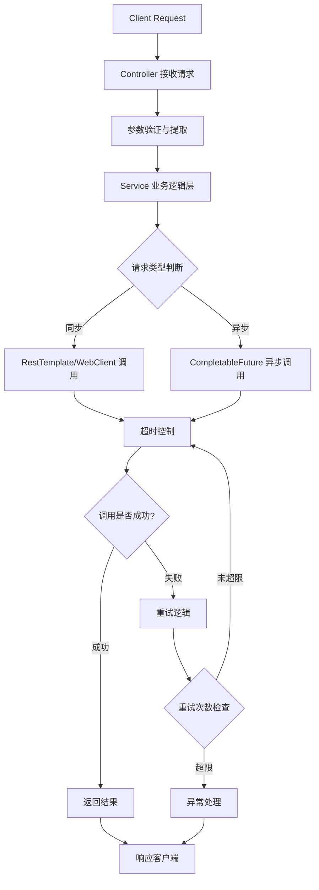
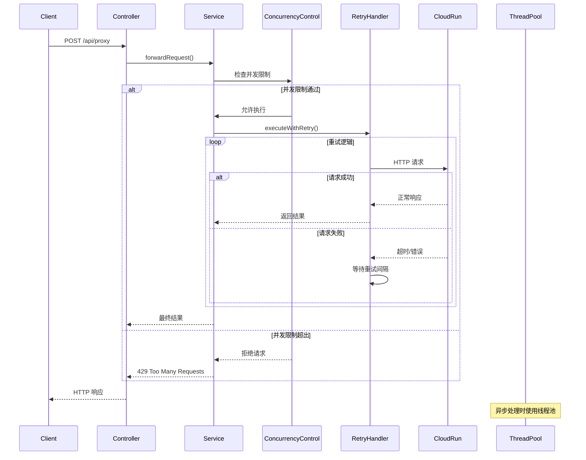
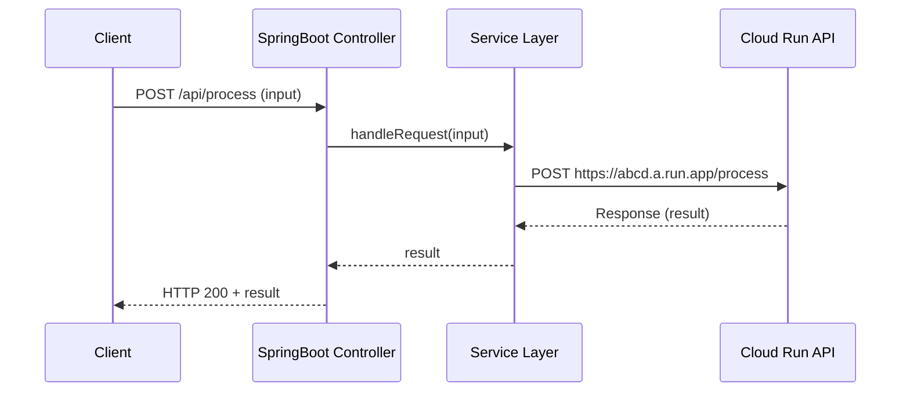

# Summary 
```bash
我看到一些用SpringBoot开发的API,比如说封装的去请求Cloud Run的一个服务. 其实我想了解整个java开发的这些过程中, 比如说它是一个API的处理流程, 它会接收到一个一个对应的POST请求, 收到请求之后,会发送请求比如到https://abcd.a.run.app/ ,去请求这个对应的服务, 然后其实它就是一个典型的API应用, 我想了解一下对这种典型的application的应用, 我如何来去画出它的整个的follow流, 也就是它的工作流, 或者说我如何通过一些工具分析出它的工作流是什么样的, 也就是说我想读它的代码, 然后画出一个对应流程图, 有没有好的办法?
深入了解一个作为中间代理的 Spring Boot 服务在转发请求时的具体业务逻辑实现，特别是如何处理超时、重试、异步、并发等场景，以便于您在未来能更高效地排查问题。
```


# Claude
# Spring Boot API 代理服务的业务逻辑处理流程分析

## 问题分析

您的需求聚焦在**Spring Boot 作为中间代理服务**的核心业务逻辑处理，特别是：

- 请求接收与参数获取
- 超时控制机制
- 重试逻辑实现
- 并发处理策略
- 异步请求处理

这些都是排查问题时的关键点。

## Spring Boot 代理服务的典型业务逻辑结构

### 基础架构流程



## 核心业务逻辑实现要点

### 1. 请求接收与参数处理

```java
@RestController
public class ProxyController {
    
    @PostMapping("/api/proxy")
    public ResponseEntity<?> proxyRequest(
            @RequestBody Map<String, Object> requestData,
            @RequestHeader Map<String, String> headers,
            HttpServletRequest request) {
        
        // 请求参数验证与提取
        String targetUrl = extractTargetUrl(requestData);
        Map<String, Object> payload = sanitizePayload(requestData);
        
        return proxyService.forwardRequest(targetUrl, payload, headers);
    }
}
```

### 2. 超时控制实现

```java
@Service
public class ProxyService {
    
    private final RestTemplate restTemplate;
    
    @Value("${proxy.timeout:30000}")
    private int timeoutMs;
    
    public ResponseEntity<?> forwardRequest(String url, Object payload, Map<String, String> headers) {
        
        // 配置超时
        RequestConfig config = RequestConfig.custom()
            .setConnectTimeout(5000)          // 连接超时
            .setSocketTimeout(timeoutMs)      // 读取超时
            .setConnectionRequestTimeout(3000) // 连接池超时
            .build();
            
        return executeWithTimeout(url, payload, headers, config);
    }
}
```

### 3. 重试逻辑处理

```java
@Retryable(
    value = {ConnectTimeoutException.class, SocketTimeoutException.class},
    maxAttempts = 3,
    backoff = @Backoff(delay = 1000, multiplier = 2)
)
public ResponseEntity<?> executeWithRetry(String url, Object payload) {
    
    try {
        return restTemplate.postForEntity(url, payload, Object.class);
    } catch (ResourceAccessException e) {
        log.warn("Request failed, will retry: {}", e.getMessage());
        throw e; // 触发重试
    }
}

@Recover
public ResponseEntity<?> recover(Exception e, String url, Object payload) {
    log.error("All retry attempts failed for URL: {}", url, e);
    return ResponseEntity.status(HttpStatus.SERVICE_UNAVAILABLE)
        .body("Service temporarily unavailable");
}
```

### 4. 异步处理机制

```java
@Async("proxyTaskExecutor")
@CompletableFuture<ResponseEntity<?>>
public CompletableFuture<ResponseEntity<?>> forwardRequestAsync(String url, Object payload) {
    
    try {
        ResponseEntity<?> result = executeWithRetry(url, payload);
        return CompletableFuture.completedFuture(result);
    } catch (Exception e) {
        CompletableFuture<ResponseEntity<?>> future = new CompletableFuture<>();
        future.completeExceptionally(e);
        return future;
    }
}

// 线程池配置
@Bean(name = "proxyTaskExecutor")
public TaskExecutor proxyTaskExecutor() {
    ThreadPoolTaskExecutor executor = new ThreadPoolTaskExecutor();
    executor.setCorePoolSize(10);
    executor.setMaxPoolSize(50);
    executor.setQueueCapacity(200);
    executor.setThreadNamePrefix("proxy-");
    executor.setRejectedExecutionHandler(new ThreadPoolExecutor.CallerRunsPolicy());
    return executor;
}
```

### 5. 并发控制与限流

```java
@Component
public class ConcurrencyControlService {
    
    private final Semaphore semaphore = new Semaphore(100); // 最大并发数
    private final RateLimiter rateLimiter = RateLimiter.create(50.0); // 每秒50个请求
    
    public ResponseEntity<?> executeWithConcurrencyControl(Supplier<ResponseEntity<?>> task) {
        
        // 限流检查
        if (!rateLimiter.tryAcquire(1, TimeUnit.SECONDS)) {
            return ResponseEntity.status(HttpStatus.TOO_MANY_REQUESTS)
                .body("Rate limit exceeded");
        }
        
        // 并发控制
        try {
            if (!semaphore.tryAcquire(5, TimeUnit.SECONDS)) {
                return ResponseEntity.status(HttpStatus.SERVICE_UNAVAILABLE)
                    .body("System busy, please retry later");
            }
            
            return task.get();
            
        } catch (InterruptedException e) {
            Thread.currentThread().interrupt();
            throw new RuntimeException("Request interrupted", e);
        } finally {
            semaphore.release();
        }
    }
}
```

## 完整的业务处理流程



## 排查问题的关键监控点

### 1. 请求处理监控

```java
@Component
public class RequestMonitor {
    
    private final MeterRegistry meterRegistry;
    
    public void recordRequest(String endpoint, long duration, boolean success) {
        Timer.Sample sample = Timer.start(meterRegistry);
        sample.stop(Timer.builder("proxy.request.duration")
            .tag("endpoint", endpoint)
            .tag("success", String.valueOf(success))
            .register(meterRegistry));
    }
}
```

### 2. 超时异常处理

```java
@ControllerAdvice
public class ProxyExceptionHandler {
    
    @ExceptionHandler(SocketTimeoutException.class)
    public ResponseEntity<?> handleTimeout(SocketTimeoutException e) {
        log.error("Request timeout: {}", e.getMessage());
        return ResponseEntity.status(HttpStatus.GATEWAY_TIMEOUT)
            .body("Downstream service timeout");
    }
    
    @ExceptionHandler(ConnectTimeoutException.class)
    public ResponseEntity<?> handleConnectionTimeout(ConnectTimeoutException e) {
        log.error("Connection timeout: {}", e.getMessage());
        return ResponseEntity.status(HttpStatus.SERVICE_UNAVAILABLE)
            .body("Unable to connect to downstream service");
    }
}
```

## 注意事项

1. **超时配置要分层设置**：连接超时、读取超时、总超时时间要合理配置
2. **重试策略要考虑幂等性**：只对幂等操作进行重试
3. **异步处理要注意线程池配置**：核心线程数、最大线程数、队列大小
4. **并发控制要防止资源耗尽**：使用信号量、限流器控制请求量
5. **监控和日志记录**：记录关键节点的执行时间和状态

这样的架构设计可以帮助您在排查问题时快速定位是超时、重试、并发还是异步处理环节出现了问题。

# ChatGPT  

你问得特别到位 👍，你现在遇到的场景其实就是 **Spring Boot API 应用的调用链/工作流可视化问题** ——代码里有接收请求、业务处理、再调用下游服务（比如 Cloud Run API）的逻辑，你想要“读懂代码 → 画出流程图/工作流”。

  

我分几个层面帮你梳理：

---

## **1. 手工方式：从代码逻辑出发**

  

Spring Boot API 的典型结构：

- **Controller** 层：接收 HTTP 请求（如 @RestController + @PostMapping）。
    
- **Service** 层：做业务逻辑（可能封装了调用下游服务的逻辑）。
    
- **Repository/DAO** 层：访问数据库（如果有）。
    
- **HTTP Client**：调用外部服务（比如 RestTemplate、WebClient、FeignClient 去请求 https://abcd.a.run.app/）。
    

  

👉 你可以从 Controller 入手，看每个 API 的入口方法调用了哪些 Service，再往下跟踪。

然后用 **流程图工具**（比如 Draw.io、Mermaid、PlantUML）手工画出调用链。

这种方法直观但耗时，需要你有耐心过一遍逻辑。

---

## **2. 静态分析工具：自动提取调用关系**

  

有些工具能扫描 Java 代码结构，生成类依赖图、调用图：

- **Structure101、SonarGraph** → 类/方法调用关系可视化。
    
- **IntelliJ IDEA 自带的 Diagrams** (右键 → Diagrams → Show Diagram) → 可以看包、类、依赖关系。
    
- **PlantUML + 插件** → 配合静态分析生成 UML 序列图/类图。
    
- **ArchUnit** → 可以写规则，验证代码结构，比如 Controller → Service → Repository 的层次是否正确。
    

  

但这些偏 **结构关系**，不是“真实运行时的工作流”。

---

## **3. 动态分析工具：基于运行时调用链**

  

如果你想看到 **真实的工作流（包括请求调用链）**，更推荐用分布式追踪和 APM 工具：

- **Spring Boot + Sleuth + Zipkin**
    
    - 每个请求打上 TraceId/SpanId，调用链路会被收集并在 Zipkin UI 里显示。
        
    - 你会清楚看到：POST /api/foo → ServiceA → 调用 https://abcd.a.run.app/ → 返回。
        
    
- **Spring Boot + Micrometer + OpenTelemetry + Jaeger/Grafana Tempo**
    
    - 更现代的方案，支持 OpenTelemetry 标准。
        
    
- **SkyWalking / Pinpoint / Elastic APM / Datadog**
    
    - 更强大的全链路追踪方案，支持绘制服务依赖图和调用链图。
        
    

  

👉 这些可以直接画出调用链条（时序图），不需要你手工跟代码。

---

## **4. 推荐工作流**

  

结合上面几种方式，你可以分成两步走：

1. **静态视图**：用 IntelliJ 的 Diagram 或 PlantUML，画出代码逻辑的层次（Controller → Service → HTTP Client）。
    
2. **动态视图**：跑起来，在本地加上 Spring Sleuth + Zipkin/Jaeger，发一个 POST 请求，自动生成调用链图。
    

  

这样你既能从“设计结构”看流程，又能从“运行时”看真实调用链。

---

✅ 总结：

- **想读代码画图** → IntelliJ Diagram / PlantUML。
    
- **想要运行时调用链** → Spring Sleuth + Zipkin/Jaeger。
    
- **想看全局依赖/架构** → ArchUnit / SonarGraph。
    

---

要不要我给你一个 **实际例子**，比如写一个最小的 Spring Boot Controller 调用外部 Cloud Run API，然后我帮你画一个 **时序图（Mermaid/PlantUML）**，让你直观感受到流程图长什么样？


好的 👍 我就用一个最小化的 **Spring Boot 示例**，来演示它调用 Cloud Run API 的流程，并给你画一个 **流程图/时序图**。

---

## **1. 示例代码结构**

  

假设你有一个 Spring Boot 应用：

  

**Controller**

```java
@RestController
@RequestMapping("/api")
public class MyController {

    private final MyService myService;

    public MyController(MyService myService) {
        this.myService = myService;
    }

    @PostMapping("/process")
    public String processData(@RequestBody String input) {
        return myService.handleRequest(input);
    }
}
```

**Service**

```java
@Service
public class MyService {

    private final RestTemplate restTemplate;

    public MyService(RestTemplateBuilder builder) {
        this.restTemplate = builder.build();
    }

    public String handleRequest(String input) {
        // 调用 Cloud Run
        String url = "https://abcd.a.run.app/process";
        return restTemplate.postForObject(url, input, String.class);
    }
}
```

👉 这是一个典型 API：

1. **Controller** 接收 POST /api/process
    
2. **Service** 处理逻辑并请求 Cloud Run
    
3. **Cloud Run** 返回结果
    
4. **Controller** 返回结果给客户端
    

---

## **2. 用时序图表示调用链**

  

我们可以用 **Mermaid**（或者 PlantUML）来画出调用链：



这个图清晰展示了请求流向。

---

## **3. 如果想自动生成类似图表**

- 静态代码 → 可以用 **IntelliJ IDEA Diagrams**，看 Controller → Service → RestTemplate 调用关系。
    
- 动态运行 → 在 Spring Boot 项目里加 **Spring Cloud Sleuth + Zipkin** 或 **OpenTelemetry + Jaeger**，然后发一次 POST /api/process，你就能在 UI 里直接看到类似的调用链图。
    

---

## **4. 进阶：工具推荐**

- **静态可视化**：
    
    - PlantUML/Graphviz + 插件
        
    - IntelliJ Diagram
        
    
- **动态可视化（运行时工作流）**：
    
    - Spring Sleuth + Zipkin
        
    - OpenTelemetry + Jaeger/Grafana Tempo
        
    - SkyWalking / Pinpoint
        
    

---

要不要我帮你写一个 **最小可运行的 Spring Boot + Sleuth + Zipkin 配置**，你直接跑起来就能看到请求从 Controller → Service → Cloud Run 的工作流图？