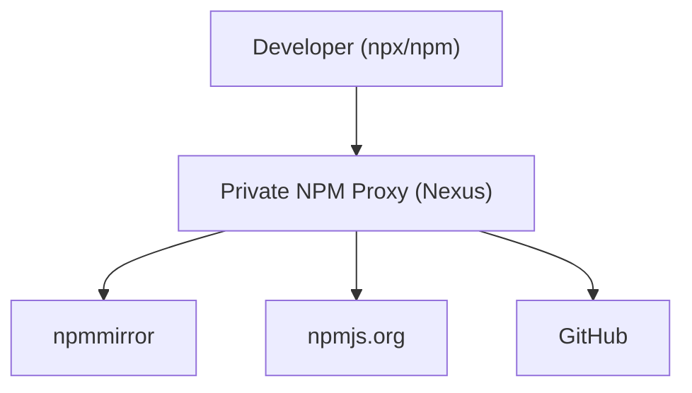
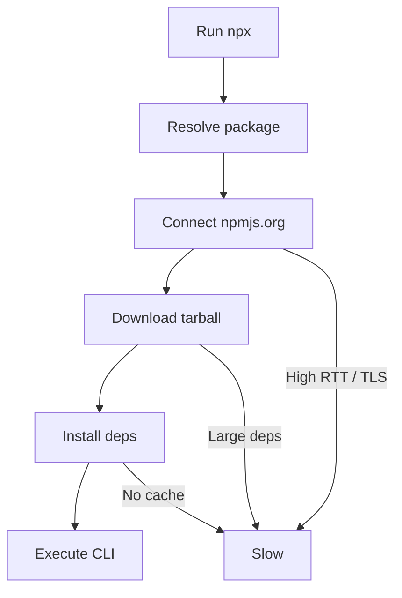

````markdown
# 问题分析

你执行：

```bash
npx -y @tencent-weixin/openclaw-weixin-cli@latest install
````

在国内慢的核心原因是：

1. **npm registry 默认指向国外（registry.npmjs.org）**
2. **npx 每次都会临时下载依赖（不会复用缓存）**
3. **依赖链可能包含 GitHub / CDN 资源（进一步变慢）**
4. **DNS / TLS 建连延迟高（典型 TCP RTT 问题）**

👉 本质是：**网络路径 + 包源问题**

---

# 解决方案

## 方案 1：切换 npm 镜像源（推荐）

使用国内镜像（如 npmmirror）

```bash
npm config set registry https://registry.npmmirror.com
```

验证：

```bash
npm config get registry
```

---

### 临时方式（不污染全局）

```bash
npx --registry=https://registry.npmmirror.com \
    -y @tencent-weixin/openclaw-weixin-cli@latest install
```

---

## 方案 2：使用 npx 缓存优化

npx 默认每次重新下载，可以通过：

```bash
npm config set cache ~/.npm
npm config set prefer-offline true
```

或者直接改为：

```bash
npm install -g @tencent-weixin/openclaw-weixin-cli
openclaw-weixin-cli install
```

👉 优点：

* 避免重复下载
* 更稳定（生产建议）

---

## 方案 3：使用 pnpm / yarn（更快）

### pnpm（推荐）

```bash
npm install -g pnpm
➜  ~ npm install -g pnpm

added 1 package in 1m

1 package is looking for funding
  run `npm fund` for details
➜  ~ pnpm dlx @tencent-weixin/openclaw-weixin-cli install
Packages: +1
+
Progress: resolved 1, reused 0, downloaded 1, added 1, done
[openclaw-weixin] 已找到本地安装的 openclaw
[openclaw-weixin] 检测到 OpenClaw 版本: 2026.4.26
[openclaw-weixin] 匹配 dist-tag: latest
[openclaw-weixin] 正在安装插件 @tencent-weixin/openclaw-weixin@latest...


pnpm dlx @tencent-weixin/openclaw-weixin-cli install
```

设置镜像：

```bash
pnpm config set registry https://registry.npmmirror.com
```

---

### yarn

```bash
npm install -g yarn

yarn config set registry https://registry.npmmirror.com

yarn dlx @tencent-weixin/openclaw-weixin-cli install
```

---

## 方案 4：加速 GitHub 依赖（关键）

如果 CLI 内部依赖 GitHub：

```bash
git config --global url."https://ghproxy.com/https://github.com/".insteadOf "https://github.com/"
```

或者：

```bash
git config --global url."https://mirror.ghproxy.com/https://github.com/".insteadOf "https://github.com/"
```

---

## 方案 5：企业级（最优）

如果你在公司环境（你这种 Infra 场景很适合）：

### 搭建私有 npm proxy（如 Nexus / Verdaccio）

架构：



👉 优点：

* 本地缓存依赖（极快）
* 避免外网波动
* 可做安全扫描（你们已有 Nexus IQ 👍）

---

# 代码示例（推荐组合）

```bash
# 1. 使用国内源
npm config set registry https://registry.npmmirror.com

# 2. 安装 CLI（避免 npx）
npm install -g @tencent-weixin/openclaw-weixin-cli

# 3. 执行
openclaw-weixin-cli install
```

---

# 流程图（npx 慢的原因）



---

# 注意事项

1. **npx 不适合频繁执行**

   * 每次都是 cold start
   * 适合一次性工具

2. **确认 Node 版本**

   ```bash
   node -v
   ```

   建议 ≥ 18

3. **DNS 影响很大**

   * 可考虑：

     ```bash
     cat /etc/resolv.conf
     ```

4. **公司网络建议**

   * 走 NAT + 代理统一出口
   * 或直接走 Artifact Proxy（最佳实践）

---

# 总结（最佳实践）

| 场景         | 推荐方案          |
| ------------ | ----------------- |
| 个人开发     | npmmirror + pnpm  |
| 高频使用 CLI | 全局安装          |
| 企业环境     | Nexus / Verdaccio |
| GitHub 慢    | ghproxy           |

---

如果你愿意，我可以帮你做一个**完整企业级 npm 加速架构（结合 GCP + GKE + Artifact Registry）**，甚至可以和你现在的 Kong / API 平台结合，做到统一出口治理。
