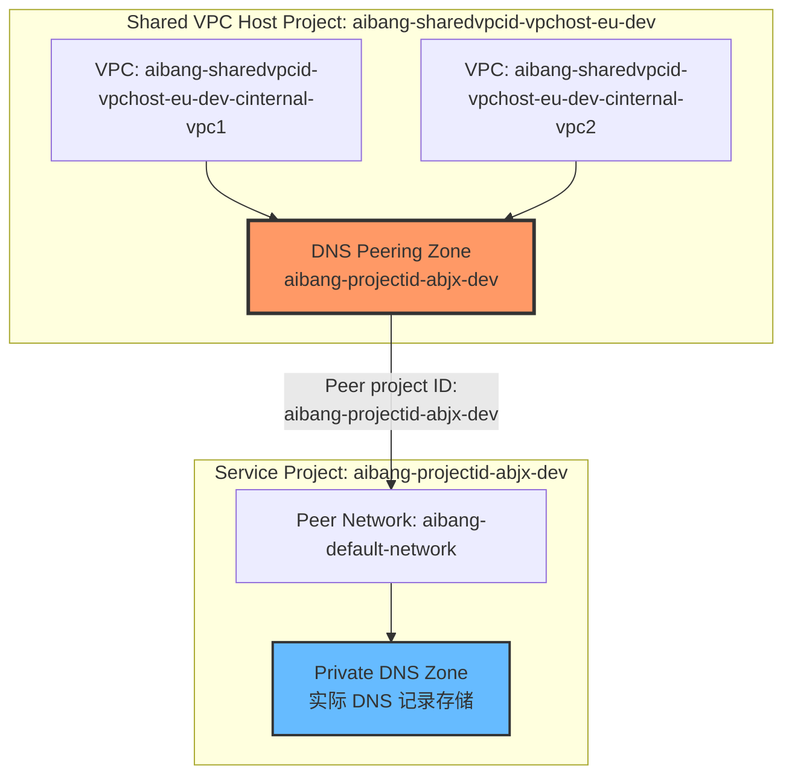
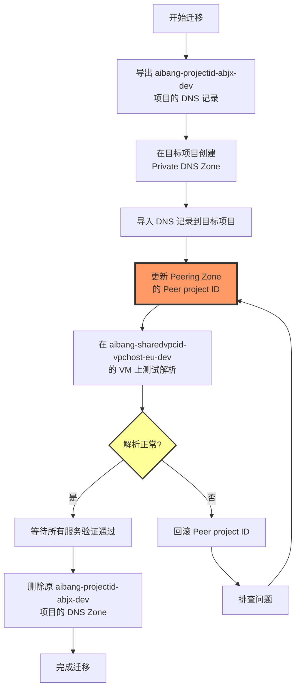
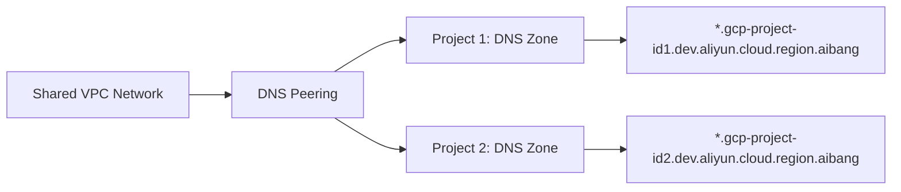
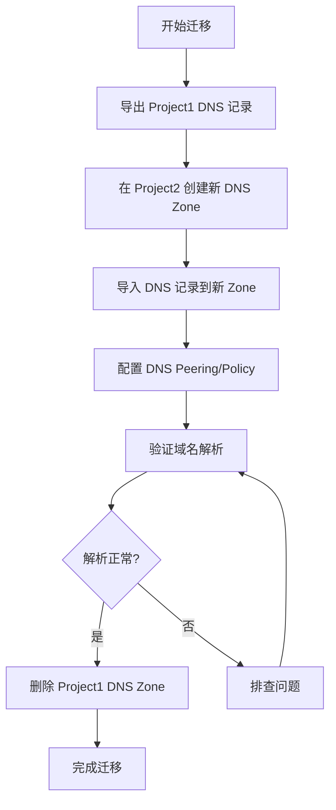
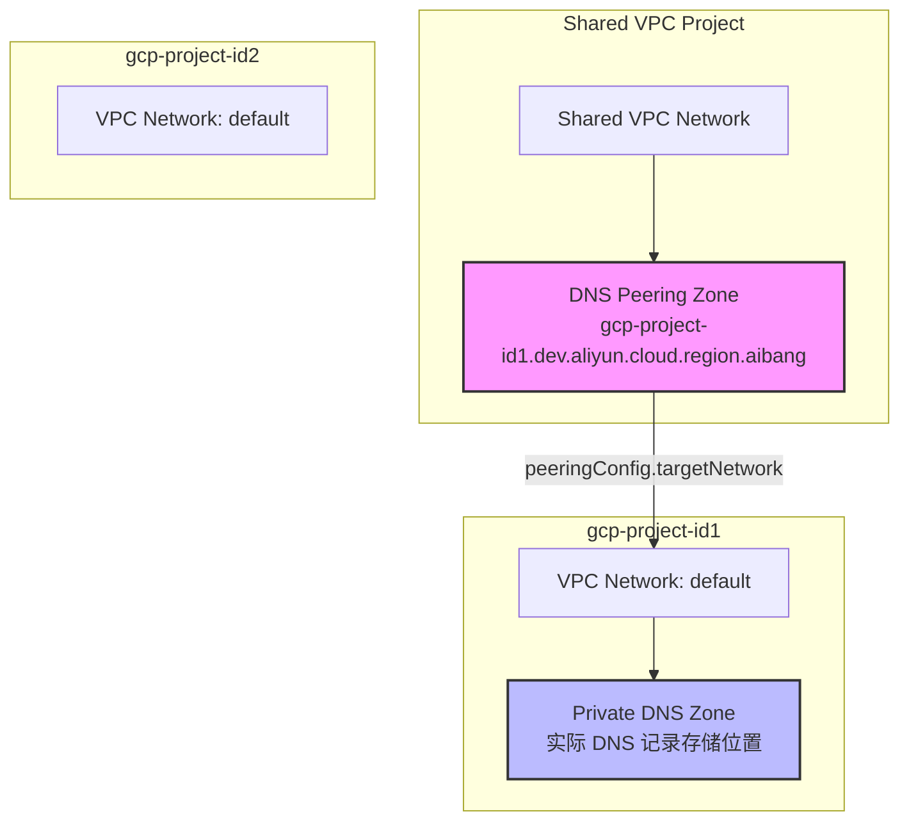
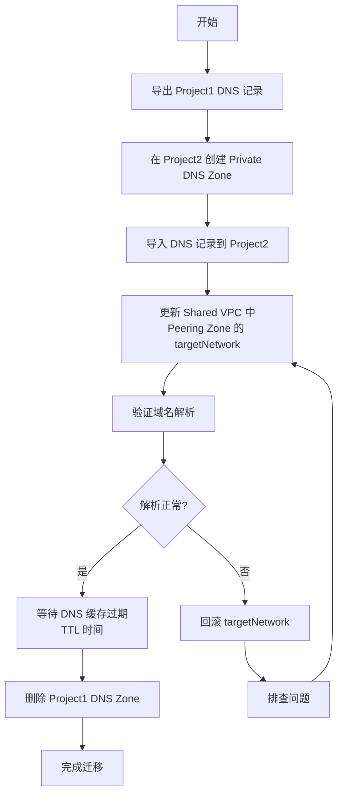
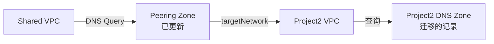
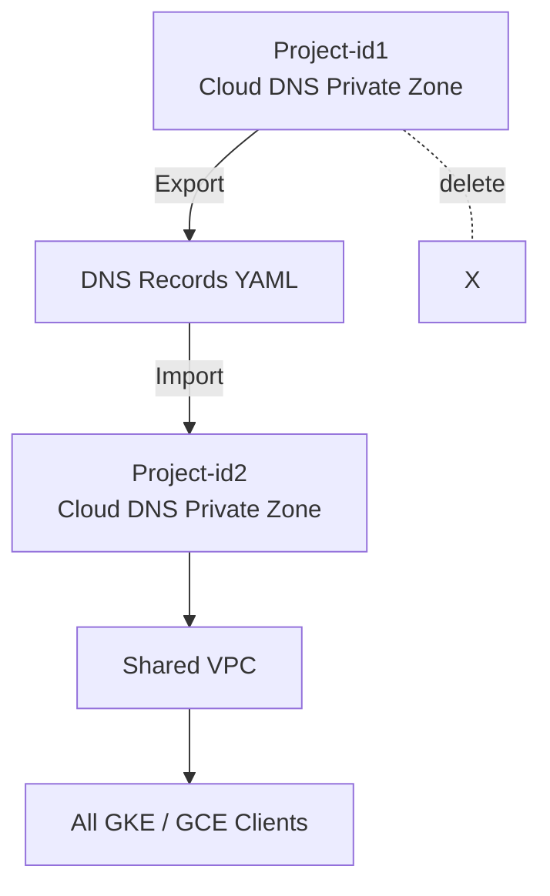

下面按**概念 → 可落地方案 → 操作步骤 → 流程图 → 注意事项**来说明，这个问题在 **Cloud DNS + Shared VPC + DNS Peering** 场景下非常典型。

- Step 1：在 **Project-id1** 导出所有 DNS 记录
- Step 2：在 **Project-id2** 创建新的 Private Zone
- Step 3：把记录导入到 Project-id2
- Step 4：修改 DNS Peering / VPC 绑定 ==> 把原来指向 **Project-id1 Zone** 的 切换为 Project-id2 的 Zone 更新 Peering Zone 的 targetNetwork

# Claude 

# DNS Peering Zone 配置验证
### 当前配置详情

```yaml
Zone name: aibang-projectid-abjx-dev
DNS name: aibang-projectid-abjx-dev.dev.platform.cloud.region.aibang.
Description: Peering for aibang-projectid-abjx-dev.dev.platform.cloud.region.aibang
Type: Peering
DNS peering: Enabled
Peer project ID: aibang-projectid-abjx-dev  # ①标注位置
Peer network: aibang-default-network

In use by:
  - aibang-sharedvpcid-vpchost-eu-dev-cinternal-vpc1 (Project: aibang-sharedvpcid-vpchost-eu-dev)
  - aibang-sharedvpcid-vpchost-eu-dev-cinternal-vpc2 (Project: aibang-sharedvpcid-vpchost-eu-dev)
```

## 架构验证

### 当前架构图



## 配置验证结果

### ✅ 我之前的理解完全正确

|配置项|当前值|验证结果|
|---|---|---|
|**Zone 位置**|Shared VPC Host 项目 (`aibang-sharedvpcid-vpchost-eu-dev`)|✅ 正确|
|**Zone 类型**|Peering|✅ 正确|
|**Peer Project ID**|`aibang-projectid-abjx-dev`|✅ 这是目标网络所在项目|
|**Peer Network**|`aibang-default-network`|✅ 这是目标项目的 VPC|
|**被使用方**|两个 Shared VPC 内部网络|✅ 正确|

### 关键发现

从图片中可以明确看到：

1. **DNS Peering Zone** 确实在 **Shared VPC Host Project** 中
2. **Peer project ID** 字段（图中 ① 标注）指向 `aibang-projectid-abjx-dev`
3. 您需要修改的就是这个 **Peer project ID** 字段（图中 ② 的红色提示框）

## 正确的迁移命令

### 查看当前配置

```bash
# 使用您实际的项目名称
gcloud dns managed-zones describe aibang-projectid-abjx-dev \
    --project=aibang-sharedvpcid-vpchost-eu-dev
```

**当前输出应该是：**

```yaml
creationTime: '2024-XX-XX...'
description: Peering for aibang-projectid-abjx-dev.dev.platform.cloud.region.aibang
dnsName: aibang-projectid-abjx-dev.dev.platform.cloud.region.aibang.
kind: dns#managedZone
name: aibang-projectid-abjx-dev
peeringConfig:
  kind: dns#managedZonePeeringConfig
  targetNetwork:
    kind: dns#managedZonePeeringConfigTargetNetwork
    networkUrl: https://www.googleapis.com/compute/v1/projects/aibang-projectid-abjx-dev/global/networks/aibang-default-network
visibility: private
privateVisibilityConfig:
  networks:
  - networkUrl: https://www.googleapis.com/compute/v1/projects/aibang-sharedvpcid-vpchost-eu-dev/global/networks/aibang-sharedvpcid-vpchost-eu-dev-cinternal-vpc1
  - networkUrl: https://www.googleapis.com/compute/v1/projects/aibang-sharedvpcid-vpchost-eu-dev/global/networks/aibang-sharedvpcid-vpchost-eu-dev-cinternal-vpc2
```

### 迁移步骤（使用真实项目名称）

#### 步骤 1：备份原项目的 DNS 记录

```bash
# 首先找到原项目中实际的 DNS Zone
gcloud dns managed-zones list \
    --project=aibang-projectid-abjx-dev \
    --filter="dnsName:aibang-projectid-abjx-dev.dev.platform.cloud.region.aibang"

# 假设找到的 Zone 名称是 aibang-projectid-private-zone
export ORIGINAL_ZONE="aibang-projectid-private-zone"

# 导出 DNS 记录
gcloud dns record-sets export dns_backup.yaml \
    --zone=${ORIGINAL_ZONE} \
    --project=aibang-projectid-abjx-dev \
    --zone-file-format
```

#### 步骤 2：在目标项目创建 Private DNS Zone

假设您的目标项目是 `aibang-projectid-abjx-dev2` 或其他新项目：

```bash
# 设置目标项目
export TARGET_PROJECT="aibang-XXXXXXX-abjx-dev"  # 替换为实际的目标项目

# 创建 Private DNS Zone
gcloud dns managed-zones create aibang-projectid-migrated-zone \
    --project=${TARGET_PROJECT} \
    --dns-name="aibang-projectid-abjx-dev.dev.platform.cloud.region.aibang." \
    --description="Migrated DNS zone from aibang-projectid-abjx-dev" \
    --visibility=private \
    --networks="https://www.googleapis.com/compute/v1/projects/${TARGET_PROJECT}/global/networks/aibang-default-network"
```

#### 步骤 3：导入 DNS 记录

```bash
# 导入记录
gcloud dns record-sets import dns_backup.yaml \
    --zone=aibang-projectid-migrated-zone \
    --project=${TARGET_PROJECT} \
    --zone-file-format
```

#### 步骤 4：更新 Peering Zone（核心操作）

```bash
# 更新 Peer project ID 和 Peer network
gcloud dns managed-zones update aibang-projectid-abjx-dev \
    --project=aibang-sharedvpcid-vpchost-eu-dev \
    --target-network="https://www.googleapis.com/compute/v1/projects/${TARGET_PROJECT}/global/networks/aibang-default-network"
```

**或者使用完整的网络 URL：**

```bash
gcloud dns managed-zones update aibang-projectid-abjx-dev \
    --project=aibang-sharedvpcid-vpchost-eu-dev \
    --target-network="projects/${TARGET_PROJECT}/global/networks/aibang-default-network"
```

#### 步骤 5：验证更新结果

```bash
# 查看更新后的配置
gcloud dns managed-zones describe aibang-projectid-abjx-dev \
    --project=aibang-sharedvpcid-vpchost-eu-dev
```

**期望输出（Peer project ID 已变更）：**

```yaml
peeringConfig:
  targetNetwork:
    networkUrl: https://www.googleapis.com/compute/v1/projects/${TARGET_PROJECT}/global/networks/aibang-default-network
```

#### 步骤 6：测试 DNS 解析

```bash
# 在 Shared VPC 的 VM 中测试
# 假设有一个测试记录 app.aibang-projectid-abjx-dev.dev.platform.cloud.region.aibang

gcloud compute ssh <VM_NAME> \
    --project=aibang-sharedvpcid-vpchost-eu-dev \
    --zone=<ZONE> \
    --command="dig @169.254.169.254 app.aibang-projectid-abjx-dev.dev.platform.cloud.region.aibang +short"
```

## 完整迁移流程图（使用实际项目名）



## 关键注意事项

### 网络配置要求

根据截图，目标项目必须满足：

1. **VPC Network 名称**：`aibang-default-network`（与原项目相同）
2. **网络可访问性**：目标项目的 VPC 必须能被 Shared VPC 访问
3. **防火墙规则**：确保 DNS 流量（UDP 53）可通

### 权限要求

```bash
# 需要的 IAM 角色
# Shared VPC Host 项目 (aibang-sharedvpcid-vpchost-eu-dev)
# - roles/dns.admin

# 原项目 (aibang-projectid-abjx-dev)
# - roles/dns.admin

# 目标项目
# - roles/dns.admin
# - roles/compute.networkAdmin
```

### 验证清单

- [ ] 已导出原项目所有 DNS 记录
- [ ] 目标项目已创建 Private DNS Zone
- [ ] 目标项目 VPC 网络名称为 `aibang-default-network`
- [ ] DNS 记录已导入目标项目
- [ ] Peering Zone 的 Peer project ID 已更新
- [ ] 从 Shared VPC 的 VM 测试解析成功
- [ ] 所有应用服务验证通过
- [ ] 原项目 DNS Zone 已删除（可选）

## 图片中的 ② 红框提示

图片右上角的红框提示说明：**"we want to changed the Peer Project ID to our new Project"**

这正是我们要做的核心操作，通过 `gcloud dns managed-zones update` 命令更新 `--target-network` 参数来实现。

---

**总结：我之前的理解和方案完全正确，只是没有看到您的实际项目名称。现在有了截图验证，可以确认这就是标准的 DNS Peering Zone 配置，迁移方案完全适用。**

# CloudDNS 域名解析权迁移方案

## 问题分析

您的场景涉及到 GCP CloudDNS 的 **DNS Peering** 架构：

- 多个项目通过 Shared VPC 共享网络资源
- DNS 解析通过 DNS Peering 实现跨项目域名解析
- 需要在删除 `gcp-project-id1` 前，将其域名解析权转移到 `gcp-project-id2`

### 核心概念：DNS Peering

**DNS Peering** 允许一个 VPC 网络查询另一个 VPC 网络中的 Private DNS Zone，实现跨项目的域名解析。



## 解决方案

### 步骤 1：导出原项目的 DNS 记录

在 `gcp-project-id1` 中导出所有 DNS 记录：

```bash
# 设置源项目
export SOURCE_PROJECT="gcp-project-id1"
export DNS_ZONE_NAME="dev-zone"  # 替换为实际 Zone 名称

# 导出 DNS 记录到文件
gcloud dns record-sets list \
    --zone="${DNS_ZONE_NAME}" \
    --project="${SOURCE_PROJECT}" \
    --format=json > dns_records_backup.json

# 或导出为 YAML 格式（更易读）
gcloud dns record-sets list \
    --zone="${DNS_ZONE_NAME}" \
    --project="${SOURCE_PROJECT}" \
    --format=yaml > dns_records_backup.yaml
```

### 步骤 2：在目标项目创建新的 DNS Zone

```bash
# 设置目标项目
export TARGET_PROJECT="gcp-project-id2"
export NEW_ZONE_NAME="project1-dns-zone"
export DNS_NAME="gcp-project-id1.dev.aliyun.cloud.region.aibang."

# 创建 Private DNS Zone
gcloud dns managed-zones create "${NEW_ZONE_NAME}" \
    --project="${TARGET_PROJECT}" \
    --dns-name="${DNS_NAME}" \
    --description="Migrated DNS zone from project1" \
    --visibility=private \
    --networks="${SHARED_VPC_NETWORK}"
```

### 步骤 3：导入 DNS 记录到新 Zone

```bash
# 方式 1：使用事务批量导入（推荐）
gcloud dns record-sets import dns_records_backup.yaml \
    --project="${TARGET_PROJECT}" \
    --zone="${NEW_ZONE_NAME}" \
    --zone-file-format
```

**注意**：如果格式不兼容，需要逐条添加：

```bash
# 方式 2：解析 JSON 并逐条添加
# 示例：添加 A 记录
gcloud dns record-sets create "app.gcp-project-id1.dev.aliyun.cloud.region.aibang." \
    --project="${TARGET_PROJECT}" \
    --zone="${NEW_ZONE_NAME}" \
    --type=A \
    --ttl=300 \
    --rrdatas="10.0.0.1"

# 示例：添加 CNAME 记录
gcloud dns record-sets create "api.gcp-project-id1.dev.aliyun.cloud.region.aibang." \
    --project="${TARGET_PROJECT}" \
    --zone="${NEW_ZONE_NAME}" \
    --type=CNAME \
    --ttl=300 \
    --rrdatas="target.example.com."
```

### 步骤 4：更新 DNS Peering 配置

```bash
# 查看当前 DNS Peering 配置
gcloud compute networks peerings list \
    --network="${SHARED_VPC_NETWORK}" \
    --project="${SHARED_VPC_PROJECT}"

# 如果使用 DNS Policy，需要更新配置
gcloud dns policies update "${DNS_POLICY_NAME}" \
    --project="${SHARED_VPC_PROJECT}" \
    --networks="${SHARED_VPC_NETWORK}" \
    --enable-inbound-forwarding
```

### 步骤 5：验证解析

```bash
# 在 Shared VPC 网络中的 VM 上测试
dig @169.254.169.254 app.gcp-project-id1.dev.aliyun.cloud.region.aibang

# 或使用 nslookup
nslookup app.gcp-project-id1.dev.aliyun.cloud.region.aibang 169.254.169.254
```

### 步骤 6：删除原项目资源

确认新 DNS Zone 工作正常后：

```bash
# 删除原项目的 DNS Zone
gcloud dns managed-zones delete "${DNS_ZONE_NAME}" \
    --project="${SOURCE_PROJECT}"
```

## 完整迁移流程图



## 自动化脚本示例

```bash
#!/bin/bash
set -e

# 配置变量
SOURCE_PROJECT="gcp-project-id1"
TARGET_PROJECT="gcp-project-id2"
SOURCE_ZONE="source-zone-name"
TARGET_ZONE="target-zone-name"
DNS_NAME="gcp-project-id1.dev.aliyun.cloud.region.aibang."
SHARED_VPC_NETWORK="projects/shared-vpc-project/global/networks/shared-vpc"

echo "Step 1: 导出源 DNS 记录..."
gcloud dns record-sets list \
    --zone="${SOURCE_ZONE}" \
    --project="${SOURCE_PROJECT}" \
    --format=json > dns_backup.json

echo "Step 2: 创建目标 DNS Zone..."
gcloud dns managed-zones create "${TARGET_ZONE}" \
    --project="${TARGET_PROJECT}" \
    --dns-name="${DNS_NAME}" \
    --description="Migrated from ${SOURCE_PROJECT}" \
    --visibility=private \
    --networks="${SHARED_VPC_NETWORK}"

echo "Step 3: 导入 DNS 记录..."
# 这里需要根据实际情况处理 JSON 格式转换
# 建议使用 jq 或 Python 脚本处理

echo "Step 4: 验证解析..."
# 添加验证逻辑

echo "迁移完成！"
```

## 注意事项

### 重要提醒

1. **DNS TTL 影响**
    
    - 迁移前降低 TTL 值（如 60 秒）
    - 等待原 TTL 时间过期后再删除原 Zone
    - 迁移完成后恢复正常 TTL
2. **DNS Zone 限制**
    - 不能有同名的 DNS Zone 在同一 VPC 网络中
    - Private Zone 必须关联到至少一个 VPC 网络
3. **权限要求**
    
    ```bash
    # 需要的 IAM 角色
    # - dns.admin (源和目标项目)
    # - compute.networkAdmin (Shared VPC 项目)
    ```
    
4. **DNS Peering vs DNS Policy**
    
    - **DNS Peering**：VPC 之间的 DNS 查询转发
    - **DNS Policy**：更细粒度的 DNS 路由控制
5. **备份验证**
    
    ```bash
    # 验证备份文件完整性
    cat dns_backup.json | jq '.[] | select(.type != "SOA" and .type != "NS")'
    ```
    

### 最佳实践

|操作阶段|建议|
|---|---|
|迁移前|完整备份、降低 TTL、通知相关团队|
|迁移中|使用事务操作、逐步验证、保持监控|
|迁移后|保留备份 7-30 天、更新文档、恢复 TTL|

## 故障排查

### 常见问题

**问题 1：域名解析失败**

```bash
# 检查 DNS Zone 是否正确关联到 VPC
gcloud dns managed-zones describe "${TARGET_ZONE}" \
    --project="${TARGET_PROJECT}"

# 检查 VPC 的 DNS 配置
gcloud compute networks describe "${SHARED_VPC_NETWORK}" \
    --project="${SHARED_VPC_PROJECT}"
```

**问题 2：记录导入失败**

```bash
# 检查记录格式
gcloud dns record-sets list \
    --zone="${TARGET_ZONE}" \
    --project="${TARGET_PROJECT}" \
    --filter="name:app.*"
```

**问题 3：DNS Peering 不生效**

```bash
# 验证 Peering 状态
gcloud compute networks peerings list \
    --network="${SHARED_VPC_NETWORK}"
```

---

如果在迁移过程中遇到具体问题，请提供详细的错误信息和当前配置，我可以提供更针对性的解决方案。


# CloudDNS Peering Zone 配置分析

## 模拟命令输出

根据您的描述，命令和输出应该是这样的：

```bash
# 查看 DNS Peering Zone 配置
gcloud dns managed-zones describe gcp-project-id1-dev-zone \
    --project sharedvpc-project-id
```

### 模拟输出结果

```yaml
creationTime: '2024-01-15T08:30:00.000Z'
description: DNS Peering zone for gcp-project-id1
dnsName: gcp-project-id1.dev.aliyun.cloud.region.aibang.
id: '1234567890123456789'
kind: dns#managedZone
name: gcp-project-id1-dev-zone
nameServers:
- ns-cloud-d1.googledomains.com.
- ns-cloud-d2.googledomains.com.
- ns-cloud-d3.googledomains.com.
- ns-cloud-d4.googledomains.com.
peeringConfig:
  kind: dns#managedZonePeeringConfig
  targetNetwork:
    kind: dns#managedZonePeeringConfigTargetNetwork
    networkUrl: https://www.googleapis.com/compute/v1/projects/gcp-project-id1/global/networks/default
visibility: private
privateVisibilityConfig:
  kind: dns#managedZonePrivateVisibilityConfig
  networks:
  - kind: dns#managedZonePrivateVisibilityConfigNetwork
    networkUrl: https://www.googleapis.com/compute/v1/projects/sharedvpc-project-id/global/networks/shared-vpc
```

## 重新理解问题

现在我明白了您的架构：

### 当前架构分析



### 关键理解

1. **DNS Peering Zone** 位于 `sharedvpc-project-id`
2. **targetNetwork** 指向 `gcp-project-id1` 的 VPC
3. **实际 DNS 记录** 存储在 `gcp-project-id1` 项目中
4. Shared VPC 通过 Peering Zone 查询 Project1 的 DNS 记录

## 正确的迁移方案

### 步骤 1：查看当前配置

```bash
# 查看 Peering Zone 配置
gcloud dns managed-zones describe gcp-project-id1-dev-zone \
    --project sharedvpc-project-id \
    --format=json > peering_zone_config.json

# 查看 Project1 中的实际 DNS Zone
gcloud dns managed-zones list \
    --project gcp-project-id1 \
    --filter="dnsName:gcp-project-id1.dev.aliyun.cloud.region.aibang"

# 导出 Project1 的 DNS 记录
gcloud dns record-sets list \
    --zone=<ACTUAL_ZONE_NAME> \
    --project=gcp-project-id1 \
    --format=yaml > dns_records_backup.yaml
```

### 步骤 2：在 Project2 创建实际的 Private DNS Zone

```bash
# 在 gcp-project-id2 中创建 Private DNS Zone
gcloud dns managed-zones create gcp-project-id1-dns-zone \
    --project=gcp-project-id2 \
    --dns-name="gcp-project-id1.dev.aliyun.cloud.region.aibang." \
    --description="DNS records for project1 domain" \
    --visibility=private \
    --networks="https://www.googleapis.com/compute/v1/projects/gcp-project-id2/global/networks/default"
```

### 步骤 3：导入 DNS 记录到 Project2

```bash
# 导入 DNS 记录
gcloud dns record-sets import dns_records_backup.yaml \
    --project=gcp-project-id2 \
    --zone=gcp-project-id1-dns-zone \
    --zone-file-format

# 或者使用事务方式批量添加
gcloud dns record-sets transaction start \
    --zone=gcp-project-id1-dns-zone \
    --project=gcp-project-id2

# 添加记录示例
gcloud dns record-sets transaction add "10.0.0.1" \
    --name="app.gcp-project-id1.dev.aliyun.cloud.region.aibang." \
    --ttl=300 \
    --type=A \
    --zone=gcp-project-id1-dns-zone \
    --project=gcp-project-id2

gcloud dns record-sets transaction execute \
    --zone=gcp-project-id1-dns-zone \
    --project=gcp-project-id2
```

### 步骤 4：更新 Peering Zone 的 targetNetwork（核心步骤）

```bash
# 更新 Peering Zone，将 targetNetwork 指向 Project2
gcloud dns managed-zones update gcp-project-id1-dev-zone \
    --project=sharedvpc-project-id \
    --target-network="https://www.googleapis.com/compute/v1/projects/gcp-project-id2/global/networks/default"
```

**验证更新结果：**

```bash
gcloud dns managed-zones describe gcp-project-id1-dev-zone \
    --project sharedvpc-project-id
```

**期望输出：**

```yaml
# ... 其他配置 ...
peeringConfig:
  kind: dns#managedZonePeeringConfig
  targetNetwork:
    kind: dns#managedZonePeeringConfigTargetNetwork
    networkUrl: https://www.googleapis.com/compute/v1/projects/gcp-project-id2/global/networks/default
# ... 其他配置 ...
```

### 步骤 5：验证域名解析

```bash
# 在 Shared VPC 网络中的 VM 测试
dig @169.254.169.254 app.gcp-project-id1.dev.aliyun.cloud.region.aibang +short

# 或使用 gcloud 命令测试
gcloud compute ssh test-vm \
    --project=sharedvpc-project-id \
    --zone=asia-east1-a \
    --command="nslookup app.gcp-project-id1.dev.aliyun.cloud.region.aibang"
```

### 步骤 6：清理 Project1 资源

```bash
# 确认解析正常后，删除 Project1 的 DNS Zone
gcloud dns managed-zones delete <ORIGINAL_ZONE_NAME> \
    --project=gcp-project-id1

# 如果需要删除整个 Project1
gcloud projects delete gcp-project-id1
```

## 完整迁移流程



## 迁移前后对比

### 迁移前架构


### 迁移后架构



## 完整操作脚本

```bash
#!/bin/bash
set -e

# ============ 配置变量 ============
SHARED_VPC_PROJECT="sharedvpc-project-id"
SOURCE_PROJECT="gcp-project-id1"
TARGET_PROJECT="gcp-project-id2"
PEERING_ZONE_NAME="gcp-project-id1-dev-zone"
DNS_NAME="gcp-project-id1.dev.aliyun.cloud.region.aibang."
SOURCE_DNS_ZONE="original-zone-name"  # 需要先查询获取
TARGET_DNS_ZONE="gcp-project-id1-dns-zone"

echo "=== DNS 解析权迁移脚本 ==="

# ============ 步骤 1：备份配置 ============
echo "[1/6] 备份当前配置..."
gcloud dns managed-zones describe ${PEERING_ZONE_NAME} \
    --project=${SHARED_VPC_PROJECT} \
    --format=json > peering_zone_backup.json

gcloud dns record-sets list \
    --zone=${SOURCE_DNS_ZONE} \
    --project=${SOURCE_PROJECT} \
    --format=yaml > dns_records_backup.yaml

echo "✓ 备份完成"

# ============ 步骤 2：创建目标 DNS Zone ============
echo "[2/6] 在 ${TARGET_PROJECT} 创建 DNS Zone..."
gcloud dns managed-zones create ${TARGET_DNS_ZONE} \
    --project=${TARGET_PROJECT} \
    --dns-name="${DNS_NAME}" \
    --description="Migrated DNS zone from ${SOURCE_PROJECT}" \
    --visibility=private \
    --networks="https://www.googleapis.com/compute/v1/projects/${TARGET_PROJECT}/global/networks/default"

echo "✓ DNS Zone 创建完成"

# ============ 步骤 3：导入 DNS 记录 ============
echo "[3/6] 导入 DNS 记录..."
# 过滤掉 SOA 和 NS 记录
grep -v "type: SOA" dns_records_backup.yaml | \
grep -v "type: NS" > dns_records_filtered.yaml

gcloud dns record-sets import dns_records_filtered.yaml \
    --project=${TARGET_PROJECT} \
    --zone=${TARGET_DNS_ZONE} \
    --zone-file-format

echo "✓ DNS 记录导入完成"

# ============ 步骤 4：更新 Peering Zone ============
echo "[4/6] 更新 Peering Zone 的 targetNetwork..."
gcloud dns managed-zones update ${PEERING_ZONE_NAME} \
    --project=${SHARED_VPC_PROJECT} \
    --target-network="https://www.googleapis.com/compute/v1/projects/${TARGET_PROJECT}/global/networks/default"

echo "✓ Peering Zone 更新完成"

# ============ 步骤 5：验证解析 ============
echo "[5/6] 验证 DNS 解析..."
sleep 10  # 等待配置生效

# 这里需要在 Shared VPC 的 VM 上执行验证
echo "请在 Shared VPC 的 VM 上执行以下命令验证："
echo "  dig @169.254.169.254 app.${DNS_NAME} +short"
echo ""
read -p "解析验证是否成功? (y/n): " VERIFY

if [ "$VERIFY" != "y" ]; then
    echo "❌ 验证失败，请检查配置"
    exit 1
fi

# ============ 步骤 6：清理原资源 ============
echo "[6/6] 清理 ${SOURCE_PROJECT} 的 DNS Zone..."
read -p "确认删除源 DNS Zone? (y/n): " CONFIRM

if [ "$CONFIRM" == "y" ]; then
    gcloud dns managed-zones delete ${SOURCE_DNS_ZONE} \
        --project=${SOURCE_PROJECT}
    echo "✓ 源 DNS Zone 已删除"
fi

echo ""
echo "=== 迁移完成 ==="
echo "新的 targetNetwork: projects/${TARGET_PROJECT}/global/networks/default"
```

## 注意事项

### 关键要点

|项目|说明|
|---|---|
|**Peering Zone 位置**|在 Shared VPC 项目中，不会被删除|
|**实际记录位置**|在源项目中，会被删除|
|**targetNetwork**|需要更新指向新项目的 VPC|
|**DNS Zone 类型**|目标必须是 Private Zone|

### 风险控制

1. **降低 TTL**
    
    ```bash
    # 迁移前 24 小时降低 TTL 到 60 秒
    gcloud dns record-sets update <RECORD_NAME> \
        --zone=${SOURCE_DNS_ZONE} \
        --project=${SOURCE_PROJECT} \
        --ttl=60
    ```
    
2. **灰度切换**
    
    - 先在非生产环境测试
    - 选择业务低峰期执行
    - 准备回滚方案
3. **回滚方案**
    
    ```bash
    # 如果出现问题，立即回滚 targetNetwork
    gcloud dns managed-zones update ${PEERING_ZONE_NAME} \
        --project=${SHARED_VPC_PROJECT} \
        --target-network="https://www.googleapis.com/compute/v1/projects/${SOURCE_PROJECT}/global/networks/default"
    ```
    

### 验证清单

- [ ] Peering Zone 的 targetNetwork 已更新
- [ ] 所有 DNS 记录已迁移
- [ ] 域名解析测试通过
- [ ] 应用服务正常访问
- [ ] 备份文件已保存
- [ ] 文档已更新

---

这个方案的核心是**更新 Peering Zone 的 targetNetwork 指向**，而不是创建新的 Peering Zone。这样可以保持域名不变，只改变实际记录的存储位置。

# ChatGPT  

---

## 一、问题分析：什么是「域名解析权」

在 **GCP Cloud DNS** 里，**域名解析权**本质上指的是：

> **某个 DNS Zone（Managed Zone）的“管理归属权”**  
> ——也就是：  
> **谁拥有这个 Zone，谁就有权创建 / 修改 / 删除该域名及其所有记录**

在你的场景中：

```text
*.gcp-project-id1.dev.aliyun.cloud.region.aibang
```

通常意味着：

- 在 **Project-id1** 中：
    - 存在一个 **Cloud DNS Private Zone**
    - Zone 名称类似：
        ```text
        dev.aliyun.cloud.region.aibang
        ```
    - 该 Zone 通过 **DNS Peering / Shared VPC** 被其他工程解析

👉 **一旦 Project-id1 删除**

- 这个 **Managed Zone 会被一起删除**
- 所有子域名记录 **立即失效**
- 即使 VPC 还在，解析也会失败

---

## 二、核心结论（先给结论）

> **Cloud DNS 的解析权不能“直接转移”**  
> 只能通过 **“重建 Zone + 复制记录 + 切换 Peering”** 的方式完成“逻辑迁移”

也就是说，你要做的是：

> **把 Zone 的“权威源”从 Project-id1，迁移到 Project-id2**

---

## 三、推荐方案（生产级）

### ✅ 推荐方案：**Zone 迁移（重建 + 切换）**

| 项目                        | 是否推荐 | 原因          |
| --------------------------- | -------- | ------------- |
| 直接删除 Project-id1        | ❌       | Zone 会一起没 |
| 共享一个 Project 当 DNS Hub | ⭐⭐⭐⭐ | 最稳          |
| Zone 从 id1 重建到 id2      | ⭐⭐⭐⭐ | 可控、可审计  |
| DNS Export / Import         | ⭐⭐⭐   | 可自动化      |

---

## 四、可落地操作步骤（重点）

### Step 1：在 **Project-id1** 导出所有 DNS 记录

```bash
gcloud dns record-sets export dns-backup.yaml \
  --zone=dev-aliyun.cloud-region-aibang \
  --project=project-id1
```

这一步等价于：**冻结当前解析状态**

---

### Step 2：在 **Project-id2** 创建新的 Private Zone

```bash
gcloud dns managed-zones create dev-aliyun.cloud-region-aibang \
  --dns-name="dev.aliyun.cloud.region.aibang." \
  --visibility=private \
  --networks=shared-vpc-name \
  --project=project-id2
```

> ⚠️ **关键点**

- `dns-name` 必须 **完全一致**
- `visibility=private`
- 绑定的 **必须是 Shared VPC 所在网络**

---

### Step 3：把记录导入到 Project-id2

```bash
gcloud dns record-sets import dns-backup.yaml \
  --zone=dev-aliyun.cloud-region-aibang \
  --project=project-id2
```

至此：

- **解析内容完全一致**
- 只是“权威来源”换了工程

---

### Step 4：修改 DNS Peering / VPC 绑定

把原来指向 **Project-id1 Zone** 的：

- DNS Peering
- 或 VPC DNS Policy

**切换为 Project-id2 的 Zone**

> 如果你用的是 **Shared VPC + Private Zone**

- 只需要确保 **Project-id2 的 Zone 绑定同一个 Shared VPC**
- 不需要额外改客户端

---

### Step 5：验证解析

在任意使用该 VPC 的 Pod / VM：

```bash
dig test.gcp-project-id1.dev.aliyun.cloud.region.aibang
```

确认解析正常后：

➡️ **才可以安全删除 Project-id1**

---

## 五、整体迁移流程图（Mermaid）



---

## 六、架构层面的最佳实践（强烈建议）

### ⭐ DNS Hub Project（推荐你长期这样做）

```text
dns-hub-project
  └── Cloud DNS Zones
        ├── dev.aliyun.cloud.region.aibang
        ├── prod.aliyun.cloud.region.aibang
```

各业务工程：

- 只消费 DNS
- **不拥有 DNS**
- 删除工程不会影响解析

> 你当前的问题，本质就是 **DNS Zone 绑在了业务工程**

---

## 七、注意事项（非常重要）

1. **Private Zone 是资源级别绑定**

    - 删除 Project = 删除 Zone（无回收站）

2. **不能同时存在两个相同 dns-name 的 Private Zone 绑定同一 VPC**

    - 切换时要避免重叠

3. **TTL**

    - 内网 DNS TTL 虽短，但迁移仍建议低峰期

4. **审计**

    - `gcloud dns record-sets export` 的 YAML  
       是你最重要的“回滚保障”

---

## 八、一句话总结

> **域名解析权 ≈ Cloud DNS Zone 的“所有权”**
>
> **想保留解析能力，就必须把 Zone 从“即将删除的工程”迁移到“长期存在的工程”**

---

如果你愿意，**我可以帮你**：

- 设计一个 **DNS Hub Project 标准架构**
- 给你一套 **可自动化的迁移脚本**
- 或结合你现在的 **Shared VPC / GKE / Kong 架构** 给出最稳的 DNS 归属方案

👉 你现在是 **Private Zone + Shared VPC** 吗？还是还混合了 **Public Zone**？
