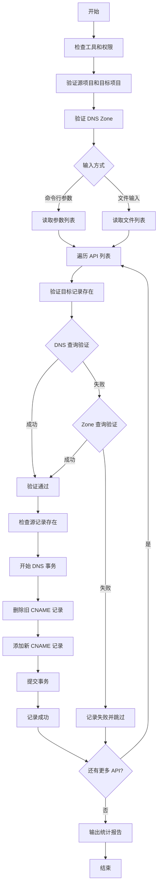

# GCP DNS 记录迁移脚本

## 问题分析

需要将 DNS 记录从 Project A 迁移到 Project B，核心流程包括：

1. 验证目标记录在 Project B 中存在
1. 更新 Project A 中的 CNAME 记录指向 Project B
1. 支持批量处理多个 API 名称

## 解决方案

### 完整迁移脚本

```bash
#!/bin/bash

##############################################
# GCP DNS 记录迁移脚本
# 用途: 将 DNS 记录从源项目迁移到目标项目
##############################################

set -e

# ============= 配置区域 =============
SOURCE_PROJECT="a-project"
TARGET_PROJECT="b-project"
ENV="prod"  # 或 dev, staging 等
REGION="us-central1"
BASE_DOMAIN="gcp.cloud.${REGION}.aibang"

# DNS Zone 配置
SOURCE_ZONE="${SOURCE_PROJECT}"
TARGET_ZONE="${TARGET_PROJECT}"

# 日志文件
LOG_FILE="dns_migration_$(date +%Y%m%d_%H%M%S).log"

# ============= 函数定义 =============

# 日志记录函数
log() {
    echo "[$(date +'%Y-%m-%d %H:%M:%S')] $1" | tee -a "$LOG_FILE"
}

# 错误处理函数
error_exit() {
    log "ERROR: $1"
    exit 1
}

# 检查必要的工具
check_requirements() {
    log "检查必要工具..."
    
    if ! command -v gcloud &> /dev/null; then
        error_exit "gcloud 命令未找到，请安装 Google Cloud SDK"
    fi
    
    if ! command -v dig &> /dev/null && ! command -v nslookup &> /dev/null; then
        error_exit "dig 或 nslookup 命令未找到"
    fi
    
    log "工具检查完成"
}

# 验证项目访问权限
verify_project_access() {
    local project=$1
    log "验证项目 ${project} 访问权限..."
    
    if ! gcloud projects describe "${project}" &> /dev/null; then
        error_exit "无法访问项目 ${project}，请检查权限"
    fi
    
    log "项目 ${project} 访问验证通过"
}

# 检查 DNS Zone 是否存在
verify_dns_zone() {
    local project=$1
    local zone=$2
    
    log "检查项目 ${project} 中的 DNS Zone: ${zone}"
    
    if ! gcloud dns managed-zones describe "${zone}" \
        --project="${project}" &> /dev/null; then
        error_exit "DNS Zone ${zone} 在项目 ${project} 中不存在"
    fi
    
    log "DNS Zone ${zone} 存在"
}

# 方法1: 使用 DNS 查询验证记录存在
verify_record_by_query() {
    local fqdn=$1
    log "方法1: 使用 DNS 查询验证记录 ${fqdn}"
    
    if command -v dig &> /dev/null; then
        local result=$(dig +short "${fqdn}" @8.8.8.8 2>/dev/null)
        if [ -z "$result" ]; then
            return 1
        fi
        log "DNS 查询结果: ${result}"
        return 0
    elif command -v nslookup &> /dev/null; then
        if nslookup "${fqdn}" 8.8.8.8 &> /dev/null; then
            log "nslookup 查询成功"
            return 0
        fi
        return 1
    fi
    
    return 1
}

# 方法2: 检查记录是否存在于 DNS Zone
verify_record_in_zone() {
    local project=$1
    local zone=$2
    local record_name=$3
    
    log "方法2: 检查记录 ${record_name} 是否存在于 Zone ${zone}"
    
    local records=$(gcloud dns record-sets list \
        --zone="${zone}" \
        --project="${project}" \
        --filter="name:${record_name}" \
        --format="value(name)" 2>/dev/null)
    
    if [ -z "$records" ]; then
        return 1
    fi
    
    log "记录在 Zone 中存在: ${records}"
    return 0
}

# 获取当前记录详情
get_current_record() {
    local project=$1
    local zone=$2
    local record_name=$3
    
    log "获取当前记录详情: ${record_name}"
    
    gcloud dns record-sets describe "${record_name}" \
        --zone="${zone}" \
        --project="${project}" \
        --format="json" 2>/dev/null || echo "{}"
}

# 更新 DNS 记录
update_dns_record() {
    local api_name=$1
    local source_fqdn="${api_name}.${SOURCE_PROJECT}.${ENV}.${BASE_DOMAIN}."
    local target_fqdn="${api_name}.${TARGET_PROJECT}.${ENV}.${BASE_DOMAIN}."
    
    log "=========================================="
    log "开始处理 API: ${api_name}"
    log "源记录: ${source_fqdn}"
    log "目标记录: ${target_fqdn}"
    
    # 步骤1: 验证目标记录存在
    log "步骤1: 验证目标记录存在性"
    
    local verification_passed=false
    
    # 尝试方法1: DNS 查询
    if verify_record_by_query "${target_fqdn}"; then
        verification_passed=true
    # 尝试方法2: Zone 查询
    elif verify_record_in_zone "${TARGET_PROJECT}" "${TARGET_ZONE}" "${target_fqdn}"; then
        verification_passed=true
    else
        log "WARNING: 目标记录 ${target_fqdn} 验证失败，跳过此记录"
        return 1
    fi
    
    if [ "$verification_passed" = false ]; then
        log "ERROR: 目标记录 ${target_fqdn} 不存在"
        return 1
    fi
    
    log "目标记录验证通过"
    
    # 步骤2: 检查源记录是否存在
    log "步骤2: 检查源记录"
    
    if ! verify_record_in_zone "${SOURCE_PROJECT}" "${SOURCE_ZONE}" "${source_fqdn}"; then
        log "WARNING: 源记录 ${source_fqdn} 不存在，跳过"
        return 1
    fi
    
    # 获取当前记录的 TTL
    local current_ttl=$(gcloud dns record-sets describe "${source_fqdn}" \
        --zone="${SOURCE_ZONE}" \
        --project="${SOURCE_PROJECT}" \
        --format="value(ttl)" 2>/dev/null || echo "300")
    
    # 步骤3: 开始 DNS 事务更新
    log "步骤3: 更新 DNS 记录"
    
    # 开始事务
    gcloud dns record-sets transaction start \
        --zone="${SOURCE_ZONE}" \
        --project="${SOURCE_PROJECT}" || error_exit "无法启动 DNS 事务"
    
    # 删除旧记录
    local old_target=$(gcloud dns record-sets describe "${source_fqdn}" \
        --zone="${SOURCE_ZONE}" \
        --project="${SOURCE_PROJECT}" \
        --format="value(rrdatas[0])" 2>/dev/null)
    
    if [ -n "$old_target" ]; then
        log "删除旧记录，指向: ${old_target}"
        gcloud dns record-sets transaction remove \
            --name="${source_fqdn}" \
            --type=CNAME \
            --ttl="${current_ttl}" \
            --zone="${SOURCE_ZONE}" \
            --project="${SOURCE_PROJECT}" \
            "${old_target}" || {
                gcloud dns record-sets transaction abort \
                    --zone="${SOURCE_ZONE}" \
                    --project="${SOURCE_PROJECT}"
                error_exit "删除旧记录失败"
            }
    fi
    
    # 添加新记录
    log "添加新记录，指向: ${target_fqdn}"
    gcloud dns record-sets transaction add \
        --name="${source_fqdn}" \
        --type=CNAME \
        --ttl="${current_ttl}" \
        --zone="${SOURCE_ZONE}" \
        --project="${SOURCE_PROJECT}" \
        "${target_fqdn}" || {
            gcloud dns record-sets transaction abort \
                --zone="${SOURCE_ZONE}" \
                --project="${SOURCE_PROJECT}"
            error_exit "添加新记录失败"
        }
    
    # 执行事务
    log "提交 DNS 事务"
    gcloud dns record-sets transaction execute \
        --zone="${SOURCE_ZONE}" \
        --project="${SOURCE_PROJECT}" || error_exit "DNS 事务执行失败"
    
    log "SUCCESS: ${api_name} DNS 记录更新完成"
    log "=========================================="
    return 0
}

# 从文件读取 API 列表并处理
process_api_list_from_file() {
    local file=$1
    
    if [ ! -f "$file" ]; then
        error_exit "API 列表文件不存在: ${file}"
    fi
    
    log "从文件读取 API 列表: ${file}"
    
    local success_count=0
    local fail_count=0
    
    while IFS= read -r api_name || [ -n "$api_name" ]; do
        # 跳过空行和注释
        [[ -z "$api_name" || "$api_name" =~ ^# ]] && continue
        
        # 去除前后空格
        api_name=$(echo "$api_name" | xargs)
        
        if update_dns_record "$api_name"; then
            ((success_count++))
        else
            ((fail_count++))
        fi
    done < "$file"
    
    log "=========================================="
    log "迁移完成统计:"
    log "成功: ${success_count}"
    log "失败: ${fail_count}"
    log "=========================================="
}

# 处理命令行参数传入的 API 列表
process_api_list_from_args() {
    local api_list=("$@")
    
    if [ ${#api_list[@]} -eq 0 ]; then
        error_exit "未提供 API 名称"
    fi
    
    log "处理命令行参数中的 API 列表"
    
    local success_count=0
    local fail_count=0
    
    for api_name in "${api_list[@]}"; do
        if update_dns_record "$api_name"; then
            ((success_count++))
        else
            ((fail_count++))
        fi
    done
    
    log "=========================================="
    log "迁移完成统计:"
    log "成功: ${success_count}"
    log "失败: ${fail_count}"
    log "=========================================="
}

# ============= 主函数 =============

main() {
    log "=========================================="
    log "GCP DNS 迁移脚本启动"
    log "源项目: ${SOURCE_PROJECT}"
    log "目标项目: ${TARGET_PROJECT}"
    log "环境: ${ENV}"
    log "=========================================="
    
    # 预检查
    check_requirements
    verify_project_access "${SOURCE_PROJECT}"
    verify_project_access "${TARGET_PROJECT}"
    verify_dns_zone "${SOURCE_PROJECT}" "${SOURCE_ZONE}"
    verify_dns_zone "${TARGET_PROJECT}" "${TARGET_ZONE}"
    
    # 根据参数决定处理方式
    if [ "$1" = "-f" ] || [ "$1" = "--file" ]; then
        # 从文件读取
        if [ -z "$2" ]; then
            error_exit "请提供 API 列表文件路径"
        fi
        process_api_list_from_file "$2"
    elif [ $# -gt 0 ]; then
        # 从命令行参数读取
        process_api_list_from_args "$@"
    else
        error_exit "请提供 API 名称或使用 -f 参数指定文件"
    fi
    
    log "脚本执行完成，日志文件: ${LOG_FILE}"
}

# ============= 脚本入口 =============

# 显示使用帮助
if [ "$1" = "-h" ] || [ "$1" = "--help" ]; then
    cat << EOF
使用方法:
  $0 <api-name1> [api-name2 ...]           # 直接传入 API 名称
  $0 -f <file>                              # 从文件读取 API 列表
  $0 --file <file>                          # 从文件读取 API 列表
  $0 -h | --help                            # 显示帮助信息

示例:
  $0 user-service order-service             # 迁移两个 API
  $0 -f api_list.txt                        # 从文件读取
  
文件格式 (api_list.txt):
  user-service
  order-service
  payment-service
  # 这是注释，会被忽略

配置说明:
  请在脚本顶部 '配置区域' 修改以下参数:
  - SOURCE_PROJECT: 源项目 ID
  - TARGET_PROJECT: 目标项目 ID
  - ENV: 环境名称
  - REGION: 区域名称
EOF
    exit 0
fi

# 执行主函数
main "$@"
```

### API 列表文件示例

创建一个 `api_list.txt` 文件：

```text
# API 迁移列表
# 格式: 每行一个 API 名称

user-service
order-service
payment-service
inventory-service
notification-service

# 下面是测试环境的 API
# test-api-1
# test-api-2
```

## 使用方法

### 方式1: 命令行参数传入

```bash
# 单个 API
./dns_migration.sh user-service

# 多个 API
./dns_migration.sh user-service order-service payment-service
```

### 方式2: 从文件读取

```bash
# 使用 -f 参数
./dns_migration.sh -f api_list.txt

# 或使用 --file 参数
./dns_migration.sh --file api_list.txt
```

### 查看帮助

```bash
./dns_migration.sh --help
```

## 流程图



## 注意事项

### 执行前准备

1. **权限配置**
   
   ```bash
   # 确保有足够的权限
   gcloud auth login
   gcloud config set project <your-project>
   
   # 验证权限
   gcloud dns managed-zones list --project=<source-project>
   gcloud dns managed-zones list --project=<target-project>
   ```
1. **脚本权限**
   
   ```bash
   chmod +x dns_migration.sh
   ```
1. **配置修改**

- 修改脚本顶部的配置区域
- 确认 `SOURCE_PROJECT`、`TARGET_PROJECT` 等参数正确

### 重要提醒

|项目         |说明                         |
|-----------|---------------------------|
|**DNS TTL**|脚本会保持原有 TTL 值，默认 300 秒     |
|**DNS 传播** |更新后需要等待 DNS 传播生效，通常 5-30 分钟|
|**回滚准备**   |建议记录原始配置，以便需要时回滚           |
|**批量操作**   |建议先测试单个 API 后再批量执行         |
|**日志保存**   |每次执行会生成带时间戳的日志文件           |
|**错误处理**   |单个 API 失败不会影响其他 API 的处理    |

### 验证迁移结果

```bash
# 验证 DNS 记录更新
dig {api-name}.{a-project}.{env}.gcp.cloud.{region}.aibang

# 查看记录详情
gcloud dns record-sets describe \
    {api-name}.{a-project}.{env}.gcp.cloud.{region}.aibang. \
    --zone={a-project} \
    --project={source-project}

# 检查日志
cat dns_migration_*.log
```

### 回滚操作

如需回滚，可以修改脚本中的 `SOURCE_PROJECT` 和 `TARGET_PROJECT` 互换后重新执行。

### 最佳实践

1. **分阶段迁移**: 先迁移非关键服务进行验证
1. **监控告警**: 迁移期间加强监控
1. **业务低峰**: 选择业务低峰期执行
1. **保留日志**: 保存所有迁移日志至少 30 天
1. **通知相关方**: 提前通知相关团队迁移计划​​​​​​​​​​​​​​​​