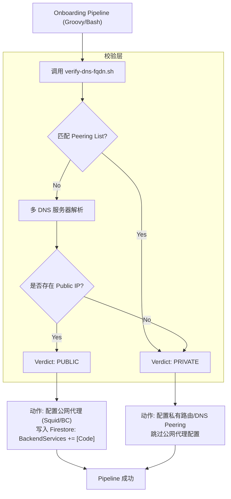

# FQDN 出口模式选择最佳实践 (Public vs Private)

本文档基于 `dns/verify-dns-fqdn.sh` 脚本的输出逻辑，旨在为 Onboarding Pipeline 提供一种标准化的决策机制，自动判断 FQDN 应走 **公网出口代理 (Public Egress)** 还是 **内部私有链路 (Private Peering/Interconnect)**。

## 1. 核心决策逻辑

脚本 `verify-dns-fqdn.sh` 通过多 DNS 服务器校验，将 FQDN 的解析结果归类为 `PUBLIC` 或 `PRIVATE`。

### 决策分支：
- **模式 A: Public (公网模式)**
    - **判断依据**：解析结果包含非 RFC1918 的公网 IP。
    - **采取动作**：启用 \`publicEgress\` 配置，分配 Squid/Blue-Coat 代理，写入 Firestore \`BackendServices\` 数组。
- **模式 B: Private (私有模式)**
    - **判断依据**：解析结果仅包含私有 IP (10.x, 172.16-31.x, 192.168.x) 或匹配 \`DNS_PEERING\` 列表。
    - **采取动作**：绕过公网代理，使用 Cloud DNS Peering 或直接路由通过 Interconnect 访问。

---

## 2. 系统调用流程图 (Mermaid)



---

## 3. 最佳实践：如何调用与解析输出

由于 \`verify-dns-fqdn.sh\` 默认输出包含 ANSI 颜色代码和复杂的表格（适合人类阅读），在自动化流程中建议采用以下两种方式之一进行调用：

### 方案一：使用封装好的判定函数 (推荐)
通过 \`grep\` 提取 SUMMARY TABLE 中的关键判定结果。如果任何一个主流 DNS（如 8.8.8.8）返回 PUBLIC，则判定为 PUBLIC。

```bash
#!/bin/bash
DOMAIN=$1
# 运行脚本并过滤掉 ANSI 颜色，提取结果列
VERDICT=\$(./dns/verify-dns-fqdn.sh "\$DOMAIN" | sed -r "s/\x1B\[([0-9]{1,3}(;[0-9]{1,2})?)?[mGK]//g" | grep "8.8.8.8" | awk -F'|' '{print \$3}' | xargs)

if [ "\$VERDICT" == "PUBLIC" ]; then
    echo "Action: Applying Public Egress Policy for \$DOMAIN"
    # 执行 public_egress_config 逻辑
elif [ "\$VERDICT" == "PRIVATE" ]; then
    echo "Action: Applying Private Routing Policy for \$DOMAIN"
    # 执行内部路由逻辑
else
    echo "Error: Unknown verdict or DNS failure for \$DOMAIN"
    exit 1
fi
```

### 方案二：脚本增强 (代码侧改进)
建议在脚本中增加 \`--json\` 或 \`--short\` 标记，直接返回决策字符串。

```bash
# 建议在脚本末尾增加逻辑：
if [[ "\$*" == *"--short"* ]]; then
    # 逻辑：如果 SERVER_RESULTS 包含 PUBLIC 则输出 PUBLIC
    if [[ " \${SERVER_RESULTS[@]} " =~ " PUBLIC " ]]; then
        echo "PUBLIC"
    else
        echo "PRIVATE"
    fi
    exit 0
fi
```

---

## 4. 异常处理与边缘情况

| 场景 | 推荐处理策略 |
| :--- | :--- |
| **解析失败 (FAILED)** | 判定为风险，Pipeline 报错退出，要求人工介入确认。 |
| **混合结果 (Mixed)** | 一些 DNS 返回 Public，另一些返回 Private。**安全优先原则**：判定为 PUBLIC，通过代理访问。 |
| **空记录 (EMPTY)** | 检查域名拼写或检查是否属于内部尚未发布的域名。 |
| **本地环回 (LOCAL)** | 判定为非法配置，禁止在 Onboarding 中使用。 |

---

## 5. 总结

通过 \`verify-dns-fqdn.sh\` 的自动化调用，我们实现了从“人工判断域名走哪”到“自动化基线判断”的转变。这不仅提高了 Onboarding 的效率，更确保了生产环境网络策略的**安全性（不误放私有流量走公网）**和**一致性（统一的分类标准）**。

---
*Generated by Alma @ 2026-01-01*
