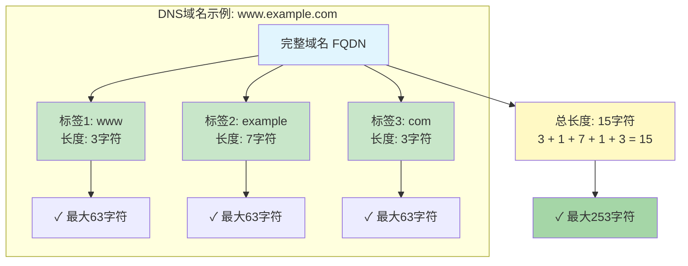
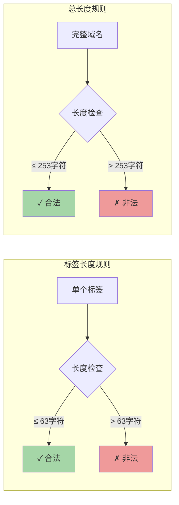
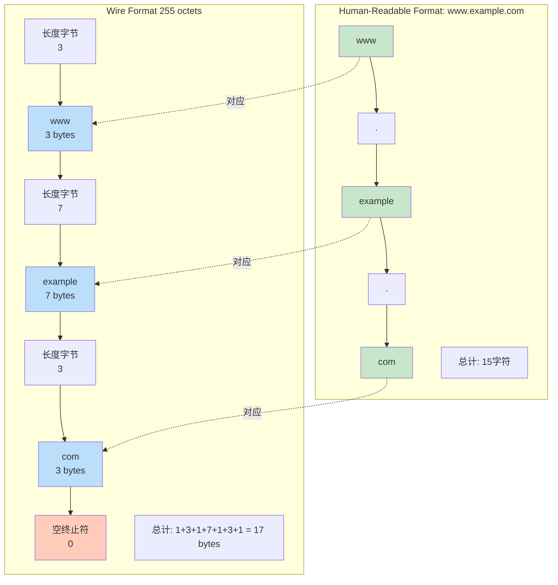
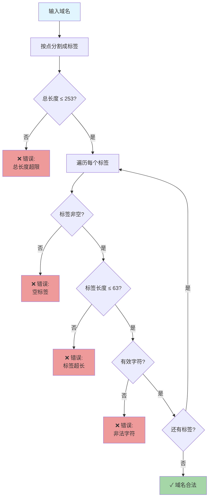
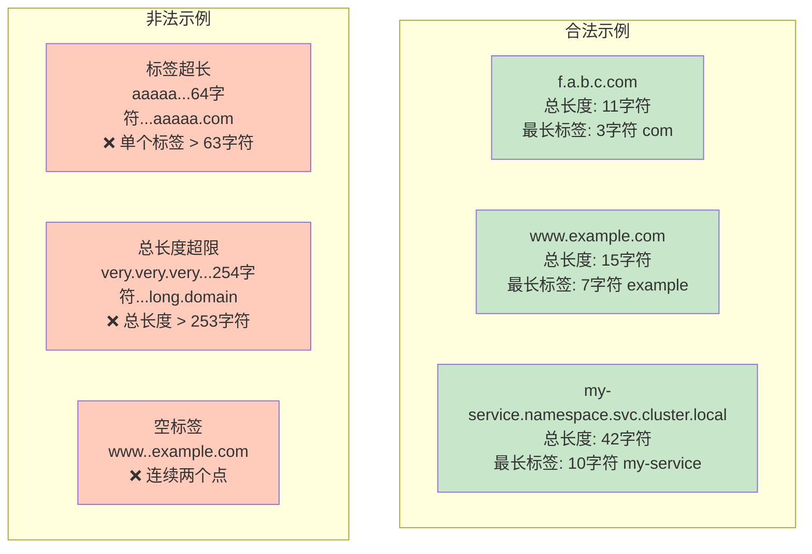
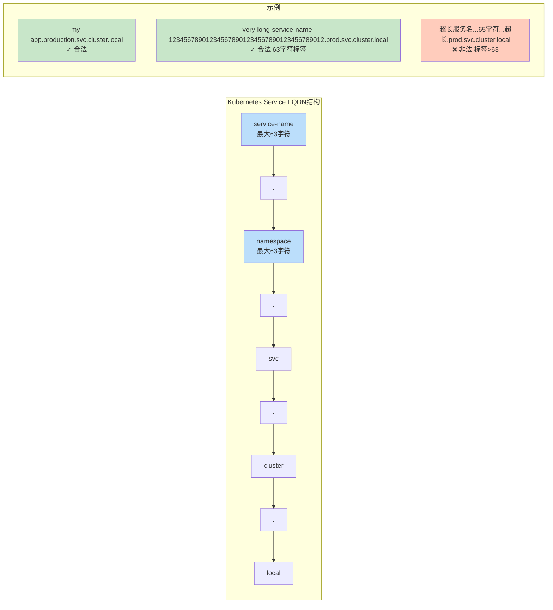
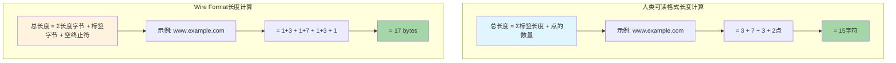

# DNS域名长度规范

本文档详细说明DNS域名的长度限制，包括总长度和标签（Label）长度的规范。

## 核心规范 (RFC 1035)

### 1. 标签（Label）长度限制

**标签定义**：标签是域名中由点（`.`）分隔的每一段。

例如：`f.a.b.c.com`
- `f` 是一个标签
- `a` 是一个标签
- `b` 是一个标签
- `c` 是一个标签
- `com` 是一个标签

**标签长度限制**：
- **最大长度**：63 字符（63 octets/bytes）
- **最小长度**：1 字符
- **有效字符**：
  - 字母：a-z, A-Z（不区分大小写）
  - 数字：0-9
  - 连字符：`-`（但不能作为标签的开头或结尾）

### 2. 完整域名（FQDN）总长度限制

**在线格式（Wire Format）**：
- 最大 **255 octets**（包括长度字节和空终止符）

**人类可读格式（Human-Readable Format）**：
- 实际最大 **253 字符**
- 这是因为线格式包含：
  - 每个标签的长度字节（1 byte per label）
  - 根域的空终止符（1 byte）

### 3. 实际示例

#### 示例 1：`f.a.b.c.com`
```
标签分析：
- f     → 1 字符 ✓
- a     → 1 字符 ✓
- b     → 1 字符 ✓
- c     → 1 字符 ✓
- com   → 3 字符 ✓

总长度：1 + 1 + 1 + 1 + 1 + 3 + 4（点） = 11 字符 ✓
```

#### 示例 2：最大标签长度
```
aaaaaaaaaaaaaaaaaaaaaaaaaaaaaaaaaaaaaaaaaaaaaaaaaaaaaaaaaaaaa.com
└────────────────────────63个字符────────────────────────┘

这是有效的，因为第一个标签正好是63字符。
```

#### 示例 3：超出标签长度限制（无效）
```
aaaaaaaaaaaaaaaaaaaaaaaaaaaaaaaaaaaaaaaaaaaaaaaaaaaaaaaaaaaaaa64.com
└────────────────────────64个字符────────────────────────┘
❌ 无效：第一个标签超过63字符
```

#### 示例 4：接近总长度限制
```
最长的有效FQDN示例（253字符）：
aaaaaaaaaaaaaaaaaaaaaaaaaaaaaaaaaaaaaaaaaaaaaaaaaaa.bbbbbbbbbbbbbbbbbbbbbbbbbbbbbbbbbbbbbbbbbbbbbbbbbbbb.cccccccccccccccccccccccccccccccccccccccccccccccccccc.dddddddddddddddddddddddddddddddddddddddddddddddddddd.eeeeeeeeeeeeeeeeeeeeeeeeeeeee.com

每个标签 ≤ 63字符
总长度 ≤ 253字符
```

## 长度计算规则

### 人类可读格式计算
```
总长度 = Σ(每个标签的长度) + (点的数量)
```

例如：`www.example.com`
- 标签长度：3 + 7 + 3 = 13
- 点的数量：2
- 总长度：13 + 2 = 15 字符

### 线格式（Wire Format）计算
```
线格式长度 = Σ(1字节长度前缀 + 标签字节) + 1字节空终止符
```

例如：`www.example.com`
```
[3]www[7]example[3]com[0]
├─┘   ├──────┘   ├─┘ └─ 空终止符
1+3 + 1+7      + 1+3 + 1 = 17 bytes
```

## 常见场景的长度限制

### Kubernetes Service DNS

Kubernetes中的Service DNS遵循相同的RFC 1035规范：

```
<service-name>.<namespace>.svc.cluster.local
```

**限制**：
- `service-name`：最多 63 字符
- `namespace`：最多 63 字符
- 完整FQDN：最多 253 字符

**示例**：
```
my-very-long-service-name-with-many-characters-12345678901234.my-long-namespace-name.svc.cluster.local
└──────────────────────63字符以内─────────────────────┘└──────63字符以内──────┘
```

### GCP Cloud DNS

GCP Cloud DNS同样遵循RFC 1035：
- 标签最大长度：63 字符
- FQDN最大长度：253 字符

### 子域名层级限制

虽然RFC 1035没有明确限制层级数量，但总长度限制（253字符）实际限制了层级深度。

**理论最大层级**（每个标签1字符）：
```
a.b.c.d.e.f.g.h.i.j.k.l.m.n.o.p.q.r.s.t.u.v.w.x.y.z...
```
最多约 **127 层**（253字符 ÷ 2 = 126.5）

## 验证工具

### Shell脚本验证
```bash
#!/bin/bash

# 验证域名长度
validate_dns_name() {
    local domain="$1"
    local total_length=${#domain}
    
    # 检查总长度
    if [ $total_length -gt 253 ]; then
        echo "❌ 域名总长度超出限制: ${total_length} > 253"
        return 1
    fi
    
    # 检查每个标签长度
    IFS='.' read -ra labels <<< "$domain"
    for label in "${labels[@]}"; do
        local label_length=${#label}
        if [ $label_length -gt 63 ]; then
            echo "❌ 标签 '$label' 长度超出限制: ${label_length} > 63"
            return 1
        fi
        if [ $label_length -eq 0 ]; then
            echo "❌ 标签不能为空"
            return 1
        fi
    done
    
    echo "✓ 域名合法: ${domain} (总长度: ${total_length})"
    return 0
}

# 测试
validate_dns_name "f.a.b.c.com"
validate_dns_name "www.example.com"
```

### Python验证
```python
def validate_dns_name(domain):
    """验证DNS域名长度"""
    # 检查总长度
    if len(domain) > 253:
        return False, f"总长度 {len(domain)} 超过 253"
    
    # 检查标签长度
    labels = domain.split('.')
    for label in labels:
        if len(label) > 63:
            return False, f"标签 '{label}' 长度 {len(label)} 超过 63"
        if len(label) == 0:
            return False, "标签不能为空"
    
    return True, "域名合法"

# 测试
print(validate_dns_name("f.a.b.c.com"))
# 输出: (True, '域名合法')
```

## 常见问题

### Q1: 为什么是253而不是255？
A: Wire format中包括：
- 每个标签前的长度字节（1 byte per label）
- 根域的空终止符（1 byte）
- 这两个字节占用了255中的2个，剩余253可用于人类可读字符

### Q2: 子域名可以有多少层？
A: 理论上没有硬性层级限制，但受总长度253字符的约束。如果每个标签都是1字符，最多约127层。

### Q3: 国际化域名（IDN）如何计算长度？
A: IDN在Wire format中使用Punycode编码（如 `xn--...`），长度计算基于编码后的ASCII表示。

### Q4: 大小写是否影响长度？
A: DNS不区分大小写，`Example.COM` 和 `example.com` 长度相同。

## 实践建议

1. **保持简短**：虽然最大限制是253字符，但更短的域名更易记忆和输入
2. **避免极限**：不要使用接近63字符的标签
3. **验证输入**：在应用层验证用户输入的域名长度
4. **考虑兼容性**：某些老系统可能有更严格的限制
5. **Kubernetes命名**：Service和Namespace名称应保持在63字符以内

## 参考资料

- [RFC 1035](https://www.ietf.org/rfc/rfc1035.txt) - Domain Names - Implementation and Specification
- [RFC 1123](https://www.ietf.org/rfc/rfc1123.txt) - Requirements for Internet Hosts
- [ICANN - Domain Name Length](https://www.icann.org/resources/pages/domain-name-length-2021-06-17-en)

## 总结

| 项目 | 最大长度 | 备注 |
|------|---------|------|
| 单个标签（Label） | 63 字符 | 点之间的部分 |
| 完整域名（FQDN） | 253 字符 | 人类可读格式 |
| Wire Format | 255 octets | 包含长度字节和终止符 |
| 标签层级 | 无硬性限制 | 受总长度约束，理论最多~127层 |
| 有效字符 | a-z, A-Z, 0-9, `-` | 连字符不能在开头或结尾 |

---

## 可视化图表

### 1. DNS域名结构和长度限制



### 2. 长度限制规则



### 3. Wire Format vs Human-Readable Format



### 4. 域名验证流程图



### 5. 实际示例对比



### 6. Kubernetes Service DNS示例



### 7. 长度计算公式


