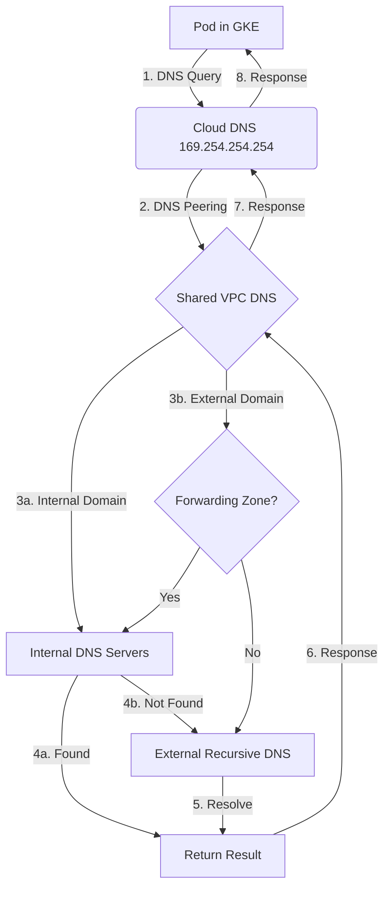
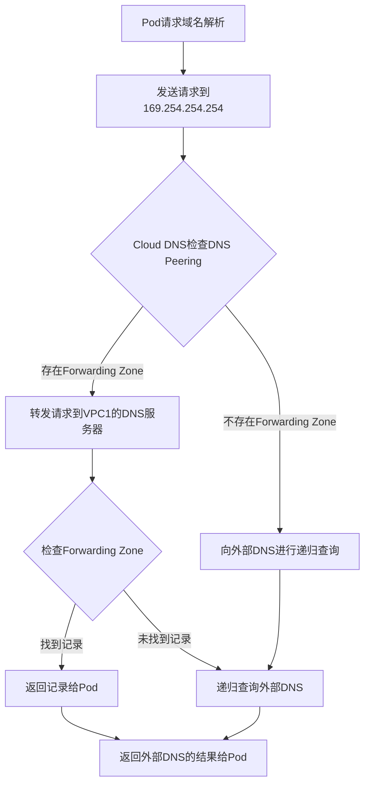
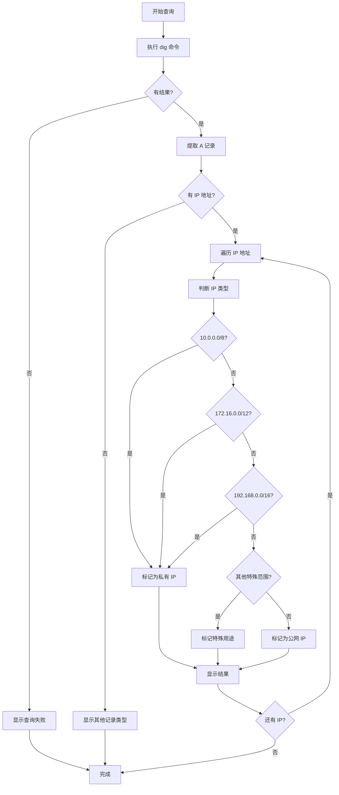

# a 
在我的GCP工程中，有Shared的VPC和Private的VPC我们的GKE安装在Private的VPC上面。我现在有这样一个DNS解析或者说DNS Peering的问题。比如我这边有Instance主机其有2个网络Shared VPC的和Private的。其能解析到一个域名，比如域名是www.abc.aibang. 我如果在我的工程里面配置了一个DNS Peering aibang.com 那么我可以在我的Private的GKE里面解析到对应www.abc.aibang这样的域名。
现在的问题是我Shared的VPC也能解析到比如www.abc.aibangjuxin 但是我的Private的GKE里面无法解析道这个www.abc.aibangjuxin.那么有什么解决方案能让我的Private的网络里面能解析aibangjuxin这样的Domain ？

# q 
您遇到的问题是由于 Shared VPC 和 Private VPC 之间的 DNS 解析隔离导致的。您的 Private GKE 集群无法解析 Shared VPC 中的域名，是因为它们处于不同的网络环境，无法直接进行 DNS 查询。

以下是一些解决方案，可以帮助您在 Private GKE 集群中解析 Shared VPC 中的域名：

**1. 使用 Cloud DNS 的私有区域：**

* **创建私有区域:** 在 Cloud DNS 中创建一个私有区域，将您的 Shared VPC 和 Private GKE 集群都添加到该私有区域中。
* **添加记录:** 在私有区域中添加记录，将 `aibangjuxin` 域名的解析指向您的 Shared VPC 中的实例。
* **配置 GKE DNS:** 配置您的 Private GKE 集群的 DNS 配置，使其使用该私有区域进行 DNS 解析。

**2. 使用 VPC 网络之间的 DNS 转发：**

* **创建 DNS 转发器:** 在您的 Shared VPC 中创建一个 DNS 转发器，并将 `aibangjuxin` 域名的解析转发到您的 Shared VPC 中的实例。
* **添加转发规则:** 在您的 Private GKE 集群的网络配置中，添加一个 DNS 转发规则，将 `aibangjuxin` 域名的解析转发到 Shared VPC 中的 DNS 转发器。

**3. 使用内部负载均衡器：**

* **创建内部负载均衡器:** 在您的 Shared VPC 中创建一个内部负载均衡器，并将您的 `aibangjuxin` 域名指向该负载均衡器。
* **访问负载均衡器:** 在您的 Private GKE 集群中，使用内部负载均衡器服务进行访问。

**4. 使用 VPN 连接：**

* **建立 VPN 连接:** 在您的 Shared VPC 和 Private GKE 集群之间建立一个 VPN 连接，以实现两个网络之间的互连。
* **配置 DNS 解析:** 在您的 Private GKE 集群中，配置 DNS 解析器使用 VPN 连接进行 DNS 查询，以便访问 Shared VPC 中的 DNS 服务器。

**5. 使用 Cloud Router：**

* **配置 Cloud Router:** 在您的 Private GKE 集群中配置 Cloud Router，并添加一个路由规则，将 `aibangjuxin` 域名的解析流量路由到 Shared VPC 中的 DNS 服务器。

**选择最佳解决方案的建议：**

* **私有区域:** 适用于您需要在多个 VPC 之间共享 DNS 解析的场景，并且需要对 DNS 解析进行细粒度控制。
* **DNS 转发:** 适用于您只需要将特定的域名解析转发到其他 VPC 的场景。
* **内部负载均衡器:** 适用于您需要将服务暴露给 Private GKE 集群，但不需要外部访问的场景。
* **VPN 连接:** 适用于您需要在两个 VPC 之间进行全面的互联，并需要通过 VPN 进行数据传输的场景。
* **Cloud Router:** 适用于您需要在多个 VPC 之间进行网络连接和路由配置的场景。

**其他注意事项：**

* 确保您的 Shared VPC 和 Private GKE 集群的 DNS 服务器配置正确，并且可以相互访问。
* 确保您的 GKE 集群的网络配置允许访问 Shared VPC 中的 DNS 服务器或内部负载均衡器。
* 您可以根据您的具体需求选择合适的解决方案，并进行相应的配置。

解析请求在Private VPC中能够正确路由到处理 `aibangjuxin` 域名解析的DNS服务器。这可以通过以下几个步骤来实现：

1. **配置DNS Peering**：
   - 首先，确保`aibangjuxin`域名相关的DNS Zone已经配置了DNS Peering连接到Private VPC。你需要在你的Private VPC中创建一个DNS Peering Zone，并将它与处理`aibangjuxin`域名解析的DNS服务器连接。

2. **检查DNS解析顺序**：
   - 确认Private VPC中的GKE集群配置了正确的DNS解析顺序（例如 `/etc/resolv.conf`），确保DNS查询会优先查询配置了DNS Peering的DNS Zone。

3. **Private VPC的DNS政策**：
   - 在Private VPC中，检查是否有必要的VPC网络或子网DNS策略配置（如Cloud DNS），确保这些策略没有阻止或过滤与`aibangjuxin`相关的DNS解析请求。

4. **测试DNS解析**：
   - 在Private VPC中的一个实例上，手动测试DNS解析是否工作（使用 `dig` 或 `nslookup` 工具），以确认DNS Peering已经生效。

5. **跨VPC的DNS解析**：
   - 如果需要跨VPC的DNS解析，确保VPC之间的DNS解析设置正确。例如，通过VPC Peering连接Shared和Private VPC，并在DNS Peering中配置跨VPC的DNS解决方案。

6. **更新GKE CoreDNS**：
   - 如果你在GKE中使用了CoreDNS，你可能需要更新其配置以确保它能够正确解析`aibangjuxin`域名。

### 总结
基本上，你需要确保DNS Peering正确配置并生效，并且在Private VPC中的GKE集群有正确的DNS配置以查询`aibangjuxin`相关的域名。


我理解您的问题。看起来您有一个复杂的网络设置,包括共享VPC和私有VPC,以及在私有VPC上运行的GKE集群。您遇到的DNS解析问题涉及跨VPC的域名解析。让我们逐步分析这个问题并探讨可能的解决方案。

目前的情况:
1. 共享VPC和私有VPC都能解析 www.abc.aibang 域名。
2. 私有VPC的GKE集群可以解析 www.abc.aibang 域名(通过DNS Peering)。
3. 共享VPC可以解析 www.abc.aibangjuxin 域名。
4. 私有VPC的GKE集群无法解析 www.abc.aibangjuxin 域名。

要解决这个问题,让私有网络也能解析aibangjuxin域名,我们有几个可能的解决方案:

1. 扩展DNS Peering:
   如果可能,您可以扩展现有的DNS Peering配置,使其包含aibangjuxin域名。这可能需要修改DNS Peering的设置,添加新的转发规则。

2. 创建新的DNS Peering:
   如果无法修改现有的DNS Peering,可以考虑为aibangjuxin域名创建一个新的DNS Peering。这将允许私有VPC解析这个新的域名。

3. 使用Cloud DNS Private Zones:
   您可以在私有VPC中创建一个Private Zone,并在其中添加aibangjuxin域名的记录。这样可以确保私有网络中的资源能够解析这个域名。

4. VPC网络对等连接(VPC Network Peering):
   如果还没有建立,可以考虑在共享VPC和私有VPC之间创建网络对等连接。这可以允许私有VPC使用共享VPC的DNS解析能力。

5. 自定义DNS服务器:
   在私有VPC中部署一个自定义DNS服务器,配置它转发特定查询到能够解析aibangjuxin域名的DNS服务器。

6. 使用Cloud NAT:
   如果问题是由于私有VPC无法访问外部DNS服务器造成的,可以考虑使用Cloud NAT来允许私有VPC中的资源访问外部资源。

实施步骤:
1. 评估当前网络设置和安全要求。
2. 选择最适合您环境的解决方案。
3. 在测试环境中实施选定的解决方案。
4. 验证DNS解析是否按预期工作。
5. 监控性能和潜在的安全影响。
6. 如果测试成功,在生产环境中实施。

需要注意的是,实施这些解决方案可能会影响网络安全性和隔离性。建议仔细评估每种方法的影响,并确保遵守您组织的安全政策。

如果您需要更详细地讨论任何特定解决方案,或者需要进一步的指导,请随时告诉我。​​​​​​​​​​​​​​​​


# Question 

```
在GCP工程中,我有一个关于DNS Peering的问题.
当前环境概述

1. VPC1 (Shared VPC): 连接公司内部网络，配置了内部DNS，包含了多个Forwarding Zones。
2. VPC2 (Private VPC): 用于运行GKE环境，Pod使用Cloud DNS的IP地址（169.254.254.254）进行解析。
3. Forwarding Zones: 在Shared VPC中配置的Forwarding Zone（如aibang.和azure.com）会将DNS请求转发到公司内部DNS服务器。

DNS 查询流程

当Pod想要解析一个域名时，查询过程如下：

1. Pod首先将DNS请求发送到169.254.254.254（VPC2内的Cloud DNS）。
2. Cloud DNS接收到请求后，会检查其配置的DNS Peering。如果是向VPC1的DNS Peering请求（如aibang.和azure.com），将转发请求到Shared VPC的DNS服务器。
3. Shared VPC的DNS服务器会查看相应的Forwarding Zone：
	• 如果在Forwarding Zone中可以找到该域名的记录（例如，azure.com），它将返回结果给Cloud DNS。
	• 如果找不到，它会继续向外部递归DNS查询。

我的网络VPC1 是一个Shared的网络 连接公司的一些内部网络 我们在这个网络上配置自己公司内部的DNS
这个DNS可以确保我们内部的一些域名拿到对应的解析
VPC2是我的工程里面的Private VPC我的GKE 的环境运行在这个VPC2上
现在比如我要访问我们公司内部的域名aibang.结尾的域名 那么我需要在我的Google工程里面配置一个 cloud DNS的 DNS peering.
其DNS Name为aibang. 类型是Peering 绑定的网络是我的VPC2.这样的情况下在我的GKE 里面,比如我的Pod去访问对应的aliyun.cloud.aibang.的时候是可以拿到对应的解析的.另外说明下我的GKE 内部使用的是Google提供的cloud dns的地址169.254.254.254没有使用K8S的kube-dns 或者core-dns 
我也知道这个配置能正确的前提是在我的Shared VPC1上有大概下面这个配置 
gcloud dns managed-zones describe aibang —project shared-project 这是一个Forward zone 其会讲对应的请求Forward 我们这个VPC1对应的2台DNS服务器

我现在的问题是这样的比如我内部还有一些域名假设是azure.com这个域名 我们也在Share-project里面配置了对应的forward zone到我们对应的DNS服务器.

我有这样一个担心 假设我也参考aiang.这个域名一样在我的VPC2的工程里面配置增加一个DNS Peering的配置
那么我以后的GKE 里面对真正的需要访问外部网络的关于这个azure.com的域名就有一些麻烦了.它是不是还是先去我的Shared VPC做解析?拿不到的会自动递归继续往外查询?


关于我的环境中这样一个DNS 结构 看看有什么建议,或者我的分析是否正确?
如果可以帮我画一个对应的mermaid的Flow流?
```


您的分析基本正确。我来总结一下您的环境和DNS查询流程，并提供一些建议。然后我会为您绘制一个Mermaid流程图。

分析总结：

1. 您的设置是正确的。对于内部域名（如aibang.），通过DNS Peering可以正确解析。

2. 对于azure.com域名，您的担心是有道理的，但不完全需要担心。如果您在VPC2中为azure.com配置了DNS Peering，查询流程会是：
   a. Pod -> Cloud DNS (169.254.254.254)
   b. Cloud DNS -> Shared VPC DNS (通过Peering)
   c. Shared VPC DNS -> 内部DNS服务器 (通过Forwarding Zone)
   d. 如果内部DNS服务器无法解析，它应该会将请求转发到外部递归DNS服务器。

3. 这个设置的优点是保持了一致性，所有DNS查询都遵循相同的路径。缺点是可能会增加一些延迟。

建议：

1. 保持当前设置，但确保您的内部DNS服务器配置正确，能够转发未知查询到外部递归DNS服务器。

2. 监控DNS查询性能，特别是对外部公共域名的查询。如果发现明显的延迟，可以考虑优化。

3. 对于确定只存在于公网的域名，您可以选择不在VPC2中配置DNS Peering，让Cloud DNS直接查询公网DNS。

4. 考虑使用Cloud DNS的分割视图功能，为内部和外部域名创建不同的解析路径。

现在，让我为您绘制一个Mermaid流程图来说明DNS查询流程：



这个流程图展示了从Pod发起DNS查询到最终获得结果的整个过程，包括内部域名和外部域名的不同处理路径。


您的分析是准确的，DNS查询过程中的确存在您所担心的情况。在配置了DNS Peering的环境中，DNS查询时的过程如您所述。

DNS 查询流程概述

当GKE中的Pod想要解析一个域名（如azure.com）时，查询过程如下：

1. Pod向Cloud DNS发送请求： Pod发送DNS请求到169.254.254.254（VPC2的Cloud DNS）。
2. Cloud DNS检查DNS Peering： 如果有DNS Peering配置, Cloud DNS会查看请求域名（如azure.com）是否属于配置的Forwarding Zone。
3. Forwarding Zone处理:
	• 存在解析记录: 如果在Shared VPC的Forwarding Zone中找到azure.com的记录，返回给Pod。
	• 不存在解析记录: 如果没有找到，Cloud DNS会将请求进行递归查询，尝试找出外部的DNS服务器。

潜在问题

如果您在VPC2中额外为azure.com配置DNS Peering，这将导致以下情况：

• DNS查询可能先尝试在VPC2的配置中查找，如果没有记录，会转职向Shared VPC的DNS进行请求。
• 如果在Shared VPC的Forwarding Zone中找不到记录，最终只依靠外部DNS进行查询。

这会增加查询的复杂性，也可能影响性能和解析速度。因此，避免在VPC2配置与Shared VPC重叠的DNS Peering是明智的选择。

建议

1. 保持域名管理清晰：对于内部使用的域名，确保对域名和Forwarding Zones的管理保持一致，避免任何重叠。
2. 监控DNS查询的结果：使用DNS查询日志来监控成功和失败的解析，以便更快地识别和解决潜在问题。
3. 避免冗余的DNS配置：只在需要的地方配置DNS Peering，确保每个域名只在一个地方管理。

Mermaid 流程图

以下是表示DNS查询流程的Mermaid流程图：


结论

您的理解和分析都是准确的。保持DNS查询的清晰结构，避免在多个VPC中配置重叠的DNS Peering是确保网络稳定和性能的重要环节。


# 问题分析

需要为现有的 DNS 查询脚本添加 IP 地址类型判断功能,识别查询结果中的 IP 地址是否为 RFC1918 定义的私有 IP 地址范围。

# 解决方案

## 1. 添加 IP 类型判断功能

需要实现以下功能:
- 提取 DNS 查询结果中的 IP 地址
- 判断 IP 是否为私有地址 (RFC1918)
- 标识特殊用途 IP 地址范围

## 2. 增强后的脚本

```bash
#!/opt/homebrew/bin/bash

# Check if domain parameter is provided
if [ $# -ne 1 ]; then
  echo "Usage: $0 <domain>"
  echo "Example: $0 www.baidu.com"
  exit 1
fi

# Define domain and DNS server list (using associative array)
DOMAIN=$1
declare -A DNS_SERVERS=(
  ["8.8.8.8"]="Google Public DNS"
  ["119.29.29.29"]="Tencent DNSPod"
  ["114.114.114.114"]="114 DNS"
)

# Define DNS Peering list (using array)
DNS_PEERING=(
  "baidu.com"
  "sohu.com"
)

# ANSI color codes
GREEN='\033[32m'
YELLOW='\033[33m'
RED='\033[31m'
BLUE='\033[34m'
NC='\033[0m'
SEPARATOR="================================================================"

# Function to convert IP to decimal
ip_to_decimal() {
  local ip=$1
  local a b c d
  IFS=. read -r a b c d <<< "$ip"
  echo "$((a * 256 ** 3 + b * 256 ** 2 + c * 256 + d))"
}

# Function to check if IP is in CIDR range
ip_in_cidr() {
  local ip=$1
  local cidr=$2
  local network mask ip_decimal network_decimal
  
  network="${cidr%/*}"
  mask="${cidr#*/}"
  
  ip_decimal=$(ip_to_decimal "$ip")
  network_decimal=$(ip_to_decimal "$network")
  
  # Calculate network mask
  local mask_decimal=$(( (0xFFFFFFFF << (32 - mask)) & 0xFFFFFFFF ))
  
  # Check if IP is in range
  if [ $(( ip_decimal & mask_decimal )) -eq $(( network_decimal & mask_decimal )) ]; then
    return 0
  else
    return 1
  fi
}

# Function to determine IP address type
get_ip_type() {
  local ip=$1
  
  # RFC1918 Private IP ranges
  if ip_in_cidr "$ip" "10.0.0.0/8"; then
    echo "${RED}[Private - RFC1918: 10.0.0.0/8]${NC}"
    return
  fi
  
  if ip_in_cidr "$ip" "172.16.0.0/12"; then
    echo "${RED}[Private - RFC1918: 172.16.0.0/12]${NC}"
    return
  fi
  
  if ip_in_cidr "$ip" "192.168.0.0/16"; then
    echo "${RED}[Private - RFC1918: 192.168.0.0/16]${NC}"
    return
  fi
  
  # Loopback
  if ip_in_cidr "$ip" "127.0.0.0/8"; then
    echo "${YELLOW}[Loopback - RFC1122]${NC}"
    return
  fi
  
  # Link-local
  if ip_in_cidr "$ip" "169.254.0.0/16"; then
    echo "${YELLOW}[Link-Local - RFC3927]${NC}"
    return
  fi
  
  # Carrier-grade NAT (CGNAT)
  if ip_in_cidr "$ip" "100.64.0.0/10"; then
    echo "${YELLOW}[Shared Address Space - RFC6598 CGNAT]${NC}"
    return
  fi
  
  # Multicast
  if ip_in_cidr "$ip" "224.0.0.0/4"; then
    echo "${YELLOW}[Multicast - RFC5771]${NC}"
    return
  fi
  
  # Reserved
  if ip_in_cidr "$ip" "240.0.0.0/4"; then
    echo "${YELLOW}[Reserved - RFC1112]${NC}"
    return
  fi
  
  # Public IP
  echo "${GREEN}[Public IP]${NC}"
}

# Function to extract and classify IP addresses from DNS result
process_dns_result() {
  local result=$1
  
  # Extract A records (IPv4)
  local ips=$(echo "$result" | grep -E "^[^;].*\sA\s" | awk '{print $NF}')
  
  if [ -n "$ips" ]; then
    echo -e "${GREEN}DNS A records found:${NC}"
    while IFS= read -r line; do
      # Extract complete DNS record line
      local full_record=$(echo "$result" | grep -E "\s$line\s*$" | head -1)
      if [ -n "$full_record" ]; then
        local ip_type=$(get_ip_type "$line")
        echo -e "${GREEN}${full_record}${NC} ${ip_type}"
      fi
    done <<< "$ips"
    return 0
  else
    # If no A records, show other record types
    if [ -n "$result" ]; then
      echo -e "${BLUE}Other DNS records found:${NC}"
      echo -e "${BLUE}${result}${NC}"
      return 0
    fi
  fi
  
  return 1
}

# Function to check if domain is in Peering list
check_domain_in_peering() {
  local input_domain="$1"
  for peering_domain in "${DNS_PEERING[@]}"; do
    if [[ "$input_domain" == *"$peering_domain" ]]; then
      return 0
    fi
  done
  return 1
}

# Check if input domain is in Peering list
if check_domain_in_peering "$DOMAIN"; then
  echo -e "✅ Domain $DOMAIN is in DNS Peering list"
else
  echo -e "❌ Domain $DOMAIN is not in DNS Peering list"
fi

# Query each DNS server
for dns in "${!DNS_SERVERS[@]}"; do
  echo -e "\n${SEPARATOR}"
  echo -e "🔍 Using DNS Server: ${GREEN}${dns}${NC} (${DNS_SERVERS[$dns]})"
  echo "${SEPARATOR}"
  
  # Execute dig command and process output
  result=$(dig @"$dns" "$DOMAIN" +noall +answer +authority +additional)
  
  # Check if result exists
  if [ -n "$result" ]; then
    if ! process_dns_result "$result"; then
      echo "❌ No DNS records found"
    fi
  else
    echo "❌ Query failed or no results returned"
  fi
done

echo -e "\n${SEPARATOR}"
echo "✅ Query completed"
```

## 3. 功能流程图



## 4. IP 地址类型判断范围

| IP 范围 | 类型 | RFC 标准 | 用途 |
|---------|------|----------|------|
| 10.0.0.0/8 | 私有地址 | RFC1918 | 内网使用 |
| 172.16.0.0/12 | 私有地址 | RFC1918 | 内网使用 |
| 192.168.0.0/16 | 私有地址 | RFC1918 | 内网使用 |
| 127.0.0.0/8 | 回环地址 | RFC1122 | 本地回环 |
| 169.254.0.0/16 | 链路本地 | RFC3927 | 自动配置 |
| 100.64.0.0/10 | 共享地址 | RFC6598 | 运营商 NAT |
| 224.0.0.0/4 | 组播地址 | RFC5771 | 组播通信 |
| 240.0.0.0/4 | 保留地址 | RFC1112 | 保留使用 |

## 5. 代码示例说明

### IP 转换为十进制
```bash
# 将 IP 地址转换为十进制数,便于范围比较
ip_to_decimal() {
  local ip=$1
  local a b c d
  IFS=. read -r a b c d <<< "$ip"
  echo "$((a * 256 ** 3 + b * 256 ** 2 + c * 256 + d))"
}
```

### CIDR 范围匹配
```bash
# 检查 IP 是否在指定 CIDR 范围内
ip_in_cidr() {
  local ip=$1
  local cidr=$2
  local network mask ip_decimal network_decimal
  
  network="${cidr%/*}"
  mask="${cidr#*/}"
  
  ip_decimal=$(ip_to_decimal "$ip")
  network_decimal=$(ip_to_decimal "$network")
  
  # 计算网络掩码
  local mask_decimal=$(( (0xFFFFFFFF << (32 - mask)) & 0xFFFFFFFF ))
  
  # 检查 IP 是否在范围内
  if [ $(( ip_decimal & mask_decimal )) -eq $(( network_decimal & mask_decimal )) ]; then
    return 0
  else
    return 1
  fi
}
```

# 注意事项

## 使用建议

1. **权限要求**: 脚本无需 root 权限,普通用户即可执行
2. **依赖检查**: 确保系统已安装 `dig` 命令 (bind-tools 或 dnsutils 包)
3. **网络连接**: 需要能够访问配置的 DNS 服务器

## 测试命令

```bash
# 测试私有 IP 域名 (如内网域名)
./script.sh internal.company.com

# 测试公网域名
./script.sh www.baidu.com

# 测试不存在的域名
./script.sh nonexistent.example.com
```

## 扩展建议

如需支持 IPv6 地址判断,可添加以下功能:

```bash
# IPv6 私有地址范围
# fc00::/7 - Unique Local Address (ULA)
# fe80::/10 - Link-Local Address
```

# 最佳实践

1. **日志记录**: 可将查询结果重定向到文件保存
2. **批量查询**: 可通过循环读取域名列表进行批量检测
3. **告警集成**: 发现私有 IP 泄露时可发送告警通知
4. **定时检测**: 通过 cron 定期执行检测任务
