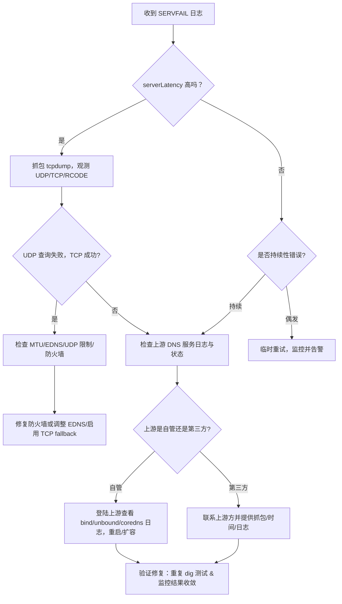

# anaylize

# **问题分析（基于你给出的日志）**

日志显示一次来自 GCE VM 发起的 DNS 查询最终返回 SERVFAIL，重要字段与初步判断如下：

| **字段**        | **值（日志摘录）**          | **含义与初步解读**                            |
| --------------- | --------------------------- | --------------------------------------------- |
| queryName       | abj-2btb-dev-ext.hk.aibang. | 要解析的域名                                  |
| queryType       | A                           | 请求 A 记录                                   |
| protocol        | UDP                         | 使用 UDP（不是 TCP）                          |
| destinationIP   | 10.72.3.18                  | DNS 转发目标（forwarder / upstream DNS）      |
| sourcelp        | 10.92.0.169                 | 发起查询的源 IP（VM）                         |
| serverLatency   | 4799 (ms)                   | upstream 响应延迟约 4.8s（已非常高）          |
| responseCode    | SERVFAIL                    | 最终响应为 SERVFAIL（表示服务器无法完成查询） |
| rdata           | empty                       | 没有返回记录数据                              |
| dns64Translated | false                       | 本次查询没有 DNS64 翻译参与                   |
| authAnswer      | false                       | 返回不是权威答案（期待转发过来的递归结果）    |
| target_type     | forwarding-zone             | 该查询是通过 forwarding-zone 转发出去的       |

**初步结论**

- 上游 DNS（10.72.3.18）在接收查询时出现错误或超时，导致 Cloud DNS/forwarder 返回 SERVFAIL。
- serverLatency 很高（≈4.8s），说明上游响应缓慢或有重试/超时。
- rdata 为空且 authAnswer=false，表明没有成功拿到有效递归答案。
- 使用 UDP，且上游可能不支持 UDP 大包或遇到 EDNS/DNSSEC 问题导致失败；也可能是上游发生软件/配置错误、网络丢包或防火墙阻断。

---

# **逐步排查与验证（可直接在环境中运行的命令与预期解释）**

> **注意**：在执行命令前确认你有相应 GCP 项目 / VM 权限；在生产环境操作前备份或在测试环境验证命令效果。

### **1) 在同一 VM 上复现查询（确认是可复现的问题）**

```
# 从 VM 发起：直接问上游 DNS（UDP 默认）
dig @10.72.3.18 abj-2btb-dev-ext.hk.aibang. A +time=5 +tries=1

# 强制使用 TCP（可测试是否为 UDP/包截断问题）
dig @10.72.3.18 abj-2btb-dev-ext.hk.aibang. A +tcp +time=5

# 如果想看 EDNS/DO 标志
dig @10.72.3.18 abj-2btb-dev-ext.hk.aibang. A +edns=0 +time=5
```

**解释/预期**：

- 若 UDP 查询立刻 SERVFAIL 或超时，而 TCP 查询成功 -> 说明 UDP 被截断、或上游对 UDP 有问题（MTU/EDNS）。
- 若 UDP+TCP 都失败 -> 上游 DNS 本身或网络不可达、或被防火墙阻断、或出现服务故障。
- 如果 TCP 成功而 UDP 失败，可继续查看 UDP MTU/EDNS 设置或启用 TCP fallback。

---

### **2) 验证上游 DNS 可达性与延迟（网络层）**

```
# 测试 UDP 53 可达（使用 nmap 或 nc）
# nc -u 不一定可靠，可用 nmap (在 VM 安装 nmap)
nmap -sU -p 53 10.72.3.18

# 简单 ICMP/TCP ping 来看网络延迟
ping -c 5 10.72.3.18
```

**解释**：

- 如果 ICMP 都不可达或高丢包，说明网络层问题（路由、防火墙、VPC-Connected资源故障）。
- 如果 UDP 端口不可达或被丢弃，检查防火墙/NSG 规则或上游 DNS 服务端配置。

---

### **3) 抓包观察真实 DNS 交互（确认是否有返回包、是否被截断或有 RCODE）**

```
sudo tcpdump -i any host 10.72.3.18 and port 53 -w /tmp/dns_capture.pcap
# 触发一次 dig 查询（另开终端），然后停止 tcpdump。下载或用 Wireshark 打开 /tmp/dns_capture.pcap 分析。
```

**查点**：

- 是否存在 UDP 响应包？响应的 RCODE（0=NOERROR、2=SERVFAIL 等）？响应包大小是否小于请求或是否被分片？
- 是否有 TCP 重试？是否看到 truncated (TC flag) 设置？

---

### **4) 检查 Cloud DNS forwarding zone 配置（在 GCP 控制面或 CLI）**

```
# 列出 managed zones（查找 type: forwarding）
gcloud dns managed-zones list --project YOUR_PROJECT_ID --format="table(name,type,dns_name,description)"

# 查看特定 forwarding-zone 的详细信息（替换 ZONE_NAME）
gcloud dns managed-zones describe ZONE_NAME --project YOUR_PROJECT_ID --format yaml
```

**查点**：

- forwarding zone 的 forwardingTargets 是否包含 10.72.3.18？是否有多个 target（负载/第一级/备份）？
- 查看是否配置了超时、重试策略或 health-check（Cloud DNS forwarding 本身没有 healthcheck，但上游稳定性需要评估）。

---

### **5) 检查 VPC 防火墙规则（是否有阻断到 10.72.3.18:53 的规则）**

```
gcloud compute firewall-rules list --filter="network:aibang-11111-vpchost-asia-prod" --project YOUR_PROJECT_ID
# 或搜索所有允许/拒绝到 10.72.3.18:53 的规则
gcloud compute firewall-rules list --project YOUR_PROJECT_ID --format="table(name,network,direction,priority,allowed,denied,targetTags,sourceRanges)"
```

**查点**：

- 是否有 DENY 或 没有 ALLOW 规则覆盖 UDP/TCP 53，或有特定的 target tag 导致流量被拒。

---

### **6) 检查上游 DNS 服务（如果由你方拥有）**

- 登录到运行 10.72.3.18 的实例/集群，查看 DNS 服务日志（bind/named、unbound、CoreDNS 等）。
- 核查上游是否限制递归、是否启用了 DNSSEC 验证（若上游做了严格 DNSSEC 校验可能导致 SERVFAIL）。
- 检查是否有 rate-limiting、并发限制或资源耗尽（CPU、socket）。

常见命令（在上游主机）：

```
# 对于 bind/named
sudo tail -n 200 /var/log/named/named.log
# 对于 unbound
sudo journalctl -u unbound -n 200
# 对于 coredns (k8s)
kubectl -n kube-system logs deploy/coredns --tail 200
```

---

### **7) 检查 DNSSEC / EDNS 问题**

- 如果上游或 zone 开启 DNSSEC，但上游 resolver 配置错误会返回 SERVFAIL。
- 用 dig +dnssec 测试签名和 AD/DO 标志：

```
dig @10.72.3.18 abj-2btb-dev-ext.hk.aibang. A +dnssec +time=5
```

**若出现 SERVFAIL 且与 DNSSEC 相关**，需要修正签名或上游的验证配置。

---

# **临时缓解与长期改进建议**

1. **应用层重试策略**：在客户端（应用/SDK）加入合理的重试（指数退避）以缓解偶发 SERVFAIL。但不可无限重试。
2. **配置多上游（冗余）**：在 forwarding-zone 配置多个 forwarders（若可能）并设置优先级/轮询，避免单点故障。
3. **允许 TCP fallback**：确保 client/resolver 在 UDP 超时后能使用 TCP 查询（常见 DNS 服务器支持）。
4. **监控与告警**：基于日志中 serverLatency 与 responseCode 做监控（例如：当 5xx 或延迟 >2s/5分钟 内持续上升触发告警）。
5. **排查并修复上游 DNS**：如果上游是你方管理，检查资源、并启用水平扩展与 health checks。若是外部服务，联系其运维并提供抓包与时间点信息。
6. **DNS 缓存策略**：对非频繁变更的记录适当增加 TTL，减少解析压力（注意变更传播代价）。

---

# **日志与告警实用解析片段（示例：用来从日志中筛查类似事件）**

- 基于 Cloud Logging（Logs Explorer）写查询筛选所有 SERVFAIL：

```
resource.type="dns_query"
jsonPayload.responseCode="SERVFAIL"
| jsonPayload.serverLatency >= 1000  # 可选：筛选慢查询
```

- 建议把 top 5 出现 SERVFAIL 的 destination（上游 IP）和 queryName 做聚合，找最常出问题的上游或域名并优先处理。

---

# **典型故障决策树（Mermaid 流程图）**



---

# **快速诊断清单（一页纸）**

- 在 VM 上 dig @10.72.3.18 ...（尝试 UDP/TCP）
- 抓包 tcpdump，确认响应 RCODE、TC 标志、是否有返回包
- 在上游（若可控）查看 DNS 服务日志和性能指标
- 检查 VPC 防火墙规则是否阻断 53/UDP 或 53/TCP
- 检查 forwarding-zone 配置（是否写错了 IP、是否有冗余 target）
- 检查 DNSSEC / EDNS 参数是否导致验证失败
- 添加监控（SERVFAIL 计数 & serverLatency 95th）并设置告警

---

# **小结（马上可行动的三件事）**

1. 在出现 SERVFAIL 的 VM 上运行 dig @10.72.3.18 <name> A +tcp 与 +time=5，快速判断 UDP/TCP 差异。
2. 同时启动 sudo tcpdump -i any port 53 捕获一次失败的交易（保存 pcap，便于上游方分析）。
3. 检查 forwarding-zone 的 forwardingTargets 与 VPC 防火墙规则是否允许到 10.72.3.18:53 的 UDP/TCP 流量。
