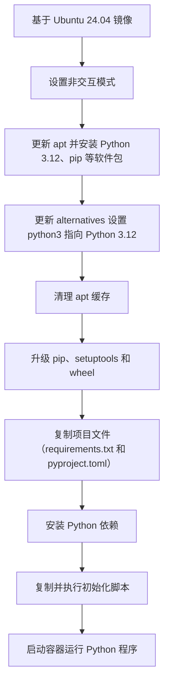
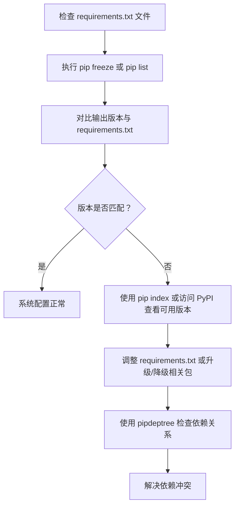
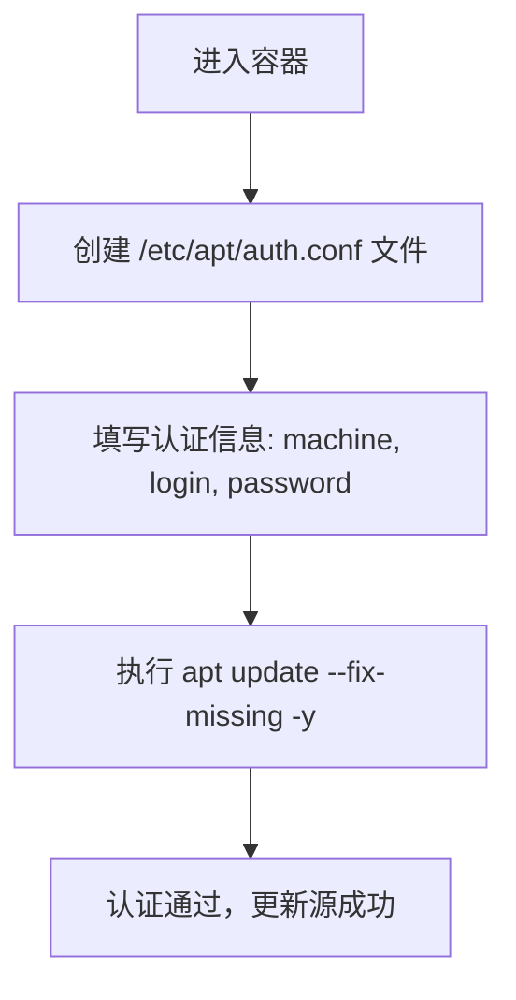

# requirements.txt
在处理 Docker 中 Python 应用的依赖版本时，是否需要固定版本取决于你对 **稳定性** 和 **灵活性** 的权衡。以下是详细分析和建议：

---

### 1. **直接设置为 `>=` 的可行性分析**
#### ✅ **好处**
- **自动兼容新 Python 版本**：当 Python 升级时，某些依赖的最新版本可能已适配新 Python，使用 `>=` 可自动安装兼容版本，减少手动排查。
- **减少维护成本**：无需频繁手动更新每个依赖的版本号，适合依赖较多或更新频繁的项目。

#### ⚠️ **隐患**
- **依赖冲突风险**：若多个包要求不同版本范围，可能导致版本冲突（需 `pip` 自动解决，但未必可靠）。
- **破坏性更新**：某些包的更新可能引入不兼容的 API 变更（尤其是主版本升级），导致应用崩溃。
- **构建结果不可复现**：不同时间的构建可能安装不同依赖版本，难以复现旧镜像行为。

---

### 2. **推荐折中方案**
#### 📌 **策略：动态测试 + 静态锁定**
1. **临时使用 `>=` 解决升级问题**：
   ```dockerfile
   # 临时放宽版本约束，测试新 Python 环境
   RUN pip install -r requirements.txt
   ```
   ```requirements.txt
   requests>=2.25.1  # 原为 requests==2.25.1
   numpy>=1.21.0
   ```

2. **测试通过后，生成新版本锁文件**：
   ```bash
   pip freeze > requirements_lock.txt
   ```
   更新 Dockerfile 使用锁定的精确版本：
   ```dockerfile
   COPY requirements_lock.txt .
   RUN pip install -r requirements_lock.txt
   ```

#### 📌 **使用版本范围约束**
- 允许小版本更新，禁止主版本破坏性变更：
  ```requirements.txt
  requests>=2.25.1,<3.0.0  # 允许 2.x 更新，禁止 3.x
  ```

---

### 3. **升级 Python 时的关键操作步骤**
#### 🔧 **步骤 1：调整 Dockerfile 基础镜像**
```dockerfile
# 原版本
# FROM python:3.8-slim

# 升级到目标 Python 版本（如 3.11）
FROM python:3.11-slim
```

#### 🔧 **步骤 2：解决依赖冲突**
- 如果直接安装失败，使用 `pip` 的依赖解析日志定位问题包：
  ```bash
  pip install -r requirements.txt --no-cache-dir --upgrade \
    --log install.log
  ```
  检查 `install.log` 中冲突的包，手动调整其版本范围。

#### 🔧 **步骤 3：使用依赖管理工具**
- **pip-tools**：
  ```bash
  # 生成精确版本锁文件
  pip-compile --output-file=requirements_lock.txt requirements.txt
  ```
- **Poetry**（更适合复杂项目）：
  ```toml
  [tool.poetry.dependencies]
  python = "^3.11"
  requests = { version = "^2.25.1", allow-prereleases = true }
  ```

---

### 4. **最终 Dockerfile 示例**
```dockerfile
# 使用多阶段构建减少镜像大小
FROM python:3.11-slim as builder

WORKDIR /app
COPY requirements.txt .
RUN pip install --user --upgrade pip && \
    pip install --user -r requirements.txt

# 生成锁定文件（可选）
RUN pip freeze > requirements_lock.txt

# ----------------------------
# 生产阶段
FROM python:3.11-slim

WORKDIR /app
COPY --from=builder /root/.local /root/.local
COPY . .

# 确保 PATH 包含用户安装目录
ENV PATH=/root/.local/bin:$PATH

CMD ["python", "app.py"]
```

---

### 5. **总结建议**
- **短期**：使用 `>=` 配合测试，快速适配新 Python 版本。
- **长期**：通过 `pip freeze` 或工具生成锁定文件，确保构建一致性。
- **监控**：定期更新依赖并测试，避免长期滞后导致升级困难。

# pip freeze 
`pip freeze` 是 Python 依赖管理的核心工具之一，用于生成当前环境中所有已安装包的 **精确版本列表**。以下是它的使用方法和最佳实践：

---

### **1. 基本用法**
#### 🔧 **生成依赖文件**
在终端运行以下命令，将当前环境的所有包及其版本输出到 `requirements.txt`：
```bash
pip freeze > requirements.txt
```
这会生成一个类似以下内容的文件：
```text
requests==2.28.1
numpy==1.23.5
pandas==1.5.2
```

#### 🔧 **安装依赖文件中的包**
使用以下命令根据 `requirements.txt` 安装精确版本的依赖：
```bash
pip install -r requirements.txt
```

---

### **2. 最佳实践**
#### 📌 **适用场景**
- **生产环境部署**：确保生产环境的依赖版本与开发/测试环境完全一致。
- **团队协作**：避免因依赖版本差异导致“在我机器上能跑”的问题。
- **Docker 镜像构建**：在 Dockerfile 中使用 `requirements.txt` 保证镜像一致性。

#### 📌 **操作流程**
1. **在虚拟环境中操作**：
   - 使用 `venv` 或 `conda` 创建隔离环境：
     ```bash
     python -m venv .venv
     source .venv/bin/activate  # Linux/macOS
     .venv\Scripts\activate     # Windows
     ```
   - 安装依赖后执行 `pip freeze`，避免包含全局环境的包。

2. **区分开发和生产依赖**：
   - 开发依赖（如测试工具、代码检查工具）单独列出：
     ```bash
     pip freeze > requirements-dev.txt
     ```
   - 生产依赖（仅应用运行必需的包）：
     ```bash
     pip freeze --exclude-editable > requirements.txt
     ```

3. **结合 `pip install` 的版本约束**：
   - 在开发阶段使用宽松版本约束（如 `requests>=2.25.1`），允许小版本更新。
   - 测试通过后，通过 `pip freeze` 生成精确版本锁文件。

---

### **3. 进阶技巧**
#### 🔧 **使用 `pip-tools` 管理依赖**
`pip-tools` 提供更专业的依赖管理功能：
1. 安装 `pip-tools`：
   ```bash
   pip install pip-tools
   ```
2. 创建 `requirements.in` 文件（定义主版本范围）：
   ```text
   requests>=2.25.1
   numpy>=1.21.0
   ```
3. 生成精确版本锁文件：
   ```bash
   pip-compile requirements.in --output-file=requirements.txt
   ```
   这会生成一个包含所有次级依赖的 `requirements.txt`，例如：
   ```text
   requests==2.28.1
     # via -r requirements.in
   numpy==1.23.5
     # via -r requirements.in
   certifi==2022.12.7
     # via requests
   ```

#### 🔧 **使用 `Poetry` 替代 `pip freeze`**
如果项目复杂，推荐使用现代工具 `Poetry`：
1. 初始化项目：
   ```bash
   poetry init
   ```
2. 添加依赖并生成锁文件：
   ```bash
   poetry add requests@^2.25.1
   poetry export -f requirements.txt --output requirements.txt
   ```
   `Poetry` 会自动解决依赖冲突并生成 `poetry.lock`。

---

### **4. 注意事项**
#### ⚠️ **避免直接冻结全局环境**
全局环境可能包含无关包（如调试工具），污染 `requirements.txt`。**务必在虚拟环境中操作**。

#### ⚠️ **定期更新依赖**
长期使用旧版本可能导致安全漏洞或兼容性问题。定期运行：
```bash
pip install --upgrade -r requirements.txt
pip freeze > requirements.txt  # 重新生成锁文件
```

#### ⚠️ **处理本地编辑模式包**
如果包以可编辑模式安装（`pip install -e .`），`pip freeze` 会生成类似 `-e git+https://...` 的行。在 Docker 中需特殊处理，或避免使用可编辑模式。

---

### **5. 完整示例**
#### 开发阶段（`requirements.in`）：
```text
requests>=2.25.1
flask>=2.0.0
```

#### 生成生产锁文件：
```bash
pip-compile requirements.in --output-file=requirements.txt
```

#### Dockerfile 示例：
```dockerfile
FROM python:3.11-slim

WORKDIR /app
COPY requirements.txt .
RUN pip install --no-cache-dir -r requirements.txt

COPY . .
CMD ["python", "app.py"]
```

---

### **总结**
- **简单项目**：直接使用 `pip freeze > requirements.txt`。
- **复杂项目**：用 `pip-tools` 或 `Poetry` 管理依赖。
- **关键原则**：始终通过虚拟环境生成锁文件，区分开发/生产依赖，定期更新版本。


下面给出一个改进后的 Dockerfile 示例，并附上整个构建过程的流程图，帮助你理解如何基于 Ubuntu 24.04 构建 Python 3.12 环境并安装依赖包，同时解决 pip 安装 wheel 构建依赖的问题。注意以下几点：
	1.	更新 setuptools 和 wheel
在构建过程中首先升级这两个包，确保不会因依赖老版本而报错。
	2.	pyproject.toml 配置
如果你的项目中有 pyproject.toml 文件，请根据 官方文档 调整配置，避免使用过时的 License classifiers。可以先用升级后的 setuptools 来构建 wheel，如果仍有问题，再检查该文件配置。
	3.	命令拆分及格式优化
将复杂的 RUN 命令拆分为多个步骤，既提高可读性，也便于调试。

下面是一个示例 Dockerfile：
```Dockerfile
# 使用 Ubuntu 24.04 作为基础镜像
FROM ubuntu:24.04

# 设置非交互模式，避免一些提示
ENV DEBIAN_FRONTEND=noninteractive

# 更新 apt 缓存并安装必要软件包，包括 Python 3.12 和 pip
RUN apt update --fix-missing -y && \
    apt-get install -y --no-install-recommends \
        python3.12 \
        python3.12-venv \
        python3.12-dev \
        python3-pip \
        curl \
    && update-alternatives --install /usr/bin/python3 python3 /usr/bin/python3.12 1 \
    && apt-get clean && rm -rf /var/lib/apt/lists/*

# 升级 pip、setuptools 和 wheel，确保构建 wheel 时不会出现依赖问题
RUN python3 -m pip install --upgrade pip setuptools wheel

# 复制项目文件到镜像中（假设当前目录有 requirements.txt 和 pyproject.toml）
WORKDIR /app
COPY requirements.txt ./
COPY pyproject.toml ./  # 如果项目中有此文件

# 安装 Python 依赖
RUN python3 -m pip install -r requirements.txt

# 如有额外初始化脚本，可以复制并执行
COPY init.sh ./
RUN chmod +x ./init.sh && ./init.sh || echo "No extra setup provided."

# 指定容器启动命令（根据实际需求修改）
CMD ["python3"]
```
流程图说明

下面的 Mermaid 流程图展示了整个构建和安装依赖的步骤：

重点说明
	•	升级 setuptools 与 wheel
提前升级可以确保 pip 在构建 wheel 时能获取到最新的依赖，避免出现 subprocess-exited-with-error 错误。
	•	pyproject.toml 的配置
如果出现 License classifiers 警告，需要检查文件配置是否符合最新的打包规范；参照官方指南调整配置。
	•	错误处理
通过将初始化脚本的执行用 || echo "No extra setup provided." 做容错处理，确保脚本执行失败时不会中断整个构建流程。

这样一个示例 Dockerfile 就能帮助你在 Ubuntu 24.04 上顺利构建 Python 3.12 环境，同时解决 pip 安装依赖时可能出现的问题。


可以采用多种方法来验证和调试系统中 pip 安装的包的版本信息，以及了解可用的版本。以下是几种常见的方法和命令示例：

⸻

1. 使用 pip 命令查看已安装的包版本
	•	列出所有已安装的包及其版本：

pip freeze

或者

pip list


	•	对比 requirements.txt 文件：
你可以将 pip freeze 的输出与 requirements.txt 文件进行对比，确保版本一致。如果存在版本冲突，可能需要手动调整或更新。

⸻

2. 查看 pip 可用的包版本
	•	使用 pip index（pip 23.0 及以上版本支持）：

pip index versions <package_name>

这个命令会显示指定包在 PyPI 上可用的所有版本，便于你调试版本依赖问题。

	•	手动查询：
如果 pip 版本较低，可以直接访问 PyPI 网站 搜索对应包，查看所有可用版本信息。

⸻

3. 检查系统中的 deb 包版本

如果你的系统中还安装了通过 apt 管理的 deb 包，可以使用以下命令获取可用版本信息：
	•	查看 deb 包的版本信息：

apt-cache policy <package_name>

该命令会显示当前安装的版本以及仓库中可用的其他版本。

⸻

4. 使用依赖树工具调试依赖冲突

有时依赖冲突并不明显，可以使用工具生成依赖树：
	•	安装 pipdeptree：

pip install pipdeptree


	•	生成依赖树：

pipdeptree

这样可以清楚地看到各个包之间的依赖关系，便于定位问题。

⸻

调试思路流程图

下面是一个简单的 Mermaid 流程图，描述了验证和调试 pip 包版本的基本流程：


⸻

总结
	•	验证安装的版本： 使用 pip freeze 和 pip list 命令；
	•	检查可用版本： 使用 pip index versions <package_name> 或直接访问 PyPI；
	•	调试依赖冲突： 安装 pipdeptree 查看依赖树，确保依赖链正确；
	•	针对 deb 包： 使用 apt-cache policy <package_name> 来查看系统中的 deb 包版本。

通过以上方法，你可以系统地检查和调试 Ubuntu 环境中 pip 安装包的版本情况。


当 apt 源需要认证时，你需要提供认证信息给 apt 更新命令，常见的方式是通过配置文件来实现。下面介绍两种方案：

⸻

1. 使用 Secret 文件在构建阶段挂载认证信息

在 Dockerfile 中，可以利用 --mount=type=secret 挂载认证文件（例如 /etc/apt/auth.conf），内容格式类似于：
```bash
machine your.repo.domain
login your_username
password your_password
```
示例 Dockerfile 片段：
```bash
FROM ubuntu:24.04
ENV DEBIAN_FRONTEND=noninteractive

# 使用 secret 挂载认证信息，然后执行 apt update
RUN --mount=type=secret,id=apt_auth,target=/etc/apt/auth.conf \
    apt update --fix-missing -y
```
构建时传入 secret 文件：

`docker build --secret id=apt_auth,src=/path/to/your/auth.conf -t myimage:debug .`

这种方式在构建时挂载认证文件，apt update 就能正确使用认证信息。

⸻

2. 手动在容器内创建认证文件

如果你已经登录到容器中进行调试，可以手动创建认证文件。例如：
```bash
cat <<EOF > /etc/apt/auth.conf
machine your.repo.domain
login your_username
password your_password
EOF
```
然后执行：

`apt update --fix-missing -y`

这样 apt 就能使用 /etc/apt/auth.conf 里的认证信息来更新源。

⸻

调试流程图

以下是一个简单的 Mermaid 流程图，描述如何在容器中操作：



⸻

总结
	•	构建时：利用 --mount=type=secret 挂载认证文件，确保 apt update 时可用认证信息。
	•	调试时：手动在容器内创建 /etc/apt/auth.conf 文件并填写认证信息，然后运行 apt update。

这两种方式都能帮助你在 apt 源需要登录认证的场景下正常执行更新操作。
