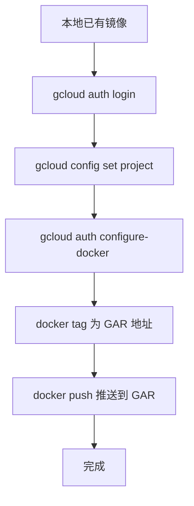
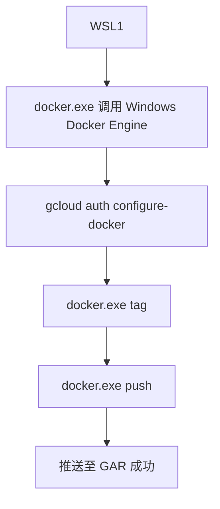
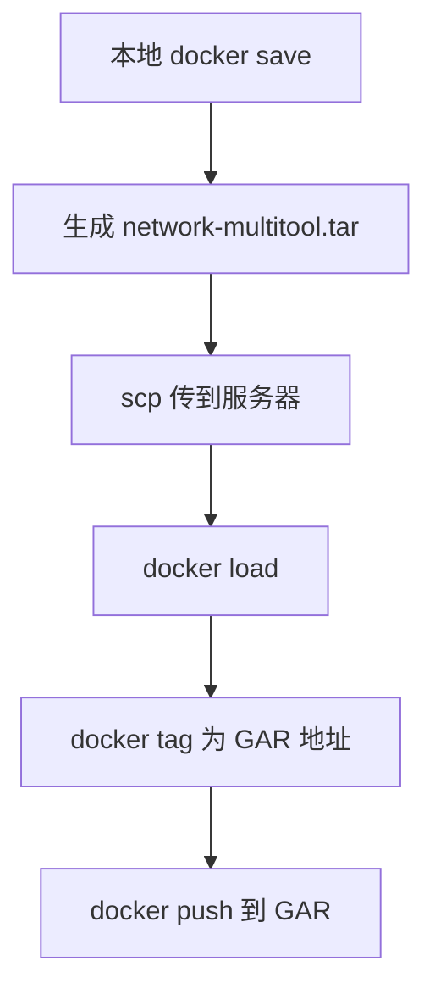

下面给你一份**面向运维与 debug 的推荐 Docker 镜像列表**，这些都来自 Docker Hub，且都已经自带常用的网络/HTTP/调试工具（curl、wget、httpie、dig、tcpdump 等）。你可以直接 `docker run -it` 进入使用。

---

# **问题分析**

你想要一个在 Docker Hub 上已经集成了常见调试工具（curl / httpie / dig / tcpdump / netcat 等）的通用镜像，用于排障和运维场景（网络、HTTP、DNS、TLS、连接测试等）。

---

# **解决方案：推荐常用调试镜像**

## ✅ **1. praqma/network-multitool（强烈推荐）**

**最通用的网络运维镜像**  
包含 curl、dig、host、nc、wget、iperf3、telnet、arping、tcpdump 等

```bash
docker pull praqma/network-multitool
docker run --rm -it praqma/network-multitool bash
```

---

## ✅ **2. wbitt/network-multitool（K8S 社区常用）**

功能类似 praqma 的 multitool，也非常全：

```bash
docker pull wbitt/network-multitool
docker run --rm -it wbitt/network-multitool bash
```

---

## ✅ **3. nicolaka/netshoot（适合 K8S 调试）**

包含大量网络工具：curl、tcpdump、strace、dig、nslookup、ss、iproute2、iftop、httpie

```bash
docker pull nicolaka/netshoot
docker run --rm -it nicolaka/netshoot
```

> **优点：**这是主要用于 Kubernetes 网络问题排查的镜像，非常专业。

---

## ✅ **4. alpine + 手动安装（最小但可扩展）**

如果你希望镜像极小，可以用 Alpine 自己安装工具：

```bash
docker run -it --rm alpine sh
apk add curl wget bash tcpdump bind-tools httpie
```

---

## ✅ **5. busybox（极简）**

内置基本网络工具，但不支持 httpie、dig：

```bash
docker run -it busybox sh
```

适合极简环境。

---

# **对比表**

|镜像|是否包含 curl|是否有 httpie|是否有 dig/nslookup|是否有 tcpdump|特点|
|---|---|---|---|---|---|
|praqma/network-multitool|✅|❌|✅|✅|最全面，配置简单|
|wbitt/network-multitool|✅|❌|✅|❌|K8S 常用，功能丰富|
|nicolaka/netshoot|✅|✅|✅|✅|K8S 网络排查神器|
|alpine + apk|可安装|可安装|可安装|可安装|最小化，可自定义|
|busybox|基础版|❌|❌|❌|极简体积超小|

---

# **推荐结论**

如果你想要：

### 🔧 **一个能解决 95% 运维排障问题的镜像 → 用 `netshoot`**

```bash
docker run --rm -it nicolaka/netshoot
```

### 🌐 **一个通用全能镜像 → 用 `prasma/network-multitool`**

```bash
docker run --rm -it praqma/network-multitool bash
```

---

# **需要我帮你生成一个你自己的自定义 debug 镜像吗？**

比如：

- curl + httpie + jq
    
- tcpdump + tshark
    
- openssl + iproute2 + strace
    
- 自定义 CA 证书
    
- 适配你的 GKE/Nginx/Kong 环境
    

若需要，我可以给你直接生成 Dockerfile。

下面给你一份**面向 Windows + Docker Desktop** 的完整步骤，教你如何把你本地已有的 `network-multitool` 镜像推送到 **Google Artifact Registry (GAR)**。

全流程可直接使用，无需猜测。

---

# 1. **问题分析**

你已经在 Windows 的 Docker Desktop 里下载了 `network-multitool`（pramqa 或 wbitt），现在想把它推送到你自己的 Google Artifact Registry 仓库（GAR）。

GAR 推送流程主要是：

1. 登录 GCP 的 Docker Registry
    
2. 给镜像重新 tag 成 GAR 地址
    
3. push 到 GAR
    

---

# 2. **解决方案：完整步骤**

## **步骤 0：确保你已安装 gcloud CLI**

如果没装，下载：  
[https://cloud.google.com/sdk/docs/install](https://cloud.google.com/sdk/docs/install)

---

## **步骤 1：配置 gcloud & Artifact Registry Docker 登录**

### 登录 GCP

```powershell
gcloud auth login
```

### 选择项目

```powershell
gcloud config set project <YOUR_PROJECT_ID>
```

---

## **步骤 2：为 Docker 配置 GAR 登录授权**

GAR 的 registry 地址格式是：

```
<region>-docker.pkg.dev/<project-id>/<repo-name>/<image>
```

例如：

```
asia-east1-docker.pkg.dev/my-project/myrepo/network-multitool
```

运行：

```powershell
gcloud auth configure-docker asia-east1-docker.pkg.dev
```

如果是其他 region，自己替换。

---

## **步骤 3：查看你本地已有的镜像**

```powershell
docker images
```

你应该能看到类似：

```
pragmaprime/network-multitool   latest   <IMAGE_ID>
```

---

## **步骤 4：将该镜像重新 tag 成 GAR 地址**

例如 GAR 仓库信息如下：

- region：asia-east1
    
- project：my-project
    
- repo：common-tools
    
- image：network-multitool
    

执行：

```powershell
docker tag praqma/network-multitool:latest asia-east1-docker.pkg.dev/my-project/common-tools/network-multitool:latest
```

---

## **步骤 5：推送到 GAR**

```powershell
docker push asia-east1-docker.pkg.dev/my-project/common-tools/network-multitool:latest
```

完成！

---

# 3. **流程图**



---

# 4. **注意事项**

- 如果推送报 403，检查 IAM 是否有：
    
    - `roles/artifactregistry.writer`
        
- 如果 push 报权限不足，请运行：
    
    ```powershell
    gcloud auth print-access-token | docker login -u oauth2accesstoken --password-stdin https://asia-east1-docker.pkg.dev
    ```
    
- 确保你创建过 GAR repository：
    
    ```bash
    gcloud artifacts repositories create common-tools \
      --repository-format=docker \
      --location=asia-east1
    ```
    

---

# 需要我帮你写一个自动化 PowerShell 脚本吗？

比如一键完成：

- 检查镜像
    
- 自动生成 GAR tag
    
- 自动登录
    
- 自动推送
    

我可以为你生成一个完全可执行的 `.ps1`


下面重点回答你的关键问题：  
**你现在使用的是 WSL1，而不是 WSL2，那还能不能在 WSL 里 push 镜像到 GAR？**

---

# ✅ **结论：WSL1 可以 push 到 GAR，但前提是你正确使用“Windows 的 Docker CLI”，而不是尝试让 WSL1 去直接连 Docker Engine。**

因为：

- **WSL1 无法直接使用 Docker Desktop 的 Linux Socket `/var/run/docker.sock`**
    
- **WSL2 可以，但 WSL1 不行**
    
- **不过 Windows Docker CLI 本来就是可从 WSL1 调用的**（通过 PATH）
    

所以你的方案是：

# ⭐ **在 WSL1 中用 Windows 的 docker.exe 进行 docker tag / push 一切操作**

（这完全可行！）

你只需要确保两个东西：

---

# 1. **确认 WSL1 是否能执行 Windows 的 docker.exe**

在 WSL1 中执行：

```bash
docker.exe version
```

如果能正常输出：

```
Client: Docker Engine...
Server: Docker Engine...
```

那说明你已经可以在 WSL1 使用 Docker Desktop 的引擎，**所有 docker 操作都可以用 `docker.exe` 完成**。

---

# 2. **gcloud 认证要在 WSL1 内执行（没问题）**

WSL1 内：

```bash
gcloud auth login
gcloud config set project <PROJECT_ID>
gcloud auth configure-docker asia-east1-docker.pkg.dev
```

这一步会改写 **Windows 用户目录下的 `config.json`**，WSL1 会借用它，因此完全兼容。

---

# 3. **实际 Push 流程（适用于 WSL1 环境）**

## **Step 1：验证 docker.exe 可用**

```bash
docker.exe images
```

应该能看到你之前 Windows 下载的镜像：

```
network-multitool   latest
```

因为 WSL1 是直接调用 Windows 的 docker.exe，所以镜像共享。

---

## **Step 2：在 WSL1 中打 tag（必须使用 docker.exe）**

```bash
docker.exe tag praqma/network-multitool:latest \
  asia-east1-docker.pkg.dev/<PROJECT_ID>/<REPO_NAME>/network-multitool:latest
```

---

## **Step 3：在 WSL1 中 push（仍然用 docker.exe）**

```bash
docker.exe push asia-east1-docker.pkg.dev/<PROJECT_ID>/<REPO_NAME>/network-multitool:latest
```

这是整个推送流程的关键。

> ❗不能用 `docker`（Linux CLI）
> 
> 在 WSL1 里只能用 **docker.exe**（Windows CLI），否则 WSL1 会找不到 Docker Engine。

---

# 4. **工作原理（你需要理解的核心点）**

### ⭐ WSL1 不支持 Linux Socket `/var/run/docker.sock`

所以没法用 Linux 版 docker CLI。

### ⭐ 但 WSL1 可以执行 Windows 程序（如 docker.exe）

路径一般是：

```
/mnt/c/Program Files/Docker/Docker/resources/bin/docker.exe
```

### ⭐ Windows 的 docker.exe 调用 Windows 上的 Docker Engine

所以你 push 的镜像其实仍来自 Docker Desktop。

---

# 5. **流程图（专为 WSL1）**



---

# 6. **是否推荐升级到 WSL2？**

如果你做大量 K8S/GKE/Docker 相关工作：

|版本|Docker 支持|网络兼容性|性能|推荐程度|
|---|---|---|---|---|
|**WSL1**|❌ 不支持原生 Linux Docker，需要通过 docker.exe|👍 网络直通 Windows|🚫 差（无原生 Linux 内核）|⭐⭐|
|**WSL2**|✔️ 原生支持 Docker Desktop、k3d、kind|⚠️ NAT 模式（但可配置）|✔️ 非常快：完整 Linux 内核|⭐⭐⭐⭐⭐|

如果你长期做 GKE/K8S/容器开发 → **强烈建议未来升级 WSL2**。

---

# 如果你愿意，我可以给你生成一个适用于 WSL1 的“一键 Push GAR 脚本”

例如：

```bash
#!/bin/bash
# push-to-gar.sh
docker.exe tag ...
docker.exe push ...
```

只要给我你的 project、region、repo 名称即可。


# local ==> server ==> push
下面给你 **适合你当前情况的 3 种可靠方案**：  
**本地不能直接 push，但本地有镜像 → 如何把镜像迁移到一台有权限的服务器上让它来 push 到 GAR？**

这三种方案在企业环境中都很常用，并且完全可行。

---

# #️⃣ **方案 1：docker save → scp → 服务器上 docker load（最常用）**

这是 **最稳定、兼容性最好的方法**，无论你的 Windows、WSL、网络环境如何都能用。

---

## **步骤 1：在本地把镜像打包成 tar 文件**

例如镜像叫：

```
pragmaprime/network-multitool:latest
```

执行：

```bash
docker save -o network-multitool.tar pragmaprime/network-multitool:latest
```

生成一个文件：

```
network-multitool.tar
```

---

## **步骤 2：传到你的服务器（可推 GAR 那台）**

### Windows PowerShell：

```powershell
scp network-multitool.tar user@server:/tmp/
```

### 或者 WinSCP、SSHFS、高级传输工具都可以。

---

## **步骤 3：服务器导入镜像**

SSH 登录服务器：

```bash
docker load -i /tmp/network-multitool.tar
```

镜像恢复后你能看到：

```bash
docker images
```

---

## **步骤 4：服务器上打 tag 为 GAR 地址**

例如：

```
asia-east1-docker.pkg.dev/my-project/myrepo/network-multitool:latest
```

执行：

```bash
docker tag pragmaprime/network-multitool:latest \
  asia-east1-docker.pkg.dev/my-project/myrepo/network-multitool:latest
```

---

## **步骤 5：服务器 push 到 GAR**

```bash
docker push asia-east1-docker.pkg.dev/my-project/myrepo/network-multitool:latest
```

> 只要服务器已完成：  
> `gcloud auth login`  
> `gcloud auth configure-docker`  
> 就能推送。

---

# ⭐ **方案 1 的流程图**



---

# #️⃣ **方案 2：docker save → 上传到 GCS → 服务器 load（适合跨地域）**

如果你们团队普遍在用 Google Cloud：

### 本地：

```bash
docker save -o network-multitool.tar pragmaprime/network-multitool:latest
gsutil cp network-multitool.tar gs://your-bucket/tmp/
```

### 服务器：

```bash
gsutil cp gs://your-bucket/tmp/network-multitool.tar .
docker load -i network-multitool.tar
docker push ...
```

优点：不需要服务器暴露 SSH 入口。  
适合你们 GCP-heavy 的架构团队。

---

# #️⃣ **方案 3：把镜像变成 OCI Bundle → 用 oras push（高级用法）**

如果你想更云原生，可以：

```bash
docker save network-multitool.tar
oras push <GAR repo> network-multitool.tar:application/vnd.oci.image.layer.v1.tar
```

但这更复杂，不推荐你现在用。

---

# #️⃣ 最推荐你的方案？

基于你目前情况（Windows + Docker Desktop + WSL1 + 服务器已具备推送权限）：

👉 **方案 1（docker save → scp → load → push）是最简单、最稳的。**

这是全行业最常用的镜像“手工复制”方法。

---

# 如果你愿意，我可以帮你生成：

✔ 完整的 **Windows PowerShell 一键打包+上传脚本**  
✔ 完整的 **服务器端 load+push 脚本**  
✔ 支持自动生成 GAR tag

你只要告诉我：

- server 登录方式（IP / 用户名）
    
- GAR 的 region / project / repo
    

我就能给你自动化脚本。