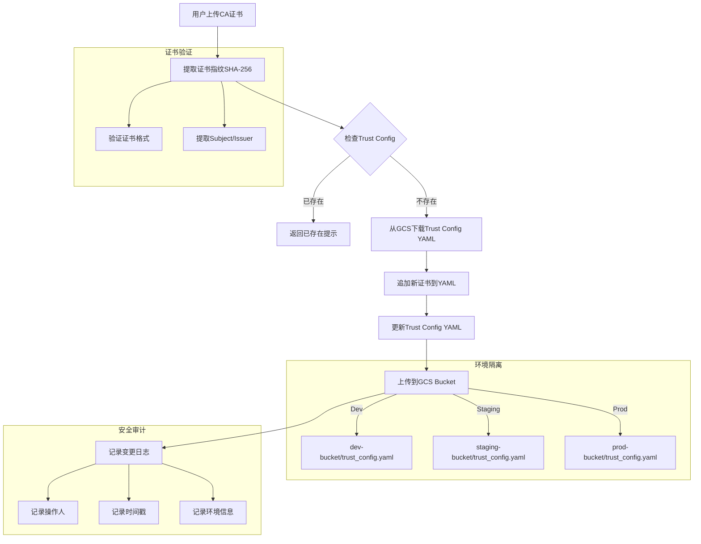

# CA证书Onboarding流程

## 流程说明

1. **证书上传与验证**
   - 用户上传CA证书（Root/Intermediate）
   - 系统验证证书格式并提取指纹

2. **重复性检查**
   - 使用SHA-256指纹检查是否已存在
   - 避免重复添加相同证书

3. **配置更新**
   - 从对应环境的GCS Bucket获取配置
   - 追加新证书到YAML配置
   - 上传更新后的配置

4. **环境管理**
   - 支持多环境配置（Dev/Staging/Prod）
   - 通过不同Bucket隔离环境

5. **审计日志**
   - 记录所有配置变更
   - 包含操作人、时间、环境信息