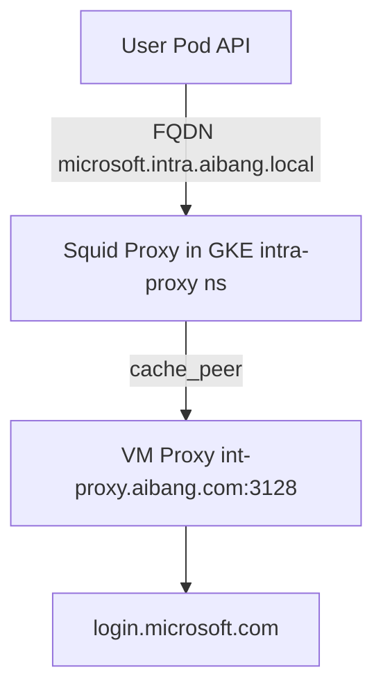

我们是运行在 GCP 平台的一个做 API 的平台
我们是谷歌平台上的一个云服务 API 的提供商,我们是做的 API 的接入,我们的基础架构是这样的。
流量路径:
用户请求 -> A(7 层 Nginx instance ) -> B(4 层 Nginx instance) -> C (GKE KongDP) --> D (GKE RT)
7 层的配置一个域名然后根据 nginx location path 来分发用户请求,其实对应的 Location Path 就是用户的 API-NAME 
当然上面是我们的 Ingress.我现在仅仅需要探索 Egress 的方式

对于我们的 GKE Pod 默认来说.我们默认配置了一个路由可以让其走一个 L3 出局访问.这个是大部分的 Pod 或者说应用的场景.其会路由到我们一个 GCE 的主机,这个主机做 iptable -t NAT

我现在想要探索这样一个方案,做一些更安全的管理.比如我的 GKE 里面 API 需要访问 login.microsoft.com .
其实其即使走我的 L3 的这个路也是不通的.
我现在想在 GKE 里面的比如要 intra-proxy 的 namespace 里面 搭建一个 Squid 的代理让其能帮助用户的 API 反问出去
大概的流程是
User pod API ==> using fqdn microsfot.intra.aibang.local as a proxy ==> gke squid running at intra-proxy cache_peer to ==> we install a vm as proxy eg: int-proxy.aibang.com:3128 ==> login.microsoft.com

这个是我限定的 Egress Flow 帮我做一些分析

目前你们的 默认 Egress 是 GKE Pod → L3 NAT → GCE 主机（iptables NAT）→ 出局访问。
但你想要 限定某些特定 API Pod（比如访问 login.microsoft.com）必须通过一条安全的 Proxy 路径，而不是随意出局

好的，我们来把你描述的 Egress Flow 限制 + Proxy 出口 方案分析一下。

⸻

1. 问题分析

目前你们的 默认 Egress 是 GKE Pod → L3 NAT → GCE 主机（iptables NAT）→ 出局访问。
但你想要 限定某些特定 API Pod（比如访问 login.microsoft.com）必须通过一条安全的 Proxy 路径，而不是随意出局。

你设想的流程是：

User Pod (API)
→ 使用自定义 FQDN (microsoft.intra.aibang.local) 作为 proxy
→ intra-proxy namespace 内运行的 Squid
→ Squid cache_peer 指向 GCE VM 上跑的二级 proxy (int-proxy.aibang.com:3128)
→ login.microsoft.com

目标：
• 对特定域名（如 Microsoft 登录）进行 出口流量的管控和审计。
• 使用 Squid proxy 作为 出口跳板，从而避免 Pod 随意访问外部互联网。

连通性测试

```bash
# test-proxy.sh
#!/bin/bash

PROXY_HOST="microsoft.intra.aibang.local"
PROXY_PORT="3128"
TEST_URL="https://login.microsoft.com"

echo "Testing proxy connectivity..."

# 测试代理连接
curl -x http://${PROXY_HOST}:${PROXY_PORT} \
     -H "User-Agent: Test-Client/1.0" \
     -v \
     --connect-timeout 10 \
     --max-time 30 \
     ${TEST_URL}

echo "Exit code: $?"
```

⸻

2. 解决方案思路

方案 A：Namespace 内部 Squid + VM 出口 Proxy
• 架构：
• 在 intra-proxy namespace 部署 Squid。
• Squid 配置 cache_peer 指向外部 VM（int-proxy）。
• VM 上运行二级 Squid 或 HAProxy，负责真正的外部访问。
• 优点：
• 灵活，可以在 GKE 内对不同 namespace / workload 应用不同的出口策略。
• 可以在 Squid 上做 ACL，基于 FQDN/IP/端口控制谁能访问哪些外部地址。
• VM 层面也能继续做日志、审计、二次 ACL。
• 缺点：
• 两层 Proxy，请求路径会长，增加延迟。
• Pod 必须修改应用配置（HTTP_PROXY 或直接指定 FQDN proxy host）。

⸻

方案 B：Squid 作为出口 Gateway，结合 NetworkPolicy
• 在 intra-proxy namespace 部署 Squid。
• 使用 K8s NetworkPolicy 限制特定 Pod 只能访问 intra-proxy.svc.cluster.local。
• Squid 再做 cache_peer 到外部 VM 出口。
• 优点：
• 应用 Pod 不需要显式配置 Proxy 地址（可用 iptables REDIRECT 把流量劫持到 Squid）。
• 强制所有流量都通过 Squid。
• 缺点：
• 配置复杂，需要结合 CNI/iptables。

⸻

方案 C：使用 GCP 原生的 Cloud NAT + Private Google Access + Firewall
• 直接让 Pod 通过 Cloud NAT 出口，但对 login.microsoft.com 配置 防火墙规则 + Identity-Aware Proxy (IAP) / Cloud Armor。
• 优点：
• 不需要自己维护 Squid。
• 依赖 Google 原生方案，运维成本低。
• 缺点：
• 灵活性差，不方便针对特定 API 做 Egress 代理/ACL 控制。

⸻

3. 推荐架构

如果你的目标是 更安全的精细化 Egress 管理，推荐方案 B：GKE 内部 Squid + NetworkPolicy 强制流量走 Proxy，同时在 Proxy 层（Squid 或 VM）做 ACL。

这样可以保证： 1. 用户 Pod → intra-proxy Squid 是强制的（通过 NetworkPolicy/iptables redirect）。 2. Squid 的出口统一走 VM 上的 Proxy（int-proxy）。 3. VM Proxy 控制哪些外部域名可访问（如仅 login.microsoft.com）。 4. 在 GKE 和 VM 两层都能做 日志审计、白名单控制。

⸻

4. 流程图



⸻

5. 注意事项
   • DNS 管理：
   需要在 GKE DNS (CoreDNS) 中配置 microsoft.intra.aibang.local → 指向 intra-proxy Squid Service。
   • 证书问题：
   如果上层是 HTTPS，需要考虑 Squid 是否做 MITM（解密）还是只做 CONNECT 隧道转发（推荐）。
   • 高可用：
   VM 层的 Proxy 建议至少部署两台，前面加一个 Internal Load Balancer。
   • 性能开销：
   双层 Proxy 会增加 ~10-20ms 延迟，需评估对 API 调用的影响。
   • 日志审计：
   Squid + VM Proxy 都能输出访问日志，方便审计与溯源。
   • 替代方案：
   如果只关心 Egress 白名单，考虑用 GCP VPC Service Controls + Cloud NAT，但灵活性不如 Squid。

⸻

要不要我帮你写一个 Squid + cache_peer 的配置示例（GKE 内 Squid + VM Proxy）？这样你可以直接部署验证。

# 1

好 👍 既然你确定采用 **方案 A：在 GKE intra-proxy namespace 部署 Squid，cache_peer 转发到 VM Proxy**，我帮你整理一份完整的操作文档，包括：

- **整体架构**
- **部署步骤**
- **Squid 配置示例**（GKE + VM）
- **验证方式**
- **注意事项 & 最佳实践**

---

# **🔹 方案 A: GKE 内部 Squid + VM Proxy 出口**

## **1. 架构说明**

你要实现的目标流程是：

```
User Pod (API)
  → 代理地址 microsoft.intra.aibang.local:3128
  → intra-proxy namespace 内的 Squid (GKE)
  → cache_peer (指向 VM Proxy: int-proxy.aibang.com:3128)
  → login.microsoft.com
```

特点：

- **GKE Squid**：只负责接收应用 Pod 的请求，并转发给 VM Proxy。
- **VM Proxy**：作为唯一出口网关，可以做 ACL、日志、审计。
- **Egress Flow**：被强制限制在 Proxy 路径中，防止绕过。

---

## **2. 部署步骤**

### **步骤 1: 创建 Namespace**

```
kubectl create namespace intra-proxy
```

---

### **步骤 2: 创建 Squid ConfigMap**

定义 Squid 配置（squid.conf）：

```
kubectl -n intra-proxy create configmap squid-config --from-literal=squid.conf="
http_port 3128

# 允许 CONNECT 方法 (for HTTPS tunnel)
acl SSL_ports port 443
acl Safe_ports port 80 443
acl CONNECT method CONNECT

# 允许内部 Pod 访问
acl localnet src 0.0.0.0/0

# 外部访问规则
http_access allow localnet
http_access deny all

# 定义上游 Proxy (VM Proxy)
cache_peer int-proxy.aibang.com parent 3128 0 no-query default

# 所有流量都转发到上游 Proxy
never_direct allow all

# 日志
access_log stdio:/dev/stdout
cache_log stdio:/dev/stdout
"
```

---

### **步骤 3: 部署 Squid Pod + Service**

创建 squid.yaml：

```
apiVersion: apps/v1
kind: Deployment
metadata:
  name: squid-proxy
  namespace: intra-proxy
spec:
  replicas: 2
  selector:
    matchLabels:
      app: squid-proxy
  template:
    metadata:
      labels:
        app: squid-proxy
    spec:
      containers:
      - name: squid
        image: sameersbn/squid:latest
        ports:
        - containerPort: 3128
        volumeMounts:
        - name: config
          mountPath: /etc/squid/squid.conf
          subPath: squid.conf
      volumes:
      - name: config
        configMap:
          name: squid-config
---
apiVersion: v1
kind: Service
metadata:
  name: squid-proxy
  namespace: intra-proxy
spec:
  selector:
    app: squid-proxy
  ports:
  - name: squid
    port: 3128
    targetPort: 3128
```

---

### **步骤 4: 配置 DNS 解析**

在 **CoreDNS ConfigMap**（kube-system/coredns）中增加：

```
kubectl -n kube-system edit configmap coredns
```

添加：

```
microsoft.intra.aibang.local:53 {
    forward . squid-proxy.intra-proxy.svc.cluster.local
}
```

⚠️ 注意：如果只想在应用 Pod 内使用，可以直接在应用里配置 HTTP_PROXY=http://microsoft.intra.aibang.local:3128，不一定要改全局 DNS。

---

### **步骤 5: 部署 VM Proxy (二级 Squid)**

在 GCE VM 上安装 Squid：

```
sudo apt update && sudo apt install squid -y
```

修改 /etc/squid/squid.conf：

```
http_port 3128

# 允许来自 GKE 节点的访问
acl localnet src 10.0.0.0/8
http_access allow localnet
http_access deny all

# 针对 login.microsoft.com 白名单
acl microsoft dstdomain .login.microsoftonline.com .login.microsoft.com
http_access allow microsoft

# 拒绝其他域名
http_access deny all

access_log stdio:/var/log/squid/access.log
```

重启：

```
sudo systemctl restart squid
```

---

## **3. 流程图**

```
graph TD
    A[User Pod API] -->|proxy: microsoft.intra.aibang.local:3128| B[Squid Proxy in GKE (intra-proxy ns)]
    B -->|cache_peer| C[VM Proxy int-proxy.aibang.com:3128]
    C --> D[login.microsoft.com]
```

---

## **4. 验证方式**

在 **API Pod 内执行：**

```
# 设置代理
export http_proxy=http://microsoft.intra.aibang.local:3128
export https_proxy=http://microsoft.intra.aibang.local:3128

# 测试访问 Microsoft
curl -v https://login.microsoftonline.com
```

查看 Squid Pod 日志：

```
kubectl -n intra-proxy logs -l app=squid-proxy
```

查看 VM Proxy 日志：

```
sudo tail -f /var/log/squid/access.log
```

---

## **5. 注意事项 & 最佳实践**

- **安全性**
    - VM Proxy 必须加防火墙规则，只允许 GKE 节点访问。
    - Squid Pod 建议只允许 intra-proxy namespace 内的 Pod 访问。
- **高可用**
    - GKE Squid 建议至少 replicas: 2，并用 ClusterIP Service。
    - VM Proxy 建议部署多台，前面挂一个 Internal Load Balancer。
- **性能**
    - 建议 Squid 只做 **CONNECT 隧道**（never_direct allow all），不要做 MITM，避免 SSL 开销。
    - 请求路径多一层 Proxy，大概会增加 10-20ms 延迟。
- **日志审计**
    - Squid + VM Proxy 双层日志，可以方便追踪 **哪个 Pod** 在 **什么时间** 访问了 **什么域名**。

---

要不要我帮你写一个 **完整的 Helm Chart**，这样可以快速在 intra-proxy namespace 部署 Squid 并挂上 ConfigMap，而不是用原始 YAML？
