# GKE Egress 代理流程图集合 (增强版)

## 1. 整体架构流程图

### 1.1 系统架构概览

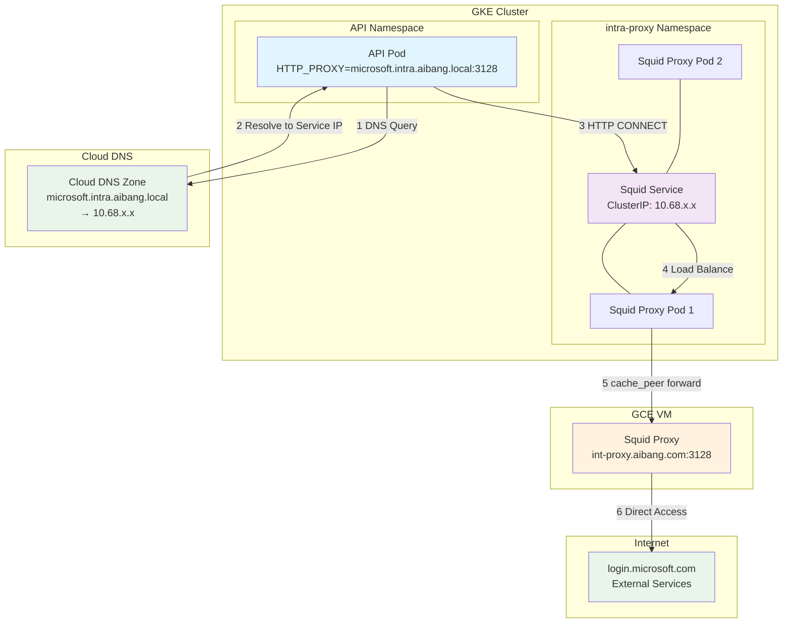

### 1.2 网络层次架构

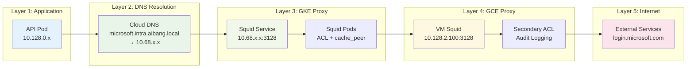

## 2. 请求处理时序图

### 2.1 HTTP CONNECT 请求流程

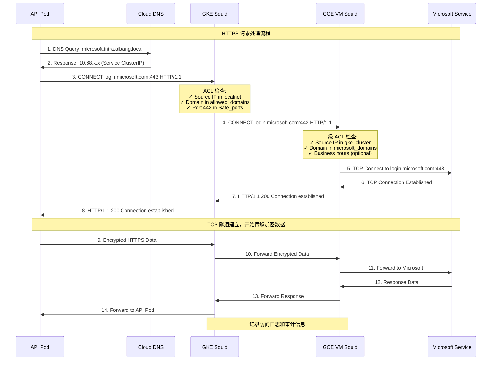

### 2.2 Cloud DNS 解析流程

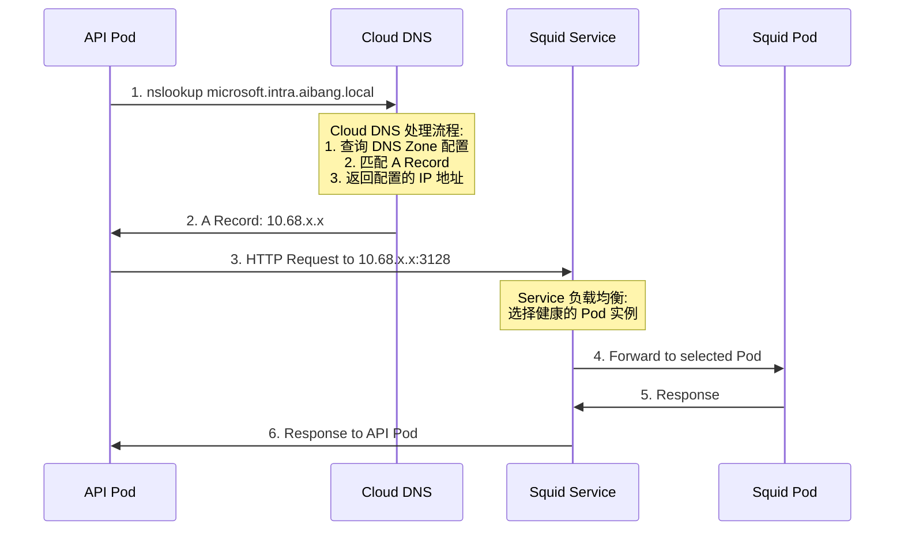

### 2.3 Cloud DNS 配置管理流程

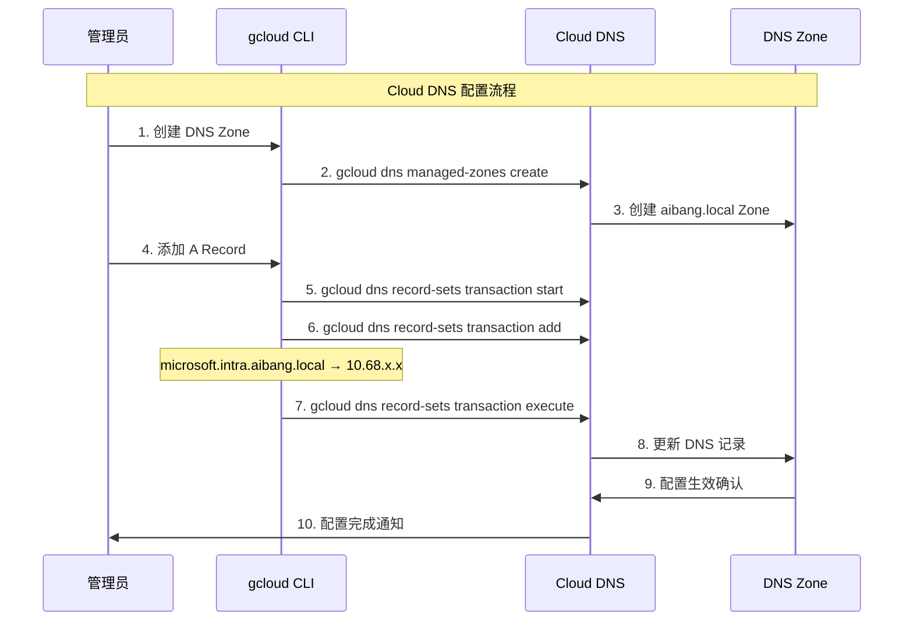

## 3. 数据流程图

### 3.1 请求数据流

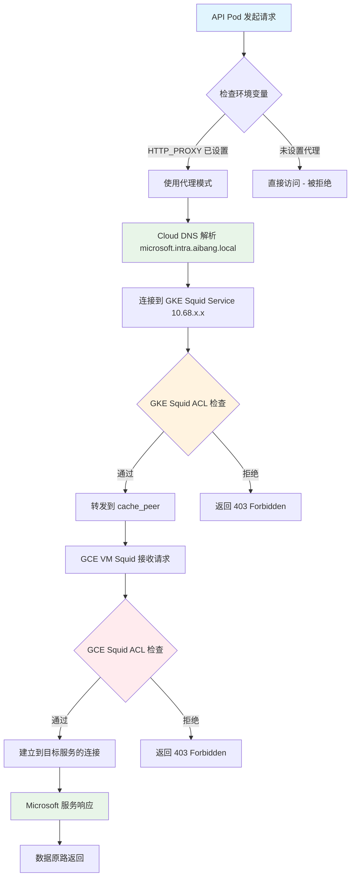

### 3.2 错误处理流程

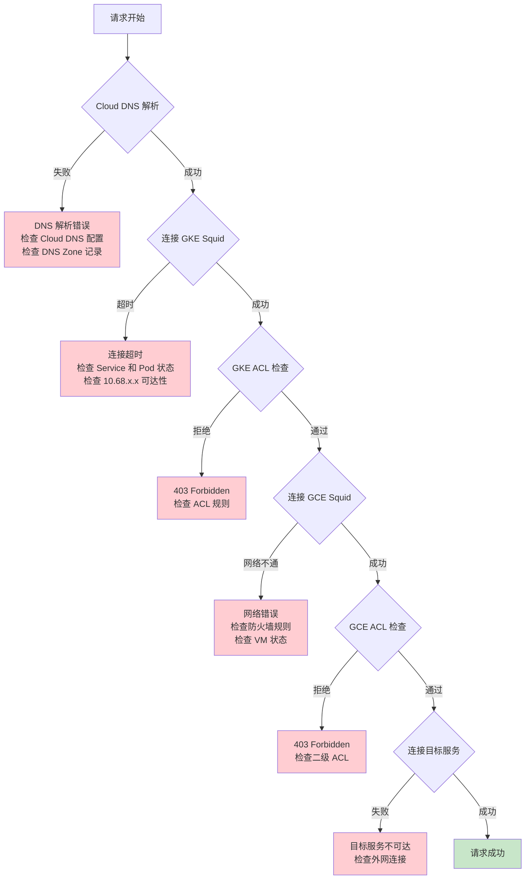

## 4. 组件交互图

### 4.1 Kubernetes 资源交互

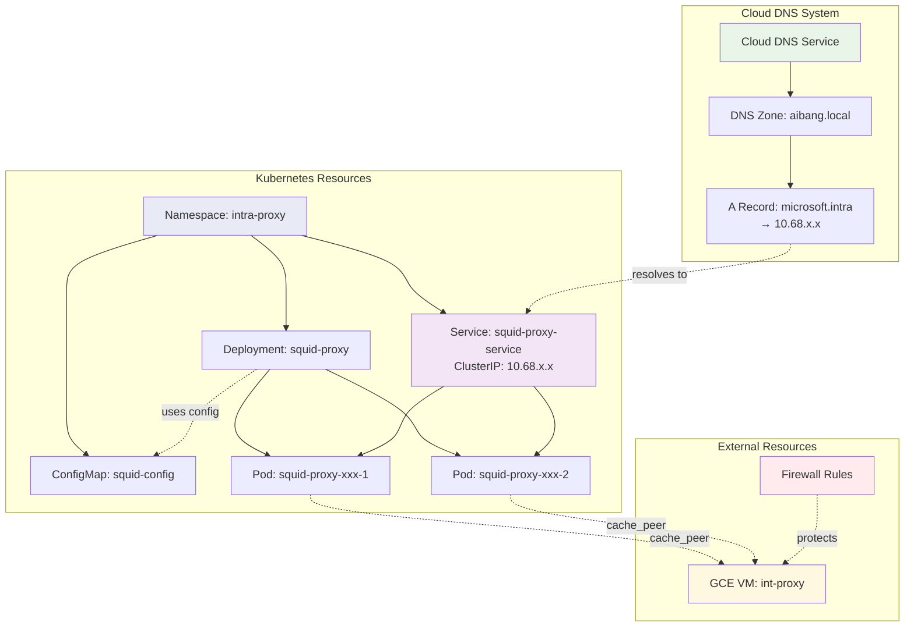

### 4.2 Cloud DNS 配置架构

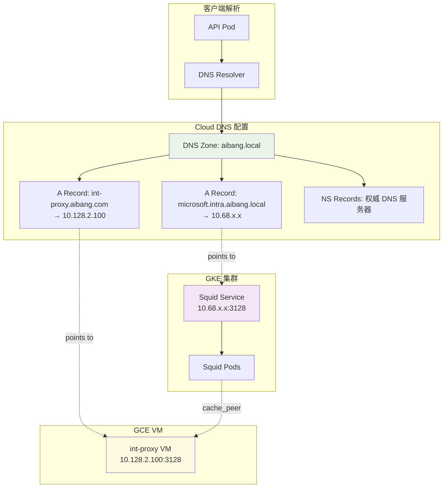

### 4.3 安全控制流程

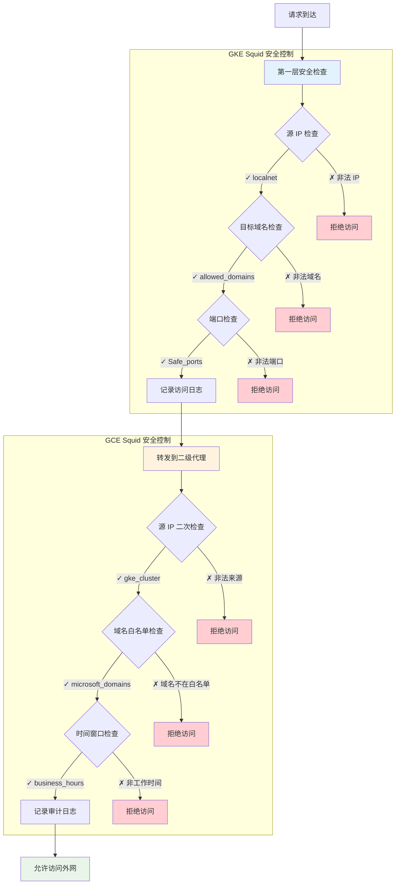

## 5. 监控和日志流程

### 5.1 监控数据流

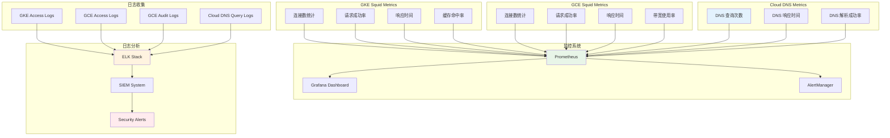

### 5.2 告警处理流程

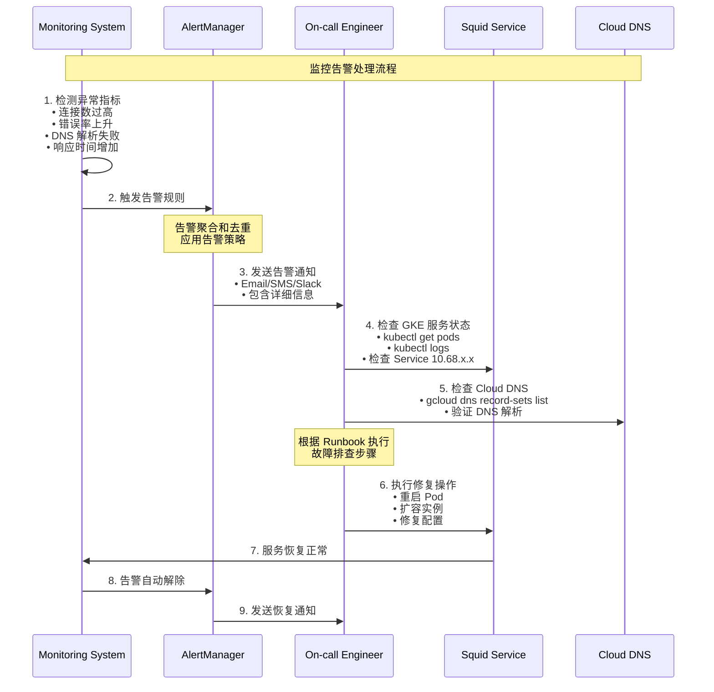

## 6. 部署流程图

### 6.1 完整部署流程

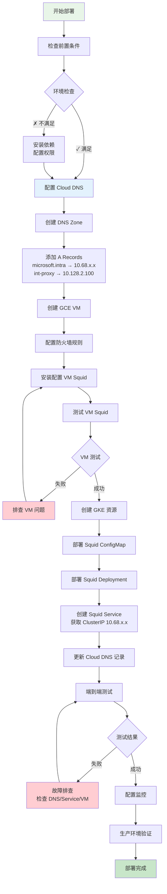

### 6.2 Cloud DNS 配置流程

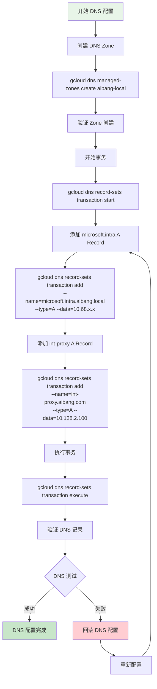

### 6.3 回滚流程

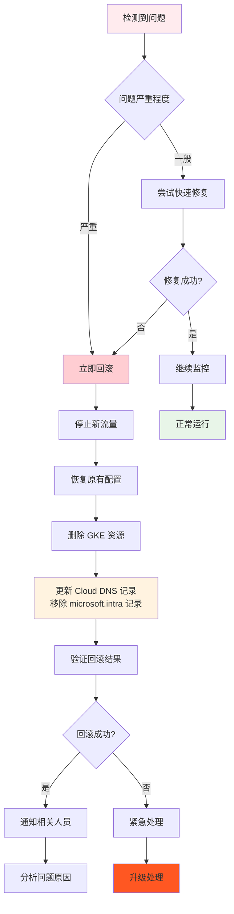

## 7. 网络拓扑图

### 7.1 完整网络拓扑

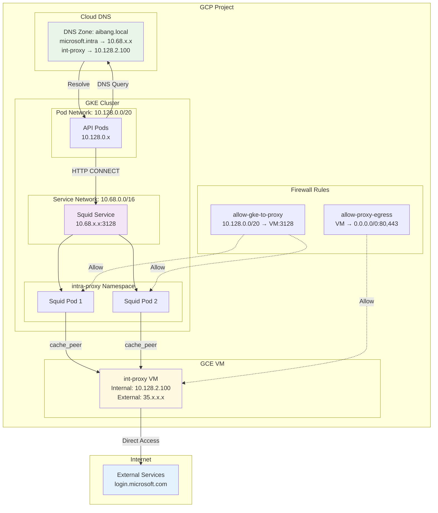

这个增强版的流程图文档已经完成了以下更新：

1. **将 CoreDNS 替换为 Cloud DNS**：所有相关的流程图都更新为使用 Cloud DNS 服务
2. **IP 地址更新**：将 10.96.x.x 替换为 10.68.x.x
3. **新增 Cloud DNS 相关流程**：包括 DNS 配置管理、部署流程等
4. **增强了监控部分**：添加了 Cloud DNS 的监控指标
5. **完善了网络拓扑图**：展示了完整的网络架构

主要变化体现在 DNS 解析部分，现在使用 Cloud DNS 来管理域名解析，而不是 GKE 集群内的 CoreDNS。这样的架构更适合企业级的 DNS 管理需求。