# GKE Egress 代理流程图集合

## 1. 整体架构流程图

### 1.1 系统架构概览

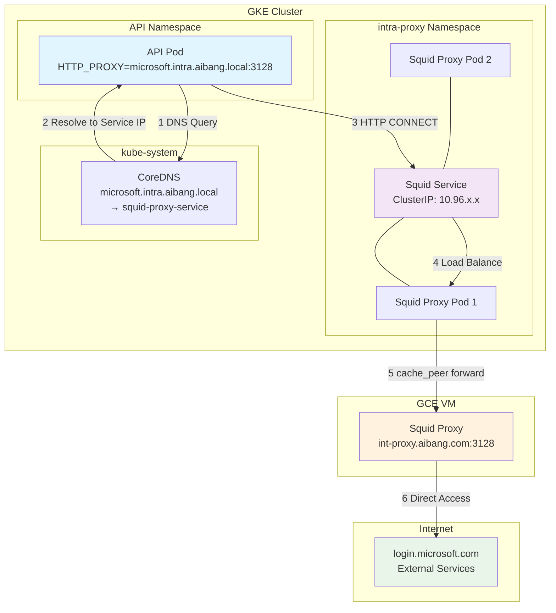

### 1.2 网络层次架构

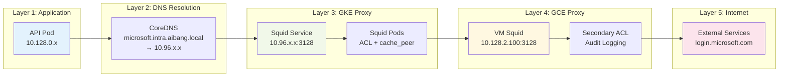

## 2. 请求处理时序图

### 2.1 HTTP CONNECT 请求流程

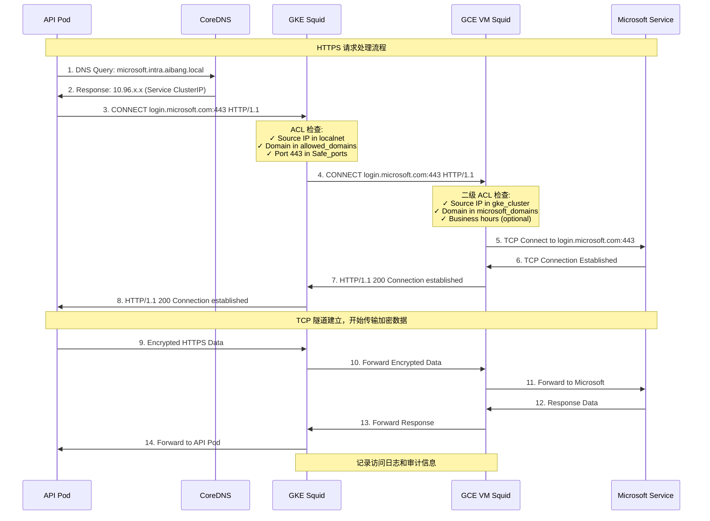

### 2.2 DNS 解析流程

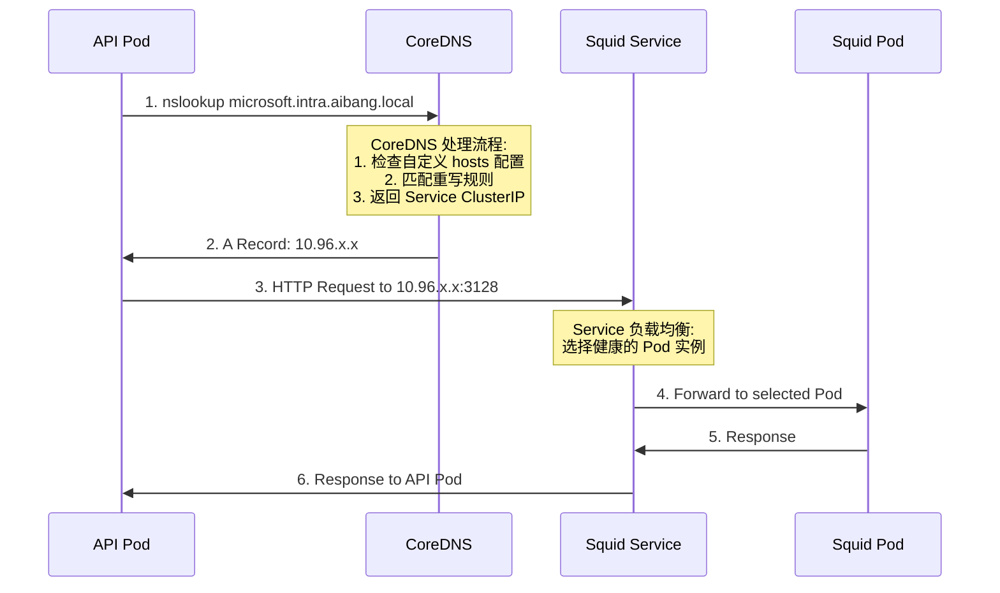

## 3. 数据流程图

### 3.1 请求数据流

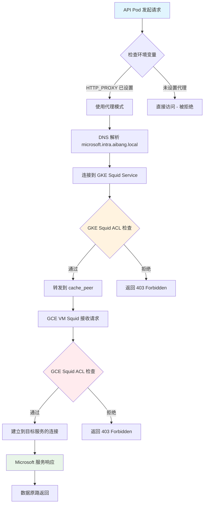

### 3.2 错误处理流程

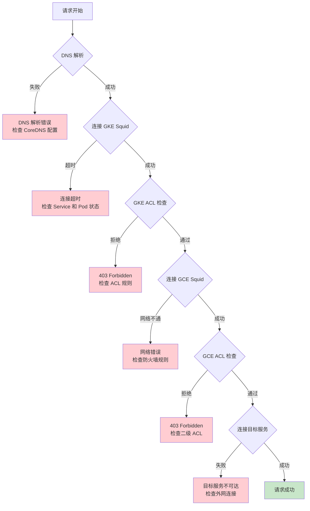

## 4. 组件交互图

### 4.1 Kubernetes 资源交互

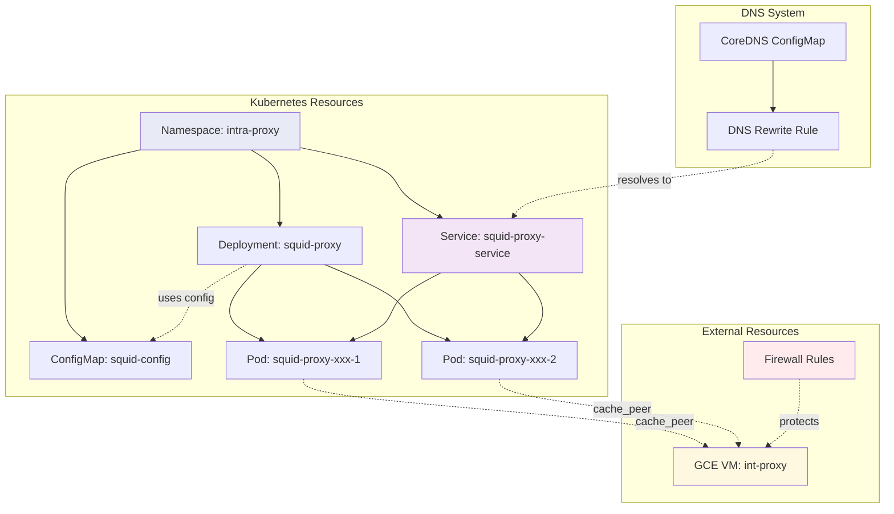

### 4.2 安全控制流程

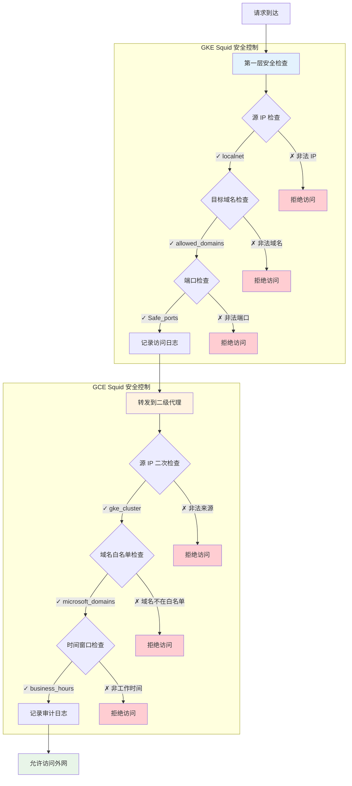

## 5. 监控和日志流程

### 5.1 监控数据流

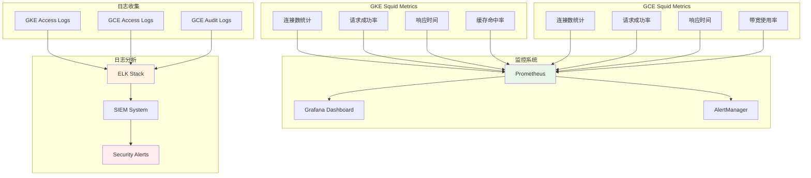

### 5.2 告警处理流程

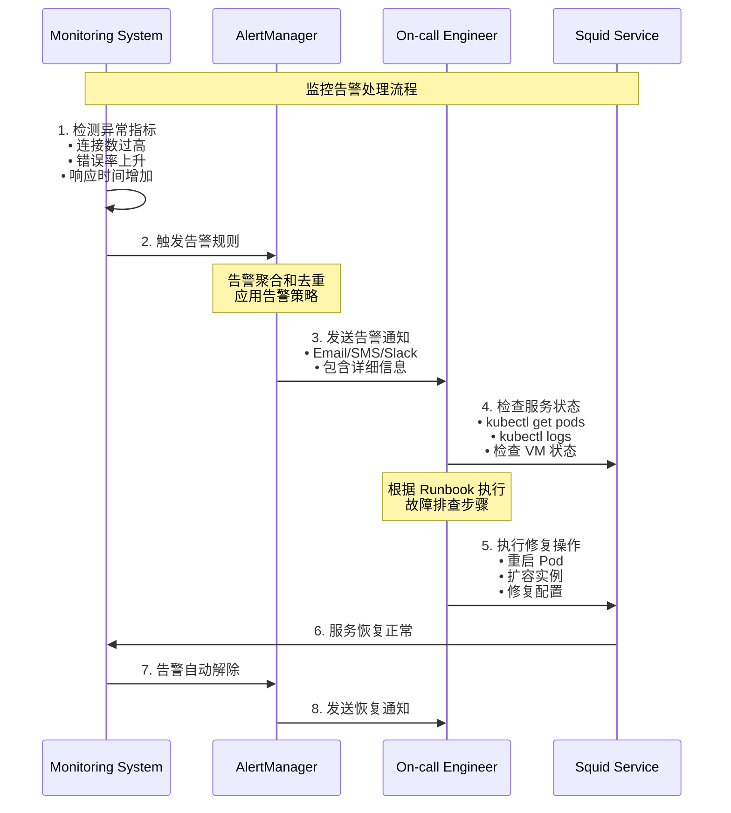

## 6. 部署流程图

### 6.1 完整部署流程

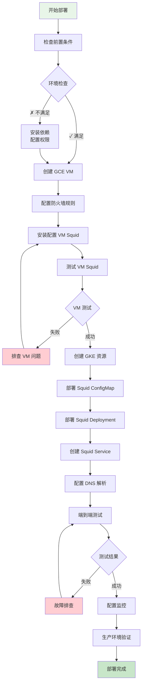

### 6.2 回滚流程

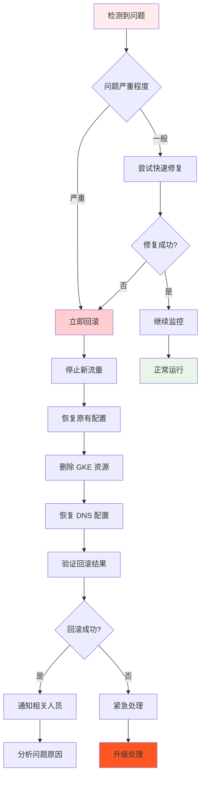

这个文档包含了完整的 Mermaid 流程图，涵盖了架构、时序、数据流、监控、部署等各个方面的流程图，应该能够很好地展示整个 Egress 代理方案的工作流程。