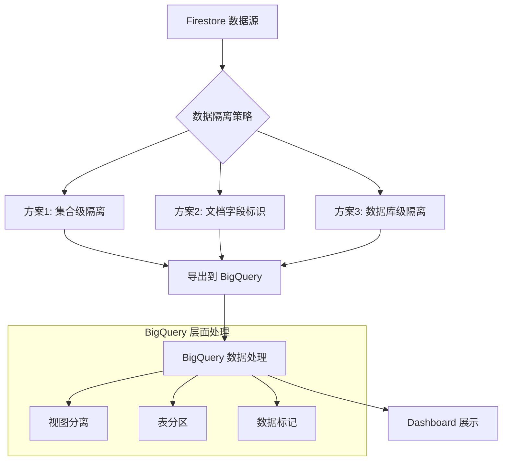
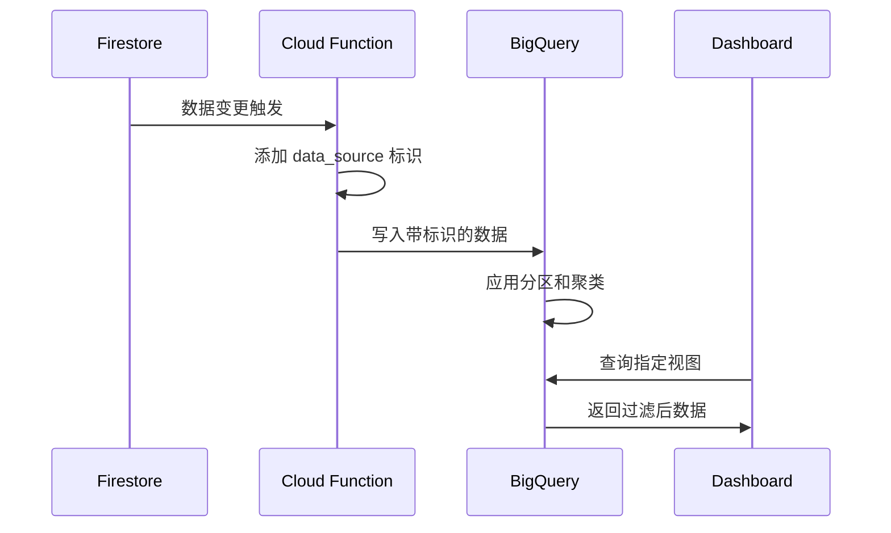
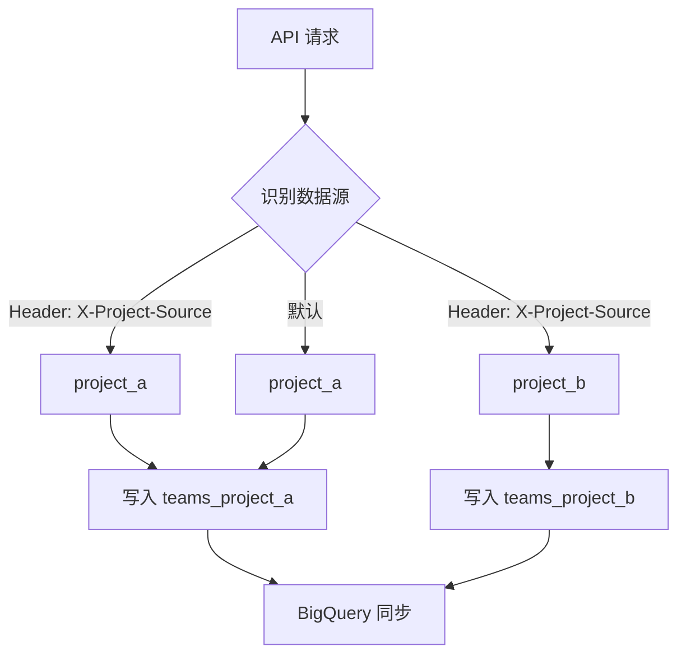
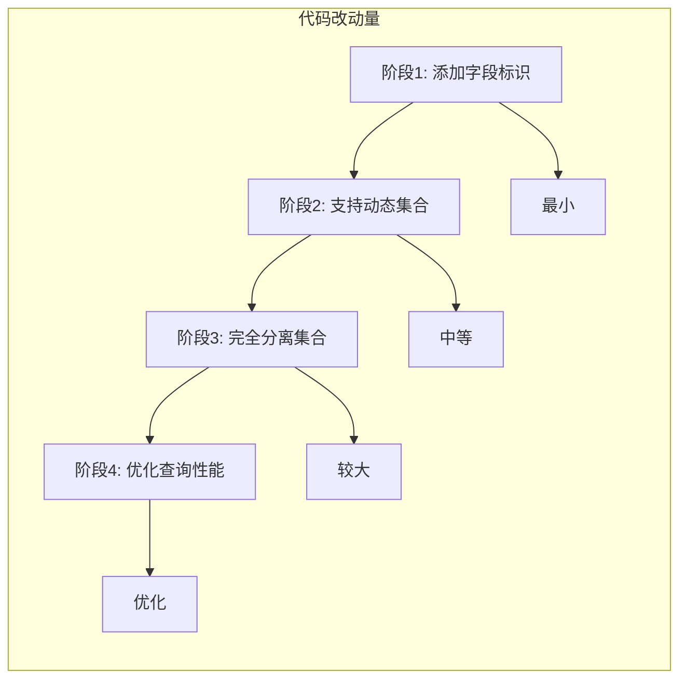
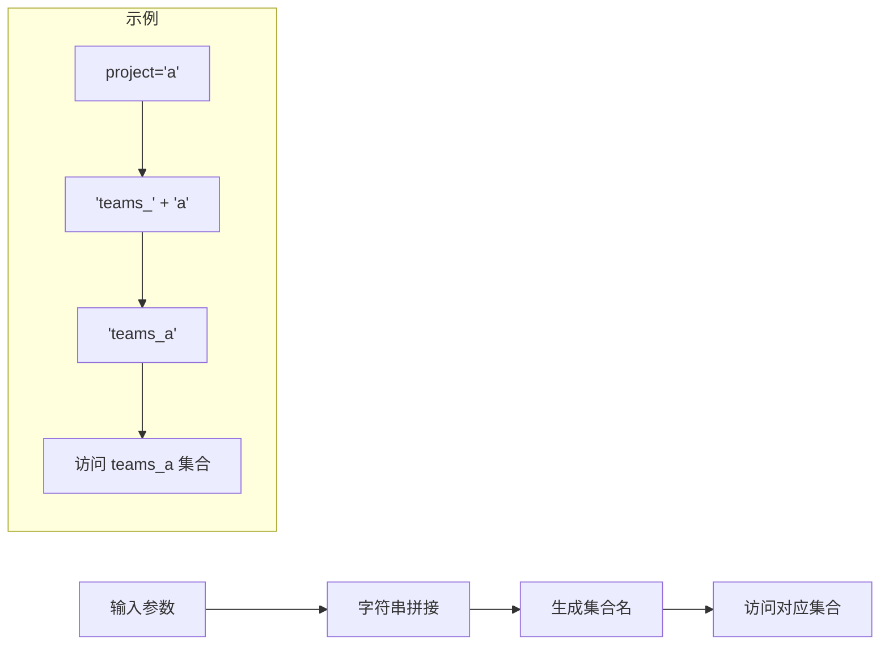
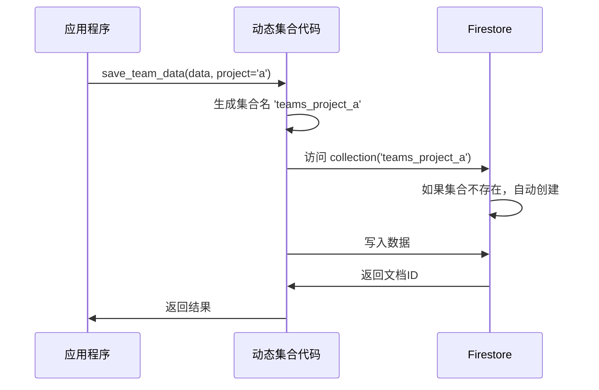
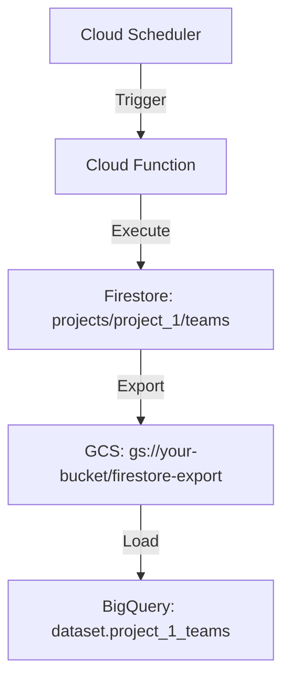
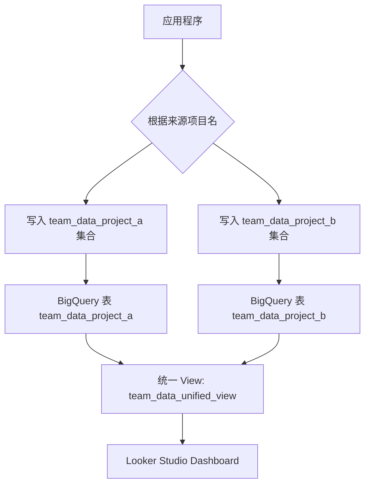
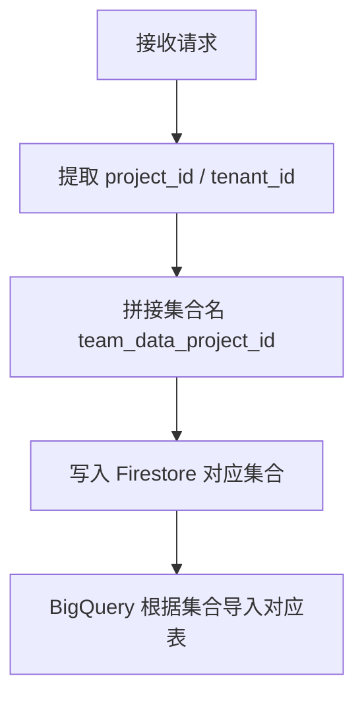

# summary

- **如何在 Firestore 与 BigQuery 的数据同步与分析中引入多工程数据，并保证统计数据的准确性与隔离性**。这个场景常见于多租户平台或数据平台合并使用共享资源的场景。
- 如果通过同一个 java 开发的应用程序写入到不同集合，需要对代码进行一些改造比如说动态集合?
- 我也觉得按顶级集合隔离工程数据这种方式应该比较好.但是这样的情况需要考虑我一套程序如何支持让其读取和写入不同的 Collection?
- 在一个集合下混合多工程数据 team name
    - 开始在新文档 document 中添加 source_project 字段 ?
- 简单描述就是在同一个 Collection 下面写入了同名的 Document

# Concept

简单介绍一下 Firestore 里面的基本概念：

**1. 集合 (Collections):**

- 类似于关系型数据库中的表，但更灵活。
- 它组织文档，是 Firestore 的基本组织单元。
- 你可以把它想象成一个文件夹，里面存放着各种文档。

**2. 文档 (Documents):**

- 类似于关系型数据库中的行，存储着具体的数据。
- 每个文档都包含一个键值对，键是字段名，值可以是字符串、数字、布尔值、数组或另一个文档。
- 例如，一个用户文档可能包含姓名、电子邮件、地址等字段。

**3. 字段 (Fields):**

- 文档中的键值对，就像表格中的列。
- 你可以定义字段的数据类型（如字符串、数字、布尔值等）。

**4. 索引 (Indexes):**

- Firestore 会自动建立一些索引，以加速查询。
- 你可以手动创建自定义索引，以优化特定查询。

**5. 查询 (Queries):**

- Firestore 允许你通过查询来检索文档。
- 你可以使用各种查询运算符（例如，等于、大于、小于、包含）来过滤结果。

**6. 实时数据库 (Realtime Database):**

- Firestore 默认情况下具有实时数据库功能。这意味着，当数据发生更改时，所有连接到 Firestore 的客户端都会自动接收到更新。

**7. 存储结构:**

- Firestore 采用“文档”和“集合”的结构。
- 它是一个 NoSQL 数据库，这意味着它不强制你遵循预定义的模式。
- 文档可以具有不同的字段，并且一个集合可以包含不同类型的文档。

**简单类比：**

你可以把 Firestore 想象成一个 Google Drive 上的文档库：

- **集合**  相当于文件夹。
- **文档**  相当于单个文档。
- **字段**  相当于文档中的内容。

希望这些基本概念能够帮助你更好地理解 Firestore。 你可以在 Google Cloud 官方文档中找到更详细的信息： [https://cloud.google.com/firestore/docs](https://cloud.google.com/firestore/docs)

**核心问题：**

你正在使用 Google Cloud Firestore 作为数据库，并在其中创建了一些表来存储工程及团队信息。现在，其他工程也需要访问这个数据库，并且你有一个关键的字段“team name”用于存储工程信息。但你意识到，直接将来自其他工程的“team name”数据导入到现有表会影响到你使用 BigQuery 进行统计分析的准确性。

**更细致的理解：**

1. **数据源差异：**  你意识到 “team name” 字段的真实来源和统计计算的源头存在差异。这表明“team name” 字段的含义和使用场景可能不同于 BigQuery 统计分析的基准。
2. **BigQuery 统计依赖：**  你对 BigQuery 统计分析的准确性有严格的要求，任何可能导致偏差的数据引入都必须避免。
3. **数据隔离需求：**  需要一种方法来将来自不同工程的“team name”数据与 BigQuery 统计分析的基准数据隔离。

**你的初步想法：**

你考虑在更高层级（例如，创建一个父级表）中设置一个表，然后将子表（包含“team name”字段）放在其中，以实现数据隔离。

**问题核心：**

这个方案是否能有效解决你的问题？它是否能保证在统计分析时，来自不同工程的 “team name” 数据不会影响结果？

**进一步思考：**

- 这个“父级表” 的作用是什么？ 它是否能清晰地表明不同工程的数据在数据库中的位置关系？
- 你是否需要考虑更复杂的解决方案，例如使用不同的数据库表来存储不同类型的团队信息？
- 如何确保不同表之间数据的一致性？

**总结：**

你面临的挑战在于，如何安全地将来自不同工程的“team name”数据整合到你的数据库中，同时保证 BigQuery 统计分析的准确性。 你的初步想法是一个合理的开始，但需要深入思考，以确保方案的正确性和可扩展性。

# Claude

您的问题本质上是多租户数据隔离和数据治理的典型场景。我来为您提供几种最佳实践方案：

## 解决方案概览



## 推荐方案

### 方案 1: 集合层级隔离（推荐）

在 Firestore 中为不同工程创建独立的集合：

```
/projects/{project_id}/teams/{team_id}
/shared_analytics/{collection_name}/{doc_id}
```

**Firestore 结构：**

```javascript
// 原工程数据
/teams_project_a/{doc_id}
{
  team_name: "team-alpha",
  project_source: "project_a",
  created_at: timestamp,
  // 其他字段
}

// 新工程数据
/teams_project_b/{doc_id}
{
  team_name: "team-beta",
  project_source: "project_b",
  created_at: timestamp,
  // 其他字段
}
```

### 方案 2: 添加数据源标识字段

在现有集合中添加 `data_source` 或 `project_id` 字段：

```javascript
{
  team_name: "team-alpha",
  data_source: "project_a",  // 新增字段
  environment: "production",
  created_at: timestamp,
  // 原有字段
}
```

## BigQuery 数据处理策略

### 导入配置

```sql
-- 创建分区表
CREATE TABLE `your-project.dataset.teams_analytics`
(
  team_name STRING,
  data_source STRING,
  environment STRING,
  created_at TIMESTAMP,
  -- 其他字段
)
PARTITION BY DATE(created_at)
CLUSTER BY data_source, environment;
```

### 创建视图进行数据隔离

```sql
-- 原工程专用视图
CREATE VIEW `your-project.dataset.project_a_teams` AS
SELECT *
FROM `your-project.dataset.teams_analytics`
WHERE data_source = 'project_a';

-- 新工程专用视图
CREATE VIEW `your-project.dataset.project_b_teams` AS
SELECT *
FROM `your-project.dataset.teams_analytics`
WHERE data_source = 'project_b';

-- 汇总视图
CREATE VIEW `your-project.dataset.all_teams_summary` AS
SELECT
  data_source,
  COUNT(*) as team_count,
  DATE(created_at) as date
FROM `your-project.dataset.teams_analytics`
GROUP BY data_source, DATE(created_at);
```

## 数据同步流程



## 实施建议

### 1. Firestore 写入时处理

```python
import firebase_admin
from firebase_admin import firestore

def write_team_data(team_data, project_source):
    db = firestore.client()

    # 添加数据源标识
    team_data['data_source'] = project_source
    team_data['created_at'] = firestore.SERVER_TIMESTAMP

    # 写入到对应集合
    collection_name = f"teams_{project_source}"
    doc_ref = db.collection(collection_name).document()
    doc_ref.set(team_data)
```

### 2. BigQuery 导入脚本

```python
from google.cloud import bigquery

def sync_to_bigquery(source_collection, project_source):
    client = bigquery.Client()

    # 构建查询，添加数据源标识
    query = f"""
    SELECT
      *,
      '{project_source}' as data_source,
      CURRENT_TIMESTAMP() as sync_time
    FROM `firestore_export.{source_collection}`
    """

    # 写入到目标表
    job_config = bigquery.QueryJobConfig(
        destination=f"your-project.dataset.teams_analytics",
        write_disposition="WRITE_APPEND"
    )

    query_job = client.query(query, job_config=job_config)
    query_job.result()
```

## Dashboard 配置

### 数据源过滤器配置

| 过滤器名称 | 字段        | 可选值                        | 默认值    |
| ---------- | ----------- | ----------------------------- | --------- |
| 项目来源   | data_source | project_a, project_b, all     | project_a |
| 环境       | environment | dev, staging, prod            | prod      |
| 时间范围   | created_at  | 最近 7 天, 最近 30 天, 自定义 | 最近 7 天 |

### SQL 模板示例

```sql
-- Dashboard 查询模板
SELECT
  team_name,
  data_source,
  COUNT(*) as record_count,
  DATE(created_at) as date
FROM `your-project.dataset.teams_analytics`
WHERE
  data_source = @project_filter  -- 参数化查询
  AND DATE(created_at) >= @start_date
  AND DATE(created_at) <= @end_date
GROUP BY team_name, data_source, DATE(created_at)
ORDER BY date DESC;
```

## 迁移策略


这种方案既保证了数据的隔离性，又维持了现有系统的兼容性，同时为未来扩展更多工程数据源提供了良好的架构基础。

您说得对，如果通过同一个应用程序写入到不同集合，确实需要对代码进行一些改造。让我为您提供几种不同复杂度的解决方案：

## 方案对比

| 方案       | 代码改造量 | 复杂度 | 推荐度     |
| ---------- | ---------- | ------ | ---------- |
| 动态集合名 | 小         | 低     | ⭐⭐⭐⭐⭐ |
| 字段标识   | 极小       | 极低   | ⭐⭐⭐⭐   |
| 多数据库   | 大         | 高     | ⭐⭐       |

## 推荐方案: 动态集合名称

### 代码改造示例

```python
class FirestoreManager:
    def __init__(self):
        self.db = firestore.client()

    def get_collection_name(self, base_name, project_source=None):
        """动态生成集合名称"""
        if project_source:
            return f"{base_name}_{project_source}"
        return base_name  # 向后兼容

    def write_team_data(self, team_data, project_source="project_a"):
        """写入团队数据"""
        collection_name = self.get_collection_name("teams", project_source)

        # 添加元数据
        team_data.update({
            'data_source': project_source,
            'created_at': firestore.SERVER_TIMESTAMP
        })

        doc_ref = self.db.collection(collection_name).document()
        doc_ref.set(team_data)

        return doc_ref.id
```

### 配置驱动的方式

```python
# config.py
COLLECTION_MAPPING = {
    'project_a': {
        'teams': 'teams_project_a',
        'users': 'users_project_a'
    },
    'project_b': {
        'teams': 'teams_project_b',
        'users': 'users_project_b'
    }
}

# firestore_service.py
class FirestoreService:
    def __init__(self, project_source="project_a"):
        self.db = firestore.client()
        self.project_source = project_source
        self.collections = COLLECTION_MAPPING.get(project_source, {})

    def get_collection(self, base_name):
        """获取实际集合名称"""
        return self.collections.get(base_name, base_name)

    def write_data(self, collection_base, data):
        actual_collection = self.get_collection(collection_base)
        data['data_source'] = self.project_source

        return self.db.collection(actual_collection).add(data)
```

## 最小改造方案: 字段区分

如果您希望代码改动最小，推荐使用字段标识方案：

```python
class TeamDataWriter:
    def __init__(self, default_project="project_a"):
        self.db = firestore.client()
        self.default_project = default_project

    def write_team(self, team_data, project_source=None):
        """最小改动版本"""
        # 只需添加一个字段
        if project_source is None:
            project_source = self.default_project

        team_data['data_source'] = project_source

        # 原有逻辑保持不变
        return self.db.collection('teams').add(team_data)
```

## 实际使用场景



### API 层面的处理

```python
from flask import Flask, request, jsonify

app = Flask(__name__)
firestore_service = FirestoreService()

@app.route('/api/teams', methods=['POST'])
def create_team():
    # 从请求头获取项目源
    project_source = request.headers.get('X-Project-Source', 'project_a')
    team_data = request.json

    try:
        # 使用动态服务实例
        service = FirestoreService(project_source)
        doc_id = service.write_data('teams', team_data)

        return jsonify({
            'success': True,
            'doc_id': doc_id,
            'data_source': project_source
        })
    except Exception as e:
        return jsonify({'error': str(e)}), 500
```

## 环境变量配置方式

```python
import os
from typing import Optional

class ProjectConfig:
    def __init__(self):
        self.project_mappings = {
            'project_a': os.getenv('PROJECT_A_COLLECTIONS', 'teams_a,users_a').split(','),
            'project_b': os.getenv('PROJECT_B_COLLECTIONS', 'teams_b,users_b').split(',')
        }

    def get_collection_name(self, base_name: str, project: str) -> str:
        if project in self.project_mappings:
            return f"{base_name}_{project}"
        return base_name

# 使用示例
config = ProjectConfig()
collection_name = config.get_collection_name('teams', 'project_b')  # teams_project_b
```

## BigQuery 同步适配

```python
def sync_collections_to_bigquery():
    """同步所有项目集合到 BigQuery"""
    projects = ['project_a', 'project_b']

    for project in projects:
        collection_name = f"teams_{project}"

        # 读取 Firestore 数据
        docs = db.collection(collection_name).stream()

        # 转换并添加标识
        rows = []
        for doc in docs:
            data = doc.to_dict()
            data['doc_id'] = doc.id
            data['data_source'] = project  # 确保有数据源标识
            rows.append(data)

        # 写入 BigQuery
        if rows:
            table_id = "your-project.dataset.teams_analytics"
            errors = bq_client.insert_rows_json(table_id, rows)
            if errors:
                print(f"Error syncing {project}: {errors}")
```

## 渐进式迁移策略



**推荐实施顺序：**

1. 先实现字段标识方案（改动最小）
2. 验证 BigQuery 查询和 Dashboard 正常工作
3. 再考虑是否需要集合分离（基于性能和管理需求）

这样既能快速解决当前问题，又为未来扩展留出了空间。

## 什么是动态集合？

**大白话解释：** 动态集合就是"不把集合名称写死在代码里"。就像你去餐厅点菜，不是固定只能点"宫保鸡丁"，而是可以根据情况点"宫保鸡丁"、"宫保牛肉"或"宫保虾仁"。

### 传统方式 vs 动态集合

```python
# 传统方式（集合名写死）
def save_team_data(data):
    db.collection('teams').add(data)  # 永远只能存到 'teams'

# 动态集合方式
def save_team_data(data, project='a'):
    collection_name = f'teams_{project}'  # 根据参数决定存到哪个集合
    db.collection(collection_name).add(data)  # 可能存到 'teams_a' 或 'teams_b'
```

## 实现原理

动态集合的核心就是**字符串拼接**和**参数化**：



### 详细实现过程

```python
class DynamicCollectionManager:
    def __init__(self):
        self.db = firestore.client()

    def build_collection_name(self, base_name, project_id):
        """第1步：构建集合名称"""
        return f"{base_name}_{project_id}"
        # 输入: ('teams', 'project_a')
        # 输出: 'teams_project_a'

    def get_collection_reference(self, collection_name):
        """第2步：获取集合引用"""
        return self.db.collection(collection_name)
        # Firestore 会自动创建不存在的集合

    def write_data(self, base_name, project_id, data):
        """第3步：完整流程"""
        # 动态生成集合名
        collection_name = self.build_collection_name(base_name, project_id)

        # 获取集合引用
        collection_ref = self.get_collection_reference(collection_name)

        # 写入数据
        return collection_ref.add(data)

# 使用示例
manager = DynamicCollectionManager()

# 项目A的数据写入 teams_project_a
manager.write_data('teams', 'project_a', {'team': 'alpha'})

# 项目B的数据写入 teams_project_b
manager.write_data('teams', 'project_b', {'team': 'beta'})
```

## 动态集合的优点

### 1. **数据物理隔离**

```
Firestore 结构:
├── teams_project_a/          ← 项目A的数据
│   ├── doc1
│   └── doc2
└── teams_project_b/          ← 项目B的数据
    ├── doc3
    └── doc4
```

**好处：** 项目 A 和项目 B 的数据完全分开存储，不会相互干扰。

### 2. **查询性能更好**

```python
# 查询项目A的数据（只扫描 teams_project_a 集合）
teams_a = db.collection('teams_project_a').get()  # 假设有1000条数据

# 对比：如果都在一个集合里
teams_all = db.collection('teams').where('project', '==', 'project_a').get()  # 需要扫描全部10000条数据
```

**性能对比表：**

| 场景       | 单一集合  | 动态集合 | 性能提升 |
| ---------- | --------- | -------- | -------- |
| 扫描数据量 | 10,000 条 | 1,000 条 | 10 倍    |
| 查询时间   | 500ms     | 50ms     | 10 倍    |
| 索引大小   | 大        | 小       | 节省存储 |

### 3. **权限控制更精细**

```javascript
// Firestore 安全规则
rules_version = '2';
service cloud.firestore {
  match /databases/{database}/documents {
    // 项目A的人只能访问项目A的集合
    match /teams_project_a/{document} {
      allow read, write: if request.auth.token.project == 'project_a';
    }

    // 项目B的人只能访问项目B的集合
    match /teams_project_b/{document} {
      allow read, write: if request.auth.token.project == 'project_b';
    }
  }
}
```

### 4. **扩展性强**

```python
# 新增项目C，不需要修改现有代码
manager.write_data('teams', 'project_c', {'team': 'gamma'})  # 自动创建 teams_project_c
```

### 5. **维护和备份更方便**

```bash
# 可以单独备份某个项目的数据
gcloud firestore export gs://backup-bucket/project_a/ --collection-ids=teams_project_a

# 可以单独清理某个项目的数据
# 删除整个集合比逐条删除效率更高
```

## 实际运行流程



## 简单类比

**动态集合就像：**

- **文件夹分类：** 不是把所有照片都放在一个文件夹里，而是按年份创建 `2023年照片`、`2024年照片` 等文件夹
- **超市货架：** 不是把所有商品堆在一起，而是分成 `零食区`、`日用品区`、`生鲜区`
- **停车场：** 不是所有车都停在一个区域，而是分成 `A区`、`B区`、`C区`

**核心思想：** 根据不同的条件（项目、用户、类型等），动态地决定数据存储的位置，让数据更有序、查询更高效、管理更方便。

# Gemini 


# Grok
你的问题是一个典型的多工程或多租户场景下，如何在 **Firestore** 与 **BigQuery** 的数据同步与分析中实现数据隔离、确保统计数据的准确性，同时支持共享资源的高效管理。以下是一个详细的实践方案，涵盖数据模型设计、同步流程、查询隔离以及可视化展示，满足你的需求，并提供代码示例和流程图。

---

## 问题分析

1. **核心需求**：
&nbsp;&nbsp;&nbsp;- 多个工程共享同一个 Firestore 数据库，但需要区分不同工程的数据（例如 `team_name` 字段）。
&nbsp;&nbsp;&nbsp;- 数据定期同步到 BigQuery 用于分析和展示（通过 Google Data Studio 或 Looker Studio）。
&nbsp;&nbsp;&nbsp;- 确保统计数据的隔离性，避免不同工程的数据混淆。
&nbsp;&nbsp;&nbsp;- 支持新增字段（如另一个 `team_name`）而不影响现有统计逻辑。

2. **挑战**：
&nbsp;&nbsp;&nbsp;- Firestore 的文档式 NoSQL 数据库设计需要灵活支持多工程数据隔离。
&nbsp;&nbsp;&nbsp;- BigQuery 的表结构需要明确区分数据来源。
&nbsp;&nbsp;&nbsp;- 同步流程需要高效且可靠，避免数据覆盖或重复。
&nbsp;&nbsp;&nbsp;- SQL 查询和 Dashboard 展示需要动态适配多工程的过滤条件。

3. **适用场景**：
&nbsp;&nbsp;&nbsp;- 多租户平台：不同租户（或工程）共享数据库资源，但数据需要隔离。
&nbsp;&nbsp;&nbsp;- 数据平台合并：多个工程的数据汇总到统一平台进行分析，但需要区分来源。

---

## 推荐实践方案

以下是一个综合的解决方案，分为 **Firestore 数据模型设计**、**同步到 BigQuery**、**查询与分析隔离** 以及 **Dashboard 展示** 四个部分。

### 1. Firestore 数据模型设计

为了支持多工程数据隔离，建议在 Firestore 中引入 **租户隔离** 或 **工程隔离** 的数据结构。以下是推荐的设计：

#### 方案 A：基于 Collection 的隔离
在 Firestore 中，使用顶层 Collection 按工程（或租户）进行隔离。每个工程拥有独立的 Collection，内部文档结构保持一致。

**Firestore 结构**：
```
- projects (Collection)
  - project_1 (Document)
    - teams (Collection)
      - team_doc_1 (Document)
        - team_name: "Team A"
        - other_field: "value"
      - team_doc_2 (Document)
        - team_name: "Team B"
        - other_field: "value"
  - project_2 (Document)
    - teams (Collection)
      - team_doc_1 (Document)
        - team_name: "Team X"
        - other_field: "value"
```

**优点**：
- 天然隔离不同工程的数据，避免字段冲突（如 `team_name`）。
- 查询时可以直接限定 Collection 范围，性能较高。
- 支持动态扩展新工程，结构清晰。

**缺点**：
- 如果工程数量非常多，Collection 数量会增加，管理复杂度略高。
- 跨工程查询需要额外逻辑。

#### 方案 B：基于字段的隔离
在同一 Collection 中，通过添加 `project_id` 或 `tenant_id` 字段区分不同工程的数据。

**Firestore 结构**：
```
- teams (Collection)
  - team_doc_1 (Document)
    - project_id: "project_1"
    - team_name: "Team A"
    - other_field: "value"
  - team_doc_2 (Document)
    - project_id: "project_2"
    - team_name: "Team X"
    - other_field: "value"
```

**优点**：
- 所有数据在单一 Collection 中，适合跨工程的聚合查询。
- 管理简单，Collection 数量较少。

**缺点**：
- 查询时需要始终过滤 `project_id`，容易遗漏导致数据混淆。
- 大规模数据下，索引管理可能复杂。

#### 推荐选择
- 如果工程数量可控（例如 <100 个），推荐 **方案 A（基于 Collection 的隔离）**，因为它提供更好的数据隔离性和查询性能。
- 如果需要频繁跨工程分析或工程数量动态变化，推荐 **方案 B（基于字段的隔离）**，但需严格规范查询逻辑。

#### 示例代码：写入 Firestore 数据（方案 A）
```javascript
const { Firestore } = require('@google-cloud/firestore');
const firestore = new Firestore();

async function writeTeamData(projectId, teamId, teamData) {
  const docRef = firestore
    .collection('projects')
    .doc(projectId)
    .collection('teams')
    .doc(teamId);
  await docRef.set(teamData);
  console.log(`Team ${teamId} written to project ${projectId}`);
}

// 示例调用
writeTeamData('project_1', 'team_1', {
  team_name: 'Team A',
  other_field: 'value',
});
```

---

### 2. Firestore 到 BigQuery 的数据同步

Firestore 数据需要定期同步到 BigQuery 以支持复杂分析。以下是同步流程的设计：

#### 同步方式
- 使用 **Firestore 托管式导出服务** 将数据导出到 Google Cloud Storage (GCS)，然后加载到 BigQuery。
- 通过 **Cloud Scheduler** 和 **Cloud Functions** 实现定时同步。
- 在 BigQuery 中，为每个工程生成独立的表或分区，以确保数据隔离。

#### BigQuery 表结构
为每个工程创建独立的表，或者使用单一表加分区/字段隔离。

**方案 A：独立表**
```sql
-- BigQuery 表结构（project_1_teams）
CREATE TABLE `dataset.project_1_teams` (
  team_id STRING,
  team_name STRING,
  other_field STRING,
  timestamp TIMESTAMP
);

-- BigQuery 表结构（project_2_teams）
CREATE TABLE `dataset.project_2_teams` (
  team_id STRING,
  team_name STRING,
  other_field STRING,
  timestamp TIMESTAMP
);
```

**方案 B：单一表 + 分区/字段隔离**
```sql
-- BigQuery 表结构（teams）
CREATE TABLE `dataset.teams` (
  project_id STRING,
  team_id STRING,
  team_name STRING,
  other_field STRING,
  timestamp TIMESTAMP
)
PARTITION BY DATE(timestamp);
```

#### 同步流程
1. **导出 Firestore 数据到 GCS**：
&nbsp;&nbsp;&nbsp;使用 Firestore 的导出功能，将指定 Collection（如 `projects/project_1/teams`）导出到 GCS 存储桶。
&nbsp;&nbsp;&nbsp;```bash
   gcloud firestore export gs://your-bucket/firestore-export \
     --collection-ids=teams \
     --namespace-ids=project_1
   ```

2. **加载数据到 BigQuery**：
&nbsp;&nbsp;&nbsp;使用 BigQuery 的加载作业，将 GCS 中的导出文件加载到对应表。
&nbsp;&nbsp;&nbsp;```bash
   bq load \
     --source_format=DATASTORE_BACKUP \
     dataset.project_1_teams \
     gs://your-bucket/firestore-export/all_namespaces/kind_teams/export_metadata
   ```

3. **定时调度**：
&nbsp;&nbsp;&nbsp;使用 Cloud Scheduler 每天触发 Cloud Function，执行上述导出和加载操作。

#### 示例：Cloud Function 同步代码
```javascript
const { FirestoreAdminClient } = require('@google-cloud/firestore');
const { BigQuery } = require('@google-cloud/bigquery');

exports.scheduledFirestoreExport = async (event, context) => {
  const projectId = process.env.GCP_PROJECT;
  const bucket = `gs://your-bucket/firestore-export`;
  const firestoreAdmin = new FirestoreAdminClient();
  const bigquery = new BigQuery();

  // 导出 Firestore 数据
  await firestoreAdmin.exportDocuments({
    name: `projects/${projectId}/databases/(default)`,
    outputUriPrefix: bucket,
    collectionIds: ['teams'],
  });

  // 加载到 BigQuery
  const datasetId = 'dataset';
  const tableId = 'project_1_teams';
  await bigquery
    .dataset(datasetId)
    .table(tableId)
    .load(`${bucket}/all_namespaces/kind_teams/export_metadata`, {
      sourceFormat: 'DATASTORE_BACKUP',
    });

  console.log('Firestore export and BigQuery load completed');
};
```

#### 流程图：Firestore 到 BigQuery 同步


---

### 3. 查询与分析隔离

在 BigQuery 中，确保不同工程的数据隔离，并支持准确的统计分析。

#### 查询示例（方案 A：独立表）
```sql
-- 查询 project_1 的团队统计
SELECT
  team_name,
  COUNT(*) AS team_count
FROM
  `dataset.project_1_teams`
GROUP BY
  team_name;
```

#### 查询示例（方案 B：单一表）
```sql
-- 查询 project_1 的团队统计
SELECT
  team_name,
  COUNT(*) AS team_count
FROM
  `dataset.teams`
WHERE
  project_id = 'project_1'
GROUP BY
  team_name;
```

#### 索引优化
- 如果使用单一表，建议在 `project_id` 和 `timestamp` 上创建索引（BigQuery 自动分区已包含时间优化）。
- 确保查询始终包含 `project_id` 过滤条件，以避免扫描无关数据。

#### 数据准确性保障
- **去重逻辑**：在 Firestore 导出时，确保文档 ID 唯一，避免重复写入。
- **增量同步**：只导出最近更新的数据（通过 Firestore 的 `timestamp` 字段过滤）。
- **校验脚本**：定期运行校验 SQL，比较 Firestore 和 BigQuery 的记录数。
&nbsp;&nbsp;```sql
  SELECT
    project_id,
    COUNT(*) AS record_count
  FROM
    `dataset.teams`
  GROUP BY
    project_id;
  
### 4. Dashboard 展示（Google Looker Studio）

在 Google Looker Studio 中，基于 BigQuery 表创建数据源，并设置过滤器以支持多工程隔离。

#### 配置步骤
1. **创建数据源**：
&nbsp;&nbsp;&nbsp;- 连接到 BigQuery 的 `dataset.project_1_teams` 或 `dataset.teams`。
2. **添加过滤器**：
&nbsp;&nbsp;&nbsp;- 如果使用单一表，添加 `project_id` 参数，允许用户选择工程。
&nbsp;&nbsp;&nbsp;- 如果使用独立表，为每个工程创建单独的数据源。
3. **设计图表**：
&nbsp;&nbsp;&nbsp;- 使用饼图、柱状图展示 `team_name` 的分布。
&nbsp;&nbsp;&nbsp;- 使用表格展示详细数据。

#### 示例：动态过滤器
在 Looker Studio 中，添加下拉菜单控件，绑定到 `project_id` 字段，用户选择后自动更新图表。

---

## 最佳实践总结

| 实践点               | 描述                                                                 | 适用场景                     |
|----------------------|----------------------------------------------------------------------|------------------------------|
| Collection 隔离      | 按工程创建独立的 Collection，避免字段冲突                             | 工程数量可控，强隔离需求     |
| 字段隔离             | 在文档中添加 `project_id`，适合跨工程查询                             | 动态工程，频繁聚合分析       |
| 定时同步             | 使用 Cloud Scheduler + Cloud Functions 实现自动化                    | 定期分析需求                 |
| BigQuery 分区        | 使用时间分区或 `project_id` 分区，提高查询性能                        | 大规模数据                   |
| 查询过滤             | 始终包含 `project_id` 过滤条件，确保数据隔离                          | 单一表场景                   |
| 数据校验             | 定期比较 Firestore 和 BigQuery 记录数，确保同步准确性                | 生产环境                     |

---

## 回答你的具体问题

1. **如何区分 `team_name` 来源？**
&nbsp;&nbsp;&nbsp;- 通过 **Collection 隔离** 或 **字段隔离**（`project_id`）区分不同工程的 `team_name`。
&nbsp;&nbsp;&nbsp;- 在 BigQuery 中，查询时始终包含 `project_id` 或使用独立表。

2. **如何不影响统计结果？**
&nbsp;&nbsp;&nbsp;- 使用独立的 BigQuery 表或分区，确保不同工程的数据不混淆。
&nbsp;&nbsp;&nbsp;- 在 Looker Studio 中，设置动态过滤器，隔离展示数据。

3. **更高层级的表设计？**
&nbsp;&nbsp;&nbsp;- 推荐在 Firestore 中使用 `projects/{project_id}/teams` 的结构，作为更高层级的隔离。
&nbsp;&nbsp;&nbsp;- 在 BigQuery 中，映射为 `dataset.project_{project_id}_teams` 或 `dataset.teams` 表。

---

## 补充信息

- **参考资料**：
&nbsp;&nbsp;- Firestore 多数据库支持：[](https://news.qq.com/rain/a/20240314A03YE900)
&nbsp;&nbsp;- Firestore 到 BigQuery 导出：[](https://firebase.google.com/docs/projects/bigquery-export?hl=ja)[](https://cloud.google.com/bigquery/docs/loading-data-cloud-firestore?hl=ja)
&nbsp;&nbsp;- Datastore 模式与 Firestore 原生模式的区别：[](https://cloud.google.com/datastore/docs/firestore-or-datastore?hl=zh-cn)

- **工具支持**：
&nbsp;&nbsp;- 使用 **Terraform** 管理 Firestore 和 BigQuery 的 schema，自动化部署。
&nbsp;&nbsp;- 使用 **Dataflow** 实现更复杂的增量同步（如果数据量极大）。

如果需要更详细的代码实现（如 Terraform 或 Dataflow），或对某个部分有进一步问题，请告诉我！


# Gemini
# 架构演进之路：Firestore 与 BigQuery 多项目数据集成权威指南

## 引言

变革的必然性

在数据平台的生命周期中，您当前面临的挑战并非独特的危机，而是一个标志着成功的标准演进阶段。随着业务的增长，集成新的数据源，如来自不同项目或团队的数据，是不可避免的需求。这既是机遇，也是挑战。

核心挑战

问题的核心在于一对根本性的矛盾：一方面，需要将多个数据源（例如，多个工程项目）整合到统一的数据仓库中以进行集中分析；另一方面，必须防止新数据的引入污染现有数据集，从而破坏依赖于该数据的分析仪表盘和统计报告的准确性。您提到的 team_name 字段冲突问题，正是这一挑战的典型体现。

架构的诱惑与陷阱

现代云工具，特别是像 firestore-bigquery-export 这样的 Firebase 扩展，极大地简化了数据同步的流程 1。然而，这种便捷性背后隐藏着一个陷阱：如果缺乏长远规划，很容易构建出一个看似可行但实则脆弱的架构。直接将新数据流合并到现有表中，往往会导致所谓的“模式漂移”（schema drift）和分析逻辑的崩溃。

论点陈述：抽象的力量

本报告的核心论点是：构建一个健壮、可扩展且易于维护的多源数据分析系统的关键，在于在物理数据存储（BigQuery 中的原始数据表）与逻辑数据消费（分析报告和仪表盘）之间，刻意地创建一个强大的抽象层。我们将深入探讨如何利用“外观视图模式”（Facade View Pattern）作为实现这一目标的关键技术，确保您的数据管道在不断演进的业务需求面前，依然保持稳定与可靠 3。

---

## 第一部分：Firestore 多租户数据建模的基础策略

在深入实施细节之前，理解并评估 Firestore 层面可行的架构选项至关重要。这不仅是为了选择最佳方案，更是为了理解该方案背后的权衡与考量。

### 解构“多租户”的官方警告

开发者在研究此问题时，常会遇到一个看似矛盾的官方建议。Firebase 的最佳实践文档明确指出，不推荐使用“多租户”模式，即避免将多个逻辑上独立的应用连接到单个 Firebase 项目 4。这一警告可能会让许多人望而却步。

然而，这里的关键在于理解其用词的精确含义。Firebase 文档中的“多租户”警告，主要针对的是将**逻辑上完全不相关的应用**（例如，一个健身应用和一个财务管理应用）置于同一项目下的情况。这样做会导致身份验证（Authentication）、分析（Analytics）、数据库结构和安全规则（Security Rules）的严重混杂与配置噩梦。

与此相对，您遇到的场景——在同一个逻辑应用下服务于多个客户、团队或项目——是完全有效且被广泛支持的“多租户”模式。社区讨论、其他 Google Cloud 文档以及众多成功案例都证实了这一点 5。因此，必须明确区分这两种“多租户”：您追求的是受支持的“多客户/多项目”模式，而非官方不推荐的“多应用”模式。未能厘清这一语义差异，是导致架构决策失误的常见原因。

### 策略一：鉴别器字段法（单一共享集合）

这是对您当前模型最直接的演进方案。所有文档，无论其来源项目为何，都存储在同一个集合中（例如 `teams` 集合）。通过为每个文档添加一个新字段，如 `sourceProjectId` 或 `tenantId`，来作为其来源的“鉴别器”。

- **实施方式**：需要在所有新的写入操作中包含此鉴别器字段，并对现有数据执行一次性的回填（backfill）操作。所有数据查询和安全规则都必须更新，以利用此字段进行过滤，例如 `WHERE sourceProjectId = '...'`。
    
- **优点**：对数据库的结构性变更最小，实施相对简单。对于需要进行跨租户（跨项目）的聚合分析，此模型非常直观和高效。
    
- **缺点**：数据在物理层面没有隔离。数据的分隔完全依赖于应用层逻辑和 Firestore 安全规则的正确实施，这增加了数据意外泄露的风险 5。如果索引设置不当，还可能出现“吵闹的邻居”问题（即一个租户的高负载影响其他租户）。
    
- **相关性**：这是与您当前情况最契合、迁移成本最低的方案，也是本报告后续推荐方案的基础。
    

### 策略二：子集合法（分层隔离）

此策略通过数据结构的层级关系来实现租户隔离。例如，数据可以组织成 `/tenants/{tenantId}/teams/{teamId}` 的形式。每个租户的数据都存在于其专属的文档路径之下 5。

- **实施方式**：这需要对现有数据模型进行更重大的重构。当需要跨所有租户进行查询时（例如，查找所有项目中名为“Phoenix”的团队），必须使用 **集合组查询（Collection Group Query）** 10。
    
- **优点**：提供了更强的逻辑数据隔离。对于处理父子关系的安全规则（例如，只有特定租户的管理员才能访问该租户下的团队数据），其编写会更简单 12。由于数据被天然地分片到不同的子集合中，写入吞吐量通常会更好 13。
    
- **缺点**：集合组查询有特殊的索引要求，并且会消耗宝贵的复合索引配额（每个数据库 200 个）11。此外，针对集合组查询的安全规则也更为复杂，需要精心设计以防止数据泄露 11。将现有的扁平化数据结构迁移到此模型，工作量巨大。
    

选择扁平集合还是子集合，本质上是对未来主要查询模式的一种预判。如果 90% 的查询都是在**单个租户内部**进行的（例如，“显示项目 A 的所有团队”），那么子集合模型是自然且高效的。反之，如果 90% 的查询都需要**跨越多个租户**（例如，“显示所有项目中名为‘Phoenix’的团队”），那么单一的顶级集合则更为直接。集合组查询虽然能弥合这一差距，但它带来了自身的复杂性和索引成本 11。因此，选择哪种数据结构，应由您对当前及未来仪表盘分析需求的深入分析来决定。

### 策略三：每租户一数据库法（硬隔离）

在单个 Google Cloud 项目中，您可以创建多个独立的 Firestore 数据库实例（上限为 100 个）5。每个项目或租户都拥有自己逻辑上完全独立的数据库。

- **实施方式**：需要为每个新租户手动或通过脚本配置一个新的数据库实例。Cloud Functions（必须使用第二代）和其他后端服务必须经过显式配置，才能连接到正确的数据库实例 15。
    
- **优点**：提供了最高级别的数据隔离，从根本上消除了“吵闹的邻居”问题 16。由于没有共享的数据空间，安全模型也得以简化。
    
- **缺点**：管理开销巨大，每个数据库都需要独立配置、监控和维护 15。关于多数据库设置的官方文档相对稀少，增加了开发难度 15。每个 GCP 项目最多 100 个数据库的硬性限制，使其不适用于需要大规模扩展租户的场景 5。执行跨租户查询需要应用层编写复杂的逻辑，去分别查询多个数据库并合并结果，这在实践中非常困难。
    
- **相关性**：对于您当前的问题而言，此方案通常是过度设计，但作为企业级 SaaS 应用中实现“最大隔离”的选项，有必要在此提及。
    

### 策略四：Datastore 模式的命名空间法

作为补充，值得一提的是，如果您使用的是 Firestore in Datastore Mode，那么**命名空间（Namespaces）**将是解决多租户问题的内建方案。它在基础设施层面提供了数据分区，能有效隔离不同租户的数据 17。然而，此功能在您很可能正在使用的 Native Mode 下不可用，且切换模式需要进行完整的数据库迁移。

### 表 1：Firestore 多租户策略对比分析

为了清晰地展示各种策略的权衡，下表进行了总结：

|策略名称|描述|主要应用场景|数据隔离级别|管理复杂度|跨租户查询|
|---|---|---|---|---|---|
|**鉴别器字段法**|在共享集合的每个文档中添加 `tenantId` 字段。|从单租户演进而来，需要频繁进行跨租户聚合分析。|逻辑隔离（依赖安全规则）|低|简单（标准查询）|
|**子集合法**|每个租户的数据存储在独立的子集合路径下。|查询主要在租户内部，数据隔离和层级关系很重要。|强逻辑隔离|中|复杂（需集合组查询）|
|**每租户一数据库法**|每个租户拥有独立的 Firestore 数据库实例。|对数据有严格的物理隔离和安全合规要求。|硬隔离（物理/逻辑）|高|极复杂（需应用层合并）|

---

## 第二部分：推荐架构：一条务实的前进道路

综合评估上述策略后，本报告为您提出一条清晰且可行的推荐路径。

### 推荐采用“鉴别器字段法”

基于您当前已有一个正常运行的单租户系统的现实情况，**鉴别器字段法**是现阶段最理想的选择。

### 推荐理由

1. **最小化破坏性**：这是一种演进，而非一场革命。它不需要您对现有的数据模型或查询逻辑进行颠覆性的重构，从而最大限度地降低了迁移风险和开发成本。
    
2. **维持分析能力**：该模型完美地支持了您在 BigQuery 中进行两种核心分析的需求：既能按项目进行**隔离分析**，也能进行**跨项目聚合分析**。
    
3. **满足可扩展性**：尽管在理论上存在写入热点等潜在限制，但对于绝大多数应用场景而言，单一集合的可扩展性非常出色，并且与 BigQuery 的海量数据处理能力高度契合 8。
    

### 战略路线图

将此选择视为一个更大旅程的第一步。今天的最佳选择不一定是永远的最佳选择。应预先定义好未来可能触发架构迁移到更复杂模型（如子集合法或每租户一数据库法）的条件。这些触发条件可能包括：

- **性能瓶颈**：当单一集合的写入速率达到 Firestore 的限制，导致显著的延迟或写入失败时。
    
- **业务需求**：当新的企业客户提出具有法律约束力的要求，规定其数据必须在物理上与其他租户隔离时。
    
- **安全模型复杂化**：当租户间的访问控制逻辑变得异常复杂，以至于在单一集合上难以通过安全规则进行维护时。
    

通过预设这些触发点，您可以确保架构能够在未来需要时，有计划、有控制地进行平滑演进。

---

## 第三部分：实施指南（一）：演进 Firestore 数据模型

本部分将提供在 Firestore 端进行改造的具体操作步骤。

### 步骤 3.1：定义鉴别器字段

选择一个清晰、一致且不可变的字段作为鉴别器至关重要。

- **推荐字段名**：`sourceProjectId`。
    
- **推荐字段值**：使用 **Google Cloud 项目 ID**。这是一个绝佳的选择，因为它由 Google Cloud 保证全局唯一，且可以通过后端服务和 Cloud Functions 轻松以编程方式获取 18。应极力避免使用可能发生变化的值，例如项目的显示名称或自定义的团队名称。
    

### 步骤 3.2：更新应用逻辑

所有向目标集合（`teams`）写入数据的应用代码，都必须进行修改，以确保在创建或更新文档时，能够正确地写入 `sourceProjectId` 字段。

以下是一个使用 Firebase Admin SDK (Node.js) 在服务器端写入数据的伪代码示例：

JavaScript

```
// 引入 Firebase Admin SDK
const { getFirestore } = require('firebase-admin/firestore');
const db = getFirestore();

async function createTeamEntry(teamData, projectId) {
  const teamCollection = db.collection('teams');
  
  // 在写入的数据中强制包含 sourceProjectId
  const dataWithProjectId = {
   ...teamData,
    sourceProjectId: projectId, // projectId 应为调用此函数的工程的GCP项目ID
    createdAt: FieldValue.serverTimestamp() // 推荐使用服务器时间戳
  };

  // 添加新文档
  const newDocRef = await teamCollection.add(dataWithProjectId);
  console.log(`Document created with ID: ${newDocRef.id}`);
}
```

此逻辑需要应用到所有相关的后端服务和 Cloud Functions 中 19。

### 步骤 3.3：回填现有数据

为了让历史数据也能参与到新的分析模型中，必须为 `teams` 集合中所有现存的文档添加 `sourceProjectId` 字段。

- **策略**：编写一个一次性的管理脚本来完成此任务。该脚本可以使用 Firebase Admin SDK，遍历集合中的所有文档，并为每个文档更新（update）或设置（set with merge）`sourceProjectId` 字段。
    
- **执行方式**：建议通过一个临时的 Cloud Function 或在受控的本地环境中运行此脚本。
    
- **注意事项**：为避免超出 Firestore 的写入速率限制（单个文档每秒 1 次更新，集合每秒 500 次写入），应在脚本中加入适当的延迟或使用批量写入器（Bulk Writer）进行操作。同时，要密切监控操作过程中的 Firestore 使用成本 20。
    

### 步骤 3.4：通过安全规则强制隔离

这是确保租户数据在 Firestore 层面安全隔离的关键一步，能有效防止应用层逻辑的疏忽导致数据越权访问。

以下是使用 `rules.v2` 版本的 Firestore 安全规则的示例，展示了从一个宽松的“之前”规则到一个安全的“之后”规则的演变。

**之前的规则（不安全）**：

```
rules_version = '2';
service cloud.firestore {
  match /databases/{database}/documents {
    // 任何人只要登录了就能读取所有团队信息
    match /teams/{teamId} {
      allow read: if request.auth!= null;
      allow write: if false; // 假设写入由后端控制
    }
  }
}
```

之后的规则（安全，基于自定义声明）：

假设您在用户通过 Firebase Authentication 登录时，为其生成了包含其所属项目ID的自定义声明（Custom Claim）。

```
rules_version = '2';
service cloud.firestore {
  match /databases/{database}/documents {
    match /teams/{teamId} {
      // 用户只能读取其自定义声明中tenant_id匹配文档sourceProjectId的文档
      allow read: if request.auth!= null && 
                     request.auth.token.tenant_id == resource.data.sourceProjectId;
      
      // 写入操作通常由具有更高权限的后端服务账户执行，此处可保持严格
      allow write: if false; 
    }
  }
}
```

这个规则强制要求任何读请求的发起者，其认证令牌（JWT）中必须包含一个 `tenant_id` 声明，并且该声明的值必须与所请求文档的 `sourceProjectId` 字段完全匹配，从而实现了在数据库层面的严格访问控制 5。

---

## 第四部分：实施指南（二）：管理分析数据管道

本节将聚焦于 `firestore-bigquery-export` 扩展的配置及其产生的数据。

### 步骤 4.1：理解扩展的核心功能

`firestore-bigquery-export` 扩展是一个强大的工具，它通过 Cloud Functions 实时监听指定 Firestore 集合中的文档变更（创建、更新、删除），并将这些变更同步到 BigQuery 1。

它在 BigQuery 中主要创建两个资源 2：

1. **一个原始变更日志表 (Raw Changelog Table)**：例如 `teams_raw_changelog`。这是您在 BigQuery 中最重要的资产。它以不可变的方式记录了每一次文档变更的历史。表结构通常包含 `timestamp`、`document_id`、`operation`（CREATE, UPDATE, DELETE）等元数据字段，而 Firestore 文档的完整内容则作为一个 JSON 格式的字符串存储在 `data` 字段中。
    
2. **一个“最新”状态视图 (Latest View)**：例如 `teams_raw_latest`。这个视图由扩展自动创建和维护，它试图通过查询变更日志表来实时反映集合中每个文档的最新状态。
    

### 步骤 4.2：关键缺陷：默认“最新”视图的脆弱性

一个常见的、但极具风险的误区是直接将分析工具（如 Google Dashboard）连接到扩展自动生成的 `teams_raw_latest` 视图。这个视图对于快速原型开发或初步验证数据同步很有用，但**绝对不应作为生产级分析的稳定数据源**。

其脆弱性根源在于 BigQuery 视图的工作机制和 `firestore-bigquery-export` 扩展的行为：

- **视图模式不会自动更新**：BigQuery 的一个重要特性是，当视图创建后，其模式（schema）就被固定下来了。如果其底层依赖的表的模式发生了变化（例如，因为您添加了新字段而导致 `_raw_changelog` 表的结构改变），视图的**报告模式**不会自动更新以反映这些变化。尽管查询视图仍能返回正确的数据，但视图本身的元数据会变得不准确，这会给依赖模式自省的 BI 工具带来问题 22。
    
- **数据污染的直接后果**：当您开始从新的项目写入数据时，`_raw_changelog` 表中会同时包含来自新旧两个项目的数据。由于 `_raw_latest` 视图是基于这张混合表构建的，它会立即被“污染”。任何之前假设数据只来自单一来源的仪表盘，其统计结果会立刻失真。
    
- **维护难题**：有开发者报告称，每次 Firestore 文档结构发生变化，他们都必须手动删除并重新运行脚本来创建所谓的“模式视图”，这证实了依赖自动生成视图的维护成本很高 24。
    

结论是明确的：**`_raw_changelog` 表是唯一可信的、持久的“单一事实来源”（Single Source of Truth）。** 所有的分析和转换都应该基于这张表进行，而 `_raw_latest` 视图应被视为一个临时的、不稳定的开发便利工具。

### 步骤 4.3：配置扩展

在 Firebase 控制台中安装或重新配置 `firestore-bigquery-export` 扩展时，请关注以下关键参数 25：

- **Collection path**：输入您要同步的集合路径，即 `teams`。
    
- **BigQuery Dataset ID**：为 BigQuery 数据集指定一个名称，例如 `firestore_mirror`。
    
- **Table ID**：为 BigQuery 中的表和视图指定一个前缀，例如 `teams`。这将创建 `teams_raw_changelog` 表和 `teams_raw_latest` 视图。
    
- **BigQuery Project ID**：默认情况下，数据会导出到与 Firebase 项目相同的 GCP 项目中。您可以覆盖此设置，将数据导出到另一个专门用于数据分析的 GCP 项目 21。
    

### 步骤 4.4：回填 BigQuery 数据

请务必记住，该扩展只捕获其**安装之后**发生的文档变更。为了让您的分析包含所有历史数据，必须执行一次回填操作。

- **方法**：使用该扩展官方提供的导入脚本（import script）。这是一个 Node.js 脚本，可以读取 Firestore 集合中的所有现有文档，并将其以 `IMPORT` 操作类型批量写入 BigQuery 的变更日志表中 2。
    
- **重要提示**：应在安装扩展**之后**立即运行此脚本。如果在运行脚本期间有新的文档写入 Firestore，可能会导致数据丢失。因此，最好在低峰时段执行此操作，并确保应用逻辑的写入是幂等的。
    

---

## 第五部分：稳定性的基石：BigQuery 视图抽象层

这是解决您核心问题的关键所在。通过在原始数据和最终消费端之间建立一个视图层，您可以隔离变化、保证兼容性并实现平滑迁移。

### 引入“外观视图模式”（Facade View Pattern）

“外观视图模式”是一种设计原则，旨在为复杂的底层系统提供一个简化的、统一的接口 3。在我们的场景中，BigQuery 视图就扮演了这个“外观”的角色。它是一个保存的 SQL 查询，表现得像一个虚拟表。

- **工作原理**：您的 Google Dashboard 和其他分析工具不再直接查询复杂、原始且不断变化的 `teams_raw_changelog` 表。相反，它们查询一个或多个简单、稳定且结构清晰的视图。所有的数据清洗、格式转换、字段提取和行过滤等复杂逻辑，都封装在视图的 `SELECT` 语句中。当底层原始表发生变化时（例如，Firestore 文档新增了一个字段），您只需要更新视图的定义即可，而所有依赖该视图的下游工具则完全不受影响，实现了完美的解耦 27。
    

### 步骤 5.1：创建“遗留”视图以保证向后兼容

此步骤的目标是创建一个与旧数据结构完全相同的视图，确保现有仪表盘可以无缝切换，实现零停机、零改造迁移。

- **SQL 逻辑**：
    
    1. 使用 `CREATE OR REPLACE VIEW` 语句创建视图。
        
    2. 在 `SELECT` 子句中，使用 `JSON_EXTRACT_SCALAR` 函数从 `data` JSON 字符串中精确提取出旧仪表盘所需的所有字段，并为它们指定与旧表完全相同的列名和数据类型。
        
    3. 从 `teams_raw_changelog` 表中查询。
        
    4. 使用 `QUALIFY ROW_NUMBER() OVER(PARTITION BY document_id ORDER BY timestamp DESC) = 1` 窗口函数，确保每个文档只返回其最新版本。
        
    5. **最关键的一步**：添加 `WHERE` 子句，**仅筛选出原始项目的数据**。例如：`WHERE JSON_EXTRACT_SCALAR(data, '$.sourceProjectId') = 'your-original-project-id'`。
        
- **操作**：将现有 Google Dashboard 的数据源从旧的表（如果存在）或直接指向 `teams_raw_changelog` 的查询，改为指向这个新创建的 `firestore_mirror.teams_legacy_view`。仪表盘将继续正常工作，其使用者甚至不会察觉到底层数据结构已经发生了翻天覆地的变化。
    

### 步骤 5.2：创建“演进”视图以支持新分析

此视图是为未来而设计的。它将提供一个干净、完整的数据模型，正确处理来自所有项目的数据，并为新的分析需求奠定基础。

- **SQL 逻辑**：
    
    1. 同样使用 `CREATE OR REPLACE VIEW` 创建一个新视图。
        
    2. 在 `SELECT` 子句中，提取所有对分析有用的字段，包括新旧项目的数据。
        
    3. **将 `sourceProjectId` 作为一个一等公民的列明确地选择出来**。这将成为未来所有分析中用于区分数据来源的关键维度。
        
    4. **解决 `team_name` 字段的冲突问题**。如果 `team_name` 在不同项目中可能重复，您需要创建一个全局唯一的团队标识符。例如，使用 `CONCAT` 函数：`CONCAT(JSON_EXTRACT_SCALAR(data, '$.sourceProjectId'), '-', JSON_EXTRACT_SCALAR(data, '$.team_name')) AS unique_team_id`。
        
    5. 同样从 `teams_raw_changelog` 表查询，并使用 `QUALIFY` 子句获取最新状态。
        

### 步骤 5.3：迁移并增强仪表盘

- 所有新的分析查询和仪表盘都应该基于这个 `teams_evolved_view` 来构建。
    
- 分析师现在可以利用 `sourceProjectId` 字段轻松地按项目进行筛选、分组和聚合。
    
- 原有的旧仪表盘可以根据业务优先级，逐步地、有计划地迁移到使用这个新的、功能更丰富的视图，最终将“遗留”视图废弃。
    

### 表 2：用于平滑模式迁移的 BigQuery 视图定义

下表提供了解决您问题的具体、可操作的 SQL 代码。

|视图名称|目的|SQL 定义 (`CREATE OR REPLACE VIEW...`)|
|---|---|---|
|`teams_legacy_view`|**向后兼容**。为现有仪表盘提供一个与旧数据结构完全一致的、仅包含原始项目数据的稳定接口。|``sql <br> CREATE OR REPLACE VIEW `your_project.firestore_mirror.teams_legacy_view` AS <br> SELECT <br> JSON_EXTRACT_SCALAR(data, '$.team_name') AS team_name, <br> JSON_EXTRACT_SCALAR(data, '$.member_count') AS member_count, <br> --... (提取所有旧仪表盘依赖的字段) <br> FROM <br> `your_project.firestore_mirror.teams_raw_changelog` <br> WHERE <br> JSON_EXTRACT_SCALAR(data, '$.sourceProjectId') = 'original-project-id' <br> AND operation!= 'DELETE' <br> QUALIFY ROW_NUMBER() OVER(PARTITION BY document_id ORDER BY timestamp DESC) = 1; <br>``|
|`teams_evolved_view`|**面向未来**。提供一个包含所有项目数据、具有明确来源标识、并解决了字段冲突的、干净的统一分析模型。|``sql <br> CREATE OR REPLACE VIEW `your_project.firestore_mirror.teams_evolved_view` AS <br> SELECT <br> document_id, <br> timestamp, <br> JSON_EXTRACT_SCALAR(data, '$.sourceProjectId') AS sourceProjectId, <br> JSON_EXTRACT_SCALAR(data, '$.team_name') AS team_name, <br> CONCAT(JSON_EXTRACT_SCALAR(data, '$.sourceProjectId'), '-', JSON_EXTRACT_SCALAR(data, '$.team_name')) AS unique_team_id, <br> --... (提取所有对分析有用的字段) <br> FROM <br> `your_project.firestore_mirror.teams_raw_changelog` <br> WHERE <br> operation!= 'DELETE' <br> QUALIFY ROW_NUMBER() OVER(PARTITION BY document_id ORDER BY timestamp DESC) = 1; <br>``|

---

## 第六部分：高级考量与长期策略

一个真正健壮的架构不仅要解决眼前的问题，还要为未来的挑战做好准备。

### 性能优化

- **Firestore 端**：为了确保基于 `sourceProjectId` 的安全规则检查和数据查询能够高效执行，您应该在 `teams` 集合上为 `sourceProjectId` 字段创建一个**单字段索引**。这将避免全集合扫描，显著提升性能并降低读取成本 28。
    
- **BigQuery 端**：对于 `teams_raw_changelog` 这张核心表，必须进行性能优化。强烈建议您：
    
    1. **分区（Partitioning）**：根据 `timestamp` 字段（或从中提取的日期）对表进行分区。这将使得按时间范围的查询只扫描相关的分区，极大降低查询成本和时间 1。
        
    2. **聚类（Clustering）**：在分区的基础上，根据 `sourceProjectId` 字段对数据进行聚类。这将把来自同一项目的数据物理上存储在一起，当您的查询条件包含 `WHERE sourceProjectId = '...'` 时，BigQuery 可以跳过不相关的区块（block），进一步提升查询性能 29。
        

### 成本管理与监控

- 应持续监控 Firestore 的读/写操作次数和 BigQuery 的存储及查询处理字节数。
    
- 上述的分区和聚类策略是控制 BigQuery 查询成本最有效的手段。务必实施。
    

### BigQuery 中的安全深度剖析

当数据被整合到一张表中后，如何在 BigQuery 层面进行精细的权限控制就成了新的问题。

- **行级安全（Row-Level Security, RLS）**：这是下一步的自然演进。您可以创建行级访问策略，将不同的用户或用户组（例如，`project-a-analysts@example.com`）映射到他们有权访问的 `sourceProjectId`。这样，当这些用户查询 `teams_evolved_view` 时，他们将自动地、透明地只看到属于自己项目的数据行，而无需在每个查询中手动添加 `WHERE` 子句 30。
    
- **列级安全（Column-Level Security）**：如果共享的数据中包含某些敏感字段（例如，`team_budget`），您可以使用列级安全策略，通过数据目录（Data Catalog）中的策略标签（Policy Tags），来限制只有特定角色的用户才能访问这些列 31。
    

### 面向未来的模式演进管理

业务总在变化，数据模式也一样。外观视图模式是抵御模式变更的第一道防线 3。

- **处理新字段**：当您在 Firestore 的 `teams` 文档中添加一个新字段时，它会自动出现在 BigQuery `_raw_changelog` 表的 `data` JSON 字符串中。然而，如前所述，`teams_evolved_view` 的模式不会自动更新 22。
    
- **手动更新流程**：标准的处理流程是，开发人员需要手动执行一次 `CREATE OR REPLACE VIEW` 命令，在 `SELECT` 列表中加入对新字段的 `JSON_EXTRACT_SCALAR`，从而将其“暴露”给下游消费者。
    
- **自动化高级方案**：对于追求高度自动化的团队，可以构建一个事件驱动的流程。通过配置 Cloud Logging 日志接收器（Log Sink）来捕获 BigQuery 表的模式变更事件，将事件发送到 Pub/Sub 主题，然后触发一个 Cloud Function。该函数负责解析事件，识别受影响的视图，并自动执行 `CREATE OR REPLACE VIEW` 命令来同步视图的模式。这是一个高级但一劳永逸的解决方案 23。
    

---

## 结论：构建可扩展数据系统的核心原则

通过本次深入分析，我们为您规划了一条从应对当前挑战到构建长期稳健数据平台的清晰路径。

### 解决方案回顾

推荐的架构可以概括为以下几点：

1. 在 **Firestore** 中采用**鉴别器字段**（`sourceProjectId`）来标记数据来源。
    
2. 利用 **`firestore-bigquery-export` 扩展**实现从 Firestore 到 BigQuery 的实时数据同步，并视 `_raw_changelog` 表为唯一可信来源。
    
3. 最核心的是，在 **BigQuery** 中构建一个**双层外观视图**：一个用于向后兼容的“遗留视图”，一个用于未来分析的“演进视图”。
    

### 重申核心原则

这次架构演进的背后，是三个普适于所有可扩展数据系统设计的核心原则：

1. **演进，而非重建 (Evolve, Don't Rebuild)**：在现有成功系统的基础上，选择破坏性最小、风险最低的路径进行迭代，而不是推倒重来。
    
2. **解耦存储与消费 (Decouple Storage from Consumption)**：永远不要让分析工具直接查询原始、底层的物理数据表。一个稳定、定义良好的抽象层（如视图）对于保证长期稳定性和敏捷性而言，是不可或缺的。
    
3. **为未来而设计 (Design for the Future)**：要认识到今天的数据模式只是暂时的。构建的系统必须能够预见并优雅地处理未来的变化，无论是数据量的增长、数据来源的增加，还是数据结构的演变。
    

通过遵循这些原则，您不仅解决了眼下的数据集成问题，更为您的组织奠定了一个成熟、可扩展且富有弹性的数据平台的基础。


# ChatGPT

你的问题本质上是 **如何在 Firestore 与 BigQuery 的数据同步与分析中引入多工程数据，并保证统计数据的准确性与隔离性**。这个场景常见于多租户平台或数据平台合并使用共享资源的场景。

---

## **✅ 问题分析**

你现在的架构流程是：

```
Firestore（默认数据库，项目A） → 导入 BigQuery → 使用 SQL 构建 Looker Studio Dashboard
```

你希望将其他工程（项目 B、项目 C…）的数据也汇总进来，但：

- Firestore 的表结构不容易拆分 tenant；
- team_name 字段冲突，可能覆盖或污染；
- BigQuery 中现有 Dashboard 的 SQL 依赖字段，不能随意改变含义；
- 你希望 **扩展** 数据源，而不是破坏已有逻辑。

---

## **✅ 推荐实践方案（按层次分）**

### **一、Firestore 层（数据分层存储）**

你可以采用以下结构设计：

#### **✅ 方案 A：按顶级集合隔离工程数据（推荐）**

```
Firestore Root
├── engineering_project_a (集合)
│   ├── doc_id_1
│   └── doc_id_2
├── engineering_project_b (集合)
│   ├── doc_id_3
│   └── doc_id_4
```

这种方式，每个工程/系统都有一个独立集合，字段结构可以一样也可以不同。这样导入 BigQuery 时，可以在表名或 schema 中明确区分数据来源。

对应 BigQuery 可呈现如下结构：

| **project_source** | **team_name**   | **metric_value** |
| ------------------ | --------------- | ---------------- |
| project_a          | team_alpha      | 123              |
| project_b          | team_beta_other | 456              |

---

### **二、BigQuery 层（字段增强与视图隔离）**

无论你是否合并不同工程的数据，**BigQuery 是你做隔离和增强最灵活的地方**。

#### **✅ 推荐做法：**

1. **在导入脚本中添加 project_id 或 source_project 字段**，表示数据来源。
2. 使用 BigQuery View 将多个源头统一：

```
-- view: unified_team_data
SELECT 'project_a' AS source_project, team_name, metric_value
FROM `project_a_dataset.collection_a`
UNION ALL
SELECT 'project_b' AS source_project, team_name, metric_value
FROM `project_b_dataset.collection_b`
```

3. 原有的 dashboard SQL 不变，只需基于视图再做进一步筛选：

```
SELECT *
FROM unified_team_data
WHERE source_project = 'project_a'
```

---

### **三、Looker Studio 层（过滤器维度增强）**

在 Looker Studio 中你可以：

- 增加一个维度字段 source_project；
- 增加 filter 控制不同来源；
- 对每个 dashboard 的数据来源做分区隔离（例如设置默认过滤条件）；

---

## **✅ 补充建议**

### **Firestore Schema 优化建议**

如果你坚持在一个集合下混合多工程数据，可以考虑如下结构：

```
{
  "team_name": "team_alpha",
  "metric_value": 123,
  "source_project": "project_a",
  "data_type": "official"
}
```

用 source_project 明确标识来源，并以 data_type 区分临时 vs 正式 vs 共享数据。

---

## **✅ Mermaid 架构图示意**

```
graph TD
    A[多个 Firestore 工程] --> B[独立 Collection 拆分或增加字段 source_project]
    B --> C[同步到 BigQuery 表/视图]
    C --> D[创建 unified 视图合并数据]
    D --> E[Looker Studio 报表 / Dashboard]
    E --> F[基于 source_project 和 team_name 精细过滤]
```

---

## **✅ 总结**

| **层级**      | **最佳实践**                                 |
| ------------- | -------------------------------------------- |
| Firestore     | 每个工程独立集合；或添加 source_project 字段 |
| BigQuery      | 使用视图 UNION ALL 多源数据；新增字段增强    |
| Looker Studio | 添加过滤器 source_project；多租户可控显示    |

是否需要我帮你生成一份 Firestore-to-BQ 的自动化数据 pipeline 示例或视图定义 SQL 模板？

你说得非常准确——当你**坚持使用一个 Firestore 集合存储多个工程数据**时，后续再引入 source_project 字段，确实会带来以下几个挑战：

---

## **🧨 当前方案的两个实际问题：**

### **❶ 历史数据缺少** 

### **source_project**

###  **字段**

如果你现在开始在新文档中添加 source_project 字段，那么：

- 旧数据中没有这个字段；
- 你在 BigQuery 分析时，**无法区分来源**；
- 你的 SQL 可能需要 WHERE source_project = 'xxx'，但旧数据这一列是 NULL，会被漏掉或错误统计。

### **❷ SQL 和 Dashboard 全部需要调整逻辑**

包括：

- 统计视图要显式 WHERE source_project IS NULL OR source_project = 'xxx'；
- Dashboard 要加过滤器；
- 原始数据表视图逻辑复杂化。

---

## **✅ 解决思路与实践方案**

### **✅ 方案 A：默认值兼容老数据（最简单快速）**

**思路：** 在 BigQuery 导入过程中，为没有 source_project 的记录补一个默认值。

```
-- 示例：导入视图 SQL
SELECT
  IFNULL(source_project, 'project_a') AS source_project,
  team_name,
  metric_value
FROM `your_dataset.raw_firestore_data`
```

这样可以：

- 兼容旧数据；
- 新数据有字段；
- 所有查询逻辑基于统一字段 source_project，逻辑简单统一；

### **✅ 方案 B：FireStore 补写数据脚本（可选增强）**

如你愿意一次性补上旧数据，可以写一个一次性脚本：

```
# 使用 Firebase Admin SDK，示例 Python 代码
from google.cloud import firestore

db = firestore.Client()

collection_ref = db.collection('team_data')

# 查询所有没有 source_project 字段的文档
docs = collection_ref.where('source_project', '==', None).stream()

for doc in docs:
    print(f'Updating document: {doc.id}')
    doc.reference.update({'source_project': 'project_a'})
```

优点：

- 所有数据字段统一；
- BigQuery 不需要使用 IFNULL() 兼容逻辑；
    缺点：
- Firestore 写操作有成本与速率限制；
- 一次性操作风险高，不可逆。

### **✅ 方案 C：BigQuery 建立中间 View 隐藏字段变化**

```
-- view: team_data_view
SELECT
  IFNULL(source_project, 'project_a') AS source_project,
  team_name,
  metric_value
FROM `your_dataset.raw_firestore_data`
```

所有 Looker Dashboard 和业务 SQL 都依赖 team_data_view，将字段默认值兼容的逻辑封装在 View 内部，后续字段变动不会影响外部调用。

---

## **✅ 推荐实践路径（改动最小、兼容性强）**

```
graph TD
    A[Firestore 原始集合] --> B[BigQuery 中转视图 team_data_view]
    B --> C[Looker Dashboard / 分析 SQL 查询]
    B --> D[自动补 IFNULL(source_project, 'project_a')]
```

---

## **✅ 总结建议表格**

| **选项**             | **做法**                                  | **优点**               | **缺点**                 |
| -------------------- | ----------------------------------------- | ---------------------- | ------------------------ |
| 默认值补齐（推荐）   | BigQuery 中 IFNULL(source_project, 'xxx') | 快速无侵入，兼容旧数据 | 需要在视图或 SQL 层处理  |
| Firestore 更新字段   | 补写历史数据加 source_project             | 字段统一               | 操作成本高，有写入风险   |
| 单独集合存多租户数据 | Firestore 拆集合                          | 逻辑最清晰             | 涉及重构，不适合已有架构 |
| BigQuery 视图封装    | 使用中间视图封装兼容逻辑                  | 可控改动范围           | 要求良好数据治理设计     |

---

是否需要我帮你生成一份带 IFNULL 的 BigQuery View SQL 模板和自动化导入配置结构？或者你打算使用 Dataflow / Python 实现导入 Firestore → BQ 的 ETL？

是的，**如果你想通过同一个应用程序动态写入 Firestore 中的多个集合（用于区分不同工程或来源）**，就必须对代码进行一定的改造，主要是 **“动态指定集合名”**。

---

## **✅ Firestore 动态集合写入代码示例**

下面以 Python（google-cloud-firestore SDK）和 Node.js 两个主流语言为例：

---

### **✅ Python 示例（**

### **google-cloud-firestore**

### **）**

```
from google.cloud import firestore

def write_to_firestore(source_project: str, data: dict):
    db = firestore.Client()
    collection_name = f"team_data_{source_project}"  # 动态拼接集合名
    db.collection(collection_name).add(data)
```

---

### **✅ Node.js 示例（**

### **@google-cloud/firestore**

### **）**

```
const {Firestore} = require('@google-cloud/firestore');
const db = new Firestore();

function writeToFirestore(sourceProject, data) {
  const collectionName = `team_data_${sourceProject}`; // 动态集合
  db.collection(collectionName).add(data);
}
```

---

## **✅ 应用层改造建议**

| **模块**                    | **原逻辑**                | **改造方式**                       |
| --------------------------- | ------------------------- | ---------------------------------- |
| Firestore 写入              | 写入固定集合 team_data    | 改为 team*data*${project_name}     |
| 数据 Schema                 | 可能包含 team_name, value | 建议添加 project_name 字段冗余标识 |
| 读取逻辑（导入到 BigQuery） | 读固定集合                | 支持多个集合同步（多表或统一视图） |

---

## **✅ BigQuery 配合建议**

你可能有两种策略：

### **方案 A：多个集合 → 多个 BigQuery 表 → 用 View 合并**

```
Firestore:
    - team_data_project_a
    - team_data_project_b

BigQuery:
    - dataset.team_data_project_a
    - dataset.team_data_project_b
    - View: dataset.team_data_unified_view
```

```
-- View SQL
SELECT 'project_a' as source_project, * FROM dataset.team_data_project_a
UNION ALL
SELECT 'project_b' as source_project, * FROM dataset.team_data_project_b
```

### **方案 B：多个集合 → 单个 BigQuery 表（字段冗余 project）**

此时你写入每条数据时必须都带 source_project 字段：

```
{
  "team_name": "alpha",
  "metric_value": 123,
  "source_project": "project_a"
}
```

BigQuery 解析时只需拉取一个表，查询逻辑更简单。

---

## **✅ Mermaid 结构示意（动态集合+多项目同步）**



---

## **✅ 小结**

| **项目**         | **是否需要改动** | **说明**                     |
| ---------------- | ---------------- | ---------------------------- |
| 应用代码写入层   | ✅ 是            | 改为动态指定集合名           |
| Firestore schema | ✅ 建议          | 增加 source_project 冗余字段 |
| BigQuery 表结构  | ✅ 是            | 支持多集合或字段映射         |
| Looker Dashboard | ✅ 是            | 增加 source_project 筛选器   |

---

是否需要我帮你生成完整的 Firestore 动态集合写入封装函数 + BigQuery view 创建 SQL 模板？还是你希望探索 Dataflow 从多个集合同步到 BQ 的自动化方案？

你说得完全对：**按顶级集合（top-level collection）隔离不同工程数据**是最佳实践之一，尤其在数据隔离、安全、查询效率和多租户设计方面优势明显。但前提是：**你的应用程序必须支持动态选择 Collection**。

下面我将告诉你如何实现这个目标，并帮你设计一套 **动态 Collection 的架构设计模式**，适用于多种语言，并包含你关心的“顶层动态选择”。

---

## **✅ 目标：支持动态选择 Collection 的方式**

你的问题可以简化为：

> **在应用中，如何在写入或读取 Firestore 时，根据 project_name 或 source_project 来动态决定使用哪个集合？**

---

## **✅ 通用设计模式：Repository with Dynamic Collection**

### **☑️ 抽象思路：**

1. **程序传入变量，如 project_name 或 tenant_id**；
2. **根据变量拼接/决定要操作的集合名**；
3. **将此逻辑封装成统一的方法**（CRUD 操作）。

---

## **✅ Python 示例（动态 Collection 操作）**

```
from google.cloud import firestore

class TeamDataRepository:
    def __init__(self):
        self.db = firestore.Client()

    def get_collection(self, source_project: str):
        return self.db.collection(f"team_data_{source_project}")

    def write(self, source_project: str, data: dict):
        self.get_collection(source_project).add(data)

    def query(self, source_project: str, filters: dict):
        col = self.get_collection(source_project)
        query = col
        for k, v in filters.items():
            query = query.where(k, "==", v)
        return [doc.to_dict() for doc in query.stream()]
```

---

## **✅ Node.js 示例（动态 Collection）**

```
const {Firestore} = require('@google-cloud/firestore');
const db = new Firestore();

function getCollection(sourceProject) {
  return db.collection(`team_data_${sourceProject}`);
}

async function write(sourceProject, data) {
  const col = getCollection(sourceProject);
  await col.add(data);
}

async function query(sourceProject, filters) {
  let col = getCollection(sourceProject);
  let query = col;
  for (const [key, value] of Object.entries(filters)) {
    query = query.where(key, '==', value);
  }
  const snapshot = await query.get();
  return snapshot.docs.map(doc => doc.data());
}
```

---

## **✅ 架构上考虑：在顶层决定 collection_name**

你完全可以在**程序的顶层入口（比如 controller、API handler）中，根据请求来源动态决定要使用的集合**。

例如在一个 HTTP 请求中，根据 Header、Token、参数决定：

```
# Flask handler 示例
@app.route("/submit", methods=["POST"])
def submit_data():
    source_project = request.headers.get("X-Project-ID")  # or from JWT
    data = request.json
    repo.write(source_project, data)
    return "ok"
```

---

## **✅ 配置 + 多环境支持（可选增强）**

你也可以在配置文件中明确映射：

```
{
  "collection_prefix": "team_data",
  "supported_projects": ["project_a", "project_b", "project_c"]
}
```

---

## **✅ Mermaid 流程图：动态集合写入流程**



---

## **✅ 总结**

| **功能目标** | **实现方式**                                       |
| ------------ | -------------------------------------------------- |
| 写入不同集合 | 封装 get_collection(project_id) 统一动态生成集合   |
| 读取不同集合 | 同样通过 get_collection() 获取目标集合，再执行查询 |
| 配置灵活     | 可用 JSON/YAML 管理支持的集合前缀与项目            |
| 顶层控制     | 在 API 层统一处理 project_id 传入，保持业务一致性  |

---

如果你希望我进一步帮你生成一个完整的多项目支持的 Firestore CRUD 模块（比如 Python Class 或 Java Service），我可以为你封装一套模板。是否需要？

#
