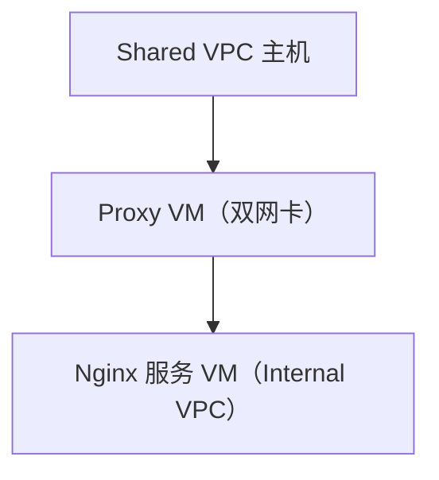
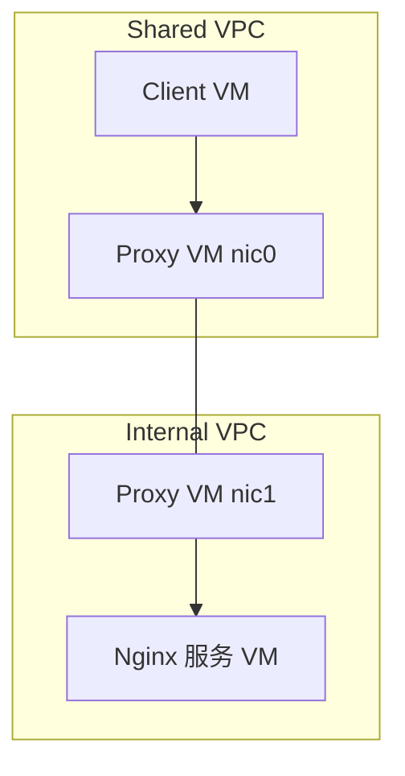
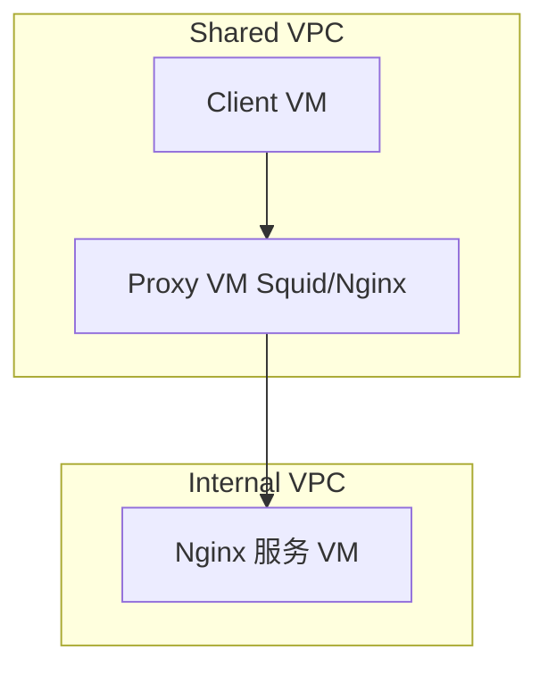
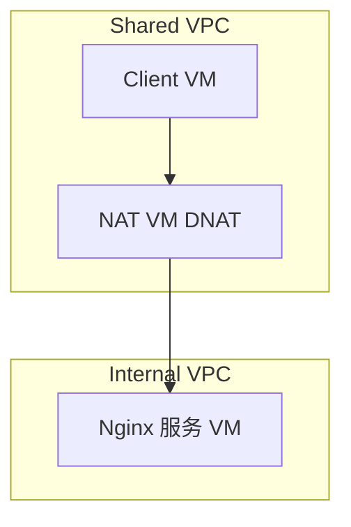
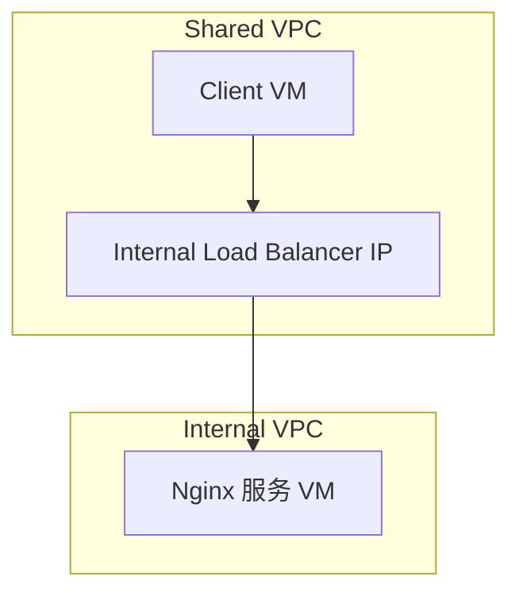

- [ ] 对于GCP而言 假设为了安全 网络之间做了隔离 
    - [ ] 1 有shared vpc 也有internal vpc 假设服务部署在internal一台主机 直接是一个nginx 发布的服务
    - [ ] 2 如果要暴露内网internal 服务供shared vpc 网络其他主机访问
    - [ ] 3 软件可以是nginx 或者squid 
    - [ ] 如果仅限于用instance 来实现还有什么方式？ 比如nat ? Using static route?
    - [ ] 先从网络上帮我分析可行的方案 然后细化可能的nginx squid 配置 

# Chatgp 

下面是针对此 GCP 场景的完整分析：**Internal VPC 的服务（Nginx）如何供 Shared VPC 网络访问**，前半部分是网络层分析，后半部分是 Nginx / Squid 配置细节。

---

## **一、网络层可行方案（基于仅使用 VM 实例）**

  

### **前提条件**

- **Internal VPC 与 Shared VPC 是隔离的，没有 VPC Peering 或 Shared Subnet**。
    
- **只能使用 GCE 实例（VM）作为转发点或服务入口**。
    
- **目标是让 Shared VPC 网络访问 Internal VPC 中的服务（Nginx）**。
    

---

### **方案一：中转 Proxy VM（双网卡） + 静态路由**

  

> 在一台 Proxy VM 上配置两块网卡，分别连接 Shared VPC 与 Internal VPC



- **Proxy VM 配置双网卡**：
    
    - nic0：连接 Shared VPC
        
    - nic1：连接 Internal VPC
        
    
- **Shared VPC 配静态路由**：
    
    - 指定访问 Internal VPC 中 Nginx 的私有地址时，通过 Proxy VM 的 nic0 IP。
        
    
- **Internal VPC 防火墙**：
    
    - 允许来自 Proxy VM 的访问。
        
    

---

### **方案二：Squid/Nginx 转发（Proxy 方式）**

  

> 只要 Proxy VM 可以访问 Internal VM，可用软件转发流量

  

- **在 Proxy VM 上配置 Squid 或 Nginx 为 forward proxy**，让 Shared VPC 主机通过它访问目标服务。
    
- **适用于：** HTTP、HTTPS 应用层协议，适合只暴露应用（非所有端口）。
    

---

### **方案三：自建 NAT 实例（iptables SNAT/DNAT）**

  

> 在 Proxy VM 上配置 iptables 实现 NAT

  

- **适用于共享 VPC 网络访问 Internal 服务时地址映射或中转**。
    
- 配置 DNAT 把来自 Shared VPC 的请求转发给 Internal Nginx。
    
- 配置 SNAT 保证返回路径正常（否则 Internal VM 无法识别源地址）。
    

---

## **二、Proxy 实例配置示例**

  

### **1. Squid 作为 Forward Proxy（适合 HTTP 请求）**

  

#### **安装**

```
sudo apt update
sudo apt install squid -y
```

#### **配置** 

#### **/etc/squid/squid.conf**

```
http_port 3128
acl allowed_network src 10.10.0.0/16  # Shared VPC 网段
http_access allow allowed_network
http_access deny all
```

#### **启动并开放防火墙**

```
sudo systemctl restart squid
gcloud compute firewall-rules create allow-squid \
  --network=shared-vpc-network \
  --allow tcp:3128 \
  --source-ranges=10.10.0.0/16
```

---

### **2. Nginx 作为反向代理（适合应用服务层转发）**

  

#### **安装**

```
sudo apt update
sudo apt install nginx -y
```

#### **配置** 

#### **/etc/nginx/conf.d/proxy.conf**

```
server {
    listen 8080;
    location / {
        proxy_pass http://internal-nginx-vm.internal-vpc.local;
    }
}
```

#### **开放端口并重启**

```
sudo systemctl restart nginx
gcloud compute firewall-rules create allow-nginx-proxy \
  --network=shared-vpc-network \
  --allow tcp:8080 \
  --source-ranges=10.10.0.0/16
```

---

### **3. iptables 实现 NAT 转发（底层方式）**

```
# 假设 Proxy VM:
# - eth0 连接 Shared VPC（10.10.0.0/16）
# - eth1 连接 Internal VPC（192.168.0.0/16）

# 启用转发
echo 1 > /proc/sys/net/ipv4/ip_forward

# 转发流量到 Internal VM 的 Nginx 服务
iptables -t nat -A PREROUTING -i eth0 -p tcp --dport 8080 -j DNAT --to-destination 192.168.0.10:80
iptables -t nat -A POSTROUTING -o eth1 -j MASQUERADE
```

---

## **总结对比**

|**方案**|**优点**|**缺点**|**推荐场景**|
|---|---|---|---|
|双网卡 Proxy VM + 静态路由|原生转发，网络透明|配置复杂，需要管理路由|内部服务需要完整访问|
|Squid Proxy|简单易用，适合 HTTP|限制协议类型|应用层转发（HTTP/S）|
|Nginx 反向代理|灵活支持服务路由|只适用于应用服务|部署 API 网关式中转|
|iptables NAT|协议不受限，性能高|复杂，调试难|底层透明流量转发|

---

需要我帮你出一张拓扑图或详细配置文件模板吗？

以下是 **在 GCP 中实现 Shared VPC 访问 Internal VPC 服务的不同方案拓扑图**，使用 Mermaid Markdown 格式表示：

---

### **方案一：双网卡 Proxy VM + 静态路由**



---

### **方案二：Proxy VM 上运行 Squid/Nginx（单网卡，Internal 可达）**



---

### **方案三：自建 NAT 实例（iptables DNAT 转发）**



---

### **方案四：使用 GCP Internal Load Balancer（如允许）**



---

如需进一步细化某个方案（比如 iptables 配置、负载均衡器设置），可以继续告诉我。你更倾向于哪种方式？


下面是基于 **GCP 环境中使用双网卡 Proxy VM + 静态路由** 的详细设计与操作指南，并包含具体的 Nginx 配置作为服务转发的手段。

---

## **一、场景目标**

  

> 将 Internal VPC 中的一台只监听私网 IP 的 Nginx 服务，通过位于 Shared VPC 与 Internal VPC 之间的 **双网卡 Proxy VM** 暴露给 Shared VPC 中的客户端访问。

---

## **二、网络架构拓扑（Mermaid 图）**


---

## **三、详细实现步骤**

  

### **1. 创建 Proxy VM（双网卡）**

- 网卡1：绑定 Shared VPC 子网（如：shared-subnet）
    
- 网卡2：绑定 Internal VPC 子网（如：internal-subnet）
    

  

#### **创建命令（示例）：**

```bash
gcloud compute instances create proxy-vm \
  --zone=us-central1-a \
  --machine-type=e2-small \
  --subnet=shared-subnet \
  --network-interface subnet=internal-subnet \
  --tags=proxy
```

---

### **2. Internal VPC 中的 Nginx 服务 VM 设置**

- 假设 IP 为：10.20.0.10
    
- Nginx 服务监听 10.20.0.10:8080
    

---

### **3. Proxy VM 上安装并配置 Nginx（作为反向代理）**

  

#### **安装 Nginx**

```
sudo apt update
sudo apt install nginx -y
```

#### **配置** 

#### **/etc/nginx/sites-available/reverse-proxy.conf**

```
server {
    listen 8080;
    server_name _;

    location / {
        proxy_pass http://10.20.0.10:8080;
        proxy_set_header Host $host;
        proxy_set_header X-Real-IP $remote_addr;
        proxy_set_header X-Forwarded-For $proxy_add_x_forwarded_for;
    }
}
```

#### **启用配置**

```
sudo ln -s /etc/nginx/sites-available/reverse-proxy.conf /etc/nginx/sites-enabled/
sudo nginx -t
sudo systemctl reload nginx
```

---

### **4. 配置 Shared VPC 静态路由（可选）**

  

如果要让 Shared VPC 的客户端以 Internal IP 方式访问 Nginx 服务，可添加静态路由：

```
gcloud compute routes create route-to-internal-nginx \
  --network=shared-vpc-network \
  --destination-range=10.20.0.10/32 \
  --next-hop-instance=proxy-vm \
  --next-hop-instance-zone=us-central1-a
```

> 该路由可确保流量经 Proxy VM 进入 Internal VPC 的服务。

---

### **5. 防火墙配置**

- **允许 Shared VPC 到 Proxy VM 的访问**
    
- **允许 Proxy VM 到 Internal VPC 的 Nginx 端口访问**
    

```
# Shared VPC to Proxy VM
gcloud compute firewall-rules create allow-shared-to-proxy \
  --network=shared-vpc-network \
  --allow tcp:8080 \
  --target-tags=proxy \
  --source-ranges=10.10.0.0/16

# Proxy VM to Nginx 服务
gcloud compute firewall-rules create allow-proxy-to-nginx \
  --network=internal-vpc \
  --allow tcp:8080 \
  --source-tags=proxy \
  --destination-ranges=10.20.0.10/32
```

---

## **四、访问方式**

  

Shared VPC 中的客户端可直接请求：

```
http://<proxy-vm-nic0-ip>:8080/
```

该请求会经由 Nginx 转发到 Internal VPC 中的 Nginx 服务。

---

如你希望代理更多路径、支持 TLS、或使用 Squid 转发等，我可以继续提供配置补充。是否需要同时支持 HTTPS 或多后端？

