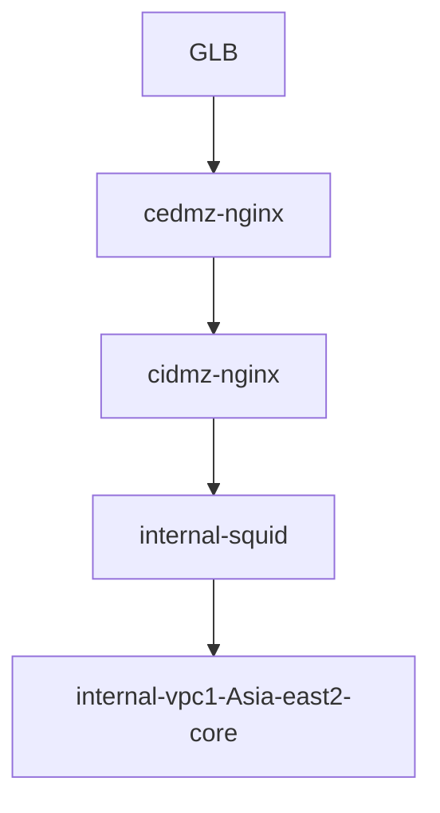
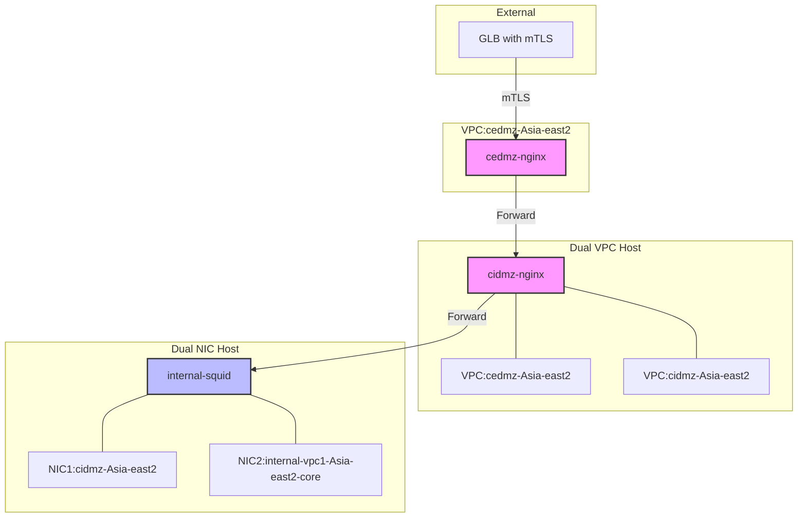
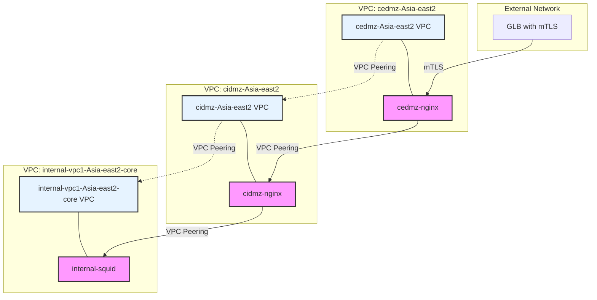

- [describe](#describe)
- [Generate](#generate)
- [Detail](#detail)
    - [流量流转说明](#流量流转说明)
    - [网络隔离说明](#网络隔离说明)

# describe 
**我们现在有这样一个需求**
我们目前使用google的GLB配置的TCP。后面配置为了满足双向验证也就是MTLS 
我们有网络有严格的限制大概Flow如下
GLB ==> CEDMZ网络里配置了一个nginx 我们暂时叫做cedmz-nginx 比如其对应的VPC是cedmz-Asia-east2是一个单网卡的主机
然后这个主机会将请求转发到另一个主机 我们叫cidmz-nginx 其对应的VPC是cedmz-Asia-east2 和cidmz-Asia-east2
然后我们会再一次跳转到下一跳是squid ,我们叫internal-squid 这个Squid又有2块网卡一个是cidmz-Asia-east2 另一个是internal-vpc1-Asia-east2-core 
帮我整理这个Flow 最好

# Generate 

1.	GLB (Google Load Balancer) 接收外部流量。
-	2.	流量进入 CEDMZ 网络，并经过名为 cedmz-nginx 的 Nginx 主机（VPC：cedmz-Asia-east2）。
-	3.	cedmz-nginx 将请求转发至另一台 Nginx 主机 cidmz-nginx，这台主机跨越两个 VPC（cedmz-Asia-east2 和 cidmz-Asia-east2）。
-	4.	然后流量跳转至 Squid 代理 internal-squid，该 Squid 配置了两个网卡，分别是：cidmz-Asia-east2 和 internal-vpc1-Asia-east2-core。

我将其可视化为 Mermaid 流程图，您可以参考以下格式：

这个流程图简洁地展示了每个组件之间的流量流转路径。如果您有进一步的细节或需要更复杂的图示，我可以根据需求调整。

# Detail
用更详细的 Mermaid 图表来展示这个流程，包括网卡和 VPC 的关系：

### 流量流转说明

1. **外部流量入口**
   - GLB (Google Load Balancer)
   - 配置了 mTLS 双向认证
   
2. **第一跳：CEDMZ 网络**
   - 主机：cedmz-nginx
   - 网络配置：
     - 单网卡
     - VPC：cedmz-Asia-east2

3. **第二跳：CIDMZ 网络**
   - 主机：cidmz-nginx
   - 网络配置：
     - 双 VPC 接入
     - VPC 1：cedmz-Asia-east2
     - VPC 2：cidmz-Asia-east2

4. **第三跳：内部网络**
   - 主机：internal-squid
   - 网络配置：
     - 双网卡
     - NIC 1：cidmz-Asia-east2
     - NIC 2：internal-vpc1-Asia-east2-core

### 网络隔离说明

1. **DMZ 区域划分**
   - CEDMZ：外部可访问区域
   - CIDMZ：中间隔离区域
   - Internal：内部网络区域

2. **VPC 连接关系**
   - cedmz-Asia-east2 ←→ cidmz-Asia-east2
   - cidmz-Asia-east2 ←→ internal-vpc1-Asia-east2-core

这种网络设计实现了多层安全隔离，通过 mTLS、多级代理和网络分区来保护内部资源。

创建一个更聚焦于 VPC 网络关系的流程图：

这个图的特点：
1. 清晰展示了三个 VPC 之间的关系
2. 用虚线表示 VPC 之间的对等连接（VPC Peering）
3. 每个服务都被放在其对应的 VPC 中
4. 用不同的颜色区分 VPC 和服务
5. 保留了流量的流向，但更强调网络架构

这样的展示方式更容易理解整个网络架构和 VPC 之间的连接关系。