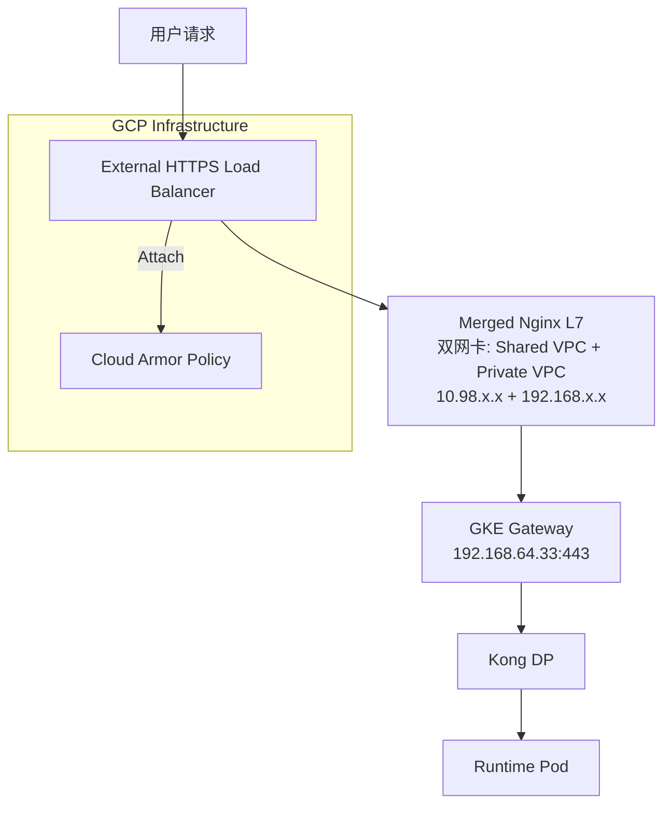
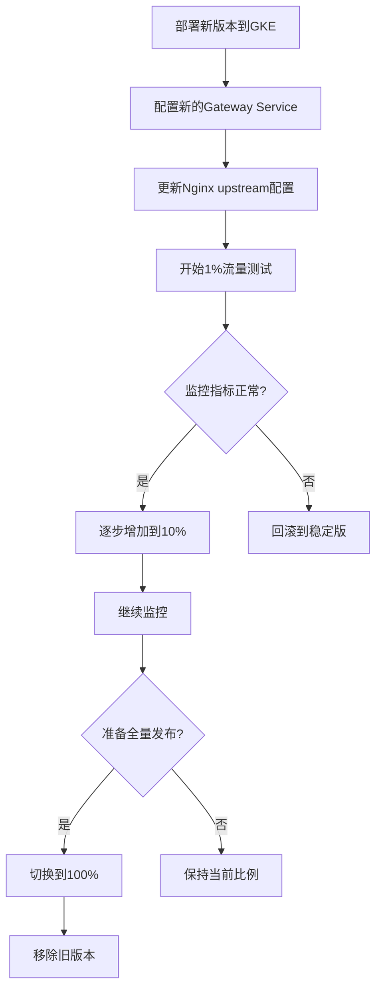

# 架构优化总结：HTTPS负载均衡器 + Cloud Armor + 金丝雀部署实施方案

## 1. 核心目标明确

基于当前架构分析，我们的核心目标是：

### 1.1 安全增强目标
- **使用 HTTPS + Cloud Armor**: 为特定的API（如 `/api_name1_version/v1/`, `/api_name2_version/v1/`）应用Cloud Armor规则
- **精细化防护**: 不是全局应用，而是针对特定API路径的安全策略

### 1.2 部署策略目标  
- **实现金丝雀部署**: 基于当前架构探索蓝绿部署或金丝雀部署的可能性
- **平滑迁移**: 零停机时间的架构升级

### 1.3 架构约束
- **必须保留Kong**: 不能直接使用GKE Gateway API简化流量路径
- **必须保留Nginx**: 作为流量处理的核心组件

## 2. 当前架构分析

### 2.1 现有流量路径
```
用户请求 → TCP GLB → Nginx A (L7, 10.98.x.x) → Nginx B (L4, 双网卡) → GKE Gateway (192.168.64.33) → Kong DP → GKE RT
```

### 2.2 架构痛点
- **Cloud Armor无法应用**: TCP GLB是4层负载均衡器，无法理解HTTP流量，不能附加Cloud Armor策略
- **架构复杂**: A→B→Gateway链条增加延迟和故障点
- **部署策略难实现**: 流量控制分散在多个组件中，难以自动化

## 3. 优化方案设计

### 3.1 分步实施策略

我们采用**两步走**的平滑迁移策略：

#### 第一步：合并Nginx A和B组件
#### 第二步：创建HTTPS GLB并通过DNS切换

### 3.2 最终目标架构



## 4. 第一步：合并Nginx A和B组件

### 4.1 核心思路
将Nginx A配置为**双网卡**，直接连接两个VPC网络：
- **nic0**: Shared VPC (10.98.x.x) - 接收来自负载均衡器的流量
- **nic1**: Private VPC (192.168.x.x) - 直接与GKE Gateway通信

### 4.2 配置变更

#### 原配置（通过Nginx B中转）
```nginx
# Nginx A 配置
location /api_name1_version/v1/ {
    proxy_pass https://10.98.0.188:8081/;  # 指向Nginx B
    proxy_set_header Host www.aibang.com;
    proxy_set_header X-Real-IP $remote_addr;
}
```

#### 新配置（直接连接GKE Gateway）
```nginx
# Merged Nginx 配置
location /api_name1_version/v1/ {
    proxy_pass https://192.168.64.33:443;  # 直接指向GKE Gateway
    proxy_set_header Host www.aibang.com;
    proxy_set_header X-Real-IP $remote_addr;
}
```

### 4.3 实施步骤
1. **准备新的双网卡Nginx实例**
2. **配置网络路由**: 确保能够访问两个VPC网络
3. **迁移配置**: 将Nginx A的配置迁移到新实例
4. **测试验证**: 确保流量正常转发
5. **切换流量**: 更新负载均衡器后端指向新实例
6. **清理**: 移除Nginx B实例

## 5. 第二步：升级到HTTPS负载均衡器

### 5.1 创建HTTPS负载均衡器

```bash
# 创建健康检查
gcloud compute health-checks create http nginx-health-check \
    --port=80 \
    --request-path=/health

# 创建后端服务
gcloud compute backend-services create nginx-backend-service \
    --protocol=HTTP \
    --health-checks=nginx-health-check \
    --global

# 创建URL映射
gcloud compute url-maps create unified-map \
    --default-service=nginx-backend-service

# 创建SSL证书
gcloud compute ssl-certificates create app-ssl-cert \
    --domains=www.aibang.com

# 创建HTTPS代理
gcloud compute target-https-proxies create unified-https-proxy \
    --url-map=unified-map \
    --ssl-certificates=app-ssl-cert

# 创建转发规则（分配新的静态IP）
gcloud compute forwarding-rules create unified-forwarding-rule \
    --global \
    --target-https-proxy=unified-https-proxy \
    --ports=443
```

### 5.2 配置Cloud Armor策略

```bash
# 创建Cloud Armor策略
gcloud compute security-policies create api-protection-policy \
    --description="API specific protection policy"

# 添加特定API的防护规则
gcloud compute security-policies rules create 1000 \
    --security-policy=api-protection-policy \
    --expression="request.path.matches('/api_name1_version/v1/.*')" \
    --action=deny-403 \
    --description="Block specific API attacks"

gcloud compute security-policies rules create 1001 \
    --security-policy=api-protection-policy \
    --expression="request.path.matches('/api_name2_version/v1/.*')" \
    --action=rate-based-ban \
    --rate-limit-threshold-count=100 \
    --rate-limit-threshold-interval-sec=60 \
    --description="Rate limit for API name2"

# 默认允许规则
gcloud compute security-policies rules create 2147483647 \
    --security-policy=api-protection-policy \
    --action=allow \
    --description="Default allow rule"

# 将策略附加到后端服务
gcloud compute backend-services update nginx-backend-service \
    --security-policy=api-protection-policy \
    --global
```

## 6. 金丝雀部署实现

### 6.1 在合并后的Nginx中配置流量切分

```nginx
http {
    # 定义稳定版和金丝雀版上游
    upstream api_name1_stable {
        server 192.168.64.33:443;  # 稳定版GKE Gateway
    }
    
    upstream api_name1_canary {
        server 192.168.64.34:443;  # 金丝雀版GKE Gateway  
    }
    
    # 流量分割规则 - 基于客户端IP和请求ID确保一致性
    split_clients "$remote_addr$request_id" $api_name1_backend {
        10%     api_name1_canary;   # 10%流量到金丝雀
        *       api_name1_stable;   # 90%流量到稳定版
    }
    
    server {
        listen 80;
        server_name www.aibang.com;
        
        # 健康检查端点
        location /health {
            access_log off;
            return 200 "healthy\n";
            add_header Content-Type text/plain;
        }
        
        # API路由配置
        location /api_name1_version/v1/ {
            proxy_pass https://$api_name1_backend;
            proxy_set_header Host www.aibang.com;
            proxy_set_header X-Real-IP $remote_addr;
            proxy_set_header X-Forwarded-For $proxy_add_x_forwarded_for;
            proxy_set_header X-Forwarded-Proto $scheme;
            
            # 添加版本标识用于监控
            add_header X-Backend-Version $upstream_addr always;
        }
        
        location /api_name2_version/v1/ {
            # 可以为不同API配置不同的金丝雀策略
            proxy_pass https://$api_name1_backend;
            proxy_set_header Host www.aibang.com;
            proxy_set_header X-Real-IP $remote_addr;
        }
    }
}
```

### 6.2 金丝雀部署流程



## 7. DNS平滑切换方案

### 7.1 切换策略
采用"并行部署，DNS切换"的零停机策略：

1. **保留现有TCP LB**: 继续服务现有流量
2. **并行运行HTTPS LB**: 使用新的静态IP地址
3. **内部测试验证**: 直接访问新IP进行功能测试
4. **DNS记录切换**: 将域名解析切换到新IP
5. **监控和清理**: 确认切换成功后清理旧资源

### 7.2 实施步骤

```bash
# 1. 降低DNS TTL（切换前24小时执行）
# 在DNS提供商处将TTL从3600秒降低到300秒

# 2. 获取新HTTPS LB的IP地址
NEW_LB_IP=$(gcloud compute forwarding-rules describe unified-forwarding-rule \
    --global --format="value(IPAddress)")

# 3. 内部测试
curl -H "Host: www.aibang.com" https://$NEW_LB_IP/api_name1_version/v1/test

# 4. 验证Cloud Armor
curl -H "Host: www.aibang.com" https://$NEW_LB_IP/api_name1_version/v1/malicious_request

# 5. DNS切换（在DNS提供商处执行）
# 将 www.aibang.com 的A记录从旧IP更新为 $NEW_LB_IP

# 6. 监控切换进度
watch -n 30 'dig www.aibang.com +short'

# 7. 验证流量切换
# 监控新HTTPS LB的流量指标和旧TCP LB的流量下降
```

## 8. 监控和验证

### 8.1 关键监控指标
- **流量分布**: 监控稳定版vs金丝雀版的流量比例
- **错误率**: 对比两个版本的4xx/5xx错误率
- **响应时间**: 监控P95/P99响应时间变化
- **Cloud Armor**: 监控安全策略的触发情况

### 8.2 回滚策略
```nginx
# 紧急回滚：将所有流量切回稳定版
split_clients "$remote_addr$request_id" $api_name1_backend {
    0%      api_name1_canary;   # 关闭金丝雀流量
    *       api_name1_stable;   # 100%流量到稳定版
}
```

## 9. 实施时间线

### 阶段一：架构简化（预计1-2周）
- [ ] 准备双网卡Nginx实例
- [ ] 配置网络连接和路由
- [ ] 迁移和测试配置
- [ ] 执行流量切换
- [ ] 清理Nginx B组件

### 阶段二：HTTPS升级（预计1周）
- [ ] 创建HTTPS负载均衡器
- [ ] 配置Cloud Armor策略
- [ ] 内部测试验证
- [ ] DNS切换执行
- [ ] 监控和优化

### 阶段三：金丝雀部署（持续）
- [ ] 配置流量分割
- [ ] 建立监控体系
- [ ] 制定发布流程
- [ ] 团队培训和文档

## 10. 预期收益

### 10.1 安全增强
- **边缘防护**: Cloud Armor在网络边缘提供安全防护
- **精细控制**: 针对特定API的定制化安全策略
- **实时防护**: 自动化的攻击检测和阻断

### 10.2 架构优化
- **简化架构**: 减少一个组件，降低复杂度
- **降低延迟**: 消除一次网络转发
- **成本节约**: 减少一台虚拟机的费用

### 10.3 部署能力
- **风险控制**: 金丝雀部署降低发布风险
- **快速回滚**: 秒级的流量切换能力
- **渐进发布**: 可控的流量比例调整

这个方案在保持现有Kong和Nginx架构的基础上，实现了所有核心目标，并提供了清晰的实施路径和回滚策略。