# 架构流程图集合 - All Flow Charts

本文档包含了完整的架构设计、实施流程和部署策略的可视化图表，便于理解和记录整个系统架构。

## 1. 架构演进概览

### 1.1 当前架构 vs 目标架构对比

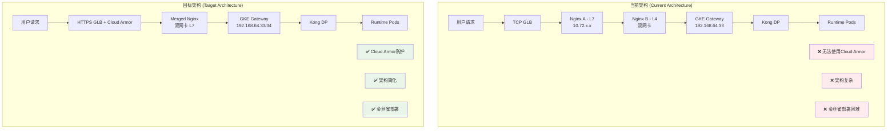

### 1.2 架构演进时间线

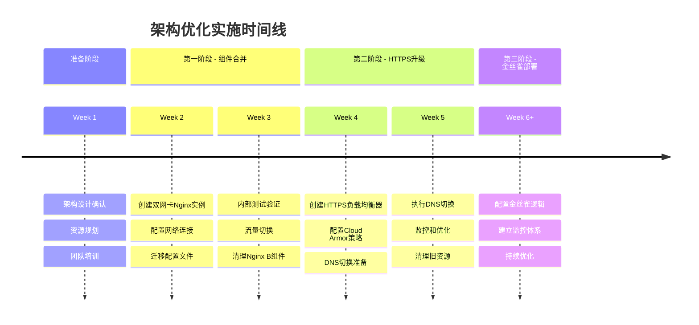

## 2. 详细架构流程图

### 2.1 最终目标架构详图

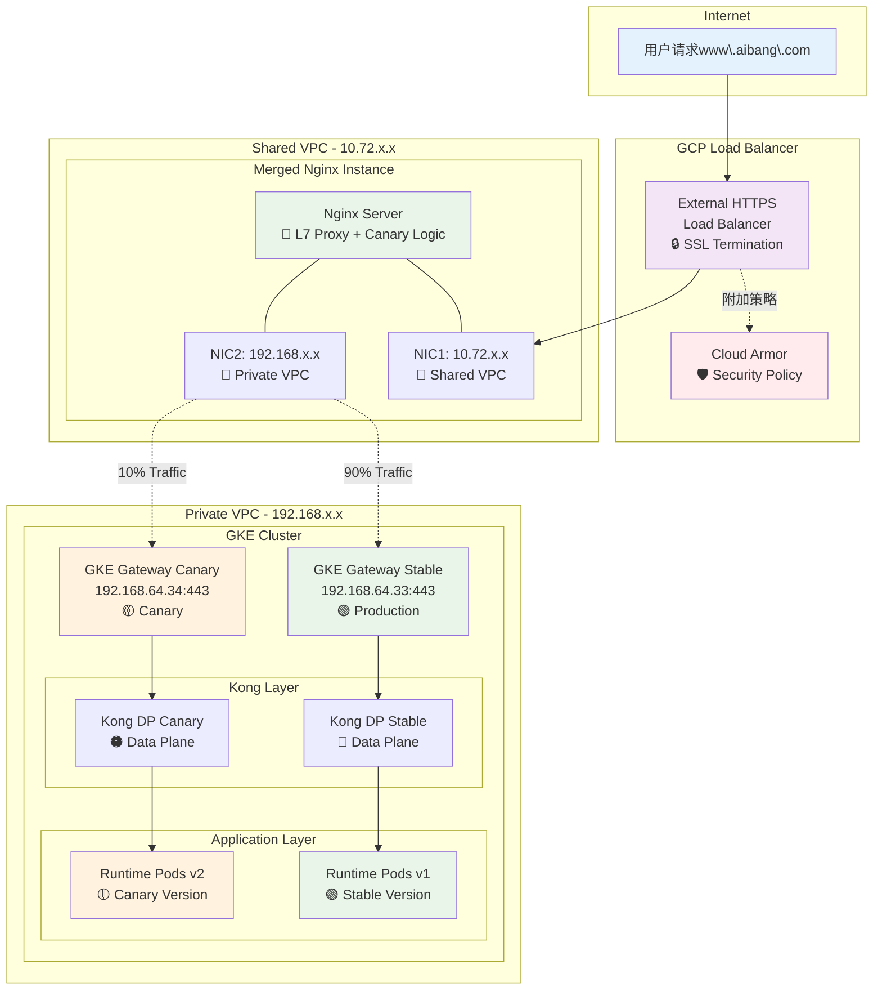

### 2.2 网络拓扑图

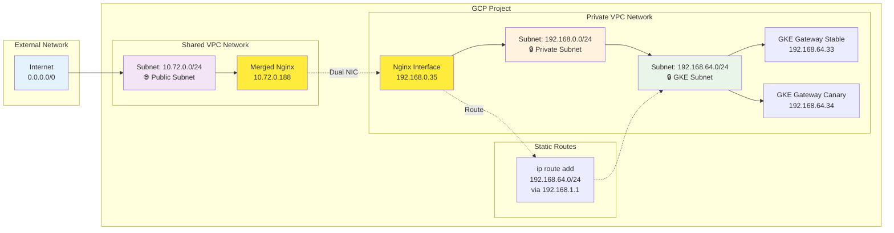

## 3. 请求流程序列图

### 3.1 正常请求流程

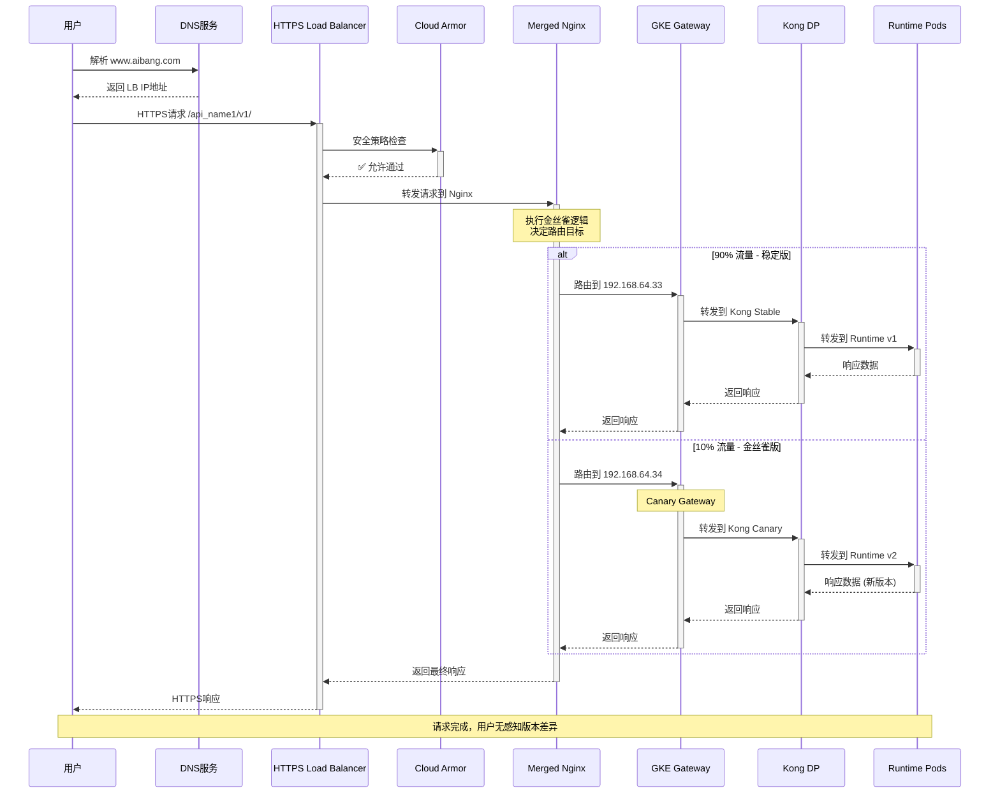

### 3.2 Cloud Armor 拦截流程

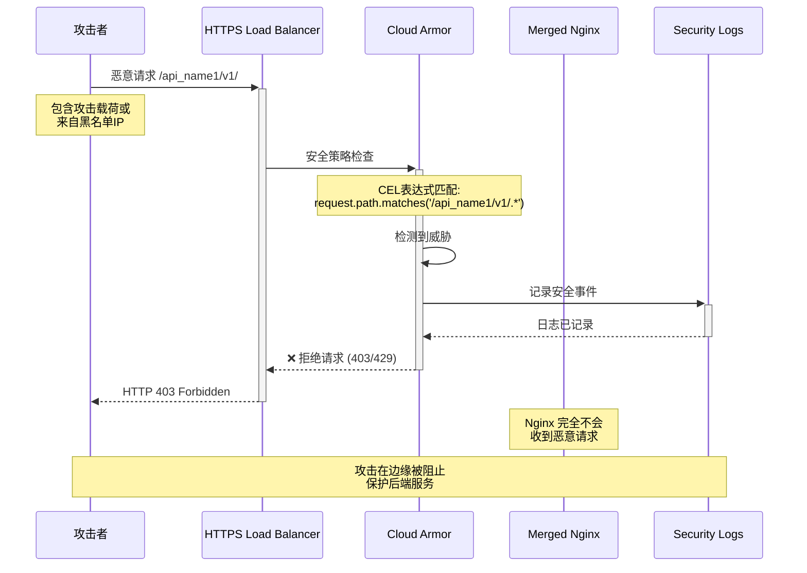

## 4. 金丝雀部署流程图

### 4.1 金丝雀部署决策流程

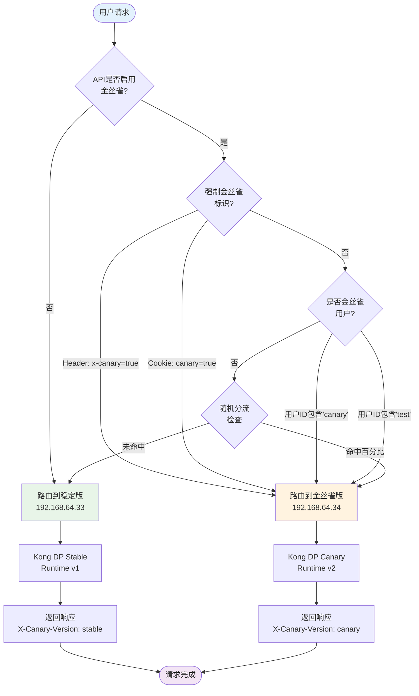

### 4.2 多 API 金丝雀配置架构

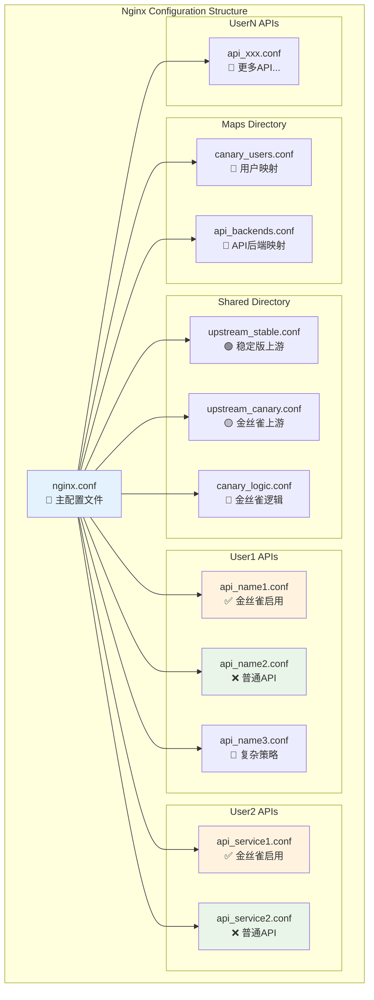

### 4.3 金丝雀发布生命周期

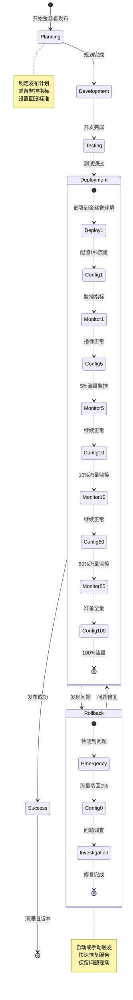

## 5. 实施流程图

### 5.1 第一阶段：组件合并流程

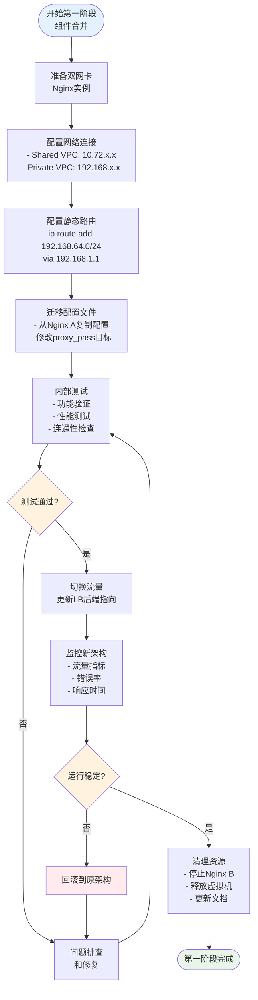

### 5.2 第二阶段：HTTPS 升级流程

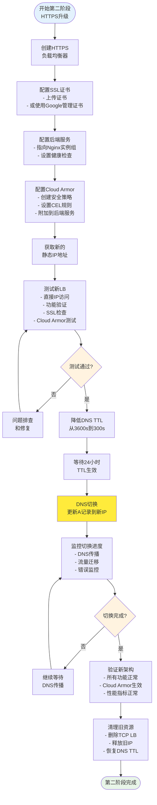

### 5.3 DNS 切换详细流程

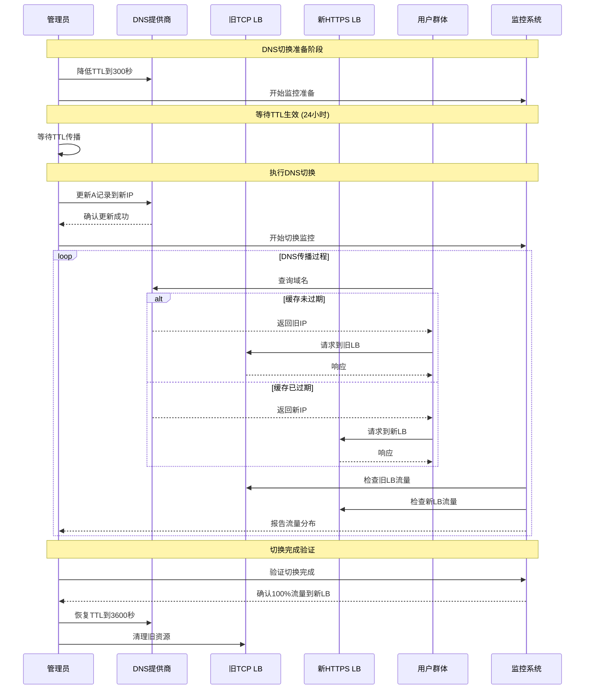

## 6. 监控和告警流程

### 6.1 金丝雀监控仪表板

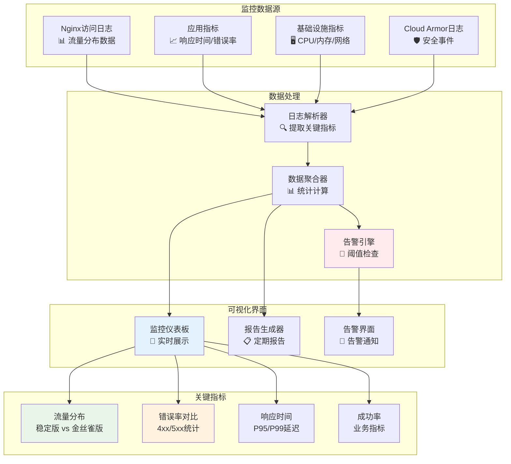

### 6.2 自动回滚流程

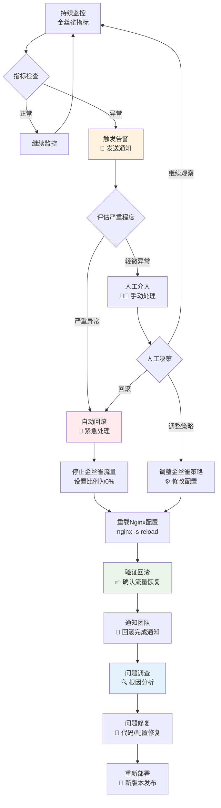

## 7. 安全防护流程

### 7.1 Cloud Armor 防护层级

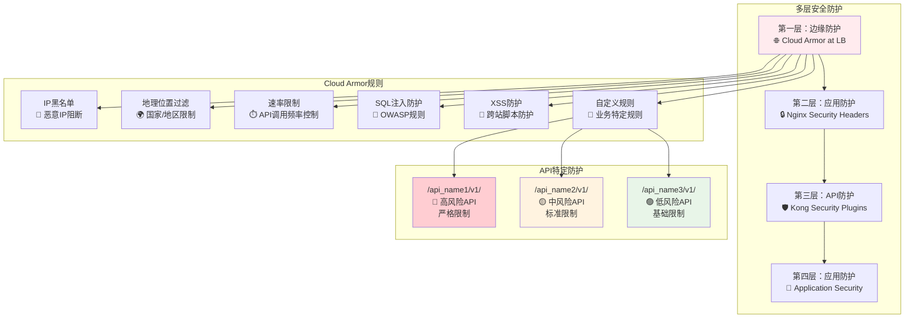

### 7.2 安全事件处理流程

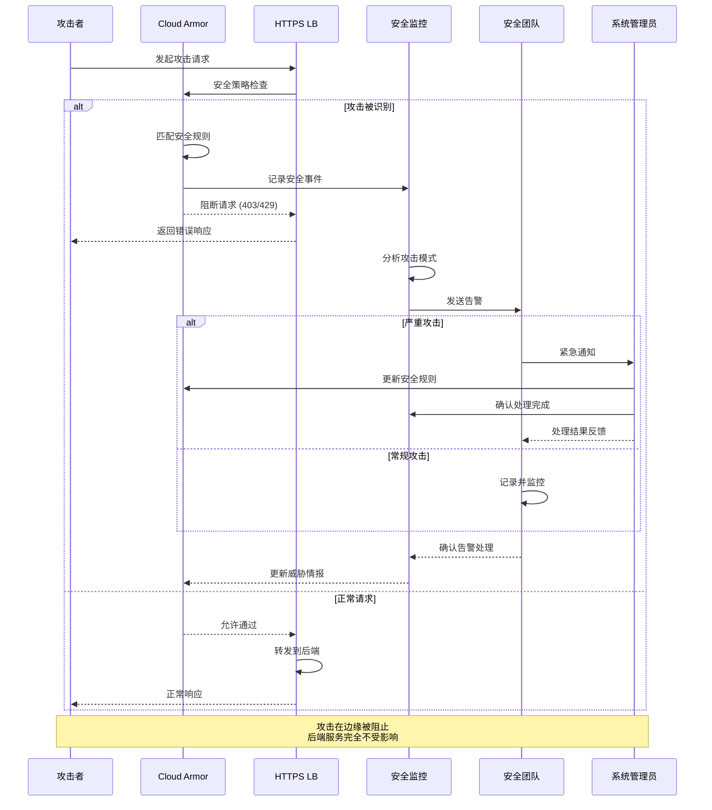

## 8. 性能优化流程

### 8.1 性能监控和优化循环

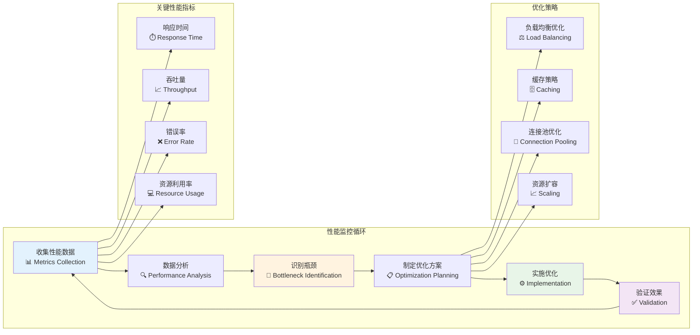

## 9. 总结

本文档通过多种 Mermaid 图表类型，全面展示了：

### 🏗️ **架构设计**

- 当前架构 vs 目标架构对比
- 详细的网络拓扑和组件关系
- 分阶段实施的演进路径

### 🔄 **流程管控**

- 完整的请求处理流程
- 金丝雀部署的决策逻辑
- DNS 切换的详细步骤

### 🛡️ **安全防护**

- 多层安全防护体系
- Cloud Armor 的防护机制
- 安全事件的处理流程

### 📊 **监控运维**

- 实时监控和告警机制
- 自动回滚的触发条件
- 性能优化的持续改进

这些图表不仅便于技术团队理解架构设计，也为项目管理和决策提供了清晰的可视化参考。每个图表都可以独立使用，也可以组合起来形成完整的架构文档体系。
